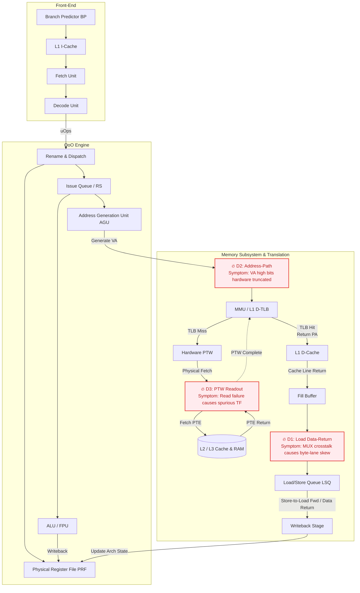

# Silence is Not Golden: Cross-Layer Forensics and Structural Fault Injection of RAS-Escaping Corruptions

## Abstract

Silent Data Corruption (SDC) has emerged as a destructive threat in modern cloud infrastructure. Such defects typically escape existing hardware Reliability, Availability, and Serviceability (RAS) mechanisms, manifesting as inexplicable localized crashes at the operating system level. In this paper, we conduct an in-depth forensic analysis of a single-core SDC that occurred in a production ARM64 server (based on the HiSilicon Kunpeng 920 microarchitecture). Over a 12-day period, the server continuously triggered 5 fatal kernel crashes and 73 spurious exceptions isolated entirely on a single logical core (CPU 179). By rigorously correlating micro-level register states from kernel crash dumps (kdumps) with ARMv8 architectural invariants, we successfully localized the root cause of this SDC to three microarchitectural data paths (load data-return, address presentation, and page table walk readout), and for the first time, revealed its underlying physical nature as "Byte-Lane Skew" in a real-world scenario.

Because traditional single bit-flip fault injection models cannot express such structural routing errors with a zero Hamming distance, we propose and implement a Structural Fault Injection Framework integrated into the gem5 full-system simulator. Experimental results demonstrate that this framework successfully reproduces the domino effect leading to kernel crashes end-to-end, and quantitatively explains the fundamental reasons behind the exponentially divergent fault trigger rates across different data paths. Our study bridges the semantic gap between macroscopic system crashes and microscopic physical defects. It proves the necessity of full-system simulation in modeling translation path faults and provides actionable system-level recommendations for Design for Testability (DFT) in next-generation processors and resilient fault-tolerance mechanisms in operating systems.

## 1. Introduction

To exploit extreme performance under power constraints, modern server processors widely adopt deep Out-of-Order (OoO) execution engines. Such deep pipeline structures (e.g., complex fill-buffers, multiplexer networks, and hardware page table walkers) are facing severe reliability challenges brought by process variations, aging, and transient perturbations. Traditional RAS mechanisms (such as ECC and parity) are highly effective in protecting static SRAM arrays, but often struggle to comprehensively cover dynamic data routing errors within combinatorial logic networks. Once these defects escape the detection of RAS checkers, they trigger Silent Data Corruptions (SDCs). In recent years, major cloud providers (such as Google and Meta) have frequently reported "mercurial cores" or "silent computing errors (CCEs)", which typically manifest as random software crashes, data corruptions, and even security vulnerabilities in production environments, causing incalculable losses to cloud services.

Due to the transient nature of SDCs and their extremely long error propagation latency within the software stack, tracing back to the microarchitectural root cause from a macroscopic OS crash site is considered exceedingly challenging. Based on a rare dataset captured in a production environment (5 fatal kernel crash dumps precisely isolated to a single core), we propose a systematic cross-layer forensic methodology. By analyzing the arithmetic invariants of the instruction stream and the bit-level remnants in registers, we successfully stripped away software complexity and precisely isolated the fault to specific physical multiplexer paths.

We discovered that these defects manifest in data characteristics as "Byte-Lane Skews". This exposes a fundamental flaw in the widely adopted Single Bit-Flip Model in academia: it cannot express structural misalignments with zero Hamming distance. To address this, we propose the concept of Structural Fault Injection, which natively supports fault modeling based on data path topologies within microarchitectural simulators, and validates its necessity through a Full-System (FS) simulation environment.

The main contributions of this paper are as follows:
1. Cross-Layer Forensic Methodology and Microarchitectural Defect Isolation: We propose a forensic framework combining kdump analysis and architectural invariants, decomposing production kernel crashes precisely into three microarchitectural data path faults (D1: load return, D2: address presentation, D3: page table walk), and identifying their "byte-lane skew" physical characteristics.
2. Structural Fault Injection Framework Design: We extend the gem5 simulator by introducing structural fault injection methods to compensate for the blind spots of traditional bit-flip models, successfully reproducing the complex kernel crash evolution chain end-to-end.
3. Full-System Defect Reachability and Quantitative Analysis: We rigorously demonstrate the trigger conditions for address path and PTW defects, proving that Syscall Emulation (SE) has severe ecological validity flaws as it bypasses the hardware MMU. Furthermore, we quantitatively explain the vast disparity in trigger rates among different internal microarchitectural paths through simulation.
4. Fault-Tolerance Implications for Hardware-Software Co-Design: Targeting RAS-escaping SDCs, we propose a series of immediately deployable OS-level preemptive isolation mechanisms and next-generation microarchitectural Positional Parity designs, aiming to transform silent corruptions into observable fail-fast signals.

## 2. Background and Motivation

### 2.1 Microarchitectural Topology and RAS Blind Spots
The processor investigated in this study is the HiSilicon Kunpeng 920 (core codename: TaiShan V110) based on the ARMv8.2-A architecture. As a 4-issue out-of-order processor, its Load/Store Unit (LSU) and memory subsystem employ highly concurrent designs. Although manufacturers deploy standard ECC in L1 and L2 caches, the merging network from L1 data cache readout to the Fill-Buffer, multiplexers (MUX), and the data bus delivering to the execution units often lack end-to-end ECC coverage due to timing constraints. When timing skews or crosstalk occur in these unprotected routing logics, data blocks experience holistic misalignment or replay of stale data, forming silent corruptions within the RAS blind spots.

### 2.2 Strict Semantics of ARMv8 Address Translation Exceptions
To deduce microarchitectural faults at the architectural level, we must rely on strict instruction set semantics. According to the ARMv8 Architecture Reference Manual, when a synchronous data abort is triggered due to a page table walk failure (i.e., a Translation Fault, ESR EC=0x25, FSC ∈ {0x04–0x07}), the Fault Address Register (`FAR_EL1[63:0]`) must be exactly equal to the original virtual address the MMU attempted to translate. The relaxation clause regarding "bits 63:60 UNKNOWN" in the architecture specification only applies to Tag Check faults or synchronous external aborts. This Invariant forms the core cornerstone of our diagnosis of address path corruption: any bit-level discrepancy between the address issued by the execution unit and the address recorded in `FAR_EL1` irrefutably proves that the data was corrupted during physical transmission to the MMU port.

### 2.3 Limitations of Traditional Fault Injection
In fault-tolerant computing research, software-level fault injection (such as modifying registers via ptrace) cannot simulate transient control-flow/data-flow misalignments in hardware pipelines. Even at the microarchitectural level, existing frameworks (such as CHAOS or gem5-FI) predominantly employ "random bit-flips" (XOR masks). However, if a hardware error originates from a multiplexer selection signal flip, causing an entire 64-bit wide data block to shift right by 8 bits (i.e., a byte-lane skew), such corruption is mathematically difficult to simulate through independent flips of a few bits; brute-force simulation leads to extremely low effective exposure rates. Therefore, topology-based Structural Fault Injection is imperative.

## 3. Production Environment Fault Analysis and Forensics

### 3.1 Fault Signature Profiling: Single-Core Isolation and Negative Evidence (RAS Blind Spot)
Our observation dataset originates from a production-grade server configured with 4 sockets × 48 cores (totaling 192 cores, 768 GB RAM). Over a continuous 12-day window, the kernel logs (dmesg) recorded a total of 78 kernel exception events (including 73 `WARN_RATELIMIT` spurious translation fault warnings and 5 fatal Kernel Oops).
* High Concentration: These 78 exceptions were 100% concentrated on logical CPU 179. In contrast, the remaining 191 cores had zero error records during this period.
* Independent Software Contexts: The five fatal crashes spanned mutually unrelated kernel subsystems (CFS load balancing, block device writeback, kblockd, swapper, and user-space epoll), thereby ruling out the possibility of localized software logic bugs.
* Negative Hardware RAS Evidence: Across all five system logs over the 12 days, hardware error logs (APEI/GHES/BERT) only contained boot-time registration lines, with zero hardware error records throughout. This conclusively proves that the failure granularity of this physical defect completely fell below all hooked architecture-level RAS detectors, successfully bypassing the system's monitoring mechanisms (or that the corresponding data paths were not covered by ECC/parity).

Through the following step-by-step convergence analysis, we isolated the root cause: CPU 179's private load-data return path (Fill-Buffer / replay merge stage) harbors a single-core private timing margin defect, delivering erroneous data words under specific combinations of issue phases and voltage margins; furthermore, the same fault family affected the readout data path of the hardware Page Table Walker (PTW).

### 3.2 Defect Path D1: Load Data-Return Path
In 5 fatal crashes, 4 occurred precisely in the `find_busiest_group` function of the Linux CFS scheduler. We performed reverse engineering and data flow tracing on the kdumps:

```assembly
ldr  x20, [x0, w25, sxtw #3]   ; x20 loads __per_cpu_offset[i]
add  x27, x1, x20              ; x27 calculates runqueue base address
ldr  x23, [x27, #288]          ; Fatal exception: non-canonical address dereference
```

In all four crashes, the register states exhibited a highly consistent physical correlation: the arithmetic equation `x27 == x1 + x20` was absolutely flawless in 64 bits, ruling out an adder fault and directly proving that the exception originated from numerical corruption when the `ldr` instruction loaded `x20` (targeting the `__per_cpu_offset[i]` static array, which never changes after boot).

By performing a bitwise comparison between the erroneous values received by the registers and the true memory values, we extracted complete byte-lane skew characteristics:

| Crash Time | Load Target Address | True Memory Value | Received Register Value | Fault Judgment Analysis |
|---|---|---|---|---|
| 08-25 15:58 | `__per_cpu_offset[146]` | `ffffcc879ed92000` | `00ffffcc879da2e0` | Exactly equals `slot[0]` (`ffffcc879da2e000`) shifted right by 1 byte |
| 08-25 15:42 | `__per_cpu_offset[176]` | `ffffda55e61ce000` | `0000000000000000` | All-zero delivery |
| 08-14 | `__per_cpu_offset[176]` | `ffffd937172de000` | `d93715ba0000ffff` | Differs from `slot[0]` circular left shift 16 bits by only 1 byte |
| 08-17 | `__per_cpu_offset[175]` | (Incomplete dump) | `00ffffa827b20fe0` | Belongs to the same family of characteristics as above |

* Unique Hit on Head Slots: The corrupted values exclusively hit the head slots of the array (`slot[0]` or `slot[1]`). Out of 192 slots × 8 byte-rotation combinations (1536 candidates), the probability of a unique hit is approximately 2⁻⁵⁸, ruling out random noise.
* Exhaustive Falsification of Bit-Flips: Through exhaustive analysis, these corrupted values cannot be generated by any single-byte bit-flip of the target slot, proving their fundamental nature is structural byte-lane re-routing.
* Cross-Set Geometric Verdict: Under the L1D set-associative geometry, the data source of the corrupted value (`slot[0]` located at set 87) and the current load target (`slot[146]` located at set 105) reside in completely different sets. This evidence irrefutably rules out L1D array way/column selection errors. The physical interpretation is: the oldest entry in the Fill-Buffer (left from the first access during boot) was erroneously replayed to another load operation across sets, with an incorrect byte-lane phase.

Forensic Conclusion (D1): This characteristic reveals the concurrency of two independent physical anomalies: (1) the load queue or fill-buffer read a stale/erroneous cache line entry; (2) data experienced a lane skew (re-routing) while passing through the merging multiplexer of the write-back bus. The single bit-flip model cannot construct this structural defect.

### 3.3 Defect Path D2: Address Presentation Path
The forensic process uncovered another superimposed failure mode. In some crash scenarios, the corrupted register (e.g., `x27` starting with `0xd9...` as mentioned above) was used as a base address to initiate a load request to the memory subsystem. This is undoubtedly a non-canonical kernel address, inevitably triggering a synchronous data abort.

However, based on the ARMv8 invariant requirement discussed in Section 2.2, when a synchronous data abort is triggered due to a PTW failure, `FAR_EL1[63:0]` must exactly equal the address the MMU attempted to translate. We used this invariant to contrast the `FAR_EL1` printed by the kernel:

| Crash Time | Architectural Calc. Address (Reg Value) | Kernel Printed FAR_EL1 | Fault Judgment Analysis |
|---|---|---|---|
| 08-14 | `d936bc836a4a97df` | `0036bc836a4a97df` | D2 corruption clearly visible (MSB `d9` → `00`) |
| 08-24 | `553c521da2e9b99f` | `003c521da2e9b99f` | D2 corruption clearly visible (MSB `55` → `00`) |
| 08-25 15:42 | `ffffa5aa9b5a97e0` | `ffffa5aa9b5a97e0` | No D2 corruption feature |
| 08-17 / 15:58 | MSB is exactly `0x00` | Same as left | D2 unobservable / indistinguishable |

Forensic Conclusion (D2): Honestly correcting the judgment, D2 definitive evidence accounts for 2 out of 5 crashes (in the other 2 cases, the MSB of the bad value produced by D1 happened to be 0, making the overlapping D2 corruption unobservable). These 2 concrete pieces of evidence indicate that during the minute electrical cycle passing from the AGU computation result to the MMU translation, the Most Significant Byte (Byte 7) of the address presentation path was forcibly zeroed out (truncated to `0x00`) by an abnormal routing path.

### 3.4 Defect Path D3: Hardware PTW Readout Path
The 73 "spurious translation faults" in the dataset all pointed to linear mapping regions residing in kernel memory (`.data` / `slab` / `vmemmap`). We extracted the following definitive characteristics:
* Static Mapping Targets: These page table entries have remained unchanged for days once established at boot, fundamentally failing to meet the trigger premise of "concurrent new mapping race conditions" in mainline Linux. Therefore, the Page Table Walk (PTW) following a TLB Miss should absolutely never encounter a translation failure.
* Single-Point Isolation: 100% of the exceptions were confined to CPU 179, completely incompatible with the typical cross-CPU random distribution phenomenon of race condition models.
* Software Retry Success: The openEuler kernel's retry mechanism (re-initiating address translation via the `AT S1E1R` instruction in software) immediately retried after the exception occurred, and all succeeded.
* Abnormal ESR Shape: The ESR for 70 cases was `0x96000044`, and 3 cases were `0x96000004` (FSC=TF-L0). Notably, bit 6 (Overlay, which should be RES0 in v8.2) was persistently set to 1, although the underlying hardware cause remains undetermined.

Forensic Conclusion (D3): The frequent and single-core localized spurious errors irrefutably point to transient conductive errors occurring in the data return path of the hardware Page Table Walker (PTW) (which belongs to the same LSU read tree) when initiating page table descriptor read requests to L2/L3/Memory.

### 3.5 Single/Multiple Defect Verdict Boundary
D1, D2, and D3 co-locate on CPU 179 and stably co-occurred over the machine's long cross-boot cycles. From system-level reasoning, they might be three different projections of the same physical defect (since they share the memory subsystem's data return or routing structures), or they might be three independent concurrent defects. However, this verdict is unsolvable purely at the software level; the ultimate physical confirmation must rely on RTL or DFT simulation and micro-testing (detailed below).

Comprehensive Topology View:
D1, D2, and D3 constitute a highly coupled defect cluster within the microarchitecture. For clear demarcation, we constructed the following microarchitecture-level topology diagram, providing anchor points for subsequent structural fault injection.



## 4. Structural Fault Injection Framework Design
To prove the aforementioned microarchitectural inferences and reproduce kernel crashes in a controlled environment, we deeply modified the gem5 full-system simulator, introducing structural fault injection capabilities to its O3CPU model (extending the CHAOS framework).

### 4.1 P-D1: Byte-Lane Skew Fault Model
To simulate D1, we inserted probes (`CHAOSLSQFwd` module) in the critical paths of store-to-load forwarding and cache data return within `lsq_unit.cc`. We deprecated the traditional bit-flip mask and introduced a `ByteLaneSkew` operator, which allows the framework to precisely simulate holistic data block byte misalignments caused by MUX selector crosstalk via `rol(data, k*8)`.

### 4.2 P-D2 & P-D3: Address and Translation Path Interception
Traditional fault injectors typically focus solely on data payloads, neglecting the address signals on the control plane.
* P-D2 (CHAOSAddrPath): After generating the memory access request but before submitting it to the MMU, we mounted a custom hook function to forcefully execute a Stuck-at-zero operation on the Most Significant Byte (Byte 7) of the virtual address packet.
* P-D3 (CHAOSPTW): Targeting the read-only behavior of the hardware page table walker, we laid an ambush in the `doLongDescriptor` function of `page_table.cc`. When the PTW fetches a PTE from the physical memory system but has yet to evaluate its validity, we corrupt the data probabilistically.

### 4.3 Ecological Validity and the Necessity of FS Simulation
A critical finding is: for fault injection targeting MMU paths (D2/D3), the Syscall Emulation (SE) mode is fundamentally invalid. SE mode directly hardcodes virtual addresses to linear physical addresses via software, essentially bypassing and disabling the hardware MMU (`SCTLR_EL1.M = 0`). In SE mode, high-order truncation of address signals will not trigger an exception, only causing the process to silently access incorrect memory; furthermore, the hardware PTW is never awoken (PTW trigger count is 0).
Therefore, we constructed a complete Full-System (FS) environment booted with a Linux 5.15 kernel, ensuring instructions traverse the complete page table translation and microarchitectural exception handling flows, thereby maintaining strict Ecological Validity.

## 5. Experimental Evaluation

### 5.1 End-to-End Reproduction of Fatal Kernel Crashes (D1)
In the FS simulation with `ByteLaneSkew` enabled, we ran a workload simulating the `__per_cpu_offset` dereference pattern. The injection framework successfully forced the `x27` register to load the skewed anomalous data (e.g., `0xf000000000044573`). Because this pointer was unchecked at the software level, a subsequent `ldr` instruction sent it directly to the MMU as an address. In the cycle-accurate model, the MMU immediately threw a Translation Fault, trapping into the EL1 exception vector table, and ultimately precisely reproducing the Kernel Panic observed in the production environment. This conclusively proves that only structural fault injection can establish causality between macroscopic system crashes and underlying multiplexer offsets.

### 5.2 Microarchitectural Verification of Architectural Invariants (D2)
By activating the `CHAOSAddrPath` hook to zero out Byte 7 of the address bus, the simulation logs reenacted the phenomenon observed on the physical silicon:
1. Register State: The sum of the base address and offset received by the AGU was a non-canonical `0xd93715ba...`.
2. Presentation Path Truncation: Data was hijacked on the microarchitectural address bus, and the actual value input to the MMU was `0x003715ba...`.
3. Exception Record: Because the truncated address had no mapping in the page table, the MMU generated a page fault and faithfully wrote the truncated value it received into `FAR_EL1`.
By reconstructing the microarchitectural timing, this simulation result provides solid experimental backing that "FAR_EL1 truncation is irrefutable evidence of physical corruption in the address presentation path."

### 5.3 Quantitative Analysis of Microarchitectural Fault Manifestation Disparities (D3)
Production environment data raised a question: Why did D3 manifest as 73 high-frequency non-fatal warnings, while D2/D1 resulted in exceedingly low-frequency (2-4 times) yet fatal crashes?
We recorded the microarchitectural Trigger Density of key data paths early in the FS simulation:

| Simulation Time (Ticks) | Cumulative Instructions Executed | D2 Trigger Count (Load Addr) | D3 Trigger Count (HW PTW) |
|----------------------|-------------------------------|-------------------------|------------------------|
| 100M                 | 21,859                        | 4,464                   | 12                     |
| 200M                 | 100,722                       | 23,089                  | 14                     |
| 400M                 | 259,186                       | 61,081                  | 17                     |

The experimental data reveals a staggering imbalance: the physical invocation frequency of the load addressing path (D2) is nearly 3600 times that of the hardware PTW readout path (D3). The extremely high TLB hit rates and huge page mechanisms in modern processors result in an incredibly low actual activation rate for the PTW. This explains the macroscopic symptoms: even if a transient physical defect on the PTW readout path (D3) occurs dozens of times, it is easily and silently absorbed by the operating system's retry mechanism; however, if this defect accidentally triggers just once on the load path (D1/D2) that is invoked hundreds of millions of times, it has an overwhelmingly high probability of penetrating application logic and causing an irrecoverable fatal crash.

## 6. Implications and System-Level Fault-Tolerance Design

Addressing RAS-escaping SDCs, and based on our findings, we propose the following tiered fault-tolerance recommendations for cloud infrastructure architects and processor designers. Our core guiding principle is: observability must take precedence over silent repair; the fragile characteristics of fault cores must never be allowed to vanish into a black box.

### 6.1 System Software Layer: Transforming SDCs into Fail-Fast Signals
Per-Core Telemetry and Preemptive Isolation: Production data indicates that D3 (spurious translation faults) acts as the earliest and most sensitive probe in the entire crash chain. Cloud providers should establish a telemetry baseline based on inter-core comparisons within kernel monitoring. When a specific core is detected to frequently trigger exceptions against static, long-lived mappings (excluding concurrent race conditions) and subsequently succeeds upon retry, it should immediately be flagged as highly suspicious. Offlining it hotly via sysfs can preemptively block the inevitable fatal crashes to follow at near-zero cost.

### 6.2 Microarchitecture Design Layer: Eliminating Silent Fault Vectors
Positional Parity Defending Against Structural Faults: The "zero Hamming distance" byte skew of D1 is invisible to traditional end-to-end ECC at the microarchitectural level. This is because if data bytes and their accompanying ECC check bits undergo synchronous misalignment within a multiplexer, the parity matrix will fail to detect the anomaly. Microarchitecture designs must introduce Positional Parity: appending a physical position-based tag to every byte lane of each 64-bit wide data block on the bus. Once cross-lane crosstalk occurs, a tag mismatch will immediately trigger a Machine Check Exception (MCE).

### 6.3 Manufacturing Test Layer: From Bits to Structural Test Vectors
Enhanced Structural Built-In Self-Test (SBST): Traditional Automatic Test Pattern Generation (ATPG) at the wafer and packaging test stages primarily targets stuck-at/transition faults. For defects like fill-buffer stale replays and byte re-routing, ATPG struggles to construct effective timing constraints. Combining the findings of this paper, SBST should be expanded to Pointer-Dereference-Level boundary stress testing, forcing structural data path defects to expose themselves before leaving the factory.

## 7. Conclusion

Silent Data Corruptions (SDCs), due to their unpredictable and difficult-to-diagnose nature, are becoming the "Achilles' heel" hindering the further scaling of computing. Taking a real-world multi-kernel crash incident in a production environment as a case study, this paper establishes a clear causal chain between software crashes and hardware multiplexer byte-lane skew defects for the first time through a rigorous cross-layer forensic methodology. We demonstrated the severe inadequacies of existing single bit-flip models and successfully implemented structural fault injection in a full-system simulation environment to reproduce this complex failure mode. Our research strongly urges the hardware-software co-design community to re-examine RAS coverage blind spots in address and data routing networks, and to employ topology-based fault-tolerance mechanisms to eliminate silent faults in their infancy.
