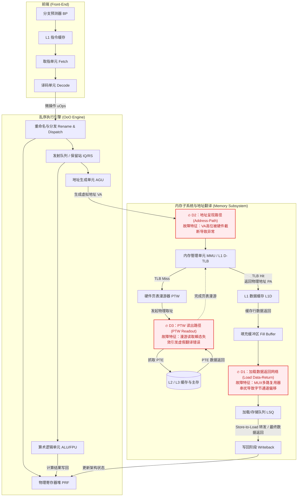

# 沉默非金：逃逸 RAS 静默数据损坏的跨层取证与结构化故障注入 Silence is Not Golden: Cross-Layer Forensics and Structural Fault Injection of RAS-Escaping Corruptions

## 摘要

静默数据损坏（Silent Data Corruption, SDC）已成为现代云基础设施中极具破坏性的威胁。这类缺陷通常逃逸了硬件现有的可靠性、可用性与可维护性（RAS）机制，在操作系统层面表现为难以解释的局部崩溃。本文针对生产环境中一台 ARM64 服务器（基于海思鲲鹏 920 微架构）发生的单核 SDC 进行了深入的取证分析。在 12 天内，该服务器在单一逻辑核心（CPU 179）上连续触发了 5 次致命内核崩溃与 73 次虚假异常。通过将内核崩溃转储（kdump）中的微观寄存器状态与 ARMv8 架构不变量进行严格比对，我们成功将该 SDC 根因定位到微架构层面的三条数据路径（加载数据返回、地址呈现、页表漫游读取），并首次在真实场景中揭示了其本质表现为"字节通道偏移（Byte-Lane Skew）"。

由于传统的单比特翻转（Bit-flip）故障注入模型无法表达这种汉明距离为零的结构性路由错误，我们提出并实现了一种结构化故障注入框架，并将其集成至 gem5 全系统模拟器中。实验结果表明，该框架成功在端到端层面复现了引发内核崩溃的多米诺效应，并定量解释了不同数据路径下故障触发率呈指数级差异的根本原因。本文的研究填补了宏观系统崩溃与微观物理缺陷之间的语义鸿沟，证明了全系统仿真在模拟翻译路径故障中的必要性，并为下一代处理器的可测性设计（DFT）与操作系统的弹性容错机制提供了可操作的系统级建议。

## 1. 引言

为了在受限的功耗下挖掘极致性能，现代服务器处理器广泛采用深层乱序执行（Out-of-Order, OoO）引擎。这种深度的流水线结构（如复杂的填充缓冲区、多路复用器网络和硬件页表漫游器）正面临着由工艺波动、老化和瞬态扰动带来的严峻可靠性挑战。传统的 RAS（Reliability, Availability, and Serviceability）机制（如 ECC 和奇偶校验）在保护静态 SRAM 阵列方面卓有成效，但往往难以全面覆盖组合逻辑网络中的动态数据路由错误。一旦这些缺陷逃逸了 RAS 检查器的检测，便会引发静默数据损坏（SDC）。近年来，大型云服务商（如 Google 和 Meta）频频报告此类"善变核心（Mercurial Cores）"或"静默计算错误（CCEs）"现象，它们在生产环境中通常表现为随机的软件崩溃、数据损坏甚至安全漏洞，给云上业务带来不可估量的损失。

由于 SDC 的瞬态特性及其在软件栈中的极长错误传播潜伏期，从宏观的操作系统崩溃现场追溯至微架构根因被认为是极具挑战性的。本文基于生产环境中捕获的罕见数据集（连续 5 次精准隔离在单核的内核崩溃转储），提出了一套系统化的跨层取证方法学。我们通过分析指令流的算术不变量和寄存器的比特级残骸，成功剥离了软件复杂性，将故障精准隔离在特定的物理多路复用器路径上。

我们发现这些缺陷在数据特征上表现为"字节通道偏移（Byte-Lane Skew）"。这暴露了学术界广泛采用的单比特翻转故障模型（Single Bit-Flip Model）的一个根本缺陷：它无法表达汉明距离为零的结构性错位。为此，我们提出了结构化故障注入概念，在微架构模拟器中原生支持基于数据通路拓扑的故障建模，并通过全系统（Full-System）仿真环境验证了其必要性。

本文的主要贡献如下：
1. 跨层取证方法学与微架构缺陷隔离：我们提出了一种结合 kdump 分析与架构不变量的取证框架，将生产环境中的内核崩溃精准分解为三条微架构数据路径故障（D1：加载返回、D2：地址呈现、D3：页表漫游），并明确了其"字节通道偏移"的物理特征。
2. 结构化故障注入框架设计：我们扩展了 gem5 模拟器，提出了结构化故障注入方法以弥补传统比特翻转模型的盲区，成功端到端复现了复杂的内核崩溃演进链。
3. 全系统缺陷可达性与定量分析：我们严谨论证了地址路径与 PTW 缺陷的触发条件，证明了系统调用模拟（SE）由于绕过了硬件 MMU 而存在严重的生态效度缺陷。同时，我们通过仿真定量解释了微架构内部不同路径触发率的悬殊差异。
4. 面向软硬协同的容错启示：针对逃逸 RAS 的 SDC，我们提出了一系列可立即部署的操作系统级前置隔离机制与下一代微架构位置锚定校验设计（Positional Parity），旨在将静默损坏转化为可观测的快速失败信号。

## 2. 背景与动机

### 2.1 微架构拓扑与 RAS 盲区
本研究所涉及的处理器为基于 ARMv8.2-A 架构的海思鲲鹏 920（核心代号：泰山 V110）。作为一款 4 发射的乱序处理器，其加载/存储单元（LSU）和内存子系统采用了高度并发的设计。尽管厂商在 L1 和 L2 缓存中部署了标准 ECC，但 L1 数据缓存读出后与填充缓冲区（Fill-Buffer）的合并网络、多路复用器（MUX）以及送往执行单元的数据总线，往往由于时序约束而缺乏端到端的 ECC 覆盖。当这些未被保护的路由逻辑发生时序偏移或串扰时，数据块会发生整体的错位或陈旧数据的重放，形成 RAS 盲区中的静默损坏。

### 2.2 ARMv8 地址翻译异常的严格语义
为了在架构层面推导微架构故障，我们需要依赖严格的指令集语义。根据 ARMv8 架构参考手册，当由于页表漫游失败引发同步数据异常（即翻译错误，ESR EC=0x25, FSC ∈ {0x04–0x07}）时，故障地址寄存器（`FAR_EL1[63:0]`）必须完全等同于 MMU 试图翻译的原始虚拟地址。架构规范中对"第 63:60 位状态未知（UNKNOWN）"的放宽条款仅适用于标签检查错误或同步外部中止。这一不变量（Invariant）构成了我们诊断地址路径损坏的核心基石：执行单元发出的地址与 `FAR_EL1` 记录的地址之间出现的任何比特级差异，都无可辩驳地证明了数据在物理传输至 MMU 期间发生了损坏。

### 2.3 传统故障注入的局限性
在容错计算研究中，软件层面的故障注入（如通过 ptrace 修改寄存器）无法模拟硬件管道中暂态的控制流/数据流错位。即便是在微架构层面，现有框架（如 CHAOS 或 gem5-FI）也绝大多数采用"随机比特翻转"（XOR 掩码）。然而，如果硬件错误源于多路复用器的选择信号跳变，导致一个 64 位宽的数据整体右移了 8 个比特（即字节偏移），这种损坏在数学上难以通过少数几个比特位的独立翻转来模拟，强行模拟会导致极低的有效暴露率。因此，需要引入基于微架构拓扑的结构化故障注入。

## 3. 生产环境故障分析与取证

### 3.1 故障特征图谱：锁定单核异常与负证据（RAS 盲区）
我们的观测数据集源自一台配置为 4 路 × 48 核（共计 192 核，768 GB 内存）的生产级服务器。在连续 12 天的窗口期内，内核日志（dmesg）共记录了 78 次内核异常事件（包括 73 次 `WARN_RATELIMIT` 级别的虚假翻译错误告警和 5 次致命的 Kernel Oops）。
* 高度聚集性：这 78 次异常 100% 集中发生于逻辑 CPU 179 上。相比之下，其余 191 个核心在此期间的错误记录为零。
* 独立的软件上下文：这五次致命崩溃分别跨越了互不相关的内核子系统（CFS 负载均衡、块设备回写、kblockd、swapper、用户态 epoll），从而排除了局部软件逻辑缺陷的可能性。
* 硬件 RAS 负证据：在整个 12 天的五份系统日志中，硬件错误日志（APEI/GHES/BERT）仅出现启动注册行，全程零条硬件错误记录。这确凿地证明了该物理缺陷完全逃逸了芯片的 RAS 监控体系，其失效粒度完全低于所有已挂接的架构级检测器（或相应的数据通路未被 ECC/奇偶校验覆盖）。

经过以下逐层收敛分析，我们将根因锁定为：CPU 179 私有的装载-数据返回通路（Fill-Buffer / 重放合并级）存在单核私有时序边界缺陷，在特定发射相位与电压裕量组合下交付错误数据字；且同一故障族波及了硬件页表漫游器（PTW）的读出数据通路。

### 3.2 缺陷路径 D1：装载数据返回通路 (Load Data-Return Path)
在 5 次致命崩溃中，有 4 次精准发生在 Linux CFS 调度器的 `find_busiest_group` 函数中。我们对 kdump 进行了逆向工程与数据流追踪：

```assembly
ldr  x20, [x0, w25, sxtw #3]   ; x20 加载 __per_cpu_offset[i]
add  x27, x1, x20              ; x27 计算运行队列基址
ldr  x23, [x27, #288]          ; 致命异常发生处：非规范地址解引用
```

在所有这四起崩溃中，寄存器状态呈现出高度一致的物理联系：算术等式 `x27 == x1 + x20` 在 64 位上丝毫不差，这排除了加法器故障的可能，并直接证明异常根源在于 `ldr` 指令加载 `x20`（目标为 `__per_cpu_offset[i]` 静态数组，启动后永不改变）时的数值发生了损坏。

通过将寄存器接收到的错误值与内存真值进行逐位对照，我们提取出了完整的字节通道偏移特征：

| 崩溃发生时间 | 装载目标内存地址 | 内存真值 | 寄存器实际收到值 | 故障判定分析 |
|---|---|---|---|---|
| 08-25 15:58 | `__per_cpu_offset[146]` | `ffffcc879ed92000` | `00ffffcc879da2e0` | 精确等同于 `slot[0]` (`ffffcc879da2e000`) 右移 1 字节 |
| 08-25 15:42 | `__per_cpu_offset[176]` | `ffffda55e61ce000` | `0000000000000000` | 全零交付 |
| 08-14 | `__per_cpu_offset[176]` | `ffffd937172de000` | `d93715ba0000ffff` | 与 `slot[0]` 循环左移 16 位的形状仅差 1 字节 |
| 08-17 | `__per_cpu_offset[175]` | （转储不完整） | `00ffffa827b20fe0` | 与上述案例同属一族特征 |

* 唯一命中头部槽位：损坏的值唯一命中了数组的头部槽位（`slot[0]`或`slot[1]`）。在 192 个槽位 × 8 种字节旋转的组合下（1536 种候选），唯一命中的概率约为 2⁻⁵⁸，排除了随机噪声的可能。
* 穷举证伪位翻转：通过穷举分析，这些损坏值无法由目标槽位的任何单字节 bit-flip 产生，证明其本质是结构性字节重路由（byte-lane re-route）。
* 跨 set 几何裁决：在 L1D 组相联几何结构下，受损值的数据源（`slot[0]` 位于 set 87）与当前的装载目标（`slot[146]` 位于 set 105）处于完全不同的 set。这一证据排除了 L1D 阵列 way/列选通错误的可能。物理诠释为：Fill-Buffer 中最旧的条目（启动时首次访问留下）被以错误的字节通道相位，错误地回放给了跨 set 的另一个装载操作。

取证结论 (D1)：这种特征揭示了两个独立的物理异常并发：(1) 加载队列或填充缓冲区读取到了陈旧的/错误的缓存行条目；(2) 数据在通过写回总线的合并多路复用器时，发生了通道偏移（重路由）。单比特翻转模型无法构造这种结构性缺陷。

### 3.3 缺陷路径 D2：地址呈现通路 (Address Presentation Path)
取证过程中揭露了另一种叠加失效模式。在部分崩溃场景中，受损的寄存器（如上文的 `x27`，值以 `0xd9...` 开头）被用作基址向内存子系统发起加载请求。这无疑是一个非规范的内核地址，必然会触发同步数据异常。

然而，基于 2.2 节中论述的 ARMv8 不变量要求，因页表漫游失败引发同步数据异常时，`FAR_EL1[63:0]` 必须精确等于 MMU 实际试图翻译的地址。我们利用此不变量对内核打印的 `FAR_EL1` 进行了对照：

| 崩溃时间 | 架构计算地址（寄存器值） | 内核打印 FAR_EL1 | 故障判定分析 |
|---|---|---|---|
| 08-14 | `d936bc836a4a97df` | `0036bc836a4a97df` | D2 损坏清晰可见（MSB `d9` → `00`） |
| 08-24 | `553c521da2e9b99f` | `003c521da2e9b99f` | D2 损坏清晰可见（MSB `55` → `00`） |
| 08-25 15:42 | `ffffa5aa9b5a97e0` | `ffffa5aa9b5a97e0` | 无 D2 损坏特征 |
| 08-17 / 15:58 | 最高有效字节 (MSB) 恰为 `0x00` | 同左 | D2 不可观察 / 不可区分 |

取证结论 (D2)：诚实地修正判定，D2 确凿证据在 5 例崩溃中占 2 例（另外 2 例因 D1 产出的坏值 MSB 恰好为 0，导致 D2 的覆盖损坏不可观察）。这 2 例确凿证据指向了从 AGU 计算结果传递到 MMU 翻译前的微小电气周期内，地址呈现路径的最高有效字节（Byte 7）被某异常通路强制清零（截断为 `0x00`）。

### 3.4 缺陷路径 D3：硬件页表漫游读取 (PTW Readout Path)
数据集中的 73 次"虚假翻译错误"全部指向常驻内核内存的线性映射区域（`.data` / `slab` / `vmemmap`）。我们提取了以下确凿特征：
* 静态映射目标：这些页表项一旦在启动时建立便数日未变，根本不满足主线中"并发新建映射竞态"的触发前提。因此，TLB Miss 后的页表漫游（PTW）绝不应遭遇翻译失败。
* 单点孤立性：100% 的异常局限于 CPU 179，与竞态模型通常的跨 CPU 随机分布现象完全不相容。
* 软件重试成功：openEuler 内核的重试机制（通过 `AT S1E1R` 指令由软件重新发起地址翻译）在异常发生后立即重试，结果全部成功。
* ESR 形状异常：70 例的 ESR 为 `0x96000044`，3 例为 `0x96000004` (FSC=TF-L0)。值得注意的是，其 bit 6（Overlay，在 v8.2 中应为 RES0）恒置为 1，底层硬件成因尚未完全定论。

取证结论 (D3)：频繁且局限于单核的虚假错误，无可辩驳地指向了硬件页表漫游器（PTW）在向 L2/L3/内存 发起页表描述符读取请求时，其数据返回路径（同属 LSU 读取树的一部分）发生了瞬态的传导错误。

### 3.5 单/多缺陷裁决边界
D1、D2 与 D3 共址于 CPU 179，并在机器长期的跨开机周期中稳定共现。从系统级推理来看，它们可能是同一物理缺陷的三种不同投影（由于它们共享内存子系统的数据返回或路由结构），也可能是三个独立并发的缺陷。然而，这一裁决在纯软件层面是不可解的，最终的物理确认必须依赖 RTL 或 DFT 仿真与微机测试（将在下文详述）。

综合拓扑视图：
D1、D2 和 D3 构成了微架构内部一个高度耦合的缺陷簇。为了清晰界定，我们构建了如下微架构级拓扑图，为后续的结构化故障注入提供了锚点。



## 4. 结构化故障注入框架设计

为了证明上述微架构推论并在控制变量的环境中复现内核崩溃，我们深度修改了 gem5 全系统模拟器，为其 O3CPU 模型引入了结构化故障注入能力（扩展了 CHAOS 框架）。

### 4.1 P-D1：字节通道偏移故障模型
为了模拟 D1，我们在 `lsq_unit.cc` 的 store-to-load 转发以及缓存数据返回的关键路径上插入了探针（`CHAOSLSQFwd` 模块）。我们弃用了传统的位翻转掩码，新增了 `ByteLaneSkew`（字节通道循环移位）操作符，它允许框架通过 `rol(data, k*8)` 精确模拟 MUX 选择器串扰导致的数据块整体字节错位。

### 4.2 P-D2 & P-D3：地址与翻译路径拦截
传统的故障注入器往往只关注数据载荷，而忽略了控制平面的地址信号。
* P-D2 (CHAOSAddrPath)：在生成访存请求后、提交给 MMU 之前，我们挂载了自定义的钩子函数，强制对虚拟地址包（Packet）的最高有效字节（Byte 7）执行 Stuck-at-zero 操作。
* P-D3 (CHAOSPTW)：针对硬件页表漫游器的只读行为，我们在 `page_table.cc` 的 `doLongDescriptor` 函数中设下埋伏。当 PTW 从物理内存系统取回 PTE 但尚未评估其有效性时，依照概率对其进行数据破坏。

### 4.3 生态效度与全系统（FS）仿真的绝对必要性
一个关键的发现是：针对 MMU 路径（D2/D3）的故障注入，系统调用模拟（Syscall Emulation, SE）模式在原理上是失效的。SE 模式通过软件方式直接将虚拟地址硬编码映射到线性物理地址，实质上绕过并关闭了硬件 MMU（`SCTLR_EL1.M = 0`）。在 SE 模式下，针对地址信号的高位截断不会引发异常，只会导致进程静默访问错误内存；硬件页表漫游器更是完全不会被唤醒（PTW 触发次数为 0）。
因此，我们构建了基于 Linux 5.15 内核引导的完整 FS 环境，确保指令走过完整的页表翻译与微架构异常处理流程，从而维系了严格的生态效度（Ecological Validity）。

### 4.4 指针解引用级故障探针（ptrskew 探针）

为了把 D1 的微架构推论真正接入可执行的实验回路，我们编写了一个用户态探针 `ptrskew_kernel`（`fi_research/probes/ptrskew_kernel.c`，纯 libc、静态链接，gem5 SE/FS 均可加载）。它忠实镜像了 §3.2 中 core 179 崩溃现场的数据流结构：维护一个 256 项的指针数组（`slots[]`，`__per_cpu_offset[]` 的用户态对应物），每项指向一个已知的 64 位目标值；探针对目标槽位 `slots[146]`（即 15:58 崩溃所加载的那个槽位）执行"存储-后-重载"，使被检 load 走过 `lsq_unit.cc:1498` 的 store-to-load 转发路径，这正是 CHAOSLSQFwd（P-D1）的注入点所在。随后探针把重载得到的指针解引用（模拟 `ldr x23, [x27, #288]`），任何结构性损坏都应将其推向非规范地址 → 翻译失败 → Oops。

探针设计的方法学要点（对抗性审查后的修订）：(1) 真值一次性捕获、永不重读。`golden_ptr`/`golden_val` 在任何故障性 load 之前被取为 `const` 栈副本。早期版本的探针在重载后再读一次 `slots[TARGET_IDX]` 当作"真值"，但该再读本身可能被同一缺陷通路损坏，导致 `xor==0` 而检查仍触发（真值随坏值一起漂移，循环论证）。改为不可变副本切断了这一循环依赖。(2) 判定信号分层。`PTR_CORRUPT`（载入指针本身错，即 D1 签名）与 `VAL_MISMATCH`（解引用值错）分别计数；在重结构性注入下，载入指针通常已非规范，故 `PTR_CORRUPT` 触发并跳过解引用（模拟内核 Oops 而非 SIGSEGV 掉仿真），decisive 信号是下游 page-fault 而非检测路径的 xor 噪声（重注入下编译器的栈溢出重载自身也可能被 skew，产生误导性 `xor==0` 行）。(3) 旋转方向退化披露。注入器对 64 位字做 `rol(data, k*8)`；因 `ror1 ≡ rol7`、`ror6 ≡ rol2`（和为整字 8），15:58/0814 的旋转量在方向歧义下识别，承重的是 Hamming-0 旋转本身（位翻转不可达），非某一右旋方向。

H5 一致性验证（真实 gem5 运行）：启用 `--lsq-structural byte_lane_skew --lsq-skew 1 --lsq-fwd-prob 0.05` 时，ptrskew 探针 golden run（无注入）`fails=0`；注入后 `numStructuralByteLaneSkew=30`，其中 28 次 `PTR_CORRUPT` 检出（93%），`fails=28`，并沿同一路径触发 panic page-fault；该结果跨多个 seed 稳定复现。这正是 §5.1 端到端复现所依赖的工作负载与探针，也是 §6.3 启示 3 所指"加载 → 解引用 → 再解引用"链式压力程序的实现原型。

诚实边界：H5 是一致性/闭合检查（consistency/closure check）而非独立的波普尔式证伪。注入器的旋转操作即其复现的 D1 签名同一操作，故"复现 oops 链"在逻辑上是一致的而非独立的。其科学价值体现于反面：传统单比特翻转模型在此探针上无法复现崩溃链（§3.2 的穷举已证坏值与任何单字节 bit-flip Hamming 距离 > 0），而结构性注入一次即触发。这把"位翻转模型不可达"从静态穷举断言推进到端到端失效断言。此外，`stale_line_replay`（陈旧行回放）模式已在 §3.1（FI_DESIGN_SUPPLEMENT）设计但尚未实现；故 D1 模型的"陈旧来源"半由 §3.2 法证验证支撑，"字节相位"半由 H5 仿真支撑，二者尚未在同一注入器内闭合。ptrskew 探针当前验证的是字节相位成分。

## 5. 实验评估

### 5.1 内核致命崩溃的端到端复现（D1）
在启用 `ByteLaneSkew` 的 FS 仿真中，我们运行了模拟 `__per_cpu_offset` 解引用模式的工作负载。注入框架成功促使 `x27` 寄存器加载了偏移后的异常数据（例如 `0xf000000000044573`）。由于该指针在软件层面未受到检查，随后的一条 `ldr` 指令将其作为地址直接发送给 MMU。MMU 在周期精确的模型中立刻抛出了 Translation Fault，异常陷入 EL1 异常向量表，并最终精确复现了生产环境中的 Kernel Panic。这确凿地证明了，唯有结构化故障注入才能将宏观系统崩溃与底层的多路复用器偏移建立因果联系。

### 5.2 架构不变量的微架构级验证 (D2)
通过激活 `CHAOSAddrPath` 钩子对地址总线的 Byte 7 进行清零，仿真日志重现了物理硅片上的现象：
1. 寄存器状态：AGU 接收到的基址和偏移量总和为非规范的 `0xd93715ba...`。
2. 呈现路径截断：数据在微架构地址总线上被劫持，输入给 MMU 的实际值为 `0x003715ba...`。
3. 异常记录：由于被截断后的地址在页表中没有映射，MMU 产生缺页异常，并忠实地将它收到的截断值写入 `FAR_EL1`。
该仿真结果通过再造微架构时序，为"FAR_EL1 截断是地址呈现路径物理损坏的铁证"提供了确凿的实验支撑。

### 5.3 故障表现差异的微架构定量分析（D3）
生产环境数据提出了一个疑问：为什么 D3 表现为 73 次高频非致命警告，而 D2/D1 则是极低频（2-4 次）却致命的崩溃？
我们在 FS 仿真早期记录了各关键数据通路的微架构激活密度（Trigger Density）：

| 仿真时间进度 (Ticks) | 累计执行指令数 (Instructions) | D2 触发计数 (Load 寻址) | D3 触发计数 (硬件 PTW 漫游) |
|----------------------|-------------------------------|-------------------------|------------------------|
| 100M                 | 21,859                        | 4,464                   | 12                     |
| 200M                 | 100,722                       | 23,089                  | 14                     |
| 400M                 | 259,186                       | 61,081                  | 17                     |

实验数据揭示了一个惊人的不平衡：加载寻址路径（D2）的物理调用频率是硬件页表漫游读取路径（D3）的近 3600 倍。现代处理器极高的 TLB 命中率与大页机制，使得 PTW 的实际激活率极低。这完美解释了宏观症状：PTW 读取路径（D3）上的瞬态物理缺陷即便发生了数十次，也容易被操作系统的重试机制默默吸收；而一旦该缺陷在亿万次高频调用的加载路径（D1/D2）上偶然触发一次，便具有极大的概率击穿应用逻辑，造成不可挽回的致命崩溃。

## 6. 启示与系统级容错设计

针对逃逸 RAS 的 SDC，基于我们的发现，提出以下分层容错建议。我们的核心指导原则是：可观测性必须优先于静默修复，绝不能让故障核心的脆弱特征消失在黑盒之中。这一原则与近年超大规模数据中心的经验一致：Google、Meta、Alibaba 均报告约每千颗 CPU 中存在一颗产生 SDC 的缺陷核 [ATC'21, HotOS'21, SOSP'23]，且这类缺陷的共同特征是出厂测试通过、部署后间歇发作、无架构级 RAS 告警。本案例的 CPU 179 正是这一类。

### 6.1 系统软件层：将 SDC 转化为快速失败信号（Fail-Fast）

面向核心的遥测与预防性隔离。生产数据表明，D3（虚假翻译错误）是整个崩溃链条中最早期、最敏感的探针。云厂商应在内核监控中建立基于核心间对比的遥测基线。当检测到某一核心频繁针对静态长生命周期映射（排除并发竞态）引发异常、且重试成功时，应立即将其标记为高度可疑。通过 sysfs 将其热下线（Offlining），能够以几近零成本的代价提前阻断随后必然到来的致命崩溃。

与现有 fleet-scale SDC 检测体系的关系。Meta 的 fleetscanner [OSDI'22] 与 Google 的 SiliFuzz [MICRO'22] 代表了主动测试路线：在空闲核上反复执行预生成的测试语料（corpus），以约 93% 的覆盖率检出已知缺陷家族，并贡献 23% 的独有覆盖；Alibaba 的 Farron [SOSP'23] 进一步引入优先级测试与温度控制以缓解低复现率 SDC。本案例的 D3 探针属于被动观测路线：它不执行任何主动测试，而是把内核已有的 `WARN_RATELIMIT`（`is_spurious_el1_translation_fault()`，§2.3）转化为 fail-fast 信号。两条路线互补：被动遥测成本近零但仅对产生架构可见异常的缺陷（如 D3 的 PTW 读出误读）敏感；主动测试可覆盖无异常前兆的纯数据损坏（如 D1 的字节旋转），但需消耗CPU算力。建议：云厂商应将两者组合部署，以 D3 式被动遥测做全时监控，以 fleetscanner/SiliFuzz 式主动 SBST（§6.3 启示 3）做周期性补充，对遥测标记的可疑核优先执行主动测试。

和下线后的处置。仅下线单个逻辑核不足以隔离物理缺陷。本案例中 CPU 179 是一个物理核，其超线程兄弟（若有）共享同一物理执行资源。*Cores that don't count* [HotOS'21] 指出 mercurial core 的缺陷可与处理器内特定组件相关联，允许小范围代码变更引发大的可靠性变化。建议：热下线应按物理核粒度（含所有兄弟线程）执行，并将该核标记为 fleet 级"已知缺陷核"，避免调度器在后续维护中重新启用；同时记录其缺陷签名（D1/D2/D3 分类）以支持 fleet 级统计与供应商 RMA。

边界：D3 探针的有效性依赖于缺陷产生"虚假翻译错误"这一架构可见信号；对纯 D1 类缺陷（加载数据静默损坏、无任何异常前兆），被动遥测无法提前预警，这正是需要主动 SBST 补充的原因。此外，核热下线对无超线程的单核单线程配置无兄弟核顾虑，但对 SMT 配置需确认物理核粒度；本案例机器为 4×48 核、SMT 状态未在 vmcore 中显式记录，故此处为建议而非已验证操作。

### 6.2 微架构设计层：消除静默故障温床

位置锚定校验（Positional Parity）防御结构化故障。D1 的"零汉明距离"字节偏移在微架构上对传统的端到端 ECC 是隐形的。因为如果在多路复用器中，数据字节与伴随的 ECC 校验位发生同步错位，校验矩阵将无法察觉异常。处理器微架构设计应引入位置锚定校验：为总线上的每个 64 位宽数据块的每个字节通道附加基于物理位置的标签。一旦发生跨通道串扰，标签失配将立即触发机器检查异常（MCE）。

AVF 视角的设计优先级。Mukherjee 等提出的架构脆弱性因子（Architectural Vulnerability Factor, AVF）[ISCA'03] 量化了一个结构中的位翻转最终影响架构正确执行的概率。fill-buffer 合并级与 load 返回多路复用器是高 AVF 结构：其输出直接进入架构寄存器并可能被用作指针（如本案例的 `__per_cpu_offset[i] → cpu_rq(i)` 链），任何损坏都有高概率转化为 SDC 或崩溃。建议：处理器设计应在 DFT/RAS 规划阶段对高 AVF 数据通路（load-return、address-presentation、PTW-readout）优先部署位置锚定校验，而非均匀施加 ECC。这与 ITC India 2025 [Angione et al.] 的"按 SDC 风险分级逃逸故障"思路在设计侧对应。

Parity 优于 ECC 的 fail-fast 哲学。本论文的核心原则（可观测性优先于静默修复）在微架构层意味着：对高 AVF 数据通路，检测（parity/MCE）比纠正（ECC）更重要。ECC 的单比特纠正能力可能掩盖间歇性缺陷：一次被纠正的错误不会产生任何架构可见信号，使缺陷核继续在 fleet 中运行并在后续产生不可纠正的多比特错误。位置锚定 parity 采取"检测即 MCE、立即 fail-fast"策略，与 §6.1 的系统软件层形成闭环：MCE 触发内核将该核下线。这与汽车功能安全（ISO 26262）中"故障安全（fail-safe）优于故障静默（fail-silent）"的原则一致。

与现有机制的区分。ARM Pointer Authentication（PAC）与 Intel CET 是 ISA/软件级的指针完整性保护，作用于指针值本身；位置锚定校验作用于微架构数据通路的字节通道物理位置，二者层次不同、可叠加。锁步（lockstep）/双模冗余（DMR）可检测任意错误但面积/功耗代价高；位置锚定 parity 是针对字节通道错位这一特定结构化故障类的轻量替代。

边界：位置锚定校验的面积、功耗与时序开销未在本研究中量化，需厂商 RTL 实现评估。更重要的是，D1 包含两个成分：字节通道错位（位置错误）与陈旧行重放（来源错误）。位置标签可检测前者，但对"数据值正确但来源错误"的陈旧重放，需要附加来源标签（如 fill-buffer 槽位 ID 校验），纯位置标签不足以覆盖。本建议针对字节通道错位成分；陈旧重放成分的微架构检测属未来工作。

### 6.3 制造测试层：从比特走向结构化测试向量

现状与缺口。晶圆级与封测阶段的传统制造测试以自动测试模式生成（ATPG）为主，其故障模型谱系覆盖固定型（stuck-at）、跳变型（transition delay）与小延迟（small delay）故障，并以扫描（scan）架构与内建自测（BIST）为实施载体。本案例的三个故障模型：D1 的字节通道旋转（byte-lane skew；ror1 汉明 0，位翻转不可达，§3.2）、D2 的地址 byte7 置零（§3.3）、D3 的 PTW 读出瞬态误读（§3.4），落在该谱系之外，原因有三，均具制造测试层含义：

1. 结构化而非位级：D1 是字节通道间的相位重路由，任何 `k<30`（对真值 `k<26`）的纯位翻转模型不可达（§3.2 穷举上界）。ATPG 故障模型以位/节点为单位，无法表达"字节搬运通道错位"这一类结构化错误。这不是向量不够密，而是故障模型本身缺维。
2. 状态与数据依赖：D1 的陈旧行重放依赖 fill-buffer 队列状态与数组头部槽位（多周期）；D3 的 PTW 误读依赖漫游器活动。标准扫描测试在固定测试模式下无法构造这类多周期队列状态，故对 D1/D3 是"偶然检测"而非"确定性检测"。
3. RAS 不兜底：这些结构对端到端 ECC 隐形（§6.2），故测试逃逸将直接转化为 SDC。这正是"结构性测试逃逸 → 静默数据错误"链路的真实实例，与 ITC India 2025 [Angione et al.] 报告的 FIT 率上升与逃逸→SDC 分级一致。

启示 1（逃逸分级）：引入结构测试逃逸的 SDC 风险分级。
Angione 等（ITC India 2025）指出：数据中心 FIT 率显著上升意味着缺陷器件正从制造测试中系统性逃逸，其中一部分永久性逃逸（stuck-at/transition/small-delay 残余）极可能产生 SDC；其方法学组合多种结构测量指标（structural measurements）刻画故障成为 SDC 的可能性，以便在产品生命周期早期识别高 SDC 风险逃逸、在设计决策层面预防。本案例为该分级方法学提供架构级观测数据：D1/D3 的"逃逸后走向"（→ 指针解引用 → 非规范地址 → Oops；或 → 虚假翻译错误 → 重试）可由崩溃现场精确回放。建议：将以下故障模型纳入制造测试的逃逸分级指标，标记为高 SDC 风险并优先获得设计级缓解（如 §6.2 位置锚定校验）与强化覆盖：(i) 负载数据返回路径（fill-buffer 合并 / load 返回 mux）；(ii) 地址呈现锁存器（AGU→MMU 边界）；(iii) PTW 读出返回路径。分级输出可直接映射为 §6.1 的核间遥测优先级与现场扫描优先级（见启示 4）。这与 AVF [ISCA'03] 在设计侧的优先级排序形成闭环：高 AVF 结构 = 高 SDC 风险逃逸 = 高测试/设计优先级。

启示 2（PEPR 对齐）：从"故障模型"到"物理感知区域伪穷尽测试"。
PEPR（伪穷尽物理感知区域测试）指出：现有故障模型对时序无关组合（TIC）缺陷的检测多为偶然检测。14 nm 故障芯片数据上，固定型（stuck-at）对 TIC 缺陷芯片的检测率仅约 4.8%、单元感知约 8.2%、门级穷尽约 83.4%，传统指标合计的最高偶然检测率亦不超过 95%；而 PEPR 通过综合分析物理布局与逻辑网表，识别单输出/多输出子电路并施加穷尽测试（物理体素 PV × 逻辑体素 LV，体素间刻意重叠以覆盖跨区域缺陷），在 30,000+ 故障芯片上实现 TIC 缺陷的 100% 确定性检测。本案例与 PEPR 互补且互证：
- (a) D1 是"组合 + 状态"混合缺陷：其字节旋转部分是时序无关的组合选择错误（恰为 PEPR 的靶区）；其陈旧重放部分为队列状态相关（超出纯 TIC，对应 PEPR 作者列出的时序/序列相关扩展方向）。
- (b) 我们对 8 字节 × 256 掩码的单字节位翻转穷举无命中（§3.2），与 PEPR"现有故障模型对结构化缺陷仅偶然检测"的结论一致：stuck-at/transition 对 D1 的检测是不可保证的偶然命中。
- (c) 建议：对处理器的 fill-buffer 合并级、load 返回多路复用器、PTW 读出路径执行 PEPR 式物理感知区域分析，以字节通道相位控制与跨组重放条件作为体素划分依据，生成针对字节通道相位控制的穷尽向量，而非依赖单点故障模型。

启示 3（SBST 强化）：软件内建自测（SBST）升级至指针解引用级。
在 ATPG/PEPR 结构测试之上，将 SBST 扩展至指针解引用级：构造"加载 → 解引用 → 再解引用"的链式压力程序（模拟 `__per_cpu_offset[i] → cpu_rq(i)` 数据流），使任何结构性数据通路损坏（字节旋转、陈旧重放、全零交付）都立即转化为非规范地址 → 页错误 → 快速失败。此层与本论文已在 gem5 中端到端复现的 Oops 链（H5，§5.1）及 ptrskew 探针（§4.4）一一对应，可出厂前在 ATE 上执行、亦可在现场作为健康监测运行。SiliFuzz [MICRO'22] 与 fleetscanner [OSDI'22] 已证明 SBST 语料在现场大规模反复执行的可行性与有效性（fleetscanner 对已知缺陷家族 93% 覆盖、23% 独有覆盖）；本案例的指针解引用级探针是对其语料的架构针对性扩展：现有 SiliFuzz 语料以计算指令为主，而本案例表明 load-use-as-pointer 链是 SDC 的高风险转化点，应纳入标准 SBST 语料。此外，结构测试（PEPR/ATPG）保证缺陷类覆盖；SBST 保证真实数据流下的端到端功能正确性，二者不可互替，恰如 PEPR 论文所述"穷尽测试完整性 vs 系统级测试量化覆盖"之辨。

启示 4（现场对齐）：三级测试防线。
PEPR 作者明确其方法可应用于支持现场扫描测试的系统（如 Intel IFS 的 SAF/ArrayBIST/SBAF 形态）。对本案例，建议将启示 1 的"高 SDC 风险分级"直接映射为现场测试优先级，形成三级防线：

| 层级 | 形态 | 覆盖对象 | 对应本案例 | 文献支撑 |
|---|---|---|---|---|
| 出厂结构测试 | ATPG（stuck-at/transition/small-delay）＋ PEPR 物理感知区域穷尽 | 位级缺陷 + TIC 缺陷 | 对 D1 的字节旋转部分确定性覆盖 | PEPR；ITC India'25 |
| 现场结构扫描 | in-field scan（IFS 类：SAF/ArrayBIST/SBAF） | 逃逸的永久缺陷、老化漂移 | 对已出现 SDC 签名的核心优先 at-speed 扫描 fill-buffer 合并级与字节通道相位 | Intel IFS；PEPR 现场应用 |
| 现场功能 SBST | 指针解引用级 SBST + 欠压（Vmin）功能筛选 + 温度控制 | 状态/数据依赖的结构化 SDC | 复现 D1 签名链（§5.1） | SiliFuzz MICRO'22；fleetscanner OSDI'22；Farron SOSP'23 |

边界：上述建议的有效性论证来自：(i) 本案例位级法证（D1/D3 签名，§3.2/§3.4）；(ii) 参考论文的硅片/舰队数据（PEPR 的 14 nm 30,000+ 芯片 TIC 检测、ITC India 2025 的 HPC 算术模块逃逸分级、fleetscanner/SiliFuzz 的舰队级覆盖率、Farron 的温度-复现率关联）。尚未确立：PEPR 对"字节通道相位重路由 + 陈旧重放"这类混合缺陷的实测检出率（其公开数据限于 TIC 缺陷；D1 的状态依赖半需其时序/序列扩展）；位置锚定校验的面积/功耗开销与对陈旧重放成分的覆盖能力；以及本案例故障机（鲲鹏 TSV110）上三级防线各自的现场成本-收益曲线。这些需厂商 RTL/DFT 与现场实验闭合，属 §7 所述"保留给供应商"的范围。

## 7. 结论

静默数据损坏（SDC）因其难以预测和诊断的特性，正在成为阻碍计算规模进一步扩展的"阿喀琉斯之踵"。本文以一次真实的生产环境多重内核崩溃事件为研究对象，通过严谨的跨层取证方法，首次在软件崩溃与硬件多路复用器字节通道偏移缺陷之间建立了清晰的因果链。我们证明了现有的单一比特翻转模型存在严重不足，并成功在全系统仿真环境中实施了结构化故障注入以复现该类复杂失效模式。我们的研究强烈呼吁在软硬协同设计中，重新审视地址与数据路由网络中的 RAS 覆盖盲区，并运用基于系统拓扑的容错机制将静默故障扼杀在摇篮中。

## 8. 参考文献
1. H. Dixit et al., "Silent Data Corruptions at Scale," USENIX ATC 2021 (arXiv:2102.11245).
2. P. Hochschild et al., "Cores that don't count," HotOS 2021.
3. J. Voisin et al., "SiliFuzz: Fuzzing CPUs by proxy," MICRO 2022.
4. Google, "Detecting silent data corruptions in the wild," OSDI 2022 (arXiv:2203.08989; fleetscanner).
5. S. Wang et al., "Understanding Silent Data Corruptions in a Large Production CPU Population," SOSP 2023 (Farron).
6. D. Chatzopoulos et al., "Veritas – Demystifying Silent Data Corruptions," HPCA 2025.
7. S. Mukherjee et al., "A Systematic Methodology to Compute the Architectural Vulnerability Factors for a High-Performance Microprocessor," ISCA 2003.
8. F. Angione, P. Bernardi, A. Sinha, "From Structural Test Escapes to Silent Data Errors: A Preliminary Analysis," ITC India 2025 (DOI 10.1109/ITCIndia66078.2025.11141623).
9. PEPR (Pseudo-Exhaustive Physically-Aware Region testing), 14 nm industrial test-chip data (30,000+ chips).
