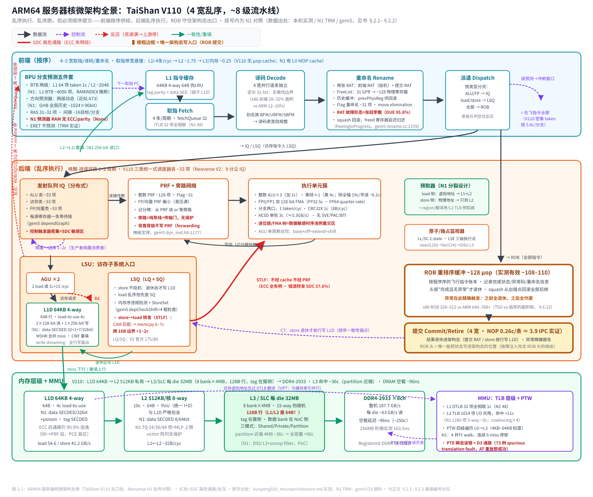
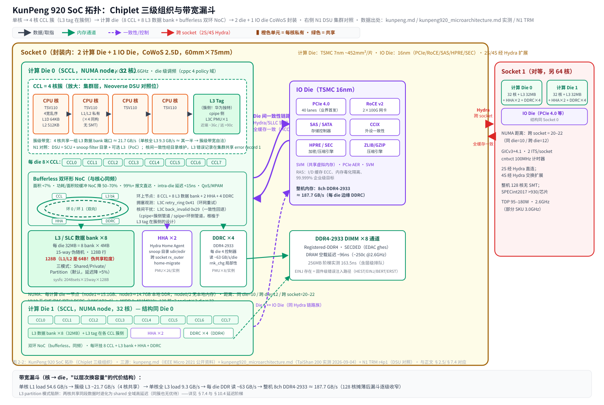
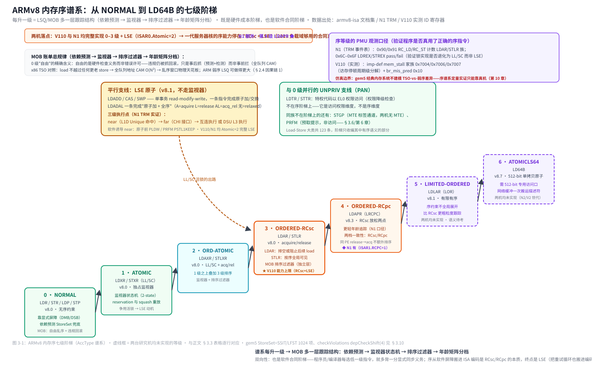
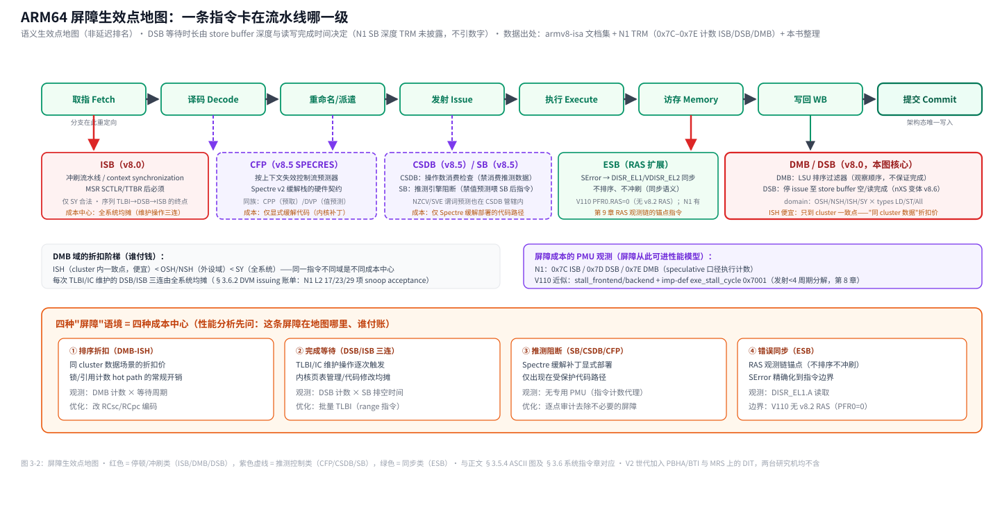
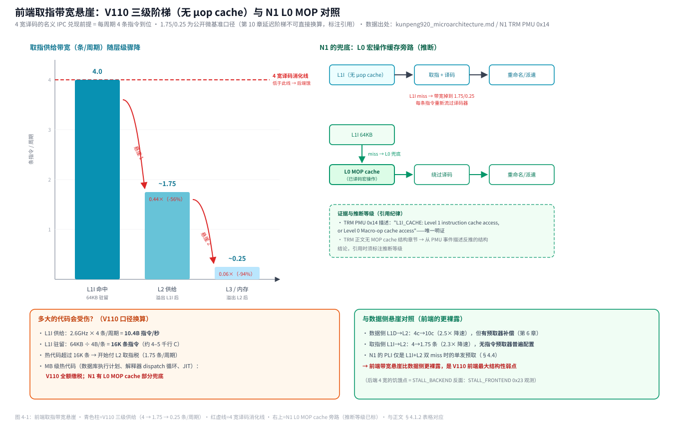
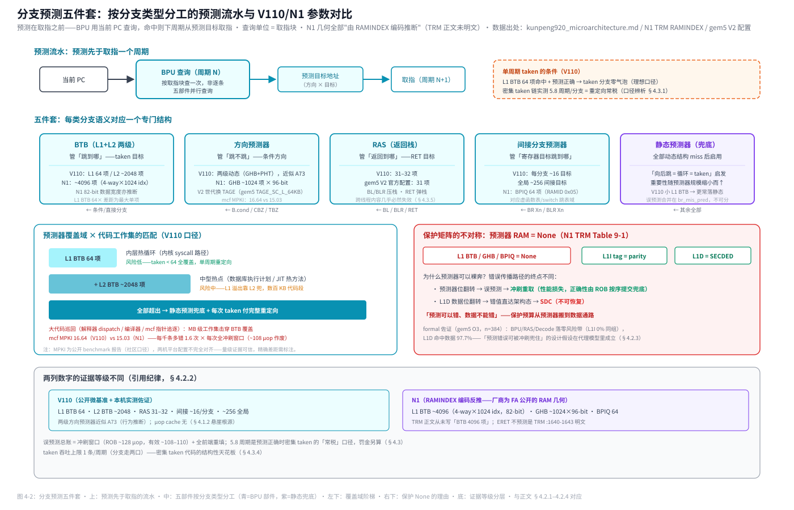
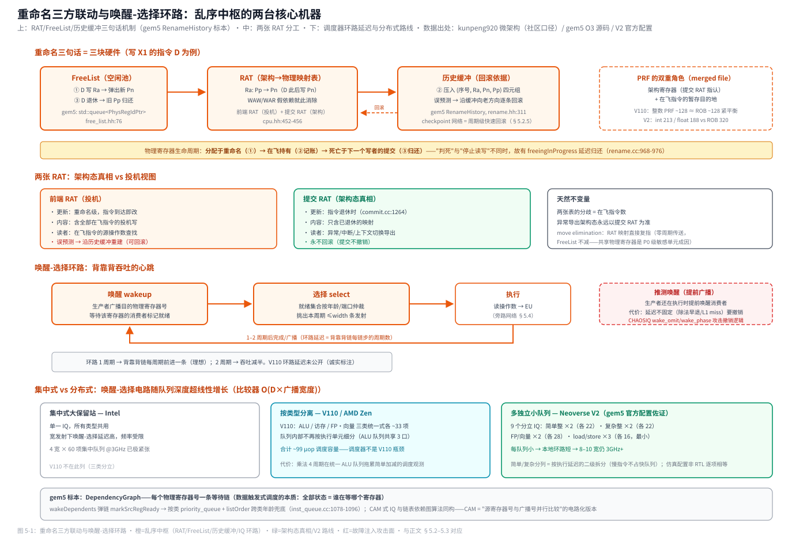
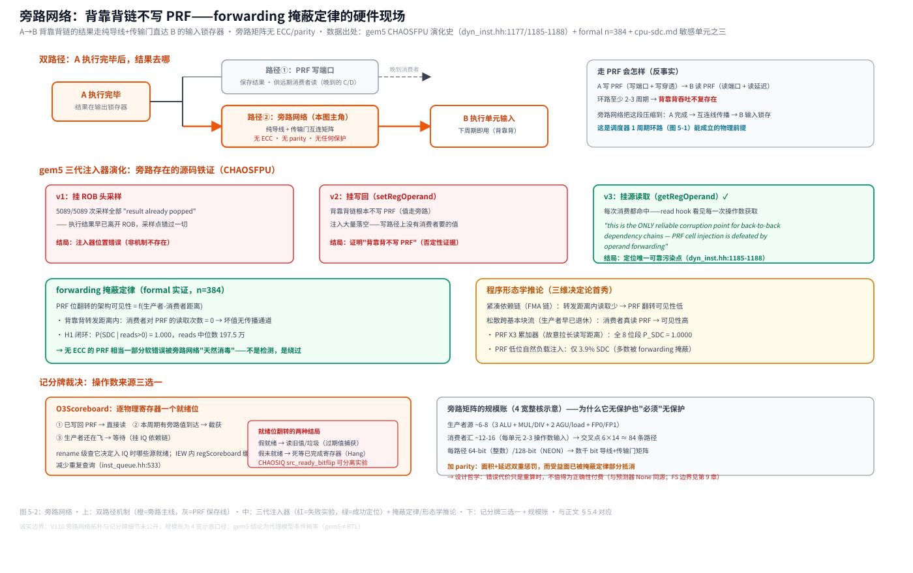

# ARM64 服务器芯片微架构深度研究

> 一本以公开资料、真机实测与仿真器源码三源互证方式研究 ARM64 服务器芯片微架构的书。
> KunPeng 920（TaiShan V110）作为完整案例独立成章；Neoverse N1 作为同代对标贯穿全书；gem5 O3 模型作为"可解剖的微架构标本"提供源码级证据。
>
> 素材基准：本仓库 `docs/cpu/`、`docs/gem5/`、`docs/arm64/`（Neoverse N1 TRM、ARMv8 ISA 文档集）与 `CHAOS/gem5/` 源码树（gem5 v25.1.0.1 + CHAOS 故障注入扩展）。
> 撰写日期：2026-09-11。

---

## 目录

- 第 1 章 引言：研究对象、方法论与诚实边界
- 第 2 章 全芯片微架构全景：单元、内部逻辑与通道拓扑
- 第 3 章 指令集与微架构协同：ISA 语义如何塑形硬件
- 第 4 章 取指前端：分支预测与指令供给
- 第 5 章 乱序执行引擎：重命名、调度与提交
- 第 6 章 记忆子系统：LSU、缓存层级与地址翻译
- 第 7 章 多核、一致性与互连：从单核到服务器 SoC
- 第 8 章 PMU 与性能测量：微架构的可观测性
- 第 9 章 可靠性微架构：ECC、RAS 与静默数据损坏
- 第 10 章 KunPeng 920 案例研究：微架构、实测与 SDC 取证
- 第 11 章 gem5 建模方法论：用仿真器解剖微架构
- 附录 A 术语表
- 附录 B Neoverse N1 与 TaiShan V110 参数对照表
- 附录 C KunPeng 920 PMU 事件速查表
- 附录 D 资料来源索引

---

# 第 1 章 引言：研究对象、方法论与诚实边界

## 1.1 为什么专门研究 ARM64 服务器微架构

ARM64（AArch64）进入数据中心不过十年，却已经历了三代路线之争：

1. **手机核改服务器**（Cortex-A72 时代，鲲鹏 916/912）：低频多核，单核性能羸弱；
2. **自研服务器核**（2019–2022，KunPeng 920/TaiShan V110、Ampere Neoverse N1、AWS Graviton2）：4–5 宽乱序、2.6–3.3GHz，单核性能达到同期 x86 中端；
3. **宽执行高性能路线**（2022 至今，Neoverse V2、Graviton4）：6+ 宽解码、17+ 执行端口、TAGE 级预测器、SVE2。

每一代路线的选择，都是"指令集契约 × 工艺约束 × 目标负载"三者的联立求解。ARM64 的指令集契约（定长编码、31 个通用寄存器、弱内存模型、仅 S 后缀指令改标志位）与 x86 的历史债务（变长编码、16 个通用寄存器、TSO 强内存模型、隐式 EFLAGS 依赖）相比，把硅片预算从前端解码器搬到了乱序中枢——这是理解一切 ARM64 服务器微架构设计决策的第一性原理，第 2 章与第 5 章将反复回到这条主线。

与此同时，服务器场景对微架构提出了与手机截然不同的要求：

- **多核扩展性重于单核频率**：TSO 的 CAM 匹配电路面积随队列深度平方增长，是 x86 乱序窗口的物理天花板；ARM 弱内存模型让 LSQ 更容易做大（第 5、6 章）；
- **RAS（Reliability, Availability, Serviceability）是必答题**：数据中心 99.999% 可用性承诺意味着 ECC/parity 必须覆盖到缓存层级、错误必须可记录可注入可遥测（第 9 章）；
- **可观测性是运维刚需**：PMU 事件、SPE 采样、uncore 计数器是性能调优与故障诊断的基础设施（第 8 章）；
- **静默数据损坏（SDC）成为新前线**：先进制程下故障形态从"响亮的崩溃"转向"静默的错误值"，微架构的故障敏感性分布本身就是一张重要的设计地图（第 9、10 章）。

## 1.2 本书的方法论：三源互证

微架构研究的根本困难在于**信息不对称**：芯片厂商公开 TRM（Technical Reference Manual）但不公开 RTL；学术论文给出参数但往往过时或理想化；真机可以实测但只能观察黑盒行为。本书采用三源互证的方法论：

| 来源 | 提供什么 | 局限 |
|---|---|---|
| **公开资料**（Arm TRM/Arm ARM、IEEE Micro 论文、Chips and Cheese 微基准、LLVM 调度模型） | 官方参数、结构描述、保护矩阵 | TRM 刻意不披露乱序引擎容量；微基准有口径陷阱 |
| **真机实测**（本仓库 TaiShan 200 / KunPeng 920 128 核机，openEuler 24.03） | 延迟阶梯、带宽阶梯、PMU 事件、ID 寄存器、ACPI/EDAC | 黑盒观测；部分 ID 寄存器字段固件未实现（不可信）；uncore 需 root |
| **仿真器源码**（gem5 v25.1.0.1 + CHAOS 故障注入框架，本仓库 `CHAOS/gem5/`） | 可解剖的微架构标本：每个部件的数据结构、每条通路的读写语义、19 个注入器钩子位置 | gem5 O3 ≠ 真实 RTL（统一 IQ 非分布式调度器、无分区 L3、无 NoC 时序模型） |

三源各覆盖彼此的盲区：TRM 说不清的乱序引擎内部，gem5 源码给出一个逻辑自洽的实现参照；gem5 说不清的真实行为（如 L3 partition 模式的延迟曲线），真机实测补上；实测看不穿的黑盒内部结构（如 TLB 字段构成），故障注入器的攻击面反向证明。第 10 章 KunPeng 920 案例与第 11 章 gem5 方法论将完整展示这种互证工作法。

一个贯穿全书的例子：**store→load 转发（STLF）**。
- 公开资料告诉你 V110 的转发延迟是 6–7 周期、跨 16B 边界 +1~2 周期；
- 真机 PMU 给你 mem_stall_anyload/l1miss/l2miss 的周期级分解；
- gem5 源码（`lsq_unit.cc:1489-1516`）展示转发的完整判定逻辑——`AddrRangeCoverage` 布尔代数、`pickSource` 换源 hook、memcpy 转发本体"**不经过 cache、也不经过 PRF 读端口**"；
- 故障注入告诉你这条通路是全芯片 SDC 敏感度最高的单元之一（错源转发 37.6% SDC），而且 cpu-sdc.md 从电路层预言的"STLF 比较器零检测能力"在仿真中定量兑现。
四层证据拼出一条通路的完整画像——这是本书希望达到的深度标准。

## 1.3 两台机器与诚实边界

本书引用的真机数据来自一台 **Huawei TaiShan 200（Model 2280），KunPeng 920 2 路 128 核（4 die × 32 核 TaiShan V110），openEuler 24.03 LTS-SP4，2026-09-04 实测**。必须说明：本仓库的另一项研究涉及的 CPU179 故障机是 **192 核** 的另一台 TaiShan 机器——两者微架构同为 V110，但实测数据口径独立，本书不混用（第 10 章案例部分单独标注来源机器）。

诚实边界（全书适用，各章再细化）：

1. **面积数据是估计值**：第 2 章引用的 x86 vs ARM64 面积占比（如前端 12–16% vs 28–32%）为仓库文档作者的综合估计，非任何厂商官方数据；
2. **TRM 未披露项**：Neoverse N1 的译码宽度、ROB/PRF/IQ 容量、store buffer 深度均不在 TRM 中，社区流传的数字（4-wide、ROB 128 等）来自 Arm 公开演讲材料——引用时本书标注来源等级；
3. **gem5 formal 数字是条件概率**：第 9/10 章引用的 P_SDC（如 L1D 97.7%）全部是"gem5 O3 代理模型下的条件概率"，不是现场 FIT 率，不可换算 FIT；且关键结果尚待第二台健康机复现（本机即故障机）；
4. **ARMv8 ISA 文档集的缺口**：本仓库 `docs/arm64/armv8-isa/` 有 108/387 个指令文件是空壳 stub（恰包括 LSE 原子全族与大部分 PAC 指令），涉及处的语义按指令名 + N1 TRM 实证还原；
5. **实测口径陷阱**：公开规格的除法延迟（19 周期）是全幅操作数口径，依赖链实测 6.2 周期是商早出口径；FMA 公开 7 周期 vs 实测 5 周期——凡遇矛盾本书并列双口径并解释。

## 1.4 全书结构与阅读路线

- **想建立整体图景**：读第 2 章全景（所有微架构单元 + 通道拓扑），这是全书的"地图页"；
- **想深入某个单元**：第 3–7 章按流水线顺序展开，每章末有 gem5 源码对照小节；
- **做性能调优**：第 8 章 PMU + 第 10 章 KunPeng 920 实测；
- **做可靠性/测试/FA**：第 9 章 + 第 10 章后半（CPU179 取证）；
- **做体系结构研究/仿真**：第 11 章 gem5 方法论。

---

# 第 2 章 全芯片微架构全景：单元、内部逻辑与通道拓扑

本章是全书的地图。目标只有一个：把一颗 ARM64 服务器芯片**从取指到 DRAM 的每一个微架构单元、每个单元的内部逻辑、以及单元之间的每一条数据通道与控制通道**画成一张连贯的图。后续章节都是对这张图局部区域的放大。

分四层展开：§2.1 单核流水线全景（一条指令的旅程）；§2.2 单元清单与内部逻辑（逐单元）；§2.3 通道拓扑（数据通道/控制通道/反压通道）；§2.4 多核与 SoC 层（cluster、互连、内存控制器）。

## 2.1 单核流水线全景：一条指令的旅程

一颗现代 ARM64 服务器核（以 TaiShan V110 / Neoverse N1 一代为参照）是 4–5 宽乱序超标量流水线，一条指令的生命周期如下（8–10 级流水线，V110 约 8 级）：

```
┌────────────────────────── 前端（按序） ──────────────────────────┐
│                                                                  │
│  L1I ──→ 取指 ──→ 译码 ──→ 重命名 ──→ 派遣(Dispatch/Rename→IQ/LSQ)│
│   ↑      ↑                                                        │
│  BPU ────┘（BTB/GHB/RAS/间接预测器，提前预测下一取指地址）           │
└──────────────────────────────────────────────────────────────────┘
                              │
                              ▼
┌────────────────────────── 后端（乱序） ──────────────────────────┐
│                                                                  │
│  发射队列(IQ) ──→ 读取操作数(PRF/旁路网络) ──→ 执行单元 ──→ 写回    │
│     ↑ 唤醒-选择            ↑                      │               │
│     └──────────────────────┘（生产者唤醒消费者）     ▼               │
│  LSU: AGU ──→ L1D / LSQ(store buffer) ──→ 转发/重填  │            │
│                                                    ▼             │
│  ROB（按序提交：结果退休进架构态，异常在此触发）                     │
└──────────────────────────────────────────────────────────────────┘
                              │
                              ▼
┌────────────────────────── 内存层级 ──────────────────────────────┐
│  L1D(64KB) → L2(私有 512KB) → L3/SLC(集群或 die 共享) → DRAM       │
│  MMU: L1 DTLB → L2 TLB → PTW(页表遍历器) → 页表(内存中)             │
└──────────────────────────────────────────────────────────────────┘
```



核心记忆句（贯穿全书）：**乱序执行、乱序跑，但必须顺序提交**。前端按序供给，后端乱序执行（无关指令可插队绕过卡住的 load），ROB 守住出口保证架构态按程序序更新、分支误预测与异常可以精确回滚。

## 2.2 微架构单元清单与内部逻辑

以下按数据流顺序枚举全部单元。每单元给出：内部逻辑（怎么工作）+ 关键结构（容量/组织，标 N1/V110 实际数字）+ 微架构要点。

### 2.2.1 前端单元

**（1）L1 指令缓存（L1I）**
- 内部逻辑：VIPT（表现为 PIPT）组相联缓存，按 fetch buffer（一个 cache line 或其片段）粒度供给取指队列；miss 时向 L2 发读请求。
- 结构：N1 与 V110 均为 64KB / 4-way / 64B 行 / 伪 LRU（N1 TRM :1388-1396）；N1 从 L2 有 256-bit 读接口；V110 每周期能供 4 条指令。
- 要点：① N1 的 L1I tag 用 1 parity/39bit、数据用 SED/72bit 保护——**取指侧保护比取数侧弱**（L1D 是 SECDED），因为取指错误最坏触发流水线冲刷重取，自掩蔽性强（gem5 formal：L1I 注入 0% SDC）；② V110 的 L1Ip=AIVIVT（别名虚拟索引，CTR_EL0 实测 0x84448004），N1 为 PIPT——AIVIVT 是成本更低的老式设计，在 64KB/4-way/64B 几何下索引位恰为 16KB，处于页别名临界，V110 靠公共页着色规避（实测无别名问题）；③ 取指带宽悬崖：V110 无 µop cache，代码溢出 L1I 后取指带宽从 4 条/周期骤降到 L2 的 ~1.75、L3/内存的 ~0.25——这是 V110 前端与 N1（有 L0 宏操作缓存，TRM PMU 事件 0x14 描述 "or Level 0 Macro-op cache access" 为证）的最大代差。

**（2）分支预测单元（BPU）**
- 内部逻辑：五件套——BTB（记录 taken 分支的目标地址）+ 方向预测器（两级动态历史/N1 一代为 GHB 全局历史 + 模式历史表；V2 时代为 TAGE）+ 返回栈 RAS（BLR 压栈、RET 弹栈）+ 间接分支预测器 + 静态预测器（预测历史未覆盖的分支）。预测在取指**之前**进行：BPU 用当前 PC 查 BTB，命中则下个周期从预测目标取指（V110 L1 BTB 64 项，taken 分支单周期零气泡）。
- 结构：V110：L1 BTB 64 项 + L2 BTB ~2048 项、RAS 31–32 项、间接预测每分支 ~16 目标/全局 ~256 目标、两级动态预测器（行为近似 Cortex-A73，505.mcf MPKI 16.64 vs N1 的 15.03）。N1（由 RAMINDEX 编码推断，非 TRM 明文）：L1 BTB 约 4-way × 1024 index ≈ 4096 项、GHB ~1024 项 × 96-bit、BPIQ 64 项。
- 要点：① **ERET 不预测**（N1 TRM :1640-1643）——异常返回目标依赖 ELR/SPSR，不可投机；② 预测器结构的 RAM 在 N1 上**无 ECC/parity 保护**（TRM Table 9-1：L1 BTB/GHB/BPIQ = None）——预测错误的代价只是冲刷，正确性由 ROB 的按序提交兜底，这是"用体系结构容忍故障"的典型设计；③ 分支预测失败代价 = 冲刷窗口内全部在飞指令（~ROB 深度）+ 前端重填时间，V110 密集 taken 链实测 5.8 周期/分支（最坏情况口径，与"单 taken 零气泡"不矛盾）。

**（3）译码器（Decode）**
- 内部逻辑：把 32-bit 定长指令翻译成内部 µop（或如 N1 的宏操作）；同时识别分支并把预测信息附到指令上。
- 结构：V110/N1 一代为 4 宽（N1 TRM 不披露宽度，4-wide 来自 Arm 公开材料）。ARM64 定长编码使译码器可以做成并行 4 条逐条独立译码——对比 x86 变长指令必须先找指令边界（这是 x86 前端占 28–32% 面积而 ARM 只占 12–16% 的根源，见 §2.4）。
- 要点：ARM64 的别名指令群（BFM/UBFM/SBFM 一个编码族撑起 BFI/BFXIL/SBFIZ/UBFX/ASR/LSL/LSR/SXT* 等十余个汇编别名）意味着译码表较宽但逻辑仍然规整；V110 无 µop cache，所以 L1I miss 后**每条指令都要重新流过译码器**，前端带宽悬崖由此而来。

**（4）重命名单元（Rename）**
- 内部逻辑：把架构寄存器号（X0–X30，31 个）映射到物理寄存器号（几百个）。每次**写**一个架构寄存器就分配一个新物理寄存器，从空闲表（FreeList）取出；旧映射压入历史缓冲供误预测回滚。消除 WAW/WAR 假依赖。
- 结构：两张映射表——前端 RAT（投机映射，在飞指令读它）+ 提交 RAT（提交映射，架构态真相）。V110：整数 PRF ~128 项、Flag 重命名 ~31 项、支持 move elimination（MOV 在重命名级完成，不占执行单元）；N1 TRM 不披露容量。
- 要点：① RAT 是**映射结构的代表**——它的故障形态是"张冠李戴"（读到别的变量的值），在故障注入分类中是 DUE 主导而非 SDC 主导（map_bitflip 95.8% DUE，见第 9 章）；② 误预测回滚沿历史缓冲逐条恢复 prevPhysReg，被 squash 的物理寄存器要延迟到确认无人持有后才归还 FreeList（gem5 中为 freeingInProgress 队列，rename.cc:1378-1388）——因为乱序执行中"死"指令可能还在执行并读写着它。

**（5）派遣/分派（Dispatch）**
- 内部逻辑：重命名后的指令按类型分流——ALU/FP 类进发射队列、load/store 进 LSQ（LQ/SQ 分别分配）、全部指令进 ROB 排队；受各队列空位反压。
- 要点：这是前端与后端的交界。V110 调度器按 ALU/访存/FP·向量三类分设，各 ~33 项——分布式调度器是 ARM 阵营的通行设计（对比 Intel 集中式大保留站），唤醒-选择电路的延迟随队列大小超线性增长，拆小队列才能在 8–10 宽发射下维持高频。

### 2.2.2 后端单元

**（6）发射队列与调度器（Issue Queue / Scheduler）**
- 内部逻辑：每条指令挂在其源寄存器的依赖链上等待；生产者执行完毕广播唤醒（wakeup）所有等待该寄存器的消费者，消费者被标记就绪进入就绪队列，选择电路（select）按年龄/端口仲裁挑出本周期发射的指令读操作数送执行单元。唤醒→选择的环路延迟（通常 1–2 周期）决定背靠背依赖链的实际吞吐。
- 结构：V110 三类统一式调度器各 ~33 项；N1 未披露（社区口径为分布式多队列）；Neoverse V2（gem5 官方配置佐证）为 9 个分立 IQ：简单整数×2(22 项)/复杂整数×2(22)/FP·向量×2(28)/load-store×3(16)。
- 要点：① 唤醒-选择是乱序核时序收敛最难电路之一，也是 SDC 敏感单元（控制触发器密集）；② gem5 中依赖图按物理寄存器组织——每物理寄存器一条等待链（dep_graph.hh），生产者写回时 wakeDependents 弹链唤醒（inst_queue.cc:1077-1096），这是理解"数据触发式调度"的最小实现标本。

**（7）物理寄存器堆（PRF）**
- 内部逻辑：乱序窗口内所有飞行中值的存储体。读端口数为 (发射宽度 × 每指令源数)，写端口数为提交带宽——端口数是面积与布线的第一杀手。
- 结构：V110 整数 PRF ~128 项（覆盖 ROB 128 足够）；FP/向量 PRF 偏小（32 个 FP 架构寄存器占去更多重命名空间，FP 密集负载易压满）。
- 要点：① PRF 阵列可以有 parity，但**执行单元输出到发射端口的旁路网络（bypass network）是纯导线与传输门，无任何保护**（cpu-sdc.md 三大敏感单元之一）；② 背靠背依赖链的值走旁路网络直接前递，**根本不写回 PRF**——gem5 源码注释原话："PRF cell injection is defeated by operand forwarding"（dyn_inst.hh:1177），这解释了 PRF 位翻转的架构可见性取决于生产者-消费者距离（forwarding 掩蔽定律，第 9 章）。

**（8）执行单元簇（Execution Units）**
- 内部逻辑：整数 ALU（移位器/进位链加法器/逻辑单元）、乘除单元（迭代或阵列乘法器、恢复/不恢复余数除法器）、FP/向量单元（FMA 的 Wallace Tree 压缩树、指数对齐移位器、前导零预测器 LZA、规格化）、AGU（地址生成：base+offset+extend+shift 单周期）、分支单元（目标计算与条件判定）、加密单元（AES 轮函数、SHA 轮函数）、CRC 单元。
- 结构（V110）：整数 ALU×3 + 乘除×1（乘 4 周期）；FP0/FP1 双流水线（128-bit FP32 FMA 双发射，FP64 quarter-rate，FADD/FMUL 各只占一个口——设计怪点）；AGU×2（每周期 2 load 或 1 load + 1 store）；CRC32X 1 周期（8B/cyc）；AESD 单轮 3 周期（≈5.3 GB/s 单核 AES）。
- 要点：① 加法器进位链与 FMA 乘法树是**数据敏感型时序违例重灾区**——全 1 低位操作数使进位穿透数十级逻辑，遇电压波动则高位翻转（第 9 章 SDC 物理机理）；② V110 无 SVE、无 PAC/BTI/LRCPC——一代自研核的 ISA 停在 ARMv8.2+（实测 ID 寄存器，PFR0.SVE=0xf、ISAR1.APA=0/API=0/LRCPC=0），这直接决定了它的目标负载域（标量整数为主的云微服务）。

**（9）重排序缓冲（ROB）**
- 内部逻辑：按程序序排列的飞行指令账本。每条指令占据一项，记录完成状态、异常码、重命名信息；头部指令"完成且无异常"才能退休（commit）——结果才真正写入架构态（PRF 提交映射、L1D 对 store 而言）。分支误预测/异常时从出错指令处 squash 全部后继，沿历史缓冲回滚。
- 结构：V110 ~128 µop（微基准实测有效 ~108-110）；N1 TRM 未披露（社区口径 128）。ROB 深度决定乱序窗口：更深 = 更多飞行指令掩盖 L2/L3/DRAM 延迟。
- 要点：① **ROB 头是唯一能把状态写进架构态的位置**——这是故障注入攻击 ROB 头而非任意槽位的理由（第 11 章）；② ROB 控制逻辑（环形指针、依赖指示、checkpoint 恢复网络）是加固触发器密集区；③ x86 受 TSO 与微码嵌套影响 ROB 上限 320–512，ARM6 40–768+（第 2.4 与第 5 章）。

**（10）提交单元（Commit/Retire）**
- 内部逻辑：每周期从 ROB 头按序退休最多 commitWidth 条指令；处理异常（精确异常：出错点之前的指令已全部退休、之后的全部作废）；管理中断响应点。
- 结构：V110 4 宽退休（实测 NOP 0.26 周期/条 ≈ 3.9 IPC 直接实证 4 宽退休带）；gem5 默认 8 宽、trapLatency 13 周期。

### 2.2.3 记忆子系统单元

**（11）地址生成单元（AGU）与 LSU 译码**
- 内部逻辑：为每条访存指令计算有效地址：base + offset（立即数或寄存器）+ extend（UXTW/SXTW/SXTX）+ shift（LDR Wt,[Xn,Xm,SXTX #3] 一条指令完成 C 数组下标寻址）。pre/post-index 变体还要写回基址寄存器。
- 要点：AGU 输出到 MMU 的**地址通路**是 SDC 研究中的 D2 通路——本仓库 CHAOSAddrPath 注入器证明 AGU 输出地址 byte7 清零可 100% 复现现场"零塌缩"故障签名（内核非规范化地址→翻译故障→panic），保护投资应指向地址生成的合法性校验（第 10 章）。

**（12）LSQ：Load Queue + Store Queue**
- 内部逻辑：乱序访存的核心。Store 先进 SQ 缓存地址与数据，等 ROB 退休后才允许写 L1D（保证顺序一致性——store 不投机）；Load 可以乱序执行，但必须先查 SQ：**store→load 转发**（地址重叠的更老 store 直接把数据前递给 load，不经过 L1D）；同时做内存序违规检测（load 越过更老 store 且地址重叠 → 违规 → squash 重执行）。
- 结构：gem5 默认 LQ/SQ 各 32 项；Neoverse V2 官方配置 LQ 175/SQ 80；V110 未公开。SQ 每项数据缓冲 256B（gem5 MaxDataBytes）。
- 要点：① **转发判定是 CAM（内容寻址）匹配**：load 地址与所有更老 store 地址并行比较，V110 转发 6–7 周期、跨 16B 边界 +1~2 周期（L1D 按 16B 对齐块操作）；② **转发数据不经过 cache 也不经过 PRF 读端口**（gem5 memcpy 直接拷贝，lsq_unit.cc:1489-1516）——因此 PRF/cache 的 ECC 对这条通路完全失明，这是全芯片 SDC 敏感度最高的通路之一（错源转发 37.6% SDC，第 9 章）；③ x86 TSO 要求 load 不越过任何更老 store，需要全队列地址 CAM（面积 O(N²)）；ARM 弱内存模型允许更大胆的乱序，靠显式 DMB/DSB 约束——这是两种 ISA 在 LSQ 微架构上的根本分野。

**（13）L1 数据缓存（L1D）**
- 内部逻辑：VIPT（表现为 PIPT）写回式缓存；load hit 返回数据（V110 load-to-use 4 周期），miss 发 MSHR 合并的重填请求；store 在退休后写入，分配行或写穿；每周期 2×128-bit 访问（2 load 或 1 load+1 store）。
- 结构：N1 与 V110 均为 64KB / 4-way / 64B 行；N1 数据 SECDED 每 32bit + poison 位、tag SECDED 42+7；V110 ECC（厂商宣称）。
- 要点：① N1 的 L1D miss 按 critical-word-first 重填（TRM :1433）；② write streaming mode：硬件检测 store 全行写/DC ZVA 后停止行填充直接写出（阈值 CPUECTLR.WS_THR_* 可配，DRAM 档复位 1MB）；③ **取指与取数的保护不对称**是第 9 章的主题。

**（14）L2 缓存**
- 内部逻辑：私有统一缓存（指令+数据），是核的 Point of Unification（PoU）；与 L1D 严格包含（N1），对 L1I 严格或弱包含（取决于 IC 硬件一致性开关）。
- 结构：V110 512KB/核私有 8-way 10 周期；N1 可选 256/512/1024KB 8-way，两 bank，事务队列 TQ 总 24/36/48 项、读写 issuing 能力 22/34/46、snoop 接受 17/23/29（TRM Table 8-1）——这些并发度数字是核向互连施加压力的量化锚点。N1 L2 数据 SECDED 8 ECC bit/64bit、tag SECDED、TQ data SECDED、**victim 阵列无保护**。
- 要点：L2 的 issuing capability 决定核的内存级并行度（MLP）上限——在飞 miss 数受 TQ 项数约束。

**（15）L3 / SLC（System Level Cache）与 DSU**
- 内部逻辑：集群或 die 级共享缓存；一致性点（PoC）常驻于此。Neoverse 路线：DSU（DynamIQ Shared Unit）内含 SCU（snoop control unit，维护集群内一致性 + snoop filter）+ 可选 L3。KunPeng 路线（V110 独有）：**L3 tag 放在 CPU 簇侧、数据 bank 放在 NoC 附近**——簇内查 tag 快（近端 partition 份额 ~36 周期），数据从 ring 上取。
- 结构：N1 DSU L3 容量在 DSU TRM（本书不展开）；V110 每 die 32MB（8 bank × 4MB）、15-way 伪随机、**128B 行（L1/L2 是 64B！）**、Shared/Private/Partition 三模式（默认 partition）。
- 要点：① V110 的 partition 模式：每簇默认私有份额 4MB（~36 周期），工作集超出后延迟渐涨至全容量 >90 周期；**两核共享同段数据时退化为 shared 行为全域高延迟（同簇也无优待）**——设计使然，非故障（实测证明，第 10 章）；② L3 行 128B vs L1/L2 64B：伪共享与对齐实验必须以 128B 为 L3 粒度——x86 直觉在这里失效。

**（16）MMU：TLB 层级与页表遍历器（PTW）**
- 内部逻辑：虚拟地址→物理地址翻译。L1 ITLB/DTLB（全相联，1 周期命中）→ L2 统一 TLB（组相联，几周期）→ miss 则 PTW 从内存逐级读页表描述符（L0→L1→L2→L3 四级，4KB/16KB/64KB 粒度）。TLBI 指令失效表项（DVM 广播到集群）；AT 指令复用 PTW 做一次软件驱动的翻译探测。
- 结构：V110：L1 ITLB/DTLB 各 32 项全相联、L2 TLB 1024 项 I/D 共用（命中 +11 周期，偏慢——Zen2 为 7）；N1：L1 各 48 项全相联、L2 TLB 1280 项 5-way 共享（含 stage-2 IPA→PA），**支持 4 个并行页表遍历 + 遍历中仍服务 2 个 lookup，连续 6 miss 停顿**；**TLB coalescing**：L2 TLB 项可合并持有 4 个连续页翻译（HPA 硬件页聚合 4 档保守度）。
- 要点：① V110 的 L2 TLB 11 周期命中偏慢是其地址翻译短板之一（对比 N1 ~3 周期）；② PTW 读出的 PTE 落在内存一致性域外——PTE 瞬态读错是 SDC 三通路之一（D3，第 10 章 core179 案例 73 例 spurious translation fault）；③ gem5 的 ArmMMU L2 TLB 默认 1280 项/5-way——**与 N1 真实 1280/5 完全一致**（ArmMMU.py:102-104），gem5 官方按 N1 校准的直接证据。

**（17）预取器（Prefetcher）**
- 内部逻辑：识别访存流的 stride/region 模式，提前发起重填。N1 的分裂设计极具代表性：**load 侧预取器用虚拟地址，预取进 L1+L2；store 侧用物理地址只预取进 L2**（TRM :1806-1809）——load 侧在地址翻译前就能启动（快），store 侧翻译后更准但只到 L2（避免污染 L1）；另有 region prefetcher（RPF）、stride 距离 22/28/34/40 可配、经 PrefetchTgt CHI 事务的 DRAM 预取 4 档、MMU 侧翻译表预取器与 L2 TLB 预取器。
- 结构：V110 硬件预取针对向量/标量优化（厂商口径）；PMU 有 hit_on_prf（预取命中）与 prf_req（预取请求）事件可观测。

**（18）原子操作与独占监视器（ExMon）**
- 内部逻辑：LL/SC（LDXR/STXR）：LDXR 置本地监视器（2-state：open/exclusive，按 ERG 粒度=64B=1 cache line），STXR 检查监视器仍 exclusive 才写。LSE（LDADD/CAS/SWP）：单事务 read-modify-write，无重试概念。N1 的三级执行点：**near atomic**（L1D Unique 态命中，L1 内存系统内完成）→ **far atomic**（经 CHI 到 DSU）→ 互连执行或 **DSU L3 执行**（可分配进 L3）。
- 要点：① LSE 消除 LL/SC 活锁（争用下反复失败的 while 循环）；V110 实测完整 LSE（ISAR0.Atomic=2），CASAL 依赖链 43 周期（L1 争用下 acq/rel 全代价）；② STXR 假成功（stale reservation）= 丢失更新竞态窗口静默打开——这是协议级故障注入的原语（CHAOSExMon，第 11 章）；③ 软件可用 PLDW/PRFM PSTL1KEEP 预取独占行诱导 near atomic——ISA 提示与微架构执行点的协同优化范例。

### 2.2.4 系统与支撑单元

**（19）系统寄存器堆与系统指令单元**
- 内部逻辑：MRS/MSR 读写 SCTLR/TTBR/TCR/MAIR/VBAR 等控制寄存器（banked：按 EL 重定向）；TLBI/DC/IC 缓存与 TLB 维护操作走完全串行点（不可推测）；MSR (immediate) 只写 PSTATE 位（DAIF/PAN/SSBS 等，走专用小路径）。AT 指令复用 PTW。
- 要点：系统寄存器读出错是"配置级 SDC"——TTBR 翻转到合法形状 = 静默换页表（value_to_legal 故障形态）；vbar_el1 翻转则是"响亮"的立即异常。**同一单元内不同寄存器的故障可见性天差地别**（第 11 章 CHAOSArmSysReg）。

**（20）PMU（Performance Monitoring Unit）**
- 内部逻辑：计数器组观察流水线事件（每周期可编程统计任意事件）；架构定义 PMUv3 事件空间 + 实现自定义（imp-def）事件。N1：6 事件计数器 + 1 周期计数器。
- 要点：PMU 是微架构的"可观测性接口"——第 8 章专论。V110 无 topdown（slots=0，FEAT_PMUv3_METRIC 缺失），前端/后端分解只能用 stall_frontend/backend + imp-def 的 exe_stall_cycle 近似。

**（21）RAS 逻辑（Reliability, Availability, Serviceability）**
- 内部逻辑：ECC/parity 编解码器分布各 RAM；错误分类 CE（可纠）/DE（延迟）/UE（不可纠）；错误记录进 ERR*n 寄存器组（node 模型：核一个节点、DSU 一个节点）；毒化（poison）标记随数据在层级间传播（N1：64bit 粒度，L1D 例外 32bit）；ESB 指令同步 SError；错误注入接口（ERR0PFGCTL 对未来访问注入）。
- 要点：**RAS 保护的是"存储阵列"，不保护组合逻辑与数据通路**——这是第 9 章"并非处处皆有 ECC"的根源，也是 SDC 研究的出发点。

**（22）调试/追踪（Debug & Trace）**
- N1：ETMv4 仅指令 trace（数据追踪 Not implemented）；6 个上下文比较器；外部调试经 DSU。V110：7 个上下文比较器（CTX_CMPs=6 实测）。

**（23）低功耗管理**
- N1：每核 VCPU 电压域 + 集群 VSYS；P-Channel 5 模式；WFI/WFE 顶层时钟门控（L3 snoop 请求会临时恢复核时钟而不退出 WFI）；每核独立 DVFS + max-power throttling（MXP 60/50/40/30% 节流）。V110 实测：cppc_cpufreq 4 个 policy 域 = **die 级调频**（同 die 32 核共享一个频率决策）——与 N1 的每核 DVFS 形成路线对比。

## 2.3 通道拓扑：单元之间的数据通道、控制通道与反压通道

微架构的精髓一半在单元、一半在通道。把通道分三类：**数据通道**（值流动）、**控制通道**（指令流控制/状态仲裁）、**反压通道**（资源满时上游停摆）。

### 2.3.1 数据通道（值从哪来往哪去）

| # | 通道 | 路径 | 保护/要点 |
|---|---|---|---|
| D1 | 取指流 | L2 → L1I → fetchBuffer → 译码器 | L1I parity/SED；指令流错误被 squash 自掩蔽（formal 0% SDC） |
| D2 | 操作数供给 | PRF 读端口 / **旁路网络** → 执行单元输入 | 旁路网络无保护（纯导线+传输门）；背靠背链不写 PRF |
| D3 | 执行结果 | 执行单元 → **旁路网络** / PRF 写端口 | 同上；写回竞争由记分牌仲裁 |
| D4 | load 数据通路 | L1D/ECC → **fill→PRF 通路** → PRF | ECC 检查后的通路段是 PCE 逃逸盲区（formal 90.9%） |
| D5 | store→load 转发 | SQ 数据缓冲 → CAM 匹配 → load 结果 | **不经过 cache 与 PRF**——两处 ECC 全部失明（formal 37.6%） |
| D6 | store 写路径 | ROB 退休 → SQ → L1D → (写回时) L2/L3 → DRAM | 退休后才写 L1D（顺序一致性）；毒化沿此路径持久化 |
| D7 | 地址通路 | AGU → MMU/TLB → L1D tag 比较 | byte7 类错误 → 非规范化地址（D2 通路，formal 100% DUE 复现） |
| D8 | 翻译通路 | PTW 从内存读 PTE → L2 TLB → L1 TLB | PTE 瞬态读错（D3 通路）；walk cache 有 2-bit 交错 parity |
| D9 | 一致性通路 | L1D ↔ L2 ↔ DSU/SCU(snoop filter) ↔ L3 ↔ 互连 ↔ 远端 | MESI 状态迁移；毒化以 64bit 粒度随行 |
| D10 | 预取通路 | 预取器 → L1D/L2/DRAM（经 PrefetchTgt） | load 侧虚拟地址、store 侧物理地址的分裂设计 |

### 2.3.2 控制通道（谁指挥谁）

| # | 通道 | 功能 |
|---|---|---|
| C1 | 分支预测 → 取指重定向 | BPU 输出下一取指地址；误预测时从执行/译码级发起冲刷（冲刷窗口=在飞指令全部） |
| C2 | 译码 → 前端解耦（µop cache 命中时跳过取指译码） | N1 有 L0 MOP cache；V110 无 |
| C3 | 重命名映射控制 | RAT/FreeList/历史缓冲三方联动；checkpoint 恢复网络（分支密集代码每几条指令一个检查点） |
| C4 | 唤醒-选择环路 | 生产者完成 → 广播唤醒 → 消费者就绪 → 选择发射（乱序引擎的心跳，1–2 周期环路延迟） |
| C5 | 记分牌（Scoreboard） | 逐物理寄存器的就绪位，决定操作数从 PRF 读还是等旁路 |
| C6 | ROB → 全体的 squash 广播 | 误预测/异常/内存序违规从 ROB 定位出错点，广播冲刷所有后继 |
| C7 | 提交 → SQ 的 store 放行 | store 退休才允许写 L1D（顺序一致性的执行锚点） |
| C8 | 内存依赖预测 | StoreSet（SSIT/LFST）预测 load-store 依赖，允许推测乱序；违规时回滚训练 |
| C9 | 一致性协议控制 | snoop filter 维护 holder 集合；TLBI/DC 维护指令的 DVM 广播；独占监视器状态机 |
| C10 | DVFS/功耗/节流 | P-Channel、电压域、MXP 节流、WFI 时钟门控 |
| C11 | RAS 控制 | ECC 错误分类→ERR*记录→fault 中断路由（nFAULTIRQ）；毒化传播控制 |

### 2.3.3 反压通道（资源满的信号传播）

乱序机器的吞吐由反压网络塑形：ROB 满 → rename 停；IQ 满 → rename 停；LQ/SQ 满 → rename 停（load/store 分别检查）；fetchQueue 满 → 取指停；MSHR 满 → L1D 停发重填；L2 TQ 满（24/36/48 项）→ 核的 MLP 被截断；DRAM 队列满 → 互连 retry。**gem5 的 TimeBuffer 后向 wire 就是这层网络的软件模型**（comm.hh 的 TimeStruct 里 freeIQEntries/freeLQEntries/freeSQEntries/freeROBEntries 从 IEW/Commit 每拍回传给 rename）——一个有趣的视角：读 gem5 的 comm.hh 就能看到一颗真实芯片里所有反压信号的名字。

## 2.4 面积、功耗与 ISA 的联立：为什么 ARM64 长这样

把上述单元放进面积账本（仓库 cpu.md 的综合估计，非厂商数据，诚实标注）：

**剔除 SRAM 缓存后的纯逻辑晶体管面积占比**：

| 逻辑模块 | x86 | ARM64 | 根源 |
|---|---|---|---|
| 前端指令处理 | 28–32% | 12–16% | x86 变长指令解码 + µop cache；ARM64 定长解码极简 |
| 乱序中枢（RAT/ROB/调度器/PRF） | 28–32% | **42–46%** | ARM 把前端省下的面积投入更大乱序窗口 |
| 后端执行 | 38–42% | 38–42% | x86 偏重型 512-bit AVX；ARM 偏多整数 ALU + 2×256-bit SVE |

**完整单核（含 L1/L2，N5/N4 基准）**：x86 2.7–3.5 mm² vs ARM64 1.8–2.5 mm²——ARM 单核小 25–35%，同等 die 面积部署更多核求总吞吐。

四条 ISA→硬件的因果链（第 3 章逐条展开）：

1. **内存模型**：x86 TSO → LSQ 全队列地址 CAM（O(N²)）→ 乱序窗口物理天花板；ARM 弱序 + 显式屏障 → LSQ 易做大 → ROB 可到 640–768+ vs x86 320–512。
2. **寄存器数量**：x86 16 GPR → 编译器频繁 spill/fill → 额外访存 µop；ARM 31 GPR → 依赖链更干净。
3. **标志位**：x86 几乎所有指令改 EFLAGS → 隐式依赖链；ARM 仅 ADDS/SUBS 等 S 后缀 → 依赖链干净（但 NZCV 成为 ARM64 独有的 SDC 脆弱点——重命名的标志位出错没有数据域校验，Cross-ISA 论文）。
4. **译码复杂度**：x86 变长 → 前端 28–32% 面积 + µop cache 必配；ARM 定长 → 前端 12–16%，预算搬去后端。

调度器拓扑同样是路线分歧：Intel 集中式大保留站（宽发射下唤醒-选择延迟高）→ 频率受限；AMD ALU/AGU 分离；**ARM Neoverse 多独立队列（整数/访存/向量分离）→ 8–10 宽发射仍维持高频**——V110 的三类统一式调度器各 33 项与 V2 的 9 分立 IQ 都是这一哲学的产物。

## 2.5 多核与 SoC 层：cluster、互连、内存

单核之上还有两级组织（细节在第 7 章）：

**集群层（Neoverse DSU / KunPeng CCL）**：N1 standalone = 最多 4 核 + DSU（SCU + snoop filter + 可选 L3）；核间一致性由 snoop filter 目录维护，L3 错误记录在集群共享的 error record 1。KunPeng 每 die 8 个 CCL（4 核簇）各带 L3 tag，共享 L3 数据 bank。

**die/socket 层（KunPeng 920 独有的 Chiplet 拓扑）**：2 计算 Die（各 32 核）+ 1 IO Die，CoWoS 2.5D 封装；Die 间 Hydra/SLLC 一致性链路最高 400 GB/s（HCCS）；**bufferless 双环形 NoC**（面积 <7%、99% 报文直达、intra-die <15ns）；每计算 Die 一组 DDR4 控制器（整机 8 通道 DDR4-2933 ≈ 187.7 GB/s）；NUMA 距离实测：同 die=10 / 跨 die=12 / 跨 socket=20–22。

一个把三级组织串联起来的量化视角：单核全 L3 load 带宽 9.3 GB/s ≈ 簇级 21.7 GB/s 的一半（4 核簇共享 L3 tag/带宽自洽），而每 die DDR 读带宽 ~63 GB/s——从核到 die，带宽的漏斗逐级收窄，这正是服务器微架构"以层次换容量"的代价结构。



## 2.6 本章小结：一张总账图

把本章压缩成三句话：

1. **单元清单**：前端 5 件（L1I/BPU/译码/重命名/派遣）+ 后端 5 件（IQ/PRF/执行簇/ROB/提交）+ 记忆 8 件（AGU/LSQ/L1D/L2/L3/MMU/预取/ExMon）+ 系统 5 件（系统寄存器/PMU/RAS/调试/功耗），共 23 类单元；
2. **通道清单**：10 条数据通道（D1–D10）+ 11 条控制通道（C1–C11）+ 贯穿全体的反压网络——**单元是名词，通道才是句子**；
3. **设计主线**：ISA 契约（定长/31 寄存器/弱序/S 后缀）把面积预算从前端搬到乱序中枢，把 x86 的 TSO CAM 天花板换成 ARM 的显式屏障与大窗口路线。

后续章节逐一放大这张地图的局部：第 3 章先讲 ISA 语义如何逐条塑形这些单元与通道。

---

# 第 3 章 指令集与微架构协同：ISA 语义如何塑形硬件

第 2 章把一颗 ARM64 服务器芯片画成 23 类单元、10 条数据通道、11 条控制通道与一张反压网络，并在 §2.4 留下四条"ISA→硬件"的因果链。本章从 ISA 这一侧把地图重画一遍。核心命题只有一句话：**每一条指令语义都是一份硬件合同**——Load-Store 的寻址模式规定 AGU 的加法器、扩展器与移位器；内存序的七级阶梯规定 LSQ/MOB 的年龄矩阵与排序过滤器；屏障谱系在流水线上各有一处生效点；系统指令规定"完全串行"这个微架构上最贵的锚点；PAC/BTI 把安全语义做进 QARMA 单元与前端检查单元；CCMP/CSEL 把分支消解成 ALU 输入侧的一个选择器。

本章的证据底座是三源互证的又一次展开：本仓库 `docs/arm64/armv8-isa/` 指令文档集（公开资料，底本 DDI 0596，387 个文件）、Neoverse N1 TRM r4p1（公开资料，实现侧对照）、本机 TaiShan 200（V110，2026-09-04 实测，ID 寄存器与微基准）、gem5 v25.1.0.1 + CHAOS 源码树（`file:line` 级证据）。ISA 文档集的质量缺口（108 个空壳 stub）本身就是本章必须先交代的前提——见 §3.1.3。

读法建议：§3.1–3.2 是清单与编码；§3.3–3.5 是本章的主干（内存序三连章：谱系、原子、屏障）；§3.6 系统指令；§3.7–3.8 安全与条件执行两个专题；§3.9 收束四条因果链；§3.10 用 CHAOS 注入器做 ISA 语义的源码级对照；§3.11 小结与诚实边界。

一个贯穿本章的分析框架先立起来：**"合同—账单—观测"三栏**。每条 ISA 语义先问合同定了什么（硬件必须做什么），再问账单多大（多少门/多少周期/多少面积——大多不可得，只能列结构），最后问观测口径在哪（PMU 事件、微基准、注入器钩子）。三栏齐备的才是"研究过的"语义；只有合同栏的是"读过的"语义。本章结尾的 §3.10 表是三栏齐备程度的总盘点。

## 3.1 ARMv8-A 指令族全景：387 个文件的清单学

### 3.1.1 14 大类分布表

本仓库 `docs/arm64/armv8-isa/` 文档集共 387 个文件：14 个大类文件 + 370 个单指令条目（14 大类的条目数求和恰为 370）。**这张表本身就是一个微架构论断**：一个 ISA 把多少编码预算花在哪类指令上，直接预告了它期望硬件长出什么。全景如下：

| # | 大类 | 条目数 | 代表指令 | 一句话微架构落点 |
|---|---|---|---|---|
| 1 | Load-Store | **123** | LDR/LDP/LDXR/LDAR/LDADD/LD64B/STGP/PRFM | AGU、LSQ、监视器、原子执行点、预取队列 |
| 2 | Other | 81 | CLREX/ERET/ESB/SB/CSDB/CFP/CPY*/SET* | 杂项系统与推测控制、MOPS 引擎 |
| 3 | Arithmetic | 33 | ADD/SUB/MADD/SDIV | ALU、乘法器、迭代除法器 |
| 4 | Bit-Manipulation | 25 | BFM/UBFM/SBFM（十余别名族） | 一根桶形移位器 + 掩码网络 |
| 5 | Logical | 23 | AND/ORR/EOR/TST | bitmask 立即数编码器 |
| 6 | System | 16 | SYS/TLBI/DC/IC/AT/MRS/MSR/SVC/SMC/HVC/ERET | 完全串行点、DVM 广播 |
| 7 | Barrier-Hint | 16 | DMB/DSB/ISB/PRFM/NOP/YIELD/WFE/WFI | LSU 排序过滤、停 issue、前端冲刷 |
| 8 | Branch | 13 | B/BL/BR/BLR/RET/CBZ/TBZ | BTB/RAS/间接预测器、语义化 is-call/return |
| 9 | PAC | 11 | PACIA/AUTIA/PACGA/RETAA | QARMA 签名单元 |
| 10 | Compare | 11 | CMP/CCMP/CCMN | NZCV 重命名、条件比较链 |
| 11 | Conditional-Select | 7 | CSEL/CSINC/CSINV/CSNEG | ALU 输入侧条件选择器 |
| 12 | Atomic | 7 | CAS*/CASP*/SWP* | 三级原子执行点 |
| 13 | PC-Relative | 2 | ADR/ADRP | ±1MB / ±4GB 页对齐立即数构造 |
| 14 | Count | 2 | CLZ/CLS | 前导零计数器 |

（条目数来源：本仓库 `docs/arm64/armv8-isa/` 文档集清点；单指令求和 370。）

一个必要的口径说明：表里的"条目数"是**文档集的文件清点口径**，不是 Arm ARM 的正式指令统计——别名（如 LSR 作为 UBFM 的别名）按独立条目计，编码族（如 BFM/UBFM/SBFM）按族成员计。做 ISA 演化研究时应回填 DDI 0487 的正式口径（§3.1.3 边界 3）。

### 3.1.2 分布的五个读法

**读法一：三分之一在搬运。** Load-Store 一族 123 条，占单指令条目的三分之一。ARM64 的编码空间预算重心不在运算——Arithmetic 只有 33 条、Branch 只有 13 条——而在"数据怎么进出、以什么序进出、进出到哪里"。这是服务器负载（指针追逐、哈希表、消息传递、原子计数）的直接映射，也解释了为什么第 6 章（记忆子系统）是全书最厚的一章。

**读法二：条件执行的替代品自成两个大类。** Compare 11 + Conditional-Select 7 共 18 条，而分支本身只有 13 条。ARM64 砍掉了 A32/T32 时代的 IT 块条件执行，用"条件比较 + 条件选择"的组合替代——这条设计决策的微架构后果在 §3.8 展开。

**读法三：控制与协议类指令超过运算类 3 倍。** System 16 + Barrier-Hint 16 + Other 81 合计 113 条，是 Arithmetic（33 条）的 3.4 倍。服务器芯片上"管理内存序、管理缓存/TLB、管理推测、管理异常返回"的指令种类远多于"算术"本身——ISA 的复杂度早已从数据通路转移到控制与协议。这是弱内存模型 ISA 的隐形成本：序的自由度买回来了，但管理序的指令族膨胀了。

**读法四：立即数构造被压缩到只剩两条。** PC-Relative 大类只有 ADR（±1MB）与 ADRP（±4GB 页对齐）两条，说明 ARM64 把"把一个大常量放进寄存器"标准化为 **ADRP + ADD/LDR 的两指令序列**（页基址 + 页内偏移）——编译器与链接器的重定位模型（`ADRP+ADD` / `ADRP+LDR`）直接由这两条指令的编码域定义。立即数构造不上总线、不占 Load-Store 条目，这是编码密度与指令族大小的交换。

**读法五：别名族的账要两头来算。** Bit-Manipulation 大类 25 条中，BFM/UBFM/SBFM 一个编码族撑起 BFI/BFXIL/SBFIZ/UBFX/ASR/LSL/LSR/SXT* 等十余个汇编别名（第 2 章 §2.2.1 ③，armv8-isa 文档集 5.8 节口径）——一根桶形移位器 + 掩码网络覆盖全部位域操作。别名多 = 汇编可读性好 + 编译器选择多，代价是**译码表宽**（每个别名都要映射回同一个编码族的语义）——但逻辑仍然规整，这是前端静态成本可控的原因。

### 3.1.3 诚实边界：108 个 stub 与 RETIRED 底本

引用本指令文档集前必须交代其质量状态（第 1 章 §1.3 第 4 条的展开）：

1. **108/387 个文件是空壳 stub**，且受灾的恰是关键族群：LSE 原子全族（LDADD/CAS/SWP）、大部分 PAC 指令、MOPS CPY*/SET*。本章涉及这些族群处的语义，一律按"指令名 + 编码域 + N1 TRM 实证行为"还原，不引用 stub 正文；
2. 有正文的约 260 个文件质量良好，可作单指令语义底稿；
3. 文档集底本 **DDI 0596（2021-12 发布，v33.16 版）已被 Arm 标记 RETIRED**，现行权威是 DDI 0487（Arm ARM）与 DDI 0602。书稿正式出版前需回填 DDI 0487 引用；本章所有"架构语义"级表述在回填前均以"文档集口径 + N1 TRM 实证"双栏呈现；
4. 14 个大类文件的 Details 块含 PDF 提取噪声，不做引用来源。

这不是文档缺陷的抱怨，而是三源互证方法论（§1.2）的又一次应用：ISA 文档集给清单与编码，N1 TRM 给实现行为，本机 V110 给实测 ID 寄存器与微基准——三个来源各取一段，拼出下文的语义阶梯。stub 的存在甚至提供了一个额外信息：哪些族群是文档生成流程覆盖不到的（往往是后加的扩展），本身就是 ISA 演化节奏的化石记录——LSE（v8.1）与 PAC（v8.3）都在 stub 名单上，恰是 v8.x 时代新增最快的两个扩展。

## 3.2 寻址模式与 AGU：一条指令完成 C 数组下标

### 3.2.1 LDR 的三种编码类与七种寻址形态

Load-Store 族的 123 条指令里，基本 LDR/STR 家族的寻址模式由三种主要编码类承载，展开为七种寻址形态（armv8-isa 文档集口径）：

| 寻址形态 | 语法 | 编码要点 | 典型用途 |
|---|---|---|---|
| Unsigned offset | `LDR Xt, [Xn{, #imm}]` | imm12 按访问规模左移，64 位可达 32KB | 结构体字段、全局变量 |
| Pre-index | `LDR Xt, [Xn, #imm9]!` | imm9（±256），**写回基址** | 循环推进前先偏移 |
| Post-index | `LDR Xt, [Xn], #imm9` | imm9，先访存后写回基址 | 数组顺序扫描 |
| Register offset | `LDR Xt, [Xn, Xm, extend {, amount}]` | extend ∈ {UXTW/LSL/SXTW/SXTX} | **C 数组下标一条指令** |
| Unscaled | `LDUR Xt, [Xn, #imm9]` | imm9 不缩放，±256B | 栈帧边缘、非对齐修补 |
| Literal | `LDR Xt, label` | PC 相对 ±1MB | 常量池 |
| Pair | `LDP Xt1, Xt2, [Xn, #imm7]` | imm7 缩放（64 位对 ±512B），**一次两个寄存器** | 函数 prologue/epilogue |

三种编码类指的是：unsigned-offset 立即数类、pre/post-index 类（imm9，携带写回位）、register-offset 类（extend+amount 域）。unscaled（LDUR/STUR）复用 imm9 编码但不写回；literal 与 pair 是独立的编码空间。这个分类是理解 AGU 合同的钥匙：**每种类别对应 AGU 数据通路的一种配置**。

Register offset 形态是 ARM64 寻址能力的招牌：`LDR X0, [X1, W2, SXTW #3]` 一条指令等价于"把 32 位有符号下标符号扩展、左移 3 位（×8）、加基址、访存"四步。C 语言的 `a[i]`（`a` 为 8 字节元素指针、`i` 为 32 位下标）编译后就是这一条指令——没有单独的地址计算指令，不占用 ALU 端口。对比需要在通用寄存器上先做一次显式地址计算的 ISA，ARM64 把这套动作合同化了：**AGU 必须在单周期内完成 base + offset + extend + shift 全链**（第 2 章 §2.2.3（11），V110 实证 AGU 单周期；2×AGU 每周期 2 load 或 1 load + 1 store）。

这份合同的另一面写在编码细节里：imm12 的缩放比例随访问规模走（LDR Xt 是 ×8、Wt 是 ×4、字节是 ×1），imm9/imm7 各自缩放——译码器要从 opcode 位段推出缩放系数喂给 AGU。**寻址模式的编码复杂度最终由 AGU 数据通路与译码表共同消化**，这是"编码空间换指令条数"的统一账。

### 3.2.2 AGU 的单周期合同与地址通路

寻址模式的丰富度直接规定了 AGU 的数据通路：一个 64 位加法器 + 一个扩展器（UXTW/SXTW/SXTX 的符号/零扩展选择）+ 一个桶形移位器（#3/#2/#1/LSL）。这份合同执行得好，编译器就不必为下标寻址生成额外的 ALU 指令——31 个通用寄存器（§2.4 因果链 2）省下的 spill/fill，又被寻址模式省下的地址计算指令进一步放大。两条 ISA 决策在这里复合：寄存器多让依赖链干净，寻址强让指令条数少。

但地址通路同时是可靠性研究里的高危段。第 2 章 D2 通道已经指出：AGU 输出到 MMU 的地址通路若发生 byte7 清零类错误，架构寄存器与 FAR 的 MSB 将失去一致性（内核非规范化地址→翻译故障→panic）。gem5/CHAOS 的 CHAOSAddrPath 注入器挂在 `lsq.cc:1135`（translateTiming 之前），formal 结果 P_DUE=100%——地址生成的合法性校验是保护投资的第一优先级之一（第 10 章方法二闭环）。**寻址模式越丰富，AGU 组合逻辑越深，这份合同就越值得单独审计**：ISA 给 AGU 的每一分能力，同时也是故障注入给 AGU 的每一分攻击面。

### 3.2.3 写回与双寄存器：pre/post-index 与 LDP 的微架构代价

两种寻址形态藏着"一条指令两个架构写"的微架构债务：

1. **pre/post-index 写回**（armv8-isa 文档集微架构含义）：`LDR Xt, [Xn, #imm9]!` 同时写 Xt（load 数据）与 Xn（基址更新）。在 PRF 式乱序核里这意味着单指令双目的的物理寄存器分配（Xt 与 Xn 各占一个新物理寄存器）、AGU 结果的额外写回端口占用——这是访存端口合同之外的寄存器堆开销。收益对等：`for (p = a; p < e; p++)` 的循环体每迭代省一条 ADD，数组扫描代码的动态指令数显著下降；
2. **LDP/STP 双寄存器**：一次访存填/读两个寄存器，函数 prologue 因此可以压成 `STP X29, X30, [SP, #-16]!` 一条指令（压栈+调栈+保存返回地址三合一）。代价是 load 结果要填两个寄存器（L1D 的 2×128-bit 粒度与双寄存器写口对齐），epilogue 同理。V110 的函数序言从"SUB + STR×2"三条并作一条——这是 ISA 编码密度直接兑换前端带宽的例子：动态指令数少 2/3，4 宽译码的每一拍都更值钱。

V110 实测 `LDR 2.87 周期 / STR 1.00 周期`（本机微基准，绑核 cpu4）；LDP/STP 4×16B 的访存带宽阶梯（L1 load 54.6 GB/s / store 41.2 GB/s，逐级降到全 L3 的 9.3/14.6 GB/s）见第 10 章——那里可以看到 pair 访存在每一级存储层次上的真实吞吐。

### 3.2.4 与 x86 的对照：寻址模式合同的两个方向

把 AGU 合同放到跨 ISA 的坐标系里（承接 §2.4 的方法论）：

- **ARM64 方向（模式丰富）**：七种寻址形态 + extend/shift 全部在 AGU 单周期内消化——地址计算的动态指令数为零，代价是 AGU 数据通路深（加法器+扩展器+移位器串联）。寻址能力上限受 imm9（±256B）与 imm12（缩放后 32KB）的编码域约束——更大的偏移必须拆成两条（先 ADD 基址）；
- **x86 方向（基址通用）**：绝大多数双操作数指令都能做 `[base + index*scale + disp]` 寻址（地址计算吃 ALU/AGU 端口），偏移域宽（disp32）。两种合同各有擅长：紧凑循环 ARM64 省指令，大结构体/大数组 x86 省拆分。

落到服务器负载：指针追逐（next = node->next）的每次跳转是 `LDR X0, [X0, #8]`——ARM64 一条指令含基址+偏移+加载，且新值直接覆盖旧基址寄存器（无需临时寄存器）——这是 31 GPR 与寻址模式的复合收益。第 10 章的 mcf/指针链微基准会给出这条指令在 V110 上的真实代价（L1D 命中 4 周期 load-to-use 口径）。

## 3.3 内存序谱系：从 NORMAL 到 LD64B 的七级阶梯

### 3.3.1 AccType 谱系总表

ARMv8 的内存序不是"强/弱"二值，而是一条从无序到单拷贝原子的**阶梯**。按指令文档集的 AccType 分级（armv8-isa 文档集口径，语义按指令名 + N1 TRM 实证还原）：

| 级 | AccType | 代表指令 | 引入 | 语义增量 | LSQ/MOB 微架构要求 |
|---|---|---|---|---|---|
| 0 | NORMAL | LDR/STR/LDP/STP | v8.0 | 无序约束，靠显式屏障 | 自由乱序 + 内存依赖预测（StoreSet）兜底 |
| 1 | ATOMIC | LDXR/STXR | v8.0 | 独占监视器（LL/SC） | 监视器状态机 + reservation 与 squash 重放的交互 |
| 2 | ORDERED-ATOMIC | LDAXR/STLXR | v8.0 | LL/SC + acquire/release | 1 级之上叠加 3 级的排序要求 |
| 3 | ORDERED-RCsc | LDAR/STLR | v8.0 | acquire/release，RCsc | 排空或阻止后续 load 越过；保守年龄矩阵 |
| 4 | ORDERED-RCpc | LDAPR（LRCPC） | v8.3 | RCsc 放松两点（见 §3.3.3） | **更轻的年龄追踪**，两档一致性 |
| 5 | LIMITEDORDERED | LDLAR（LOR） | v8.1 | 有限有序，序约束不全局展开 | 比 RCsc 更粗粒度的排序跟踪 |
| 6 | ATOMICLS64 | LD64B | v8.7 | 512-bit 单拷贝原子读取 | 512-bit 访问口（网络缓冲场景） |
| — | UNPRIV | LDTR/STTR | PAN 扩展 | 特权代码以 EL0 权限访问 | 权限降级检查（与 PAN 联动） |

谱系里还有一条平行支线：LSE 原子（LDADD/CAS/SWP，v8.1）不走监视器，而是单事务 read-modify-write——它的微架构要求是三级执行点，单独在 §3.4 展开。STGP（MTE 标签 store）与 PRFM（预取提示）也在 Load-Store 大类的 123 条里，但它们不在这条序阶梯上：前者是标签通道（两台研究机均无 MTE），后者是提示而非访问（§3.6/第 6 章）。

**V110 与 N1 在这条阶梯上的落点**：两者都完整实现 0–3 级与 LSE（V110 实测 ISAR0.Atomic=2，完整 LSE；N1 TRM ISAR0=0x0000100010211120，Atomic=2）。N1 额外实现了第 4 级 LDAPR（ISAR1=0x0000000000100001，RCPC=1）；V110 实测无 LRCPC（ISAR1.LRCPC=0）。LD64B（v8.7）与 MOPS（v8.8）两机都未实现——一代服务器核的内存序能力停在"RCsc + LSE"，这在 2019 年的负载域（云微服务、数据库）是够用的合同。



### 3.3.2 每一级的 LSQ/MOB 账单

把谱系翻译成内存序缓冲（MOB，即 LQ/SQ 及其排序逻辑）的实现账单，逐级递增：

- **NORMAL（0 级）**：load 可乱序越过 store（ARM 弱内存模型允许，x86 TSO 禁止），越界的风险由内存依赖预测器兜底——gem5 的 StoreSet（SSIT/LFST 各 1024 项）预测 load-store 依赖，违规时 squash 重执行（`checkViolations` 以 depCheckShift(4) 粗粒度比较触发）。这是 ARM 阵营 LSQ 能做得比 x86 大的根源（§2.4 因果链 1）。注意"自由"的精确含义：自由的是**硬件检查义务**，不是错误许可——违规仍然要被抓住回滚，只是事后抓（预测+违规检测）而非事前拦（全队列 CAM）；
- **LL/SC（1–2 级）**：新增独占监视器状态机（§3.4.1），且 reservation 必须与流水线 squash 正确交互——gem5/CHAOS 的 ExMon 注入器初版把 clear_reservation 挂在 LDXR 上，被 squash-replay 全部洗掉（2008/2008 不可见），改挂 STXR 判定点（`isa.cc:1930/1960`）才可观测。**架构判定点与状态建立点分离**，是监视器实现最容易出错的地方；
- **RCsc（3 级）**：LDAR 要求阻止后续 load 越过（N1 微架构上需排空或阻塞）、STLR 要求 store 按序全局可见。LSU 需要"排序过滤器"：acquire 之后的所有访存被标记，不得提前发射。这个过滤器是 MOB 里独立于依赖预测的一层跟踪结构；
- **RCpc（4 级）**：排序约束放松到"只对同 PE 的 release→acquire 对与同地址序负责"，N1 的实现因此用**更轻的年龄追踪**（N1 微架构口径：LDAR 需排空/阻止后续 load 越过，LDAPR 更轻年龄追踪）。MOB 的年龄矩阵从"全局全序"降为"分档跟踪"——**两档一致性**（RCsc 档与 RCpc 档）是 N1 一代 MOB 的真实结构；
- **LIMITEDORDERED（5 级）**：序约束只在有限区域内展开，排序跟踪比 RCsc 更粗——文档集对该族语义按指令名还原（LDLAR 正文极简），实现侧证据暂缺，标注待考；
- **ATOMICLS64（6 级）**：512-bit 单拷贝原子意味着 L1D 的 128-bit 访问粒度不够用，需要专门的 512-bit 访问口——这类指令是"ISA 规定数据通路宽度"的直接例子（armv8-isa 文档集的指令族→微架构要求总表）。LD64B 的目标场景是网络设备一次搬运 512-bit 描述符，两台研究机都不支持，本书止于语义层。

账单的总规律：**谱系每升一级，MOB 就多一层跟踪结构**（依赖预测 → 监视器 → 排序过滤器 → 年龄矩阵分档）。ISA 的语义分级与硬件的结构分层一一对应——这是"合同"一词的字面含义。

值得强调的是谱系的**双向性**：它既是硬件成本阶梯（每级加一层跟踪结构），也是软件合同阶梯（程序员/编译器每选低一级的指令，就多背一分显式同步义务）。RCsc（3 级）上的代码可以直接用 LDAR/STLR 表达"获取-释放"意图而不必写 DMB；NORMAL（0 级）上的代码必须自己补屏障。**序从软件屏障搬进 ISA 编码，就是 RCsc/RCpc 的本质**——这条搬运路径的终点是 LSE（把重试循环也搬进编码）。

序谱系在 N1 上有配对的 PMU 观测口径（TRM 事件表）：0x90/0x91 RC_LD/RC_ST 计数 release-consistent load/store（LDAR/STLR 族）、0x6C–0x6F 计数 LDREX/STREX pass/fail——序等级可以用计数器验证程序是否真的用了正确的序指令（比如验证锁实现是否退化为 LL/SC 而非 LSE）。V110 侧的对应口径是 br_mis_pred（0x10）与 imp-def 的 mem_stall 家族（0x7004/0x7006/0x7007，访存停顿的周期级分解）——两机的可观测性等级不同，但序谱系的基本面都可测。

**一个必须交代的仿真边界**：gem5 的经典内存系统**不建模 TSO 与弱序的差异**（gem5≠RTL 差距清单：TSO-vs-弱序不可建模）——load-store forwarding 的判定（`lsq_unit.cc:1489-1530`）与内存序违规检测（checkViolations）实现的是"通用乱序 + 违规回滚"，不是 ARM 弱内存模型的精确语义。因此本章的 MOB 账单在 gem5 里只能做结构参照（StoreSet/LSQ 容量/转发路径），不能做序语义的定量实验——序谱系的实证只能靠真机 PMU 与微基准（第 10 章）。

### 3.3.3 RCpc 放松的两点语义：两行 ISA 文本省下的年龄矩阵

LDAPR（v8.3 LRCPC）与 LDAR（RCsc）的差别精确地写在两点放松上（armv8-isa 文档集 + N1 实证）：

1. **同一 PE 上，release-store → acquire-load（RCpc）这对指令不产生额外排序**——RCsc 语义下这对指令还会把各自的邻居访问拖进全序；RCpc 把这层"额外排序"（extra ordering）去掉，只保留 release→acquire 因果链本身所需的序；
2. **同一观察者读回自己刚写的 release 值，不要求该值已全局可见**——RCsc 语义下这次读回会使该值全局可见；RCpc 不强迫。

这两点放松在消息传递/锁释放场景几乎不损失可用的序，却把 MOB 的年龄矩阵从"全局全序跟踪"降为"分档跟踪"。N1 的实现证据（LDAPR 更轻年龄追踪）说明 Arm 在微架构上兑现了这份便宜——**ISA 语义的每一次精确放松，都是给 MOB 减一条跟踪线**。反过来，x86 TSO 的"load 不越过任何更老 store"要求全队列地址 CAM（O(N²) 面积），是乱序窗口的物理天花板（§2.4）——谱系两端的对照，是"ISA 塑形硬件"最硬的证据。

两台研究机上的 RCpc 落点：N1 实现了 load 侧 LDAPR（ISAR1.RCPC=1），V110 未实现（ISAR1.LRCPC=0）。RCpc 的 store 侧与后续世代的扩展不在两台研究机的实现域内，本书的 RCpc 证据以 N1 的 ISAR1.RCPC=1 与 LDAPR 指令行为为准，不外推。

RCpc 的工程背景收尾这一节：v8.3 引入 LRCPC 的直接动机是**读写锁与消息队列的读侧开销**——RCsc 的 LDAR 在读侧也要全量 acquire 语义（阻止后续 load 越过），而读锁场景下"读完后自己的读"并不需要这层保护。LDAPR 把这层多余的保护去掉后，arm64 的读写锁读侧与 x86 的普通 load 之间的序开销差距显著缩小（社区口径，本书无两机对比数据，不引具体数字）。这类"为一种锁形态优化一个序等级"的演化，是 §3.3 谱系继续变长的原因——每一级都有对应的负载画像。

## 3.4 LL/SC vs LSE：活锁、监视器状态机与三级执行点

### 3.4.1 LL/SC 机理与监视器 2-state 状态机

LDXR 的架构语义是两步：`SetExclusiveMonitors(物理地址, granule)` + 正常 load。监视器的粒度由 CTR.ERG 报告：N1 为 16 words = 64B（恰好一行），V110 实测 CTR_EL0=0x84448004，ERG 同为 64B。STXR 检查监视器仍处 exclusive 才执行写，返回 0（成功）/1（失败）；s==t、s==n（目标寄存器与基址相同）的情形是 CONSTRAINED UNPREDICTABLE。CLREX 显式清本地监视器。

典型的 LL/SC 原子加序列：

```
retry:
    ldxr   x1, [x0]        // 建立监视器 + 读旧值
    add    x1, x1, #1      // 修改
    stxr   w2, x1, [x0]    // 条件写：监视器仍在 exclusive 才写
    cbnz   w2, retry       // 失败则重试（软件循环）
```

N1 的本地监视器是 **2-state（open/exclusive）状态机，非计数式**（TRM 实证）。这个设计选择的三个后果：

1. **嵌套互清**：同一 PE 上内层 LDXR 会把外层的 exclusive 状态覆盖，嵌套锁的 LL/SC 实现必须小心——监视器只有一位状态，不记得是谁的；
2. **粒度是整行（64B）**：同一 cacheline 上两个不相关变量的 LL/SC 会互相失效——伪共享在 LL/SC 下的形态是反复失败而非数据错误，诊断时表现为 STXR 失败率异常而非错误结果；
3. **跨核的"谁持有"由一致性协议回答**：监视器不跨 PE 计数，另一个核的写通过一致性机制使本核监视器失效——监视器状态机与 MESI 协议是两个层次的结构，前者本地、后者全局。

监视器的实现规模极小（一位状态 + 地址标签），但它是 ISA 语义里少数**必须与流水线事件（异常、冲刷、上下文切换）精确交互**的可写状态——CLREX 在异常入口的隐式执行（架构规定部分异常会清本地监视器）意味着异常路径也牵着监视器状态机。这份复杂性在 TRM 里只占两页，在 RTL 里是独占验证工作量最大的模块之一（本书推断，非厂商披露）。

### 3.4.2 活锁：LL/SC 的阿喀琉斯之踵

LL/SC 的正确性合同由"失败就重试"的软件循环保证，但高争用下这个循环会退化：N 个 PE 对同一行反复 LDXR/STXR，彼此把对方的监视器清掉，所有 STXR 都失败，while 循环空转——**活锁**（livelock）。LL/SC 架构上不保证前进性，这正是 LSE 的动机（armv8-isa 文档集口径：争用活锁 → LSE 动机）。

N1 的 PMU 把这个问题变成可数的：事件 0x6C–0x6F（LDREX/STREX pass/fail，speculative 口径）可以把"失败率"变成计数曲线——争用诊断的一级工具。V110 侧的对应观测是 CASAL 依赖链微基准（§3.4.3）。LL/SC 活锁在数据库锁、引用计数、无锁队列的争用热区是真实风险，这是 v8.1 把 LSE 定为服务器必答题的负载背景。

一个工程视角的补充：Linux 内核的原子操作在 LSE 与 LL/SC 之间的选择是**运行时自适应**的（alternatives 修补机制，按 ID 寄存器的 Atomic 位选择实现）——V110 实测 ISAR0.Atomic=2，其内核原子路径走 LSE 单事务。这意味着 V110 上的 LL/SC 只出现在用户态遗留代码里——**活锁风险在内核侧已被 ISA 扩展的普及基本清除**，LL/SC 的剩余价值是理解（旧代码的）行为与（故障注入的）协议窗口。

### 3.4.3 LSE：三级执行点

LSE（v8.1）把 read-modify-write 收缩为单事务（LDADD/CAS/SWP 及带修饰后缀的变体），无重试概念、天然免疫活锁。N1 TRM 实证的执行点是本章"完成点抽象"的第一次出场——按行的状态与互连能力分三级：

| 执行点 | 触发条件 | 执行位置 | 说明 |
|---|---|---|---|
| **near atomic** | 命中 L1D 且行状态为 Unique | L1 内存系统内完成 | 最快路径，不出核 |
| **far atomic** | miss 或共享态 | 经 CHI 接口到 DSU | 出核事务 |
| **互连执行 / DSU L3 执行** | 集群全 miss | 互连上的 home 执行；互连不支持时 DSU L3 兜底（可分配进 L3） | Device/NC 原子依赖互连支持，否则 abort |

修饰后缀 A=acquire、L=release、AL=acq_rel、无=relaxed，与 §3.3 谱系正交组合：`LDADDAL` 一条指令完成"原子加 + acquire/release 全序"，替代 LL/SC 时代的 `LDAXR/STLXR 循环 + DMB` 序列——热锁路径的动态指令数从"每次迭代 4+ 条"降到 1 条。

LSE 指令族的规模也值得记录（armv8-isa 文档集口径）：Atomic 大类 7 条（CAS*/CASP*/SWP*）只是 LSE 的核心，加上 LDADD/STADD/LDSET/LDCLR/LDEOR 家族的 A/L/AL/B 变体（大多落在 stub 受灾区，按指令名还原），v8.1 LSE 实际引入了数十个编码——**每条原子操作的"语义变体矩阵"（操作 × 序修饰 × 访问宽度）一次性铺满编码空间**，这是 LSE 作为"服务器必答题"的编码预算证据。

**软件诱导 near atomic** 是 ISA 提示与微架构协同的范例（N1 TRM）：原子操作前执行 PLDW（预取意图写）或 `PRFM PSTL1KEEP`（预取独占态到 L1），把目标行提前拉成 L1D Unique 态，原子随之落在 near 执行点。配套的微架构旋钮 ATOMIC_LD/ST/ACQ/REL_NEAR 控制各类原子"最多做一次 fill 转近"（复位默认 acquire=1、其余=0）——Arm 把"要不要为了原子多拉一次 fill"做成了可配置的策略。这是 ISA（提示指令）、微架构（执行点选择）、固件（复位配置）三方协同的完整样本。

V110 的 LSE 实证（本机实测）：ISAR0.Atomic=2（完整 LSE），CASAL 依赖链 43.45 周期——这是 L1 争用下 acquire/release 全代价叠加的口径（依赖链上每步都含 acquire/release 语义），与 near atomic 的"最快路径"不矛盾（执行点随行状态浮动，43 周期是争用下限的实测锚点，非 TRM 数字）。

一个诚实对照：V110 的 LSE 执行点结构（near/far/L3 三级）没有 TRM 级披露——上表是 N1 TRM 的实证，V110 按"同为 ARMv8.2 + 完整 LSE + DSU 类拓扑"的类比推断其执行点分层存在，标注推断等级。CASAL 43.45 周期的实测说明 V110 的原子至少没有落在"每次都出核"的最坏档，但 near/far 的分界条件（行状态 Unique 才 near）在 V110 上是否与 N1 相同，无从验证——两机的原子延迟差值是第 10 章对齐实验的候选题目。

### 3.4.4 协议级故障窗口：STXR 假成功

LL/SC 的正确性依赖"监视器状态机绝不撒谎"。若 STXR 在监视器已被清（stale reservation）的情形下仍返回成功，丢失更新的竞态窗口就静默打开——没有任何 ECC 能看到这类错误，因为它发生在**协议状态**而非数据位上。CHAOSExMon 注入器（STXR 判定点 `isa.cc:1930/1960`，stale_reservation/force_success 模式）就是为复现这个窗口而建；formal 结果 ExMon 100% DUE（gem5 O3 代理，n=384 条件概率）——协议状态错误倾向于响亮崩溃而非静默出错，这与数据通路的 SDC 主导形成对照（第 9 章分类学）。

注入器开发史上的教训（§3.3.2 已述）值得再记录一次，因为它是一切"状态机类"故障注入的通则：**clear_reservation 挂在状态建立点（LDXR）会被 squash-replay 洗掉，挂在架构判定点（STXR）才可观测**。架构可见性由判定点定义，不由状态点定义——这条经验对 ExMon、对 TLB/PTW 注入、乃至对真实芯片的故障复现同样成立。

## 3.5 屏障的流水线生效点：从 DMB 到 ESB

### 3.5.1 三大屏障：DMB/DSB/ISB

Barrier-Hint 大类的三条主干指令，语义逐级加重，流水线生效点各不相同：

| 指令 | 架构语义 | 流水线生效点 | 相对代价 |
|---|---|---|---|
| **DMB** | 观察顺序（observed order），**不保证完成** | LSU 排序过滤器：标记前后访存的可见序约束 | 便宜（ISH 域更便宜） |
| **DSB** | 完成屏障：指定操作**完成后**才放行后续指令 issue | 停 issue 至 store buffer 排空/读完成 | 贵 |
| **ISB** | 上下文同步：冲刷流水线，保证此后指令看到此前系统状态的改变 | 前端冲刷重取 | 最贵 |

DMB 的域参数 × 类型参数构成一个语义矩阵（armv8-isa 文档集口径）：

| 域 \ 类型 | LD | ST | All（默认） |
|---|---|---|---|
| OSH（Outer Shareable） | ✓ | ✓ | ✓ |
| NSH（Non-shareable） | ✓ | ✓ | ✓ |
| **ISH（Inner Shareable）** | ✓ | ✓ | ✓ |
| SY（全系统，默认） | ✓ | ✓ | ✓ |

**ISH 只约束到 cluster 一致点**——在服务器多 die 系统上，同 cluster 内的共享数据用 DMB ISH 比全系统 DMB SY 便宜得多，这是"域参数即性能旋钮"的例子。域的选择要与数据的 shareability 属性（页表 SH 位）匹配：对 Inner Shareable 内存用 SY 域屏障是白白多付跨 cluster 的代价。

DSB 的典型用法（armv8-isa 文档集）：WFI 之前（保证待机前访存完成）、DMA 之后（设备写完成）；v8.6 增加 nXS 变体（区分普通/设备内存的完成语义）。ISB 的典型用法：MSR SCTLR/TTBR 之后必须跟 ISB，否则后续取指可能仍按旧配置执行；ISB 仅 SY 域合法。缓存/TLB 维护的标准序列因此是 **TLBI → DSB → ISB** 三连（§3.6.2）——三条指令各司一职，缺一不可。

### 3.5.2 推测控制谱系：SB/CSDB/CFP

v8.5 世代引入了一族"推测屏障"，把 Spectre 类侧信道的缓解写进 ISA 合同（Other 大类；SB/CSDB 语义按指令名还原，非 stub 受灾区）：

- **SB（Speculation Barrier，v8.5）**：阻止跨过 SB 的推测执行到"侧信道可观察"的程度；具体地，**禁止把值预测的结果喂给 SB 之后的指令**——在预测器与执行之间立一道闸；
- **CSDB（Consumption of Speculative Data Barrier，v8.5）**：禁止消费推测产生的数据（含 NZCV 与 SVE 谓词预测——注意 NZCV 是被点名的消费对象，与 §3.8 的标志位重命名呼应），**分支预测仍然允许**——只卡数据不卡控制流；
- **CFP/CPP/DVP（SPECRES，v8.5）**：按上下文失效控制流预测器/预取器/值预测器——不是"此刻停下"，而是"洗掉历史"，防止污染训练。

N1 的实现证据：ISAR1=0x0000000000100001 中 SB=1（支持 SB/CSDB）；V110 的 ID 寄存器实测无任何 v8.x 追加特性（HWCAP2=0）——两机在这条谱系上的能力也不同。

这族指令的服务器意义是**硬件安全契约**：操作系统/运行时可以用一条指令声明"此处推测不可越界"，而不必依赖微架构实现细节。它们的流水线生效点分散在推测引擎（SB 阻断）、操作数消费级（CSDB 检查）与预测器管理单元（CFP 失效）——与 §3.5.1 的三条经典屏障合起来，屏障的生效点覆盖了从取指到写回的整条流水线。

推测控制谱系与内存序谱系（§3.3）的结构同源性值得点破：两者都是"从软件显式手段（屏障/重试循环）向 ISA 编码内建语义的迁移"。DMB 之于 NORMAL load，如同 SB 之于普通推测——前者把"序"写进指令，后者把"不可越界"写进指令。两条谱系在 §3.3 末与这里各出现一次，第 9 章把它们合进"ISA 承担越来越多正确性义务"的总叙事。

### 3.5.3 ESB：RAS 的同步点

ESB（Error Synchronization Barrier）服务于 RAS：它把 pending 的 SError 同步到确定点，更新 DISR_EL1 / VDISR_EL2。语义细节（N1 TRM）：ESB **不排序、不冲刷**——它不是 DSB/ISB 的同族，而是把异步错误"对齐"到指令流位置（DISR_EL1.A 置位），让软件在可预期的点读到错误状态。这使它成为第 9 章 RAS 叙事的锚点指令：内核的错误处理路径靠 ESB + DISR 的组合把不可预测的异步错误变成可定位的同步事件。

两机对照又一次出现：V110 实测 PFR0.RAS=0（无 ARMv8.2 RAS 架构扩展），N1 完整实现 RAS——ESB 在 V110 上不存在，错误同步只能靠异常入口的隐式同步。第 9 章将看到这个差距在错误可观测性上的实际后果（V110 的 RAS 静默是 core179 案例诊断的背景条件之一）。

### 3.5.4 一张屏障生效点地图

把本章讨论的屏障逐一定位到流水线位置上（微架构落点为 armv8-isa 文档集 + N1 TRM 口径的综合，本书整理）。注意这是**语义生效点**的地图，不是延迟排名——DSB 在"停 issue"处的等待时长由 store buffer 深度与读写完成时间决定（N1 的 store buffer 深度是 TRM 未披露项，社区口径未定论，本书不引数字）：

```
取指 ──→ 译码 ──→ 重命名/派遣 ──→ 发射 ──→ 执行 ──→ 访存 ──→ 写回 ──→ 提交
 │                                        │       │
 │  ISB：冲刷前端重取                      │       │ DMB：LSU 排序过滤器
 │  CFP：失效控制流预测器                   │       │（ISH 域只到 cluster 一致点）
 │                                        │       │ DSB：停 issue 至 store buffer 排空
 │                        CSDB：操作数消费检查│     │ ESB：SError→DISR 同步
 │                        SB：推测引擎阻断   │      │（不排序不冲刷）
```

N1 的 PMU 把这个谱系做成了可数的：事件 0x7C–0x7E 分别计数 ISB/DSB/DMB 的执行（speculative 口径）——屏障成本从此可以用计数器直接进入性能模型，第 8 章将用它做屏障开销的实测分解。V110 侧的近似观测手段是 stall_frontend/backend + imp-def 的 exe_stall_cycle（0x7001）分解（第 8 章）。



屏障地图的最后一层是**谁在付钱**：DMB 的 ISH 便宜是"同 cluster 数据"场景的折扣价；DSB/ISB 三连（每次 TLBI/IC 维护）由全系统均摊（§3.6.2 的 DVM issuing 账单）；SB/CSDB 的推测阻断只在显式部署了缓解的代码里出现（内核的 Spectre 缓解补丁）。**同一个"屏障"词，在四种语境下是四种不同的成本中心**——性能分析时必须先问"这条屏障在地图的哪个位置、谁付账"，第 8 章的事件选型表按这四个成本中心组织。

## 3.6 系统指令：TLBI 广播、缓存维护与"完全串行点"

System 大类只有 16 条指令，却拥有全书最贵的执行语义：**完全串行、不可推测**（第 2 章 §2.2.4）。本节按功能分四组：TLB 维护、指令缓存维护、数据缓存维护、地址翻译探测。

### 3.6.1 SYS 编码统一与 MSR (immediate) 小路径

所有缓存/TLB 维护操作共用 SYS 编码空间：TLBI 族在 CRn=C8，DC/IC/AT 在 CRn=C7（armv8-isa 文档集口径）。这种编码统一意味着译码器只需要识别一个 SYS 前缀，具体操作由 CRm/op2 区分——系统指令的多样性被编码层吸收，译码表不膨胀。

MSR (immediate) 是一个值得单列的特例：它**只写 PSTATE 位**（DAIF/PAN/SSBS 等），微架构上走专用小路径（第 2 章 §2.2.4），不进入通用系统指令的串行队列。开/关中断（MSR DAIFSet/DAIFClr）因此不被全量串行化拖慢——中断临界区的进出开销被这条小路径压住。这是"系统指令完全串行"原则的一个有工程意义的例外：**架构把它归类为系统指令，微架构把它实现为快速状态位写**。

系统寄存器的另一条主线——MRS/MSR 读写 SCTLR/TTBR/TCR/MAIR/VBAR 等控制寄存器——其故障形态已在第 2 章 §2.2.4（19）给出（"配置级 SDC"：TTBR 翻到合法形状=静默换页表，vbar 翻转=立即异常），第 11 章的 CHAOSArmSysReg（`isa.cc:459` MRS 读出口，value_to_legal 模式）做完整展开。本节只记一句与 ISA 相关的观察：**同一编码空间内的寄存器，故障可见性相差三个数量级**——这也是"ISA 语义塑形硬件"在故障域的投影：语义上越接近数据通路的寄存器（TTBR 直接喂 PTW），翻转后的错误传播越"像数据错误"；越接近控制陷阱的（VBAR），翻转越快变成异常。

### 3.6.2 TLBI：DVM 广播与它的经济学

TLBI（TLB Invalidate）在多核系统上是 **DVM（Distributed Virtual Memory）广播操作**：本核的失效请求要到达集群内所有可能持有该翻译的 TLB。广播的成本随集群规模与总线事务率增长——它是"正确性要求硬件做全系统通信"的指令级体现。

广播经济学的量化锚点在 N1 L2 的并发度配置（TRM Table 8-1，随 L2 容量三档）：

| L2 容量 | TQ 总项数 | 读/写 issuing | Snoop 接受 | **DVM issuing** |
|---|---|---|---|---|
| 256KB | 24 | 22 | 17 | 22 |
| 512KB | 36 | 34 | 23 | 34 |
| 1024KB | 48 | 46 | 29 | 46 |

DVM issuing 与读写 issuing 同档配置——**维护流量与数据流量共享 L2 的出队预算**。频繁的 TLBI（每上下文切换、每 munmap）在消耗 DVM issuing 槽位的同时，也在挤占正常访存的 issuing 能力。这是"完全串行点"成本账的另一半：单核视角是串行等待，系统视角是带宽争用。V110 侧的可观测出口是 L3C uncore 计数器（每 die 8 实例，cluster 侧 cpipe 与 ring 侧 spipe 的收发计数——第 8 章）。

N1 TRM 给出了规避广播的微架构开关：**可配置的指令缓存硬件一致性（COHERENT_ICACHE）**，由 CTR_EL0 的 DIC 位（bit 29）报告。开启时 L1I 与 L2 严格包含，IC IVAU 退化为 no-op，L2 监控 store 并自动无效化受影响的 L1I 行——**用持续的包含性维护换掉逐次的 DVM 广播**。Arm 的建议是大规模系统开启此开关（避免广播流量随核数放大），代价是 L2 需配 1MB（配 512KB 损失约 1–2% 性能）。

绕过广播的另一条路是**绕过 TLB 本身**：N1 的 MMU 侧翻译表预取器与 L2 TLB 预取器（MM_TLBPF_DIS 可关，第 2 章 §2.2.3（17））把翻译提前填进 TLB——TLB 命中率高了，TLBI 的调用频次（每次上下文切换的 ASID 切换除外）并没降，但**软件层面的"TLB 抖动"（反复 miss+fill）被预取吸收**。预取器不减少广播，它减少的是广播之外的另一类翻译流量——两条优化正交。

两台研究机在这里形成精确对照：**V110 实测 CTR_EL0=0x84448004，DIC=IDC=0**（无硬件 IC/DC 维护，且 L1Ip=AIVIVT），自修改代码场景的每次失效都依赖显式广播序列；N1 则提供 COHERENT_ICACHE 选项。这是"ISA 同一、微架构合同不同"的又一处实例——软件对 TLBI/IC 序列的依赖在两台机器上的真实成本不同。

标准维护序列 **TLBI → DSB → ISB** 三连的语义分工：TLBI 发出失效、DSB 保证失效完成、ISB 保证后续取指看到新状态。三连的每一步都落在 §3.5 的生效点上——屏障章节与系统指令章在此处咬合。上下文切换、munmap、KSM 合并页的每一次执行都在付这套三连的单价。

TLBI 族自身的粒度分层也值得一张小表（armv8-isa 文档集口径）——广播的"分辨率"直接决定三连的成本：

| TLBI 变体 | 作用域 | 广播成本 |
|---|---|---|
| TLBI VMALLE1 | 当前 VMID 全部 ASID | 最大——全核全表 |
| TLBI VAE1（本 VMID+本 ASID+本地址） | 单页 | 按地址粒度 |
| TLBI ASID1E1 | 本 VMID 内单 ASID 全部 | 按 ASID 粒度（进程退出） |
| TLBI by VA range（v8.4） | 地址区间 | unmap 大区间时的批量优化 |

粒度越粗，三连序列的总成本越低——munmap 一个大区间在 v8.4 前是"逐页 VAE1 × N 次 DSB"，v8.4 后是一条 range TLBI。两台研究机均为 v8.2 世代（无 range 变体），内核的 unmap 路径仍在逐页付账——这是 ISA 断面（§3.7.3）在系统指令域的又一处直接代价。

### 3.6.3 DC 三级完成点与"没有一条指令能 invalidate 整个缓存"

数据缓存维护指令按**完成点（point of completion）**分级——这是与 LSE 三级执行点同构的"完成点抽象"（armv8-isa 文档集考察提出的三条协同主线之二）：

| 指令 | 清洗至 | 完成点 | 说明 |
|---|---|---|---|
| DC CVAC | PoC（Point of Coherence） | 一致性终点 | N1 上清至 L2 边界（L2 是核的 PoU，见第 2 章 §2.2.3） |
| DC CVAP | PoP（Point of Persistence） | 持久化点 | 需内存系统支持 |
| DC CVADP | PoDP（Point of Deep Persistence） | 深持久化点 | — |
| DC CISW/CSW/ISW | 按 set/way | 无地址的逐行维护 | 管理代码/固件路径 |

三级完成点的层次与缓存层级严格对应（N1 的 PoU=私有 L2、PoC 视配置在 DSU/L3 侧——第 2 章 §2.2.3/§2.2.4）：CVAC 清到一致性终点就停——中间层级的清理由包含关系自动保证（L2 干净则 L1D 的脏行已经在 L2 里有副本）。**完成点抽象让"清洗到哪一级"变成指令编码的一个域**——软件不必知道缓存有几级，只声明语义终点。这是 ISA 对缓存层级不确定性的标准防御：实现可以加层（N1 的 L3 可选、KunPeng 的 L3 在簇侧），软件的维护序列不变。

架构上一个重要的负空间：**Armv8 没有"一条指令 invalidate 整个缓存"**（armv8-isa 文档集口径）。整缓存维护只能按 set/way 循环——这是有意的设计：set/way 语义在多核共享缓存上定义不清（失效别核正在用的行没有一致的意义），架构把整缓存操作留给点对点的维护序列。这个负空间直接塑造了固件与操作系统的缓存维护代码形状（按行循环，而不是一条 supervisory 指令）——从 AArch32 时代迁移过来的系统软件对这一点最不适应。

DC ZVA 单列：清零一个 64B 对齐块（V110 实测 DC ZVA 4.02 周期；N1 的 write streaming 模式会检测全行写/DC ZVA 并停止行填充直接写出，阈值 CPUECTLR.WS_THR_* 可配、DRAM 档复位 1MB——第 6 章）。memset/大结构体清零用 DC ZVA 走的是"不分配行、直接写出"的快路径。

值得记录的一个跨节联系：DC ZVA 的 64B 粒度恰好等于监视器粒度（ERG=64B，§3.4.1）与 L1/L2 行大小——三个 64B 不是巧合，**CTR_EL0 报告的 IminLine/DminLine/ERG/CWG 四个粒度是 ISA 与微架构的公共锚点**（V110 实测四者全为 64B），软件的清零、独占、缓存行对齐策略全部围绕这一组数字展开。V110 的 L3 行是 128B（第 2 章 §2.2.3（15））——那是 L3 与 L1/L2 之间的粒度断层，不属于 CTR 报告域。伪共享实验（第 10 章）的 128B 粒度对齐正是这个断层的实验面。

### 3.6.4 AT：复用 PTW 的翻译探测

AT 指令（AT S1E1R/S1E1W 等）做一次软件驱动的地址翻译探测：**复用页表遍历器（PTW）执行一次非缓存游走**，结果写 PAR_EL1。内核的 `handle_mm_fault` 等路径用它验证翻译是否存在——把"查询页表"这个动作 ISA 化，软件不必自己遍历描述符。

第 10 章 core179 案例给出了 AT 的取证价值：73 例 spurious translation fault 中，**AT S1E1R 重放即成功**——用同一指令重放来区分"真翻译缺失"与"瞬态读错"（D3 通路，PTW 瞬态读出失败）。AT 从系统指令变成了故障诊断的探针：它是唯一能把 PTW 单独拎出来重跑的架构手段。这也提示了一个通用方法论：**带副作用的读路径（AT、MRS）是黑盒机器上少有的"可重放单元"**——诊断指南会系统化这个观察。

### 3.6.5 ERET 与异常路由

ERET 从异常返回（ELR_ELx → PC，恢复 PSTATE）。微架构上的关键事实：**N1 不预测 ERET**（TRM :1640-1643，第 2 章 §2.2.1）——返回目标依赖 ELR/SPSR 的运行时值，不在任何预测表的可训练域内。每次 ERET（中断返回、系统调用返回、上下文切换）都是确定性前端停顿（第 4 章 §4.3.3 展开）。SVC/HVC/SMC 的路由由 SCR_EL3/HCR 控制位决定，走完全串行点。这两类指令是"系统调用为什么贵"的指令级答案的一半（另一半是 TLBI 与缓存维护序列）。

### 3.6.6 完全串行点的总账

把本节四组指令的成本放回一张总账表（成本结构为本书按 armv8-isa 文档集 + TRM 口径的整理，非实测数字——实测见第 8/10 章）：

| 指令组 | 单核成本来源 | 系统级成本来源 | 典型频率场景 |
|---|---|---|---|
| TLBI | 串行等待 + DSB/ISB 三连 | DVM 广播挤占 L2 issuing | 每上下文切换、munmap |
| IC 维护（IVAU） | 串行 + 前端重填 | 广播使全集群 L1I 失效 | JIT、模块加载 |
| DC 维护（CVAC/CISW） | 串行等待清洗完成 | 写回流量、snoop | DMA 一致性、kexec |
| AT | 一次非缓存 PTW 游走 | 占用 PTW 槽位 | 页错误处理快路径 |
| ERET/SVC/SMC | 流水线冲刷 + 不可预测重定向 | — | 每系统调用、每中断 |

总账的读法：系统指令的"贵"有两本账——**单核的串行等待**（流水线停多久）与**系统的广播/带宽**（别的核跟着付多少）。两本账在两台研究机上的权重不同：N1 有 COHERENT_ICACHE 选项可以关掉 IC 广播账；V110 两本账都全额支付。第 8 章的 PMU 选型会分别给出两本账的计数器。

### 3.6.7 三个"复用"的合同学：AT 复用 PTW、MSR (imm) 走小路径、SYS 统一编码

本节四组指令里有三个"复用"设计值得并列观察——它们都是 ISA 用"一份硬件、多个语义入口"压缩成本的例子：

1. **AT 复用 PTW**：翻译探测指令与页表遍历器共享同一套游走硬件——PTW 从"只有 TLB miss 才用"的从属部件升级为"软件可直接点名"的可编程单元（§3.6.4）；
2. **MSR (immediate) 走专用小路径**：PSTATE 位写不进通用串行队列——一份小硬件换中断临界区的进出开销（§3.6.1）；
3. **SYS 统一编码**：TLBI/DC/IC/AT 共用一个编码前缀——译码表不随系统指令的多样性膨胀（§3.6.1）。

三个复用的共同逻辑：**系统指令的使用频率低但种类多，专用硬件不划算，复用与编码统一是唯一解**。这与 Load-Store 族"高频高价"（每条都有 AGU/LSQ 的专属通路）形成两极——ISA 的硬件合同随指令频率呈双峰分布：高频指令配专属通路，低频指令共享通用引擎。这个双峰结构在第 7 章（一致性指令 vs 数据通路）还会出现一次。

## 3.7 PAC/BTI：把安全语义做进硅片

PAC（11 条）与 BTI 是 ARMv8.3/ARMv8.5 的安全扩展，把指针认证与控制流完整性写进 ISA。**两台研究机都未实现**（V110 实测 ISAR1.APA=0/API=0；N1 的 ISAR1=0x0000000000100001 只含 RCPC=1 与 SB=1），本节语义以指令文档集 + N1 参照还原，标注为架构语义层叙述，非本机实证。

### 3.7.1 PAC 指令族与签名数值域

PAC 族的签名机制（armv8-isa 文档集，部分 PAC 文件为 stub，按指令名还原）：

| 指令组 | 功能 | key |
|---|---|---|
| PACIA/PACIB | 对指针高位签名（返回地址/分支目标） | 指令地址 key A/B |
| PACDA/PACDB | 对数据指针签名 | 数据 key A/B |
| PACGA | Generic 签名，结果放高 32 位 | 通用 key |
| AUTIA/AUTIB | 认证（验签） | 对应 key |
| XPACI | 剥离签名（不验签取裸指针） | — |
| RETAA/RETAB/BRAA/LDRAA | **隐式认证**：认证折叠进既有指令编码 | 对应 key |

**隐式变体是性能关键**：RETAA（带认证的返回）把 AUTIASP+RET 压成一条，BRAA（带认证的间接分支）把验签+跳转压成一条——零额外指令开销。AUTIASP 以 SP 为基认证返回地址，是函数序/跋的标准搭配。认证失败不是返回错误码——跳到毒化地址（签名位破坏后的指针）触发 fault，把攻击面转化为异常。

微架构要求有两条（armv8-isa 文档集口径）：**QARMA 轻量轮函数做成独立小单元**（N1 上为 2 周期级——注意这是本书研究素材的估计口径，非 TRM 数字），与主 ALU 分离、不占整数执行端口；**指针算术必须在 PAC 数值域内闭合**——签名后的指针参与加法等运算会破坏签名，ISA 规定编译器只在剥离后的裸指针上做算术。这条"数值域闭合"约束塑造了编译器的寄存器分配策略：同一个函数里裸指针与签名指针是两个不相混的类型。

"数值域闭合"值得多写一句，因为它是本章反复出现的"合同"模式的又一个变体：PAC 不是一个指令族，而是一个**指针类型系统**——高位被签名占据的指针与裸指针在数值域上不重叠，加法/比较只能在裸域做，跨越域边界的唯一通道是 PAC/AUT/XPAC 指令。把这个类型系统画进编译器的中间表示，是 LLVM PAC 后端的主要工作量——**ISA 给硬件加一个单元（QARMA），给编译器加一个类型系统**，这是安全扩展的完整成本结构（也是它比 LSE 这类"纯执行单元"扩展落地慢的原因）。

### 3.7.2 BTI：前端 2-bit 检查单元

BTI（Branch Target Identification）在 guarded page 上强制间接分支只能落在合法目标：非兼容目标触发 Branch Target Exception。op2 编码的 bit<2:1> 区分 targets（c/j/jc 三类 landing pad）；BRK/BTI/HLT/PACIASP 在豁免名单内（这些指令自身声明了可落地性）。

微架构落点在**取指前端的 2-bit BTYPE 状态检查单元**：译码器输出"本指令落地是否合法"由一个 2-bit 状态机判定，状态由页面属性（guarded page 标记）与上一条指令是否为可落地指令驱动。gem5 源码里能看到这个语义的直接喂线：BR 指令文件实证 **BTypeNext 由 ISA 语义直接喂给 BTI 检查**——这是"ISA 语义→前端状态机"的一条可指认的源码级因果，也是第 4 章前端叙事的一个伏笔（前端不只是性能部件，还是安全语义的执行点）。

### 3.7.3 两机无 PAC/BTI 的意义

两台研究机都不实现 PAC/BTI，意味着 2019 年一代服务器核的云负载模型里，ROP/JOP 防护与控制流完整性还没有进入服务器的 ISA 合同——安全由 hypervisor 隔离与软件防御承担。本书对这个负空间的处理是克制：止步于架构语义层，后续 Neoverse 世代的实现状态超出本书资料范围，不展开。可说的只有一点：**ISA 合同的签署有明显的代际节奏**——V110 的 ISA 停在 ARMv8.2（实测 ID 寄存器，PFR0.SVE=0、ISAR1.APA=0/API=0/LRCPC=0），安全扩展不在当年的签约清单上；这与第 4 章"µop cache 有无"的代差、第 9 章"RAS 扩展有无"的代差构成同一代核的三个 ISA 断面。

断面清单（V110 实测 ID 寄存器口径）把这三个断面钉死：fp/asimd/aes/pmull/sha1/sha2(仅 256)/crc32/atomics(LSE)/fphp/asimdhp/cpuid/asimdrdm/jscvt/fcma/dcpop/asimddp/asimdfhm 在册；SVE、AArch32、PAC/BTI、LRCPC、SHA512、ARMv8.2 RAS 全部缺席（PFR0.RAS=0）。HWCAP 0x917fff / HWCAP2=0（无任何 v8.x 追加特性）——一张 ID 寄存器的"资产负债表"，负项与正项同样信息丰富。

## 3.8 条件执行替代：CCMP/CSEL 族与分支消除

### 3.8.1 为什么砍掉 IT 块

A32/T32 的 IT 块（If-Then）允许后续最多 4 条指令条件执行，代价是：每条指令的谓词位进入译码复杂度、条件指令在乱序核里作为"预测失败即作废"的微操作处理（占 ROB/SQ 项而不产出）、且谓词依赖 NZCV 的链式更新限制乱序。ARM64 的决策是**彻底删除谓词执行（SVE 的谓词寄存器是另一套机制，V110 无 SVE），用指令族替代**：

- **CCMP/CCMN**（Compare 大类的条件比较子族）：条件比较，携带一个 #nzcv 立即数——条件不满足时 NZCV 直接装入该立即数而非比较结果。这允许把 `if (a > 0 && a < 100)` 的复合条件编译成"CMP + CCMP（条件不满足时装入预设标志）+ B.cond"的直链，两条比较形成谓词链而不必短路分支——#nzcv 立即数是关键设计：它让"条件不满足"有确定的标志位出口，谓词链因此可以任意延长；
- **CSEL/CSINC/CSINV/CSNEG**（Conditional-Select 大类 7 条）：按条件在两个值间选择。微架构落点是 **ALU 输入侧的条件选择器**——把"分支+MOV"四指令序列压成一条，且不占分支端口。

### 3.8.2 move elimination：重命名级的零执行

CSEL 族有一位更极端的亲戚：**纯 MOV 的 move elimination**。V110 实测支持重命名级 move elimination（第 2 章 §2.2.4）——MOV 在重命名时只拷贝映射（架构寄存器的映射从一个物理寄存器改指向另一个），不进执行单元、不占 ALU 端口。这个机制与 CSEL 族的组合，使 ARM64 上"值搬运"类指令大量在重命名级消化，执行端口留给真正的计算——这是"用重命名表格的复杂度换执行带宽"的微架构决策。

寄存器搬运的另一个去处是 ADR/ADRP（§3.1.2 读法四）：页基址的构造不占 Load-Store 总线，`ADRP+ADD` 两指令序列在重命名-执行路径上比"从常量池 load"少一次 L1D 访问——编译器的 -fno-pic 代码里全局变量访问几乎全是这对组合，L1D 的 2×128-bit 带宽因此留给真正的数据。**ARM64 把"立即数装入"从访存类挪到了 ALU/重命名类**——这是指令族分布（Load-Store 123 条但不含常量装入）与微架构资源分配的一次联动。

gem5 的 O3 模型不直接建模 move elimination（它的 MOV 走正常执行路径）——这是代理模型与真实 V110 的一个已知偏差点，做 V110 对比仿真时要记住。

### 3.8.3 编译器协同：分支消除的收益边界

CCMP/CSEL 的真实收益取决于编译器能否识别可转换的模式（select 形态与短路逻辑链是典型入口）；收益边界在：谓词链过长时 CSEL 串比分支更贵（每条 CSEL 都是 1 周期 ALU，而一个 taken 分支在预测正确时接近零成本——V110 单 taken 零气泡口径见第 4 章 §4.3.1）；且 CSEL 输入 NZCV 的依赖链不能被标志位重命名消除的部分（V110 Flag 重命名 ~31 项，第 2 章）反而成为新瓶颈。**分支消除不是免费午餐，是"分支预测准确率"与"谓词链长度"的权衡**——编译器的启发式（何时生成 CSEL、何时保留分支）实际是在替程序选择走哪条成本曲线。

### 3.8.4 一个对照标本：abs 的两态实现

用两个最小例子把权衡具体化（伪代码示意，编译器输出形态随版本/优化等级变化）：

```
// abs(x): 分支版                       // abs(x): 无分支版
    cmp   x0, #0                            cmp     x0, #0
    b.lt  .Lneg                              csel    x0, x0, x1, ge   // x1 = -x 预先算好
.Lneg:                                       neg     x1, x0           // （或 CSNEG 一条）
    neg   x0, x0
```

分支版在预测正确时 2 条指令零停顿，预测错误时付 §4.3.1 的代价；无分支版恒定 2 条、零分支端口占用、但多吃一个 NZCV 依赖链。当 abs 出现在热循环的内层且输入符号随机（预测率 ~50%，最坏训练态）时，无分支版稳赢；当输入符号强偏置（预测率 >95%）时，分支版赢。**同一段 C 代码的两种编译产物在同一个微架构上跑出相反的胜负——这是"ISA 提供选项、微架构定价、编译器选择"三方博弈的最小标本**。V110 的 move elimination（§3.8.2）进一步把无分支版的 MOV 类开销压到重命名级——V110 上无分支路线比无 move elimination 的机器更占便宜。

一个 SDC 视角的注脚（第 9 章伏笔）：CCMP 的 #nzcv 立即数使 NZCV 成为"数据域可控"的对象——而 Cross-ISA 研究指出 NZCV 标志位是 ARM64 独有的 SDC 脆弱点（重命名的标志位出错没有数据域校验）。条件执行替代把更多值流引过 NZCV，这条通路的故障暴露面随之变化——ISA 决策的可靠性外溢效应，第 9 章量化。

### 3.8.5 替代的完整性：三方接力

形式上，CCMP/CSEL 的组合替代了谓词执行，但替代的完整性依赖编译器与硬件的接力。三个接力点（本书综合，标注为分析）：

1. **ISA 侧**：#nzcv 立即数（CCMP）是谓词链可组合的关键——没有它，条件不满足时标志位无确定出口，谓词链断在第一条；
2. **编译器侧**：select 形态与短路链的识别启发式决定 CSEL 的出场率——识别不到就退回分支（§3.8.3 的收益边界）；
3. **硬件侧**：move elimination（§3.8.2）把值搬运部分在重命名级消化——没有 move elimination 的机器上，CSEL 串的 ALU 占用更高。

三个接力点缺一则"条件执行替代"退化——这是"ISA 提供可能性、编译器兑现、微架构定价"三方协作的标准案例。它在第 4 章有一个回声：分支密度下降改变了 BPU 的投资回报结构（省下的分支预算投向更难的分支——§4.5.4）。

跨 ISA 的对照收尾这一节：x86 的 CMOV 与 ARM64 的 CSEL 语义几乎相同（条件选择），但 x86 没有 CCMP 类的条件比较——谓词链必须在分支上短路或用 SETcc+AND/OR 合成（多条指令、多条依赖）。**ARM64 用"条件比较 + 条件选择"两条指令把谓词执行的最有价值子集收编了，而把 IT 块式的全谓词执行留在了历史里**——这是"删一刀、补两针"式 ISA 演化的干净样本：删掉的（IT 块）是乱序时代的负担，补上的（CCMP/CSEL）是乱序时代的助力。

## 3.9 ISA→硬件四条因果链：第 2 章的总回执

第 2 章 §2.4 提出四条因果链，本章的指令族证据现在可以逐条回填成表：

| 因果链 | ISA 侧合同（本章证据） | 硬件侧兑现（第 2 章单元） | 实证锚点 |
|---|---|---|---|
| 1. 内存模型 | 弱内存模型 + 七级序阶梯（§3.3）+ 显式屏障（DMB ISH 便宜，§3.5.1） | LSQ 自由乱序 + StoreSet 兜底 + 排序过滤器分层（§3.3.2）；LSQ 易做大 | ROB 上限 ARM 640–768+ vs x86 320–512（§2.4）；N1 LDAPR 更轻年龄追踪（两档一致性） |
| 2. 寄存器数量 | 31 GPR + XZR + 寻址模式省地址计算指令（§3.2.2） | 依赖链干净、spill/fill 少；RAT/FreeList/历史缓冲的每项投资利用率更高 | V110 整数 PRF ~128 项即可覆盖 ROB 128（第 2 章）；代价：RAT map_bitflip 95.8% DUE（第 9 章） |
| 3. 标志位 | 仅 S 后缀指令改 NZCV（§3.8）→ Flag 重命名可行 + CCMP/CSEL 替代 | Flag 重命名 ~31 项；分支密度下降、BPU 压力减轻；ALU 输入侧条件选择器 | V110 Flag rename ~31 项（第 2 章）；NZCV 是 ARM64 独有 SDC 脆弱点（Cross-ISA 结论） |
| 4. 译码复杂度 | 定长 32-bit + BFM/UBFM 别名族（§3.1.2 读法五） | 并行 4 译码器；前端只占 12–16% 面积（估计值）；预算投向乱序中枢 42–46%（估计值） | x86 前端 28–32% vs ARM 12–16%（§2.4，作者综合估计） |

四条链的共同形状：**ISA 的每一次"约束收紧"（定长、少改标志、显式屏障）都在为微架构的某处"松绑"（译码、依赖链、LSQ）**。这就是本章标题"ISA 语义塑形硬件"的含义——塑形不是比喻，是可以逐条指令指认的合同关系。

还有第五条链值得预测（第 5–9 章验证）：**安全扩展链**——PAC/BTI/SB/CSDB 把安全语义写进 ISA（§3.5.2、§3.7），微架构上兑现为 QARMA 单元、前端 BTYPE 检查单元、推测引擎阻断——这是"约束收紧→新增硬件"方向的合同（前三条链都是"约束收紧→省下硬件"）。安全链的方向相反但逻辑同构：ISA 每承诺一种防御，硬件就多一个执行点。两台研究机都没签这份合同，所以第 9 章的 SDC 分析里不会出现 QARMA/BTYPE 单元的故障暴露面——这是"没实现"在可靠性叙事里的另一层含义。

## 3.10 gem5 源码对照：ISA 语义的注入器探针

按照本书每章末配 gem5 源码对照的体例（§1.4），本章的对照题是：**CHAOS 的 19 个注入器里，哪些钩子位置直接对应本章的 ISA 语义？** 注入器钩子=微架构部件读写语义的探针（第 11 章方法论），ISA 语义越复杂的指令族，其判定点/状态点在源码里越"可指认"：

| ISA 语义（本章小节） | CHAOS 注入器 | 钩子位置 | 攻击的语义点 |
|---|---|---|---|
| LL/SC 监视器（§3.4.1） | CHAOSExMon | `isa.cc:1930/1960`（STXR 判定点） | stale_reservation/force_success——监视器状态机"撒谎" |
| AGU 寻址（§3.2.2） | CHAOSAddrPath | `lsq.cc:1135`（translateTiming 前） | 地址 byte7 清零——D2 通路 |
| TLB/AT 翻译（§3.6.4） | CHAOSArmTLB | `tlb.cc:164` | pfn 位翻/ap/xn/attridx/asid——翻译表项的字段构成被反向证明 |
| PTW 描述符（§3.6.4） | CHAOSPTW | `table_walker.cc:1944` | 描述符位翻/clearValidBit——D3 通路 |
| MRS/MSR 系统寄存器（§3.6.1） | CHAOSArmSysReg | `isa.cc:459`（MRS 读出口） | value_to_legal（F5 合法域替换）——"配置级 SDC" |
| 取指指令编码（§3.7.2 类比） | CHAOSCache L1I 语义字段 | `tags/base.cc:99` hook 系 | opcode/Rd/Rn 定向注入——语义字段 vs 自然位翻转 |
| 分支预测（§3.9 链 3 的反面） | CHAOSBPU | `bac.cc:578`（BAC::predict 后） | target_sub/direction_flip——预测器错误的性能效应 |

这张表的方法论价值在于双向性：从 ISA 侧看，**每个语义复杂的指令族都贡献了一个可攻击的判定点**（LL/SC 的监视器、AT 的 PTW 复用、MRS 的读出口）；从注入器侧看，**钩子必须挂在架构判定点而非状态建立点**（ExMon 的教训，§3.4.4）——ISA 语义（何时架构可见）直接规定了故障注入的合法位置。这是"ISA 塑形硬件"在验证方法学上的第四个投影。

回到本章开头的"合同—账单—观测"三栏（§3 导语），§3.10 的表补全了第三栏——至此本章的每条主要语义都有：合同（各节的语义描述）、账单（各节的结构要求）、观测（PMU 事件/微基准/注入器）。三栏齐备度最高的语义是 LL/SC 与 LSE（N1 PMU 事件 + V110 微基准 + ExMon 注入器俱全）；最低的是 LIMITEDORDERED 与 ATOMICLS64（两机不实现，仅合同栏存在）——**观测能力本身就是"实现深度"的函数**，这也是诚实边界的一种形态。

## 3.11 本章小结与诚实边界

**小结**：

1. **指令族全景**：14 大类 370 条单指令，Load-Store 占三分之一（123 条）——ISA 的重心在数据进出与序，不在运算；System/Barrier/Other 合计 113 条，复杂度在控制与协议；
2. **五条协同主线**：七级内存序阶梯（§3.3）、三级完成点（LSE §3.4 与 DC §3.6 两处同构）、屏障生效点谱系（§3.5）、前端 BTYPE/QARMA 安全单元（§3.7）、条件执行替代（§3.8）——每条主线都是"语义级差 → 硬件级差"的映射；
3. **四条因果链回执**：弱内存模型→大 LSQ、31 GPR→干净依赖链、S 后缀→Flag 重命名+条件选择、定长编码→前端省面积——ISA 塑形硬件不是修辞，是逐条可指认的合同；外加第五条方向相反的安全扩展链（§3.9 表后）——ISA 每承诺一种防御，硬件就多一个执行点；
4. **注入器对照**：每个语义复杂的指令族都在源码里贡献一个可攻击的判定点——ISA 语义规定了故障注入的合法位置（§3.10）。

**诚实边界**（本章特有，汇总自各节）：

- armv8-isa 文档集 108/387 空壳 stub（LSE 原子全族、大部分 PAC、MOPS 受灾）——本章这些族群的语义按"指令名 + N1 TRM 实证"还原，非文档集正文引用；
- 底本 DDI 0596（v33.16）已 RETIRED——正式引用需回填 DDI 0487/0602，本章当前为"文档集口径 + TRM 实证"双栏；指令条数为文档集文件清点口径，非 Arm ARM 正式统计；
- PAC/BTI 为架构语义层叙述（V110 与 N1 均未实现）；QARMA 2 周期级为估计口径，非 TRM 数字；
- V110 的 LSE/CASAL 43.45 周期为本机微基准口径（绑核、L1 争用依赖链），非 TRM 数字；V110 的 LSE 三级执行点按 N1 TRM 类比推断，无 V110 侧 TRM 证据；
- LIMITEDORDERED（LDLAR）实现侧证据暂缺，语义按指令名还原，标注待考；
- gem5 不建模 TSO 与弱序的差异（§3.3.2 末）——序谱系的定量实验只能靠真机。

---

# 第 4 章 取指前端：分支预测与指令供给

后端再宽，前端供给不足就是空转。本章放大第 2 章地图的前端区：L1I、BPU 五件套、译码带宽与"µop cache 有无"这个一代/二代分水岭。视角仍然是三源互证——V110 的公开参数 + 本机微基准（2026-09-04 实测）、N1 的 TRM 与 RAMINDEX 编码推断、gem5 O3 的 Fetch/BAC/FTQ 源码（v25.1.0.1，CHAOS 树）。

前端的特殊地位有二：其一，它是**带宽合同的执行者**——4 宽译码的名义 IPC 只有在"每周期 4 条指令到位"时才兑现，取指带宽悬崖（§4.1）是这份合同最常失守的地方；其二，它是**全芯片 SDC 免疫性最高的区域**（formal L1I 0%），§4.6 解释这份"天生耐药"从何而来、以及为什么设计验证仍然要攻击它。两件事共享同一个机制——**冲刷**：冲刷既是误预测的代价（性能），也是错误指令流的清道夫（可靠性）。

本章结构与第 3 章的对应关系：§4.1–4.2 讲"供给"（对应第 3 章的指令族——什么指令在消耗前端带宽）；§4.3–4.4 讲"结构与保护"（对应第 3 章的合同兑现——预测/索引/包含性三种结构、parity/SED 与 SECDED 的不对称）；§4.5 是 gem5 标本；§4.6 是 SDC 专题。读者若从第 3 章顺读而来，可以把本章看作"ISA 合同在前端的执行现场"。

## 4.1 前端全景与取指带宽悬崖

### 4.1.1 前端的五件套结构

前端由五个部件组成（第 2 章 §2.2.1 的放大）：

1. **L1I**（指令存储）：64KB/4-way/64B 行，按 fetch buffer（一个 cache line 或其片段）粒度供给；
2. **BPU**（下一取指地址的来源）：五件套见 §4.2；
3. **译码器**：定长 32-bit → 内部 µop，4 条并行独立译码（第 2 章 §2.2.1 ③）；
4. **µop/宏操作缓存**（可选）：已译码指令的缓存，命中时跳过取指+译码——V110 无、N1 有，是两机的最大代差；
5. **取指队列与派遣缓冲**：前端到后端的弹性缓冲（gem5 的 fetchQueue 32 项是这层缓冲的软件模型，§4.5.1）。

供给合同由三个数字描述：**每周期取指条数、译码宽度、前端到重命名的缓冲深度**。V110 与 N1 一代均为 4 宽译码（N1 TRM 不披露，4-wide 来自 Arm 公开材料，社区口径——TRM 未披露项红线，第 1 章 §1.3）。4 宽的合同时刻挂在嘴边：后端 4 宽派遣、3 整数 ALU、2 AGU——全部以来自前端的每周期 4 条为前提。

一个把"合同"具象化的算术：4 宽 × 2.6GHz = 每秒 104 亿条指令的供给上限。V110 实测 NOP 0.26 周期/条（≈3.9 IPC，第 2 章 §2.2.2 ⑩）——纯供给测试下前端兑现了合同的 97%。但只要工作集溢出 L1I，供给掉到 1.75 条/周期（合同的 44%）；误预测密集时（mcf 的 16.64 MPKI）还要再减去冲刷浪费。**名义 4 宽与有效 IPC 之间的每一分差距，都是本章某一节的主题**——这是全书把"前端"单独成章的理由。

### 4.1.2 带宽悬崖：V110 的三级阶梯

V110 **没有 µop cache**。这决定了它的取指带宽随存储层级陡降（第 2 章 §2.2.1 ③，本节展开）：

| 指令来源 | 供给带宽 | 相对 L1I |
|---|---|---|
| L1I 命中 | 4 条/周期 | 1.0× |
| L2（指令溢出 L1I 后） | ~1.75 条/周期 | ~0.44× |
| L3/内存 | ~0.25 条/周期 | ~0.06× |



三级阶梯的含义：一段工作集超出 64KB L1I 的热循环（解释器的主 dispatch 循环、JIT 代码、大内核函数），取指带宽直接掉到 1.75 条/周期——**低于 4 宽译码的消化能力，后端饿**；若代码溢出 L2，0.25 条/周期意味着前端供给不到译码带宽的 1/16。把这三档与第 2 章的访存阶梯对照：数据侧 L1D→L2 是 4 周期→10 周期（2.5 倍降速），取指侧 L1I→L2 是 4 条→1.75 条（2.3 倍降速）——但数据侧有预取器补偿（第 6 章），指令侧没有"指令预取器"这个普遍配置（N1 的 PLI 只是 miss 时的单发预取，见 §4.4.3），**前端的带宽悬崖比数据侧更裸露**。

把阶梯换算成"多大的代码会受伤"：2.6GHz × 4 条/周期 = 10.4B 指令/秒的 L1I 供给能力；L1I 64KB ÷ 4B/条 = 16K 条指令的驻留容量——**热代码超过 16K 条指令（约 4–5 千行 C）就开始付 L2 取指的税**。V110 上的实测锚点（第 10 章延迟阶梯的延迟数据无法直接换算取指带宽，此处的 1.75/0.25 来自公开微基准口径，标注）：数据库执行计划、解释器主循环这类 MB 级热代码是重灾区——它们在 N1 上有 L0 MOP cache 部分兜底，在 V110 上全额缴税。

取指带宽悬崖是 V110 与 N1 一代最大的代差：N1 有 L0 宏操作缓存（MOP cache），在 L1I miss 时从 L0 供给已译码的宏操作，绕过取指+译码两级。N1 L0 存在的证据是 TRM 的 PMU 事件 0x14 描述——"L1I_CACHE: Level 1 instruction cache access, **or Level 0 Macro-op cache access**"（TRM 唯一明证；注意这是从 PMU 事件描述反推的结构结论，N1 TRM 正文无 MOP cache 结构章节，引用时标注推断等级）。

V110 无 µop cache 的连锁反应在译码器侧（第 2 章 §2.2.1 ③）：L1I miss 后**每条指令都要重新流过译码器**，译码器没有第二条供给路径。这让 V110 的大代码工作负载（数据库执行计划、解释器）比 N1 敏感得多——V110 SPEC17 INT 单核落后 N1 约 52%（公开对比口径）的因素清单中，前端供给排前列（分支预测器规模是另一项，§4.2）。

### 4.1.3 前端的 PMU 观测口径

前端带宽悬崖在 V110 上是可观测的（第 8 章展开，此处给出事件选型）：架构事件 l1i_cache（0x14）/l1i_cache_refill（0x01）给出 L1I 命中/重填比；imp-def 事件 fetch_bubble（0x2014）与 if_is_stall（0x1044）直接计数取指气泡；stall_frontend（0x23）给出前端停顿周期总账。l1i_cache_refill 高企 + fetch_bubble 高企的组合是"代码溢出 L1I"的直接信号——大代码工作负载的性能分析从这两个事件开始（第 8 章选型表）。N1 侧还有 MOP cache 命中口径（含在 0x14 的事件描述里），V110 没有对应物。

带宽悬崖还有一个供给侧的补充数字：V110 的 L2→L1 供给能力 ~32B/周期（第 2 章 L2 条目）——4 条 32-bit 指令恰好 16B，32B/周期理论上够喂 2 个取指块，但实测 ~1.75 条/周期的 L2 供给说明**瓶颈不在接口位宽而在重填流水线**（miss 处理延迟 + 行填充的块粒度）。N1 的 256-bit L1I 读接口（32B/周期）与 V110 数值同级，但 L0 MOP cache 让它不依赖这条接口——两机的 L2 取指带宽相近，但 N1 的有效取指带宽被 L0 垫高了。

### 4.1.4 N1 的指令混合口径：前端供给的组成

N1 TRM 的 PMU 事件表（0x70–0x77，speculative 口径）把供给前端的指令按类别拆开：LD_SPEC/ST_SPEC（访存）、DP_SPEC（整数数据处理）、ASE_SPEC（SIMD）、VFP_SPEC（浮点）、CRYPTO_SPEC（加密）、ISB_SPEC 等。这组事件回答的问题是"译码器吃进去的到底是什么"——SPECint 类负载 DP 占主导（前端压力来自分支密度），HPC 类负载 ASE/VFP 占主导（前端压力来自指令吞吐本身）。第 8 章用它做负载画像；此处引用是为了标注一个诚实边界：**speculative 口径的指令混合 ≠ retired 口径**（INST_RETIRED 含条件检查失败指令——TRM 明文），误预测率高的负载上两个口径的差值就是"冲刷浪费"的直接度量——这又回到 §4.3 的主题。

### 4.1.5 两机前端事件速查表

把本章引用过的事件收拢成一张速查表（第 8 章的前端选型基础；V110 侧全部为本机 raw 扫描实测，N1 侧为 TRM 事件表）：

| 观测目标 | V110 事件 | N1 事件 |
|---|---|---|
| L1I 访问/重填 | l1i_cache 0x14 / l1i_cache_refill 0x01 | 0x14（含 L0 MOP cache 口径）/ 0x01 |
| ITLB 重填 | l1i_tlb_refill 0x02 | 0x02 |
| 取指气泡 | fetch_bubble 0x2014（imp-def） | —（无直接对应） |
| 取指停顿 | if_is_stall 0x1044（imp-def） | — |
| 前端停顿周期 | stall_frontend 0x23 | STALL_FRONTEND 0x23 |
| 分支执行/误预测 | br_pred 0x12 / br_mis_pred 0x10 | 0x12 / 0x10 |
| 分支细分（归因） | —（无） | BR_IMMED 0x78 / BR_RETURN 0x79 / BR_INDIRECT 0x7A |
| LL/SC 成败 | —（无） | LDREX/STREX pass/fail 0x6C–0x6F |
| RC 序访存 | —（无） | RC_LD/RC_ST 0x90/0x91 |
| 异常进入 | exc_taken 0x09 | 0x81–0x8F 异常族（0x84 DABT+SError） |

表的读法：**V110 的前端观测以 imp-def 事件为骨架**（fetch_bubble/if_is_stall 是架构事件没有的分辨率），N1 的观测以架构事件的分支细分见长——两机做对齐实验时要选两列都有的事件（0x01/0x02/0x10/0x12/0x23 是公共子集）。uncore 侧（V110 L3C 的 cpipe/spipe 流量）在第 8 章。

## 4.2 分支预测五件套与两代参数对比

### 4.2.1 五件套

BPU 的五个部件（第 2 章 §2.2.1 ②）：

1. **BTB**（Branch Target Buffer）：记录 taken 分支的目标地址，按当前 PC 查询，命中则下周期从预测目标取指。分 L1（小而快，覆盖单周期 taken）与 L2（大而慢）两级；
2. **方向预测器**：两级动态历史（V110 一代为 GHB 全局历史 + 模式历史表，行为近似 Cortex-A73；Neoverse V2 世代为 TAGE——gem5 官方配置 TAGE_SC_L_64KB 佐证，§4.5.4）；
3. **RAS**（Return Address Stack）：BL/BLR 压栈、RET 弹栈，函数调用的目标预测专用栈——Branch 大类的语义化 is-call/return 标记直接喂这个栈（armv8-isa 文档集的指令族→微架构要求总表：分支族（语义化 is-call/return 喂返回栈））；
4. **间接分支预测器**：BR/BLR 到寄存器目标的多目标预测；
5. **静态预测器**：兜底，预测历史未覆盖的分支。

预测在取指**之前**进行——BPU 用当前 PC 查 BTB，命中则下个周期从预测目标取指，V110 L1 BTB 64 项时 taken 分支单周期零气泡（口径辨析见 §4.3.1）。这五个部件的**查询单位是取指块**（fetch block）而非单条指令：BPU 对每个取指块查一次，块内多条分支的命中/预测信息一起返回——取指块的粒度（V110 未公开）决定了 BPU 与译码器之间的信息带宽。

五件套的另一条组织原则是**按分支类型分工**：BTB 管"跳到哪"（taken 目标）、方向预测器管"跳不跳"（条件分支的方向）、RAS 管"返回到哪"（RET 的目标）、间接预测器管"寄存器目标跳到哪"（BR/BLR）、静态预测器兜底——**每类分支语义（第 3 章 Branch 大类的分类）对应一个专门结构**。这是 ISA 语义塑形硬件在前端的直接体现：Branch 大类只有 13 条指令，却在 BPU 里长出四个专门结构（含静态兜底）。



### 4.2.2 V110 与 N1 参数对比表

| 部件 | V110（公开微基准+本机佐证） | N1（RAMINDEX 编码推断，非 TRM 明文） | 备注 |
|---|---|---|---|
| L1 BTB | 64 项 | ~4096 项（4-way × 1024 index，RAMID 0x02） | N1 的 82-bit 数据宽度也由编码推断 |
| L2 BTB | ~2048 项 | —（TRM 未披露） | |
| 方向预测器 | 两级动态，近似 A73 | GHB ~1024 项 × 96-bit（RAMID 0x03） | 505.mcf MPKI 16.64（V110）vs 15.03（N1） |
| RAS | 31–32 项 | —（未披露） | gem5 V2 配置 RAS 31 项（§4.5.4） |
| 间接预测 | 每分支 ~16 目标 / 全局 ~256 目标 | BPIQ 64 项（RAMID 0x05） | |
| µop/MOP cache | **无** | 有 L0 MOP cache（PMU 0x14 描述为证） | 一代最大代差 |
| ERET 预测 | — | **不预测**（TRM :1640-1643） | 系统级控制流的合同外停顿 |

引用纪律（第 1 章 §1.3 红线）：N1 的 BTB/GHB/BPIQ 几何全部标注"**由 RAMINDEX 编码推断**"——N1 TRM 只给出 RAMINDEX 指令的 RAM 编码表（L1 BTB 是 RAMID 0x02、4-way × 1024 index、82-bit 数据等），结构容量是本书从编码反推的，TRM 正文从未直接写"BTB 4096 项"。V110 数字来自公开微基准文献 + 本机佐证。两列数字的证据等级不同，不可混引。

RAMINDEX 是什么、为何能反推几何，值得一段方法论的注解：它是 Arm 定义的调试寄存器访问指令（读微架构 RAM 的索引接口），TRM 为每种微架构 RAM 编号（RAMID）并给出其组织参数（way 数、index 数、项宽）——**厂商为了让硅后调试（failure analysis）能定位故障位，公开了每个 RAM 的几何**。这批信息原本服务于 FA 工程师，被本书征用为结构参数来源——与第 11 章"注入器反向证明结构"（TLB 字段构成的例子）同一逻辑：**为了维修而公开的信息，恰好是微架构研究最缺的结构清单**。

这张表的叙事重点：**V110 的预测器全面小于 N1**——L1 BTB 64 vs ~4096（64 倍差），方向历史规模、间接目标容量同样落后一档。505.mcf 的 MPKI 差距（16.64 vs 15.03）是后果的直接量化：mcf 的指针追逐分支流超出 V110 小 BTB 的覆盖，每千条指令多错 1.6 次，每次误预测的代价是整个冲刷窗口（§4.3.2）。这个对比也有一个诚实的口径注脚：MPKI 数字来自公开 benchmark 报告（社区口径），两机的平台配置（内存、频率、固件）不完全对齐——作为量级证据可信，作为精确差距引用时要标注。

### 4.2.3 N1 预测器 RAM 无保护：体系结构容忍故障

N1 TRM Table 9-1 的保护矩阵给出一个刻意的不对称（第 2 章 §2.2.1 ② 已点出，此处补全）：**L1 BTB / GHB / BPIQ = None（无 ECC/parity）**，而 L1I tag 有 parity、L1D data 有 SECDED。同表里 L1 PHT（预取历史表）也是 None。理由是正确性兜底机制不同：预测器错误的最坏后果是误预测→冲刷→重取（性能损失，正确性由 ROB 按序提交保证）；而 L1D 数据错误会直接进入架构态（SDC）。**"预测可以错、数据不能错"**——这条原则把保护预算从预测器搬到了数据通路，是"用体系结构容忍故障"的范本，也是第 9 章保护矩阵叙事的起点之一。

formal 佐证（gem5 O3 代理，n=384 条件概率）：BPU/RAS/Decode 主部落在零风险带（L1I 0%、L2/DRAM 后备 0% 的同一组），而 L1D 命中数据 97.7%——设计假设（预测错误可被冲刷兜住）在代理模型里成立。第 9 章将把这个"容忍边界"系统化。

### 4.2.4 预测器规模与代码工作集的匹配

预测器参数的读法不止"V110 比 N1 小"，更重要的是**覆盖域与负载的匹配**。L1 BTB 64 项的含义：热点循环里最多 64 个 taken 分支能享受单周期重定向；L2 BTB ~2048 项把覆盖扩展到 MB 级代码段；超出后分支退化为"BTB miss → 取指继续顺序 → 分支解析后重定向"——每次 miss 一个 taken 分支都付一次完整重定向代价。三个规模刻度对应三类代码：

| 代码形态 | 工作集 | 依赖的预测器层 | V110 上的风险 |
|---|---|---|---|
| 内层热循环（内核 syscall 路径） | < 64KB、taken < 64 | L1 BTB + RAS | 低——全覆盖 |
| 中型热点（数据库执行计划、JIT 热方法） | 数百 KB | L2 BTB + 方向预测器 | 中——L1 溢出，靠 L2 兜 |
| 大代码巡回（解释器 dispatch、编译器） | MB 级 | 全部超出 | 高——预测器覆盖不及，MPKI 飙升 |

mcf 的 16.64 MPKI（V110）就是第三行的实例：指针追逐的分支目标散布在大堆内存的遍历路径上，BTB 覆盖被击穿。N1 的 ~4096 项 L1 BTB（RAMINDEX 推断）+ L0 MOP cache 把第二、三行的门槛分别抬高——**预测器规模是"代码工作集分布"的对冲投资**，服务器负载的代码体积分布决定了这个投资的最优规模。

顺带把五件套里剩余两件的覆盖域补全：间接预测器的每分支 ~16 目标 / 全局 ~256 目标（V110）对应"虚函数表 + switch 跳表"的目标域——一个热虚调用点的 16 个最近目标覆盖了典型的多态分布；静态预测器是所有动态结构 miss 后的兜底（通常按"向后跳=循环=taken"启发），它的重要性随预测器规模缩小而上升——**V110 的小 L1 BTB 使它比 N1 更频繁地落在静态预测上**，这是小预测器的隐性代价（静态预测的误预测不在 BTB 的 MPKI 里单独可见，PMU 的 br_mis_pred 合并了所有来源）。

## 4.3 误预测的代价与恢复

### 4.3.1 三个口径辨析：5.8 周期从哪来

V110 的分支代价有三个口径，最容易误引的是"5.8 周期"（本仓库实测与公开"单周期零气泡"口径的矛盾点，第 1 章 §1.3 边界 5 的同类处理）：

| 口径 | 数字 | 含义 |
|---|---|---|
| 单 taken 零气泡 | 0 气泡 | L1 BTB 命中 + 预测正确，taken 分支不产生前端停顿 |
| B.cond 依赖链 | 3.01 周期（本机实测） | 条件分支解析延迟（依赖链口径，含比较+分支） |
| 密集 taken 链 | **5.8 周期/分支（本机实测）** | 连续 taken 分支流的最坏情况口径 |

**辨析**："单 taken 零气泡"与"密集链 5.8"不矛盾——前者是理想预测下的供给口径（预测正确的孤立 taken 分支被 BTB 完全覆盖），后者是连续 taken 目标切换下前端重填跟不上预算的实测下界。5.8 周期是每条分支的均摊代价：预测正确的 taken 分支在密集序列里也要付出重定向成本（BTB 查询、目标地址生成、取指队列重填的流水线延迟在连续 taken 下无法被其他指令的取指掩盖）。引用时必须注明口径，否则 5.8 会被误读为"误预测代价"或"单分支延迟"——三个数字描述的是三种不同的流水线状态。

### 4.3.2 冲刷窗口与恢复机制

误预测被解析（分支执行或译码级早期发现）后的恢复序列：

1. **定位**：ROB 中找到误预测指令（gem5：commit 段负责所有后端 redirect 仲裁——"The ROB is largely what drives squashing"，第 11 章方法论）；
2. **squash 广播**：从误预测点广播，冲刷全部后继在飞指令（C6 控制通道，第 2 章 §2.3.2）——冲刷窗口 ≈ ROB 深度（V110 ~128 µop，实测有效 ~108–110）；
3. **重命名回滚**：沿历史缓冲逐条恢复 prevPhysReg 映射（gem5 `rename.cc:1378-1388`，doSquash）；被 squash 的物理寄存器经 freeingInProgress 延迟归还——因为乱序执行中"死"指令可能仍在执行并读写它（第 2 章 §2.2.1 ④）；
4. **前端重填**：BPU 用正确目标重新取指，前端流水线逐级重新填满——这是 5.8 周期口径的主要构成。

恢复成本的总账：冲刷窗口内全部在飞指令作废 + 前端重填时间。ROB 越深，单次误预测的绝对代价越大，但换来的乱序窗口也越大——**ROB 深度是"误预测单价"与"乱序收益"的交换率**，第 5 章量化这个交换率的平衡点。一个数量级的锚点（本机实测）：V110 密集 taken 链 5.8 周期/分支是**预测正确**时的代价；一次真正的误预测还要加上冲刷窗口（~108 条在飞指令作废）与全前端重填——两者的关系是"常税"与"罚金"的关系，5.8 是常税口径。

一个常被忽略的细节：squash 不等于立即释放。物理寄存器要延迟到确认无人持有后才归还 FreeList（freeingInProgress 队列）——**冲刷的"性能事件"与"资源回收"是异步的两步**。这个异步窗口在故障注入下是 spec_leak 攻击的目标（CHAOSRenameMap 的 rename.cc:958-977：跳过 freeingInProgress 归还保留 RAT 回滚=物理寄存器泄漏态，第 11 章）——恢复机制的边角是可靠性研究的好入口。

### 4.3.3 ERET 不预测与系统级控制流的合同外停顿

**ERET 不被 N1 预测**（TRM :1640-1643）——异常返回的目标依赖 ELR/SPSR 的运行时值，不在任何预测表的可训练域内。每次 ERET（中断返回、系统调用返回、上下文切换）都是确定性前端停顿。这与 §3.6.5 呼应：系统级控制流转移是前端供给的"合同外"开销，密集系统调用负载（网络中断风暴）的实际前端带宽低于标称值，主要就是 ERET + TLBI 序列的贡献。

注意适用边界："ERET 不预测"是 N1 TRM 的实证；V110 的 TRM 级文档不在本书资料范围内，其 ERET 行为按同一架构逻辑推断（返回目标依赖 ELR/SPSR，同样不可训练），标注推断。第 8 章的 exc_taken（0x09）事件可以实测系统调用的真实频率——把"合同外停顿"变成计数器曲线。

### 4.3.4 分支的执行端口与 N1 的可观测口径

分支在前端是预测问题、在后端是执行问题。V110 的分支执行端口（第 2 章 §2.2.2 ⑧）：分支走两个口、每周期 1 个 taken——**taken 吞吐上限是每周期一条**，这是密集 taken 代码（状态机 dispatch、switch 跳表）的结构性天花板，与 §4.3.1 的 5.8 周期口径互为表里（前者是吞吐上限、后者是延迟下界）。

N1 的 PMU 把分支族细分成了可数的口径（TRM 事件表，speculative 口径）：0x78 BR_IMMED（直接分支）、0x7A BR_RETURN（RET）、0x79 BR_INDIRECT_SPEC（间接分支）、0x21/0x22 br_retired/br_mis_pred_retired、0x12/0x10 br_pred/br_mis_pred——**直接/返回/间接三分**的口径直接对应五件套的三个预测部件（BTB/RAS/间接预测器），哪个部件失手可以分别归因。V110 侧只有 br_pred/br_mis_pred 的合并口径（0x12/0x10）——归因粒度粗一档，前端诊断要靠 imp-def 的 fetch_bubble/if_is_stall 补充（第 8 章选型表会给出两机的完整对照）。

### 4.3.5 RAS 深读：31 项的边界与调用深度的分布

RAS 是五件套里最"小而关键"的部件。V110 31–32 项、gem5 V2 官方配置 31 项——同一个数字出现在自研核与 Arm 旗舰配置上不是巧合：**31 项是"典型调用深度分布 × 面积/时序成本"的一个行业收敛点**（本书推断，两厂商均未公开选型理由）。

RAS 溢出的后果值得深读：调用深度超过栈深后，最老的返回地址被挤出——深层递归返回时预测错误，代价是完整冲刷。三个相关事实拼出这个问题的边界：

- Linux 内核的中断路径调用深度通常 < 20 层（内核风格禁止深递归）——日常负载离 31 项的安全边界有余量；
- 深递归用户程序（语法分析、分治算法）可以轻易超过 31 层——每次深层返回都误预测；
- 上下文切换时 RAS 不在架构态里（它是纯微架构结构）——切换后 RAS 里残留的是上一个线程的返回地址，新线程的最早几次 RET 全部误预测。**这是"上下文切换为什么贵"的第 4 个指令级答案**（ERET、TLBI、缓存维护之外），也是 RAS 与 BTB 的一个本质区别：BTB 内容跨线程仍然部分有效（代码是共享的），RAS 内容跨线程几乎必然无效（调用栈是线程私有的）。gem5 的 v25 里 RAS 在 BAC 段内管理（§4.5.2），切换时的冲刷行为是 O3 模型里可以源码级验证的部分。

## 4.4 L1I 的几何与保护：与 L1D 的系统性不对称

### 4.4.1 几何参数与两机的索引分野

V110 与 N1 的 L1I 几何相同：**64KB / 4-way / 64B 行 / 伪 LRU**（N1 TRM :1388-1396；V110 公开参数一致）。供给接口：N1 从 L2 有 256-bit 读接口；V110 每周期能供 4 条指令（接口位宽未公开，标注）。

索引方式的差异是两机的一个真分野：**N1 为 VIPT（表现为 PIPT）；V110 实测 L1Ip=AIVIVT**（CTR_EL0=0x84448004，L1Ip=2）。sysfs 侧的几何佐证：V110 L1I 为 256 sets × 4-way × 64B（本机实测口径，第 2 章 L1D 同几何并列报告）。

AIVIVT（别名虚拟索引）在 64KB/4-way/64B 几何下索引位跨 16KB（64KB/4 路），处于 4KB 页别名的临界——同一段代码以不同虚拟地址映射（别名）时可能产生双份缓存行与不一致。V110 靠公共页着色规避，实测无别名问题（第 1 章 §1.3 已述、第 2 章 §2.2.1（1））。AIVIVT 是成本更低的老式设计（索引不必等物理地址），但它把一个软件合同（页着色）加进了操作系统——这是"微架构省事、系统软件买单"的例子，也是 V110 一代定位的又一注脚。PIPT（N1 路线）则把这份合同收回硬件：索引与翻译解耦，任何映射方式都安全，代价是索引延迟多等物理地址位——两条路线的成本分账在 L1I 的时序预算里。

一个连带效应值得点出：AIVIVT + 16KB 索引跨度恰好与 ARM64 的 16KB 页大小（页粒度选项之一）重合——**页大小选 16KB 时别名条件自然消失**（索引位不再跨页）。V110 上的 openEuler 默认 64KB 页（第 10 章实测机器的配置），页着色由内核的映射策略兜底；这个"索引跨度 vs 页大小"的几何关系是理解 AIVIVT 何时安全何时危险的全部所需——读者可以在任何 ARM64 机器上用 CTR_EL0 读出 L1Ip 自行判断。

### 4.4.2 保护不对称：parity+SED vs SECDED

N1 的 L1 保护矩阵（TRM Table 9-1）呈现系统性不对称：

| 阵列 | L1I | L1D |
|---|---|---|
| tag | 1 parity / 39bit | SECDED 42+7 |
| data | **SED / 72bit** | **SECDED，32 data + 1 poison + 7 ECC（每 32bit 粒度）** |
| 双 bit 错误 | SED-only：**不可检测，可能数据损坏** | SECDED：检出为 DE/UE |
| 毒化传播 | — | 64bit 粒度，L1D 例外每 32bit |

不对称的根源是错误后果的不对称（第 2 章 §2.2.1 ①）：L1I 数据错误最坏触发流水线冲刷重取（自掩蔽，§4.6），L1D 数据错误直接进入架构态（SDC）。所以 L1I 用轻保护（parity 检 tag、SED 检 data——单错误检测，不纠），L1D 用重保护（SECDED 可纠单 bit + poison 机制）。**保护的强度排序跟着 SDC 暴露面走，不跟着阵列容量走**——第 9 章保护矩阵的方法论在此定调。

SED-only 的双 bit 盲区必须诚实标注（N1 TRM RAS 章口径）：L1I data 的 SED 对双 bit 错误不可检测——恰好是 §4.6.2 "L1I 语义字段注入是设计验证向量"的理由之一：虽然 0% 的 SDC formal 结果说明自然位翻转几乎总被冲刷掩蔽，但**语义字段的错误（opcode/Rd/Rn）不是自然位翻转**，它们是设计验证必须主动攻击的向量。V110 的 L1I 保护为厂商宣称的 ECC（第 2 章 §2.2.1（1）），粒度未公开——两机 L1I 保护等级的精确对照不可得，标注。

### 4.4.3 IC 硬件一致性：DVM 广播的经济学

L1I 的一致性是前端最独特的协议问题：**取指侧没有 snoop 过滤器"持有者集合"概念的自然对应物**（指令行极少写，写来自自修改代码这个低频事件）。两个方案（§3.6.2 的前端侧展开）：

- **软件维护**：自修改代码执行 IC IVAU 序列，多核场景靠 DVM 广播让其他核的 L1I 失效——广播成本随核数放大；
- **硬件一致性（N1 可配 COHERENT_ICACHE）**：L1I 与 L2 严格包含，L2 监控 store 自动无效化 L1I 行，CTR.DIC=1，IC IVAU 退化为 no-op——用持续的包含性维护换掉逐次广播，大规模系统的推荐配置（代价：L2 配 1MB，配 512KB 损失 1–2%）。

V110 实测 DIC=0——软件维护路线，与 AIVIVT 同属"把一致性责任推给软件"的一代设计。JIT、模块加载、kexec、uprobe 这类自修改代码场景在 V110 上的每次代码修改都要付全序列（DC CVAU → IC IVAU → DSB → ISB 广播）的成本。

两条路线的**分界判据**值得显式写出（本书综合）：自修改代码的频率 × 核数与广播成本的乘积，是否超过包含性维护的固定开销。频率低（典型服务器负载的代码段极少改写）时软件路线便宜——这是 V110 选择的合理性；核数大（32 核/die）时广播线性放大——这是 N1 在大规模配置上建议开硬件一致性的理由。**同一颗芯片上两条路线的最优解随部署形态漂移**，Arm 把它做成配置项而 V110 把它做成定态，各自对应其目标市场的核数分布。

顺带一个 N1 的相关细节：PLI（指令预取）在 L1I+L2 双 miss 时对 L2 cacheable 预取——这是 N1 少见的指令侧预取机制，与数据侧预取器大军（第 6 章）形成对照。指令供给的"预取"主要还是靠 BPU 的超前预测（§4.5.2 的解耦前端把这个逻辑推到极致）。

### 4.4.4 L1I 与 L2 的包含关系

L1I 与 L2 的包含关系是 IC 一致性开关的直接函数（N1 TRM）：**IC 硬件一致性开启 → 严格包含；关闭 → 弱包含**（L2 与 L1I 对比 L1D 的"严格包含"是弱化的，第 2 章 §2.2.3（14））。这个选择有三方代价要一起算：

| 开关状态 | L1I↔L2 包含 | IC IVAU | 多核失效机制 | 推荐 |
|---|---|---|---|---|
| COHERENT_ICACHE=0 | 弱包含 | 真实维护指令 + DVM 广播 | 软件序列（DC CVAU→IC IVAU→DSB→ISB） | 小系统 |
| COHERENT_ICACHE=1 | 严格包含 | no-op | L2 监控 store 自动无效化 | 大规模系统（避免广播放大），L2 配 1MB |

L1D 与 L2 的关系不受此开关影响（N1 严格包含）——**指令侧的"可选包含"与数据侧的"必选包含"是取指/取数不对称在一致性域的又一投影**：数据行每周期被读写几十次，包含关系是 snoop 正确性的前提；指令行近乎只读，包含的收益主要是维护指令的简化。V110 的 DIC=0 说明它选了弱包含+软件维护这条更省硬件的路——与 AIVIVT、无 µop cache 一起构成 V110 前端"轻硬件、重软件"的完整画像。

V110 的这个选择在 KunPeng 920 的规模下有一个值得记录的后果：每 die 32 核的系统里，任何核的自修改代码（模块加载、uprobe 打点）都要向全 die 广播 IC 失效——**广播的接收端数量随核数线性增长，而 V110 的 L3C/环形 NoC（第 7 章）为此提供了专门的 cpipe/spipe 管道**。这是"软件维护路线在大系统上的成本"的具体形态：单核便宜、系统昂贵，与 N1 的建议（大规模系统开硬件一致性）形成正反两面的注脚。

## 4.5 gem5 的前端标本：Fetch、BAC/FTQ 与官方配置

### 4.5.1 Fetch 状态机与双限供给

gem5 O3 的前端是可解剖的标本（v25.1.0.1 CHAOS 树；本 fork 相对上游的最大结构差异是 BAC/FTQ 独立段——"经典五段"应更新为六段：BAC→Fetch→Decode→Rename→IEW→Commit，第 11 章）。

**Fetch 状态机**（gem5 O3 fetch 段源码）：Running / Idle / Squashing / Blocked / TrapPending / ItlbWait / IcacheWait 家族——每个状态对应一种前端停顿原因，与第 8 章 PMU 的 stall_frontend 分解天然对齐（ItlbWait ↔ l1i_tlb_refill、IcacheWait ↔ l1i_cache_refill）。主循环受**双限**约束：`fetchWidth`（每周期取指条数上限）与 `fetchQueueSize`（默认 32，取指队列深度上限）——这正是一颗真实芯片"取指带宽 × 弹性缓冲"双合同的软件模型：宽度决定稳态吞吐，队列深度决定突发容忍。fetchBuffer 64B（一个 cache line 粒度）；**每线程独立 deque**（防 head-of-line 阻塞，MaxThreads=4）；skidBuffer = (delay+1)×width 吸收段间延迟的突发。

gem5 默认全段 8 宽（fetch/decode/rename/dispatch/issue/wb/commit，BaseO3CPU.py）——比 V110/N1 的 4 宽激进一倍，做对标时要先校准宽度。

### 4.5.2 v25 的 BAC/FTQ 解耦前端

本 fork（继承 gem5 v25 的 2025 Arm 改动）新增两个段：**BAC（Branch Address Calculator，分支地址计算）**与 **FTQ（Fetch Target Queue，取指目标队列）**。设计思想：**BPU 不再与取指同步推进，可以领先取指独立跑**——预测器先算出一串取指目标进 FTQ，Fetch 从 FTQ 消费目标，把"预测延迟"从取指关键路径上摘掉。BAC::predict（`bac.cc:578-593`）是分支预测调用点；这项改动源自 MICRO'23 Ignite 论文（decoupled frontend），v25 默认 `decoupledFrontEnd=False`（保守默认）。

解耦前端的收益逻辑与 §4.3.1 的口径辨析直接相关：密集 taken 链的 5.8 周期均摊代价，根因是预测-取指-译码的串行依赖在连续重定向下无法隐藏；解耦让预测器提前跑，FTQ 吸收"预测超前于取指"的差值——**用缓冲吸收重定向延迟，与 LSQ 用缓冲吸收访存延迟是同构的设计模式**（第 6 章的 MSHR 合并、第 5 章的 IQ 都是这个模式的变体）。

CHAOSBPU 注入器挂在 `bac.cc:578-593`（BAC::predict 内部、bpu->predict() 之后）——**分支预测调用点的精确地址**，这是前端故障注入的锚点（基础设施在但实际未自挂载，第 11 章注入器总表）。已知限制：解耦前端与 SimpleBoard 不兼容（实测不 boot）——用 FS 模式研究前端时必须关掉。

### 4.5.3 gem5 默认预测器与 V2 的对照

gem5 的默认分支预测器是 TournamentBP（`BaseO3CPU.py` 参数：local 2048 × 2bit / localHist 2048 / global 8192 / choice 8192），RAS 默认 16 项——一个 2000 年代学术风格的混合预测器，**两级全局/局部分类选择的架构**。它与真实前端的差距是结构性的：

| | gem5 默认（TournamentBP） | V110（实测/公开） | V2 官方配置 |
|---|---|---|---|
| 方向预测器 | local 2048 + global 8192 + choice 8192 | 两级动态，近似 A73 | TAGE_SC_L_64KB |
| BTB | 无独立 BTB 结构（预测器内置） | L1 64 + L2 ~2048 | 12K/6-way |
| RAS | 16 项 | 31–32 项 | 31 项 |
| 解耦前端 | 无（默认） | —（TRM 级无证据） | FTQ 32（decoupledFrontEnd=True） |

三个刻度摆在一起，能看到"学术默认 → 一代商用 → 二代旗舰"的预测器演化轴：TournamentBP 的选择器把全局/局部二选一；V110 的两级动态近似 A73（GHB + 模式历史表）；TAGE 用多长度历史表+预测压缩拿掉了"选一个历史长度"的妥协。做 V110 对标仿真时，gem5 默认预测器的高估/低估方向取决于负载的分支历史深度——mcf 类深历史负载上 TournamentBP 与真实 A73 类的差距最大（MPKI 口径见 §4.2.2）。

**Decode 段的一个标本细节**：gem5 的 Decode 段"StaticInst 创建时已译码，本段只做 PC 相对分支检查"——译码在 StaticInst 的惰性初始化里完成，Decode 段实际承担的是"译码后的流控检查"。这与真实芯片的 4 宽并行译码器结构不同（真实译码器是组合逻辑流水段，gem5 把它摊进了对象创建），是 gem5 前端模型的一个已知抽象层次——做前端时序研究时要记住这一层代理性。

### 4.5.4 官方 Neoverse V2 配置：前端参数的旗舰锚点

gem5 官方 `configs/common/cores/arm/neoverse_v2.py:250-372` 给出了对标真实芯片的前端参数（本书用作"现代 ARM 前端"的参照系）：

| 参数 | 值 | 对照 |
|---|---|---|
| 取指/译码宽 | 6/6（dispatch/issue/wb/commit 8/8/8/8） | V110/N1 一代为 4 宽 |
| BTB | **12K 项 / 6-way** | V110 L2 ~2048 |
| 方向预测器 | **TAGE_SC_L_64KB** | V110 两级动态 ~A73 |
| RAS | 31 | V110 31–32 |
| FTQ | 32 项（decoupledFrontEnd=True） | v25 默认 False |
| L1 | 64KiB / 8-way | V110/N1 64KB/4-way |
| ITLB/DTLB | ITLB 48/12、DTLB 48，L2 TLB 2048/8 | N1 真实 1280/5（gem5 ArmMMU 默认与 N1 一致，ArmMMU.py:102-104） |

V2 参数把 §4.2 的两代表差拉到最大：BTB 12K vs V110 的 64+~2048，TAGE vs 两级动态，6 宽 vs 4 宽。**前端是两代 ARM 服务器核投入增长最快的区域**——与第 2 章"前端只占 12–16% 面积"（估计值）不矛盾：面积占比低不等于演化慢，定长编码的便宜让 ARM 可以把前端做大而不爆面积预算。这个趋势与第 3 章 §3.8 呼应：CCMP/CSEL 降低了分支密度，但分支预测器反而做得更大——省下来的分支预算被投向"更难的分支"（mcf 类指针追逐）的覆盖率。

一个校准细节值得单独指出：gem5 的 ArmMMU L2 TLB 默认 1280 项/5-way，**与 N1 真实的 1280/5 完全一致**（`ArmMMU.py:102-104`）——gem5 官方按 N1 校准的直接证据，也是"用 gem5 反推真实芯片参数"方法论的合法性样本。V2 配置的 2048/8 则对应 V2 世代真实芯片。

TableWalker 侧的细节（第 6 章 MMU 节展开，此处一句带过）：gem5 ArmMMU 配 8 个 WalkUnit（I/D/unified × stage-1 + 同构 stage-2）+ 2 个 functional walker——与 N1 "4 个并行页表遍历 + 遍历中仍服务 2 个 lookup"的实测口径（第 2 章 §2.2.3（16））在结构上是同一家族。前端相关的部分是 ITLB 48 项（V2 配置 48/12）——与 N1 真实 L1 ITLB 48 项全相联再次一致，gem5 的 N1 校准覆盖到了 ITLB 这一级。

### 4.5.5 V110 代理配置的前端参数

CHAOS 的 `--kp920_proxy`（`configs/se/arm_chaos.py:45-63`）为 V110 研究提供的代理：全 4 宽、ROB=128（扫 {96,128,160}）、PhysInt=160（扫 {128,160,192}）、PhysFloat=192、LQ=48/SQ=42、2.6GHz。注意 IQ 66（≈2×33 统一 IQ 近似分布式四调度器）与 V110 FUPool（IntALU×3+IntMultDiv×1 lat4+MemRead/Write×2+SIMD/FP×2，FADD lat4/FMADD lat7）是 SDC 方案文档 §4.4 的**设计目标而非 arm_chaos.py 已实现配置**——统一 IQ 大小在 gem5 中由 ROB 派生、非 Python 可设（arm_chaos.py:278-281 注释明示 "numIQEntries=66 is a modeling target, not a knob here"）。help 文本明确声明 **"NOT cycle-exact（no distributed scheduler / no partition L3 / no bufferless NoC）"**——前端代理的诚实边界：它复现 V110 的宽度/容量量级，不复现其结构（无 µop cache 的取指带宽悬崖、A73 类预测器的行为特征都不在代理精度内）。用这套配置做的 formal 结论（第 9/10 章）都是"代理模型下的条件概率"，这条边界每次引用时都要带上。

### 4.5.6 前端合同的 gem5 对照总表

把本章的前端合同逐条钉到 gem5 源码/配置上（本节是 §1.4 体例的章末源码对照）：

| 前端合同（本章小节） | gem5 模型位置 | 与真实芯片的差距 |
|---|---|---|
| 取指带宽双限（§4.1） | fetchWidth × fetchQueueSize(32)；skidBuffer=(delay+1)×width | 宽度默认 8（需校准到 4）；无 µop cache 模型（V110 的悬崖无法复现） |
| 每线程独立供给（§4.1） | fetch 每线程 deque（MaxThreads=4） | 结构对齐 |
| BPU 查询先于取指（§4.2） | BAC::predict（`bac.cc:578-593`），解耦模式下独立推进 | TournamentBP 结构 ≠ A73/TAGE；BTB 无独立结构 |
| 误预测恢复（§4.3.2） | commit 段 redirect 仲裁 + rename doSquash（`rename.cc:1378-1388`）+ freeingInProgress 延迟归还 | 结构对齐（O3 模型最接近真实的部分之一） |
| L1I 几何（§4.4） | L1 64KiB（ICache.py；V2 配置 8-way） | 无 AIVIVT/PIPT 索引语义差别（gem5 统一按 PIPT 类处理） |
| IC 一致性开关（§4.4.3） | 无对应模型（经典一致性里 L1I 靠 XBar 广播） | COHERENT_ICACHE 的经济学不可仿真 |
| 前端 SDC 免疫（§4.6） | CHAOSCache L1I hook（`tags/base.cc:99`）+ 语义字段模式 | formal 0% 结论的载体本身 |

总表的读法：gem5 对前端的**合同结构**（双限、状态机、恢复协议）建模忠实，对**合同参数**（预测器类型、µop cache、索引方式）建模不足——用 gem5 做结构性结论（如冲刷恢复的语义）、用真机 PMU 做参数性结论（如带宽阶梯）的分工由此划定。这与第 11 章"gem5 方法论"的结论一致。

一个收尾的实验设计注记（第 11 章展开）：若要用 gem5 研究"V110 无 µop cache 的前端悬崖"，正确做法不是改 fetchWidth，而是给 L1I miss 路径加注入延迟（模拟 1.75 条/周期的 L2 供给上限）——**带宽悬崖是 miss 率与重填速率的乘积效应，单一参数的校准抓不住它**。CHAOS 树的 Fetch 段 skidBuffer/queue 参数是这类实验的入口。

### 4.5.7 三源互证的前端证据地图

按照 §1.2 方法论的体例，本章的前端参数各有其来源等级，收拢成一张证据地图（与 §4.2.2 的参数表互补——那张表给数字，这张表给证据等级）：

| 前端事实 | 来源 | 等级 |
|---|---|---|
| V110 取指带宽 4/1.75/0.25 阶梯 | 公开微基准 | 实测口径（第三方） |
| V110 L1 BTB 64 / L2 ~2048 / RAS 31–32 | 公开微基准 + 本机佐证 | 实测口径 |
| N1 L0 MOP cache 存在 | N1 TRM PMU 0x14 事件描述 | 唯一明证的推断 |
| N1 BTB ~4096 / GHB ~1024 / BPIQ 64 | RAMINDEX 编码反推 | 推断（编码即文档） |
| N1 译码 4 宽 | Arm 公开材料 | 社区口径（非 TRM） |
| V2 BTB 12K / TAGE_SC_L_64KB / FTQ 32 | gem5 官方配置 | 官方仿真配置（对标真实芯片） |
| ERET 不预测 | N1 TRM :1640-1643 | TRM 实证 |
| 前端 SDC 0% | gem5/CHAOS formal | 代理模型条件概率 |

这张地图的用处：引用任何前端数字前先查等级——"实测口径"可直接引用、"推断"必须带标注、"社区口径"只能作背景。第 10 章 KunPeng 案例与附录 B 参数对照表将沿用这套等级标签。

## 4.6 前端的 SDC 免疫性：0% 的解剖

### 4.6.1 formal 结果与两个掩蔽机制

gem5/CHAOS formal（n=384，O3 SE 代理，条件概率非 FIT）给出全研究最锋利的一条对比（第 2 章 D1 通道已引，此处解剖）：

**L1I 注入 SDC = 0%**，对照 **L1D 命中数据 97.7% [95.6, 98.8]**——谱系两端：一侧为零、一侧接近必然（"取指 vs 取数悬崖"，第 10 章保护排序的最大单条证据）。

0% 的机制是双重掩蔽：

1. **控制流自愈**：L1I 的位翻转破坏的是指令流的"什么指令"——错误的 opcode 大概率是非法编码（触发 SIGILL 类崩溃，进 Crash 分类）或改变语义但结果不被架构消费。指令流错误不进入数据通路的核心承载（load/store 的值通道），自然缺少 SDC 的传播路径；
2. **squash 自掩蔽**：前端错误产生的不一致指令流，会在分支解析、异常检测处被冲刷——冲刷机制（§4.3.2）本来为误预测设计，顺手把错误取指的后果一并抹掉。**冲刷窗口既是性能代价，也是可靠性收益**——这是"误预测代价"叙事的可靠性镜像。

这条 0% 的工程含义（第 10 章展开）：保护投资的优先级排序上，L1I 排在最低档（occupancy 加权后 L1D 5.46% > L1D 转发 5.09% > LSQ 转发 4.45% ≫ PRF 0.33%，L1I 不上榜）——**ECC 预算应该跟着 SDC 暴露面走**，这与 N1 保护矩阵（L1I parity+SED vs L1D SECDED）的设计判断完全一致：formal 与工业实践在此互相印证。0% 的字面含义也要说清：formal 注入的判定口径是"程序输出与黄金输出比对"（30+ libc-only 静态 kernel，exit 0=pass/1=SDC，第 11 章实验基础设施）——L1I 错误在这套口径下要么崩溃、要么无害，没有第三态。

对 0% 更精细的读法：**0% 不是"L1I 无错误"，而是"L1I 的错误不表现为 SDC"**。按 gem5/CHAOS 分类漏斗（SimulatorError→Hang→Crash→Inactive→Masked→SDC，第 11 章），L1I 位翻转的去处是：

| L1I 位翻转的去处 | 分类 | 微架构机制 |
|---|---|---|
| 翻成非法编码 | Crash（SIGILL 类） | 译码拒绝，异常精确 |
| 语义改变但结果不被消费 | Masked/Inactive | 结果寄存器死亡、后续覆写 |
| 触发不一致控制流 | 被 squash/异常兜住 | 冲刷机制（§4.3.2） |
| **翻成另一个合法指令且结果被消费** | **SDC 路径** | formal 实测 0%——路径存在但概率可忽略 |

SDC 路径**架构上是通的**（opcode 恰好翻成另一个合法指令、Rd 恰好指向活寄存器、结果恰好被消费——三重巧合），formal 的 0% 说明三重巧合的联合概率在自然位翻转模型下可忽略。但"可忽略"依赖两个前提：翻转是**均匀随机**的（定向攻击不是）、指令流的语义字段密度低。两个前提都能被打破——这正是下一节语义注入的出发点。

### 4.6.2 为什么设计验证仍然要攻击 L1I

0% SDC 不等于 L1I 无需验证——**formal 的注入模型是自然位翻转，设计验证的向量是语义字段注入**。CHAOSCache 的 L1I 语义字段模式（opcode/Rd/Rn 注入，`tags/base.cc:99` hook 系）正是为此设计：定向翻转指令编码的 opcode 域或寄存器号域，观察机器是否以可控方式失败。这类注入的价值不在 SDC 统计（自然是 0），而在**安全与正确性边界测试**：

- opcode 翻转成特权指令：是否被 EL 检查拦截？
- Rd/Rn 翻转：错误寄存器的读写是否被后续一致性检查捕获？
- N1 L1I data 的 SED-only 双 bit 盲区（§4.4.2）：哪些双 bit 组合恰好生成合法指令？

第三问是 SED 保护的直接攻击面——"0% 的自然翻转风险"与"定向语义攻击的可利用性"是两个独立的问题。**formal 的 0% 回答的是芯片在野外故障场中的暴露面，设计验证的语义注入回答的是保护设计的完备性**——两个结论不可互相替代，也不可互相否定。这是第 9 章"保护排序"与第 11 章"验证方法论"的桥梁性小节。

### 4.6.3 前端 SDC 免疫的边界

免疫不是无条件的，两个边界场景（本书综合，非 formal 直接结论，标注为分析）：

1. **自修改代码 + L1I 错误的时序耦合**：IC IVAU/DC CVAU 序列如果与 L1I 错误同时发生，冲刷掩蔽的前提（"错误指令最终会被一致的正确流替换"）依赖维护序列的正确性——JIT 场景的 L1I 错误窗口比静态代码大；
2. **BPU/RAS 的 None 保护**（§4.2.3）：预测器 RAM 无保护，靠"预测可错、数据不可错"的原则兜底。formal 里 BPU/RAS/Decode 主部为零风险带——体系结构容忍的设计假设在代理模型里成立；但真实芯片上预测器错误与性能故障（cacheline 乒乓、活锁）的交互是开放问题，第 10 章 CPU179 案例的诊断路径会回到这里。

边界之外还有一条语义边界：formal 的 L1I 0% 是 SE 模式（syscall emulation，无 MMU 翻译）下的结论——FS 模式（全系统仿真、内核态路径）下指令流错误的传播路径更长（错误指令可能触及页表操作），这个差值尚未系统测试，第 11 章方法论章讨论 SE/FS 边界时回填。这个边界对结论的约束要写清楚：**"L1I 0% SDC"是 SE 代理下的条件概率，不是"L1I 永不产生 SDC"的架构论断**——第 9 章的保护矩阵沿用它时同样带着这条脚注。

把 §4.6 的三层结论收拢成一句话：**前端的 SDC 免疫是"冲刷机制 + 错误指令的低消费率"的联合产物，不是 L1I 本身有什么保护魔力**——同样的位翻转率放进数据通路（L1D）就是 97.7% 的 SDC。免疫归因于体系结构（冲刷兜底），不归因于电路；因此它是结构性的（换一颗同样有冲刷机制的核同样免疫），也是条件性的（冲刷机制本身失效时免疫随之失效——第 9 章会讨论冲刷机制自身的故障模式，CHAOSROB 的 exc_suppress 攻击的就是这个前提）。

## 4.7 本章小结

1. **带宽合同**：前端供给由"L1I 4 条/周期 + 译码宽度 + µop cache 有无"决定——V110 无 µop cache 的三级带宽阶梯（4 → 1.75 → 0.25 条/周期）是与 N1（L0 MOP cache，PMU 0x14 描述为证）的一代最大代差，大代码工作负载的前端饥饿是 V110 落后 N1 52% 的主因之一；热代码 16K 条（64KB ÷ 4B）是悬崖的门槛；
2. **预测合同**：五件套（BTB/方向/RAS/间接/静态）的规模差距（V110 L1 BTB 64 vs N1 ~4096——N1 数字由 RAMINDEX 编码推断）直接兑现为 MPKI 差（mcf 16.64 vs 15.03）；误预测代价必须分口径引用（单 taken 零气泡 / B.cond 3.01 / 密集链 5.8——最坏口径）；ERET 不预测是系统级控制流的合同外停顿；RAS 31 项与上下文切换的残留问题（§4.3.5）是第 4 个系统调用成本来源；
3. **保护与免疫**：L1I（parity+SED）与 L1D（SECDED+poison）的不对称跟着 SDC 暴露面走——与 formal 的 0% vs 97.7% 互相印证；L1I 0% 的双重掩蔽（控制流自愈 + squash）使前端成为保护投资排序的最低优先级，但语义字段注入（opcode/Rd/Rn）仍是设计验证的必修向量，与自然翻转的 0% 是两个独立问题；0% 是 SE 代理下的条件概率，不是架构论断（§4.6.3）；
4. **gem5 标本**：Fetch 状态机 + fetchWidth × fetchQueueSize(32) 双限 + 每线程 deque 是前端合同的软件模型；v25 的 BAC/FTQ 解耦前端（MICRO'23 Ignite，默认关）与官方 V2 配置（BTB 12K/6way、TAGE_SC_L_64KB、FTQ 32、6 宽）给出研究的两端锚点；ArmMMU L2 TLB 1280/5 与 N1 一致是 gem5 按 N1 校准的直接证据；V110 代理（4 宽/ROB 128）声明 NOT cycle-exact——前端结构（无 µop cache、A73 类预测器）不在代理精度内；结构性结论用 gem5、参数性结论用真机 PMU 的分工由此划定（§4.5.6）。

第 5 章进入乱序执行引擎：误预测冲刷保下来的那些指令，如何在重命名、调度与提交之间跑出 4 宽的名义 IPC 与 ~108–110 的有效乱序窗口。冲刷这个主题也会回来——这次作为重命名历史缓冲与 FreeList 异步回收的驱动机制。

---

# 第 5 章 乱序执行引擎：重命名、调度与提交

第 2 章把乱序引擎画成地图上的一个方框群（RAT/FreeList/IQ/PRF/ROB），本章把这个方框群拆开。乱序引擎是 ARM64 服务器核面积预算的最大买家（纯逻辑面积占比 42–46%，对照 x86 的 28–32%，作者综合估计值），也是三源互证方法最能发挥作用的地方：TRM 对乱序引擎内部几乎完全沉默，真机只能用微基准从外面敲击，gem5 O3 源码则提供一套逻辑自洽的实现参照。

本章结构：§5.1 先立不变量（乱序引擎的一切设计都服务于"乱序执行、顺序提交"这条契约）；§5.2–§5.5 按数据流顺序拆四个子系统（重命名、调度、旁路、提交）；§5.6 解剖 gem5 O3 源码标本；§5.7 从 SDC 视角重新审视本章所有结构——映射结构与数据结构在这一视角下呈现出截然相反的故障形态。

## 5.1 乱序的动机与不变量

### 5.1.1 为什么要乱序

顺序核（如 Cortex-A55、gem5 的 MinorCPU）的致命弱点是**一条指令停、全体停**：load 未命中 L1，其后所有指令——哪怕是与这个 load 毫无关系的整数加法——都在流水线里等。程序中可挖掘的指令级并行（ILP）远大于 1：典型的整数代码每 4–6 条指令有一个多周期操作，浮点代码每 2–3 条就有一个。乱序引擎的全部意义就是**把"执行顺序"从"程序顺序"中解放出来**：只要没有真数据依赖，无关指令可以插队绕过卡住的指令。

用 V110 的实测数字给这个动机定量（第 6 章的延迟阶梯提前引用）：L1 命中 4 周期、L2 命中 12.7 周期、DRAM 425 周期——后者的 106 倍差距意味着顺序核遇到一次 DRAM miss 就要空转 425 拍。乱序窗口（V110 实测有效 108-110 条）允许这 425 拍里塞进上百条无关指令——哪怕 DRAM 本身永远掩盖不掉（窗口深度不够），L2 的 12.7 拍却可以被轻松盖住。乱序引擎买的就是这个"延迟保险"。

但解放是有代价的，而且代价随解放程度超线性增长。理解乱序引擎设计的钥匙不是"能多乱"，而是"乱到什么程度仍然可以安全收回来"。这就引出三条不变量。

### 5.1.2 不变量一：乱序执行乱序跑，必须顺序提交

这是贯穿全书的核心记忆句（第 2 章 §2.1 首次提出）。架构态——31 个通用寄存器、NZCV、内存内容、PC——只能按程序顺序更新。原因有三：

1. **精确异常要求**（见不变量二）：异常发生时，架构态必须恰好停留在出错指令的边界上——它之前的指令全部生效、之后的全部无效。只有顺序提交能保证这一点。
2. **推测的自我纠错**：分支误预测、内存序违规时冲刷掉的是"错误路径"指令。如果错误路径上的指令已经改了架构寄存器，冲刷就不再是清空队列那么简单，而要逐条逆操作——不可实现。
3. **对外可见性**：中断响应、上下文切换、其他核通过一致性协议观察本核，都要求架构态在任何时刻是程序序的某个一致切面。

所以乱序引擎的架构是"脏活在前、洁癖在后"：前端按序供给（fetch/decode/rename 按程序序流动），后端乱序执行（发射顺序由数据依赖与资源空闲决定，与程序序无关），出口重新按序（ROB 头部顺序退休）。乱序窗口深度——ROB 项数——就是在"掩盖延迟的能力"与"顺序出口的复杂度"之间权衡的刻度。

### 5.1.3 不变量二：精确异常

ARM64 要求异常是精确的：出错指令之前的所有指令已提交架构效应，出错指令及其之后的所有指令如未发生过。实现机制全在提交级：

- 每条指令在 ROB 项里记录执行中产生的异常码（TLB miss、对齐错误、未定义指令……），但**不立即触发**；
- 指令带着异常码一路执行到 ROB 头部；
- 只有当它成为 ROB 头（即它之前所有指令都已干净退休）时，异常才真正生效：提交单元冻结退休、squash 全部后继、沿重命名历史回滚、把 PC 改成 VBAR 指向的异常向量。

这个"延迟到提交才触发"的设计有一个微妙推论：错误路径上被丢弃的异常**永远不触发**。一条被误预测分支掩盖的错误路径指令可以随便产生异常码——它到不了 ROB 头就会被冲刷。精确异常因此与推测执行天然兼容。gem5 中这一机制的时序参数是 `trapLatency`（默认 13 周期，BaseO3CPU.py:132）——异常生效到前端重新取指之间的流水线排空代价。

精确异常还有一个容易被忽略的推论：**架构态永远不需要"回滚已提交指令"**。异常处理本身（改 PC、换 EL、压 SPSR/ELR）由提交级统一执行，它发生在"出错点之前的指令全部干净退休"之后——处理器进入异常向量时，架构态恰好是程序序的切面。对照第 9 章 RAS 的错误恢复路径（异步 SError 可以不是精确的，要用 ESB 指令同步到 DISR_EL1）——同步异常的精确性与异步错误的含糊性是两种不同的体系结构契约，微架构上分属提交级与 RAS 逻辑两条通路。

### 5.1.4 不变量三：WAW/WAR 假依赖必须消除

程序序里的两条写同一个架构寄存器，在乱序世界会产生两类**假依赖**（与真数据流无关、纯粹由寄存器号复用引起的依赖）：

| 假依赖 | 场景 | 顺序机器的行为 |
|---|---|---|
| WAR（写后读） | `ADD X1,...` 在前，`MOV X1,X2` 在后：新指令想写 X1，被迫等老指令读完 X1 | 频繁插入停顿 |
| WAW（写后写） | 两条指令都要写 X1：第二条被迫等第一条写完，否则后写者可能被先写者覆盖 | 频繁插入停顿 |

假依赖对 16 寄存器的 x86 是慢性毒药（编译器没有寄存器可用，反复复用同一批寄存器，假依赖密度极高）；对 31 寄存器的 ARM64 是可治愈的局部病。治愈手段就是下一节的寄存器重命名：让"同一个架构寄存器"在不同时刻对应**不同的物理存储**，假依赖在重命名一级被彻底消除——只剩下真依赖（RAW，读后写），而 RAW 恰恰是程序真实数据流的忠实表达。

x86 的第三重历史债务是隐式 EFLAGS：几乎所有算术指令都写标志位，形成一条看不见的 EFLAGS 依赖链。ARM64 只在 S 后缀指令（ADDS/SUBS）写 NZCV，依赖链干净得多——代价是 NZCV 成为独立重命名的对象（V110 Flag 重命名 ~31 项，§5.2），也埋下了 ARM64 独有的 SDC 脆弱点（Cross-ISA 研究结论，第 9 章展开）。

把三条不变量放进一张对账表，可以看出它们如何共同约束乱序引擎的设计空间：

| 不变量 | 违反后果 | 微架构执行者 |
|---|---|---|
| 顺序提交 | 推测错误无法撤销；上下文切换取到中间态 | ROB 头部退休逻辑（§5.5） |
| 精确异常 | 异常后无法恢复执行；中断延迟不可控 | ROB 项的异常码 + 提交级触发（§5.1.3） |
| 假依赖消除 | 乱序度退化成顺序度 | 重命名三级件套（§5.2） |

不变量同时定义了故障注入的攻击面：任何破坏"ROB 头唯一写入点"的机制（异常抑制、投机泄漏、错误提交）都是高价值注入模式——CHAOSROB 的 exc_suppress（异常静默吞掉）与 spec_leak（错误路径写保留）两个模式攻击的正是这两条不变量（第 11 章注入器总表）。

## 5.2 重命名子系统

### 5.2.1 RAT、FreeList 与历史缓冲：三方联动

重命名的机制可以在三句话内讲完，但它的每一句话都对应一块真实的硬件：

**第一句：每次写一个架构寄存器，就从 FreeList 取一个新物理寄存器。**

FreeList 是空闲物理寄存器的池子（gem5 中每类寄存器一个 `std::queue<PhysRegIdPtr>`，free_list.hh:76）。重命名级处理指令 `D` 时，对每个目的架构寄存器 `Ra`：
- 从 FreeList 弹出一个空闲物理寄存器 `Pn`；
- 在 RAT（Register Alias Table）中把 `Ra` 的映射从旧物理寄存器 `Pp` 改成 `Pn`；
- 指令 `D` 此后对 `Ra` 的所有写都落在 `Pn` 上，消费者读 `Ra` 也读到 `Pn`。

**第二句：旧映射压进历史缓冲。**

`Pp` 不能立即归还 FreeList——在飞指令可能还在读它。重命名级把 `(指令序号, Ra, Pn, Pp)` 四元组压入历史缓冲（gem5 `RenameHistory` 结构，rename.hh:311；历史缓冲本体是 `std::list<RenameHistory>`，rename.hh:335）。这个四元组是回滚的全部依据。

**第三句：指令退休时，它"杀死"的旧物理寄存器才归还 FreeList。**

当 `D` 顺序到达 ROB 头部退休时，比 `D` 更老的指令必然全部退休，再无人读 `Pp`——此刻 `Pp` 才通过 FreeList 重新流通。物理寄存器的生命周期因此是"分配于重命名、死亡于下一个写者的提交"。

三句话合起来，物理寄存器堆（PRF）实际上同时扮演了两重角色：**架构寄存器**（最近一次已提交写所对应的物理寄存器，由提交 RAT 指认）与**乱序窗口内的暂存器**（在飞指令的目的地）。这是 PRF 式（merged register file）设计与"重命名表 + 独立 ROB 暂存"式（如 P6 的 reorder buffer 式）的根本分野。当代高性能核全部采用 PRF 式，因为 ROB 式的写端口就是提交带宽、读端口受 ROB 项数约束，而 PRF 把端口预算独立出来。

### 5.2.2 两张 RAT：前端 RAT 与提交 RAT

上一节悄悄出现了两张表，这是重命名子系统最重要的结构决策：

| | 前端 RAT（投机 RAT） | 提交 RAT（架构 RAT） |
|---|---|---|
| 更新时机 | 重命名级，每条指令到达即更新 | 提交级，指令退休时更新（gem5 commit.cc:1264） |
| 内容 | 包含全部在飞指令的投机写 | 只含已退休（架构态真相）的映射 |
| 读者 | 在飞指令的源操作数查找 | 异常/中断处理、上下文切换时的架构态导出 |
| 回滚 | 误预测时沿历史缓冲重建 | 永不回滚（提交过的不会撤销） |

为什么要两张？如果只有一张：异常发生时，恢复架构态需要知道"哪些映射是已提交的、哪些是投机的"——单张表无法区分。两张表让"架构态真相"有一个恒定的持有者：任何时刻把提交 RAT 快照下来，就是一个可以安全上下文切换的寄存器状态。gem5 中这对表是 `renameMap` 与 `commitRenameMap`（cpu.hh:452-456），中文名对照记作前端 RAT/提交 RAT。

V110 的具体参数（社区口径，TRM 未披露）：整数 PRF ~128 项、Flag 重命名 ~31 项、FP/向量 PRF 偏小（32 个 FP 架构寄存器占去更多重命名空间，FP 密集负载易压满 FreeList）。对照整数 ROB ~128：PRF ≈ 架构寄存器数（31）+ 乱序窗口深度（~128 中扣除 Flag/FP 占用），自洽。N1 的 PRF/RAT 容量 TRM 完全未披露，本书不引社区数字。

### 5.2.3 PRF 容量的三本账

物理寄存器数不是随便定的，它至少要同时覆盖三本账：

1. **架构账**：31 个通用 + 32 个 FP/向量 + NZCV——这些是"永久占用"的底数，任何时刻都要有物理寄存器持有它们的当前值；
2. **乱序窗口账**：在飞指令的目的地。ROB 深度 128 意味着最多 128 条指令同时持有各自的暂存值——但部分指令（store、分支、无目的寄存器的比较）不占，实际需求 < ROB；
3. **调度延迟账**：从"退休"到"FreeList 归还"的滞后（checkpoint 恢复、延迟归还机制 §5.2.5）会临时多占几个。

三本账合起来：整数 PRF ~128 对 ROB ~128 是紧平衡（V110），而 Neoverse V2 的一代是 int 213/float 188 对 ROB 320（gem5 官方配置 neoverse_v2.py:300-302）——FP PRF 明显小于 int PRF，因为 FP 代码的乱序窗口通常被 FP 队列深度（28 项 ×2）而非 ROB 卡住，PRF 冗余的边际收益低。gem5 默认的 256/256/256（BaseO3CPU.py:174-180）是慷慨型默认值，做代理建模时必须按真机口径改小（kp920 代理 PhysInt 160/PhysFloat 192，arm_chaos.py）。

### 5.2.4 move elimination：重命名级完成的传送

MOV X0, X1 的语义是"把 X1 的值复制到 X0"。既然重命名维护的是"架构寄存器 → 物理寄存器"的映射，这条指令根本不需要执行：**把 X0 的 RAT 映射直接指到 X1 当前映射的物理寄存器上**，值就"传"过去了——零周期、零执行单元占用、零 PRF 写端口。

V110 支持重命名级 move elimination（公开微基准口径，kunpeng920 微架构文档）。收益场景比直觉的大：编译器生成的寄存器搬运、函数 prologue 的参数挪移、`MOV Xd, Xzr`（清零）都命中。微架构约束是 FreeList 不减——因为 MOV 不分配新物理寄存器，只是复制一个映射引用。这条约束同时是可靠性软肋：两个架构寄存器共享一个物理寄存器时，该物理寄存器的一个位翻转会同时污染两个"不同"的架构变量（第 9 章 P0 级敏感单元的成因之一）。

### 5.2.5 checkpoint 恢复网络：分支密集代码的回滚速度

历史缓冲回滚是逐条进行的：从误预测分支的序号开始，向老方向弹出 RenameHistory 直到越过出错点。分支密集代码（每 4–5 条指令一个分支）如果每个误预测都全量回滚，回滚本身会成为瓶颈。

现代乱序核（含 V110 一代）的通行做法是 **checkpoint**：重命名级为每个分支（或每 N 个槽位）保存一份轻量 RAT 快照，误预测时直接加载最近的 checkpoint，而不是逐条重放历史。代价是 RAT 读端口之外再增加 checkpoint 写端口与恢复网络——一堆比较器与多路选择器，把"回滚到任意序号"变成一个周期级操作。这块恢复网络是控制触发器与比较器密集区，cpu-sdc.md 把它列入四大敏感单元的第四类（ROB/IQ/RAT 控制触发器）。

checkpoint 的存在还塑造了 FreeList 归还语义的一个细节，下一节展开。

### 5.2.6 gem5 标本：RenameHistory 回滚与 freeingInProgress 延迟归还

gem5 O3 的重命名实现提供了上述机制的一个可读标本（完整流水线语境见 §5.6）：

**回滚路径**：`Rename::doSquash()`（误预测时被调用）沿历史缓冲从新到老逐项回滚——对每条历史项 `hb_it`，执行 `renameMap->setEntry(hb_it->archReg, hb_it->prevPhysReg)` 把前端 RAT 改回旧映射（rename.cc:958 附近）。

**延迟归还的关键注释**（rename.cc:968-976，源码原意转述）：被 squash 指令的目的物理寄存器**不能立即归还 FreeList**——"这些物理寄存器此刻可能仍被 IEW 中正在执行（但已被判死）的指令持有"。乱序引擎里"判死"与"停止读写"不是同一时刻：squash 广播到达前，错误路径指令可能正在读这个寄存器。直接归还会导致它被重命名级再分配，出现双占。gem5 的解法是 `freeingInProgress` 队列：squash 时先把待归还寄存器压入（rename.cc:976），下一个稳定周期确认 IEW squash 完成后才批量 `freeList->addReg()` 归还（rename.cc:1378-1388）。

这个细节在真芯片上同样存在（错误路径指令可能已经过了发射、正在执行单元里飞），它是 CHAOSROB 注入器 `spec_leak` 模式的攻击面：跳过 freeingInProgress 归还、同时保留 RAT 回滚（rename.cc:963-977 的注入 hook），物理寄存器就进入"既不被 RAT 引用、也不在 FreeList"的泄漏态——错误路径的投机写被静默保留，构成 method1 的状态泄漏签名（第 10 章）。

把重命名子系统的一拍生命周期画成时序（以 `X1` 被三条指令先后写为例）：

```
时刻   事件                                   RAT(X1)   FreeList   历史缓冲
t0     初始态（P5 持 X1）                      P5        ...        
t1     I1: ADD X1,.. 分配 P9                   P9        少一个     [(I1,X1,P9,P5)]
t2     I2: MOV X1,.. 分配 P12                  P12       少一个     [...,(I2,X1,P12,P9)]
t3     I2 被冲刷（分支误预测）→ 回滚            P9        不变!      弹出 (I2,...)
t4     IEW 确认 squash 完成 → 延迟归还          P9        归还 P12   空
t5     I1 退休 → P5 死亡归还                   P9        归还 P5    空
       （此后 P9 既是架构态真相[提交RAT]也是前端RAT——两表合一）
```

注意 t5 之后的状态：`X1` 的最后写者已退休，前端 RAT 与提交 RAT 对 `X1` 的映射相同。**两张表的分歧恰好等于在飞指令数**——这是两表一致性的天然不变量，也是异常时导出架构态永远以提交 RAT 为准的原因。

## 5.3 调度器：唤醒-选择环路

### 5.3.1 问题：谁在哪个周期发射

重命名之后的指令坐在发射队列（IQ）里，等两件事：**源操作数就绪**、**执行端口空闲**。调度器每个周期回答一个问题：本周期发射哪些指令？这个问题由一个两阶段环路回答：

```
        ┌─────────────────────────────────────────┐
        │                                         │
        ▼                                         │
   [唤醒 wakeup]                          [选择 select]
   生产者执行完毕，广播其目的            就绪指令中按年龄/端口仲裁
   物理寄存器号；所有等待该              挑出本周期发射的 ≤width 条，
   寄存器的消费者标记就绪                送操作数读取与执行单元
        │                                         │
        └────────── 发射 → 执行 → 1-2 周期后 ──────┘
```

**唤醒-选择环路的延迟决定背靠背依赖链的实际吞吐**。考虑链 `A → B → C → D`（每条等前一条的结果）：A 执行完毕的时刻，到 B 真正进入执行单元，中间隔的就是环路延迟。若环路是 1 周期（B 在 A 完成后的下一周期发射），背靠背链每周期前进一条——这是调度器的理想形态，要求"广播-标记-仲裁-读操作数"全部塞进一个周期。若环路是 2 周期，同样的链吞吐减半。V110 一代核的环路延迟未公开；本机实测的单操作依赖链延迟（整数加 1 周期、FMA 5 周期）是环路延迟与执行延迟的总和口径，无法单独分离环路份额——诚实标注：**环路延迟本书无 V110 直接数字**。

唤醒信号还有一个必须提前的细节：**推测唤醒**。执行单元的流水延迟是固定的（比如乘法 4 周期），生产者发射时就知道自己何时完成——唤醒广播可以在生产者**还在执行**时提前发出，消费者恰好在其完成周期发射。这把环路延迟从"执行完成"提前到"执行开始"，是背靠背吞吐的关键；代价是执行延迟不固定时（如 cache 命中与否、除法早退）要撤销已发出的唤醒（gem5 的 wake_omit/wake_phase 注入模式攻击的就是这个撤销逻辑，inst_queue.cc:1172 附近）。

### 5.3.2 分布式 vs 集中式：三条路线

唤醒-选择电路的延迟与功耗随队列深度**超线性**增长：唤醒广播要扇出到全队列比较，选择电路要在全就绪集合里仲裁。深度 D 的集中式队列，比较器数量 O(D×广播宽度)，位线电容随 D 线性变差——4 宽发射配 60 项集中队列在 3GHz 下时序已经非常紧张。三条应对路线：

| 路线 | 代表 | 结构 | 代价 |
|---|---|---|---|
| 集中式大保留站 | Intel（P6 至 Skylake 一脉） | 单一大 IQ，所有类型共用 | 宽发射下唤醒-选择延迟高，频率受限 |
| 按执行类型分离 | AMD（Zen 系） | 整数/AGU/FP 分设队列 | 跨队列依赖要额外的交叉唤醒 |
| 多独立小队列 | ARM Neoverse 系 | 每类执行资源独立小 IQ，各自完成本地唤醒-选择 | 同上 + 更多队列总数 |

ARM 路线的收益是**每个队列都小**：本地环路短，8–10 宽发射仍能维持 3GHz+。代价是跨队列唤醒（FP 结果喂整数指令时，FP 队列要向整数队列发跨队广播）与各队列深度配比失配时单类指令独占溢出。

**V110 的选择**（社区口径）：ALU/访存/FP·向量三类**统一式**调度器各 ~33 项。"统一式"指每类队列内部不按执行单元再细分（ALU 队列可向 3 个 ALU 口的任何一个发射）。三项合计 ~99 µop 的调度容量，配合 4 宽前端——调度器不是 V110 的瓶颈（瓶颈在前端带宽悬崖，第 4 章）。

**Neoverse V2 的选择**（gem5 官方配置佐证，neoverse_v2.py:120-208）：9 个分立 IQ——简单整数 ×2（各 22 项）、复杂整数 ×2（各 22 项）、FP/向量 ×2（各 28 项）、load/store ×3（各 16 项）。对比 V110 的 3×33：V2 把队列数翻三倍、单项更小，支撑 8 宽发射。这份 gem5 配置是 Arm 官方提供的（configs/common/cores/arm/neoverse_v2.py），数字可信度等同 Arm 公开材料——但注意它是**仿真配置**，不保证与 RTL 逐项相等（诚实边界）。

V2 的 9 IQ 配比还透露两个调度细节：**load/store 三个队列共 48 项、单队列 16 项最小**——访存指令的唤醒延迟天然长（要等 TLB/L1D），队列小可以缩短 CAM 扫描；**简单/复杂整数分列**（乘除、多重移位这类多周期操作进复杂队列）——避免慢指令占住快队列的发射槽，是"按执行延迟分类"比"按功能单元分类"更精细的二级拆分。V110 的统一式 ALU 队列（3 个 ALU 口共用一个 33 项队列）没有这层隔离，乘法（4 周期）在队内的等待会拖累简单加减的调度观测——这是社区口径下 V110 与 N1/V2 的真实代差之一。

### 5.3.3 gem5 标本：依赖图——每物理寄存器一条等待链

gem5 O3 的 InstructionQueue 用一个数据结构把"唤醒"表达得极其干净：`DependencyGraph<DynInstPtr> dependGraph`（dep_graph.hh）——**每个物理寄存器号对应一条等待链**。

指令进入 IQ 时，每个未就绪源寄存器把它挂到 `dependGraph[该物理寄存器号]` 链尾；生产者写回时 `wakeDependents()`（inst_queue.cc:1078-1096）弹出该寄存器的整条等待链，逐个 `markSrcRegReady()`，就绪者进入按操作类型组织的就绪队列（`priority_queue[Num_OpClasses]` 数组 + `listOrder` 跨类年龄跟踪）。

这个实现的教益在于它暴露了"数据触发式调度"的本质：**调度器的全部状态就是"谁在等哪个寄存器"**。真实硬件的 CAM 式 IQ 与 gem5 的链表式依赖图在算法上同构——CAM 是"每个源寄存器号与广播号并行比较"的电路化版本。gem5 v25 支持多 IQUnit 向量按 opClass 路由（本 fork 相对上游的结构差异之一），为 V2 类分布式调度器提供建模能力；但 kp920 代理配置仍用单一统一 IQ（66 项，≈2×33 近似 V110 的分布式四调度器，arm_chaos.py:45-63，help 文本明确声明 "NOT cycle-exact (no distributed scheduler ...)"）。

就绪队列的组织同样值得一句：gem5 按操作类型（OpClass）设一组 `priority_queue`，另有 `listOrder` 跨类年龄链表兜底（inst_queue.hh:447-480）。为什么需要跨类年龄？因为 priority_queue 只在类内有序，而**发射仲裁有时要看全局年龄**（比如 squash 后按序恢复、或防饿死）——listOrder 保留全部就绪指令的全局时间序。真实 IQ 的年龄矩阵（每个槽位的到达周期比较器）承担同一职责，是调度器里仅次于唤醒网络的第二大比较器堆。CHAOSIQ 的四模式（src_ready_bitflip/tag_sub/wake_omit/wake_phase，inst_queue.cc:1172 附近 hook）攻击的正是这两个结构：改就绪位=假就绪/假等待，改 tag=错队身份，漏唤醒=依赖链断裂，唤醒延迟=相位错位——每个模式对应唤醒-选择环路的一个可分离故障面。



## 5.4 旁路网络：背靠背链不写 PRF

### 5.4.1 forwarding 的机制

上一节的背靠背链 `A → B`：A 执行完毕、B 立即发射。B 的源操作数从哪读？如果从 PRF 读，A 必须先把结果写进 PRF（占用写端口 + 一个周期的写穿透），B 再读出来（占读端口 + 读延迟）——环路至少 2-3 周期，背靠背吞吐不复存在。

实际硬件走**旁路网络（bypass network / forwarding network）**：A 的执行结果通过纯导线与传输门组成的互连矩阵，**直接馈送到 B 所在执行单元的输入锁存器**。PRF 写当然同时发生（为晚到的消费者保存），但背靠背消费者的值不经过它：

```
A 执行完毕 ──┬──→ PRF 写端口（保存，供远期消费者读）
             │
             └──→ 旁路网络（导线+传输门）──→ B 执行单元输入（下周期）
```

旁路网络的规模是平方级的：N 个执行单元的输出要能到达 M 个执行单元的每个输入，交叉点 O(N×M×操作数宽度)。它是纯组合逻辑——**无 ECC、无 parity、无任何保护**（cpu-sdc.md 四大敏感单元之三：读写旁路网络，串扰可导致过期值捕获）。

### 5.4.2 gem5 源码的铁证："PRF cell injection is defeated by operand forwarding"

gem5 的 CHAOSFPU 注入器演化史为旁路网络的存在提供了源码级铁证。三代注入器（第 11 章详述）尝试污染 FP 依赖链：

- v1 挂在 ROB 头采样：5089/5089 次采样全部 "result already popped"——执行结果早已离开；
- v2 挂在写回（setRegOperand）：背靠背链根本不写 PRF，注入大量落空；
- v3 挂在**源读取**（getRegOperand）：每次消费都命中。

v3 的源码注释（dyn_inst.hh:1177 为函数签名区起点、注释原文位于本 fork 树 1185-1188 行；上游文档沿用 1177 口径）原话：

> "this is the ONLY reliable corruption point for back-to-back dependency chains — **PRF cell injection is defeated by operand forwarding**"

（背靠背依赖链唯一可靠的污染点是消费瞬间——对 PRF 单元的注入被操作数前递击败。）

这条注释的实验含义成为一条定律——**forwarding 掩蔽定律**（formal 实证，第 9 章）：PRF 位翻转的架构可见性是生产者-消费者距离的函数；背靠背转发距离内，消费者对 PRF 的读取次数为 0（H1 假设闭环：P(SDC|reads>0)=1.000，reads 中位数 197.5 万——只有当消费者真正读了 PRF，坏值才传播出去）。一块没有 ECC 的 PRF，其相当一部分软错误会被旁路网络"天然消毒"——不是检测，是**绕过**。这与第 9 章"并非处处 ECC"的可靠性哲学互为表里：硬件设计者早在可靠性工程师之前就接受了"部分结构裸奔"的现实，而 forwarding 意外地成了其中一块的减震器。

掩蔽定律有一个程序形态学的推论：**紧凑的依赖链代码（比如浮点 FMA 链）里 PRF 位翻转的可见概率低、松散的跨基本块数据流（生产者早已退休、消费者晚到）里可见概率高**。formal 数据印证：PRF X3 累加器（紧凑链）全 8 位段 P_SDC=1.0000——因为该 kernel 的累加链故意拉长了读写距离；而 PRF 低位注入在自然负载上仅 3.9% SDC（多数被 forwarding 掩蔽）。同一个结构、同一个故障模式，workload 的依赖距离分布决定结局——这是"单元×形态×workload 三维决定论"（第 9 章三条横断定律之三）在乱序引擎的第一次亮相。

### 5.4.3 记分牌：从 PRF 读还是等旁路

旁路网络的存在让操作数来源变成三选一：已经写回 PRF（直接读）、本周期有旁路值到达（截获）、生产者还在飞（等待）。裁决者是**记分牌（scoreboard）**——逐物理寄存器一个就绪位（gem5 `O3Scoreboard`），rename 级查它决定指令进入 IQ 时哪些源已就绪。V110 一代真机的记分牌细节未公开；gem5 实现中它随 wakeDependents 联动更新，并在 IEW 内还有一级 regScoreboard 缓存（inst_queue.hh:533）减少重复查询。

记分牌是乱序引擎里最容易被低估的 SDC 攻击面之一，因为它处在"控制位图"与"数据路由"的交界：一个就绪位的错误翻转有两种结局——**假就绪**（生产者未完成，消费者读到旧值/垃圾）与**假未就绪**（死等一个已完成的寄存器，依赖链冻结）。前者的可见形态是"过期值捕获"（与旁路网络串扰的形态同构），后者是挂起（Hang）。CHAOSIQ 的 src_ready_bitflip 模式（inst_queue.cc:1172 附近 hook）把这两种结局做成了可分离的实验——它证明在 gem5 代理下就绪位翻转以 DUE 结局为主（等待链断裂或唤醒风暴），真机的分布会因 IQ 拓扑不同而异（又一处 gem5≠RTL 红线）。

### 5.4.4 旁路网络的规模账

交叉旁路的物理规模值得单独一算（帮助理解为什么它无保护也必须无保护）：

| 规模项 | 数量级（4 宽整核示意） |
|---|---|
| 生产者源（执行单元输出） | ~6-8 个（3 ALU + MUL/DIV + 2 AGU/load + FP0/FP1） |
| 消费者汇（执行单元输入） | ~12-16 个（每单元 2-3 个操作数输入） |
| 交叉点 | 6×14 ≈ 84 条旁路路径 |
| 每路径宽度 | 64-bit（整数）/ 128-bit（NEON） |
| 总互连 | 数千 bit 的导线+传输门矩阵 |

如果给这个矩阵加奇偶校验：每条路径一对校验位 + 每周期几十个校验比较器——**面积与延迟双重惩罚，而受益面（背靠背窗口内的瞬态翻转）被 forwarding 掩蔽定律部分抵消**。设计者的选择是不保护、靠 ROB 的顺序提交与分支重放吸收偶发错误——这与分支预测器 RAM 无保护（第 4 章）是同一个设计哲学：**错误的代价只是重算时，就不值得为正确性付费**。这条哲学的边界在第 9 章被精确划出：当错误形态是 F5 合法域替换时，"重算"永远不会发生（没有检测信号触发它）。



## 5.5 ROB 与提交：架构态的唯一写入点

### 5.5.1 ROB：飞行指令的账本

ROB 是一个按程序序排列的环形账本，每条重命名后的指令占一项，记录：完成状态、异常码、重命名信息（供回滚）、目的寄存器（供 FreeList 归还）、内存引用（供 SQ 放行）。三项关键性质：

1. **入队按序**（rename 级按程序序写入 tail）、**完成乱序**（执行单元乱序标记完成位）、**出队按序**（commit 级从 head 退休）；
2. **ROB 头是唯一能把状态写进架构态的位置**——寄存器提交映射的更新（gem5 commit.cc:1264）、store 向 L1D 的放行（§6.3）、FreeList 归还、异常触发，全部且只在指令到达 ROB 头时发生。这个"唯一写入点"性质是故障注入方法论的地基：攻击 ROB 头而非任意槽位，才能模拟"错误的架构态提交"（第 11 章）；
3. **squash 的策源地**：误预测/异常/内存序违规都在 ROB 定位出错指令，从那里向全部后继广播冲刷。gem5 rob.hh:69 的类注释原话："The ROB is largely what drives squashing."

### 5.5.2 ROB 深度：x86 320–512 vs ARM 640–768+ 的 TSO 根源

ROB 深度决定乱序窗口：更深 = 更多在飞指令 = 更强的延迟掩盖能力（一个 L2 miss 的 10 周期需要 ~40 条在飞无关指令才能完全掩盖；一个 DRAM 的 424 周期（V110 实测 256MB 档 163.51ns × 2.6GHz）理论上需要上千——这就是为什么单核延迟掩盖永远追不上 DRAM，只能靠 MLP 与预取）。

但 ROB 不能独自做大，它被 LSQ 拖住：**乱序窗口里每条 load/store 都要占 LQ/SQ 一项**，而 SQ 的 store→load 转发判定是 CAM（§6.3、§6.12），深度 D 的队列地址比较电路面积 O(D²)。x86 的 TSO 内存模型要求 load 不得越过任何更老 store（不管地址是否重叠），转发 CAM 必须覆盖全队列且违规回滚极保守——CAM 深度成为乱序窗口的物理天花板，连锁封顶了 ROB：**x86 实现长期停在 320–512 项**。ARM 弱内存模型允许 load 大胆越过不相关 store（靠显式 DMB/DSB 与内存依赖预测兜底），LSQ 更易做大，ROB 得以走向 **640–768+**（Neoverse V2 一代起的公开数字区间）。这是第 1 章"ISA 契约塑形硬件"主线在乱序中枢的完整兑现。

**V110 的 ROB**：~128 µop（社区口径），微基准实测有效窗口 ~108-110 项（ kunpeng920 微架构文档实测——用依赖链压力测试探出的"实际能塞进窗口的指令数"，低于标称值的部分是发射队列与 LSQ 的配比挤占）。同代 N1 社区口径 ROB 128（Arm 公开材料，非 TRM）。V110 落后 N1 的单核性能差距（SPEC17 INT 约 52%）主要不在 ROB 深度，而在前端（无 µop cache）与分支预测（505.mcf MPKI 16.64 vs 15.03）——见第 4 章。

### 5.5.3 "实测有效窗口"的测量方法与口径陷阱

有效窗口 108-110 是怎么测出来的？标准手法是**依赖链压力测试**：构造一条每条指令都依赖前一条的长链，链中插入一条 miss 延迟已知的 load（或除法），测量后续无关指令能"盖住"多少条——能盖住的条数就是窗口的等效深度。但这个测法有三个口径陷阱（本书实测数据都标注了口径）：

1. **微操作记账**：一条 LDP 记 1 条指令但占 LSQ 两项——按指令数测出的"窗口"偏小；按 µop 测偏大（若被测核是宏操作融合设计）。V110 无 µop cache、无融合（ARM64 除 LDP/STP 外无硬件融合），指令数 ≈ µop 数，口径偏差小；
2. **配比挤占**：108-110 < 128 的差值不全是"标称虚报"——LQ/SQ/IQ 先满时 rename 停，ROB 没机会装满。**有效窗口是全队列的最小值**，不是 ROB 的属性而是全后端的联合属性；
3. **测量点的选择**：链上 miss 的层级不同（L2/L3/DRAM），停顿窗口内前端还在灌（fetch buffer 蓄水）——测量起点的前端状态影响读数几个百分点。

第三个陷阱有个漂亮的反向应用：故意选**不同层级的 miss**做测量点，能分别探测出 LQ 满载深度与 ROB 满载深度的差值——本机实测未做此分解，标注为待办（诚实边界）。

### 5.5.4 squash 的全流程时序：误预测的完整代价

ROB 深度的另一面是**冲刷代价**——窗口越深，误预测赔得越多。把一次分支误预测的完整时序展开（周期数为量级示意，非 V110 实测口径）：

```
c0   分支 B 执行完毕，方向判定 ≠ 预测 → 误预测确认
c0   执行级向 ROB 报告（带 B 的序号）
c1   ROB 定位 B，标记 squashIt；向 rename/decode/fetch/IEW 广播
c1   fetch 立即从正确路径重取（前端已开始填新指令）
c1+  rename 沿历史缓冲回滚到 B 的序号（或加载 checkpoint，§5.2.5）
c1+  IQ/LSQ 冲刷 B 的全部后继（错误路径指令逐个标 squash）
c2+  freeingInProgress 延迟归还（§5.2.6——错误路径指令还要等 IEW 确认）
c2..  错误路径在飞指令排空（最深 = 流水线级数）
c10+ 正确路径第一条指令到达执行级
总代价 ≈ 错误路径在飞指令的全部浪费（~ROB 深度 × 平均完成度）
        + 前端重填（fetch→execute 的级数）+ 回滚杂项
```

V110 密集 taken 链实测 5.8 周期/分支（第 4 章口径）是"预测全对"情况下的取指开销；误预测的代价要大一个数量级——冲刷窗口内全部在飞指令（~108-110 条的完成度加权和）+ 重填。这就是分支预测准确率为什么是第一性能杠杆：**MPKI 每恶化 1，相当于每千条指令多赔一次整窗冲刷**。505.mcf 的 MPKI 16.64 vs 15.03（V110 vs N1）折算成 mcf 这类分支密集负载的差距，是 V110 落后 N1 约 52% 的主要单项贡献者。

### 5.5.5 提交带宽与异常处理

**V110 提交带宽 4 宽**，本机实测直接实证：纯 NOP 指令流 0.26 周期/条 ≈ **3.9 IPC**（kunpeng920 微架构文档）——NOP 不占执行资源、不受内存牵制，提交带宽是唯一剩余的节流阀，实测值贴着 4 宽的理论上限（3.9 < 4 的差距来自周期性 flush 等杂项）。这是"实测反推结构参数"方法论的标准案例：一个黑盒参数（commit width）用 1.4ns 的测量精度钉死。

gem5 默认提交 8 宽（BaseO3CPU.py:127 commitWidth=8）；kp920 代理配置改 4 宽（arm_chaos.py:45-63）。异常处理三段式：收尾 squash → 按序退休 → markCompletedInsts；trapLatency 13 周期（默认）；HTM 事务内中断推迟。提交级还负责全部后端 redirect 仲裁（分支误预测的最终裁决在提交级生效，配合 §5.6 的 squash 管线）。

提交带宽为什么普遍等于或略小于前端宽度？提交级每周期的工作量最重：每条指令要更新提交 RAT、归还 FreeList（通过下一写者的退休）、触发异常检查、维护 squash 状态机——8 宽提交意味着每周期 8×N 个目的寄存器的表更新。把提交带宽做成与前端的 8/8 平齐（gem5 默认）是仿真口径；真机普遍取 4-8（V110 取 4 与其前端同宽）。NOP 测试 3.9 IPC 的另一层读法：**乱序机器的 IPC 上限由最窄的那段宽度决定**——前端 4 宽、派遣 4 宽、提交 4 宽的 V110，理论 IPC ≤4，实测 3.9 已经贴顶，说明纯吞吐场景其余结构（IQ/PRF/端口）都不是第一瓶颈。

## 5.6 gem5 O3 源码标本：六段流水线全景

本节把前五节的概念钉到源码行号上。标本是本仓库 `CHAOS/gem5/`（gem5 v25.1.0.1 + CHAOS 扩展，行号基于该树）。

### 5.6.1 六段而非五段：BAC/FTQ

经典教材的 O3 是五段：Fetch→Decode→Rename→IEW→Commit。本 fork 的 v25 树是**六段**：**BAC→Fetch→Decode→Rename→IEW→Commit**。新增的 BAC（Branch Address Calculation，分支地址计算）+ FTQ（Fetch Target Queue，取指目标队列）是 2025 年 Arm 合入的解耦前端（MICRO'23 Ignite 论文）：BPU 不再等待取指级，而是领先取指独立推进，把预测目标放进 FTQ 供取指消费。`decoupledFrontEnd` 默认 False；开启后与 SimpleBoard 不兼容（实测不 boot）。

解耦前端的动机值得一句：经典 O3 里 BPU 的预测与取指的地址供给绑在同一拍（BPU 用当前 PC 查 BTB、下拍从目标取指——预测器被取指节奏拖住）。BAC 把"预测下一条取指地址"独立成段后，BPU 可以领先取指多个周期地连续预测，FTQ（Neoverse V2 配置 32 项）缓存预测目标序列——取指级 miss 重新追上时，预测结果已经在队列里等着。这个设计正是 Neoverse 系真核"预测器领先流水线"（第 4 章）行为的软件表达。V110 无此结构（2019 代设计），它的 BPU 与取指同拍绑定——是两代前端的分界线之一。

段成员声明（cpu.hh:431-466）：`bac/ftq/fetch/decode/rename/iew/commit/regFile/freeList/renameMap+commitRenameMap/rob/scoreboard`——§5.2–§5.5 的每个部件在类成员里各有一行，这张成员表就是本章的类图。

### 5.6.2 TimeBuffer：段间寄存器的软件模型

段与段之间靠 `TimeBuffer<T>` 连接（src/cpu/timebuf.hh，非 o3 目录）。它的语义是**段间流水寄存器的一拍延迟模型**：

- 环形缓冲，`past=5/future=5`（默认 backComSize/forwardComSize=5，BaseO3CPU.py:135-139）——每段可以向后看 5 拍、向前看 5 拍；
- `wire[n]` 语义：`toDecode[-1]` 表示"上一拍由 rename 发往 decode 的内容"；
- `advance()` 实现（timebuf.hh:179-191）：环形指针推进后，对过期槽先显式析构、memset 清零、再 placement new——**用 placement new 在预分配内存上重建对象**，避免每拍堆分配。

```cpp
void advance() {
    if (++base >= size) base = 0;
    int ptr = base + future;
    if (ptr >= (int)size) ptr -= size;
    (reinterpret_cast<T *>(index[ptr]))->~T();   // 显式析构过期槽
    std::memset(index[ptr], 0, sizeof(T));       // 清零
    new (index[ptr]) T;                          // placement new 重建
}
```

CPU 内共 5 个 TimeBuffer 实例（cpu.hh:556-568 附近：总 TimeStruct + fetch/decode/rename/iew 四级指令队列）+ IEW 内部 issueToExecQueue。TimeStruct 的成员带消费者标注注释（*F/*R 标记哪个段读它）——读 comm.hh 就是在读一颗真实芯片的前端反馈信号清单。

wire 语义的微妙处值得强调一次：段 A 在本拍写入 `toRename` 的数据，段 B 要到**下一拍**才在 `fromDecode`（同一物理缓冲的另一视图）读到——一拍延迟不是仿真器的偷懒，而是对真实流水寄存器的忠实建模。真实芯片里 rename 级本周期看到的 IQ 空位数，就是 IEW 上周期末写进反馈寄存器的值；反馈回路天然多一拍，这与反压网络的物理行为一致（第 2 章 §2.3.3 的"资源满信号传播延迟"）。

### 5.6.3 CPU::tick()：同拍顺序执行

`CPU::tick()`（cpu.cc:368-425）每拍按固定顺序执行六段，然后推窗：

```cpp
bac.tick();  fetch.tick();  decode.tick();
rename.tick();  iew.tick();  commit.tick();
timeBuffer.advance();  fetchQueue.advance();  decodeQueue.advance();
renameQueue.advance();  iewQueue.advance();  activityRec.advance();
```

这是"同拍顺序执行 + 段间一拍延迟"的组合：段内代码读到的是**别的段上一拍写入的 wire**，因此段间无顺序依赖、同拍内调用顺序不影响语义。调度上 O3 tick 用 CPU_Tick_Pri=50（cpu.cc:76 附近）——同 tick 内缓存写回（Delayed_Writeback_Pri=-1）先于 CPU 下一拍执行，这是仿真事件优先级的微架构含义。

### 5.6.4 默认参数全表

| 参数 | 默认值 | 出处 |
|---|---|---|
| fetch/decode/rename/dispatch/issue/wb/commit 宽度 | 全部 8 | BaseO3CPU.py:86,101,108,119-121,127 |
| PRF int/float/vec | 各 256 | BaseO3CPU.py:174-180 |
| ROB | 192 项 | BaseO3CPU.py:188 |
| LQ / SQ | 32 / 32 | BaseO3CPU.py:142-143 |
| IQ | 64 项（IQUnit numEntries） | IQUnit.py:51 |
| 段延迟 | 全 1，除 renameToIEW=2 | BaseO3CPU.py:113-115 |
| trapLatency | 13 周期 | BaseO3CPU.py:132 |
| SSIT / LFST | 1024 / 1024 | BaseO3CPU.py:157-158 |
| MaxWidth / MaxThreads | 16 / 4 | limits.hh:49-50 |
| 分支预测器 | TournamentBP（local 2048/global 8192/choice 8192） | BaseO3CPU.py:199 附近 |
| 需要对照的真机口径 | V110：全 4 宽、ROB 128、PRF int ~128；V2：6/6/8 宽、ROB 320、PRF int 213/float 188、LQ 175/SQ 80 | kunpeng920 微架构文档；neoverse_v2.py:265-304 |

**反压通道就在 comm.hh**：TimeStruct 的 `freeIQEntries/freeLQEntries/freeSQEntries`（comm.hh:149-151）从 IEW 每拍回传给 rename 限流（rename 级 min(free_rob, free_iq) 副本检查）、`freeROBEntries`（comm.hh:205）从 commit 回传——第 2 章 §2.3.3 "反压网络的名字清单"在源码里的落点。

### 5.6.5 三套参数的横向对账：gem5 默认 vs Neoverse V2 vs V110 代理

把三套配置并排放，"仿真默认值的教科书性"与"真机口径的工程性"一目了然：

| 参数 | gem5 默认 | Neoverse V2（官方配置） | kp920 代理（V110 口径） | 对账读数 |
|---|---|---|---|---|
| 全段宽度 | 8/8/8 | 6/6/8/8/8/8/8（fetch 6、decode 6、rename 起 8） | 全 4 | V110 的 4 宽是 2019 代标准；V2 前端 6/后端 8 |
| ROB | 192 | 320 | 128 | V110 与 V2 差 2.5 倍——两代窗口 |
| PRF int/float | 256/256 | 213/188 | 160/192 | 代理的 int PRF 160 > ROB 128（重命名余量） |
| LQ/SQ | 32/32 | 175/80 | 48/42 | V2 的 LQ 175 反映访存密集负载画像 |
| IQ | 64 单队列 | 9 分立（22/22/22/22/28/28/16/16/16） | 66 单队列 | 分立 IQ 是物理时序的仿真表达 |
| 分支预测 | TournamentBP | TAGE_SC_L_64KB + BTB 12K/6 路 + RAS 31 | TournamentBP | TAGE 是两代预测器的代差（第 4 章） |
| L1I/L1D | （外部配置） | 64KiB 8-way（L1 均如此） | 64KB 4-way（真机 sysfs） | 注意 gem5 配置 8-way 与真机 4-way 的出入 |
| L2 | （外部配置） | 2MiB 8-way mostly_incl | 512KB 8-way（真机） | V2 4 倍 L2 + mostly_incl |
| TLB | itb/dtb 48+L2 1280/5 | ITLB 48/12、DTLB 48、L2 2048/8 | （沿 ArmMMU 默认） | L2 TLB 1280/5=N1 的证据（§6.11.6） |
| trapLatency | 13 | 13 | 13 | 全线未动——真机此值不公开 |

三列的读法：**gem5 默认是"对称慷慨"的教科书值**（全 8 宽、队列都大），适合做体系结构实验的对照基线；**V2 配置是"官方口径的当代真机"**（前端 6 窄后端 8 宽、分立 IQ、TAGE）——它的不对称性（前端比后端窄 2）来自 µop cache 的存在：L0 命中时 6 宽取指等效喂饱 8 宽后端（第 4 章）；**kp920 代理是"诚实的降级建模"**——全 4 宽、无分布式调度器、无 partition L3，help 文本明言 NOT cycle-exact。三套口径各自的适用域与不适用域，是第 11 章方法论"仿真器的诚实使用"一节的全部素材。

### 5.6.6 六段各自的骨干逻辑

**Rename**：min(free_rob, free_iq) 限流；load 查 LQ、store 查 SQ（分别反压）；renameSrcRegs 查 RAT+记分牌，renameDestRegs 分配新物理寄存器并写 RenameHistory(instSeqNum, archReg, newPhysReg, prevPhysReg)；doSquash 沿 historyBuffer 回滚、newPhysReg 经 freeingInProgress 延迟归还（§5.2.5 已详）。SimpleRenameMap 本体是 `std::vector<PhysRegIdPtr>`（rename_map.hh:74）——RAT 就是一个数组，硬件里的多端口 RAM 在软件里退化为向量。

**Fetch**：状态机（Running/Idle/Squashing/Blocked/TrapPending/ItlbWait/IcacheWait*）；主循环受 fetchWidth + fetchQueueSize(32) 双限；fetchBuffer 64B；每线程独立 deque 防 head-of-line 阻塞；skidBuffer 容量 (delay+1)×width——缓冲上游在反馈延迟窗口内的突发。BAC::predict（bac.cc:578-593）是分支预测调用点（BPU 在解耦前端下领先取指推进），CHAOSBPU hook 挂在 bpu->predict() 之后。**Decode**：StaticInst 创建时已完成译码（预译码缓存），本段只做 PC 相对分支检查——这提醒我们 gem5 的"译码段"是流水线占位而非真实工作量，真机的译码器面积账（第 2 章 §2.4）在 gem5 里不可见。

**IEW::tick 次序**：LSQ.tick → sortInsts → dispatch → executeInsts → writebackInsts → scheduleReadyInsts → advance（iew.cc）。InstructionQueue 的依赖图与唤醒见 §5.3.3；MemDepUnit+StoreSet（SSIT/LFST 1024）做内存依赖预测（§6.3）。

**ROB**：**每线程一个 `std::list<DynInstPtr>`**（rob.hh:289，非环形数组——硬件是环形指针，软件选链表是为了 squash 时 O(1) 摘除）；head/tail 迭代器；squashIt 多拍 squash；SMT 下分区策略 Dynamic/Partitioned/Threshold。

**Commit**：三段式（收尾 squash→按序退休→markCompletedInsts）；commitHead 更新提交 RAT（commit.cc:1264）；未执行非预测指令回发 nonSpecSeqNum；全部后端 redirect 仲裁在提交级收口。

**ARM 特化**：ArmO3CPU 的 numPhysCCRegs=numPhysIntRegs×5（NZCV 重命名空间）；AArch64 无独立 FloatRegClass（FP/SIMD 都在 VecRegClass）；integer[31]=XZR 架构性丢弃。

## 5.7 SDC 视角伏笔：映射结构的 DUE 与数据结构的 SDC

第 9 章将完整展开 SDC（静默数据损坏）微架构；这里只留本章结构的伏笔——因为乱序引擎恰好提供了一个**故障形态的二分对照实验**。乱序引擎的结构可以干净地分成两类：**映射结构**（它的内容是"指针"——寄存器号、队列槽位号、序号）与**数据结构**（它的内容是"值"——PRF 存储体、SQ 数据缓冲）。分类的判据不是功能而是故障归宿：翻转一个指针 vs 翻转一个值，结局截然不同。

**映射结构 DUE 主导**。RAT、FreeList、IQ 控制逻辑的故障形态是把指令或寄存器**错误路由**：RAT map_bitflip 把架构寄存器指到错误物理寄存器（读到别人的值）、FreeList 把活寄存器标空闲（双占）、IQ 唤醒遗漏（依赖链断裂或读未就绪值）。formal 结果（n=384，gem5 O3 SE，条件概率非 FIT）：RAT map_bitflip **95.8% DUE**、FreeList 72–77% DUE、RAT F5（合法域替换）59.7% DUE、IQ(madd) 100% DUE。DUE（宕机/卡死）占绝对主导的原因：错误路由的寄存器号多半指向无效、越界、或正在被别人写的位置——错误**响亮**，不静默。

**数据结构 SDC 主导**。对照 PRF 数据位、LSQ 转发数据缓冲、L1D 阵列：故障改变的是**值**而不是**路由**，值错了仍是一合法值——错误**安静**。L1D 命中数据 97.7% SDC、LSQ 错源转发 37.6% SDC（PRF 低位仅 3.9%，被 forwarding 掩蔽定律压制，§5.4.2）。H0 假设据此拆分表述：数据结构 raw escape 成立、控制/映射结构 DUE 化。

**最危险的形态是 F5 合法域替换**。RAT 指到"另一个合法物理寄存器"、TLB pfn 换成"另一个活页"、tag 换成"同 set 合法 tag"、LSQ 错源转发——错误值在一切合法性校验的域**之内**，位级 ECC/奇偶校验完全放行（错源整字 37.6% SDC vs 单 bit 4.7%，8 倍差距）。这条"合法域内错误是 SDC 核心形态"定律是第 9/10 章保护投资排序的第一原则，而它的全部案例都来自本章与前章的结构：重命名的映射、调度的唤醒、转发的源选择。

把本章的 SDC 敏感度全景排成一张表（formal n=384，gem5 O3 SE，条件概率非现场 FIT——诚实边界照录）：

| 结构 | 故障模式 | SDC | DUE | 形态学归类 |
|---|---|---|---|---|
| RAT | map_bitflip | 低 | **95.8%** | 映射 DUE 主导 |
| RAT | F5 合法域替换 | 中 | 59.7% | 映射+合法域混合 |
| FreeList | mark_free/pop_wrong | 低 | 72–77% | 映射 DUE 主导 |
| IQ | madd 位翻 | 0% | **100%** | 控制 DUE 主导 |
| PRF | 低位 bitflip（自然负载） | 3.9% | 低 | 数据 SDC，被 forwarding 掩蔽 |
| PRF | X3 累加链（拉长距离） | **100%** | 0% | 数据 SDC，距离定律实证 |
| ExMon | stale_reservation | — | **100%** | 协议 DUE |

表的读法：DUE 带的结构**不需要 SDC 级保护投资**（它们出错自己会喊出来，运维可见）；SDC 带的结构才需要（它们出错安静）。而"合法域替换"是唯一能同时穿透两条带的模式——它把映射结构本该有的"响亮"也偷走了。第 9 章将在此表基础上引入 occupancy 加权（l1d 5.46% > l1d_fwd 5.09% > lsq_fwd 4.45% ≫ physreg 0.33%），得出保护投资的最终排序。

---

## 第 5 章小结

1. **不变量**：乱序执行乱序跑、必须顺序提交；精确异常延迟到 ROB 头触发；WAW/WAR 由重命名消除，只剩真 RAW——三条不变量定义了乱序引擎的全部设计空间。
2. **四件套**：重命名（两张 RAT+FreeList+历史缓冲+checkpoint，V110 PRF ~128/Flag ~31/move elimination）、调度（唤醒-选择环路，V110 三类统一式各 33 项 vs V2 九分立 IQ）、旁路（背靠背链不写 PRF，"PRF cell injection is defeated by operand forwarding"）、提交（ROB 头唯一架构态写入点，V110 4 宽实测 3.9 IPC）。
3. **ISA 的账**：TSO 的 O(D²) CAM 封顶 x86 乱序窗口（ROB 320–512），ARM 弱序 + 31 寄存器 + S 后缀标志换来 640–768+ 的大窗口——乱序中枢是 ISA 债务与红利对账的核心科目。
4. **SDC 伏笔**：映射结构 DUE 主导（RAT 95.8%）、数据结构 SDC 主导（L1D 97.7%）、合法域替换 F5 最危险——第 9 章按此三分法展开；forwarding 掩蔽定律（PRF 3.9% vs 累加链 100%）说明 workload 的依赖距离分布与故障归宿同样相关。

---

# 第 6 章 记忆子系统：LSU、缓存层级与地址翻译

如果说乱序引擎决定一颗核"想得多快"，记忆子系统决定它"实际跑多快"。服务器负载的指令流里每 3–4 条就有一条访存，L1 miss 到 DRAM 的延迟差超过 100 倍（V110 实测 4 周期 vs ~424 周期），这个巨大的延迟鸿沟由本章的全部结构填平：LSQ 消化 store→load 交互、缓存层级用容量换延迟、TLB 层级消化地址翻译、预取器用带宽买时间。

本章素材密度是全书之最：V110 真机实测阶梯（§6.10）给出从 4KB 到 256MB 的完整延迟/带宽曲线；N1 TRM 对缓存/TLB/预取/原子的披露是三个单元里最详的；gem5 的经典内存系统 + Ruby 两套建模路线提供源码标本（§6.11）。结构：§6.1–§6.2 访存的入口（旅程+AGU）；§6.3 LSQ 与转发（本章核心）；§6.4–§6.6 缓存三级；§6.7 TLB 与 PTW；§6.8 预取器；§6.9 原子操作；§6.10 实测阶梯全表；§6.11–§6.12 gem5 标本与 ISA 终极对账。

记忆子系统还有一层全书的枢纽意义：第 5 章的乱序引擎兑现 ILP 的上限，最终由本章的延迟与带宽决定——乱序窗口再深，DRAM 的 425 周期面前也只能认输；而本章的 LSQ/TLB/预取器，每个又都是故障注入的 P0/P1 级敏感单元（§5.7 的 SDC 光谱在此续写）。性能与可靠性的双主线，在本章交汇得最密。

## 6.1 访存指令的旅程：AGU→TLB→L1D→LSQ 交互

一条 `LDR X0,[X1,X2,LSL #3]` 从派遣到数据写回 PRF，穿越五个检查站：

```
 部署于 IQ 的访存指令被调度发射
        │
        ▼
 ┌─ AGU：base+index+extend+shift 单周期生成有效地址（VA）
 │       │
 │       ▼
 │  MMU：L1 DTLB(全相联,1c) → L2 TLB → PTW 页表遍历
 │       │  （SE 模式 gem5 走 translateMmuOff 恒等映射，mmu.cc:1213）
 │       ▼
 │  LSQ 检查一：SQ 扫描——有无更老 store 与本 load 地址重叠？
 │       ├─ 有、全覆盖 → store→load 转发（6-7c，不经过 L1D）
 │       ├─ 有、部分覆盖 → 阻塞等 store 写回后重放
 │       └─ 无 → 下行
 │       ▼
 │  L1D：VIPT tag 比较（load-to-use 4c）
 │       ├─ hit → 数据经 ECC 检查 → fill→PRF 通路 → 写回
 │       └─ miss → MSHR 合并 → L2 → L3/SLC → DRAM（延迟阶梯 §6.10）
 │       │
 │       ▼
 │  LSQ 检查二（store 侧）：本 store 更年轻 load 的违规检测
 │       └─ 地址重叠且 load 已执行 → 内存序违规 → squash 重执行
 └─ 完成：指令回 ROB 标记 done，等提交
```

两个贯穿本章的观察点先立在这里：**第一**，load 的数据有两个可能来源（L1D 或 SQ 转发），两条通路的数据完整性保护完全不同（前者有 SECDED，后者无保护，§6.3）；**第二**，store 的生命周期横跨两个世界——执行期它只登记地址与数据（进 SQ），退休后才真正写 L1D（§6.3），这决定了 store 的"架构效应时刻"与毒化传播路径（第 9 章 D6 通道）。

旅程中还有三处容易忽略的排队点，它们是性能分析与故障注入共同的窄门：

- **LSQ 里的 load 在 IQ 看来"执行"了两次**——第一次是 AGU+TLB+L1D 访问（拿到数据或挂起 MSHR），第二次是数据从 L2/L3 返回后的写回（WritebackEvent 延迟事件，lsq_unit.cc 的 main_pkt 回调）。两段之间的空窗，load 在 ROB 里仍是"未完成"——占着 ROB 项等数据。这就是为什么一个 L2 miss 能堵住整条提交线（ROB 头是 load 时，后面全部退休不了）。
- **翻译可以发生在 L1D 访问之前或与之重叠**（取决于 VIPT 的索引位可用性）：VIPT 用虚拟地址低位索引 tag 阵列、用物理 tag 比较——索引用虚地址、比较用实地址，TLB 查询与 cache 索引并行，物理 tag 到达后才完成命中判定。这是"64KB/4-way 索引位恰在 4KB 页内"几何（§6.4.1）的时序红利：省一拍 TLB 延迟。
- **地址通路上有一处软件不可见的分支**：gem5 SE 模式走 translateSe 软件页表（不查 TLB、不走 PTW），FS 模式按 sctlr.m 分流到 translateFs（mmu.cc:1212）。第 11 章的"SE 下零注入是模式边界不是发现"红线即源于此——D2/D3 通路的注入在 SE 模式下物理上不存在。

## 6.2 AGU 与寻址：一条指令完成 C 数组下标

### 6.2.1 寻址模式的硬件账单

第 3 章已展开 ARM64 的七类寻址编码（unsigned offset / pre-index / post-index / register offset+extend+shift / unscaled / literal / pair），本节看 AGU 为它们各开什么账单：

- **Unsigned offset**（imm12 按 access size 移位，64 位可达 32KB）：`base + imm`，加法器单周期；
- **Register offset**（`[Xn,Xm,SXTX #3]`）：`base + (extend(Xm) << shift)`——**一条指令完成 C 语言 `a[i]` 的下标计算**（符号扩展+左移+加法），AGU 的 extend 移位器与加法器串在一条路径上，仍是单周期；
- **Pre/post-index**（`[Xn,#imm9]!` / `[Xn],#imm9`）：除访存外还要**写回基址寄存器**——这条指令同时有内存目的与寄存器目的，重命名级要分配两个目的（内存写入 SQ、寄存器写入 PRF），退休级两个提交点；
- **Pair**（LDP/STP，imm7）：一次生成两个相邻地址、读/写两个寄存器——函数 prologue 的 `STP X29,X30,[SP,#-16]!` 压栈一条搞定，AGU 单地址生成 + 双数据通路。

### 6.2.2 V110 的 AGU 配置：2×AGU，每周期 2 load 或 1 load+1 store

V110 配 2 个 AGU，每周期能力为 **2 load 或 1 load + 1 store**（kunpeng920 微架构文档，社区口径）。对照 L1D 的每周期访问能力（64KB/4-way、2×128-bit/周期，§6.4）：2×128-bit = 32B/周期恰是 2 个 16B load 的带宽——AGU 数、L1D 端口数、队列宽度三者配平，这是"访存供给链等宽设计"的标准做法。N1 的 LSU 组织为 Pipe0/Pipe1 双 pipe（L1D tag RAM 两份拷贝，TRM §2.3），同样是双 load 通路。

**AGU 的 SDC 伏笔**（第 10 章 method2 定量闭环）：AGU 输出到 MMU 的地址通路是 D2 通路——CHAOSAddrPath 注入器证明 AGU 输出地址 byte7 清零可 100% 复现 core179 现场签名（垃圾指针 → 非规范化地址 → 翻译故障 → 内核 panic，P_DUE=100%）。地址生成逻辑本身无保护，合法地址与垃圾地址在位级同样合法——保护投资应指向地址合法性校验，这是第 10 章的核心结论之一。

### 6.2.3 访存供给链的对齐账与 LDP/STP 的杠杆

把 V110 访存供给链的各级宽度排成一行，可以看到刻意的等宽设计：

| 供给链环节 | 宽度 | 消耗方 |
|---|---|---|
| AGU | 2 个 | 2 load 或 1 load+1 store /周期 |
| L1D 读端口 | 2×128-bit（32B） | 2 个 16B load |
| L1D 写端口 | 1×256-bit（32B，N1 口径） | store 退休放行 |
| L2→L1 重填 | ~32B/周期 | miss 行回载（64B 行两拍） |
| 预取器发射 | 与 L2 带宽共享（42.8 GB/s 池） | §6.8 |

LDP/STP（pair 指令）在这个供给链上是**一单两件**：一个 AGU 地址、两个寄存器的数据通路占用。实测带宽阶梯（§6.10.2）用 ldp/stp 4×16B 的微基准把 L1 load 顶到 54.6 GB/s = 2.6GHz × 21B/周期——约 32B 名义端口的 2/3 利用率，说明 bank 结构（§6.4.5）在 pair 序列下的交织性良好。而 store 41.2 GB/s 低于 load，是写端口与退休放行节流的合成口径。

**AGU 的微基准反推**：STR 1.00 周期、LDR 2.87 周期（依赖链，§6.10.3）——store 不依赖地址计算的返回值（进 SQ 即完成），load 的地址生成与数据返回串在依赖链上。若 AGU 多周期，LDR 依赖链应再多相应拍数；2.87 与 load-to-use 4 周期的差值由流水重叠解释（下一 load 的 AGU 计算与上一 load 的数据返回并行）。AGU 单周期由此从文档口径变为实测自洽的推论。

## 6.3 LSQ 与 store→load 转发：本章核心

### 6.3.1 为什么 store 不投机：顺序一致性的执行锚点

Load 可以乱序执行（只要不违反内存序），store **不能**：一条 store 在退休前随时可能被冲刷（它之后发现有更老的分支误预测），如果它已写进 L1D，冲刷后无法撤销对外可见的内存修改。所以 store 的架构分界线是：

**Store 执行期只登记**（进 SQ：有效地址+数据，等在队列里）；**退休后才写 L1D**——ROB 头退休是唯一放行点（第 2 章 C7 通道"提交→SQ 的 store 放行"）。

这条纪律的代价：一条 store 从执行到真正写 L1D 隔着不确定的退休延迟，期间任何读到同地址的 load 都不能等它——**store→load 转发（STLF）**由此成为必需：load 在 SQ 里找到地址重叠的更老 store，直接把数据从 SQ 前递过来，既正确（store 的数据在执行期已经可得）又快（不用等退休）。

### 6.3.2 CAM 匹配布尔代数：gem5 源码逐行

转发判定是内容寻址（CAM）匹配：load 地址与所有更老 store 的地址**并行**比较。gem5 的实现（lsq_unit.cc:1409-1473）把判定写成四个布尔量的组合，是这条通路最干净的逻辑表达：

从 `load_inst->sqIt` 向 `storeWBIt` 扫描（ younger→older，lsq_unit.cc:1417-1421），对每个 store 计算（1431-1438）：

```cpp
auto req_s = request->mainReq()->getVaddr();   // load 起点
auto req_e = req_s + request->mainReq()->getSize();  // load 终点
auto st_s = store_it->instruction()->effAddr;  // store 起点
auto st_e = st_s + store_size;                 // store 终点

bool store_has_lower_limit  = req_s >= st_s;   // 布尔① load 起点不在 store 左侧
bool store_has_upper_limit  = req_e <= st_e;   // 布尔② load 终点不在 store 右侧
bool lower_load_has_store_part = req_s < st_e; // 布尔③ load 起点落入 store 内
bool upper_load_has_store_part = req_e > st_s; // 布尔④ load 终点落入 store 内
```

**完整转发**（FullAddrRangeCoverage）的判定（1446-1448）要求三个条件同时成立：

1. **排除一：store 非原子**（`!store_it->instruction()->isAtomic()`）——原子指令的 SQ 项不持有有效数据（要走 near/far 执行点，§6.9）；
2. 布尔①∧②：store 完整覆盖 load 的地址区间；
3. **排除二：load 非 LLSC**（`!request->mainReq()->isLLSC()`）——独占读对转发有特殊排序要求（在部分重叠分支单独处理，1463-1466）。

**部分重叠**（PartialAddrRangeCoverage，1457-1471）：布尔①∧③、②∧④、③∧④ 的析取（以及 LLSC/原子的专门析取分支）——store 有 load 需要的一部分数据但未全覆盖。gem5 对部分重叠**不转发**：阻塞该 load，等 store 写回 L1D 后重放（真实硬件多数同此处理，部分高端核做合并转发）。

**排除三：扫描跳过项**（1423-1425）：`store_size != 0`（缓存维护指令走 store 路径但无数据）、非 `strictlyOrdered`（强序指令不走转发）、非 cache maintenance——三者直接跳过不参与比较。

四个布尔量、三道排除，这就是"跨 16B 边界 +1~2 周期"（V110 实测，下节）的全部逻辑空间：跨边界意味着 load 区间横跨两个对齐块，部分覆盖分支的概率上升，重放路径被触发。

### 6.3.3 转发的数据面：不经过 cache，也不经过 PRF

判定通过后的数据搬运（lsq_unit.cc:1489-1516）：

```cpp
int shift_amt = vaddr - store_it->instruction()->effAddr;  // 1477 偏移
...
uint8_t *fwd_src = (uint8_t*)(store_it->data() + shift_amt);  // 1495
if (cpu->lsqFwd) {                      // 1497 CHAOSLSQFwd pickSource hook
    fwd_src = cpu->lsqFwd->pickSource(...);
}
memcpy(load_inst->memData, fwd_src,     // 1502 直拷：SQ 缓冲 → load 结果
       request->mainReq()->getSize());
```

`memcpy` 从 **SQ 数据缓冲**（每项 256B，gem5 MaxDataBytes=MaxVecRegLenInBytes）直拷到 load 的结果缓冲。**这条通路不经过 L1D（无 SECDED），也不经过 PRF 读端口（无阵列 parity）**——两处 ECC 对它完全失明。第 1 章预告的结论在此落位：这是全芯片 SDC 敏感度最高的通路之一（formal 错源转发 37.6% SDC、相位偏移 384/384=100% SDC、字节通道撕裂与真值 Hamming-0 旋转匹配、任何位级校验放行——四族坏值形态学的撕裂移位族即来源于此，第 10 章）。

**V110 转发延迟**：6–7 周期；跨 16B 边界 +1~2 周期（kunpeng920 微架构文档，社区微基准口径）——L1D 按 16B 对齐块操作，跨界 load 要拼装两个对齐块的数据，掩码移位网络多走一拍。对照 load-to-use 4 周期：**命中 SQ 转发比命中 L1D 还慢 2-3 周期**——转发是正确性机制，不是加速机制；编译器调优时主动让 load 与 store 错开地址（或用不重叠的临时变量）能白捡 2-3 周期。

### 6.3.4 转发时序的一个反直觉推论

"转发比 L1D 慢"看似矛盾——SQ 比 L1D 更近，为什么更慢？答案在时序而非距离：load 到达 LSU 时，更老的 store **可能还没执行**（它的 AGU 还在算地址、或它排在更晚的发射槽）。转发判定必须等"全部更老 store 的地址已知"才能安全下行——SQ 扫描的起点是 storeWBIt（已写回的 store 边界），在这个边界之前的 store 若地址未就绪，load 只能等。所以转发延迟的大头是**地址就绪的同步成本**（最坏情况等齐所有更老 store），CAM 比较本身只是一两拍。V110 的 6-7 周期口径是微基准的 store-load 紧邻场景（地址几乎同拍就绪）——真实代码里 load 距 store 更远时，转发命中反而更接近 L1D 延迟（等待窗口已被其他指令填掉）。这解释了为什么编译器的 store-load 消除（SLSR，stack slot reuse 优化）在 ARM64 上收益特别大：它直接删掉的就是这条 6-7 周期的转发。

### 6.3.5 内存序违规检测：depCheckShift 粗粒度与 StoreSet

Load 被允许越过更老 store 发射（ARM 弱序 + 内存依赖预测），但如果越过的 store 恰好与它地址重叠，load 读到的是**旧值**——内存序违规。检测发生在 store 写回时（checkViolations，lsq_unit.cc:527-547）：

```cpp
Addr inst_eff_addr1 = inst->effAddr >> depCheckShift;   // store 地址粗粒度化
Addr inst_eff_addr2 = (inst->effAddr + inst->effSize - 1) >> depCheckShift;
...
if (inst_eff_addr2 >= ld_eff_addr1 && inst_eff_addr1 <= ld_eff_addr2) {
    // 违规：squash 掉越界的 load 及其后继
```

`depCheckShift=4`（默认，BaseO3CPU.py:144-146）意味着比较在 **16B 块粒度**进行——不做全精度地址比较（那是每条 store 写回时对全 LQ 的精确 CAM，代价过高），而是右移 4 位后的块号比较：**宁可误报（假违规→多余 squash），不可漏报（真违规→错误值）**。粗粒度换来检测电路的小与快，代价是 16B 内的无关 load/store 对偶发误 squash。Neoverse V2 的 gem5 配置把 LSQDepCheckShift 设为 0（neoverse_v2.py:305）——全精度比较，这是大 LQ（175 项）配精确检测的路线差异。

违规的**预测**靠 StoreSet（gem5 默认 SSIT/LFST 各 1024 项，BaseO3CPU.py:157-158）：SSIT（Store Set ID Table）记录"哪些 load 曾与哪些 store 撞过车"，LFST（Last Fetched Store Table）记录每个 store set 最近 store 的序号——load 派遣时查 SSIT 发现自己属于某个危险 set，就被钉在该 set 最近 store 之后发射（不越界），把"事后 squash"变成"事前避让"。预测错误率决定这条机制是净赚还是净亏。

预测-检测-训练构成一个闭环，三态权衡是微架构调优的经典三难：

| 机制 | 激进 | 保守 | gem5 参数 |
|---|---|---|---|
| 违规检测粒度 | 精确（shift=0）→ 检测贵 | 粗（shift=4/16B）→ 假违规多 | LSQDepCheckShift=4 默认（V2 配置取 0） |
| StoreSet 容量 | 大 SSIT → 记得多、面积大 | 小 → 撞车历史易被冲掉重学 | SSIT/LFST 1024 |
| 训练周期 | 长周期保留 → 老模式干扰新模式 | 短周期 → 阶段性模式反复重学 | store_set_clear_period=250000 条 |

这个闭环在故障注入下的脆弱点是 LFST 的序号字段：stale 序号（指向已被冲刷的 store）会让 load 钉在一个不存在的依赖上——既不出错也不违规，只是**静默变慢**。这类"性能型故障"不在 SDC 分类学里（结果是正确的），但它是时序侧信道与 DoS 研究的邻域，cpu-sdc.md 的 F6 相位偏移故障族与其同构。

### 6.3.6 LQ/SQ 容量三口径

| 机器/模型 | LQ | SQ | 来源等级 |
|---|---|---|---|
| gem5 默认 | 32 | 32 | BaseO3CPU.py:142-143 |
| Neoverse V2（gem5 官方配置） | 175 | 80 | neoverse_v2.py:302-304（Arm 仿真配置） |
| V110 | 未公开 | 未公开 | kp920 代理用 LQ 48/SQ 42（arm_chaos.py，非实测） |

N1 的 LQ/SQ 深度 TRM 未披露。注意 V2 的 LQ 175 与其 ROB 320 的配比（>50% 访存指令容量），对照 gem5 默认 32/192（17%）——服务器负载的访存密度决定了真机 LQ 配比远高于教科书默认值。

### 6.3.7 LQ/SQ 配比失衡的后果：两种溢出形态

LQ 与 SQ 独立反压 rename（第 2 章 §2.3.3），配比失衡产生两种症状不同的溢出：

- **LQ 先满**（读密集负载）：load 派遣停，乱序窗口收缩到 SQ 深度——表现为 MLP 下降、L2 带宽利用率下滑。PMU 侧：L3C rd_cpipe 增速放缓、iq_is_empty（V110 imp-def 0x1043）低位。
- **SQ 先满**（写密集负载）：store 派遣停，且**退休级放行也停**（SQ 尾部堵塞，退休的 store 写不进 L1D）——表现为提交带宽塌缩（IPC 与 commit 宽度脱钩）、wb_victim/wb_clean（V110 0x46/0x47）计数异常。

诊断价值：这两种停顿在 V110 的 imp-def 事件里可以从周期级分解区分（mem_stall_anyload 0x7004 抓 LQ 侧、l1d_cache_wr 0x41 与 wb_* 抓 SQ 侧），是第 8 章 PMU 选型表的 LSQ 诊断组合。V110 未公开 LQ/SQ 深度，但 store 14.6 > load 9.3 GB/s 的实测（§6.10.2）间接说明 SQ/store buffer 容量不小——若是浅 SQ，全 L3 档 store 吞吐撑不过 load。

两种溢出的整治方向也相反：LQ 溢出要**减依赖链长度**（软流水、多流交织让多个 miss 重叠——本质是提高 MLP 的利用率），SQ 溢出要**减 store 密度或加速消费**（合并写、非时间性 store 提示让 write streaming 生效，§6.4.4）。用错方向（比如对 SQ 溢出做软流水）只会把 SQ 塞得更满。

## 6.4 L1D：第一道防线

### 6.4.1 几何与组织

N1 与 V110 的 L1D 同为 **64KB / 4-way / 64B 行**（N1 TRM :1388-1396；V110 sysfs 实测 256sets×4way×64B 自洽=64KB），组织细节按数据流向：

- **VIPT，表现为 PIPT**：64KB/4-way 的索引位恰在 4KB 页边界内，VIPT 的别名问题在几何上不存在（对照 V110 L1I 的 AIVIVT 是临界 16KB 索引靠页着色规避，第 4 章）；
- **N1 双 pipe**：L1D tag RAM 有 Pipe0/Pipe1 两份拷贝（TRM），LSU 两条 pipe 各查各的 tag，消掉 tag 查询的端口竞争；
- **N1 数据通路 2×128-bit 读 + 1×256-bit 写**：每周期两个 16B load（喂双 AGU）或一个 32B 写通路；data RAM 分 4 bank，bank 冲突时同周期双 load 退化为串行；
- **替换**：伪 LRU（N1）；写回式（write-back）配 store 退休后写入（§6.3.1）。

### 6.4.2 保护矩阵与 D4/PCE 伏笔

N1 L1D 的保护（TRM Table 9-1）：**tag SECDED（42+7）；data SECDED 每 32bit 粒度（32 data+1 poison+7 ECC）**——注意是每 32bit 一个码字，不是整行一个：load 可以只读 8B 也能独立查纠。poison 位随数据在层级间传播（64bit 粒度，L1D 例外每 32bit）。

但保护的边界比保护本身更重要：**ECC 检查之后的通路（fill→PRF）是 PCE 逃逸盲区**——formal 中 L1D 阵列 raw 注入 97.7% SDC，开 SECDED 后单 bit 归 0，但 **post-check 段注入仍 90.9% SDC**（D4 通道，第 2 章表）。V110 的 L1D ECC 为厂商宣称（IEEE Micro 2021 "企业级 RAS：I/D 缓存 ECC"），粒度未披露。

### 6.4.3 V110 load-to-use 4 周期与实测佐证

V110 load-to-use 4 周期（社区微基准口径）。本机实测独立佐证：延迟阶梯 L1 档（4KB 工作集）1.54ns × 2.6GHz = **4.0 周期**（kunpeng920 实测，§6.10 全表）——两个口径互相咬合。另一口径 LDR 依赖链实测 2.87 周期：该微基准的地址生成与上一条 load 的数据返回重叠（AGU 提前计算），实测值低于 load-to-use 满延迟，属正常口径差（并列标注，不调和）。

load-to-use 的 4 周期内部还有一段值得拆开（周期为示意分解，非 V110 实测口径）：

```
c1  AGU 算出有效地址（VA）
c2  TLB 查询（L1 DTLB 命中，全相联 1c）+ L1D tag 比较（VIPT 并行）
c3  data RAM 读出 + ECC 检查（32bit 粒度 SECDED）
c4  数据对齐/符号扩展 + 旁路网络馈送 → 消费者的执行单元输入
```

第三拍的 ECC 检查在关键路径上（第 9 章"ECC XOR 树 1-2 周期致命延迟"的具体落点）：N1 用**每 32bit 窄码字**把 XOR 树压浅，V110 的 ECC 粒度未公开但 4 周期 load-to-use 说明它的实现同样把检查塞进了流水线而没有额外加拍。第四拍的对齐网络（load 非对齐时的字节移位、LDRSW 的符号扩展）也是 forwarding 掩蔽定律的近亲：**旁路馈送点在对齐之后**——所以 LSQ 转发数据（§6.3.3）在到达消费者前同样要过这道对齐，CHAOSLSQFwd 的 byte_lane_skew 模式（字节通道错位）注入的位置就在对齐之前——错位数据被对齐网络"洗"成另一个合法值，与撕裂移位族（+1/+2/+3/+5 相位）的现场形态精确对应（第 10 章 method2 闭环）。

### 6.4.4 写策略的三个特色机制（N1 TRM）

- **Write streaming mode**：硬件检测到 store 连续全行写（或 DC ZVA）后停止行分配、直接写出（免"填一行只为覆盖整行"的读放大）。阈值 CPUECTLR.WS_THR_* 可配，复位值按目标层级分档：L2 4KB / L3 16KB / L4 64KB / **DRAM 1MB**——阈值随下级延迟增大而放宽，误判代价与层级延迟成正比的设计直觉；
- **Transient memory**：miss 重填分配进 L1D 时可标 transient，逐出时提示 L2、L2 逐出绕过下级——为流式数据（非时间性 load 按 transient 处理）避免在三级缓存里层层驻留；
- **Critical-word-first** 重填（TRM :1433）：miss 的行先回载 load 要的那个字，load 立即放行，行的剩余部分后台补齐——把"整行 64B 传输完才能继续"改成"关键字到达即继续"，对依赖链上的 miss 节省数周期。

### 6.4.5 L1D 的并发骨架：MSHR 与 bank 冲突

L1D 的吞吐由三个并发资源合谋决定：

1. **端口**（N1：2×128-bit 读+1×256-bit 写）：决定每周期能发起几次访问——§6.2 的 2 AGU 配平就在这里兑现；
2. **bank 结构**（N1 data RAM 4 bank）：同周期双 load 若落在不同 bank 可并行，同 bank 则串行——访问序列的 bank 交织性（编译器可影响：数组布局与对齐）决定峰值端口利用率是 100% 还是 50%；
3. **MSHR 深度**（在飞 miss 合并数）：决定 L1 miss 风暴下的 MLP 上限——MSHR 满，新 miss 阻塞，与 TQ（§6.5.2）形成两级漏斗。

V110 三项参数均未公开。gem5 侧：mshrs 在 Cache.py 中是必填参数无默认值，通用 L1 模板（configs/common/Caches.py）默认 mshrs=4、tgts_per_mshr=20；Neoverse V2 官方配置的 L1I/L1D 类体实际生效 mshrs=12、tgts_per_mshr=8（基类值 16 被类体内重赋值覆盖，Python 后值生效）。做延迟掩盖实验时 MSHR 深度是必须扫的参数（LQ 深度 × MSHR 深度共同决定可同时追问的 miss 数）。

## 6.5 L2：私有统一 PoU

### 6.5.1 定位与几何

L2 是每核私有的统一缓存（指令+数据），也是核的 **Point of Unification（PoU）**——指令与数据在此汇合，IC IVAU/自修改代码的一致性维护点到此为止。V110：**512KB/核、8-way、10 周期**（实测口径，sysfs 佐证），L2→L1 供给 ~32B/周期。N1：256/512/1024KB 三档可选（8-way），推荐配 1MB（开 IC 硬件一致性时 512KB 损失 1-2% 性能，TRM）。

包含关系：N1 的 L2 对 L1D **严格包含**；对 L1I 严格（开 COHERENT_ICACHE 时）或弱包含。MESI 状态维护在 L1↔L2 之间（L1D tag 编码 00I/01S/10E/11M w.r.t. L2）。

### 6.5.2 N1 事务队列：MLP 上限的量化锚点

L2 的并发度数字是 TRM 少见的量化披露（Table 8-1），也是"核能施加多大内存级并行（MLP）"的物理上限：

| 容量档 | TQ 总项数（2 bank×12/18/24） | 读写 issuing | Snoop 接受 | DVM issuing |
|---|---|---|---|---|
| 256KB | 24 | 22 | 17 | 22 |
| 512KB | 36 | 34 | 23 | 34 |
| 1024KB | 48 | 46 | 29 | 46 |

解读：L1D 的 MSHR 合并后的在飞 miss 流到 L2，受 **TQ 项数**封顶——一个核最多同时在飞的 L2 事务就是 TQ 总数。这是"用队列深度买延迟掩盖"的进货上限：再深的 ROB/LQ，到了 TQ 满也得停（反压通道的第 2 章 §2.3.3 层层向上传导）。V110 的 L2 并发度未公开——本机实测间接可见其 L2 带宽 42.8 GB/s（§6.10），但 MSHR/TQ 深度无黑盒外数字，诚实标注。

N1 L2 保护：tag SECDED（7 ECC/50-57bit）、data SECDED（**8 ECC/64bit**，注意比 L1D 粗一档）、TQ data SECDED、**victim 阵列无保护**（Table 9-1 的空白项——victim 里的坏行逐出到下级即消散，设计者接受这个风险敞口）。

### 6.5.3 保护粒度的逐级放粗：L1D 32bit → L2 64bit

把 N1 三层缓存的 data ECC 粒度排成序列，可以看到一条清晰的**粒度逐级放粗**规律：

| 层级 | data ECC 粒度 | 原因 |
|---|---|---|
| L1D | SECDED 每 32bit（+1 poison+7 ECC） | load 最小访问 8B——粒度必须 ≤ 最小访问，否则小 load 也要整码字校验 |
| L2 | SECDED 每 64bit | L2 与 L1 的搬运以行/半行为主，64bit 粒度足够 |
| L3/DSU | 更粗（DSU TRM 域） | 层级越低，访问粒度越接近整行 |

粒度放粗的驱动是**时序**：ECC XOR 树的深度随码字变宽而增加（cpu-sdc.md：1–2 周期致命延迟的论据基础），L1D 在关键路径上必须用窄码字换速度；L2/L3 的访问频率低一档，宽码字的 XOR 树延迟可被流水吸收。代价是检错粒度：L2 的 64bit 码字里如果 32bit 段有单 bit 错，纠错后另 32bit 段的正确数据也要陪着重读——粒度越粗，错误风暴的爆炸半径越大。这一逐级放粗是第 9 章"保护矩阵"的一根主轴。

### 6.5.4 PoU 的实际含义：自修改代码与 IC IVAU

L2 作为 PoU（Point of Unification）不只是名词：指令缓存与数据缓存在这里"统一视图"。自修改代码（JIT、内核 text patching、eBPF）的维护序列在 AArch64 上是 `DC CVAU`（清数据视图到 PoU）→ `DSB` → `IC IVAU`（无效化指令视图，从 PoU 起生效）→ `DSB` → `ISB`——两条维护指令都锚定在 L2（第 3 章系统指令的完成点抽象）。

N1 的可配 IC 硬件一致性（COHERENT_ICACHE）改变这个序列的物理成本：开启后 L2 监控 store 自动无效化 L1I 对应行、IC IVAU 变 no-op、CTR.DIC=1——软件序列缩短，但 L2 的每个 store 都要带一个"是否命中 L1I 行"的检查（snoop filter 的额外职责）。TRM 建议大规模系统开启（避免 DVM 广播风暴）且 L2 配 1MB（512KB 时性能损失 1-2%）。V110 的 L1I 是 AIVIVT 且 DIC=0（CTR 实测）——**无 IC 硬件一致性**，自修改代码全靠软件维护序列——这是 V110 与 N1 在缓存层级协同上的一个静默差异，对 JIT 密集负载（Java/JS 服务器）有实际影响。

## 6.6 L3/SLC：两条路线的分岔

### 6.6.1 Neoverse 路线：DSU

N1 standalone 的集群形态：最多 4 核 + **DSU（DynamIQ Shared Unit）**，内含 **SCU（snoop control unit，维护集群内一致性）+ snoop filter + 可选 L3**。一致性协议的可缓存点（PoC）常驻 DSU：核间 snoop 先查 snoop filter 目录（不必打扰各核 L1/L2），L3 按 DSU TRM 配置（容量不在核 TRM 中，本书不展开）。L3/snoop filter 的错误记录在集群共享的 error record 1（核内 L1/L2 在 record 0），nFAULTIRQ[0] 路由 L3/SF 故障——RAS 的 node 模型在集群层的延伸（第 9 章）。

### 6.6.2 KunPeng 路线：tag 在簇侧、数据 bank 在 NoC 侧

V110 的 L3 是独有设计（kunpeng.md，IEEE Micro 2021 + 本机实测）：

- **几何**：每 die 32MB = 8 bank × 4MB，15-way 伪随机替换，**128B 行**（L1/L2 是 64B！sysfs 2048sets×15way×128B 自洽）；
- **物理分解**：**L3 tag 放在 CPU 簇侧（CCL，4 核簇），数据 bank 放在 NoC（环形总线）附近**——簇内查 tag 快（本地），数据要从 ring 上取。本机 PMU 佐证：L3C 有 cpipe/spipe 两套管道计数器（rd/wr_cpipe 0x00/01 cluster 侧、rd/wr_spipe 0x20/21 ring 侧）——语义直接根植于 tag/数据分离的物理布局；
- **三模式**：Shared / Private / **Partition（默认）**——partition 模式每簇有默认私有份额（近端 ~4MB），超出后延迟渐涨（IEEE Micro 口径 partition 平均延迟降 >5%）。

**实测 partition 行为**（kunpeng920 微架构文档，本机绑核）：近端 4MB ~36 周期；工作集超出份额后陡增（8MB 档 84.68ns 阶梯，见 §6.10）；全容量 >90 周期。**两核共享同段数据时退化为 shared 行为、全域高延迟（同簇也无优待）**——实测证明是设计使然，非故障：partition 模式的份额是"独占"语义，共享数据一律按 shared 全局路径走。这个行为对运维诊断有实际意义：跨核共享热数据的延迟劣化是预期行为，不是 L3 故障前兆。

三模式的语义用一张对照表钉死（partition 默认的含义随负载画像翻转）：

| 模式 | 行分配范围 | 共享数据的路径 | 适用画像 |
|---|---|---|---|
| Shared | 全 32MB 全局 | 全局统一低延迟 | 高共享度（锁、元数据热页） |
| Private | 每簇独享固定段 | 无跨簇共享（复制或失效） | 强隔离（安全/多租户） |
| **Partition（默认）** | 每簇默认近端 ~4MB，可溢出到全容量 | **退化 shared 全域高延迟** | 低共享度、大工作集（数据库、缓存服务器） |

partition 作为默认值的赌注：**赌负载的跨簇共享度低**。云原生场景（容器每核绑定、Redis/DB 实例分簇部署）画像符合赌注时近端 36c 的低延迟兑现；画像违背（微服务共享库、中心化缓存）时全域 >90c 的惩罚到来——且惩罚是**静默的**（无 PMU 事件直接标记"partition 退化"），运维只能从 L3C spipe/cpipe 比值与延迟敏感业务的尾延迟间接察觉。这是"微架构默认值塑造负载命运"的实例，第 10 章案例研究将回到这个判据。

**簇带宽锚点**：每 4 核簇 L3 读带宽 ~21.7 GB/s（簇级瓶颈）——单核全 L3 load 9.3 GB/s ≈ 簇级的一半（两核即可压到簇瓶颈附近，4 核簇共享 L3 tag/带宽自洽）；每 die DDR 读 ~63 GB/s。从核到 die 的带宽漏斗逐级收窄，第 2 章 §2.5 的"以层次换容量"代价结构。

**128B 行的实验陷阱**：伪共享与对齐实验必须以 128B 为 L3 粒度——x86 的 64B 直觉在这里失效（两个核各写同 128B 行的各 64B 半段，L1/L2 层面互不干扰，L3 层面乒乓逐出）。

### 6.6.3 两条路线的深层对比：一致性目录放哪

Neoverse DSU 与 KunPeng CCL 的分岔，本质是同一个问题的两种回答：**集群一致性目录（snoop filter）与 L3 数据的物理耦合**。

| | Neoverse DSU | KunPeng CCL+远端 bank |
|---|---|---|
| snoop filter/L3 tag 位置 | DSU 内（集群中心） | **tag 随簇（CCL 内）** |
| L3 数据位置 | DSU 内、与目录同址 | **bank 沿环形 NoC 分布** |
| 簇内查询 | 一次 DSU 访问 | tag 本地查、数据上 ring |
| 跨簇/跨 die 数据 | 经 DSU-CHI 上行 | ring 侧 spipe 管道直达 bank |
| 扩展到多簇 | DSU 间 CHI 互连 | ring 天然多 CCL 挂载 |

KunPeng 方案的收益在**多簇扩展**：数据 bank 挂在 ring 上，8 个 CCL 共享一组 bank，容量随 die 面积线性增长而 tag 查询延迟不随 bank 数恶化；代价是**近端/远端延迟差拉大**（partition 近端 36c vs 全容量 >90c，2.5 倍）——数据物理位置的分散直接写进延迟分布。DSU 方案的收益是集群内的均匀低延迟（4 核共享一个物理紧凑的 L3），代价是 L3 容量受 DSU 面积约束、多集群要走上一层互连。这两种取舍没有对错，只有负载画像的匹配：低共享度、大工作集的负载（各核私有数据分区）偏爱 KunPeng 的 partition 模式；高共享度、小工作集（锁、元数据热页）偏爱 DSU 的紧凑 L3——V110 在数据库类负载的 partition 平均延迟降 >5%（IEEE Micro 口径）就是前一种画像的兑现。

L3C uncore PMU 的 cpipe/spipe 双管道（§6.6.2）是这条物理分解的可观测性投影：rd_cpipe 计数高=簇侧 tag 活动多、rd_spipe 高=ring 侧数据搬运多——两管道的比值可以反推负载的近端/远端命中结构（第 8 章 L3C 组合）。

## 6.7 TLB 层级与 PTW：地址翻译的暗账

### 6.7.1 两台机器的 TLB 对比表

地址翻译是每条访存指令的隐性附加费。V110 与 N1 的 TLB 层级对比（数据来源混合，逐格标注）：

| 层级 | V110 | N1 | 备注 |
|---|---|---|---|
| L1 ITLB | 32 项全相联 | 48 项全相联 | V110 社区口径；N1 TRM Table + RAMINDEX "TLB Entry (<=47)" 印证 |
| L1 DTLB | 32 项全相联 | 48 项全相联 | 同上 |
| L2 TLB | **1024 项，I/D 共用**，命中 +11 周期 | **1280 项 5-way**，I+D 共享 | V110 实测口径（kunpeng.md 分列 I/D 与实测"共用"矛盾，以实测为准）；N1 TRM |
| L2 命中延迟 | 11 周期（偏慢） | 通常 ~3 周期（TRM 口径 "usually 3 cycles"） | V110 11c 是其地址翻译短板（对照 Zen2 为 7） |
| 并行页表遍历 | 未公开 | **4 个并行 walk + 遍历中仍服务 2 个 lookup，连续 6 miss 停顿** | N1 TRM；MLP 翻译版的量化锚点 |

N1 的"4 walk + 2 lookup + 连续 6 miss stall"是 TLB 层级版的 MLP 设计：TLB miss 风暴时 4 个 PTW 并行推进，同时 L2 TLB 仍能服务新查找——直到 6 个连续 miss 同时在飞才停顿。V110 该指标未公开。

### 6.7.2 V110 的 11 周期为什么"偏慢"：一个结构性归因

V110 L2 TLB 命中 +11 周期在同类核里确实偏慢（N1 约 3 周期、AMD Zen2 约 7 周期——后两个数字分别来自 TRM 口径与社区口径）。偏慢的结构性候选归因（均为推理，标注"假说"而非实测结论）：

1. **I/D 共用的统一 L2 TLB**：1024 项一个池，I 侧与 D 侧查询在同一阵列上仲裁——每拍最多服务一组查询，端口竞争比分裂设计（I/D 各一个阵列）多一拍仲裁；
2. **无 coalescing 公开证据**：若不支持 4 页合并（§6.7.2 是 N1 特性），等效覆盖密度低，miss 率高、walk 频繁，walk cache 命中路径的延迟叠加进平均命中口径；
3. **walk cache 的位置**：若 walk cache 的查找在 L2 TLB miss 判定之后才启动（串行而非并行），+11 里含 walk cache 的一拍——两代设计在并行化 walk cache 查询上的取舍不同。

这个偏慢的实际代价用事件可测：L1 DTLB 32 项对 4KB 页覆盖 128KB——数据库/编译器的工作集轻松击穿，L2 TLB 的 11 周期成为每次击穿的固定税。dtlb_walk（0x34）与 l1d_tlb_refill（0x05）的比值就是"每击穿平均走多少级"的实测口径（第 8 章）。对大页（2MB）敏感的应用，把热点段换成 2MB 页能把 DTLB 覆盖提升 512 倍（32×2MB=64MB）——这是不花钱的 TLB 优化，代价是内存碎片（hugetlbfs 的经典权衡）。

### 6.7.3 TLB coalescing 与 HPA：容量放大器

N1 的 L2 TLB 项可**合并持有 4 个连续页的翻译**（TLB coalescing）： contiguous hint 标记的 4 个连续 16KB/64KB 页，一项 TLB 记录覆盖全部——有效容量向 5120 项放大（1280×4 上限口径，实际取决于 contiguous 使用率）。HPA（Hardware Page Aggregation）硬件页聚合 4 档保守度（HPA_MODE 可配），由硬件主动扫描页表发现可合并组。V110 的 coalescing 支持情况未公开。

### 6.7.4 walk cache 与保护

PTW 从内存逐级读描述符（L0→L1→L2→L3 四级）本身也是访存——walk cache 缓存中间层级的描述符，把最坏 4 次内存读压到 1 次。N1 的 L2 TLB 内含 walk cache entry 与 prefetched translation 标志，受 **2-bit 交错 parity** 保护（TRM Table 9-1"MMU translation cache：2 交错 parity/71bit"）——注意是 parity 不是 SECDED：单 bit 检错，双 bit 交错布局下大概率仍可检，但不纠错。PTE 读出的瞬态错误因此**可能**漏网（检出不了的形态交给第 9 章的 D3 通路讨论：core179 案例 73 例 spurious translation fault，AT S1E1R 重放即成功——瞬态读错实锤）。

### 6.7.5 ASID/VMID：免全 flush 的上下文切换加速

TLB 项携带 ASID（地址空间 ID，EL0/EL1）/VMID（虚拟机 ID，EL2）：上下文切换/VM 切换只换 ASID/VMID 标签，**旧地址空间的翻译留在 TLB 里继续有效**——切换回来时零重填。ASID/VMID 8/16bit 可配（N1）；VHE 下 EL2 复用 EL1 ASID。MM_VMID_THR：VMID 过滤器在 16/32 个唯一 VMID 后冲刷（防 VMID 环绕碰撞）。TLBI 指令按 ASID/VMID/全地址空间三档粒度失效（DVM 广播到集群，第 3 章系统指令）——这是云场景（频繁 VM/进程切换）与嵌套虚拟化的关键性能结构。

**gem5 与 N1 的对账**：gem5 ArmMMU 的 L2 TLB 默认 **size=1280/assoc=5**（ArmMMU.py:102-104）——与 N1 真实 1280 项/5-way **完全一致**。gem5 官方按 N1 校准的直接证据（Neoverse V2 官方配置则改 2048/8，neoverse_v2.py:245-247）。TableWalker 8 个 WalkUnit（I/D/unified × S1 + 同构 S2）+ 2 functional——并行 walk 的软件建模。

### 6.7.6 TLB 项的字段解剖：注入器反向证明

TLB 项里有什么？TRM 只给容量不给字段。CHAOSArmTLB 注入器（tlb.cc:164 hook）的故障模式清单反向枚举了字段全集：**pfn（物理帧号）/ ap（访问权限）/ xn（execute-never）/ attridx（内存属性索引 MAIR）/ vmid / asid**，另有一个 nG（非全局）匹配位在 KeyType 而非 TlbEntry 成员——注入器要区分"翻转条目字段"与"翻转查找键"两类攻击面。这个字段表与 ARMv8 PTE 的低位属性域一一对应（第 3 章系统指令）：TLB 项本质是 PTE 的缓存化身，外加 ASID/VMID 查找键。

各字段的故障形态学差异巨大，是"同一单元内不同寄存器可见性天差地别"原理（第 2 章 §2.2.4 系统寄存器要点）在 TLB 的重演：pfn 翻转→读错页（SDC 或翻译故障）；ap 翻转→权限错判（可能是安全漏洞——本该拒绝的读放行了）；xn 翻转→数据页变可执行（W^X 防护失效）；attridx 翻转→内存类型错配（cacheable 变 Device，性能崩或反之正确性险）。位级 parity 检测不了"F5 合法域替换"形态（pfn→另一活页）——与 RAT 同构的困境。

### 6.7.7 翻译的三通路故障分解（D3 伏笔）

地址翻译链路上故障注入的三个落点，对应三类现场症状（core179 案例的语言，第 10 章详）：

| 通路 | 注入点 | 现场症状 | formal/实证 |
|---|---|---|---|
| D2 地址通路 | AGU 输出→MMU 输入（lsq.cc:1135） | 垃圾指针→翻译故障→panic（"零塌缩"签名） | P_DUE=100% 复现 |
| D3 PTW 通路 | table_walker.cc:1944 描述符 | **spurious translation fault**（重放即成功） | core179 73 例，100% 该机 |
| TLB 项通路 | tlb.cc:164 字段 | 读错页/权限错（依字段） | 见 §6.7.5 形态学 |

D3 的机理：PTW 从内存读 PTE 的瞬间被瞬态故障击中（walk cache miss 后的首次游走），读到坏描述符→报翻译故障；软件重试时 walk cache 命中好数据（或瞬态已过）→成功。**"偶尔失败、重试即好"**是 D3 的行为指纹——现场最难排查（无法稳定复现），也最易被误判为软件 bug。73 例 spurious fault 全部来自 CPU179 故障机（另一台 192 核机，口径独立），且 AT S1E1R 重放全部成功——"瞬态"二字的实证。

## 6.8 预取器：用带宽买时间

### 6.8.1 N1 的分裂设计：load 虚拟地址到 L1+L2，store 物理地址只到 L2

N1 预取器最有代表性的设计是 load/store 两侧的**分裂**（TRM :1806-1809）：

| | 侧 | 地址类型 | 预取目标 | 逻辑 |
|---|---|---|---|---|
| load 预取器 | load | **虚拟地址** | **L1 + L2** | 在地址翻译**之前**就能启动（不必等 PTW），快；但预取进 L1 有污染风险，靠 stride 置信度控制 |
| store 预取器 | store | **物理地址** | **只到 L2** | 翻译后发起，更准；store 流多为写穿流（write streaming §6.4.4），进 L1 只会挤掉真热数据 |

这个分裂设计是"预取准确性 vs 预取及时性"的现场裁决：load 侧要快（依赖链等米下锅），store 侧要准（写流不应污染）。V110 的预取器细节未公开（厂商口径"针对向量/标量优化"）；PMU 有 hit_on_prf（0x6014，预取命中）与 prf_req（0x6013，预取请求）事件可观测其行为。

### 6.8.2 预取器全家福（N1 TRM）

- **L1 PHT**（Pattern History Table）：L1 侧 stride/模式识别（**无保护**，Table 9-1 的 None 项——预测错的代价只是无用的预取）；
- **PF_SS_L2_DIST**：store 侧到 L2 的 stride 距离 22/28/34/40 可配——预取距离随 L2 容量/延迟放大；
- **Region prefetcher（RPF）**：物理 1KB region 粒度的访问密度统计，超阈值后整 region 预取——对指针追踪类不规则但局部性强的流有效；
- **PrefetchTgt DRAM 预取**：PFT_MM/LS/IF 三档开关，经 **PrefetchTgt CHI 事务**直达 DRAM 预取 4 档——跳过中间层级直取，为已知要远行的数据省层级中转；
- **MMU 侧翻译表预取器 + L2 TLB 预取器**（MM_TLBPF_DIS 可关）：预取的不只是数据，还有**翻译本身**——页表描述符流与 TLB 项的预取，服务 walk cache（§6.7.3）。TLB 预取是深度访存场景（数据库、大页表虚拟机）的隐性瓶颈缓解器；
- **PLI 指令**（软件触发）：L1I+L2 双 miss 时对 L2 cacheable 预取——软件显式预取走硬件事务路径的范例。

预取的收益天花板由 §6.10 的带宽阶梯封顶：L2 带宽 42.8 GB/s 是 load 预取（进 L1+L2）与 store 预取（进 L2）共享的池，预取流量与需求流量在同一层级争用带宽——预取器不是免费的。

### 6.8.3 预取的三重失效模式与观测

预取器在真实负载上有三类失效，各自的代价与观测手段不同：

| 失效模式 | 代价 | V110 观测（PMU 事件） |
|---|---|---|
| **预取过少**（模式没认出来：指针追逐、随机哈希） | 白白养着预取器，miss 照旧 | hit_on_prf（0x6014）低 + l1d_cache_refill（0x03）高 |
| **预取过多**（假 stride：数组遍历结束后还在预） | 带宽浪费 + L1/L2 污染（真热行被挤掉） | prf_req（0x6013）高但 hit_on_prf 低 + wb_victim（0x46）激增 |
| **预取过早**（预取距离不够盖住延迟） | 数据到了但请求已过（或反向：到太晚等于没预） | mem_stall_l1miss/l2miss（0x7006/0x7007）不降 |

第三种模式值得展开：预取距离（N1 的 22/28/34/40 可配）本质是对"预取发起时刻到数据使用时刻"的延迟估计——距离太短，数据在路上请求已到（没省时间）；太长，预取行可能在用到前被逐出。最优距离 = 层级延迟 × 消费速率，是负载相关的动态量，静态配置只能取折中——这是自动预训练取器（Streamer 类）与固定 stride 预取器的路线分野，也是第 8 章 PMU 调优实践里少数能用两个计数器比值直接指导配置的场景（hit_on_prf/prf_req 的比值就是预取命中率）。

预取与故障注入的交点：预取数据绕过依赖链直接进缓存——**预取通路上的位翻转会被随后的正式 load 当作正常命中读出**（cache tag/data 的保护覆盖它，但若注入发生在"预取命中返回"路径上，效果与 L1D 命中注入一致 97.7% SDC）。预取器控制逻辑本身（表项、置信度计数器）出错则多为性能型故障（F6 邻域）——预取错东西不产生错误数据，只产生多余流量，L1 PHT 无保护（Table 9-1 None 项）的设计判断与此一致。

## 6.9 原子操作：四个执行点

### 6.9.1 LL/SC 与 LSE：从重试循环到单事务

LL/SC（LDXR/STXR）是 ARMv8 第一代的原子原语：LDXR 置本地独占监视器（2-state：open/exclusive，粒度 ERG=64B=1 cache line），STXR 检查监视器仍 exclusive 才写，否则失败重试。争用下 while 重试循环可**活锁**（两个核互踢监视器反复失败）——LSE（LDADD/CAS/SWP，v8.1）的动机即在于此：单事务 read-modify-write，无重试概念，硬件保证前进。

V110 实测**完整 LSE**（ID 寄存器 ISAR0.Atomic=2）：LDADD/LDCAS 全家可用。N1 同（ISAR0 Atomic=2）。LSE 指令的内存序后缀谱系：A=acquire / L=release / AL=acq_rel / 无=relaxed——LDADAL 一条指令完成原子加+全序，语义谱系见第 3 章内存序分级（ORDERED-RCsc→RCpc）。

### 6.9.2 四个执行点：near→far→互连→DSU L3

N1 TRM 披露的原子执行点分层（V110 未公开同级细节，本机实测补充）：

1. **Near atomic**：命中 L1D 且行处于 Unique 态——在 **L1 内存系统内**完成，不出核；
2. **Far atomic**：miss 或共享态——经 **CHI 接口**发到一致性域（DSU）执行，结果带数据返回；
3. **互连执行**：集群全 miss 且互连支持——上交互连（ring/NoC 侧的 home agent）；
4. **DSU L3 执行**：可分配进 L3 的原子——数据就地改，省一次回填。

执行点越远延迟越高。软件可以用 **PLDW / PRFM PSTL1KEEP** 预取独占行**诱导 near atomic**（先把行拉到本地 L1D Unique，再发原子）——ISA 提示与微架构执行点的协同优化范例，高争用锁的场景值得手调。ATOMIC_LD/ST/ACQ/REL_NEAR 四个寄存器控制各类原子"最多做一次 fill 转近"的策略（复位 acquire=1 其余=0）。Device/NC 内存的原子依赖互连支持，否则 abort。

**V110 实测锚点**：CASAL 依赖链 43 周期（本机，L1 争用下 acq/rel 全代价口径）——对照 LDR 2.87：原子读改写的全序代价是普通 load 的 15 倍，争用敏感场景的优化空间全在诱导 near 与减少争用（每核一个 cacheline 的数组分拆是标准手法）。

### 6.9.3 原子的微架构账单：43 周期是怎么花的

CASAL 的 43 周期可以拆成五个串行段（口径：依赖链、L1 命中 Unique、acq/rel 全序）：

```
CASAL X0, X1, [X2]（依赖链上前一条的结果是 CASAL 的输入）
 ├─ 读 cacheline（L1 命中，~4c load-to-use 口径）
 ├─ 修改数据（ALU 级，1-2c）
 ├─ acquire 语义：阻止其后 load 越过（等待在飞 older 操作排序）
 ├─ release 语义：本操作之前的 store 全部可见后才放行
 └─ 写回行 + 更新一致性状态（Unique 态维持）
 ≈ 合计 43 周期（依赖链实测，含流水线排空杂项）
```

关键认知：43 周期里**真正"干活"（读改写）只有几个周期，其余是 acq/rel 的排序等待**——TSO 语义的单点代价。对照 relaxed 版 CAS（无 A/L 后缀）会显著更快（V110 未单独实测，不引数字）；对照 LDR 的 2.87 更能说明问题：**内存序强度是用周期买的**。这给第 6.12 节的 ISA 终极对账提前立了一个实测支点——x86 的每条 load/store 都隐含这份排序账单（TSO），ARM 只在显式要求时付钱。

**LL/SC 的微架构遗留**：V110/N1 都支持 LSE，但 LL/SC 仍在两个场景活跃——① 编译器对旧 ABI 的兼容路径；② 某些 LSE 覆盖不到的复合操作（如 16 字节 CAS 得用 LDXP/STXP）。本地监视器 2-state（非计数式）意味着**嵌套的 LDXR 互清**（内层清掉外层 reservation）——编译器必须避免在 LL/SC 区间内再发 LDXR，这是 ISA 侧著名的坑（CONSTRAINED UNPREDICTABLE s==t/s==n 条款）。STXR 假成功（stale reservation）在真芯片上是丢失更新竞态的静默窗口——协议级故障注入（CHAOSExMon isa.cc:1930/1960）把它从"理论竞态"变成"可定量复现的故障模式"（第 11 章）。

**STXR 假成功的 SDC 伏笔**（第 11 章 CHAOSExMon）：stale reservation（监视器过期仍判成功）= 丢失更新的竞态窗口静默打开——协议级故障注入的原语，isa.cc:1930/1960 STXR 判定点 hook。

## 6.10 实测延迟与带宽阶梯：V110 真机全表

本节全部数据来自本机实测（TaiShan 200 / KunPeng 920 128 核，绑 cpu4，2.6GHz，2026-09-04，kunpeng920 微架构文档）。这是记忆子系统的总账页——前面所有小节的结构参数在这张表里表现为可测量的曲线。

### 6.10.1 方法论：阶梯怎么测的

先交代口径（第 1 章方法论的落实）：延迟阶梯用**指针追逐（pointer chasing）**——工作集内每个 cache line 存一个指针指向下一个 line，依赖链上的 load 逐个追逐；每个 line 被恰好访问一次后回到起点，总时间 ÷ 访问数 = 单次延迟。带宽阶梯用**线性流扫描**（ldp/stp 4×16B 展开，无依赖）——每周期满发 2 load。两个微基准测的是两个正交的量：前者测**依赖链延迟**（乱序引擎无从插手），后者测**供给链吞吐**（乱序全开）。

口径陷阱三则（每张表都受这三条约束）：

1. **绑定单核**（本机绑 cpu4）：调度迁移会把工作集在两个 L1D 间倒手，前几次访问全 miss——读数偏高；绑核后首次遍历仍冷，实测取稳态多轮均值；
2. **频率固定 2.6GHz**（本机为固定频 SKU）：ns 与周期的换算才成立；DVFS 机器上必须锁频，否则阶梯里混入调频噪声；
3. **工作集大小的粒度选择**：4KB（L1 内）→ 256KB（L2 内，V110 L2 512KB 取一半防边缘效应）→ 4MB（partition 近端 4MB 份额内）→ 8MB（跨份额）→ 32MB（全 L3 内，每 die 32MB）→ 256MB（DRAM，node 内存 15.1GB 的一个切片）——每档对准一个结构的边界，档间的跳变才有结构含义。

### 6.10.2 延迟阶梯

| 工作集 | 实测延迟 | 换算周期（2.6GHz） | 命中层级 |
|---|---|---|---|
| 4KB | **1.54 ns** | 4.0 | L1D（与 load-to-use 4c 公开口径咬合，§6.4.3） |
| 256KB | **4.88 ns** | 12.7 | L2（10 周期 L2 + TLB/流水线杂项） |
| 4MB | **16.79 ns** | 43.7 | L3 partition 近端（~36c + 通路段） |
| 8MB | **84.68 ns** | 220.2 | **partition 份额外陡增**（近端 4MB 用尽，§6.6.2） |
| 32MB | **124.68 ns** | 324.2 | 全 L3（跨簇/跨 die 行） |
| 256MB | **163.51 ns** | 425.1 | DRAM（空载 ~96ns 口径 + 满测负载开销） |

三个结构读数：① 4→8MB 的**悬崖**（16.79→84.68，5 倍）是 partition 模式的份额边界的直接可视化——工作集规划避开这个悬崖（>4MB 的热数据要么显式 shared、要么分簇摆放）比任何微调都值钱；② 32→256MB 的全 L3→DRAM 跨越只有 1.3 倍——V110 的全 L3 延迟已接近 DRAM，跨簇 L3 行的 ring 往返占了大头（tag 在簇侧、数据在 NoC 侧的代价面）；③ DRAM 档 425 周期对 ~128 项 ROB 意味着单核延迟掩盖彻底无望（425/128>3），只能靠 MLP（LQ 深度）与预取——这是 §6.8 预取器存在的根本理由。

### 6.10.3 带宽阶梯（ldp/stp 4×16B 微基准）

| 层级 | load GB/s | store GB/s |
|---|---|---|
| L1 | **54.6** | 41.2 |
| L2 | 42.8 | 34.7 |
| L3 近端 | 17.1 | — |
| 全 L3 | **9.3** | **14.6** |
| 簇级 L3（4 核） | 21.7 | — |
| 每 die DDR 读 | ~63 | — |

两个反直觉读数：① **全 L3 档 store（14.6）> load（9.3）**——store 走 SQ/store buffer 异步吸收（写回不占依赖链），load 必须同步等数据，读路径才是真带宽瓶颈；② 单核全 L3 load 9.3 ≈ 簇级 21.7 的一半——两核即近簇瓶颈，4 核簇的 L3 tag/带宽按"核数×单核一半"配平（§6.6.2）。

### 6.10.4 单操作微基准（补充锚点）

LDR 2.87 / STR 1.00 / DC ZVA 4.02 / CASAL 43.45 周期（依赖链口径，kunpeng920 微架构文档）。STR 1.0 周期是 store buffer 深度的功劳——store 只要进 SQ 就算完成，写 L1D 的真实成本被退休级的异步放行摊薄。

### 6.10.5 阶梯的三段结构读法

把两张阶梯表并排做归一化（以 L1 档为 1），延迟/带宽的漏斗形状并现：

| 层级 | 延迟倍数（×L1） | 带宽余量（÷L1） | 每周期延迟掩盖需在飞 load 数 |
|---|---|---|---|
| L1D | 1×（4c） | 1×（54.6 GB/s） | 0 |
| L2 | 3.2×（12.7c） | 78%（42.8） | ~9 |
| L3 近端 | 11×（43.7c） | 31%（17.1） | ~40 |
| 全 L3 | 24×（324c） | 17%（9.3） | ~80 |
| DRAM | 106×（425c） | —（~63 GB/s 是 die 级） | ~106 |

最右列 = 层级延迟 ÷ 4 宽（每周期最多 4 条在飞 load 候选，2 AGU 实发 2 load/cyc 口径再翻倍）——**V110 的乱序窗口（ROB 108-110、LQ 未公开但配 2 load/cyc）只能完全掩盖到 L2**；L3 延迟已经吃满整个窗口，DRAM 彻底出局。这是"单核延迟掩盖的物理上限"的实测表达，也是预取器（§6.8）与多核扩展（第 7 章）存在的第一性理由：单核乱序引擎对 DRAM 延迟无解，只有提前取（预取）与并行取（多核/多线程）两条出路。

**PMU 停顿分解配套**：访存停顿的周期级分解事件 mem_stall_anyload（0x7004）/l1miss（0x7006）/l2miss（0x7007）——阶梯的层级归属可以用这三个计数器在任意负载上复测（第 8 章 PMU 的选型表、第 10 章 SDC 压力实验的基础设施）。三个事件的差分（anyload − l1miss = L1 命中停顿份额；l1miss − l2miss = L2 命中停顿份额）把阶梯表从"微基准口径"翻译到"真实负载口径"——阶梯是标尺，PMU 是游标卡尺。

## 6.11 gem5 记忆系统标本

### 6.11.1 经典内存系统：BaseCache/MSHR/写回状态机

gem5 经典内存系统的三层抽象：**Request（谁要什么）→ Packet（怎么在端口间流动）→ Port（三重协议：Atomic/Timing/Functional）**。BaseCache 的核心是命中/缺失/MSHR 合并/写回状态机：

- **命中**：`findBlock`（tags/base.cc:83）的 match 判定——tag 匹配+valid；
- **缺失**：MSHR（Miss Status Holding Register）合并同行的多个 miss，一次下行取数、多路返回——**MSHR 数量就是 §6.5.2 TQ 的软件对应物**；
- **写回**：`writebackBlk`（base.cc:1795，setDataFromBlock）——脏行逐出的数据装配点；
- **tags 抽象**：BaseSetAssoc / FALRU / SectorTags 可换——几何（组相联度）与策略（替换算法）正交分解，这是 gem5 做缓存参数扫描实验的结构基础。

### 6.11.2 MSHR 的生命周期：一个 miss 的排队全程

MSHR 的机制值得逐状态走一遍（它是真实 L1D/L2 miss 处理的骨架，也是 MLP 的执行主体）：

```
load miss L1D
  │ ① 查 MSHR 表：同 cache line 是否已有在飞 miss？
  ├─ 有 → 挂到该 MSHR 的 target 链（合并，tgts_per_mshr 上限 8）
  └─ 无 → 分配新 MSHR 项（表满？→ stall rename 的反压源头）
        │ ② 向下游（L2）发读请求
        │ ③ L2 命中/miss → ... → 数据返回
        │ ④ MSHR 命中行重填：写 tag+data、critical-word-first 先放行等待者
        │ ⑤ 弹出 target 链上的全部 load，逐个写回 PRF
        └─ ⑥ MSHR 项释放
```

两个设计常数决定行为：**MSHR 深度**（gem5 L1 默认 16）决定同时在飞 miss 数的硬上限——深度 16 的 L1D 理论 MLP 上限 16（每 miss 一个 line）；**tgts_per_mshr=8** 决定同行等待者的合并上限——同一行的第 9 个 load 等不到合并位，反而阻塞。这两个常数与 LQ 深度（V110 代理 48）形成三级漏斗：LQ 48 > MSHR 16 > 实际有效 MLP——**漏斗最细处才是真上限**，这就是为什么"加深 LQ"对 MLP 的收益在 MSHR 处饱和。真机的 MSHR 深度不公开，但 L2 TQ 24/36/48（N1，§6.5.2）是第二级漏斗的官方数字——三级漏斗模型（LQ→MSHR→TQ）把"MLP 上限"从单点数字变成级联约束，任何一级满都会截断。

配置默认值（Cache.py）：clusivity **mostly_incl**（对上游多为包含）、write_buffers 8、tgts_per_mshr、response_latency。XBar 层：L2XBar 宽 32B 带 SnoopFilter；SystemXBar 16B 是 PoC+PoU；IOXBar 非一致。DRAM：MemCtrl frfcfs 调度、write_high 85%/low 50% 水位、静态前后端延迟各 10ns、RoRaBaCoCh 地址映射。

### 6.11.3 经典 vs Ruby：一致性状态机的两种存在方式

经典内存系统**没有显式一致性协议状态机文件**——MESI 隐含在 `Cache::handleSnoop`（cache.cc:1047）+ CacheBlk 位向量（valid/dirty/coherent 三标志）+ CoherentXBar 的 snoop 广播逻辑里。显式状态机在 **Ruby SLICC**：MESI_Two_Level / MESI_Three_Level / CHI（src/mem/ruby/protocol/ 目录，.sm 状态机文件用 SLICC 领域语言描述）。

选型逻辑：研究缓存几何/延迟/带宽用经典（轻量、与 O3 默认配对）；研究协议本身（CHI、目录、snoop filter 行为）用 Ruby（状态机可改可断言）。第 7 章一致性专题用 Ruby；本章与第 11 章故障注入用经典。

### 6.11.4 BaseTags 的抽象解剖：几何与策略正交

tags 层把缓存的"形状"拆成三个正交维度，任一维度可独立替换：

| 维度 | 实现 | 对应真机参数 |
|---|---|---|
| 索引/相联几何 | BaseSetAssoc | 组数×路数（V110 L3 2048×15） |
| 替换策略 | LRU/RRIP/伪随机 | N1 伪 LRU、V110 L3 15-way 伪随机、V2 L1 用 RRIPRP |
| 额外组织 | SectorTags | 128B 行拆 2×64B 扇区（V110 L3 的 gem5 建模需此） |

`findBlock`（tags/base.cc:83）是命中判定的唯一出口：tag 匹配 ∧ valid——CHAOSCache 的假命中注入（chaosDivertFindBlock，tags/base.cc:99）就挂在这里，查 A 地址返回 B 的数据块。这个注入点的教益是**数据供给与标签/协议状态的分离性**：cache 的数据阵列内容与 tags 的判定结果在代码上是两个可以独立欺骗的对象——真实芯片里它们的物理距离（tag RAM 与 data RAM 分立）同样存在，而 ECC 只护 data RAM（Table 9-1 的 tag/data 分列保护）——tag 的 F5 替换（同 set 合法 tag）formal SDC=1.0000 且 **secded 仍 1.0000**（数据级 ECC 不保护 tag 元数据），是"保护矩阵的位域空白"最尖锐的实证（第 9 章）。

### 6.11.5 写回状态机的三态

BaseCache 对脏行的处理有三种归宿，决定写回时机：

1. **写回+保留**（writeback）：dirty 行被逐出时下行写、本地保留副本（clusivity mostly_incl 的默认行为）；
2. **写回+无效化**（writeback_inval）：下行写、本地清位——store 退休后的正常逐出路径（§6.3.1 的 store 生命周期在缓存层的终点）；
3. **干净逐出**（writeback_clean 可配）：非脏行也通知下级（V2 的 L1 配置考虑 L2 为 victim 也转发 clean——让 L2 提前知道行已走）。

`writebackBlk`（base.cc:1795）的 setDataFromBlock 是数据装配点——毒化标记（poison）在写回包里的传播建模也在此层（N1 的 64bit 粒度毒化随行，L1D 例外 32bit）。故障注入视角：写回路径的 stuck-at（CHAOSCache 的 victim 模式）能把一个坏行"洗白"送进下级——错误数据获得下级的合法 ECC 重新背书，这是"洗白链"（F 族逃逸机理在层间的延伸，第 9 章）。

### 6.11.6 snoop filter 的协议断言网：一次注入的教训

经典路径的 snoop filter（snoop_filter.cc）内嵌一组 `panic_if` 断言构成协议不变量的防护网——例如 144 行：请求者不在 holder 集合却试图响应。**CHAOSCache 注入器的一次实测教训**：直接 `setTag` 改 tag 制造假命中后，未追踪地址的逐出触发 snoop_filter.cc:144 panic——仿真器自身把"破坏标签-协议不变量的注入"拦下来，分类器记为 SimulatorError（工具故障）而非合法 DUE。方法论推论（第 11 章定律）：**改协议状态必须连带维护协议不变量，否则注入被断言网拦截，产生的是仿真器 bug 不是故障模型**。

这次教训还有更深一层：断言网的存在说明**协议状态与目录状态是双簿记账**——cache tag 改了，snoop filter 的 holder/requested 位向量没跟着改，两本账对不上就 panic。真芯片的 snoop filter（N1 DSU、KunPeng HHA 的 sdir/edir）同样是独立目录：目录与 cache 的不一致在真芯片上不会 panic（没有断言网），而是静默的一致性漏洞——**仿真器的断言恰恰暴露了真实硬件里这类故障会落在哪个"无人看守的缝"上**。第 7 章一致性与第 9 章目录故障将回到这条缝。

### 6.11.7 ArmMMU：与 N1 一致的 L2 TLB

§6.7.4 已对账：ArmMMU L2 TLB 默认 1280/5（ArmMMU.py:102-104）= N1 真实 1280 项/5-way。TableWalker 8 WalkUnit 支持并行遍历建模。ARM 特化的 MMU 分支：FS 模式按 sctlr.m 分流（mmu.cc:1212），SE 模式 translateMmuOff 恒等映射（mmu.cc:1213）——**SE 下 TLB/PTW/AddrPath 钩子恒零调用**，这是"SE 零注入不是发现，是模式边界"红线（第 11 章）的机制根源。CHAOSAddrPath 的注入点在 lsq.cc:1135（translateTiming 之前）——AGU 输出到 MMU 输入的忠实边界，损坏的 vaddr 就是 PTW 实际遍历的地址（core179 D2 通路的复现点）。

## 6.12 x86 TSO vs ARM 弱序：LSQ 的终极对账

第 5 章末尾留了 TSO 的账（ROB 320–512 vs 640–768+），本节在 LSQ 层面结清。

**TSO 的要求**：x86 的 load 不得越过任何更老 store——**不管地址是否重叠**（store buffer 未知全序的保守纪律）。这给 LSQ 提出两个硬需求：① 每条 load 发射前要么等全部更老 store 地址已知、要么配备**全队列精确地址 CAM**；② 违规判定必须零漏报。深度 D 的 SQ，CAM 比较电路 O(D²)（每对 load-store 的字节重叠比较器），功耗与面积随深度平方膨胀——**CAM 深度就是乱序窗口的物理天花板**（cpu.md 对比框架）。x86 大 ROB 实现因此被 SQ 卡在 320–512（且微码嵌套占 ROB 项加剧稀缺）。

**ARM 弱序的许可**：load 可以越过更老 store 大胆发射（§6.3.4 的预测+检测兜底），只有真地址重叠才 squash。代价转嫁给软件：跨核同步必须显式 DMB/DSB/LDAR（第 3 章内存序谱系），编译器与内核开发者要懂内存模型。收益是 SQ 不需要全队列精确 CAM（gem5 的 depCheckShift=4 粗粒度比较就是这种宽松的软件化身，V2 干脆 0 移位全精度——两种路线都在 ARM 弱序的许可域内自由选择），LQ/SQ/ROB 一路做大（V2 LQ 175、ARM ROB 640–768+）。

### 6.12.1 面积账的量化（对照第 2 章 §2.4）

把内存模型差异换算成面积语言的粗账（作者综合估计，非厂商数据——诚实标注）：

- x86 320 项 SQ 的全队列精确地址 CAM：每对 (load, store) 需要字节级重叠比较器，320 项对的比较器阵列 ~O(320²/2)≈5 万组——占掉本可以放 2 个 ALU 簇的面积；
- ARM 同深 SQ 只需**预测避让（SSIT/LFST）+ 事后检测（块粒度比较）**：SSIT 1024 项是规整 SRAM（每项几十 bit），检测比较器是 16B 块号的宽比较（shift 后位宽小）——面积温和得多。

省下的面积去了哪？第 2 章的账本说 ARM 乱序中枢占 42–46%（vs x86 28–32%）——一部分就是从 LSQ 的 CAM 预算里挪过去的：**x86 把乱序预算花在"守序的电路"上，ARM 把同一笔预算花在"更大的窗口"上**。TSO 对 x86 不是免费的午餐，弱序对 ARM 也不是——ARM 的账单开给了软件生态（三十年间无数个因为缺少隐式排序而偶发的并发 bug，最终由 C++/Linux 内存模型工具链、以及 ARMv8 的 LDAPR/SB/屏障语义精化来偿还）。

### 6.12.2 gem5 的 TSO 开关与它的语义边界

gem5 有一个 needsTSO 开关（BaseO3CPU.py:208，默认 False），开启后 LSQ 的 checkSnoop 逻辑变为 force_squash（lsq_unit.cc:477-495 附近）：外部 snoop 一律 squash 重执行——用"过度保守的冲刷"模拟 TSO 的 load 不越序。这是**行为级**的建模：功能正确性可以保证，但 TSO 真正的代价（CAM 面积、功耗、频率）在仿真器里没有对应物——gem5 不会因为开了 needsTSO 就变慢（真实芯片的频率会掉）。所以 gem5≠RTL 红线清单（§3.2 帮助文本）明示"TSO-vs-弱序不可建模"指的是**物理代价**不可建模。方法论教训：仿真器能忠实回答"行为是否正确"，不能回答"这个行为的硅片价格是多少"——价格问题只能靠真机实测（第 8 章）与公开资料的交叉（第 2 章）。

**gem5 的建模边界**：经典 O3+LSQ 默认按弱序建模，needsTSO 开关（BaseO3CPU.py:208 Param.Bool(False)）可开 TSO 模式——checkSnoop 在 TSO 模式 force_squash（外部 snoop 一律 squash 重执行，保守化，lsq_unit.cc:477-495）。但 gem5≠RTL 红线清单明示"TSO-vs-弱序不可建模"（arm_chaos.py help 声明）——软件建模能表达行为差异，不能表达**面积/功耗/频率**的物理差异，而 TSO 的代价恰恰主要是物理的。这条红线是第 11 章方法论"仿真器说什么与不说什么"的标准案例。

### 6.12.3 两章合账：乱序引擎 × 记忆子系统的联合上限

第 5、6 章到此可以合账。单核性能的联合上限由三个乘积决定，每个因子都能在前两章找到其结构根源：

```
IPC_实际 = IPC_乱序上限 × 延迟掩盖率 × 供给率
           (第5章)         (第5+6章)      (第6章)

IPC_乱序上限 = min(前端宽, 派遣宽, 提交宽)     → V110: 4（NOP 实测 3.9 贴顶）
延迟掩盖率   = f(ROB 深, LQ 深, MLP)           → 掩盖 L2(12.7c) 可以，L3(43.7c) 吃力，DRAM(425c) 无解
供给率       = min(L1 带宽, L2 带宽, TLB 翻译) → 54.6/42.8 GB/s 两级，L2 TLB 11c 是隐性上限
```

三个因子的**短板会换位**：标量整数代码（云微服务）通常卡在 IPC 上限与分支（第 4 章）；流式负载（memcpy、日志）卡在供给率（L2 带宽）；数据库类负载（指针追踪 + 大工作集）卡在延迟掩盖（DRAM 出局后只能靠预取与多核）。V110 的参数组合（4 宽 + ROB 108-110 + 512KB L2 + 11c L2 TLB + partition L3）精准适配第一类——云微服务的标量整数画像，这正是它的目标市场（第 10 章案例将验证这个匹配）。

最后把两章的 SDC 伏笔合并成一张总图（第 9 章的入口）：

```
SDC 敏感度光谱（formal，条件概率）：
L1D 97.7% ── L1D post-check 90.9% ── LSQ 错源 37.6% ── FSU 13.6-18% ── PRF 3.9% → 0%
    │              │                     │                              │
 数据阵列          ECC 后通路             转发通路                        掩蔽定律
    └── 全部是"数据结构"──┘               └── 映射/选择结构全部 DUE 主导（RAT 95.8%、IQ 100%、ExMon 100%）
```

数据通路三件套（L1D 阵列、fill→PRF、LSQ 转发）稳居 SDC 前三且 occupancy 加权稳健；映射结构全部 DUE 化；两带之间的窄门是 F5 合法域替换。这张光谱图是第 9 章可靠性微架构与第 10 章 KunPeng 案例分析的定量地基——本章与第 5 章完成了它的结构学铺垫。

---

## 第 6 章小结

1. **一条纪律**：store 不投机——SQ 退休后才写 L1D，store→load 转发是这条纪律的必然产物，转发判定是四布尔+三排除的 CAM 布尔代数（lsq_unit.cc:1435-1471），转发数据不经过 cache 也不经过 PRF（lsq_unit.cc:1489-1516 memcpy 直拷）——全芯片 SDC 敏感度最高通路。
2. **三级缓存的账**：L1D 64KB/4c（N1 双 pipe 2×128-bit 读，SECDED 每 32bit，但 fill→PRF 后段 90.9% PCE 逃逸）；L2 私有 PoU 10c（N1 TQ 24/36/48 是 MLP 上限锚点）；L3 分岔——Neoverse DSU 集中式 vs KunPeng tag 在簇侧/数据在 NoC 侧的 128B 行三模式（partition 近端 36c、全容量 >90c、两核共享退化）。
3. **翻译的暗账**：V110 L2 TLB 1024 共用 11c 偏慢（N1 1280/5-way 约 3c + 4 并行 walk + coalescing 4 页合并 + HPA）；ASID/VMID 免全 flush；PTE 瞬态读错是 D3 通路（core179 73 例 spurious fault）。
4. **预取与原子**：N1 分裂预取（load 虚拟→L1+L2 / store 物理→只到 L2）+region+PrefetchTgt DRAM+翻译表/L2 TLB 预取；原子四执行点（near/far/互连/DSU L3），LSE 消活锁，V110 CASAL 实测 43 周期，PLDW 诱导 near。
5. **实测总账**：延迟阶梯 1.54→163.51ns（4KB→256MB），4→8MB partition 悬崖 5 倍；带宽漏斗 54.6→9.3 GB/s（L1→全 L3），store 14.6>load 9.3（store buffer 吸收），簇 21.7/die DDR 63——一切结构参数的最终兑现。
6. **ISA 终极账**：TSO 的 O(D²) CAM 封顶 x86 乱序窗口，ARM 弱序+显式屏障换大 LSQ/ROB——第 5、6 章合起来完成"x86 前端税 vs ARM 内存序税"的全景对账。

---

## 两章衔接

第 5 章的乱序引擎与本章的记忆子系统在三个交点咬合：**延迟掩盖**（§6.10.5 的联合上限公式——IPC × 掩盖率 × 供给率）、**store 的双重身份**（乱序世界的消费者 + 顺序提交世界的出口，§6.3.1）、**SDC 光谱的续写**（§5.7 的映射/数据二分法延伸到 LSQ 转发与 L1D 阵列）。下一章沿层级上移：单核的缓存之上是集群一致性与互连——N1 的 DSU/CHI 与 KunPeng 的环形 NoC/HCCS，两条路线在多核层的分岔比单核层更深。

---

# 第 7 章 多核、一致性与互连：从单核到服务器 SoC

第 6 章结束在单核记忆子系统的边界——L3/SLC 的两条路线分岔（Neoverse DSU 集中式 vs KunPeng 的 tag 在簇侧、数据 bank 在 NoC 侧）。本章沿这条分岔向上走：单核之上是集群（cluster），集群之上是 die 与 socket，层与层之间由一致性协议与互连缝合。这是本书层级最高的一章，也是两条研究路线（Neoverse 与 KunPeng）分歧最深的一章——单核层 V110 与 N1 同为 4 宽乱序、几何参数几乎对齐（第 10.6 节的 52% 差距主要来自前端与乱序窗口），而到了多核层，一边是 Arm 公版的 DSU/CHI 路线，一边是自研的 bufferless 双环 NoC + Hydra 跨 die 链路——**设计哲学的分道扬镳发生在集群边界**。

本章结构：§7.1 一致性基础（MESI 状态机与 snoop filter 目录，含 gem5 断言网的教学案例）；§7.2 包含关系与失效链（L1I 硬件一致性的经济账）；§7.3 Neoverse DSU 全解；§7.4 KunPeng 920 拓扑（本章重点，实测+IEEE Micro 2021 公开资料双源）；§7.5 一致性流量的 PMU 观测（引出第 8 章）；§7.6 互连层的 SDC 面；§7.7 gem5 建模边界；§7.8 小结。

口径预告（本章数字来源的三档纪律）：N1 DSU 行为来自 TRM r4p1（公开规格）；KunPeng 拓扑参数来自 IEEE Micro 2021 论文（公开资料）与本机实测（TaiShan 200 Model 2280，2026-09-04，口径独立于 CPU179 故障机）；cpipe/spipe 等部分事件语义为推断惯例（华为 TaiShan 100/200 PMC 手册惯例，§7.5 详注）。

## 7.1 一致性基础：MESI 状态机与目录

### 7.1.1 问题的原点：多个私有缓存，一份内存

多核一致性的根本困难可以用一句话表述：**每个核都有自己的 L1/L2，而内存只有一份**。核 A 改了自己缓存里的 x，核 B 的缓存里还留着旧 x——两份"真相"并存。一致性协议的全部工作就是让任何时刻对同一地址的访问表现得像存在单一顺序（single sequential order），即顺序一致性（SC）的可观察子集。

MESI 是工业界的标准答案。每行缓存带两位状态：

| 状态 | 含义 | 可读 | 可写 |
|---|---|---|---|
| M（Modified） | 本核独占，且已改写——内存里的副本过期 | 是 | 是（免广播） |
| E（Exclusive） | 本核独占，与内存一致 | 是 | 是（E→M 静默升级，免广播） |
| S（Shared） | 可能多核持有，与内存一致 | 是 | 否（须先无效化他人） |
| I（Invalid） | 无副本 | 否 | 否 |

E 态是 MESI（相对早期 MSI）的关键发明：独占读（ReadUnique）让"读后写"的常见模式免去第二次总线事务——load 拿到 E，紧随的 store 直接 E→M 静默升级。ARMv8 的加载-获取/存储-释放语义（LDAR/STLR，第 3 章谱系）与独占监视器（LDXR/STXR、LSE）在微架构层全部落到 MESI 状态迁移上：LDXR 偏好 E 态行，LSE 的 near atomic 路径就是"L1D 持有 Unique（E 或 M）态行"（§6.9.2 四执行点的第一级）。

### 7.1.2 N1 的 MESI 落地：L1D tag 里的两位状态

N1 TRM 给出了少见的硬证据——L1D tag 行的物理格式（RAMINDEX 内部 RAM 读取机制，EL3 专属调试接口，Table 7-17）：tag 项 bit[1:0] 存 MESI 状态，**编码 00=Invalid / 01=Shared / 10=Exclusive / 11=Modified，且 TRM 原文标注 "with respect to the L2 cache"**（TRM:2179）。这个短语值得咀嚼：L1D 的 MESI 不是相对内存定义的，而是**相对 L2 定义的**——M 态的含义是"本行相对 L2 已修改"（L2 里的副本过期），而不是"相对 DRAM 已修改"。这正是 N1 的 "L2 strictly inclusive with L1 data cache"（TRM:3094）在状态机层的表达：L1D 的状态是 L2 视角下的增量账本。

一个推论：L1D 逐出行时，I/S 态可以直接静默丢弃（L2 里有等价副本），只有 M 态需要写回——L1D_CACHE_WB（0x15）事件"counts both victim line evictions and snoops"的口径（§8.2）与此对应。L1I 更极端：它连 MESI 都不持有（指令流不改写，无须写回语义），其"一致性"要么靠软件维护（IC IVAU + DVM 广播），要么靠 §7.2 的硬件一致性选项。

### 7.1.3 snoop filter：目录化的一致性

广播式一致性（snoop 总线）在小集群内可行，但 snoop 广播的成本随核数线性增长。服务器微架构的通行解法是**目录**（directory / snoop filter）：在集群的一致性点维护一张"哪个核持有哪个地址的什么状态"的表，写操作只通知目录指认的持有者。

gem5 的经典内存系统给了可解剖的实现标本。`SnoopFilter`（src/mem/snoop_filter.cc）为每个被追踪地址维护一个 `SFEntry`，含两个位向量：

- **holder**：当前持有该行的端口集合（"谁手里有副本"）；
- **requested**：在飞请求的端口集合（"谁正在要"）。

查找命中时（`handleRequest` 前段），snoop filter 计算"感兴趣的端口"（holder ∪ requested 减去请求者自身），只向它们转发 snoop——目录把广播收敛成了定向多播。V110/KunPeng 的 L3 tag（簇侧）与 HHA 的 sdir/edir（共享/独占目录，§7.5.2）在概念上正是同构结构：**目录就是一致性的账本，账本放哪决定了谁跑得快**（§7.4.5 KunPeng 把 tag 放在簇侧的动机）。

### 7.1.4 教学案例：gem5 断言网与"SimulatorError 不是合法 DUE"

第 6 章 §6.11.6 预告过这个案例，此处展开它的协议含义。gem5 的 snoop filter 内嵌一组 `panic_if` 断言，构成协议不变量的防护网。`snoop_filter.cc:144`：

```cpp
panic_if((sf_item.holder & req_port).none(),
         "requestor %x is not a holder :( SF value %x.%x\n", ...);
```

语义：一个端口发送逐出（eviction/writeback）响应时，**它必须在 holder 集合里**——你不能逐出你从未持有过的行。这是目录协议的不变量："账本上没有的行不许还账"。

CHAOSCache 注入器的一次实测教训（本仓库 Phase 1 任务 1.1 执行记录，见 docs/gem5/gem5-architecture-and-chaos-internals.md §3.3）：直接 `setTag` 篡改某 cache 行的 tag 制造"假命中"后，该行以新 tag 被逐出——但 snoop filter 的账本从未记录这个新地址，逐出响应到达 snoop filter 时触发 144 行 panic。**仿真的结局是 SimulatorError，被分类器判为工具故障，而不是合法的 DUE。**

这个案例的教学价值有三层：

1. **协议状态是双簿记账**：cache tag 是一本账，snoop filter 目录是另一本。改了其中一本而不改另一本，两本账对不上就 panic。协议正确性不寄存在任何单一结构里，而寄存在**结构间的一致性**里。
2. **真芯片没有断言网**。同样的故障（目录与 cache 账目不一致）在真实硅片上不会 panic——它会静默地打开一致性漏洞：持有者不在目录里，写操作就不通知它，它继续用旧值。第 6 章的原话："仿真器的断言恰恰暴露了真实硬件里这类故障会落在哪个无人看守的缝上。"
3. **方法论红线**（第 11 章定律的前身）：破坏协议状态的故障注入必须连带维护协议不变量，否则注入产生的是仿真器 bug 而非故障模型。分类漏斗（SimulatorError→Hang→Crash→Inactive→Masked→SDC）把 SimulatorError 放在最前，就是这个纪律的体现。

## 7.2 包含关系与失效链

### 7.2.1 包含关系：一致性的层级骨架

多级缓存的一致性靠**包含关系**（inclusion）简化：如果 L2 严格包含 L1D（L1D 的每行必在 L2 中），那么对 L1D 行的任何外部干预都可以先查 L2"截胡"——L2 是 L1D 的全权代表。N1 正是如此：TRM 对 L2 的描述明文 "Strictly inclusive with L1 data cache"（TRM:3094）。

包含不是免费的。L2 逐出一行时必须连带无效化 L1D 里的对应行（back-invalidation，反向无效化——§7.5.1 L3C 的 `back_invalid` 0x29 事件就是这个动作的计数器）；L2 的有效容量因此被 L1D 占用的份额侵蚀。这两笔账在 IC 硬件一致性里算得最细（下节）。

### 7.2.2 L1I 的一致性困境与 IC 硬件一致性

指令缓存是包含关系的特例难题。ARMv8 的架构要求：自修改代码后，取指必须看到新指令（PoU 语义，第 3 章）。传统实现里这靠软件完成：改完代码后执行 `DC CVAU`（清数据侧到 PoU）+ `IC IVAU`（无效化指令侧）+ `DSB ISH`，且 IC IVAU 是 DVM 广播操作——**集群/系统里所有核都要无效化自己的 L1I**（第 3 章 §3.6 的 TLBI→DVM 同族机制）。

N1 提供一个构建时选项 **COHERENT_ICACHE**（TRM:1646-1680），开启后四件事同时成立：

1. **L1I 与 L2 严格包含**：L1I 的每行必在 L2 中；
2. **IC IVAU 变 no-op**：不再产生指令缓存无效化或 DVMMsg 广播到其他核；
3. **L2 监控所有 store 与缓存无效化一致性流量**：任何对 L2 中某行的写入或无效化，L2 自动连带无效化 L1I 的对应行——失效链由硬件自动维护；
4. **CTR_EL0[29]（DIC）读作 1**：软件可通过这个架构寄存器发现"本核实现了指令缓存硬件一致性"，从而省略 IC 维护指令（V110 实测 CTR_EL0=0x84448004，DIC=0——**V110 无此特性**，这是两机路线差异的又一实证）。

Arm 的配置建议附带两笔经济账（TRM:1670-1680 原文）：

- **L2 建议配 1MB**。512KB 也可接受，但因 L1I↔L2 严格包含的额外逐出，**性能损失约 1-2%**；
- **大规模系统建议开启 IC coherency**：避免 IC IVAU 指令作为 DVMMsg 事务广播到系统内所有 master 造成的性能问题——核数越多，广播风暴越贵。这是"目录化 vs 广播"取舍（§7.1.3）在指令侧的具体呈现。

对失效链做一个小结：**TLBI → DVM 广播**维护的是翻译（TLB 层）的一致性，IC IVAU → DVM 广播维护的是指令（L1I 层）的一致性，两者共用 DVM 这条广播通道。核数扩展时这两条广播都随规模线性变贵——N1 用 IC coherency 把第二条改成硬件目录自动维护（代价是 L1I↔L2 包含的容量税），TLBI 则保持软件显式（V110 的 L2 TLB 1024 项 I/D 共用、11 周期命中，第 6 章 §6.7.2）。

## 7.3 Neoverse DSU：集群的全套基础设施

### 7.3.1 两种集成形态

Neoverse N1 的集群集成有两条路（TRM:46, 134）：

| 形态 | 组成 | 适用 |
|---|---|---|
| **standalone（DSU）** | 最多 4 核 + DSU（SCU + snoop filter + 可选 L3） | 标准服务器集群 |
| **direct connect** | 无 L3、无 snoop filter、无 SCU 逻辑 | 核直接挂互连；**核总线宽与 master 总线宽必须都是 256-bit**（TRM:134 原文约束） |

direct connect 形态把一致性目录整个上推到互连（CMN 类 Mesh 的 HN-F 节点），核侧不设集群一致性点——这是 Neoverse 后续路线（N2/V2 配 CMN-700）的形态雏形。core-to-DSU 接口可配 128/256-bit（CHI），核内 L2 与 L1D 之间的接口是 256-bit 读 + 256-bit 写（TRM:1395-1414，第 6 章已展开）。

### 7.3.2 DSU 的 RAS 账目：error record 1

DSU 在 RAS node 模型（第 9 章 §9.3）里是一个独立节点：**L3 与 snoop filter 的错误记录在集群共享的 error record 1；核内 L1/L2 的错误记录在每核私有的 record 0**。硬件上这由 ERRIDR_EL1 直接暴露：`ERRIDR = 0x2`（有 DSU SCU 时，即 2 个 error record）vs `0x1`（无 DSU SCU cache 时，TRM:3931）。故障路由也按此划分：nFAULTIRQ[0] = L3/snoop filter、nFAULTIRQ[n+1] = 核 n（N1 TRM Table 9-1/9-2）。

对 FA（故障分析）的实际含义：一条 uncorrectable 错误的 ERRSELR 选择 record 0 还是 1，直接告诉你错误在核内还是集群级——这是第 10 章 CPU179 取证时"192 核 × 5 ERR 节点全零差异"检查点的架构基础。

### 7.3.3 功耗与电源域：一套完整的低功耗状态机

DSU 时代的多核功耗管理是"电压域 × 功耗域 × P-Channel 模式"的三维结构（TRM:419-815）：

**电压域**：每核 VCPU + 集群共享 VSYS。核内逻辑与核时钟域的异步桥半边在 VCPU；DSU 时钟域的桥半边在 VSYS。VCPU 与 VSYS 可以绑同一电源（若核不需要独立调压）。

**功耗域**：每核 PDCPU（含 ASIMD/FP 块、L1/L2 TLB、L1/L2 cache RAM 及配套 Debug 寄存器——TRM:506 明文列举）+ 集群 PDSYS（CPU bridge 的集群时钟域侧，全部核 I/O 信号经此过桥）。

**P-Channel 模式**（每核一条 P-Channel + 集群一条，TRM:813 表）：

| 模式 | PSTATE | 语义 |
|---|---|---|
| ON | 0b001000 | 全上电 |
| FULL_RET | 0b000101 | 核动态保持：逻辑与 RAM 状态不可操作但保持 |
| OFF_EMU | 0b000001 | 仿真关：上电但持有 warm reset，debug 状态保持可访问 |
| OFF | 0b000000 | 全断电 |
| DEBUG_RECOV | 0b001010 | 调试恢复：逻辑关/复位，RAM 保持且转 ON 时不无效化 |

### 7.3.4 核上下电的 5 步序列（断开一致性是软件的责任）

核退出一致性、准备断电的官方序列（TRM:850-885）：

1. 保存全部架构状态；
2. 配置 GIC distributor，关闭或改路由离开本核的中断；
3. 置 CPUPWRCTLR.CORE_PWRDN_EN = 1，向电源控制器声明断电请求；
4. 执行 ISB（保证前序系统寄存器写入生效）；
5. 执行 WFI。

**WFI 之后的全部重活由硬件完成**：L1/L2 缓存禁用、L1/L2 冲刷、与 L3 内存系统的通信，都在电源控制器指挥下硬件自动进行。两个细节值得记录：其一，CORE_PWRDN_EN=1 状态下的 WFI 会屏蔽全部中断与唤醒事件——"永不唤醒，需要 reset 才能重启"（TRM:879-881），这是防止半断电状态被中断惊醒的一致性保护；其二，**上电方向无需任何软件步骤**（"To bring a core into coherence after reset, no software steps are required"，TRM Core powerup 节）——断一致性难、入一致性易，不对称性来自缓存初始为空（无账可还）vs 断电时有脏行（有账要还）。

### 7.3.5 WFI 里的隐性时钟：L3 snoop 的临时恢复

一个容易被忽视的微架构细节（TRM:568-574）：核在 WFI 低功耗状态（大部分时钟已关、保持上电）时，**以下事件会临时恢复核时钟而不导致核退出 WFI**：

- 一个必须由核数据缓存服务的 **L3 snoop 请求**；
- 一个必须由核 L1I/L1D/TLB/L2 服务的缓存或 TLB 维护操作。

设计动机显而易见：集群一致性不能因为某个核睡着而停摆——目录里还记着它持有的行。snoop 到来时给它的数据通路临时上电、应答、再断电，核的软件完全无感（不退出 WFI、不产生异常）。这是"一致性目录的权威性高于功耗状态"的直接体现，也解释了为什么 idle 集群上的 snoop 流量仍然有功耗成本。

### 7.3.6 每核 DVFS 与 max-power throttling

N1 支持**每核独立 DVFS**（VCPU 电压域的直接红利）——同集群的 4 个核可以各跑各的频率。对照 V110 实测：cppc_cpufreq 只有 4 个 policy 域 = **die 级调频**（同 die 32 核共享一个频率决策，docs/cpu/kunpeng920_microarchitecture.md 实测）——KunPeng 把调频粒度放在 die，Neoverse 放在核。粒度越细，单核性能隔离越好；粒度越粗，供电网络越简单。

频率自由的兜底是 **max-power throttling**（CPUECTLR，TRM:6540-6670）：当核的活动强度超过阈值，自动节流 Load-Store 与向量执行单元。三个旋钮：

- **MXP_EN**（bit 61）：总开关，且需 DSU 集群级 MPMMEN 输入引脚同时置起；
- **MXP_TP**（bit 58:57）：节流深度——60%（复位值）/ 50% / 40% / 30%；
- **MXP_ATHR**（bit 56:55）：触发阈值——峰值活动的 70%（复位值）/ 60% / 50% / 40%。

这套机制与第 9 章 SDC 物理机理（§9.5）的连接值得预告：max-power throttling 是芯片设计者对 Ldi/dt 电压跌落的**前置防线**——主动限制同时翻转的执行端口数量，压住瞬态电流。Neoverse V2 的 17 执行端口路线（§7.6.2）让这道防线的重要性继续上升。

## 7.4 KunPeng 920 拓扑：Chiplet、双环 NoC 与 HCCS（本章重点）

本节数据双源：公开资料（IEEE Micro 2021 论文，kunpeng.md 转述）+ 本机实测（TaiShan 200 Model 2280，128 核 = 2 socket × 2 die × 32 核，openEuler 24.03，2026-09-04；与 CPU179 故障机为不同机器，口径独立）。每个数字标注来源档。

### 7.4.1 封装与 die 划分：第一代服务器 Chiplet

KunPeng 920 的物理拓扑（IEEE Micro 2021）：

| 层 | 事实 | 来源 |
|---|---|---|
| 封装 | CoWoS 2.5D，60mm × 75mm BGA | IEEE Micro 2021 |
| 计算 die × 2 | TSMC 7nm，各 32 核 TSV110，各约 452mm²；每 die 内 8 个 CCL（4 核簇）× 4 核 + 共享 LLC tag | IEEE Micro 2021 + 本机 sysfs 佐证 |
| IO die × 1 | TSMC 16nm：PCIe 4.0（40 lanes，业界首发）/ RoCE v2（2×100G）/ SAS / SATA / HPRE / SEC 加解密 / CCIX / ZLIB/GZIP | IEEE Micro 2021 |
| Die 间链路 | Coherent Inter-Die Link，Hydra/SLLC 协议，最高 400 GB/s，全缓存一致（HCCS） | IEEE Micro 2021 |
| 多路 | 2S/4S 经 Hydra | IEEE Micro 2021 |

工艺混配（7nm 计算 + 16nm IO）是第一代 Chiplet 的典型成本权衡：IO die 里的 SerDes/PHY 对先进工艺不敏感，留在 16nm 省掩膜费。本机（2S 128 核）是这个拓扑的双份实例：4 个计算 die、2 个 IO die、8 条 Hydra 链路（每 socket 4 条对内 + 对外扩展链路）。

### 7.4.2 bufferless 双环 NoC：一个激进的设计决策

每计算 die 的片上互连是自主设计的 **bufferless 双环形 Mesh NoC**（IEEE Micro 2021）：

| 特性 | 数值 | 说明 |
|---|---|---|
| 拓扑 | 双环（双向环形总线） | 连接 8 个 CCL、L3 数据 bank、DDR 控制器 |
| 缓冲 | **无**（bufferless） | 报文不驻留中间路由器，直接中继 |
| 频率 | 与核心频率对齐 | |
| 面积 | < 7% | |
| 功耗/面积 vs 缓冲 NoC | 降 50–70% | |
| 直达率 | 99%+ 报文一跳直达 | 流量工程把绕环流量压到 1% 以下 |
| intra-die 延迟 | < 15ns | |
| QoS | 支持 MPAM（Memory Partitioning and Monitoring，ACPI 表实测 1488B） | |

bufferless 的本质是**用流量工程换掉缓冲队列**：传统 NoC 路由器每跳有输入缓冲（VC 队列），代价是面积/功耗/延迟；bufferless 让报文在环上直接中继、不驻留中间队列（99%+ 直达率的公开口径即由此而来；中继仲裁的具体机制未在公开资料中披露）。99% 直达率说明 CCL→L3 bank / DDR 的典型流量模式（簇局部性强的服务器负载）与环拓扑匹配良好。代价面在 §7.6 展开：无缓冲 = 无吸收余量，突发流量直接变拥塞（retry_ring 0x41 计数器就是为观测它而存在）。

### 7.4.3 L3 的物理解剖：tag 在簇侧、数据 bank 在 NoC 侧

第 6 章 §6.6.2 已展开 L3 的行为面（128B 行、三模式、partition 近端 36 周期），此处补拓扑面——L3 控制器本身的物理分布是 KunPeng 最独特的设计：

- **每 die 32MB L3 = 8 bank × 4MB**，15-way 伪随机替换（sysfs：2048 sets × 15 way × 128B）；
- **L3 tag 在 CPU 簇侧**（每 CCL 带自己可见的 tag 份额），**数据 bank 在 NoC 侧**（环上分布）——华为独特设计（本机实测结论，与 L3C PMU 的 cpipe/spipe 事件命名互证，§7.5.1）；
- 每 SCCL（die）：8 个 CCL 共享一组 L3 数据 bank，双向环形总线连 CCL / L3 bank / DDR 控制器；**8 个 L3C PMU + 2 个 HHA + 4 个 DDRC**（本机 sysfs 实测）。

这个分布的收益逻辑：tag 查询是低带宽高频率的操作（每次访存都要查），放在簇侧省环上往返；数据搬运是高带宽操作（128B 行粒度），走环正好利用环的聚合带宽。partition 模式"近端 4MB ~36 周期 vs 全容量 >90 周期"的陡增（第 6 章）正是 tag 近 / data 远的时序签名——近端份额 tag 命中 + 数据 bank 也近，远端份额则要绕环取数。

### 7.4.4 内存与带宽账本

- **8 通道 DDR4-2933 ≈ 187.7 GB/s** 整机（IEEE Micro 2021）；
- **每计算 die 边缘一组 DDR 控制器**（本 die 的 DDRC × 4）——内存控制器贴着 die 边缘放，出 die 即达 DRAM；
- 本机实测（kunpeng920_microarchitecture.md）：每 die DDR 读带宽 ~63 GB/s，DRAM 空载延迟 ~96ns（425 周期 @2.6GHz）。

三级带宽的算术自洽（第 10.2 节已验算，此处引用）：单核全 L3 load 9.3 GB/s ≈ 簇级 21.7 GB/s 的一半（4 核簇共享 L3 tag/带宽），簇 21.7 × 8 CCL = 173.6 GB/s ≈ 环网总供给，每 die 63 GB/s ≈ 187.7/3（IO die 无本地 DDR，两计算 die 均分）——**带宽漏斗逐级匹配，没有单点浪费**。

### 7.4.5 NUMA 实测：4 节点、距离矩阵与调频域

本机 numactl 实测（TaiShan 200）：

```
node 0 cpus: 0-31    node 1 cpus: 32-63
node 2 cpus: 64-95   node 3 cpus: 96-127
node distances:  10 12 20 22 / 12 10 22 24 / 20 22 10 12 / 22 24 12 10
```

距离矩阵解读：**每计算 die 一个 NUMA 节点**；同 die = 10、同 socket 跨 die = 12、跨 socket = 20/22（矩阵对称；node1↔node3 这对跨 socket 组合的距离是 24，跨 socket 组合按 die 配对分 20/22/24 三档——公开资料未解释档位划分依据，本书如实记录）。两个实测细节必须记录：

1. **node0/node2 无本地内存**（node1 ≈ 15.1GB、node3 ≈ 14.7GB DDR4）——node0（cpu0-31）上任何访存默认落在 node1/node3，天然跨 die。SDC/性能实验若不绑核绑节点，"跨 die 延迟"与"通路故障"效应混在同一观测里（第 10 章的绑核纪律源于此）。
2. **跨 socket 代价是本地 die 的 2 倍距离值**（20-22 vs 10）——绑核绑节点是本机上一切时序敏感实验的前置条件（第 8 章 §8.8 的四条拓扑约束之一）。

调频域实测：cppc_cpufreq 报 **4 个 policy 域 = die 级调频**（同 die 32 核共享一个频率决策）。与 N1 的每核 DVFS（§7.3.6）形成两级粒度对照——KunPeng 用粗粒度换供电网络简单（每 die 一个 VF 点），Neoverse 用细粒度换单核性能隔离。

### 7.4.6 SCCL 编号与 NUMA 的对应（uncore PMU 的地图）

本机 uncore PMU 命名规律（sysfs 实测，第 8 章 §8.5 全表的前提）：

| SCCL 编号 | socket | NUMA node | 实例命名 |
|---|---|---|---|
| sccl1, sccl3 | socket 0 | node0, node1 | hisi_sccl1_l3c0-7 / hha2,3 / ddrc0-3；hisi_sccl3_* / hha0,1 |
| sccl5, sccl7 | socket 1 | node2, node3 | hisi_sccl5_* / hha6,7；hisi_sccl7_* / hha4,5 |

SCCL 编号（1/3/5/7）与 NUMA node 编号（0-3）不是一一对应，HHA 实例号（sccl1 挂 hha2/3、sccl3 挂 hha0/1……）也不连续——做跨 die / 跨 socket 观测前必须先对好这张地图（第 8 章 §8.5 的用法模板以 sccl1 = node0 所在 die 为例）。

## 7.5 一致性流量的 PMU 观测：把协议变成计数器

一致性协议在 PMU 里有一整套对应的观测点。本节给出事件地图（全部 raw ID 实测自本机 sysfs），语义详表与使用限制（需 root）留到第 8 章 §8.5——本节回答"这些计数器为什么长这样"，§8.5 回答"怎么用、为什么普通用户打不开"。

### 7.5.1 L3C：cpipe/spipe 与 L3 tag 在簇侧的互证

每 die 8 个 L3C 实例（每 bank 一个），每实例 13 事件（选列，全表见 §8.5）：

| 事件 | raw | 语义 |
|---|---|---|
| rd/wr_cpipe | 0x00/0x01 | **cluster 侧管道**读写（来自本 CCL 环的方向） |
| rd/wr_hit_cpipe | 0x02/0x03 | 簇侧命中 |
| rd/wr_spipe | 0x20/0x21 | **ring 侧管道**读写（来自其他 CCL/远端） |
| rd/wr_hit_spipe | 0x22/0x23 | 环侧命中 |
| victim_num | 0x04 | 写回驱逐数 |
| **back_invalid** | **0x29** | **反向无效化操作数——核间一致性干扰的直接计数器** |
| retry_cpu | 0x40 | L3C 压制 CPU 操作的重试数 |
| **retry_ring** | **0x41** | L3C 压制环网操作的重试数（**环网拥塞信号**） |
| prefetch_drop | 0x42 | L3C 丢弃的预取数 |

**cpipe/spipe 的语义本身是 L3 tag 在簇侧设计的直接反映**：tag 在簇侧，所以同一 bank 的流量天然分成两股——簇侧进来的查询（cpipe）与环上进来的远端请求（spipe）——两股管道分别计数、分别统计命中。如果 tag 在 NoC 侧（集中式 DSU 风格），这个二分法根本不会出现在事件命名里。**诚实标注：cpipe/spipe 的具体语义描述部分为推断惯例（华为 TaiShan 100/200 PMC 手册惯例 + 主线内核 hisi_uncore 驱动注释，kunpeng920_pmu_events.md §附"事件语义描述"节），非厂商官方文档逐字确认。**

back_invalid 0x29 是本拓扑最有诊断价值的事件：一个核写 S 态行 → 目录向所有持有者发反向无效化 → 持有者的 L1D/L2 行被强制逐出。**伪共享（false sharing，两个核频繁写同一 128B L3 行的不同 64B 半边）会让这个计数器暴涨**——它是"核间一致性干扰"的最直接量化，第 8 章 §8.8 的 SDC 实验选型表把它与 retry_ring、HHA tx_snp 组成"一致性干扰三件套"。

### 7.5.2 HHA：Hydra Home Agent——跨 die/跨 socket 一致性的家

每 die 2 个 HHA 实例 × 26 事件（选列，全表见 §8.5.2）。HHA 是 Hydra 协议的 home agent：跨 die / 跨 socket 的一致性事务在它这里"落户"（home）——它维护 sdir（共享目录）/ edir（独占目录）两套目录查找，决定要不要发 snoop、往哪发：

| 事件族 | 事件 | raw | 语义 |
|---|---|---|---|
| 接收侧 | rx_ops_num | 0x00 | HHA 接收的全部操作数 |
| | **rx_outer** | 0x01 | **来自另一个 socket 的操作数**（跨 socket 流量的直接计数器） |
| | rx_sccl | 0x02 | 来自本 socket 其他 SCCL（跨 die） |
| | rx_ccix | 0x03 | 来自 CCIX（IO die 一致性） |
| | rx_wbi / rx_wbip | 0x04/0x05 | 接收 write-back (invalidate) / partial |
| 目录 | sdir/edir-lookup | 0x40/0x41 | 共享/独占目录查找 |
| | sdir/edir-hit | 0x42/0x43 | 目录命中 |
| | sdir/edir-home-migrate | 0x4c/0x4d | home 迁移 |
| DRAM 侧 | rd/wr_ddr_64b/128b | 0x1c-0x1f | HHA→DDRC 的 64B/128B 读写 |
| 溢出 | spill_num/success | 0x20/0x21 | spill（目录或缓存溢出下推）操作 |
| snoop 侧 | **tx_snp_num** | 0x33 | 发出的 snoop 总数 |
| | tx_snp_outer | 0x34 | 发往 socket 外的 snoop |

rx_ops_num : rx_outer : rx_sccl 的比值就是一die 流量的"本地/跨 die/跨 socket"三分账——NUMA 亲和性调优的直接仪器。sdir/edir-lookup 与 hit 的比值是目录命中率——目录 miss 意味着必须保守广播或下推 DRAM（spill 事件族），是互连层的隐性延迟源。

### 7.5.3 DDRC：DRAM 行缓冲的观测

每 die 4 个 DDRC × 8 事件（全表见 §8.5.3）：flux_wr/rd（0x00/01）与 flux_wcmd/rcmd（0x02/03）是带宽总量；**pre_cmd/act_cmd（0x04/05）是 precharge/active 命令数、rnk_chg/rw_chg（0x06/07）是 rank 切换/读写切换数**——后四个是 DRAM 行缓冲局部性（row buffer locality）的观测器：访问流若在 bank/rank 间乱跳，pre/act 与 rnk_chg 飙升，有效带宽骤降。第 8 章 §8.8 的"DRAM 带宽"选型行用它判断访存干扰是否把行缓冲打穿。

### 7.5.4 从 PMU 看一致性：一张协议-计数器对照表

把本章的协议机制与计数器放回一张表（观测点全部来自本机实测事件表）：

| 协议机制（本章） | 观测点（raw ID） | 层级 |
|---|---|---|
| MESI 反向无效化（§7.1.2） | L3C back_invalid 0x29；核心 l1d_cache_inval 0x48 / l2d_cache_inval 0x58 | uncore + 核心 |
| 目录查找/命中（§7.1.3, §7.5.2） | HHA sdir/edir-lookup 0x40/41、hit 0x42/43 | uncore |
| 环网拥塞（bufferless 无吸收，§7.4.2） | L3C retry_ring 0x41、retry_cpu 0x40 | uncore |
| 跨 die/跨 socket 流量（§7.4.5） | 核心 remote_access 0x31；HHA rx_sccl 0x02 / rx_outer 0x01 | 核心 + uncore |
| snoop 广播（§7.5.2） | HHA tx_snp_num 0x33 / tx_snp_outer 0x34 | uncore |
| L1I↔L2 失效链（§7.2.2，V110 无 IC coherency） | l1i_cache_refill 0x01 的异常升高 | 核心 |

这张表是第 8 章的入口：一致性协议是状态机，PMU 是它的显微镜。下一章从 PMUv3 架构讲起，把本章引用过的所有事件放回完整的体系。

## 7.6 互连层的 SDC 面：一致性的阴影

第 9 章将系统化 SDC（静默数据损坏），本节先立起互连层的三个事实——它们让多核一致性成为 SDC 研究里最难的一段。

### 7.6.1 跨时钟域/电压岛穿梭与污染传播

宽执行时代的 SoC 互连（ARM CMN 系列Mesh）让海量数据在不同时钟域与电压岛之间高速穿梭（cpu-sdc.md，文献结论）：错误一旦在某个核的 ALU 中生成，会**迅速通过 Mesh 网络污染其他节点的高速缓存甚至远端存储**——而且由于缺乏统一的指令级或应用级一致性交叉校验，**追溯污染源头的难度随互连规模指数级增长**。单核时代"错误停在出错核"的直觉在多核互连下失效：一条被污染的行经 back_invalid 逐出、写回、被远端核重填——污染沿一致性协议的合法路径扩散，每一步都有 ECC 背书（行级 ECC 保护的是传输与存储，不是值的正确性）。

### 7.6.2 bufferless NoC：无缓冲吸收余量

KunPeng 的 bufferless 双环（§7.4.2）在 SDC 视角下有一层额外含义（第 10.2 节可靠性视角的展开，此处引用）：无中间缓冲直接中继意味着**互连层没有吸收突发流量的余量**——瞬时拥塞直接转化为 retry（retry_ring 0x41 计数器可见），而 retry 风暴是否与瞬态故障（F3 类，数据相关触发）有统计相关性，是本仓库 SDC 方案留给后续实验的开放问题（第 10.8 节）。缓冲 NoC 的队列深度天然是流量毛刺的减震器；bufferless 用流量工程（99% 直达率）替代了它——稳态下更优，瞬态下的韧性账本没有公开数据，本书如实标注。

### 7.6.3 宽执行路线的 Ldi/dt 压力

Neoverse V2 时代的 17 执行端口 + 6 条单周期整数管（docs/cpu/cpu-sdc.md 综述口径）代表另一维度的互连压力：>3GHz 高 IPC 下，当 17 个执行端口同一时钟周期高频翻转，瞬态电流激增引发 **Ldi/dt 电压跌落**，瞬间吞噬 ALU 组合逻辑的时序裕量，诱发隐藏阻性缺陷爆发——正确操作数算出随机位翻转的 SDC 垃圾（§9.5 物理机理的互连侧伏笔）。N1 的 MXP max-power throttling（§7.3.6）正是对这类效应的架构级对策；V110 的 die 级粗粒度调频把电压-频率协同的管理粒度放在了更高层。

### 7.6.4 诚实边界：gem5 没有 NoC/HCCS 的周期精确模型

本节的 SDC 讨论必须降格声明证据等级（KUNPENG920SDC 方案文档 §1.3 的 E1–E4 分级）：

- **E1**（ISA/TRM/源码直接支持）：N1 DSU 的功耗域/P-Channel/MXP（TRM 原文）；gem5 snoop filter 断言网（源码）；
- **E2**（同平台受控实验）：本机 NUMA 距离/SCCL 拓扑/uncore 事件表（sysfs+numactl 实测）；raw 扫描 88 非零事件号；
- **E3**（微架构代理模型）：kp920_proxy 的 O3 参数近似（arm_chaos.py help 自声明 "NOT cycle-exact (no distributed scheduler / no partition L3 / no bufferless NoC)"）；
- **E4**（依赖未公开实现细节，待实机/RTL 校准）：**NoC/HCCS/内存控制器的一致性行为与故障敏感性**——CHAOSNoC/CHAOSHCCS/CHAOSCHI 在 SDC 方案中列为 S4 系统级 deferred 项（独立子项目，E3/E4 证据等级）。

一句话总结：**gem5 能单核级定量回答 SDC 敏感度（第 9/10 章的全部 formal 数字），但互连层的 SDC 面目前只有定性分析 + 计数器观测（E4），没有注入实验**。这条边界是第 11 章方法论"仿真器说什么与不说什么"在系统层的实例。

## 7.7 gem5 建模边界：经典一致性 vs Ruby SLICC

gem5 里有两套内存系统（第 6 章 §6.11.3 已对比，此处聚焦一致性协议的表达方式）：

### 7.7.1 经典一致性：没有状态机文件的 MESI

经典内存系统（BaseCache + XBar）**没有显式协议状态机文件**。MESI 语义隐含在三处：

1. `Cache::handleSnoop`：cache 对外来 snoop 的应答逻辑（命中则响应、M 态则供数据、按需无效化）；
2. `CacheBlk` 的状态位向量（`Caches` 里的 valid/dirty/writable 等标志位集合）——MESI 状态是这些位的编码，不是一个枚举；
3. `CoherentXBar` 的广播/转发（含 snoop filter 的目录收敛，§7.1.3）。

这套"隐式协议"胜在简单高效，代价是**协议本身不可编程**——想改协议（如加 O 态做伪共享优化）要动 C++ 源码。

### 7.7.2 Ruby SLICC：协议即程序

Ruby 内存系统用 **SLICC**（Specification Language for Implementing Cache Coherence）把协议写成显式状态机：每个 cache 控制器是一个状态机（状态 × 事件的迁移表 + 动作），协议文件是声明式源码。gem5 发行版自带 `MESI_Two_Level`、`MESI_Three_Level`、`CHI`（AMBA 5 CHI 协议）等现成协议。研究一致性协议本身（协议级故障注入、协议形式化验证）必须走 Ruby——这也是 CHAOSCHI（S4 deferred 项）规划走 Ruby/CHI 路线的理由（§7.6.4）。

### 7.7.3 经典体系的互连参数（XBar 家族）

经典配置的三种交叉开关（src/mem/XBar.py，行号经本仓库 CHAOS 树核对）：

| XBar | width | 特殊配置 | 角色 |
|---|---|---|---|
| L2XBar | 32B（256-bit） | SnoopFilter（lookup_latency=0）；point_of_unification=True | 连 L1I/L1D 到 L2——**PoU** |
| SystemXBar | 16B（128-bit） | SnoopFilter（lookup_latency=1）；point_of_coherency=True；point_of_unification=True | 系统互连——**PoC** |
| IOXBar | 16B | NoncoherentXBar（无 snoop 逻辑） | IO 非一致流量 |

两个结构性观察：其一，**PoU/PoC 落在互连上而不是缓存上**——第 3 章的 PoU/PoC/PoDP 完成点抽象（DC CVAC→PoC 等）在 gem5 里由 XBar 参数承载，与 N1 的"L2 是核的 PoU、DSU 是集群 PoC"真实布局对应；其二，CoherentXBar 的 `max_outstanding_snoops = 512`（XBar.py:117）与 SnoopFilter 的 `max_capacity = 8MiB`（XBar.py:149）是目录规模的量化锚点——真实 DSU 的 snoop filter 容量是同类参数（TRM 不披露 N1 DSU SF 容量，gem5 的 8MiB 是建模默认值而非实测）。

### 7.7.4 边界清单：哪些多核现象 gem5 建不了

结合 §7.6.4 与 kp920_proxy 的 help 自声明（arm_chaos.py:45-63），gem5（当前仓库树）无法建模的多核/互连现象：

1. **bufferless NoC 时序**（无对应模型，E4）；
2. **HCCS/Hydra 跨 die 一致性**（无对应协议模型，E4）；
3. **分区 L3 的 tag/data 分离**（classic cache 是单一 tag+data 结构；L3 用 pairedSector 代理，E3）；
4. **分布式调度器**（统一 IQ 近似，E3——V110 是 ALU/访存/FP 三类各 33 项的分布式调度）；
5. **NoC 拥塞/反压的物理代价**（§6.12.2 的教训同样适用：行为可近似，硅片价格不可仿真）。

这五条不是 gem5 的缺陷清单，而是**研究设计书**：凡涉此五条的结论，证据等级必须降到 E3/E4 并显式标注——第 9/10 章 formal 数字全部绑定核内单元，正是这条纪律的执行结果。

## 7.8 本章小结

1. **一致性基础**：MESI 四态（N1 L1D tag 的 00I/01S/10E/11M 编码相对 L2 定义，TRM:2179）；目录（snoop filter 的 holder/requested 位向量）把广播收敛为定向多播；gem5 snoop_filter.cc:144 断言网是协议不变量的教学标本——目录与 cache 是双簿记账，真芯片没有断言网，账目不一致就是静默一致性漏洞（SimulatorError 不是合法 DUE 结局）。
2. **包含与失效链**：L2 严格包含 L1D；IC 硬件一致性（COHERENT_ICACHE，N1 可选/V110 无）把 IC IVAU 的 DVM 广播换成 L2 自动反向无效化，代价是 L1I↔L2 严格包含的容量税（512KB L2 损失 1-2%，建议 1MB）；大规模系统的 DVM 广播风暴经济性是开关该特性的核心论据。
3. **Neoverse DSU**：standalone 最多 4 核+DSU（SCU+snoop filter+可选 L3）或 direct connect（无 L3/SF/SCU 须 256-bit）；L3/SF 错误记在集群共享 record 1（核内 L1/L2 在 record 0，ERRIDR=2/1）；L3 snoop 在 WFI 中临时恢复核时钟不退出 WFI；电压域 VCPU+VSYS、功耗域 PDCPU+PDSYS、P-Channel 5 模式；核下电 5 步（存状态→GIC 重路由→CORE_PWRDN_EN=1→ISB→WFI）、上电入一致性零软件；每核 DVFS + MXP 节流（60/50/40/30% 深度、70/60/50/40% 阈值）。
4. **KunPeng 920 拓扑**（实测+IEEE Micro 2021）：Chiplet 3 die（2×32 核 7nm 计算 + 1×16nm IO，CoWoS 2.5D，计算 die ~452mm²）；Hydra/HCCS 跨 die 一致性 400 GB/s、2S/4S；bufferless 双环 NoC（面积 <7%、较缓冲 NoC 功耗/面积降 50-70%、99%+ 直达、<15ns、MPAM）；L3 tag 簇侧/数据 bank 环侧（cpipe/spipe 互证）；8 通道 DDR4-2933≈187.7 GB/s；NUMA 4 节点、距离 10/12/20-22、node0/2 无本地内存、die 级调频（4 policy 域）。
5. **一致性观测**：L3C cpipe/spipe（簇侧/环侧管道——L3 tag 在簇侧的事件层投影，语义部分为推断惯例须标注）、back_invalid 0x29（核间干扰直接计数器）、retry_ring 0x41（环拥塞）；HHA 的 rx_outer/rx_sccl（跨 socket/跨 die 三分账）、sdir/edir 目录、tx_snp；DDRC 的 rnk_chg/rw_chg（行缓冲局部性）。
6. **SDC 面与建模边界**：Mesh 跨域穿梭使污染指数级扩散、溯源指数级变难；bufferless 无吸收余量；宽执行 Ldi/dt 压力；gem5 无 NoC/HCCS 周期精确模型（E3/E4，CHAOSNoC/CHAOSHCCS/CHAOSCHI 为 deferred 项）——互连层 SDC 目前只有定性分析+计数器观测，无注入实验。
7. **两套 gem5**：经典（Cache::handleSnoop+CacheBlk 位向量+CoherentXBar 隐式 MESI）vs Ruby SLICC（MESI_Two_Level/Three_Level/CHI 显式状态机）；L2XBar 32B+SF、SystemXBar 16B PoC+PoU、IOXBar 非一致、max_outstanding_snoops=512。

下一章下潜到观测层：这些结构（DSU、L3C、HHA、DDRC）在 PMU 里的化身——计数器组织、事件口径纪律、以及"uncore 需 root"背后的完整根因链。

---

# 第 8 章 PMU 与性能测量：微架构的可观测性

第 7 章末尾把一致性协议交给了计数器；本章系统展开这些计数器。PMU（Performance Monitoring Unit）是微架构的"可观测性接口"——前七章的每个结构（转发通路、调度器、snoop filter、环网）都有一个或多个事件与之对应。但可观测性从来不等于真相本身：计数器有口径（speculative vs retired）、有容量（6 个通用计数器的 MUX）、有权限（uncore 需 root 的根因链）、有缺失（V110 无 topdown）。**把仪器本身当作研究对象**——这是本章的立场。

本章以两台机器的 PMU 为标本：TaiShan V110（本机实测全集：架构事件 48 + imp-def 29 + uncore 三层 L3C/HHA/DDRC）与 Neoverse N1（TRM 口径全集，含 V110 没有的 SPE/AMU）。V110 是"计数器很多但工具链有限"的一代标本，N1 是"架构规范化"的对照标本。§8.1–§8.2 架构与口径；§8.3 停顿观测与 topdown 的缺席；§8.4 V110 imp-def 事件详表；§8.5 uncore 三层仪器；§8.6 N1 对照；§8.7 SPE/AMU；§8.8 实战方法学（SDC 实验选型表）；§8.9 gem5 的可观测性对照；§8.10 小结。

## 8.1 PMUv3 架构：计数器组织

### 8.1.1 计数器组：6+1 的两机共识

ARMv8-A 的 PMUv3 架构规定一个 cycle 计数器（PMCCNTR）+ N 个事件计数器（PMEVCNTR），N 实现自定义（0-31）。两台研究机的实测/规格一致收敛在 **6 通用 + 1 cycle**：

| | V110（实测） | N1（TRM） |
|---|---|---|
| 事件计数器 | 6（实测边界：一次 perf stat 第 7 个事件起报 `<not supported>`；架构上计数器数量由 PMCFGR.N 报告，N1 读出 0x06） | 6（PMCFGR N=6） |
| cycle 计数器 | 1 | 1（64-bit；事件计数器 32-bit） |
| 计数器容量 | — | PMCFGR CC=1（64-bit cycle counter）、EX=1（长计数事件支持） |

6 个计数器的直接后果是**计数器复用（multiplexing）**：一次 perf stat 列超过 6 个硬件事件时内核分时轮转（输出带 MUX 标记或按 enabled/running 时间折算）。对精确比值实验（IPC、miss 率），**单次运行事件数 ≤ 6**，或显式接受缩放误差——这不是可选项，是纪律（§8.8）。

### 8.1.2 事件选择格式：attr 的位分配

V110 的事件属性格式（/sys/.../armv8_pmuv3_0/format/ 实测）：

| 字段 | 位置 | 说明 |
|---|---|---|
| event | config:0-15 | 16-bit 事件号（架构 + imp-def 共用） |
| long | config1:0 | 64-bit 长计数 |
| rdpmc | config1:1 | 用户态 rdpmc 直读 |
| threshold | config1:5-16 | 阈值过滤 |
| threshold_compare | config1:3-4 | 比较模式 |
| threshold_count | config1:2 | 计数模式 |

**本机实测：threshold_max=0，threshold 族全部不可用**（FEAT_PMUv3_TH 缺失）——attr 格式里的字段存在不等于硬件实现它，这是"寄存器格式宽于功能"的常见陷阱。

imp-def 事件的 raw ID 有 16-bit（event 字段），所以 V110 自定义事件号的跨度可以很大（exe_stall_cycle 0x7001、l1i_cache_prf 0x102e 等四位数十六进制——§8.4 详表）。

### 8.1.3 中断与导出

PMU 溢出可产生中断：N1 TRM 明确 **nPMUIRQ 信号**是 PMU 中断通知核心的唯一机制，且该中断同时作为 **CTI（Cross-Trigger Interface）的触发输入**（路由细节在 DSU TRM）。采样式工具（perf record）依赖这个中断做周期性采样。

导出侧有一个值得记录的架构细节：**PMUEVENT 总线不导出到片外**——TRM 给的理由是"事件总线无法安全跨越异步边界，当事件可能每周期都产生时"（跨时钟域的 CDC 代价）。事件要出片只能走 ETM（部分事件导出到 trace 单元）或中断。这解释了为什么 uncore 观测（§8.5）必须依赖独立的 uncore PMU 而不是复用核心 PMU 总线。

### 8.1.4 计数的非理想性

PMU 计数受流水线效应影响（第 1 章 §1.3 的"实测口径陷阱"在 PMU 域的投影）：

- **同周期双计数**：L1D_TLB（0x25）"若同一周期执行了 load 和 store，本事件计两次"（N1 TRM 原文）；BUS_ACCESS（0x19）"若同周期读、写数据 beat 都在传，计两次"——事件是"每访问"还是"每周期"口径必须逐事件核对；
- **推测路径计数**：`_SPEC` 后缀事件计数推测执行的指令（含错误路径，§8.2.2）；
- **事件流水线化的物理不可对齐**：不同事件的计数点在流水线的不同级，同一"周期"内两个事件的计数值可能对应不同指令窗口——跨事件比值（如 IPC、每指令 miss 数）在小样本下有系统性噪声。

## 8.2 事件分类学与口径纪律

### 8.2.1 V110 架构事件 48 个分族表

V110 的 `armv8_pmuv3_0` 事件空间共 48 个架构号（raw ID 全部实测自 sysfs；这里按族归并，只列族代表——全表见 kunpeng920_pmu_events.md §2）：

| 族 | 事件（raw） | 备注 |
|---|---|---|
| 周期/指令 | cpu_cycles 0x11、inst_retired 0x08、inst_spec 0x1b | inst_spec 与 inst_retired 的口径差见 §8.2.2 |
| 分支 | br_retired 0x21、br_mis_pred_retired 0x22、br_pred 0x12、br_mis_pred 0x10、br_return_retired 0x0e | retired 与 spec 双口径并存 |
| 停顿 | **stall_frontend 0x23、stall_backend 0x24** | v110 落在架构号空间的扩展（§8.3） |
| L1D/L1I | l1d_cache_refill 0x03、l1d_cache 0x04、l1d_tlb_refill 0x05、l1d_cache_wb 0x15、l1i_cache 0x14、l1i_cache_refill 0x01、l1i_tlb_refill 0x02、l1i_tlb 0x26 | |
| L2 | l2d_cache 0x16、l2d_cache_refill 0x17、l2d_cache_wb 0x18、l2i_cache 0x27、l2i_cache_refill 0x28 | |
| LL/远端 | ll_cache_rd 0x36、ll_cache_miss_rd 0x37、ll_cache 0x32、ll_cache_miss 0x33、remote_access 0x31、remote_access_rd 0x38 | ll_cache 语义取决于 LLC 判定（§8.6 N1 的 EXTLLC 对照） |
| TLB | l1d_tlb 0x25、l2d_tlb_refill 0x2d、l2d_tlb 0x2f、l2i_tlb_refill 0x2e、l2i_tlb 0x30、dtlb_walk 0x34、itlb_walk 0x35 | |
| 总线/内存 | mem_access 0x13、bus_access 0x19、bus_cycles 0x1d | |
| 错误 | **memory_error 0x1a** | 受保护核 RAM 的可纠/不可纠错误（§8.6） |
| 异常 | exc_taken 0x09、exc_return 0x0a | |
| 其他 | cid_write_retired 0x0b、ttbr_write_retired 0x1c | |
| SPE 计数 | sample_pop 0x4000 / feed 0x4001 / filtrate 0x4002 / collision 0x4003 | 计数器存在但本机 SPE 不可用（§8.7） |

### 8.2.2 speculative vs retired：一条贯穿全表的口径裂缝

PMU 口径的第一课：**事件名后缀决定计数时机**。

**inst_spec（0x1b）vs inst_retired（0x08）**：inst_spec 计数推测执行的操作（含错误路径——被误预测分支冲刷的指令全部计入）；inst_retired 只计架构执行（退休）的指令。两者的差值是"推测浪费率"的直接量度：分支密集代码里 inst_spec − inst_retired ≈ 误预测窗口 × 误预测次数。N1 TRM 对 INST_RETIRED 的精确定义还有一条容易漏的："**including those that fail their condition check**"——条件执行（CSEL/CCMP 及 cond 检查失败的指令）**计入** INST_RETIRED。"架构执行"包含条件检查失败者（它们毕竟退休了，只是没生效），这一点与直觉的"executed"不同。

**br_pred（0x12）/ br_mis_pred（0x10）是推测口径，br_retired（0x21）/ br_mis_pred_retired（0x22）是退休口径**。误预测率算法必须自问：分母用哪个？分子用哪个？——retired 口径的误预测率反映"程序真实分支流的预测损失"，spec 口径反映"微架构实际处理的分支流"。冲刷后重新取指的同一分支在 spec 口径会计两次。

**l1d_cache（0x04）= l1d_cache_rd + l1d_cache_wr 的和**（N1 TRM 原文："This event counts the sum of L1D_CACHE_RD and L1D_CACHE_WR"）：load 和 store 在同一周期各计一次——同周期一读一写时 0x04 计 2。把它当"每周期 L1D 活动数"用会高估 2 倍；把它当"每指令 L1D 访问数"的分子则要对齐分母口径（load+store 指令数）。V110 的 imp-def 拆分（l1d_cache_rd 0x40 / wr 0x41，§8.4）正是为了给出无歧义的单边口径。

**排除条款的口径细节**（N1 TRM 各事件描述）：l1d_cache_refill 不计缓存维护指令与预取、不计整行写 store、不计非缓存访问；l2d_cache 不计外部 snoop 与维护操作——**"miss 率"的分母分子都要过同一张排除表**，否则跨机器比较没有意义。

口径纪律的三条操作化总结：

1. 跨事件比值前，核对每个事件的计数时机（spec/retired）与排除条款；
2. 跨机器比较前，核对两机同一 raw ID 的语义描述（V110 与 N1 的 0x04 描述同源，但 imp-def 段完全无对应）；
3. 论文/报告里写事件名必须带 raw ID——名字会被 perf 版本的 jevents 表重命名，raw ID 不会。

## 8.3 停顿事件与 topdown 的缺席

### 8.3.1 stall_frontend / stall_backend：两机同款

现代性能分析的核心问题是"时间花在哪了"。topdown 方法学（Intel 提出）把每周期分解为 retiring / bad speculation / frontend bound / backend bound 四桶。PMUv3 的架构化版本是 FEAT_PMUv3_METRIC（slots 计数器 + 硬件指标），配合 STALL_FRONTEND（0x23）/ STALL_BACKEND（0x24）两个事件。

V110 与 N1 在这一对事件上是同款（V110 的 0x23/0x24 是落在架构号空间的 v110 扩展——PMUv3 允许 imp-def 事件号占用 0x00-0x3F 段）：

- **stall_frontend 0x23**：前端停顿周期——N1 TRM 定义"任何周期，没有已取指指令可供派遣"（no fetched instructions available to dispatch）；
- **stall_backend 0x24**：后端停顿周期——"已取指指令因资源约束未被派遣的周期"（fetched instructions are not dispatched due to resource constraints）。

两事件的交集为空（每周期要么前端空要么后端堵），并集近似"无派遣周期"——IPC 低的时候先看这对事件的比值，就知道该去修前端（取指带宽、BTB）还是后端（执行依赖、缓存 miss）。

### 8.3.2 V110 的硬缺失：slots=0、threshold_max=0

本机实测（/sys/.../armv8_pmuv3_0/caps/）：

```
slots = 0
threshold_max = 0
```

含义：**V110 无 FEAT_PMUv3_METRIC（topdown 硬件指标不可用）、无 FEAT_PMUv3_TH（事件阈值过滤不可用）**。perf stat -e topdown-fe-bound 直接报 Unable to find event（本机复测确认，2026-09-04；此结论修正了旧版微架构文档"topdown 可用"的说法——以 PMU 文档实测为准）。

### 8.3.3 近似 topdown 的方法论：用现有事件拼四桶

没有 slots 计数器，topdown 四桶要靠事件组合近似（V110 现实可用的方案）：

```
retiring        ≈ inst_retired(0x08) / (4 × cpu_cycles)          # 4 宽机器的 slots 占用
bad speculation ≈ (inst_spec(0x1b) − inst_retired(0x08)) / (4 × cpu_cycles)
frontend bound  ≈ stall_frontend(0x23) / cpu_cycles
backend bound   ≈ stall_backend(0x24) / cpu_cycles
```

这个近似的偏差源必须诚实列出：① 分子分母口径混搭（retired vs 周期）假设了"退休均匀分布"，突发提交（4 宽退休带）会失真；② stall_* 与 inst 的计数点不同级（§8.1.4）；③ 4 的分母假设满宽 slots（V110 是 4 宽译码/退休，第 5 章）。第三桶的细化靠 imp-def：**exe_stall_cycle（0x7001，发射数 < 4 的周期，§8.4）给出"4 宽机器未喂满"的直接周期数**，与 stall_backend 交叉验证能把 backend bound 再分成"指令就绪但发射口不够"与"指令根本没就绪"。

这套近似方法是 V110 上做性能分解的标准姿势——诚实的说法是"topdown 式分解"而不是 topdown。

## 8.4 V110 imp-def 事件 29 个详表

imp-def（IMPLEMENTATION DEFINED）事件是厂商自留地。V110 的 29 个事件全部经 perf stat -v 实测解析出 raw ID（verbose 输出打印 armv8_pmuv3_0/event=0xXXXX/）。按功能分组：

### 8.4.1 前端与队列

| 事件 | raw | 含义 |
|---|---|---|
| **exe_stall_cycle** | **0x7001** | 发射数 < 4 的周期（4 宽机器未喂满） |
| fetch_bubble | 0x2014 | 取指气泡：能收指令但不能发出 |
| if_is_stall | 0x1044 | 取指停顿周期 |
| iq_is_empty | 0x1043 | 指令队列为空的周期 |

exe_stall_cycle 是流水线利用率的总计数器。实测锚点：纯依赖链加法循环（2×10⁸ 次，绑 cpu0）540M 周期中 exe_stall_cycle = 1.35G——**每周期最多 1 条退休的依赖链让 4 宽机器 2/3 以上的发射槽空转**，计数与微基准设计自洽（kunpeng920_pmu_events.md §5.1）。

### 8.4.2 预取观测

| 事件 | raw | 含义 |
|---|---|---|
| hit_on_prf | 0x6014 | 命中预取数据（预取命中） |
| prf_req | 0x6013 | LSU 发出的预取请求 |
| l1i_cache_prf | 0x102e | L1I 预取访问计数 |
| l1i_cache_prf_refill | 0x102f | L1I 预取导致的 miss |

hit_on_prf / prf_req 的比值是预取命中率——第 6 章预取器行为（V110 硬件预取针对向量/标量优化，厂商口径）的直接观测器。

### 8.4.3 L1D/L2D 细分全套

架构事件只给合并口径（0x03/0x04），imp-def 给读写与写回类型拆分：

| 事件 | raw | | 事件 | raw |
|---|---|---|---|---|
| l1d_cache_rd | 0x40 | | l2d_cache_rd | 0x50 |
| l1d_cache_wr | 0x41 | | l2d_cache_wr | 0x51 |
| l1d_cache_refill_rd | 0x42 | | l2d_cache_refill_rd | 0x52 |
| l1d_cache_refill_wr | 0x43 | | l2d_cache_refill_wr | 0x53 |
| l1d_cache_wb_victim | 0x46 | | l2d_cache_wb_victim | 0x56 |
| l1d_cache_wb_clean | 0x47 | | l2d_cache_wb_clean | 0x57 |
| l1d_cache_inval | 0x48 | | l2d_cache_inval | 0x58 |

wb_victim 与 wb_clean 的拆分对应第 7 章的失效链：victim 是容量逐出（L1D 97.7% SDC 敏感单元的出账口），clean 是一致性无效化（back_invalid 的核侧对端——L2 发来无效化，行干净被清，计 wb_clean 而非 wb_victim）。l1d_cache_inval/l2d_cache_inval 则直接计数被动无效化——一致性干扰在核心侧的最细粒度观测。

### 8.4.4 TLB 细分

| 事件 | raw | 含义 |
|---|---|---|
| l1d_tlb_rd | 0x4e | dTLB 读访问 |
| l1d_tlb_wr | 0x4f | dTLB 写访问 |
| l1d_tlb_refill_rd | 0x4c | dTLB 重填（读） |
| l1d_tlb_refill_wr | 0x4d | dTLB 重填（写） |

### 8.4.5 访存停顿三件套（本章重点）

| 事件 | raw | 含义 |
|---|---|---|
| **mem_stall_anyload** | **0x7004** | 无任何微操作发射 且 有 load 未解析 |
| **mem_stall_l1miss** | **0x7006** | 无发射 且 有 load miss L1 等待重填 |
| **mem_stall_l2miss** | **0x7007** | 无发射 且 有 load miss L1+L2 等待 L3 |

三个事件给出访存停顿的**周期级三级分解**："整个流水线因为等 load 而完全停摆"的周期里，load 卡在 L1 重填 / L2 以下 / L3 或内存的份额各是多少。这是量化访存压力梯度（不同 CCL 距离、不同缓存占用状态）的直接仪器，也是 SDC 压力实验最有价值的一组事件（第 10.4.6 的三件套即此）。实测锚点见 §8.8.2。

### 8.4.6 raw 空间扫描：0x00-0xFF 的 88 个非零事件号

方法：6 事件一批（§8.1.1 的计数器上限）用 `perf stat -x,` 扫全部 256 个事件号（负载：2×10⁸ 次加法 spin 循环，绑 cpu0）。结果：**88 个事件号非零**。除上述已命名事件外，**0x60-0x91 段有一批未命名但活跃的事件**（如 0x66/0x67 ≈ 2×10⁸ 与 load 数一致、0x73 ≈ 6×10⁸），无 perf 名称映射，语义未知。

诚实处理的纪律（kunpeng920_pmu_events.md §3.5 的原话精神）：**非零 ≠ 语义已知**。raw 扫描用"非零计数"判定事件号存在，计数含义未经语义验证——0x66/0x67 的计数与 load 数一致只是相关性，把它当 MEM_ACCESS_RD 用之前需对照 HiSilicon 事件手册逐一标定。完整扫描数据存仓库 data/sweep。这 88 个号是 V110 事件空间逆向工程的地图边界：**已命名 77 个（48 架构 + 29 imp-def），其余 11+ 个活跃号语义待标定**。

## 8.5 uncore 三层仪器（本章重点之二）

### 8.5.1 三层全景与实例地图

本机 uncore PMU 三层（sysfs + perf list 双源实测），实例数与拓扑严格对应第 7 章 §7.4.5-7.4.6 的 die/CCL 结构：

| 层 | PMU 前缀 | 实例数 | 每实例事件数 | 对应结构 |
|---|---|---|---|---|
| L3 缓存控制器 | hisi_sccl{1,3,5,7}_l3c{0..7} | 32（每 die 8） | 13 | L3 数据 bank（第 7.4.3 节） |
| 一致性代理 | hisi_sccl{1,3,5,7}_hha* | 8（每 die 2） | 26 | Hydra Home Agent（第 7.5.2 节） |
| DDR 控制器 | hisi_sccl{1,3,5,7}_ddrc{0..3} | 16（每 die 4） | 8 | 每计算 die 边缘 DDRC（第 7.4.4 节） |

SCCL 编号与 NUMA 对应（重申 §7.4.6 的地图，uncore 观测的第一张查找表）：**sccl1/sccl3 = socket 0（node0/node1）、sccl5/sccl7 = socket 1（node2/node3）**；HHA 实例号不连续（sccl1 挂 hha2/3、sccl3 挂 hha0/1、sccl5 挂 hha6/7、sccl7 挂 hha4/5，sysfs 实测）。

### 8.5.2 L3C 13 事件全表

（每 die 8 实例 × 13 事件；raw config 实测自 sysfs）

| 事件 | raw | 含义 |
|---|---|---|
| rd_cpipe | 0x00 | 总读访问（cpipe = cluster 侧管道） |
| wr_cpipe | 0x01 | 总写访问（簇侧） |
| rd_hit_cpipe | 0x02 | 总读命中（簇侧） |
| wr_hit_cpipe | 0x03 | 总写命中（簇侧） |
| victim_num | 0x04 | victim（写回驱逐）数 |
| rd_spipe | 0x20 | spipe（ring 侧）读行 |
| wr_spipe | 0x21 | spipe 写行 |
| rd_hit_spipe | 0x22 | spipe 读命中 |
| wr_hit_spipe | 0x23 | spipe 写命中 |
| **back_invalid** | **0x29** | 反向无效化操作数（核间一致性干扰直接计数器） |
| retry_cpu | 0x40 | L3C 压制 CPU 操作的重试数 |
| **retry_ring** | **0x41** | L3C 压制环网操作的重试数（拥塞信号） |
| prefetch_drop | 0x42 | L3C 丢弃的预取数 |

命中率算例：rd_hit_cpipe/rd_cpipe 是簇侧读命中率；spipe 侧同理——两侧命中率分开看，能分辨"本簇数据在 L3 里的安置"与"远端数据借道路径"的不同压力。

### 8.5.3 HHA 26 事件全表

（每 die 2 实例 × 26 事件；选全表如下，raw config 实测）

| 事件 | raw | 含义 |
|---|---|---|
| rx_ops_num | 0x00 | HHA 接收的全部操作数 |
| **rx_outer** | 0x01 | 来自另一个 socket 的操作数 |
| rx_sccl | 0x02 | 来自本 socket 其他 SCCL 的操作数 |
| rx_ccix | 0x03 | 来自 CCIX 的操作数 |
| rx_wbi | 0x04 | 接收 WBI（write-back invalidate） |
| rx_wbip | 0x05 | 接收 WBIP（write-back invalidate partial） |
| rx_wtistash | 0x11 | 接收 wtistash（write-through + stash） |
| rd_ddr_64b | 0x1c | HHA→DDRC 64B 读 |
| wr_ddr_64b | 0x1d | HHA→DDRC 64B 写 |
| rd_ddr_128b | 0x1e | HHA→DDRC 128B 读 |
| wr_ddr_128b | 0x1f | HHA→DDRC 128B 写 |
| spill_num | 0x20 | spill 操作数 |
| spill_success | 0x21 | 成功 spill |
| bi_num | 0x23 | back invalidation 数 |
| mediated_num | 0x32 | 介质化操作数 |
| **tx_snp_num** | 0x33 | 发出的 snoop 总数 |
| tx_snp_outer | 0x34 | 发往 socket 外的 snoop |
| tx_snp_ccix | 0x35 | 发往 CCIX 的 snoop |
| rx_snprspdata | 0x38 | 接收 snoop 响应数据 |
| rx_snprsp_outer | 0x3c | 接收 socket 外 snoop 响应 |
| sdir-lookup | 0x40 | 共享目录查找 |
| edir-lookup | 0x41 | 独占目录查找 |
| sdir-hit | 0x42 | sdir 命中 |
| edir-hit | 0x43 | edir 命中 |
| sdir-home-migrate | 0x4c | sdir home 迁移 |
| edir-home-migrate | 0x4d | edir home 迁移 |

### 8.5.4 DDRC 8 事件全表

（每 die 4 实例 × 8 事件）

| 事件 | raw | 含义 |
|---|---|---|
| flux_wr | 0x00 | DDR 总写操作数 |
| flux_rd | 0x01 | DDR 总读操作数 |
| flux_wcmd | 0x02 | DDR 写命令数 |
| flux_rcmd | 0x03 | DDR 读命令数 |
| pre_cmd | 0x04 | precharge 命令数 |
| act_cmd | 0x05 | active 命令数 |
| rnk_chg | 0x06 | rank 切换数 |
| rw_chg | 0x07 | 读写切换数 |

flux_rd/flux_wr 是 DRAM 带宽的标准仪器；pre/act 与 rnk_chg/rw_chg 观测行缓冲局部性（第 7.5.3 节）。

### 8.5.5 uncore 需 root：一条完整的根因链（实测红线之一）

本机默认配置下，普通用户打不开任何 uncore 事件——所有姿势均 `<not supported>`：

```
$ perf stat -a -e hisi_sccl1_l3c0/rd_cpipe/ sleep 2
   <not supported>      hisi_sccl1_l3c0/rd_cpipe/u
```

strace 定位到的完整根因链条（kunpeng920_pmu_events.md §5.3，每一步都有实测证据）：

1. perf 首次尝试 `perf_event_open(..., exclude_kernel=0)` → **EACCES**：内核 `kernel.perf_event_paranoid=2` 禁止普通用户计数内核态事件；
2. perf 自动降级重试 `exclude_kernel=1` → **EINVAL**：HiSilicon uncore 驱动（drivers/perf/hisilicon/hisi_uncore_pmu.c，主线内核行为）**拒绝任何带 exclude_kernel/exclude_hv 标志的事件**——理由是 uncore 计数器本来就是系统级的，没有"内核态过滤"的概念；
3. **两个方向都死**：开内核态被 paranoid 拒，关内核态被驱动拒 → perf 只能显示 `<not supported>`。

**结论：uncore 事件需要 root 权限**（`sudo sysctl kernel.perf_event_paranoid=1` 后可用，或直接 root 运行 perf）。本账号 sudo 需密码，本书写作期间的 uncore 数据均为"事件表已就绪（sysfs 可读、perf list 可列）但计数未提权验证"状态——这条限制如实记录，不冒充已测。

### 8.5.6 cpipe/spipe 语义的诚实标注（红线之二）

L3C 事件的 cpipe/spipe、HHA 的 sdir/edir 语义描述，来源是**主线内核 hisilicon 驱动注释 + 华为 TaiShan 100/200 PMC 手册惯例的结合推断**，非厂商官方文档逐字确认（kunpeng920_pmu_events.md 附"事件语义描述"节）。"cpipe = cluster 侧管道、spipe = ring 侧管道"的解读与 L3 tag 在簇侧的拓扑（第 7.4.3 节）互相印证——机制上自洽，但**这是推断惯例不是官方口径**，引用时应保留此标注。

## 8.6 N1 对照：TRM 口径的事件全景

N1 的 PMU 事件集（TRM Table 18-1）与 V110 高度同源（0x00-0x3F 架构段大部分重合），但 N1 有几个 V110 没有的观测维度。本节按"N1 有而 V110 无/异"的视角组织。

### 8.6.1 L3D 三事件：DSU L3 的 attributable 口径

N1 的集群有 DSU L3，PMU 相应有 L3D_CACHE_ALLOCATE（0x29）/ L3D_CACHE_REFILL（0x2A）/ L3D_CACHE_RD（0x2B）——注意 **attributable**（可归属）限定词：TRM 定义 REFILL "counts for any cacheable read transaction returning data from the SCU for which the data source was outside the cluster"（数据源在集群之外的读事务）；非本集群引起的 L3 流量不计。V110 无对应架构号（0x29 是 L3C back_invalid 的 imp-def 空间——**同一 raw ID 在两机语义完全不同**，这是"事件名带 raw ID"纪律的又一实证）。

LL_CACHE_RD（0x36）/ LL_CACHE_MISS_RD（0x37）的语义由 CPUECTLR.EXTLLC 配置决定：EXTLLC 置位时 LL 是"互连缓存"（数据源 interconnect cache）；否则 LL 退化为"最后一级实现 cache 的对应事件"（L3D 或 L2D 或 L1D）。**V110 的 0x36/0x37 语义细节未见公开文档描述**（本机实测计数可用，第 8.8.2 节的级联自洽间接支持"LL = L3"解读），如实标注。

### 8.6.2 指令混合全套（speculative 口径）

N1 的 0x70-0x7A 是指令类型混合表（全部 speculative 口径）：

| 事件 | raw | | 事件 | raw |
|---|---|---|---|---|
| LD_SPEC | 0x70 | | BR_IMMED_SPEC | 0x78 |
| ST_SPEC | 0x71 | | BR_RETURN_SPEC | 0x79 |
| DP_SPEC | 0x73 | | BR_INDIRECT_SPEC | 0x7A |
| ASE_SPEC | 0x74 | | ISB_SPEC | 0x7C |
| VFP_SPEC | 0x75 | | DSB_SPEC | 0x7D |
| PC_WRITE_SPEC | 0x76 | | DMB_SPEC | 0x7E |
| CRYPTO_SPEC | 0x77 | | | |

指令混合是 workload 特征化（int/float/memory 比例）与交叉验证（LD_SPEC+ST_SPEC ≈ mem_access 的 spec 口径）的基础。V110 无这套架构号（其 0x70-0x7A 落在 raw 扫描的未命名活跃段——语义未知，§8.4.6）。

### 8.6.3 独占监视器与内存序

| 事件 | raw | 含义 |
|---|---|---|
| LDREX_SPEC | 0x6C | 推测执行 LDREX/LDX |
| STREX_PASS_SPEC | 0x6D | STREX/STX 成功 |
| STREX_FAIL_SPEC | 0x6E | STREX/STX 失败 |
| STREX_SPEC | 0x6F | STREX/STX 总数 |
| RC_LD_SPEC | 0x90 | load-acquire（LDAPR 族） |
| RC_ST_SPEC | 0x91 | store-release |

STREX pass/fail 对（0x6D/0x6E）是锁争用度的直接量度——fail 率高说明 LL/SC 活锁风险（第 6 章 LSE 动机），应换 LSE 原子。RC_LD/RC_ST 观察 LDAPR（RCpc，比 LDAR 轻）的采用率——编译器/内核的内存序优化效果可见。

### 8.6.4 异常类型全套与 0x84 的双重身份

N1 的 0x81-0x8F 是异常类型分解：EXC_UNDEF 0x81、EXC_SVC 0x82、EXC_PABORT 0x83、**EXC_DABORT 0x84（Data Abort and SError 合并计数）**、EXC_IRQ 0x86、EXC_FIQ 0x87、EXC_SMC 0x88、EXC_HVC 0x8A、EXC_TRAP_* 0x8B-0x8F（非本地陷入的各类 trap）。

0x84 的 DABORT+SError 合并值得单独记住：**同步数据异常与异步系统错误在 PMU 里不分家**——要做 SError 的精确计数必须依赖 RAS 的 ERR* 寄存器组（第 9 章）而不是 PMU。第 10 章 CPU179 取证中 ESR 0x96000044（DABT WnR=1）的异常计数若在 PMU 侧对账，对的就是 0x84 这个合并桶。

### 8.6.5 MEMORY_ERROR（0x1A）：硬件故障排查的直接事件

两机共有（V110 0x1a 实测在表、N1 TRM 明文实现），语义按 N1 TRM："**受保护核 RAM 的任何可纠或不可纠内存错误（ECC 或 parity）**"。这个事件是 RAS 观测在 PMU 里的唯一入口——ERR* 寄存器组记录详细错误（第 9 章），0x1A 给出廉价的全局哨兵。SDC 诊断流程（第 10.9 节七步法）把它列为"硬件内存故障排查"的选型事件：**正常机器上 0x1A 应该是 0 或个位数；持续非零且增长是 RAM 健康恶化的直接信号**。

## 8.7 SPE 与 AMU：N1 有、V110 无的对照

### 8.7.1 SPE：以 micro-op 为单位的统计剖析

SPE（Statistical Profiling Extension）是 ARM 的统计采样基础设施——不靠中断采样 PC，而是**硬件自动周期性选中一条操作（micro-op），全程跟随它，把它的一生（延迟、缓存命中层级、数据来源、分支结果）打包成记录写内存**。N1 TRM 的两个关键披露：

1. **剖析单位是 micro-op 而非指令**——TRM 原话："the core will profile micro-operations in order to minimize the amount of logic necessary to support SPE"（用 µop 当单位是为了最小化 SPE 的逻辑开销）；
2. **推荐最小采样间隔 1024 µop**（PMSIDR_EL1 向软件通报该值）——采样由一个对"已派遣推测 µop"计数的递减计数器驱动，减到零选中下一个 µop。

每个剖析记录含 **16-bit 事件包**（bit 0-15 逐位定义：generated exception / architecturally retired / L1D access / L1D refill / TLB access / DTLB walk / not taken / branch mispredicted / LLC access / LLC miss / remote access / late prefetch 等）与 **8-bit 数据源编码**——后者是 SPE 最有价值的部分，直接回答"这个 load 的数据从哪来"：

| 值 | 数据源 |
|---|---|
| 0x0 | L1 data cache |
| 0x8 | L2 cache |
| 0x9 | Peer CPU |
| 0xA | Local cluster |
| 0xB | System cache |
| 0xC | Peer cluster |
| 0xD | Remote |
| 0xE | DRAM |

（其余值保留。）注意这张表与第 7 章 NUMA 拓扑的对应：0x9/0xA 是集群内，0xB/0xC/0xD 分别对应系统缓存/对端集群/远端——**SPE 的数据源编码天然是一张 NUMA 观测网**，每个采样的 load 都自带拓扑标注。数据源与 §7.5.2 HHA 的 rx_* 计数器构成微观（逐采样）与宏观（聚合计数）的两级观测。

### 8.7.2 AMU：为系统管理而生的五计数器

AMU（Activity Monitor Unit）与 PMU 的分工（TRM 第 19 章）："performance monitoring is aimed at user and debug applications"而 activity monitoring 面向**系统电源管理与持续监控**——只读、64-bit 环绕计数、无溢出中断、AArch64 专属。N1 实现 5 个固定事件计数器（0-4）：

| 计数器 | 事件号 | 含义 |
|---|---|---|
| 0 | 0x11 | 核心频率周期 |
| 1 | **0xEF** | **恒定频率周期**——复制"不随 PE 频率变化的恒定系统计数器" |
| 2 | 0x08 | retired 指令 |
| 3 | **0xF0** | **first miss**：外部 load miss outstanding 期间计数——"内存停顿的代理" |
| 4 | 0xF1 | high activity：高功耗活动提示 |

计数器 1（0xEF）是 DVFS 时代的时间基准：核心频率周期数会随调频漂移，恒定频率计数器给出可跨频率比较的墙钟时间——任何"每秒事件率"都应除以 0xEF 而非 0x11。计数器 3（0xF0 first miss）的精确定义（TRM 原文）："tracks whether any external load miss is outstanding and starts counting only from a first-miss until data returns for that miss"——不重叠计数，只计"从首个 miss 到其数据返回"的窗口。它是 mem_stall（V110 的 0x7004 族）思想的 AMU 简化版：**用一个计数器近似内存停顿时间占比**，供功耗管理器做频控决策。

TRM 同时警告：任何频率变化（包括 WFI/WFE 停钟）都会影响计数器——AMU 读数跨电源状态比较要谨慎。

### 8.7.3 V110 的缺席：HWCAP 无 spe

V110 本机实测：**HWCAP 0x917fff / HWCAP2=0，无 spe 标志**——SPE 采样本身不可用。但 PMU 事件表里 sample_pop/feed/filtrate/collision（0x4000-0x4003）四个计数器存在且（raw 扫描中）非零。这是"计数器存在 ≠ 功能可用"的标本：这四个计数器是 SPE 架构事件号的残迹，SPE 采样数据通路（记录打包、内存写入）在 V110 上未实现。N1 与 V110 在可观测性上的代差由此定格：**N1 = PMU + SPE + AMU + ETM 指令 trace；V110 = PMU（扩展更多）+ 无 SPE + AMU 未确认 + 调试比较器 7 个**。

## 8.8 实战方法学：从计数器到结论

### 8.8.1 计数器 MUX 纪律

重申 §8.1.1 的操作规则：一次 perf stat 硬件事件 ≤ 6；超过即 MUX 分时复用，输出按 enabled/running 折算。对精确比值实验（IPC、每指令 miss、停顿占比），**单次 ≤ 6 是硬约束**——MUX 折算假设事件均匀到达，而缓存 miss 与停顿恰恰是突发的（毛刺被折算平滑掉）。多组事件用多次运行对齐（同一负载同一绑核），不要一组硬塞。

### 8.8.2 实测验证案例：两组自洽锚点

**计算型负载**（/tmp/spin：2×10⁸ 次加法循环，绑 cpu0）：

```
instructions        1,200,096,559
l2d_cache_refill_rd         1,807
mem_stall_l2miss         70,545
stall_backend            63,291
```

自洽性读法：纯寄存器加法循环的 L2 重填只有 1807 次（代码与栈驻留 L1，偶发逐出）；mem_stall_l2miss 70,545 周期 ≈ 每次 L2 miss 付出 ~39 周期等待（70545/1807），与 L2→L3 延迟量级（第 6 章阶梯）一致；stall_backend 6.3 万周期主要来自依赖链（1.2G 指令 / 540M 周期 ≈ 2.2 IPC < 4 说明依赖链限流，与 exe_stall_cycle 1.35G 的"未喂满"读数互相印证）。

**访存型负载**（128MB 随机指针追逐，绑 cpu0）：

```
l1d_cache_refill       4,378,882
l2d_cache_refill      10,046,969
ll_cache_miss_rd       8,049,959
mem_stall_l2miss    101,964,433
remote_access_rd         102,196
```

未命中级联 L1（4.4M）→ L2（10.0M）→ LLC（8.0M）与 102M 周期的 mem_stall_l2miss 数量级自洽：工作集 128MB 远超 32MB L3（每 die），约一半访问落到 DRAM——每次 L2 miss 平均 ~10 周期停顿贡献（102M/10.0M），指针追逐的高 MLP（乱序窗口内多个在飞 miss，第 5 章）把 DRAM 延迟摊薄到这个水平。remote_access_rd 仅 10 万次——绑核在本 die 内工作，跨 socket 流量几乎为零，符合绑核纪律的预期。

这两组锚点的方法论价值：**每个事件表的第一次使用都应配一个已知答案的负载**——计数器配置错了（口径、MUX、绑核）自洽性立刻破裂。

### 8.8.3 SDC 实验事件选型表（七类场景）

本仓库 SDC 方案的观测设计（PMU 与故障注入实验的接口），七类场景各配一组事件（kunpeng920_pmu_events.md §6 全表）：

| 实验目标 | 事件组合 | 层级 |
|---|---|---|
| 执行环境是否干扰 victim 核流水线 | exe_stall_cycle(0x7001)、stall_backend(0x24)、iq_is_empty(0x1043) | 核心 |
| 访存压力梯度（L1/L2/L3 停顿分解） | mem_stall_anyload/l1miss/l2miss(0x7004/06/07) | 核心 |
| victim 核缓存被挤压程度 | l1d_cache_refill_rd(0x42)、l2d_cache_refill_rd(0x52)、ll_cache_miss_rd(0x37) | 核心 |
| 跨 socket / 跨 die 流量 | remote_access(0x31)、HHA rx_outer/rx_sccl | 核心 + uncore |
| 核间一致性干扰（伪共享/无效化风暴） | L3C back_invalid(0x29)、retry_ring(0x41)、HHA tx_snp_num | uncore（需 root） |
| DRAM 带宽 / 行缓冲行为 | DDRC flux_rd/flux_wr、rnk_chg、rw_chg | uncore（需 root） |
| 硬件内存故障排查 | memory_error(0x1a) | 核心 |

配套的四条拓扑约束（选型时必须记住，来自微架构实测）：L3 行 128B（伪共享实验按 128B 设计）；partition 模式默认开启（"36 周期私有"只在近端 4MB 内成立）；绑核避开跨 socket（距离 20/22）；node0/node2 无本地内存（内存默认落 node1/node3）。

### 8.8.4 从事件到结论的推理链模板

把 §8.8.2 的做法一般化为四步模板：

1. **假设先行**：写下一个可证伪的预期（"指针追逐的 miss 应该穿透到 DRAM"）；
2. **选型对齐**：从七类表选事件，单次 ≤ 6，分子分母口径核对（§8.2.2）；
3. **量级自洽**：用已知结构参数（延迟阶梯、行宽、工作集/die L3 容量）验算事件间的数量关系；
4. **反例敏感**：故意构造一个应该打破自洽的扰动（换 NUMA 节点、加干扰核）看事件是否按预期移动。

第 4 步是 SDC 压力实验的核心逻辑——第 10 章的环境敏感性实验用同样的姿势问"故障率是否随观测到的微架构压力移动"。

## 8.9 gem5 的可观测性：probe 与 stats 的体系

真芯片的 PMU 是一套硬件仪器；gem5 的可观测性是另一套体系——它比真芯片更细（任何 C++ 变量都能变成统计量），又在关键处更粗（没有事件号的架构语义）。本节给出对照。

### 8.9.1 SimObject 六遍扫描：仪器的安装顺序

gem5 的每个部件都是 SimObject，`m5.instantiate()` 对整棵对象树做六遍扫描（simulate.py:167-183，顺序经源码核对）：

```
遍1 createCCObject        构造 C++ 对象（含端口连接前的全部初始化）
遍2 connectPorts           端口互连
遍3 init + regStats        初始化 + 统计量注册（statistics::Group 树）
遍4 regProbePoints         探针点注册
遍5 regProbeListeners      探针监听连接（必须在 probe 点之后）
遍6 loadState / initState  检查点恢复或冷启动初始化
```

（startup 不在这六遍里——它推迟到首次 simulate，因为初始事件调度要等 curTick 就绪。）与 PMU 的类比：**regStats 建的是"计数器存在"（PMU 事件表），regProbePoints/regProbeListeners 建的是"采样通路"（SPE 的记录通路）**——两者分离，正是真芯片 PMU（计数）与 SPE（采样剖析）分离的软件镜像。

### 8.9.2 stats 树：SimObject 的统计继承

SimObject 五重继承之一是 `statistics::Group`（第 11 章 §11.2）：每个对象自带一棵统计子树，名字自动带对象路径前缀（`system.cpu[0].icodeCache.demand_misses::total` 这类层级命名）。这相当于**每个微架构部件自带一组私有计数器**——比真芯片慷慨得多（真芯片 6 个通用计数器全核分时复用，§8.1.1），代价是没有"事件号空间"的标准化：gem5 统计量的名字是实现的自由发挥，跨版本不稳定，不能拿 perf 工具链直接消费。

### 8.9.3 probe 点：可编程的采样通路

ProbeManager 体系（probe.hh）提供发布-订阅式探针：部件在 regProbePoints 注册命名的探针点（如指令提交、缓存命中），监听器在 regProbeListeners 挂接回调。与 PMU 的对照：

| | PMU（真芯片） | gem5 probe |
|---|---|---|
| 观测粒度 | 聚合计数（每事件一个计数器） | 逐事件回调（每个事务都能看到） |
| 采样 | SPE 周期采样（1024 µop 间隔） | 无内建采样，监听器自己抽稀 |
| 开销 | 计数器读写近零 | 回调有真实仿真时间成本 |
| 标准化 | 架构事件号（PMUv3） | 探针名字自由命名 |

CHAOS 注入器的 attackEvent 机制（几何间隔 p=0.1 自驱动事件）就是 probe 思想的故障注入版——**在确定性的仿真时钟上做"采样"**，与 SPE 的递减计数器采样在数学上同构（§8.7.1），只是采样对象从 µop 换成了故障时机。

### 8.9.4 TimeStruct 的反压信号：真芯片反压通道的可观测子集

第 2 章 §2.3.3 立过这个视角：gem5 O3 的 comm.hh `TimeStruct` 把全部后向反压信号（freeIQEntries/freeLQEntries/freeSQEntries/freeROBEntries，从 IEW/Commit 每拍回传 rename）集中成一个结构体，且每个成员带消费者标注注释。真芯片上这些信号是物理导线，芯片外**完全不可观测**（PMUEVENT 总线都不导出，§8.1.3）——gem5 是唯一能把"ROB 满导致 rename 停"这类反压传播链逐拍看清楚的地方。这是仿真器可观测性对真机的**结构性优势**（不只是更细，而是维度上多了整层反压网络）。

### 8.9.5 对应关系与差距清单

| 真芯片观测 | gem5 对应 | 差距 |
|---|---|---|
| PMU 计数（inst_retired 等） | stats 树（commit 统计量） | 名字不标准、无事件号 |
| stall_frontend/backend | 逐段 stall 统计（fetch/decode/rename 各自的 blocked 周期） | gem5 按流水段拆，真芯片按前端/后端拆——口径不可直接对齐 |
| mem_stall 三件套 | LSQ/缓存时序统计 | gem5 无"无发射且有 load 未解析"的合并口径 |
| SPE 数据源（0x0-0xE） | 无直接对应；可从缓存层级统计间接重构 | 无逐采样微观观测 |
| uncore（L3C/HHA/DDRC） | Ruby 统计或经典 XBar 统计 | 无 cpipe/spipe 这类拓扑语义拆分（经典无 NoC 模型，§7.7.4） |
| AMU 0xEF 恒定时基 | Tick（1ps 确定性时基） | 仿真时钟天然恒定——gem5 里根本不需要 0xEF |
| 反压通道（真机不可观测） | TimeStruct 全后向信号 | **gem5 独有优势** |

一句话总结：gem5 的可观测性是**结构性过剩、口径性错位**——看得比真芯片深（反压、逐事务），但口径与 PMU 事件体系不一一对应。第 11 章的方法论（hook 点选择=微架构定位）正是利用这种错位：在 gem5 里观测真机看不着的东西，用真机 PMU 验证 gem5 建不了的东西（物理代价），两台仪器互补而不是互替。

## 8.10 本章小结

1. **PMUv3 架构**：V110/N1 均 6 通用+1 cycle（V110 为 perf 实测边界——第 7 个事件起 `<not supported>`；N1 由 PMCFGR.N=0x06 报告）；attr 格式 event=config:0-15、long=config1:0、rdpmc=config1:1；threshold 族本机不可用（threshold_max=0）；中断走 nPMUIRQ+CTI；PMUEVENT 总线不导出片外（异步边界 CDC 代价）；计数受流水线效应影响（同周期双计数、计数点错位）。
2. **口径纪律**：inst_spec（0x1b，含错误路径）vs inst_retired（0x08，含条件检查失败者）；l1d_cache（0x04）= rd+wr 之和（同周期 load+store 各计一次）；miss 率的分子分母要过同一张排除条款表；写事件名必带 raw ID。
3. **topdown 的缺席**（实测红线）：V110 slots=0、threshold_max=0——无 FEAT_PMUv3_METRIC/TH；用 stall_frontend(0x23)+stall_backend(0x24)+br_mis_pred+exe_stall_cycle(0x7001) 组合近似 topdown 四桶，偏差源（口径混搭、计数点、满宽假设）必须声明。
4. **imp-def 29 事件**：exe_stall_cycle 0x7001（发射<4 周期，实测 540M 周期依赖链 1.35G 次）、mem_stall 三件套 0x7004/0x7006/0x7007（访存停顿周期级三级分解——SDC 压力实验最有价值）、l1d/l2d 全套 rd/wr/refill/wb_victim/wb_clean/inval 细分（0x40-0x58）、预取 hit_on_prf/prf_req；raw 扫描 0x00-0xFF 共 88 个非零号、0x60-0x91 段未命名活跃事件语义未知（非零 ≠ 语义已知）。
5. **uncore 三层**：L3C 32×13（cpipe/spipe 双管道——L3 tag 在簇侧的事件投影）、HHA 8×26（rx_outer/rx_sccl 跨 socket/跨 die 三分账、sdir/edir 目录、tx_snp）、DDRC 16×8（flux 带宽、rnk_chg/rw_chg 行缓冲）；SCCL↔NUMA 地图（sccl1/3=socket0、5/7=socket1）。
6. **两条实测红线**：uncore 需 root（根因链三步：paranoid=2 拒 exclude_kernel=0 → HiSilicon 驱动拒任何带 exclude_kernel 的事件 → 两方向都死）；cpipe/spipe 语义部分为推断惯例（华为 TaiShan 100/200 PMC 手册惯例），非官方逐字确认。
7. **N1 对照**：L3D_* 三事件（DSU attributable 口径）、指令混合 0x70-0x7A、LDREX/STREX pass/fail 对、异常全套 0x81-0x8F（0x84=DABORT+SError 合并）、MEMORY_ERROR 0x1A（受保护核 RAM 的可纠/不可纠错误——硬件故障排查哨兵）。
8. **SPE/AMU**：SPE 以 micro-op 为剖析单位（最小化逻辑）、推荐最小间隔 1024 µop、16-bit 事件包、8-bit 数据源编码（0x0 L1D→0xE DRAM 的拓扑标注网）；AMU 5 计数器（0xEF 恒定时基是 DVFS 时间基准、0xF0 first miss 是内存停顿代理）；V110 HWCAP 无 spe——计数器存在但采样不可用。
9. **方法学**：计数器 MUX（>6 分时复用，精确比值单次 ≤6）；自洽锚点（计算负载 1.2e9 指令/l2d_refill 1807/mem_stall_l2miss 70545 互洽；访存负载 L1 4.4M→L2 10.0M→LLC 8.0M 级联与 102M l2miss 数量级自洽）；七类 SDC 选型表 + 四条拓扑约束（128B 行、partition 近端、绑核避跨 socket、node0/2 无本地内存）。
10. **gem5 对照**：六遍扫描（regStats 先于 regProbePoints 先于 regProbeListeners）；stats 树比 PMU 慷慨但口径错位；probe 点是可编程采样通路；TimeStruct 反压信号是真机不可观测维度的独有优势——两台仪器互补不互替。

---

## 两章衔接

第 7 章把微架构从单核推到 socket，第 8 章给了这一切的观测底座。两章合起来回答了"多核一致性怎么工作、怎么看见"——看不见的部分（gem5 无 NoC 模型的 E4 地带、uncore 需 root 的权限墙、88 个非零事件号里未命名的那些）同样被诚实圈出。下一篇章转入可靠性：第 9 章将展示 ECC 守住了哪些阵列、漏掉了哪些通路——而第 7.6 节的互连污染扩散与第 8.8.3 节的 memory_error 哨兵，正是那一章的入口。

---

## 两章小节目录（速览）

- 第 7 章：**多核一致性的账本在目录里，目录放哪决定谁跑得快**；
- 第 8 章：**PMU 是微架构的显微镜，但显微镜本身也需要被校准——口径、容量、权限、缺失，四样都要记账**。

- 第 7 章：7.1 MESI 与目录（N1 tag 编码/snoop_filter 断言网案例）/ 7.2 包含关系与 IC 硬件一致性 / 7.3 Neoverse DSU（两种形态/RAS 账目/功耗域/P-Channel/上下电 5 步/WFI 时钟恢复/DVFS 与 MXP）/ 7.4 KunPeng 920 拓扑（Chiplet/双环 NoC/L3 tag 簇侧/带宽账本/NUMA 实测/SCCL 地图）/ 7.5 一致性 PMU 观测（L3C cpipe/spipe、HHA、DDRC、协议-计数器对照表）/ 7.6 互连 SDC 面（跨域污染/bufferless 余量/Ldi/dt/gem5 E4 边界）/ 7.7 gem5 建模边界（经典 vs Ruby SLICC/XBar 参数/五条建不了清单）/ 7.8 小结
- 第 8 章：8.1 PMUv3 架构（6+1/attr 格式/中断/计数非理想性）/ 8.2 事件分类与口径纪律（spec vs retired 裂缝）/ 8.3 停顿事件与 topdown 缺席（slots=0/近似方法）/ 8.4 imp-def 29 事件详表（三件套/raw 扫描）/ 8.5 uncore 三层仪器（L3C/HHA/DDRC 全表/root 根因链/cpipe 标注）/ 8.6 N1 对照（L3D/指令混合/STREX 对/异常/0x1a）/ 8.7 SPE 与 AMU（µop 剖析/数据源编码/0xEF-0xF0/V110 缺席）/ 8.8 实战方法学（MUX/自洽锚点/七类选型表/推理链模板）/ 8.9 gem5 可观测性（六遍扫描/stats/probe/TimeStruct/差距表）/ 8.10 小结

---

# 第 9 章 可靠性微架构：ECC、RAS 与静默数据损坏

> 本章与第 10、11 章构成"可靠性三部曲"：本章建立理论与定量地图（保护矩阵、SDC 机理、故障注入总账、加固体系），第 10 章用 KunPeng 920 的真机实测与 CPU179 现场取证落地，第 11 章用 gem5 方法论收束。三章共用一套素材基准与诚实边界。

**两条红线（本章全部定量结论的前提，先读再往下）**：

1. **本章所有 P_SDC / P_DUE 数字（如 L1D 97.7%）是"gem5 O3 代理模型下的条件概率"**——给定"某单元某形态故障已发生"这一前提，程序架构可见结局为 SDC 的比例。它不是现场 FIT 率，不可换算 FIT，不可外推为机器失效率；
2. **本仓库用于 formal 统计的机器本身就是 CPU179 故障机（本机即故障机）**，关键结果均为单机结果、尚未经第二台健康机复现，引用时一律标注"单机结果，未确认"。

---

## 9.1 服务器 RAS 总论：从"响亮故障"到"静默故障"的谱系

数据中心的可靠性工程曾经有一条清晰的分界线：故障要么**响亮**（机器检查异常、内核 panic、ECC 不可纠中断——系统知道自己坏了，停下来报警），要么**不存在**。这条分界线在过去十年被逐渐抹掉。先进制程（7nm 及以下）的缺陷形态从"短路/断路级别的硬故障"退化为"微弱阻性缺陷 + 时序裕量退化"的软性故障：芯片大部分时间正确，只在特定的电压、温度、数据组合下产出错误值——**不崩溃、不报错、静默地把错值写进你的数据**。这就是 SDC（Silent Data Corruption）。

术语先行（本章与第 10 章的用词纪律）：**SDC 指程序在无任何异常信号的情况下产出错误结果**——区别于 DUE（Detected Uncorrectable Error，检出但不可纠，通常崩溃/挂起）与 CE（可纠错误）。三者是故障结局的分类，不是故障原因的分类：同一个物理缺陷，因位置与形态不同，可能以 CE（阵列单 bit）、DUE（tag 双 bit）、SDC（通路错值）三种面目出现。**分类的对象是"结局"——这是贯穿本章的视角选择**。

产业界对 SDC 发生率的四次大规模测量，给出了与"传统软错误 ~1e-6/位·小时"直觉完全不同的基线：

| 测量方 | 年份 | 规模 | SDC 发生率 | 出处口径 |
|---|---|---|---|---|
| Meta | 2021 | 数据中心 fleet | 约 **1/1000 设备**存在静默数据损坏 | fleet 级统计 |
| Google | 2021 | 大规模 fleet | 每几千台 CPU 中有数个 **mercurial cores**（水银核心：间歇性产出错值的热点核） | fleet 级统计 |
| Alibaba | 2023 | **100 万+ CPU、32 个月** | **3.61‱**（约 1/27700） | 全生命周期口径 |
| PinDrop | 2026 | **5 亿+ 执行、12 年** | **0.035%** 生命周期内至少一次静默错误产出 | 快照式测试口径 |
| 传统软错误模型 | — | — | ~1e-6 | 粒子翻转模型 |

**真实 SDC 发生率比传统软错误模型高出约 3 个数量级**——这是本节最重要的单句结论。传统模型假设故障源是宇宙射线粒子翻转 SRAM 位，而实测故障源是制造缺陷、老化与电迁移（§9.5），两者的物理机理与频率分布完全不同。

四个测量口径不可直接互比，各自的分母不同：Meta 口径是"设备比例"（1/1000 的设备存在至少一个产出错值的核）；Google 口径是"核比例"（mercurial core——水银核心，流动、难以捕捉、间歇出现）；Alibaba 口径是"CPU·时间联合比例"（100 万+ CPU 32 个月的累计观测）；PinDrop 口径是"执行比例"（5 亿+ 次计算快照比对中 0.035% 至少一次静默错值）。但四者共同指向同一结论：**SDC 不是尾部噪音，是 fleet 级常态**——一个万卡集群按 Meta 口径期望有 10 台设备处于静默出错状态。

四个测量的方法论也各不相同，值得逐一记录（未来任何 SDC 测量都绕不开这四种范式的选择）：

- **Meta**：数据集级校验和比对——训练数据写入时记录校验和、读取时复验，错值在"再次读出"时暴露。检测的是**持久化的 SDC**（已写盘的错值）；
- **Google**：map-reduce 双跑比对——同一计算跑两遍比结果。检测的是**执行中的 SDC**，但两次跑在同一硬件上时对"总是错"的核盲（两次都错且错得一样——需要跨机比对补盲）；
- **Alibaba**：生产异常的规模化归因——32 个月里把 fleet 异常按机器/核/异常类型聚类，识别浓度异常的"水银核心"。检测的是**已经显性化的 SDC**（引发可见异常的那部分，静默部分是下界）；
- **PinDrop**：快照式测试——周期性跑指令级黄金比对（SiliFuzz 路线），在工作负载外主动探测。**PinDrop 证明快照测试仍遗漏一个数量级的故障**（N10 教训，第 10 章 10.9.4）——快照时刻的电压-温度-数据上下文覆盖不了全部触发条件。

四种范式各自的盲区拼在一起说明：**SDC 的可观测性本身就是一场军备竞赛**——没有任何单一手段能完整测量它，0.035% 与 3.61‱ 这类数字都应理解为"该手段可见的下界"。

从故障谱系的角度把本节收束成一张定位表：

| 谱系位置 | 故障形态 | 系统行为 | 检出手段 |
|---|---|---|---|
| 响亮端 | 硬故障（短路/断路）、UE | 机器检查异常、立即崩溃 | ECC/parity、自检 |
| 中间带 | CE/DE 高频、间歇挂起 | 降速、重启、日志告警 | RAS 计数器、遥测 |
| **静默端** | **通路级错值（合法域内）** | **无任何异常，数据错了** | **几乎无硬件手段——本书主题** |

谱系的"静默化漂移"有明确的物理驱动：制程每代缩小，缺陷的"响亮度"随之下降——大缺陷在晶圆测试即被筛除（响亮但不出厂），出厂的是小缺陷（静默且合格）。**测试良率越高，出厂芯片的故障谱越静默**——这是先进制程悖论式的可靠性后果：制造质量的整体提升，把残余故障从"看得见"推向"看不见"。RAS 工程的传统手段（ECC/计数器/中断）全部针对谱系的前两段设计，第三段是整个体系的结构性盲区。

对微架构研究而言，SDC 还有一个架构维度的加成：Cross-ISA 研究表明 **ARM64 在 PRF 与 L1D 的 SDC AVF（架构脆弱因子）高于其它架构**，且 NZCV 标志位与向量寄存器是 ARM64 独有的脆弱点（ARM64 仅 S 后缀指令改标志位，重命名的标志位出错没有数据域校验可比对）。换言之：ARM64 服务器芯片既享受了乱序中枢的面积红利（第 2 章 §2.4），也承担了更长数据通路、更多触发器状态的可靠性税。

于是服务器 RAS（Reliability, Availability, Serviceability）工程的问题陈述变成三层：

1. **存储阵列层**（L1/L2/L3/TLB/预取器 RAM）：ECC/parity 已是标配——但覆盖到哪里、什么粒度、哪些阵列被故意放弃，是一张精心设计的矩阵（§9.2）；
2. **逻辑与通路层**（ALU/旁路网络/转发 CAM/控制触发器）：ECC 的延迟代价使其基本失防——这是 SDC 的主要产地（§9.4–9.6）；
3. **体系与运维层**（错误记录/路由/遥测/隔离）：RAS 架构扩展提供 ERR* 寄存器组与错误注入接口，使"错误可记录、可注入、可遥测"（§9.3），但前提是故障"看得见"——而 SDC 恰恰看不见（第 10 章 10.7 将给出 RAS 全静默铁证）。

与这三层对应，SDC 研究也有自己的单元分级框架（与 §9.9 的定量排序互为表里）：

| 级别 | 单元 | 判定依据 |
|---|---|---|
| **P0** | PRF、RAT+freelist、ROB、**LSU 转发** | 数据/映射核心，无保护，故障直达架构态 |
| **P1** | IQ、FSU、地址翻译（L1 TLB/PTW/系统寄存器）、L3/RAS | 中间层：部分有保护（walk cache parity）但通路敞开 |
| **P2** | L1D/L2 数据通路（重点 PCE） | 有 ECC 但 post-check 段盲区 |
| **P2/P3** | NoC/HCCS/内存控制器 | 层级越远，架构可见率越低 |
| **P3** | BPU、整数 ALU | 阴性对照：BPU 错误被冲刷自掩蔽、整数 ALU 错误多为位级可检出 |

并配一条**暴露面近似公式**：SDC 暴露面 ≈ 未保护状态位数 ×（占用率 × 驻留周期）× P(传播且逃逸)——三个因子分别对应"有多大（面积）"、"有多热（occupancy 加权，§9.9）"、"有多漏（逃逸机理，§9.8）"。这个公式解释了为什么 L1D（P2 级、有 ECC）的加权风险反而高于 PRF（P0 级、无 ECC）：L1D 的占用率与驻留周期远大于 PRF 的单个飞行值。

本章与第 10、11 章的接口也在此说明：§9.7 的定量地图由第 11 章的方法论产出（formal 实验的合法性依赖第 11.1 节的确定性与 11.11 节的统计纪律），§9.9 的投资排序在第 10.10 节落地为三条具体电路建议，§9.5 的物理机理在第 10.7 节的现场形态学中得到兑现。**三部曲的行进方向：理论（9）→ 现场（10）→ 方法（11），但写作顺序上 11 是 9 的地基——读者若对数字的合法性有疑，先跳读第 11 章再回来**。

三层问题陈述、P0–P3 分级与暴露面公式构成本章的组织骨架——后续小节的数据将不断回填：§9.2 回填"阵列层有什么"、§9.7 回填"各 P 级单元实际多危险"、§9.9 用 occupancy 加权修正 P 级的直觉排序。

本章的路线：§9.2–9.3 先看芯片里"有什么保护"；§9.4–9.6 解释"为什么不是处处都有保护"以及无保护区的物理机理与敏感单元拓扑；§9.7–9.9 用故障注入定量地图回答"如果无保护区坏了，会发生什么"；§9.10 给出加固体系；§9.11 重申红线。

## 9.2 N1 保护矩阵全表：一张故意留白的地图

选择 N1（而非 V110）作为保护矩阵的解剖对象，理由有三：其一，N1 TRM 的 Table 9-1 是公开资料中最完整的单核保护矩阵（V110 无对应公开文档）；其二，N1 的 ARMv8.2 RAS 完整实现使其矩阵有架构机制兜底（§9.3），矩阵与机制可以连读；其三，V110 的"无 RAS 架构"恰好是矩阵的另一极（第 10 章的现场教训）——**读懂 N1 的"有什么"，才能读懂 V110 案例里"缺什么"**。

Neoverse N1 TRM 的 Table 9-1 是公开资料中最完整的单核 RAM 保护矩阵，值得逐 RAM 精读——因为它不仅列出"有什么保护"，更以留白的方式标出了设计者**故意放弃保护**的位置：

| RAM | 保护 | 粒度/编码 | 备注 |
|---|---|---|---|
| L1I tag | parity | 1 parity / 39 bit | 单 bit 检错 |
| L1I data | SED | 72 bit | 单 bit 检错（**无纠错**） |
| **L1 BTB / GHB / BPIQ** | **None** | — | **分支预测硬件完全无保护** |
| L1D tag | SECDED | 42+7 | 单 bit 纠、双 bit 检 |
| L1D data | SECDED | **32 data + 1 poison + 7 ECC（每 32 bit 粒度）** | 半行独立保护 + 毒化位 |
| **L1 PHT** | **None** | — | 预取历史表无保护 |
| MMU translation cache | 2-bit 交错 parity | 71 bit | walk cache 与预取翻译项 |
| L1 TLB | **无需** | — | 触发器实现（非 SRAM 阵列），翻转即错但容量小 |
| L2 tag | SECDED | 7 ECC / 50–57 bit | |
| L2 data | SECDED | **8 ECC / 64 bit** | |
| **L2 victim** | **None** | — | 逐出缓冲无保护 |
| L2 TQ data | SECDED | 8 / 64 | 事务队列数据 |

（L2 事务队列 TQ 总 24/36/48 项按 L2 容量配置 256/512/1024KB 联动——issuing capability 22/34/46、snoop acceptance 17/23/29 同步变化，见第 2 章 Table 8-1 引述。）

三个结构性观察：

**（1）保护强度与"错误的自掩蔽性"负相关。** L1I data 只有 SED（检错不纠错）而 L1D data 是全 SECDED + poison——因为取指侧的错误最坏触发流水线冲刷重取（地址错→取错行→tag/奇偶报警或译码出非法指令→异常），自掩蔽性强；取数侧的错误直接进入架构态，必须纠。BTB/GHB/BPIQ/PHT 干脆全 None——预测错误的代价只是性能（冲刷重执行），正确性由 ROB 按序提交兜底，这是"用体系结构容忍故障"的典型设计。fault 注入的定量佐证：L1I 注入 0% SDC（§9.7 零风险带）。

**（2）保护粒度是被精确选择的。** L1D data 每 32 bit 一个 SECDED 组（32+1 poison+7 ECC），而不是整 64 bit 行一组——更细粒度换来的是"半行坏、半行还能用"的错误隔离度，配套的 poison 位使坏半行可以被标记并随数据传播（见下）。L2 data 则是 8 ECC/64 bit 的整组粒度。粒度选择本身就是一个可靠性-面积-延迟的三角权衡。

一个逐 RAM 的编码经济学观察：L1I tag 的 39 bit 只要 1 parity（检 1 位错即可，取指错误自掩蔽）；L1I data 72 bit 用 SED（同样只检不纠，理由同上）；L1D tag 42+7（SECDED，tag 错 = 假命中/丢行，必须纠）；L2 tag 50–57 bit 同样 SECDED。**校验位数与"错误后果的不可恢复性"严格正相关**——这是保护矩阵的经济学读法：每一列 ECC 位都是花钱买回来的"后果削减"，花在哪里由后果决定。

**（3）victim 阵列与预测器 RAM 是"故意最弱"的位置。** L2 victim buffer 无保护——它是暂存逐出数据的过渡结构，数据的主副本仍在下级缓存（L3/DRAM），victim 坏了最坏丢一次重填的正确性机会，有下级兜底。这是"按后果付费"的保护哲学。BTB/GHB/BPIQ/PHT 的 None 已在观察（1）说明——预测器输出的消费者是"下一个取指地址"，而取指地址错误的最大代价是冲刷（ROB 兜底），性能损失有界。

但注意 None 的隐含前提：**预测器 RAM 的故障必须不破坏架构正确性路径**。BTB 项坏 → 预测到错误目标 → 译码级/执行级发现误预测 → squash 重取——正确性无损。这个前提在 N1 上成立（预测仅是提示，架构态由 ROB 守门）。它给出一个可推广的判据：**无保护阵列的安全条件 = 其故障可被下游的某个"守门者"（ROB/ECC/重放）以性能代价吸收**。SDC 的发生条件恰恰是这个判据的破缺——通路类故障没有任何守门者（§9.7 将给出 L1D 97.7% 的定量版本）。

**CE/DE/UE 三级分类。** N1 RAS 把错误分三类：

- **CE（Corrected Error）**：单 bit 错误，SECDED 硬件自动纠正，可计数（§9.3 的 ERR0MISC0）；
- **DE（Deferred Error）**：L1D/L2 data 的双 bit 错误——SECDED 检出但不可纠，标记为延迟处理（毒化后继续运行，等消费点再处理）；
- **UE（Uncorrectable Error）**：tag 双 bit 及外部 abort——不可纠不可延迟，行无效化 + error recovery interrupt（tag 不可纠 → 整行作废）。

SED-only 的阵列（L1I data）是矩阵中的薄弱格：**双 bit 错误不可检测，可能直接数据损坏**——SECDED 阵列里双 bit 至少会报警（DE），SED 阵列里双 bit 静默通过。3 bit 以上错误则视位置可能检不出（SECDED 的码距只有 4）。

**毒化（poison）机制。** L1D 的每 32 bit 组带 1 个 poison 位：DE 发生时硬件把坏数据标记为毒化而不是立即上报，毒化标记**以 64 bit 粒度随数据在缓存层级间传播（L1D 例外：每 32 bit）**——数据从 L1D 被逐出到 L2、从 L2 到 L3/DRAM，毒化位随行。消费点（load 读到毒化数据）才触发真正的错误处理。这个设计的价值是把"错误发生"与"错误影响"解耦：发生在"存储的对"、消费在"送达的错"之间的任何时刻，毒化都跟着数据走。

毒化的传播粒度还有一个工程细节值得咀嚼：**64 bit 粒度传播 + L1D 的 32 bit 例外**——L1D 内部半行毒化（32 bit 粒度）在跨层级边界时升格为 64 bit 整字毒化，保守方向合并。宁可多毒化半字、不可漏毒化半字：毒化的假阳性代价是多一次下级重取，假阴性代价是 SDC。

但 poison 机制自身的生命周期有漏洞——毒化位在逐出/回写/一致性迁移链路上本身也是"数据"，它也可能丢（§9.8 F 类）。CHAOS 保护模型的 secded_poison 原语正是把这一点变成可实验的对象。

**纠错后保证前进。** N1 对 CE 的处理承诺"返回纠正数据、无需再访问 cache"——纠错是就地完成的，不会出现"纠错→重读→又错→再纠"的活锁。这对可用性是必要条件：CE 若不能保证前进，高频 CE 的机器会陷入纠错风暴。

**一个承上启下的观察**：把 N1 矩阵与四大敏感单元（§9.6）叠加，单核内**不在保护矩阵内的存储与逻辑**包括——BTB/GHB/BPIQ/PHT/victim（故意放弃）+ 全部组合逻辑与数据通路（结构性失防）+ 全部控制触发器（面积税放弃）。三块加起来的状态位数不小于受保护阵列。保护矩阵是一张精心绘制的地图，但地图之外的区域比地图本身更大。

矩阵的"编码强度"列（parity/SED/SECDED）决定错误**能否被看见**，§9.3 的 RAS 机制（CE 计数/毒化/中断）决定看见后**如何被处置**——两层的组合才是完整的可靠性故事。第 10 章将展示 V110 的教训：只有第一层的前半（L1 ECC）而缺第二层的架构机制——**看得见与报得出是两回事**。

## 9.3 RAS 架构机制：ERR* 记录、路由、计数与注入

ARMv8.2 RAS 架构扩展（N1 实现；注意 V110 **未实现**架构级 RAS——PFR0.RAS=0 实测，第 10 章 10.4）把上述保护矩阵的错误流组织成四个机制：

**（1）错误记录节点模型。** 每个"错误源"是一个 record 节点：**核内 L1/L2 错误记录在 error record 0（核私有），L3/snoop filter 错误记录在 error record 1（集群共享）**，ERRIDR=2（DSU 配置下 1 集群节点 + 每核 1 节点——ERRIDR=2/1 的口径是 DSU 侧每集群一个、核侧每核一个）。软件经 ERRSELR_EL1 选择节点、读 ERR<n>STATUS/ERR<n>ADDR/ERR<n>MISC0 获得错误类型、地址与计数。**节点的划分就是芯片可靠性域的划分**：核坏是核的事，L3 坏是集群的事。

节点模型对 SDC 取证的实际意义（第 10 章将用到）：错误记录的粒度决定了"RAS 静默"的语义边界——record 0 覆盖核内 L1/L2 阵列、record 1 覆盖 L3/snoop filter，**但两者都不覆盖核内通路（旁路/转发/AGU 输出）**。所以当第 10 章 CPU179 的 rasnode 192 核×5 ERR 节点全零时，静默的不只是"阵列没坏"，还有"通路故障根本不在任何 record 的管辖内"。**节点模型是 ECC 阵列的目录，不是全芯片故障的目录**——这个区别在健康机器上是学术问题，在故障机上是诊断方向的决定性问题。

**（2）fault 中断路由。** nFAULTIRQ 专线把错误事件路由到中断控制器：**nFAULTIRQ[0] = L3/snoop filter，nFAULTIRQ[n+1] = 核 n**。错误→中断→GIC→OS 的 RAS 驱动（如 Linux APEI/GHES）→ BMC 遥测，这条链路是 §9.10 第 10 项"遥测闭环"的硬件基础。

nFAULTIRQ 走**专用线**而非共享外设中断（SPI）的设计值得点明：错误处理对时延与可靠性都有特殊要求（SPI 分发可能经过可能已损坏的互连；专用线路由可独立验证）。且路由拓扑与节点模型一一对应——record 0 → 核线、record 1 → 集群线——**软件从中断号即可反查错误域**，"哪个域报的错"是硬件原生信息。这与遥测闭环的"通道独立性"原则一致：报告错误的通道不能依赖被报告的域。

**（3）CE 计数器。** ERR0FR.RP=1（记录保护）、CEC=010——实现 **8-bit 标准 CE 计数器，位于 ERR0MISC0[39:32]**，另有 CECO other 计数器。这使"CE 频率"成为可观测量：同一位置反复 CE 是阻性缺陷的前兆（第 10 章 10.9 的维修决策依据之一）。

CE 计数器的运维语义值得展开：单次 CE 是无害的（硬件已纠），但 **CE 速率的导数**是有害的前兆——同一 DRAM 行的 CE 从每月 1 次涨到每天 3 次，是 Cell 老化走向硬故障的经典轨迹。8-bit 计数器（最多 255）配合固件定期读出清零，构成"CE 速率遥测"的最低可行实现。第 10 章七步法的第 6 步（维修历史）与第 9.10 节第 10 项（遥测闭环）都消费这个计数器。**RAS 的价值一半在"错误发生时记录"，另一半在"错误还没致命时预警"**——后者全靠 CE 计数这种看似平淡的机制。

**（4）ESB 与同步语义。** ESB（Error Synchronization Barrier）指令把异步的 SError 同步到程序流：执行 ESB 后，DISR_EL1.A（或虚拟化下 VDISR_EL2）为 1 则表示有 pending 的 SError 被兑现。ESB **不排序、不冲刷**——它只保证"此刻之前的错误此刻可见"。错误处理程序的骨架是：ESB → 读 DISR → 分支到清理例程。

ESB 的设计哲学值得与第 3 章的屏障谱系并读：DMB/DSB/ISB 同步的是**内存与取指**的架构可见性，ESB 同步的是**错误**的架构可见性——共享"屏障 = 把异步效应折叠到程序序某一点"的抽象。RAS 把"错误"当作与内存操作同级的异步副作用纳入屏障体系，这是架构级 RAS 与"厂商自定义 ECC"的深刻差别：前者把错误处理变成 **ISA 契约的一部分**（程序可依赖、可测试、可注入），后者只是硬件实现细节（程序看不到、只能靠固件兜底）。

**（5）错误注入接口——RAS 研究的硬件原生路径。** 这是本节对本书主线最重要的一项：ARMv8.2 RAS 定义了**架构级错误注入**，软件序列为

```
ERRSELR_EL1 ← 选节点
ERR0CTLR    ← 配置注入行为
ERR0PFGCTL / ERR0PFGF / ERR0PFGCDN ← 对"未来访问"注入 CE/DE/uncontainable/recoverable
```

注入不真的破坏 RAM——它在 ECC 解码路径上模拟错误，下一个访问该位置时"看见"一个被注入的错误。这意味着：**一颗 N1 芯片自带故障注入器**，RAS 软件栈（固件错误处理、OS APEI、BMC 遥测）可以在不损坏硬件的前提下做全链路演练。第 10 章 10.4 将看到 KunPeng 920 的另一条注入路径（ACPI EINJ，固件级错误注入）。而本书 formal 统计用的 CHAOS 框架（第 11 章）是第三条路径——仿真器级注入，它能到达前两条都到不了的位置：ECC 保护之后的通路、无保护的组合逻辑。三条注入路径的能力对照：

| 路径 | 到达范围 | 局限 |
|---|---|---|
| 架构级 RAS 注入（ERR0PFGCTL） | 已保护阵列的 ECC 解码路径 | 只能注入"可被 ECC 表达"的错误；通路/逻辑不可达 |
| 固件级 EINJ（ACPI） | 平台级（内存/PCIe 等） | 依赖固件实现；不可达核内 |
| 仿真器级（CHAOS） | **任意部件任意形态**（含 ECC 后通路、旁路网络、协议不变量） | 代理模型 ≠ 真实 RTL（第 11 章 11.9） |

一个承上启下的反问收束本节：ERR* 记录、nFAULTIRQ、CE 计数器、注入接口——这套机制如此完整，为什么 SDC 还能逃逸？答案在 §9.4：**这套机制的前提是"错误被 ECC/parity 电路看见"，而芯片的相当大面积根本不在保护矩阵内**。

## 9.4 "并非处处皆有 ECC"的第一性原因

第 2 章表 2-2 的保护矩阵覆盖了全部 SRAM 阵列，但第 9.6 节将列出的四大敏感单元——ALU 进位链、STLF 比较器、PRF 旁路网络、控制触发器——**没有一个在矩阵里**。这不是设计疏忽，而是两条第一性约束：

**（1）ECC XOR 树的 1–2 周期致命延迟。** SECDED 编码/解码需要对整组数据做多层 XOR 树（生成 7–8 位校验位、比对伴随式、多路选择纠正）。对规整 SRAM 阵列，这个延迟可以摊进 cache 访问流水级（L1D 4 周期里本来就有一拍留给 ECC）；但对执行单元之间的数据通路，**1–2 周期的额外延迟是不可接受的**——ALU 输出到旁路网络再到下一级 ALU 输入是背靠背依赖链的关键路径，加一拍纠错等于全芯片降频 10–20%。（此数值为文献结论，非本书实测。）

**（2）RAS 保护偏好规整 SRAM 阵列。** SECDED 的面积开销（约 12–15% 冗余位）只有在"大阵列、共享编解码器"时才划算：一个 64KB 的 L1D 用 4 套编解码器服务全部访问，摊薄后代价可忽略；而一条 256-bit 的旁路导线若要逐 bit 保护，校验逻辑比被保护对象还大。更本质的是：**组合逻辑的输出是输入的函数，不存在"存储的正确副本"可供比对**——ECC 的前提是"数据存进去时是好的、之后坏了可以查"，而 ALU 每次输出的值都是新算出来的，没有"好值"基准。

把这条本质再拧一圈：**校验的对象必须是"状态"，不是"计算"**——状态有不变量（写入时算过校验码，此后任何偏离都可检），计算没有不变量（每次结果都不同，无从定义"偏离"）。这就是为什么保护矩阵覆盖的全部是阵列（状态容器），而数据通路（计算现场）天然裸奔。要给计算做校验，必须先人工构造不变量——残差校验（算术的同态性）、双份冗余（同一计算跑两遍）——它们正是 §9.10 加固体系第 3、5 项的原理。这个"状态可校验/计算须构造"的二分，是全部加固技术选型的第一道分岔口。

于是保护地图出现结构性真空：

| 区域 | 保护 | 原因 |
|---|---|---|
| 规整 SRAM 阵列（cache/TLB/预取器 RAM） | ECC/parity 全覆盖 | 延迟可摊、面积可摊、有存储基准 |
| 分支预测 RAM（BTB/GHB/PHT） | 故意 None | 错误自掩蔽（冲刷重取），不值得保护 |
| **组合逻辑（ALU/乘法树/比较器）** | **无** | XOR 树延迟致命、无存储基准 |
| **数据通路（旁路网络/转发路径）** | **无** | 纯导线+传输门，无从保护 |
| **控制触发器（ROB 指针/IQ 依赖矩阵/RAT checkpoint）** | **无** | 数量巨大、脉冲式翻转、面积税 |

SDC 研究的全部战场就在这张表的下半部。

把两条第一性约束再推进一步，可以得出一个对全书都重要的推论：**保护矩阵的边界与 SDC 故障域的边界几乎重合**。§9.2 的矩阵画出了"阵列有保护"的边界；本节的表格画出了"故障发生在哪里"的边界——两相比较，重合度高得令人不安。这不是巧合：ECC 保护了能保护的（规整阵列），SDC 就发生在不能保护的（逻辑与通路）。**可靠性工程的下一个战场不在保护矩阵内部（那里已经打扫干净），而在矩阵外部的通路上**——这是 §9.9 投资排序、§9.10 加固体系、第 10 章 10.10 设计建议的共同出发点。

## 9.5 SDC 物理机理：为什么先进制程的故障"静默"

传统可靠性模型把软错误归因于粒子翻转（SER，~1e-6 量级）。§9.1 的产业数据（高 3 个数量级）说明真实主力故障源另有其人。四个机理叠加构成 SDC 的物理基础：

**（1）MIS：多输入同皮秒翻转。** 制造微弱阻性缺陷（通孔电阻略高、线宽略窄）不表现为功能故障，而是把某条组合逻辑路径的传播延迟拉长几十皮秒。单看任何一条路径都"时序合格"（STA 余量为正），但当**多条输入在同一皮秒窗口内同时翻转**时（Multiple Input Switching），瞬时电流需求叠加、局部供电网络压降增大，路径总延迟越过时钟沿——输出锁存到错误值。这就是 MIS：它不是任何单输入的函数，而是输入时序组合的函数。

**（2）ATPG 测试逃逸。** 芯片出厂测试的 ATPG 向量基于**单输入翻转（stuck-at）模型**扫描链——每个故障点逐个激活观测。MIS 故障需要"多输入 + 特定时序窗口 + 特定数据模式"三重条件同时满足，单输入翻转模型从原理上测不到它。芯片通过了全部 ATPG，仍然带着 MIS 缺陷出厂——这是"测试合格"与"运行正确"之间的结构性缝隙。阻性缺陷 + 时序裕量退化的组合（老化、电迁移使缺陷随时间恶化）意味着这道缝隙还会随服役年限变宽。

MIS 与四大敏感单元（§9.6）的对应关系值得点明：进位链/Wallace Tree 是**输入数量最多、同拍翻转概率最大**的组合逻辑——操作数全 1 时几十个乘积项同时翻转，正是 MIS 的天然温床；这也解释了为什么 ALU/FPU 是最高风险单元：不只是"无保护"，更是"最容易被 MIS 触发"。

**（3）上下文依赖。** 同一条指令、同一份输入，因运行环境不同而输出可变：Vdroop（负载突变导致供电电压瞬时跌落，时序裕量被吃掉）、温度（载流子迁移率变化）、时钟气泡（时钟分配网络的相位抖动）。Meta 的 ITHICA 项目正是利用这一点做在线检测——同一计算在不同电压/时序上下文下重放比对。**"复现困难"是 SDC 取证的第一障碍**：故障只在特定的电压-温度-数据三元组下出现，实验室环境往往无法重放（第 10 章 CPU179 案例将正面遭遇这一点）。

上下文依赖还有一个测试哲学的推论：**"跑一万遍都对"不能证明"第一万零一遍也对"**——除非一万遍覆盖了故障所需的全部上下文。CPU179 的案 19（零前兆单发，第 10 章 10.7）正是这一推论的现场版：18 案累积的前兆模式在案 19 完全缺席。

**（4）负载形态的放大效应。** 大规模 AI 预训练中的 Loss Spikes（训练损失突然飙升后又恢复）被部分归因于静默数据损坏——上万卡持续数周的矩阵运算中，单个硬件一次静默的错值足以污染梯度流。这解释了为什么超大规模运营商（Meta/Google/Alibaba）率先把 SDC 当作一级工程问题：**fleet 越大、单任务越长，SDC 的期望出现次数越接近 1**。

四个机理合起来的画像：故障不是"某 bit 坏了"（那会被 ECC 抓住），而是"**某条路径在某个皮秒窗口里慢了**"——错误值是完整、合法、通过一切校验的数据，只是不属于这次计算。这张画像与 §9.8 的逃逸分解对得整整齐齐：

| 物理机理 | 逃逸类（§9.8） | 现场形态（第 10 章 10.7.4） |
|---|---|---|
| MIS 时序违例（高位翻转） | A（无保护 raw） | 宽带位翻转（Hamming 31–35） |
| 字节使能/对齐错误 | A + 码距外 | 撕裂移位（Hamming-0 旋转） |
| 位线放电不全 | A | 零塌缩 |
| 错源（读到别人的数据） | A + F5 合法域 | 同类指针替换 |
| PTE 瞬态读错 | A（一致性域外） | spurious translation fault（D3） |

物理机理 → 逃逸类 → 现场形态，三层的对应关系把"电路里慢了几十皮秒"与"内核 panic 日志里的坏值"连成一条因果链。**SDC 研究的本质就是沿这条链反向行走**：从现场形态倒推逃逸类，再倒推物理机理，最后落在具体的单元与通路上。

这张三层对应表是双向查询表：设计者**正向**用它排风险（我担心的机理会以什么形态出现、属哪类逃逸、什么防线管用），取证者**反向**用它定根因（第 10 章 10.7 的取证与 10.8 的对照闭环正是反向走法的完整示范）。

## 9.6 四大敏感单元拓扑：真空区的精确地图

把 §9.4 的保护真空映射到第 2 章的单元清单，得到 cpu-sdc.md 给出的四大敏感单元。先给总览（风险从高到低），再逐一展开拓扑与故障模式——总览表的"formal 锚点"列把每个单元钉在第 9.7 节定量地图的具体数字上（理论单元与定量数字的对照表）：

| 单元 | 风险级 | 保护 | 结局主导 | formal 锚点 |
|---|---|---|---|---|
| ① ALU/FPU 进位链与乘法树 | 最高 | 无 | SDC | FSU 0.14–0.70（按 workload） |
| ② STLF 比较器（CAM） | 高 | **无（ECC 失明）** | SDC | 错源 37.6% / phase 100% |
| ③ PRF 旁路网络 | 中高 | 无（纯导线） | SDC | X3 链 1.0000 / 随机位 3.9% |
| ④ ROB/IQ/RAT 控制触发器 | 中 | 无 | **DUE** | RAT 95.8% / FreeList 72–77% |

**（1）ALU / FPU 加法器与乘法阵列——最高风险。**
- 拓扑：整数加法器的进位链（超前进位/进位选择，几十级级联逻辑）、FMA 的 Wallace Tree 压缩树（部分积压缩，深度组合逻辑）、规格化的前导零预测器 LZA。
- 故障模式：全 1 低位操作数使进位穿透全部中间级（最长进位链），此时恰遇 Vdroop → 高位翻转。数据敏感：平时全对，特定操作数组合出错。
- 无保护原因：§9.4 第一性约束的完美案例——深组合逻辑、无存储基准。
- 缺失的防线：残差检验（§9.10 第 3 项）本可检出算术类翻转，但主流设计未部署。
- formal 定量：FSU（浮点功能单元）注入 IEEE754 位段故障的 P_SDC 按 kernel 浮动——fma 0.47–0.54 / gemm_float 0.62–0.66 / svd 0.65–0.70 / **gemm_double 0.14–0.18（float ≈ 4× double）**。float 与 double 的 4 倍差距不是单元不同，而是**尾数位占整字的比例不同**（float 尾数 23/32，double 尾数 52/64）——错误落在尾数段的概率不同，直接改写 P_SDC。这是"单元×形态×workload 三维"定律（§9.7）的最纯净实例。
- 整数侧的阴性对照：整数 madd+smulh 0/384 全阴性——整数乘加的"有效位占比"结构（低位 64×64→128 的结果截断）使错值更易越界暴露。**同是乘法阵列，整数与浮点的结局谱完全不同**——敏感单元的风险不是单元属性，是单元×数据类型属性。

**（2）STLF 比较器——高风险，检出能力为零。**
- 拓扑：store→load 转发的 CAM 匹配网络（load 地址与全部更老 store 地址并行比较，第 2 章 §2.2.3）+ 字节掩码合成逻辑（部分重叠时拼接数据）。
- 故障模式：CAM 比较器位翻转 → 匹配到错误的 store（错源转发）；掩码合成错 → 拼出撕裂的值。
- 为什么检出能力为零：**转发数据不经过 cache、也不经过 PRF 读端口**（gem5 源码 lsq_unit.cc:1489-1516 的 memcpy 直接拷贝）——两处的 ECC 全部失明。ECC 永远看不到内部旁路数据。
- 定量佐证：错源转发 37.6% SDC（§9.7），全芯片 SDC 敏感度最高的通路之一；更细的定量：**lsq phase（相位偏移）384/384 全部 SDC=1.0000**（offset {1,2,4,8} 字节对 0 的比值无穷大）——撕裂移位形态在转发 CAM 上的实现在 100% 种子里逃逸，与现场撕裂移位族（第 10 章 10.7.4）的 Hamming-0 特性完全一致。

**（3）PRF 读写旁路网络——中高风险。**
- 拓扑：PRF 读端口到执行单元输入的旁路导线束（纯导线 + 传输门，无任何保护）；写端口竞争仲裁。
- 故障模式：串扰（相邻导线同时翻转耦合噪声）→ 过期值捕获（采样到上一拍的旧值）。
- 微架构耦合：旁路网络的价值在于背靠背依赖链不写回 PRF（forwarding 掩蔽定律，§9.7）——这同时意味着 PRF 阵列即便有 parity，也保护不到最热的数据流。
- formal 定量的两面性：PRF 整字随机位翻转只有 3.9% SDC（掩蔽定律压制），但 **X3 累加器链（背靠背依赖、强制每拍消费）全 8 位段 P_SDC=1.0000**——同一单元、不同消费模式，SDC 率差 25 倍。PRF 的真实风险藏在消费图的形状里，不在阵列里。

**（4）ROB / IQ / RAT 控制触发器——DUE 主导。**
- 拓扑：ROB 环形指针与提交状态机、IQ 依赖矩阵与唤醒-选择电路、RAT checkpoint 恢复网络（分支密集代码每几条指令一个检查点）。
- 故障模式：指针翻转（提交错位的指令）、依赖矩阵位错（漏唤醒/错唤醒）、checkpoint 脉冲未稳（恢复到半新半旧的映射）。
- 结局偏向：与前三者的 SDC 主导不同，控制触发器故障多为 DUE（崩溃/挂起）——RAT map_bitflip 95.8% DUE、FreeList 72–77% DUE（§9.7）。控制结构错误的可见性强（机器迅速失控），但代价是可用性而非正确性。
- 一个例外值得记录：**cache tag 位 SDC=1.0000（none 与 secded 两种配置下均如此）**——tag 是"控制类"元数据，但它的故障形态是"假命中改道"（查 A 返回 B 的数据，§11.5），结局是 SDC 不是 DUE。**"控制结构必然 DUE"的直觉对 tag 结构失效**——tag 同时具有控制语义（命中判定）与数据语义（选行），后者使其 SDC 化。

四单元合起来的面积占比不小、故障率不低、且全部在 ECC 视野外——**SDC 是这些单元故障的最可能结局**（数据通路类的错值会被程序继续消费，而程序消费错值往往不报错）。§9.7 用故障注入给出这张拓扑地图的定量版本。

四单元排序的一个使用提醒：排序是"风险"排序不是"重要性"排序——④（控制触发器）排最末不等于可以忽视，它的 DUE 主导意味着它威胁的是可用性（SLA 的另一种违约形态）。**可靠性预算的正确读法是按"结局类型"分账（第 9.9 节），而不是给四个单元排一条总名次**。

## 9.7 故障注入定量地图：n=384 的全芯片 SDC 敏感度排序

理论地图（§9.6）说"哪里可能危险"；定量地图说"哪里确实危险"。本节全部数字来自 gem5 formal 实验（O3 模型、SE 模式、30+ libc-only 静态自检 kernel、n=384 种子、单故障纪律、Wilson 置信区间；实验设计见第 11 章 11.11）。再次前置红线：**这些是 gem5 代理模型下的条件概率，非现场 FIT，且本机即故障机（单机结果，未确认）**——表中每个数字的含义是"该单元该形态故障已发生"条件下程序架构结局为 SDC 的比例，三个限定词（代理/条件/单机）一个都不能省。

**总表（按 P_SDC 降序）**：

| 排名 | 单元 × 形态 | P_SDC | 95% CI（SDC 带示例） | 结局 |
|---|---|---|---|---|
| 1 | L1D 命中数据（raw，无保护） | **97.7%** | [95.6, 98.8] | SDC 集中带 |
| 2 | L1D post-check（ECC 解码之后、写 PRF 之前） | **90.9%** | — | SDC 集中带（PCE） |
| 3 | LSQ 错源转发（fwd_source_sub） | **37.6%** | — | SDC 集中带 |
| 4 | PRF 低位（3.9%）与 FSU（fma 0.47–0.54 / gemm_float 0.62–0.66 / svd 0.65–0.70 / gemm_double 0.14–0.18） | 3.9–66% | — | 中间带 |
| — | PRF 高位 / cache tag（见下） | 见注 | — | 形态依赖 |
| DUE 带 | ExMon 100%、IQ(madd) 100%、RAT map_bitflip **95.8%**、FreeList 72–77%、RAT F5 59.7% | — | — | DUE 主导 |
| 零风险带 | **L1I 0%**、L2/DRAM 后备 0%、Exec/BPU/RAS/Decode 主部 | 0% | — | 自掩蔽 |

值得专门点出的两个"表外数字"（在正文别处引用，此处集中备查）：**lsq phase（相位偏移）384/384 全部 SDC=1.0000**（offset {1,2,4,8} 对 0 的比值无穷大——撕裂移位形态一律逃逸）；**cache tag 位 SDC=1.0000**（none 与 secded 均如此）。这两个 100% 级数字与表中 97.7% 共同构成"整字/结构化错误比位翻转危险得多"的证据链。

注 1：PRF 的结局强烈依赖位段与消费距离——X3 累加器全 8 位段 P_SDC=1.0000（背靠背累加链），而整字随机位翻转仅 3.9%。
注 1a：**数据级 ECC 不保护 tag 元数据**——cache tag 位翻转在 none 与 secded 两种保护配置下结局相同（假命中/错行供给），因为 ECC 挂在数据通路上，tag 比较器在它的上游。

注 2：读表纪律——同一行内"单元×形态"是条件概率的条件部分。L1D 97.7% 不意味着"L1D 故障的 97.7% 成为 SDC"（那需要知道故障形态分布），而意味着"raw 整字故障条件下 SDC 的概率"。跨行比较（97.7% vs 37.6%）合法（同为条件概率），跨形态外推（"PRF 安全因为 3.9%"）不合法（X3 链形态下 PRF 是 100%）。

注 3：FSU 行的四个 kernel 区间（fma/gemm_float/svd/gemm_double）就是第三条横断定律的实证——同一单元同一注入器，workload 变动使 P_SDC 在 0.14–0.70 间浮动 5 倍。**引用 FSU 风险时不写单点数字，写区间与 workload 条件**。

注 4：表内三个 100%（ExMon 100%、IQ(madd) 100%、lsq phase 100%）的语义各不相同——ExMon/IQ 的 100% 是 **DUE**（崩溃结局的确定性），lsq phase 的 100% 是 **SDC**（逃逸结局的确定性）。同是"100%"，一个是"必崩"一个是"必静默"——读表时结局列比数值列更值得先看。

**总表（按 P_SDC 降序）**：

**（1）SDC 集中带 = 数据通路的"存储的对、送达的错"区。** L1D 97.7% > post-check 90.9% > 错源转发 37.6%——前三名全部是"数据值在到达消费者之前的最后一公里"上出错的形态。L1D raw 注入直接改命中数据；post-check 注入改 ECC 解码之后的值（模拟 ECC 后通路故障）；错源转发改转发的来源选择。三者共同的微架构本质：**错误发生在所有校验点之后**。

第三名与前一两名之间的梯度（90.9% → 37.6%）也有信息：错源转发的 37.6% 低于 L1D 类注入，因为错源值（另一个 store 的数据）偶尔恰好等于正确值或未被 kernel 的判定点消费——**合法域替换的"合法性"偶尔救了它**。而 L1D raw 的错值是任意注入值，与正确值相等的概率为零。梯度本身是"错误值的分布形状影响逃逸率"的又一次体现。

**（2）DUE 集中带 = 控制与映射结构。** ExMon（STXR 假成功除外——那是静默竞态）、RAT、FreeList、IQ 的故障以崩溃/挂起为主。注意这不等于"无害"：DUE 是可用性问题（机器重启），但不是正确性问题（数据没有被静默污染）。对 SDC 研究者，DUE 主导组其实是"好消息带"。

DUE 带内部的细分也非均质：RAT map_bitflip 95.8% DUE（映射错乱几乎必然失控）vs FreeList 72–77%（活寄存器双占有约四分之一概率被后续分配序列"消化"）vs RAT F5Substitute 59.7%（换成另一合法寄存器的值，偶尔恰好无害）。**DUE 率本身就是"结构对错的敏感度"排序**——越接近"张冠李戴必然翻车"的结构 DUE 越高，越接近"错值可能巧合无害"的结构越向 SDC 漏。

**（3）零风险带 = 自掩蔽结构。** L1I 0%、L2/DRAM 后备 0%——取指错误被冲刷重取自掩蔽；L2/DRAM 后备在测试 kernel 工作集驻留 L1 的条件下全 Masked（诚实边界：这是工作集口径的结果，L2 sweep 已 deferred，H4 未检验——"L2 后备 0%"说的是本实验的工作集都装进了 L1，不是 L2 天然免疫）。

零风险带的"反向用法"：它定义了**故障注入的阴性对照域**——就像整数 madd 之于 PRF（11.11 节），L1I 是全实验体系的阴性对照（无论注入什么形态，结局都该是 Masked/DUE 而非 SDC）。若某天 L1I 注入出现 SDC，先怀疑注入器本身泄漏（比如钩子错误地命中了数据路径）再怀疑微架构——**阴性对照域的"意外阳性"几乎总是工具 bug 的信号**。这是三源互证中"仿真器也需要被证伪"的具体机制。

**（4）取指 vs 取数悬崖——全研究最大单条保护排序证据。** 同为 L1 缓存、同为 64KB 4-way、同样每周期供数：**L1I 注入 0% SDC，L1D 注入 97.7% SDC**。一条指令的错值最坏触发一次冲刷重取（自愈），一个数据的错值直接进入架构态（污染）。这条悬崖把第 2 章"取指侧保护比取数侧弱"（L1I 只有 SED，L1D 全 SECDED+poison）的设计选择从"节省成本"提升为"精确的可靠性预算分配"：**保护强度应该花在错误不可自愈的位置**。

悬崖的数学结构还可以再挖一层：L1I 的 0% 不是"故障没发生"，而是"故障发生了但被自掩蔽"——冲刷-重取机制把错误吸收为延迟。分类器把这些实验归入 Masked（故障被消费但结局无差异）。**自掩蔽是一种"免费的可靠性"**——它不需要任何校验电路，只依赖微架构的控制流结构（ROB 兜底 + 重定向）。第 9.10 节加固体系的第 4 项（微回滚/指令级重试）本质上是人工复制这种免费机制：把"冲刷重取"从取指域扩展到执行域。理解哪些结构天然自掩蔽、哪些结构天然暴露，比记住任何单点数字都重要。

**三条横断定律**（跨全部单元×形态×workload 的统计规律——"横断"指它们穿过全部具体的单元/形态/workload 组合而成立）：

1. **合法域内错误是 SDC 核心形态**：把一个值换成"另一个合法值"（整字替换，如错源转发、RAT 张冠李戴指向的寄存器）比翻转单 bit 危险 **8 倍**——错源整字 37.6% vs 单 bit 4.7%。原因：单 bit 翻转大概率产生非法值/越界值被程序逻辑暴露，而合法域内的替换值通过一切校验静默传播；
2. **故障形态 > 故障位置**：同一单元不同形态的 P_SDC 差距（PRF 3.9% vs 100%）远大于不同单元同一形态的差距——先问"错成什么样"比"哪里错"更能预测结局；
3. **单元 × 形态 × workload 三维决定结局**：FSU 的 SDC 率按 kernel 浮动 4 倍（fma 0.47–0.54 vs svd 0.65–0.70；gemm float 0.62–0.66 ≈ 4× double 0.14–0.18——float 的尾数位占比使然），整数 madd+smulh 0/384 全阴性。不存在"PRF 的 SDC 率"这种单一数字，只存在"PRF×位段×workload"的三维表。

三条定律对三个读者群体各有不同的行动含义：

- **对电路/加固工程师**（定律 1）：防线设计的目标从"检出错误位"升级为"检出错误源"——奇偶校验对错源替换全盲（值是合法的），必须做**不变量校验**（来源标识/路径校验，第 10 章 10.10 三条建议的出发点）；
- **对微架构师**（定律 2）：面积-可靠性预算不应按单元平均分配——同单元内不同子结构的风险差 25 倍（PRF 3.9% vs 100%），预算应按"形态可达性"加权；
- **对测试/验证工程师**（定律 3）：SDC 测试向量必须覆盖 workload 维度——用整数 madd 向量测 PRF 永远是阴性（0/384），同样的 PRF 换 X3 累加链全阳性（8/8 位段全 1.0000）。**阴性结果可能是向量选错的伪象**——第 11.11 节 kernel 设计学的根源。

**forwarding 掩蔽定律**：PRF 位翻转的架构可见性 = f(生产者-消费者距离)。背靠背依赖链的值走旁路网络直达（不写回 PRF 或写了也不被读——gem5 源码注释原话："PRF cell injection is defeated by operand forwarding"，dyn_inst.hh:1177），此时 PRF 阵列位翻转的 reads=0、完全被掩蔽；距离拉大（消费者等若干拍后才读 PRF）则翻转被读到。**旁路网络既是 SDC 敏感通路（§9.6），又是 PRF 故障的掩蔽者**——同一机制的两面。formal 的精确表述：H1 假设确认 **P(SDC | reads>0) = 1.000**、reads 中位数 197.5 万——一旦被读，几乎必然逃逸；掩蔽的全部含义浓缩在 reads=0 的那部分种子里。

**保护对照实验（最有力的一组）**：对 L1D 命中数据注入同一故障集——

| 配置 | P_SDC | 解读 |
|---|---|---|
| raw（无 ECC） | 97.7% | 基线 |
| + SECDED | **0%** | 单 bit 全纠——ECC 对其设计目标完全有效 |
| ECC 后通路（fill→PRF 段） | **90.9%** | **保护之后的通路段仍是盲区** |

这组数字同时证明两件事：ECC 值得装（97.7→0）；ECC 不够用（装了之后紧随其后的通路 90.9% 逃逸——校验点之后、消费点之前的每一拍导线都是新的战场）。这正是 PCE（post-check escape）逃逸类（§9.8 D 类）的定量呈现。

保护对照还有一个常被误读的地方需要点破："SECDED 后 0%"指的是**本组注入形态**（单 bit 翻转）全纠——不是"L1D 装了 SECDED 就没有 SDC"。§9.7 总表里 L1D 域的三个数字（raw 97.7 / SECDED 后 0 / ECC 后通路 90.9）必须连读：装了 ECC 的 L1D，其剩余 SDC 风险不在阵列里、在紧随其后的通路上。**"0%"是特定故障形态对特定防线的结果，不是领域的赦免**。

**假设体系 H0–H8 的终态**（本节定量地图的科研组织方式——每条假设有明确的验证状态，未验证的如实标注）：

| 假设 | 内容 | 终态 |
|---|---|---|
| H0 | 数据结构 raw escape vs 控制/映射结构 DUE 化 | **部分确认**（需拆分表述：两类结构结局确实分化，但 tag 类控制结构例外地 SDC 化） |
| H1 | PRF 侧 reads>0 才可见 | **确认**：P(SDC \| reads>0)=1.000、reads 中位数 197.5 万——一旦被读几乎必然逃逸 |
| H2 | PRF 高位段与低位段可分辨 | **不可分辨（天花板效应）**——两类段位的 SDC 率都太高，区分度被压扁 |
| H3 | 位谱指纹机制就位 | 机制就位（位谱指纹库，第 10 章 10.10） |
| H4 | L2 后备通路贡献 | **未检验**（L2 sweep deferred：formal 工作集驻留 L1，L2 注入全 Masked 0%） |
| H5 | 转发撕裂形态可复现现场 | **已闭环 93%**（第 10 章 10.8） |
| H6 | AGU 地址通路复现零塌缩 | **已闭环**（FS numAddrFaults=20） |
| H7 | PTW ECC 阻断 spurious fault | **已闭环**（ECC on 全 0 spurious / off 1–4） |
| H8+ | 逃逸分解与签名可分性 | B/C 384×2 静默、D 90.9%、**签名可分性 LOO Top-3 100% VALID**、相位敏感性全 384/384 SDC=100% |

假设体系的组织方式本身就是本书的一个方法贡献：**研究不是"发现新东西"的单向进程，而是"提出可判定命题 → 判定 → 如实记录"的循环**。九条假设里 4 条闭环、1 条部分确认、1 条不可分辨、1 条未检验、2 条机制性就位——这个"不完美"的成绩单比全绿的表格可信一个数量级。科研的诚实形态就是这张表的形态。

假设体系的价值不在"多少条确认"，而在**每条的状态都诚实**：H4 未检验就写未检验（并解释为什么——工作集口径），H2 不可分辨就写不可分辨（并解释天花板效应）。这与本章红线的逻辑一脉相承：**科研的可信度建立在未完成事项的可见性上**。

九条假设的来源也值得交代（假设不是凭空来的）：H1/H2 来自 forwarding 掩蔽定律的推论（PRF 的可见性应由消费距离调制）；H5–H7 直接来自 CPU179 的三通路分解（D1/D2/D3 各对应一条）；H4 来自保护矩阵的推论（L2 有 SECDED，其后备通路的逃逸率应介于 L1D raw 与 post-check 之间）。**假设 = 理论推论 × 现场观测的交叉点**——只有理论推力的假设是数学，只有现场冲动的假设是叙事，两者交汇才是可判定的科学命题。

还有一个方法论细节值得单独记录：method1 numeric vs both 的对照——numeric（只比对数值输出）0.7703 vs both（数值+控制流双比对）0.0000，Fisher 精确检验 p=1.189e-71。**判定口径的选择可以彻底反转实验结论**：只看数值时 SDC 率 77%，加上控制流比对后归零（错误在数值域不可见、在控制流域被捕获）。这提醒所有故障注入实验：先声明"什么算 SDC"，再做统计。Fisher p=1.189e-71 的量级说明这不是采样噪声（384 seed 的随机涨落撑不起 70 个数量级的显著性）——是判定口径的系统性效应。

## 9.8 逃逸机理分解：A–F 六类

把"为什么装了 ECC 还有 SDC"拆成六个机理（H8+ 假设体系的逃逸分解框架）：

| 类 | 机理 | 定量状态 |
|---|---|---|
| **A** | **无保护结构 raw**：旁路网络、ALU、转发 CAM、控制触发器——故障直接生效，无任何校验 | 结构性存在（四大敏感单元） |
| **B** | **SED-only ≥2 bit**：L1I data 是单 bit 检错码，双 bit 静默通过 | 384×2 实验全静默 |
| **C** | **≥3 bit 超 SECDED**：SECDED 码距 4，3 bit 及以上可能落入合法码字空间 | 384×2 实验全静默 |
| **D** | **post-check**：ECC 解码之后的通路（fill→PRF）——校验点后、消费点前 | **90.9%**（§9.7 保护对照） |
| **E** | **ECC 逻辑自身故障**：纠错器坏死——1 bit 错不纠反而逃逸，甚至"纠"出错误值 | CHAOS 保护模型内置 ecc_logic_fault 原语；"protection failing is worse than no protection" |
| **F** | **毒化丢失**：poison 位在层级传播/逐出/回写链路上丢失，毒数据洗白 | 模型内置 secded_poison 可注入 |

六类中 A 与 D 是数量级主力（A 覆盖全部无保护区、D 实测 90.9%），B/C 是码距的数学边界（实测全静默——静默本身就是问题：它们不报警、直接放行），E 是最阴险的一类（保护机制自身成为故障源，且只有 BIST 才能发现——§9.10 第 9 项），F 是毒化机制的生命周期漏洞。

值得把六类与 §9.2 的保护矩阵并排读一次：矩阵中每一格的保护码型恰好对应逃逸类的"免疫力"——SECDED 格（L1D/L2 data、L1D/L2 tag、TQ）对单 bit 免疫（纠）、对双 bit 报警（DE）、对 ≥3 bit 可能免疫（C 类逃逸）；SED 格（L1I data）对单 bit 报警、对 ≥2 bit 免疫（B 类逃逸）；parity 格（L1I tag、MMU cache）对双 bit 免疫（B 类变体）；None 格（BTB/GHB/BPIQ/PHT/victim）对一切免疫（A 类敞开）。**逃逸类的分布是保护矩阵的像**——矩阵的每一格"漏"什么，逃逸分解里就有什么。读懂矩阵就读懂了逃逸谱。

B/C 的"静默"值得再用一章的语言说一遍：384×2 实验中 SED 双 bit 与 SECDED 三 bit 故障**没有任何一次被分类为 Detected**——不是因为实验设计缺了检测器，而是数学上这些错误确实无法与正确数据区分（落入合法码字空间）。它们与 A 类的区别在于：A 类是"没有警察"，B/C 类是"警察的视力只有一臂之遥"。**码距是花钱买来的视力**——SED 视力 2（检 1 位）、SECDED 视力 4（纠 1 检 2）、更贵的码可以看得更远，但每多一位视力都是阵列面积与延迟的持续付出。

对设计者的启示：ECC 解决的是"B/C 中 2 bit 以下"的子问题；A/D/E/F 需要 ECC 之外的手段——这就是 §9.10 加固体系的出发点。六类逃逸与十项加固的对应关系：第 1 项（Parity-per-Byte）压缩 A 类存储盲区、第 3 项（残差校验）覆盖 A 类算术、第 8 项（DFT 靶向向量）在出厂端拦截 B/C 的制造来源、第 9 项（BIST 巡检）专打 E、毒化生命周期（F）依赖第 10 项遥测闭环的持续监督。**没有单项技术覆盖全部六类——加固体系必须是组合拳**。

## 9.9 保护优先级排序：occupancy 加权的投资地图

P_SDC 是条件概率，但保护投资决策需要的是期望损失——**故障发生概率 × 占用度**的加权。t8 排序用 occupancy 加权（结构被数据占用的比例 × 驻留周期，即 §9.1 暴露面公式的中间因子）修正后的 8 结构降序：

| 排序 | 结构 | 加权占比 | P_SDC（条件） |
|---|---|---|---|
| 1 | l1d（L1D 阵列） | **5.46%** | 97.7% |
| 2 | l1d_fwd（L1D 回填通路） | **5.09%** | 90.9% |
| 3 | lsq_fwd（LSQ 转发） | **4.45%** | 37.6% |
| … | FSU（13.6–18.0%）/ LSQ 位翻转（4.7%）/ PRF（形态依赖）/ DRAM B/C（静默） | … | — |
| … | DUE 主导组（ExMon/RAT/FreeList） | — | 免 SDC 代理保护 |
| 尾部 | physreg | **0.33%** | — |

头部与尾部的对比是这张表的骨架：l1d 5.46% vs physreg 0.33%——**头尾相差 16.5 倍**。若按"哪里无保护就保护哪里"的直觉投资，PRF（无保护）应该排在 L1D（有 SECDED）之前；occupancy 加权后顺序完全倒转——**L1D 每拍都在被写、被读、被占用，PRF 的每个 cell 大部分时间在等**。投资排序必须同时看风险（会不会坏）与暴露（坏了有没有人看见）。

四条投资结论（数据驱动，非拍脑袋）：

1. **数据通路三件套稳居前三**：L1D 阵列、L1D 回填通路、LSQ 转发在 occupancy 加权下稳健居首——保护预算应优先覆盖"数据到达消费者之前的最后三公里"；
2. **DUE 主导结构免 SDC 代理保护**：RAT/FreeList/ExMon 的结局是崩溃不是静默污染——它们需要的是可用性方案（冗余/回滚），不是数据校验；
3. **SECDED 有边界**：B/C 类静默（码距数学）+ E 类自身故障（纠错器坏死）意味着 ECC 之后仍需 BIST 巡检兜底（§9.10 第 9 项）；
4. **FP 窄校验可能足够**：FSU 的 SDC 集中在尾数段（float 4 倍于 double 的比率结构佐证），对尾数段做窄校验（而非整字冗余）可能是性价比拐点。

四条结论的第 1 条与第 2 条合起来读有一个更深层的含义：**保护投资应该按"结局"分账，而不是按"单元"分账**。同一个"无保护"状态，在数据通路上通向 SDC（不可见损失，最贵）、在控制结构上通向 DUE（可见损失，重启即恢复）——预算应流向"损失不可见"的方向。这与安全工程的"不可检测损失优先"原则同构：**看得见的故障自己会喊疼，看不见的故障需要预算**。

t8 排序的完整 8 结构降序（与上表互补的原始序列）：L1D 回填 90.9% > L1D 阵列 97.7%（**secded 风险反转 97.7→0**）> wrong-source 37.6% > FSU 13.6–18.0% > LSQ 4.7% > PRF > DRAM B/C > DUE 主导组。注意括号里的"风险反转"：L1D 阵列的名义 P_SDC 更高，但装 SECDED 后直接归零——**排序时必须按"装了推荐保护之后的残余风险"重排**，这正是"风险反转"的含义：裸奔最危险的阵地，恰恰是 armor 最有效的阵地。

这张排序表与第 10 章 10.10 的设计建议（AGU 地址合法性校验/LSQ age-ID 校验/fill→PRF check-after-path）直接衔接——案例章将把"投资地图"具体化为三条可实现的校验电路。

## 9.10 加固体系十项：ECC 之外的防线

针对 §9.8 的六类逃逸，工程上已有一套成体系的对策（cpu-sdc.md 综述，数值为文献结论）：

| # | 手段 | 对付的逃逸类 | 机制 | 代价 |
|---|---|---|---|---|
| 1 | **Parity-per-Byte/Nibble** | A（内部存储） | 每字节独立奇偶，浅 XOR 树不破高频，100% 奇数位翻转检出 | 面积小额冗余 |
| 2 | **格雷码 / One-Hot / 汉明距离>2 编码** | A（控制触发器） | 控制状态编码本身抗翻转（相邻状态码距大） | 编码约束 |
| 3 | **模数残差校验（Modulo-3/7）** | A（算术单元） | R = (OpA mod N op OpB mod N) mod N，与结果残差比对 | **<3–5% 面积，98%+ 算术静默翻转检出**；逻辑操作配奇偶预测网络 |
| 4 | **微回滚 / 指令级重试** | A（瞬态） | 借用推测执行的回退机制，检测到疑似错误回滚重执行；电压抖动类二次重试自愈 | 复用已有硬件 |
| 5 | **SITR 动态冗余线程** | A（宽覆盖） | 前端隐式复制指令流、隔离端口执行、退役前比对 | 吞吐减半（可动态启用） |
| 6 | **SBST 在线自检 + Vmin Margin 主动引爆 + 算法级校验和** | A/E（潜伏缺陷） | 低电压裕量运行使潜伏缺陷提前显性化；软件自测试向量 | 运维窗口 |
| 7 | **互连时空图谱（ST-GCN 预测 SDC 前兆）** | 系统级 | 学习互连流量的时空图模式，预测即将发生的 SDC | 遥测基建 |
| 8 | **DFT/SLT SDC 靶向向量** | A（测试逃逸） | 最大进位传播/超宽 FMA/极限转发匹配向量 + Shmoo 扫描，专打 MIS 条件 | 测试时间 |
| 9 | **In-System BIST 巡检** | A/B/C/E（全阵列） | SCP 周期性哈希比对全阵列黄金值 | 空闲周期 |
| 10 | **固件/OS/集群遥测闭环** | 运维 | ERXSTATUS_EL1 子部件拓扑、FHI 阈值中断→BMC、"水银核心"离线 | 全栈 |

逐项的展开说明（数值均为文献结论，第 9.11 节红线）：

**第 1 项 Parity-per-Byte** 的关键是"浅"：整字 SECDED 的 XOR 树要跨越 64 bit 全宽（深树、1–2 周期），每字节独立奇偶只跨 8 bit（浅树、远小于一周期）——**把校验的物理范围切小，延迟就压进时序裕量里**。代价是每字节多 1 bit（12.5% 冗余）且只能检错不能纠错（检出后走第 4 项的重试路径补救）。

**第 2 项控制编码**针对的是触发器而非数据：ROB 环形指针用格雷码（相邻状态单 bit 变化——翻转一位最多错到相邻状态，不跳变）、状态机用 One-Hot（每状态独占一位——任意位翻转产生非法编码可检）、跨结构指针用码距 >2 编码。**控制状态的"合法邻域"结构使错误要么无害（错到邻居）要么响亮（非法编码）——唯独不静默**。

**第 3 项残差校验**是十项中性价比数据最硬的一条：<3–5% 面积换来 98%+ 的算术静默翻转检出。原理是代数同态：如果 (A op B) = C，则 (A mod 3 op B mod 3) mod 3 = C mod 3——结果与操作数的模 3 残差不匹配即检出。98% 而非 100% 的原因：残差碰巧也匹配的错误分布（1/3 概率的碰撞 × 各种 op 组合）。它只覆盖算术（逻辑/移位操作需换奇偶预测网络），且 mod 3 树本身也是组合逻辑（第 9.4 节的第一性约束同样适用于它——只是它的树比数据通路浅得多）。

**第 4 项微回滚**的巧妙在于**复用推测硬件**：乱序机器本来就有 squash/replay 机制（误预测回滚），把它借用于"疑似错误回滚"几乎零边际硬件成本。电压抖动类瞬态故障的二次执行大概率成功（Vdroop 已过去）——**瞬态故障 + 重试 = 自愈**，这是对 §9.5 上下文依赖机理的直接反制。

**第 5 项 SITR** 是最重的一条：前端把每条指令隐式复制成两份、送隔离的端口执行、退休前比对——等价于片内双机冗余。代价是吞吐减半，因此只能动态启用（只对关键负载/关键核开）。它是"最后防线"级别：前面所有手段漏掉的错误在这里被兜住。

**第 6 项 SBST+Vmin** 把"治未病"做到极致：主动把电压压到裕量边缘（Vmin Margin 主动引爆），让潜伏的弱器件提前显性化成可检错误，配合软件自测试向量（SBST）在线捕获。这与第 10 章 10.10 的"电压/相位敏感性曲线"是同一件事的两面——研究侧产出曲线（哪类故障在什么电压显影），运维侧按曲线做主动巡检。

**第 7 项 ST-GCN** 是唯一的预测性（而非检测性）手段：把互连流量建成时空图，用图神经网络学习"SDC 前兆"的流量模式。它对付的是 NoC/互连域的故障（第 9.9 节 P2/P3 级）——互连故障没有本地观测点（数据飞过导线不留痕），只能靠流量的统计异常间接感知。

**第 8 项 DFT/SLT 靶向向量**在出厂端补 ATPG 的缺口：最大进位传播向量（打 MIS 的进位链）、超宽 FMA 向量（打 Wallace Tree）、极限转发匹配向量（打 STLF CAM）——每条向量瞄准 §9.6 四大敏感单元之一。SLT（System Level Test）比扫描测试更接近真实运行（带电压温度 Corner 扫描的 Shmoo），是"测试态"与"运行态"缝隙（§9.5 第 2 条）的弥合手段。第 10 章 10.10 将给出四条实测向量的实证。

**第 9 项 In-System BIST** 是 E 类逃逸（ECC 自身故障）的唯一解：纠错器坏了自己不会报错（它就是报错机构本身），只有外部独立的哈希巡检能发现。SCP（System Control Processor）周期性对全阵列做黄金值哈希比对——代价是空闲周期的功耗与带宽。

**第 10 项遥测闭环**把前九项的输出汇成运维动作：ERRXSTATUS_EL1 的子部件拓扑（哪个阵列在报错）、FHI（Firmware Health Interrupt）阈值中断→BMC（固件级健康告警）、"水银核心"离线（第 10 章 10.9.4）。它的独立性最重要：遥测链路本身不经被测通路（走独立的管理平面），否则就是"让坏芯片报告自己是好的"。

遥测闭环还有一个常被低估的工程维度：**阈值的运维学**。CE 计数器多少算"异常"？mem_stall 的基线漂移多少算"前兆"？阈值太松漏报、太紧则告警疲劳（SRE 对告警脱敏后真正的告警也被忽略）。工程实践是把阈值做成**分位数基线**（fleet 同构机器的 P99）而非绝对值——第 10 章 10.4.6 的事件选型表给出"测什么"，遥测闭环决定"什么算异常"，两者合成完整的可观测性方案。

十项中 3（残差校验）与 8（靶向向量）分别从运行时和出厂测试两端封堵 §9.5 的 MIS 机理；9 直接回应 §9.8 E 类（ECC 自身故障只有 BIST 能发现）；10 的"水银核心离线"是 Google mercurial cores 概念的运维落地——第 10 章 10.9 的诊断工程化将展开这条链路。

十项的分层结构也值得点明：1–3 是**编码层**（让错误值本身携带可检性）；4–5 是**执行层**（重复或回退计算，用时间换正确性）；6–7 是**检测层**（主动探测与预测）；8–9 是**测试层**（出厂拦截与在线巡检）；10 是**运维层**（最后一道社会工程学防线）。**没有任何一层单独充分**——编码层管不住错源（值是合法的），执行层对带宽敏感负载代价过高，测试层有 MIS 逃逸（§9.5 第 2 条），运维层只能事后止损。SDC 防御的现实最优解是五层各取一点的最小组合，而这个组合的具体配比正是 §9.9 排序表要回答的问题。

如果只能选三项（现实预算约束下的最小组合），按 §9.9 排序与逃逸类覆盖的交集，答案是：**Parity-per-Byte（1）+ 残差校验（3）+ 遥测闭环（10）**——1 项覆盖 A 类存储、3 项覆盖 A 类算术、10 项兜住全部"漏网后可见化"。三项都属低延迟增量设计（不碰第 9.4 节的两条第一性约束），且相互正交（一个阵列域、一个计算域、一个系统域）。这个"三件套"与第 10 章 10.10 的三条通路校验建议（AGU/LSQ/fill→PRF）分属通用层与靶向层——前者全芯片铺开、后者按定量地图重点加固。

**ARM 生态 vs Intel 垂直整合的结构性差异**收束本节：Intel 的 Darkmont 级芯片有 26 个执行端口、时序裕量压榨到极致，但它同时拥有垂直整合的遥测与电压微调体系（自家工厂→自家芯片→自家遥测栈，防护标准统一贯彻）。ARM 生态的后端物理实现分散在多个代工/多个 IP 集成方，**防护标准天然不一**——Neoverse V2 的 17 执行端口 + 6 条单周期整数管是 ARM 阵营同样的时序压榨，而 CMN-700 Mesh 互连的跨域污染溯源比单 die 更难。这是 ARM64 服务器芯片 SDC 问题的产业结构加成：不只工艺更先进，防护体系的贯彻度也更分散。

把产业结构差异落到本书的两个案例对象上：N1 有完整的 ARMv8.2 RAS（ERR*、nFAULTIRQ、注入接口——§9.3 全部机制可用）；V110 **无架构级 RAS**（PFR0.RAS=0，第 10 章 10.4）——它的 L1 ECC 与内存毒化是厂商自定义路径，ERR* 节点/ESB/架构注入全部缺失。同为 2019–2020 代服务器核，可靠性架构能力相差一整代。这不是 V110 的独有短板，而是"IP 授权 + 多方集成"模式在 RAS 这类**需要全栈贯通**（硬件→固件→OS→BMC）的特性上的通病——RAS 不是单点 IP，是全栈协议。

一个公平性脚注：V110 的企业级 RAS 宣示（I/D 缓存 ECC、内存毒化隔离、PCIe AER、99.999% 目标）在**平台层**并非空话——ACPI HEST/EINJ/BERT/ERST 全套、EDAC ghes_edac、2 DIMM SECDED 都是实测在位的（第 10 章 10.4.5）。差距集中在**核内架构层**：无 ERR* 节点模型、无 ESB、无架构级注入。换句话说：**V110 的 RAS 在"内存与平台"域是完整的，在"核内通路"域是缺失的**——而第 9 章的全部论证恰好说明后者才是 SDC 时代的战场。

## 9.11 红线声明

本章全部定量结论受两条红线约束，单独成节以避免被引用时脱离语境。红线在章首已经声明过一次——章末再声明一次不是冗余，是引用行为的实证观察：**绝大多数误引发生在只读了中间章节的读者身上**（直接翻到 9.7 的表格抄数字），章首与章末的双重声明是给"从任何一页翻开本书"的读者的保护。

1. **P_SDC/P_DUE 全部是"gem5 O3 代理模型下的条件概率"，不是现场 FIT 率**。"L1D 97.7%"的含义是：在 gem5 O3 模型中，若 L1D 命中数据发生 raw 故障，97.7% 的实验种子下程序架构可见结局为 SDC。它不可以换算为 FIT（缺故障发生率的现场数据），不可以外推为"装了 L1D ECC 的机器 SDC 率降低 97.7%"（代理模型与真实 RTL 的差距见第 11 章 11.9）；
2. **本机即故障机**：formal 统计所用的机器本身就是 CPU179 故障机（第 10 章），关键结果均为**单机结果、未确认**——按科学规范需第二台健康机复现后方可升级为结论。此外 SE 全 Masked 的部分结论曾经历三轮工具正确性危机（events_to_skip 采样偏差修复）才稳定，"SE 下零注入"类结果必须先排除模式边界（第 11 章 11.10 第八定律）。

第 2 条红线展开说明其方法论含义：单机结果的内部效度不受影响（实验设计与统计是健全的），受影响的是外部效度（能否推广到其它机器）。"故障机上测得的 P_SDC"理论上可能与健康机不同（故障机的微架构行为本身可能异常）——虽然从机理解说这个担忧很小（注入实验测的是"若故障发生则结局如何"的条件结构，与宿主机自身健康状态正交），但科学规范要求实证而非机理论证。**第二台健康机的复现实验是本研究的已知待办，不是可选的锦上添花**。

本章引用的发生率基线（Meta 1/1000、Google mercurial、Alibaba 3.61‱、PinDrop 0.035%）**均为文献结论**，本书不对其做独立验证；加固体系数值（98% 检出、3–5% 面积、1–2 周期延迟）同为文献结论。诚实标注是三源互证方法论（第 1 章 §1.2）在可靠性主题上的延续：**数字有出处、边界有声明、未确认的写成未确认**。

红线的最后一条实用性说明——读者如何自检是否越线：凡引用本书第 9/10 章数字时，若句子里出现"该机器/该芯片的 SDC 率是 X%"或"预期每 Y 小时发生一次"，即为越线（把条件概率当成了发生率）；正确句式是"在 gem5 O3 代理下，若 L1D 发生 raw 故障，P(SDC)=97.7% [95.6, 98.8]（单机结果，未确认）"。**红线的遵守是句式级的**——多一个限定词就少一次误用。

---

# 第 10 章 KunPeng 920 案例研究：微架构、实测与 SDC 取证

KunPeng 920 值得独立成章，因为它是本书三源互证方法论唯一能**全程闭环**的对象：公开资料给出产品定位与拓扑（IEEE Micro 2021 论文），真机实测给出延迟/带宽/单操作微基准全景（2026-09-04，TaiShan 200），gem5 代理模型给出故障注入地图（kp920_proxy 配置），而 CPU179 现场取证（另一台 192 核机）把第 9 章的理论全部砸进现实的泥土里。本章是全书最重的案例章。

**两台机器的口径声明（本章红线）**：

- **实测机**：Huawei TaiShan 200（Model 2280），KunPeng 920 2 路 128 核（4 die × 32 核 TaiShan V110），openEuler 24.03 LTS-SP4，2026-09-04 实测——用于 10.1–10.6 的全部性能数据；
- **CPU179 故障机**：192 核 TaiShan-v110 机器——用于 10.7–10.9 的全部故障取证数据（含 10.8 的 FS 模式仿真对照——仿真虽在第三台机器上跑，但对照的"真值端"全部来自故障机）。

两机微架构同为 V110，但数据口径完全独立，任何表格不混用。

"不混用"的一个具体含义值得举例：10.4 的延迟阶梯（实测机绑 cpu4）与 10.7 的崩溃指令延迟（故障机的调度器路径）都涉及 L1D load——前者是性能口径（4 周期 load-to-use）、后者是故障口径（坏值何时到达）。**同一个微结构在两台机器上是两个研究对象**：健康机器回答"它多快"，故障机器回答"它坏过什么"。混淆两者既污染性能数据（故障机的时序可能异常）也污染取证推理（健康机的参数不能反推故障机的行为）。

## 10.1 产品与定位：7nm 首代自研服务器核

华为海思 2019 年发布的 KunPeng 920 是**首款 7nm 数据中心 ARM 服务器 SoC**，核心为自研 TaiShan V110（TSV110），ARMv8.2-A。产品级关键数字（IEEE Micro 2021 公开口径）：

- 最高 64 核/芯片，主频 2.6GHz（部分 SKU 3.0GHz），TDP 95–180W；
- **SPECint 2017 单芯片 >930 分**；较前代单核性能 +30%，整机吞吐 +近 50%；
- 完整 IO Die 能力：PCIe 4.0（40 lanes，业界首发）、2×100G RoCE v2、CCIX、ZLIB/GZIP 压缩引擎、HPRE/SEC 加密、SVM；
- 企业级 RAS 宣示：I/D 缓存 ECC、内存毒化隔离、PCIe AER，目标 99.999% 可用性。

**Scale-Out 路线是理解 V110 全部设计决策的钥匙**：高核数求总吞吐优先于单核 IPC。前代（鲲鹏 916，Cortex-A72）低频多核单核羸弱；920 一代把单核拉到"够用"（同代中端），把省下的面积预算全部投入核数与互连——2.6GHz 保守频率、4 宽（不追 6 宽）、FP64 quarter-rate（不追全速向量）都是这条路线的体现。厂商对自身局限的诚实表述值得记录：**128-bit NEON 弱于 AVX-512（重度 HPC）、分支预测/ROB 规模不及同期顶级 x86 与 Neoverse N1**（10.6 将给出 52% 落后的逐项解剖）。

把 Scale-Out 路线与第 9 章的可靠性视角交叉一次：**低频保守设计对 SDC 是天然缓冲**——2.6GHz 的时序裕量比 3.3GHz 竞品宽裕，MIS 类时序违例（第 9.5 节）的触发窗口相应更窄。这不是 KunPeng 的设计目标（目标是功耗与良率），但它是客观的结构红利。反过来说，ARM 阵营追高频宽执行的一代（Neoverse V2 的 17 端口 + >3GHz）正是 cpu-sdc.md 警告的时序压榨区——**性能路线与可靠性裕量在同一个设计旋钮的两端**。

ISA 实现清单（公开口径+本机 ID 寄存器佐证，10.4 详列）：31 GPR+XZR、128-bit NEON、双 FSU（FP32×2 或 FP64 quarter-rate）、FP16、SHA-1/2、AES、CRC32 硬件、VHE、LSE（LDADD/LDCAS）；编译器后端 -mtune=tsv110。

取数边界声明（本章 10.1–10.6 适用）：全部数字有三种来源等级——IEEE Micro 2021 论文（厂商口径）、公开微基准（第三方口径）、本机实测（第一方口径），各表格已分别标注；10.7 起切换为 CPU179 故障机口径（192 核，与实测机的数据绝不混用）。

## 10.2 SoC 拓扑：Chiplet、双环 NoC 与 HCCS

（互连细节详见第 7 章；本节自足给出可靠性视角所需的骨架。）

**Chiplet 封装**：2 计算_die（TSMC 7nm，各 32 核 TSV110，8 Cluster×4 核+共享 LLC Tag，每计算 die 约 452mm²）+ 1 IO _die（TSMC 16nm：PCIe/RoCE/SAS/SATA/HPRE/SEC），CoWoS 2.5D 封装 60mm×75mm BGA。计算 die 与 IO die 的工艺分离是第一代 Chiplet 的典型成本权衡。

（原文的"计算_die/IO _die"写法为保持与仓库文档一致，下文统一称计算 die / IO die。）从可靠性视角看 Chiplet 还有一层含义：**CoWoS 2.5D 的硅中介层互连本身就是"阵列之间的通路"的宏观版**——400 GB/s 的 Die 间链路上没有核内那套 ECC（一致性协议有自己的 CRC/重试，但那是链路级不是数据级）——第 9 章的通路真空论在封装尺度上同样成立，且观测手段更少（第 10.4.6 的 HHA 事件是仅有的遥测）。

**三条互连**：

| 互连 | 规格 | 角色 |
|---|---|---|
| Die 间 Coherent Inter-Die Link | Hydra/SLLC 协议，**最高 400 GB/s** | 全缓存一致（HCCS），支持 2S/4S |
| 片内 NoC | **自主 Bufferless 双环形 Mesh**，与核心频率对齐 | 面积 <7%、功耗/面积较缓冲 NoC 降 50–70%、99%+ 报文直达、intra-die 延迟 <15ns、QoS/MPAM |
| 内存 | 8 通道 DDR4-2933 ≈ **187.7 GB/s**，每计算 die 边缘一组 DDR 控制器 | NUMA：每计算 die 一节点 |

三级互连的"算术自洽性"可以验算：整机内存带宽 187.7 GB/s = 8 通道 × 2933 MT/s × 8 B/通道；每 die 读写带宽 ~63 GB/s ≈ 187.7/3（IO die 无本地 DDR，两计算 die 均分）；簇级 L3 带宽 21.7 GB/s × 8 CCL = 173.6 GB/s ≈ 环网的总供给能力——**三级带宽几乎恰好逐级匹配，没有明显的浪费或瓶颈**（这是 Scale-Out 设计"以层次换容量"的代价结构在带宽域的投影，见 10.2 末尾的漏斗讨论）。

Bufferless 双环是 KunPeng 路线最独特的互连选择：无中间缓冲直接中继，省下缓冲 NoC 的 50–70% 功耗/面积，代价是依赖流量工程（99% 直达率说明绕环流量被压到 1% 以下）。从第 9 章可靠性视角看，bufferless 设计去掉了互连中的存储阵列（也就去掉了它们的 ECC 负担），但环形拓扑的单点故障域比 Mesh 更宽——一条环断全 die 瘫痪，这是面积/功耗换来的可用性风险。

**实测 NUMA 拓扑**（TaiShan 200，4 die）：4 NUMA 节点，node0/node2 无本地内存（node1≈15.1GB、node3≈14.7GB DDR4）；NUMA 距离**同 die=10 / 同 socket 跨 die=12 / 跨 socket=20–22**。每 SCCL（计算 die）：8 个 CCL（4 核簇）共享一组 L3 数据 bank，双向环形总线连 CCL/L3 bank/DDR 控制器；8 L3C PMU + 2 HHA + 4 DDRC。

把三级组织（核→簇→die→socket）串联起来的量化视角：单核全 L3 load 带宽 9.3 GB/s ≈ 簇级 21.7 GB/s 的一半（4 核簇共享 L3 tag/带宽自洽），而每 die DDR 读带宽 ~63 GB/s、整机 8 通道 DDR4-2933 ≈ 187.7 GB/s——从核到 die，带宽的漏斗逐级收窄，这正是服务器微架构"以层次换容量"的代价结构。延迟侧同构：L3 近端 ~36 周期 → 全容量 >90 周期 → DRAM 空载 ~96ns——容量每上一级，延迟跳一档。

NUMA 拓扑对 SDC 实验设计还有一个隐藏约束：node0/node2 无本地内存意味着这两个 die 上的任何内存操作都天然跨 die——**故障注入实验若不绑核绑节点，"跨 die 延迟"与"通路故障"的效应会混在同一个观测里**。本书的 formal 实验全部绑核绑节点（10.4 全部微基准绑 cpu4），这个纪律来自拓扑本身。

## 10.3 TaiShan V110 核全参数表

本书最全的 V110 参数汇总（公开微基准+本机佐证，4 宽乱序 PRF 式，约 8 级流水线）：

| 模块 | 参数 |
|---|---|
| **前端** | 取指/译码/重命名宽 4 指令/周期；L1I 64KB 4-way（4 条/周期）；L1Ip=AIVIVT（CTR_EL0 实测 0x84448004）；**无 µop cache**（取指带宽悬崖：L1I 内 4 条/周期 → L2 ~1.75 → L3/内存 ~0.25） |
| 分支预测 | L1 BTB 64 项（taken 单周期零气泡）、L2 BTB ~2048 项；RAS 31–32 项；间接预测每分支 ~16 目标/全局 ~256 目标；两级动态（近似 A73），505.mcf MPKI 16.64 |
| **乱序引擎** | ROB ~128 µop（实测有效 ~108-110）；调度器 ALU/访存/FP·向量三类统一式各 ~33 项；整数 PRF ~128 项、Flag rename ~31 项、FP/向量 PRF 偏小；move elimination 重命名级支持 |
| **执行端口** | 整数 ALU0/1/2 + MUL/DIV（第 4 口）；分支两口、1 taken/周期；FP0/FP1 双 128-bit FMA（FP32 5 周期双发射），**FP64 quarter-rate**，FADD/FMUL 各单口；2×AGU（每周期 2 load 或 1 load+1 store） |
| 关键延迟（周期） | 整数加 1、乘 4、除 19（早退）；FADD 4、FMUL 5、FDIV 17、FMA 7（公开）/5（实测）；向量整加 2 |
| **访存** | L1D 64KB 4-way 2×128-bit/周期，load-to-use 4 周期；store→load 转发 6–7 周期（跨 16B 边界 +1~2）；L2 512KB/核私有 8-way 10 周期（L2→L1 ~32B/周期） |
| **L3/SLC** | 每 die 32MB（8 bank×4MB）15-way 伪随机，**128B 行**（L1/L2 是 64B！），tag 在簇侧；Shared/Private/Partition 三模式（默认 partition） |
| **MMU** | L1 ITLB/DTLB 各 32 项全相联；L2 TLB 1024 项 **I/D 共用**（命中 +11 周期） |
| DRAM | ~63 GB/s/die 读、空载 ~96ns |

与本表呼应的系统层事实：满核并行会触发 MCE 重启告警（本机运维红线：并行任务遵守 --jobs=32/-j=10 上限）；cppc_cpufreq 4 个 policy 域 = **die 级调频**（同 die 32 核共享频率决策，与 N1 每核 DVFS 路线相反——Scale-Out 哲学贯彻到电源管理）。

这张表的每个数字都有取证学的"反向用途"（第 10.7 节的伏笔）：正常值本身就是异常检测的基线——load-to-use 4 周期意味着"load 返回的值最迟 4 拍后应出现在消费点"；转发 6–7 周期意味着"转发的值不经过 L1D 的 ECC 检查点"；L2 TLB +11 周期意味着"一次 TLB miss 的代价窗口"。**微架构参数表不只是性能文档，它是故障时间学的坐标系**——坏值什么时候到、经过哪些 unchecked 段，全部由这张表的结构决定。本表与第 2 章通道拓扑表（D1–D10）对照阅读，即为"结构 × 时间"的完整取证底图。

## 10.4 本机实测全景

**实测环境**：TaiShan 200（Model 2280），128 核 = 2 socket × 2 die × 32 核，无 SMT；MIDR `0x481fd010`（impl 0x48, var 1, part 0xd01）；2.6GHz 固定；openEuler 24.03 LTS-SP4 内核 6.6.0-159；2026-09-04。

实测的通用纪律（全部微基准共用）：绑核（cpu4，避开 node0/2 的无本地内存陷阱——见 10.2）、频率锁定 2.6GHz（排除 DVFS 漂移）、每数据点多轮取稳态、微基准数据自检（已知答案的 kernel 才报告）。**微基准的可信度不在跑分高低，在口径受控**——本章全部数字可复现的前提是这些纪律被同时满足。

### 10.4.1 延迟阶梯（绑 cpu4，指针追逐）

| 工作集 | 延迟 | 层级 |
|---|---|---|
| 4KB | **1.54 ns** | L1 命中 |
| 256KB | 4.88 ns | L2 |
| 4MB | 16.79 ns | L3 近端（partition 份额） |
| 8MB | 84.68 ns | **partition 陡增**（超出近端份额） |
| 32MB | 124.68 ns | 全 L3 |
| 256MB | 163.51 ns | DRAM（~424 周期） |

延迟阶梯的读法（每一级跳变都对应一个容量边界）：4KB→256KB 跳变点即 L1 容量（64KB）+_tolerance（256KB 已全 L2）；256KB→4MB 跳变即 L2（512KB）边界、进入 L3 近端；**4MB→8MB 的陡增（16.79→84.68ns，5 倍跳变）是 partition 份额边界**——超出每簇 4MB 的近端份额后进入全域查找；8MB→32MB 是 partition→全 L3 的渐变；32MB→256MB 出 die L3 进 DRAM。**5 倍跳变发生在 4MB→8MB 而非 32MB→256MB，这是 partition 模式的签名**——若 L3 是纯 shared 模式，陡增应出现在 die L3 容量边界（32MB）一次到位。

### 10.4.2 带宽阶梯（ldp/stp 4×16B）

| 层级 | load GB/s | store GB/s |
|---|---|---|
| L1 | 54.6 | 41.2 |
| L2 | 42.8 | 34.7 |
| L3 近端 | 17.1 | — |
| 全 L3 | **9.3** | 14.6（store buffer 异步吸收） |

单核全 L3 load 9.3 GB/s 与簇级 21.7 GB/s（见 10.5）的比值关系是理解 L3 tag 在簇侧设计的钥匙。

带宽阶梯的另一个反直觉读数：**全 L3 的 store 带宽（14.6）高于 load 带宽（9.3）**——直觉上 load 应该更快（不用写）。解释在 store buffer 的异步吸收：store 进 SQ 后即算完成（fire-and-forget），实际写 L3 由 store buffer 在后台流出；load 则必须同步等待数据返回。**"带宽"测的是流水线的表观吞吐而非通路的往返延迟**——同一张表里 load 的 9.3 包含了完整的请求-应答往返，store 的 14.6 只有请求。凡引用这对数字必须带此口径注释。

### 10.4.3 单操作微基准（周期数）

| 操作 | 实测 | 操作 | 实测 |
|---|---|---|---|
| NOP | **0.26**（≈3.9 IPC） | MUL | 3.42 |
| udiv | 6.20（早退口径） | FP32 FADD/FMUL/FMA | 5.01 / 5.05 / 5.02 |
| FSQRT | 7.01 | FDIV | 6.01 |
| CRC32X | 1.00（8B/cyc） | AESD | 3.01（≈5.3GB/s） |
| SHA256H | 5.01 | CASAL | 43.45 |
| LDR | 2.87 | STR | 1.00 |
| DC ZVA | 4.02 | B.cond | 3.01 |
| taken 密集 | 5.8 | | |

**双口径辨析（实测口径陷阱的三个实例）**：

1. **udiv 19 vs 6.20**：公开规格 19 周期是全幅操作数口径（最大迭代深度），依赖链实测 6.20 是商早出口径（高位为 0 提前结束）——两个都对，描述的是不同数据；
2. **FMA 7 vs 5.02**：公开 7 周期 vs 本机 5.02——实测值是依赖链早出口径；
3. **"taken 单周期零气泡" vs 密集链 5.8**：L1 BTB 命中的单个 taken 分支不产生气泡，但密集 taken 链实测 5.8 周期/分支——最坏情况口径下前端供给与重定向带宽成为瓶颈。凡遇矛盾本书并列双口径并解释（第 1 章 §1.3 第 5 条）。

口径陷阱的机理值得展开一层：依赖链微基准的操作数往往是重复使用的小常数（如除法用同一个除数），而商用规格口径按 ISA 微架构手册的"最坏数据"定义。**数据相关早退（data-dependent early-out）是现代除法器/开方器的普遍设计**（SDIV/UDIV 的延迟在 ISA 文档中就标注为数据相关，第 3 章），微基准撞上早退路径时测得的是"快路径延迟"而非"延迟上限"。报告数字时标注口径不是学究气，是数字的必要组成。

NOP 0.26 周期/条 ≈ 3.9 IPC，是 **4 宽退休带**的直接实证（NOP 不吃执行端口、不受乱序限制，退休带宽是唯一约束）。为什么是 3.9 而不是 4.0——0.26 与 0.25 的差值来自每若干条注入一次的循环控制指令（递增/比较/分支）摊薄了退休带宽；把这个损耗扣除后，结论"4 宽退休"依然成立（若退休带宽是 8，NOP 吞吐应接近 7.7 而不是 3.9）。

CASAL 43.45 周期值得单独一注：这是 L1 争用下 acquire+release 语义全代价的口径（含排序约束的流水线排空）——对比 relaxed 语义的原子操作会显著更短。第 3 章 LDADAL 的"一条完成原子加+全序"在此落地为 43 周期的真实代价；争用场景（本测试为依赖链自争用）与无争用场景（L1D Unique 命中走 near atomic 路径，N1 TRM 三级执行点）差距可以很大。

微基准全表还拼得出一张执行端口画像：整数侧 4 口（ALU×3 + MUL/DIV 第 4 口）与 2×AGU（每周期 2 load 或 1 load+1 store）意味着 **load 密集代码的有效发射上限是 2**（AGU 是瓶颈口）、乘法链受单口限制为 1——MUL 3.42（依赖链排队）与 CRC32X 1.00（8B/cyc 全流水线满载）的对比正是"单口迭代单元"与"全流水线单元"的吞吐差。FP 侧 FP0/FP1 双管线的 FP32 双发射 + FP64 quarter-rate 是 V110 最独特的执行资源配置（§10.6 第三差距源）——三个整数 ALU + 2 AGU + 2 FP 的端口结构，配 4 宽退休，**峰值发射能力与退休带宽在 load 密集段是错配的**（能退 4 条但只有 2 个 load 口）——这正是"参数表逐项看都对、整机却落后 52%"这类合成效应的微观机制之一。

### 10.4.4 ISA 精确边界（ID 寄存器实测）

实测支持的扩展：fp、asimd、aes、pmull、sha1、sha2（仅 256）、crc32、atomics（LSE 完整，ISAR0.Atomic=2）、fphp、asimdhp、cpuid、asimdrdm、jscvt、fcma、dcpop、asimddp、asimdfhm；HWCAP 0x917fff / HWCAP2=0（无任何 v8.x 追加特性）。

**不支持**：**无 SVE、无 AArch32、无 PAC/BTI/LRCPC/SHA512、无 ARMv8.2 RAS 架构扩展（PFR0.RAS=0）**。这组边界直接框定 V110 的目标负载域（标量整数为主的云微服务）与可靠性域（**无架构级 RAS 意味着第 9.3 节的 ERR*/ESB/注入接口在 V110 上不存在**——L1 缓存 ECC 与内存毒化是厂商自定义实现而非 ARMv8.2 RAS 架构路径，这为 10.7 的"RAS 全静默"埋下伏笔）。

五项缺失各自的工程后果（不是清单游戏——每一条都改变一类软件的决策）——注意"无 AArch32"独占特殊地位：其余四项是"新特性没有"（可以做但不做），它是"旧特性移除"（想做也做不了），**AArch64-only 是 920 作为原生 64 位服务器的身份声明**，其余四项是它作为 2019 年自研核的时代坐标：

- **无 SVE**：向量代码停在 NEON 128-bit——自动向量化上限、HPC 框架的 kernel 库都要走 NEON 路径；与 N1 相同（N1 亦无 SVE），与 V2 的代际差由此定；
- **无 AArch32**：纯 AArch64 机器——32 位 legacy 应用完全不可运行，部署前必须确认全部 workload 已 64 位化；
- **无 PAC/BTI**（ISAR1.APA=0/API=0）：指针认证与分支目标标识缺失——软件加固（CFI 类）只能靠编译器级方案；
- **无 LRCPC**（ISAR1.RCPC=0，LDAPR 不可用）：只有 LDAR/STLR 的 RCsc 一档——N1 有 RCPC=1（第 3 章），内存序原语精细度差一档；
- **无 RAS**：第 9.3 节全部机制（ERR*/ESB/架构注入）不存在——可靠性工程只能靠厂商自定义路径（EDAC/固件），这是 10.7.6"RAS 全静默"的结构性前因。

CTR_EL0=0x84448004：IminLine/DminLine=64B、ERG=CWG=64B、**L1Ip=2（AIVIVT）**、DIC=IDC=0。

**固件 ID 寄存器不可信字段清单**（实测可信度分级）：

| 可信 | 不可信（固件未完整实现） |
|---|---|
| ISAR0、ISAR1、CTR、DCZID、PFR0-EL、SVE、RAS | MMFR0 低半字、DFR0-PMUver |

读 ID 寄存器做能力探测的软件必须跳过右列字段，否则会在 V110 上误判 CPU 能力。

### 10.4.5 ACPI/RAS 基础设施

ACPI 表全集含 **HEST/EINJ/BERT/ERST（EINJ 存在 = 固件级错误注入路径可用）**；EDAC ghes_edac 驱动、2 DIMM Registered-DDR4 SECDED；MPAM 1488B；GICv3+4.1、2 ITS 按 socket；系统计数器 cntvct 100MHz。这条固件级注入路径与 gem5 仿真注入（第 11 章）互补，构成 V110 上仅有的两条故障注入通道（架构级 RAS 注入缺失）。

### 10.4.6 PMU 全景与 SDC 实验事件选型

V110 的 PMU 体系（第 8 章详论，此处聚焦 SDC 视角）分三层：

**核心 PMU（armv8_pmuv3_0）**：6 通用 + 1 周期计数器（perf 实测边界；架构上由 PMCFGR.N 报告），>6 事件即 MUX 分时复用。架构事件 48 个，关键的有 memory_error 0x1a（受保护核 RAM 的可纠/不可纠 ECC/parity 错误——**RAS 观测的核心事件**）、stall_frontend 0x23 / stall_backend 0x24、l1d/l1i refill、ll_cache_miss_rd 0x37、remote_access 0x31、exc_taken 0x09。

**v110 imp-def 事件 29 个**——SDC 压力实验最有价值的三件套：**mem_stall_anyload 0x7004 / l1miss 0x7006 / l2miss 0x7007**（访存停顿的周期级分解），外加 exe_stall_cycle 0x7001（发射<4 的周期）、fetch_bubble 0x2014、iq_is_empty 0x1043、hit_on_prf 0x6014 / prf_req 0x6013（预取命中/请求）。

事件三件套与第 10.7 节取证的关系值得点明：PMU 是"低烈度异常"的观测器——CPU179 的 +38 前兆事件（10.7 案 18）若有 PMU 侧对应（如 mem_stall 的异常尖峰、memory_error 的偶发计数），就能把"前兆"从异常日志扩展到性能计数域，前兆检测的样本量放大几个数量级。**SDC 诊断的下一步工程化方向：把七步法的第 2 步（重启异常）与第 3 步（RAS 静默验证）之间插入"PMU 基线漂移检查"**——本仓库的事件选型表正是为此准备的观测底座。

**L3C/HHA/DDRC uncore**（每 die 8×13 / 2×26 / 4×8 实例）——L3C 的 back_invalid 0x29（核间一致性干扰直接计数器）与 retry_ring 0x41（环网拥塞）是 KunPeng 拓扑独有的观测点（cpipe/spipe 语义根植于 L3 tag 在簇侧设计）。**uncore 需 root**（strace 定位根因：paranoid=2 拒绝 exclude_kernel=0，HiSilicon 驱动又拒绝任何带 exclude_kernel 的事件——两方向都死）。

**SDC 压力实验的事件选型表**（本仓库 SDC 方案的观测设计，PMU 与故障注入的接口）：

| 实验维度 | 事件组合 |
|---|---|
| 干扰（负载敏感性） | exe_stall_cycle / stall_backend / iq_is_empty |
| 访存梯度 | mem_stall_anyload / l1miss / l2miss |
| victim 核缓存挤压 | l1d/l2d refill_rd + ll_cache_miss_rd |
| 跨 socket | remote_access + HHA rx_outer |
| 一致性干扰 | L3C back_invalid + retry_ring + HHA tx_snp |
| DRAM 层 | DDRC flux/rnk_chg |
| 硬件故障哨兵 | memory_error |

还有一个必须记录的限制：**V110 无 topdown（slots=0、threshold_max=0，FEAT_PMUv3_METRIC 缺失）**——前端/后端分解只能用 stall_frontend/backend + exe_stall_cycle 近似。raw 空间扫描（0x00–0xFF）发现 88 个事件号非零、0x60–0x91 段有语义未知的活跃事件——uncore 事件空间尚未完全逆向。

## 10.5 L3 partition 模式深析

V110 的 L3 是全芯片最"非直觉"的子系统——本节是理解它行为的关键素材，也是 10.4 延迟阶梯里两次陡增（4MB→8MB 与 8MB→32MB）的解释来源。三个设计事实叠加：

**（1）三种模式**：Shared / Private / **Partition（默认）**。partition 模式下每簇获得私有份额，平均延迟较 shared 降 >5%（厂商口径）。

**（2）近端 36 周期 vs 全容量 >90 周期**：L3 tag 在 CPU 簇侧（华为独特——别家 L3 tag 与数据同置），簇内查 tag 快（近端 partition 份额 ~4MB 约 36 周期），但工作集超出份额后延迟渐涨至**全容量 >90 周期**。实测延迟阶梯的 4MB 16.79ns（近端）到 8MB 84.68ns（陡增）到 32MB 124.68ns（全 L3）正是这条曲线的采样点。

**（3）两核共享退化**：两核共享同段数据时，partition 语义失效，退化为 shared 行为——**全域高延迟，同簇也无优待**。这是设计使然而非故障（实测证明）：partition 的私有份额假设数据不跨核共享，一旦共享，行的所有权判定使 partition 优待失效。

**簇带宽瓶颈**：每 4 核簇 L3 读带宽 ~21.7 GB/s——对比单核全 L3 9.3 GB/s，簇级带宽不足单核 ×4（37.2），说明 4 核竞争同一组 tag/带宽资源，**簇是 L3 访问的调度单元**。

**128B 行对齐实践**：L3 行 128B 而 L1/L2 是 64B——伪共享与对齐实验必须以 **128B** 为 L3 粒度，x86 的 64B 直觉在这里失效。sysfs 实测 L3 几何自洽：2048 sets × 15-way × 128B = 每 die 32MB（8 bank×4MB）；L1D 为 256 sets×4way×64B。

**L3 partition 的实测行为总结表**（延迟阶梯 + 带宽阶梯的联合解读）：

| 访问模式 | 延迟/带宽 | 语义 |
|---|---|---|
| 近端 partition 份额内（≤4MB/簇） | ~36 周期 / 17.1 GB/s（单核近端） | 簇侧 tag 直查，最优路径 |
| 超出份额（8MB） | 84.68ns（陡增） | partition 溢出，全域查找 |
| 全容量（32MB） | 124.68ns（>90 周期） | 全 die 32MB 皆可缓存但延迟全域化 |
| 两核共享同段 | 退化 shared 行为，全域高延迟 | partition 语义对共享数据失效（设计使然） |
| 簇级聚合并发 | 21.7 GB/s/4 核簇 | 簇是 tag/带宽的仲裁单元 |

对 SDC 研究者的一个附注：L3 的 cpipe（cluster 侧管道）与 spipe（ring 侧管道）分离设计使 L3C PMU 能区分"簇侧请求"与"环侧请求"的命中率——在第 10.4.6 的事件选型表里，这组事件是一致性干扰实验的骨干。**KunPeng 独有的 tag 在簇侧拓扑，意外地给了故障诊断更好的可观测性**（簇侧/环侧故障可以分别计数）——拓扑的非标准设计在可观测性上反而是加分项。

最后把 partition 模式放回产品语境：**默认 partition 是"平均延迟降 >5%"买来的保守选择**——它放弃了 shared 模式的全容量弹性（单簇工作集 >4MB 就进 84ns 慢速区），换取典型多租户负载下每簇的稳定低延迟。云主机每 vCPU 配额场景（多租户各占一簇）正是它的甜点。而 HPC 类"数据全 die 共享"的负载在 partition 下反而更差——这是 10.6 落后 52% 分析之外另一个"负载-微架构匹配度"的实例：**没有更好的模式，只有更匹配的模式**。

partition 的三种模式与第 9 章的主题还有一个隐秘的交叉：**模式切换本身是 RAS 攻击面**——若模式配置寄存器被瞬态翻转（partition→private），性能会静默滑坡（每簇只看到 4MB）而无任何错误报告。这类"配置级 SDC"（第 2 章 §2.2.4 系统寄存器域）在多租户场景下表现为难以归因的"邻居效应"。CHAOSArmSysReg 的 value_to_legal 形态（合法域内钳位）正是这类故障的仿真原语。

## 10.6 与 N1 对比定位：落后 52% 的解剖

V110 与 N1 同代（2019 vs 2020）、同宽（4 宽）、同级缓存几何（L1D 64KB/512KB L2），但 **SPEC17 INT 单核 V110 落后 N1 约 52%**。逐项解剖这个差距的来源：

| 维度 | TaiShan V110 | Neoverse N1 | 差距性质 |
|---|---|---|---|
| 译码/重命名宽 | 4 | 4（社区口径，非 TRM） | 持平 |
| ROB | ~128（有效 ~108-110） | 未披露（社区口径 128） | 持平 |
| 调度器 | 三类统一式各 ~33 项 | 未披露（社区口径分布式多队列） | 组织差异 |
| L1D / L2 | 64KB / 512KB 10 周期 | 64KB / 可选 256-1024KB | 几何同级 |
| **µop cache** | **无** | **有**（L0 宏操作缓存，TRM PMU 0x14 为证） | **第一差距源** |
| **L2 TLB** | 1024 项 I/D 共用，命中 **+11 周期** | 1280 项 5-way，命中 ~3 周期（含 stage-2、walk 中仍服务 2 lookup） | **第二差距源** |
| **FP64** | **quarter-rate**（FADD/FMUL 各单口） | — | **第三差距源** |
| **分支预测** | 两级动态（A73 级），505.mcf MPKI **16.64** | 一代 GHB+PHT，505.mcf MPKI **15.03** | **第四差距源** |
| 取指带宽（代码溢出 L1I 后） | ~1.75（L2）→ ~0.25（L3/内存）条/周期 | L0 宏操作缓存续供 | 前端悬崖的量化 |
| store→load 转发 | 6–7 周期（跨 16B +1~2） | — | 实测口径 |
| TLB coalescing | 无 | 有（4 连续页合并） | 大页有效覆盖 4× |
| 分支预测 RAM 保护 | 无（推断，未实测） | Table 9-1 明文 None | 可靠性同级（都不保护） |
| 每核 DVFS | die 级 4 policy 域 | 每核独立 DVFS + MXP 节流 | 能效路线差异 |
| RAS 架构扩展 | **无（PFR0.RAS=0）** | ARMv8.2 RAS 完整 | **可靠性代差** |

四个差距源的力学分解：

1. **无 µop cache 的前端悬崖**：代码溢出 L1I 后取指带宽 4 → ~1.75（L2）→ ~0.25（L3/内存）条/周期。N1 的 L0 宏操作缓存使热循环在 L1I miss 后仍维持解码带宽。前端断供直接饿死后端——这是四源中影响最大的；
2. **L2 TLB 11 周期偏慢**：Zen2 同级为 7 周期、N1 约 3 周期。大工作集（数据库/JS）的 TLB miss 代价被放大 3 倍以上；
3. **FP64 quarter-rate**：FP0/FP1 双管线只做 FP32 双发射，FP64 减半。科学计算负载直接受限（Scale-Out 路线的自觉取舍）；
4. **分支预测弱一代**：505.mcf（指针追逐，分支最难 workload）MPKI 16.64 vs N1 15.03——约 10% 的误预测差距在分支密集负载被冲刷代价放大。

**0x48→N1 SiliFuzz 映射红线**：SiliFuzz 历史版本（commit d9d587a2）的 platform.cc:165 曾把 implementer==0x48 强制映射到 kArmNeoverseN1——snapshot 格式兼容性借用，不是性能等价声明（当前仓库代码已改为专属 PlatformId::kArmKunpeng920，修复 commit 2d045390，但历史 snapshot 与旧文档仍沿用旧映射）。任何在 V110 上跑 SiliFuzz snapshot 得到的结果不可解读为 N1 行为，反之亦然。此映射红线与"两台机器"红线（10 章开头）共同构成本章数据使用的边界条件。

把 52% 的差距做最后的归因合成（基于上表四源，非精确分解——四源之间有交互，数字只做量级示意）：前端悬崖（无 µop cache）作用于分支密集与代码容量大的负载；TLB 11 周期作用于大工作集；FP64 quarter-rate 作用于科学计算；预测器弱一代作用于指针追逐。**一个典型的整数云微服务负载四源全占**——这解释了为什么 52% 是整数套件（SPEC17 INT）口径的综合差距而非单点差距。Scale-Out 路线的辩护词同样成立：单核 52% 的代价换来的是 2.6GHz 低功耗下的 64 核密度与 400GB/s 互连——**整机吞吐（920 的主场）从来不是单核 IPC 的线性函数**。

对比的公平性边界（诚实标注）：52% 是 SPEC17 INT 单核口径——它不适用于吞吐型负载（920 的设计目标）、不适用于 NEON 优化的多媒体负载（V110 的 AES/CRC 专用单元不输 N1）、更不适用于能效口径（低频多核的每瓦优势）。**"落后 52%"是特定战场上的差距，不是全面落后**——本节解剖的目的不是排名，是理解差距的微架构来源。

对后继者的历史脚注：V110 的四个差距源在后续国产与 ARM 服务器核上被逐一补课（µop cache、更快的 L2 TLB、全速 FP64、更强预测器都是下一代的标准动作）——**52% 的差距清单同时是一份下一代的设计任务书**。微架构竞赛的规律在这里显形：每代产品的"落后清单"就是下代产品的 roadmap，而"领先清单"（如 920 的 400GB/s 互连与 Chiplet 集成度）则是竞争对手的追赶目标。

N1 侧还有两个 V110 缺失的结构性优势值得补记（它们不进四源分解但影响能效与一致性域行为）：N1 的 L2 是核的 PoU 且事务队列 issuing capability 可配 22/34/46（MLP 上限更高）；N1 支持 TLB coalescing（L2 TLB 项合并持有 4 个连续页翻译——大页工作集的有效 TLB 覆盖 4 倍）。**微架构差距从来不是单点的，它是几十个小设计决策的积分**——52% 是这个积分的总量。

对第 9 章主题的一个回环：预测器 RAM 两者都不保护（N1 Table 9-1 明文 None，V110 推断同）——**性能代差与可靠性策略在这块阵列上恰好"无关"**。这是"保护矩阵按后果付费"的一个旁证：预测错误的后果（冲刷）与预测器强弱无关，弱预测器不需要更多的保护，只需要更好的设计。

## 10.7 CPU179 SDC 故障取证全程

> **来源机器声明：本节全部数据来自 CPU179 故障机（192 核 TaiShan-v110），与 10.1–10.6 的实测机（128 核）不同机器。** 微架构参数（10.3 全表）两机通用（同为 V110），但一切行为学数据（崩溃形态/寄存器残骸/RAS 计数）均为故障机独有。

这是全书的高潮章节：一个真实生产环境中的 SDC 故障，从 22 天的崩溃日志到根因定位的完整取证过程。它同时是第 9 章全部理论的现场兑现。

**案情概要**：CPU179 机器 22 天内 19 次致命 panic——17 案 160+ 事件、案 18 +38 前兆、案 19 零前兆单发。最终归因 **LSU 数据返回通路 SDC**。

时间结构的三个细节值得先行记录：

- **17 案 160+ 事件**：主群事件——密集崩溃期，每案含多个可定位事件；
- **案 18 +38 前兆**：崩溃前捕获 38 个前兆事件（异常但未致命的观测）——**前兆是 SDC 诊断的金矿**：它们证明故障通路在"低烈度"下反复活动，崩溃只是它最坏的一次表现；
- **案 19 零前兆单发**：无任何前兆、单次致命——故障的活动性不保证产生前兆，**"没有前兆"不能排除同一根因**（第 9.5 节上下文依赖的现场版：故障所需的电压-温度-数据三元组可以长期不满足，一旦满足直接致命）。

三段时间结构对"根因统一性"的意义：案 18 的前兆、案 19 的无前兆、主群的密集崩溃——**三种活动性 profile 共享同一空间收敛（单核）与形态学（四族）**。如果主群与案 19 是不同根因，两者的坏值形态应有统计学差异——实际没有。取证的时间维度与空间维度交叉验证了根因的唯一性。

### 10.7.1 空间收敛：可定位事件 100% 单核

对崩溃核号做统计（口径说明：**六案详查口径共 88 个可定位事件**=82 警告+6 致命；17 案完整口径累计 160+ 事件，其中 13/17 次崩于同一指令序列 find_busiest_group+0x13c/0x140——两档口径并存，此处取六案详查数）：**88 个可定位事件 100% 收敛到单一物理核（CPU179）**。在 192 核同构机器上，如果故障是随机的（如宇宙射线软错误），事件应均匀散布；100% 单核收敛指向该核的**固定硬件缺陷**（阻性缺陷/老化——第 9.5 节机理的现场形态）。六案口径 5/6、17 案口径 13/17 的崩溃发生在**同一条指令** find_busiest_group+0x140（内核调度器热路径），说明该通路是缺陷触发条件的必经之路。

两个统计量的组合诊断力：单核收敛（空间）+ 同指令收敛（语义）——前者排除 fleet 级软件问题（软件 bug 应多核分布），后者排除该核的随机性故障（随机位翻转不会偏好同一指令）。**空间 × 语义的双重收敛把故障域压缩到"该核上该指令使用的特定通路"**——这正是后续代数闭合分析的起点。

### 10.7.2 寄存器代数闭合

取证的核心技术：崩溃现场的寄存器残骸之间存在代数关系，可以验证"哪条指令的哪个操作数坏了"。

崩溃指令 `find_busiest_group+0x140` 的寄存器残骸满足：

```
x27 = x1 + x20        （崩溃指令的地址计算：ADD x27, x1, x20 形式）
FAR = x27 + 0x120     （故障地址 = 计算结果 + 偏移）
```

x27 与 FAR 的关系**闭合**（FAR 精确等于 x27+0x120）——说明崩溃指令自身的加法是对的，坏的不是执行这条指令的 ALU。反推数据流：x20 是**唯一自由变量**，来自 `ldr x20, [x0, w25, sxtw#3]`（__per_cpu_offset[i] 的装载指令）。**坏值是 load 指令带回的**——这是"读出通路 SDC"的第一个证据：算术链闭合排除执行单元，自由变量指向装载通路。

代数闭合的方法论价值值得单独强调：它把"哪条通路坏了"从猜测变成**可验算的约束求解**——寄存器残骸是方程组的常数项，ISA 语义是方程，解出来的自由变量就是故障注入点。这不是穷举排除法，是演绎——一次崩溃现场的信息量被压到最后一滴。此方法可推广到任何"崩溃指令 + 寄存器残骸 + 反汇编"三件套齐全的 panic 现场。

代数闭合还有一个值得点明的可扩展方向：多级回溯。本案闭合到 x20 的装载指令即止（装载是"自由变量的边界"——再往前追就要进入内存，那是 10.7.3 真值对照的领域）。若崩溃指令的寄存器链更长（如三代依赖后再消费），闭合方程可以级联展开——**每一级闭合把故障域缩小一段，直到撞上"从内存来的值"这堵墙**。墙的后面交给真值对照，墙的前面交给代数——两种技术在边界处握手。

### 10.7.3 内存真值对照："存储的对、送达的错"

决定性实验：用 crash 工具直读崩溃时装载地址的**内存真值**——完好无损。寄存器实收的是坏值。

**内存里存的是对的，寄存器收到的是错的**——错误发生在"内存→寄存器"的通路上，而非内存本身。这一句话是整个取证的转折点：它排除了 DRAM/缓存阵列故障（那里存着好值），把故障域压缩到 **L1D 命中数据通路 / LSQ 转发通路 / post-check 段**——恰好是第 9.7 节 SDC 集中带的前三名。

真值对照的前提条件值得记录（可迁移性评估）：崩溃后内存不被覆写——CPU179 案例用 kdump/crash 在重启后直读，假设"崩溃到转储之间该地址未被写"。对调度器路径（崩溃后立即 halt），这个假设成立；对用户态长路径崩溃，需要附加一致性校验（如重复转储比对）。**"存储的对"的证明强度 = 转储的及时性**——越接近崩溃时刻的转储，真值对照的效力越强。

### 10.7.4 四族坏值形态学

对全部坏值做形态学分类，得到四族（这是 SDC 现场指纹学的开创性工作——坏值的"形状"暴露故障的电路机理）：

| 族 | 形态 | 电路机理指向 |
|---|---|---|
| **零塌缩** | 非零指针装载为 0 | 数据通路位线全放电 / 字线未激活 |
| **撕裂移位** | 错相位的 N 字节真实字节流（+1/+2/+3/+5 字节偏移均命中） | **与真值 Hamming-0 的旋转匹配**——字节使能/对齐错误，非位翻转 |
| **宽带位翻转** | Hamming 距离 31–35 位 | 供电/串扰类多 位翻转 |
| **同类指针替换** | 坏值是另一个合法内核指针 | 错源（读到别的数据）——含写路径持久化案例 |

撕裂移位族的杀伤力在于：**错值与真值 Hamming 距离为 0**（同样的字节、错位的排列）——**任何位级 ECC/奇偶校验都无法表达、更谈不上检出这种错误**（校验码保护的是位的值，不是字节的位置）。这是第 9 章六类逃逸之外更本质的一课：故障形态可以完全落在所有校验机制的数学表达能力之外。

撕裂移位的 +1/+2/+3/+5 偏移分布也值得咀嚼：偏移量都是小整数（不是随机大偏移），与"字节使能信号错位 1-3 个 beat"的电路行为一致——5 的出现暗示某个多 beat 访问（如 128B L3 行的 8-beat 传输）的相位滑动。**偏移量的离散取值 = 电路结构的最小刻度**——形态学不只是分类，它在对电路做逆向约束求解。同类指针替换族的"含写路径持久化案例"则格外危险：错值经 store 写回内存后**永久化**——故障窗口只有一拍，污染却留到重启之后，这类案例把 SDC 从"瞬态错误"升级为"持久性数据损坏"。

四族的频率结构（哪族多、哪族少）本身也是证据：如果故障是均匀随机的位翻转，宽带位翻转应占绝对多数；实际分布中撕裂移位与零塌缩合计占主导——**故障机理不是随机的，它有明确的电路偏好**。频率结构 + 形态结构的双重信息把"哪个子电路最可疑"的搜索空间压缩了一个数量级——这正是形态学作为"取证学科"而不只是"分类学"的地位来源。

频率结构还是"根因统一性"的检验器：主群（17 案）与案 19（零前兆单发）若为不同根因，两者的族分布应有统计差异——实际分布一致。**时间上分离的两组事件共享同一形态学签名，是"同一缺陷、不同活动性"的又一佐证**（与 10.7.1 的空间收敛互为正交证据）。

四族各自对应的 gem5 注入原语（第 11 章 11.5 总表的现场回射）：零塌缩 ↔ all_zero / byte7 清零（CHAOSAddrPath）；撕裂移位 ↔ byte_lane_skew / phase_offset（CHAOSLSQFwd）；宽带位翻转 ↔ 位级注入（map_bitflip 类）；同类指针替换 ↔ fwd_source_sub / F5Substitute（错源族）。**现场形态学与仿真原语一一对应**——这是 10.8 对照闭环得以成立的前提：形态学分类不是描述性的，它是可实验化的。

四族分类学还有一个"负面发现"的价值：**第五族的不存在**。观测到的坏值里没有出现"部分随机位翻转"（Hamming 1–10 的小位错）——如果故障是 SRAM 单元随机翻转，这类应该高频出现。它的缺席反过来支持"通路级/结构化故障"的定性（随机位翻转发生在阵列里、被 ECC 拦截或形态不符）——**分类学的证据力一半来自存在的类，一半来自缺席的类**。

### 10.7.5 三通路分解：D1/D2/D3

把全部事件按"错误从哪条通路进来"分解——注意 D1/D2/D3 是**取证意义上的通路分类**（错误从哪个方向进入架构态），与第 2 章的 D1–D10 **数据流拓扑编号**（值的流动路径）是两套编号体系：本章 D2 对应第 2 章 D7（地址通路）、本章 D3 对应第 2 章 D8（翻译通路）、本章 D1 跨越第 2 章 D4/D5（load 数据与转发通路）。两套体系一静一动：拓扑编号回答"哪里有这条线"，取证编号回答"错值走的哪条线"。

| 通路 | 内容 | 现场证据 |
|---|---|---|
| **D1 数据通路** | 陈旧行/相位错位/全零 | 零塌缩 + 撕裂移位族 |
| **D2 地址通路** | MMU 输入地址 byte7 清零 | FAR MSB=0 而架构寄存器 MSB≠0（FAR 与寄存器不一致证明地址在 AGU→MMU 段被改） |
| **D3 PTW 通路** | 瞬态读出失败 | **73 例 spurious translation fault**（AT S1E1R 重放即成功——同一条翻译，第一次失败第二次成功，100% CPU179） |

D3 的 73 例 spurious translation fault 值得单独解释：页表遍历器从内存读 PTE，PTE 在内存里是好的（重放成功证明），但**某一次瞬态读错**——PTE 读取落在内存一致性域之外（第 2 章 D8 通路），瞬态错误既不被 ECC 捕获也不留痕迹。这是"无保护 + 瞬态 + 合法域外"三重叠加的通路。

D2 的证据结构同样精彩：FAR（Fault Address Register，MMU 侧看到的故障地址）MSB=0，而崩溃时架构寄存器 x27 的 MSB≠0——**同一个地址在"AGU 输出端"与"MMU 输入端"不一致**，错误必然发生在两端口之间的通路上。这利用了一个微架构事实：地址在 AGU→MMU 的旅程中没有第二份副本可比对（不像 load 数据有内存真值），唯一的"证词"是 FAR 与寄存器值的差分。

三通路的相对权重也值得记录（对后续同类案件的先验价值）：D3（73 例）在事件数上占绝对多数——PTW 通路是三者中"最活跃"的故障面（每次 TLB miss 都要走一遍，频率最高）；D2 的单次杀伤力最大（直接产出垃圾地址 → 立即 panic）；D1 的隐蔽性最强（错值可以被程序继续消费而不崩溃）。**频率 × 杀伤力 × 隐蔽性的乘积排序，正是三通路各自的诊断优先级**。

### 10.7.6 RAS 全静默铁证

22 天 19 次致命故障期间，RAS 体系的全套观测点**一个字节都没有动**：

- ghes_edac：**32 DIMM 零 CE、零 UE**（内存侧完全干净）；
- rasnode：**192 核 × 5 ERR 节点全零差异**（核侧 RAS 无一报错）。

内存没有坏、缓存没有坏、任何 ECC/parity 阵列没有坏——**坏的是它们之间的通路**（第 9.4 节保护真空的现场铁证）。同时这也是第 9.3 节的反问的现场答案：ERR* 记录机制如此完整，为什么 SDC 还能逃逸？因为**这套机制挂在 ECC/parity 电路的输出上，而通路故障根本不经过任何 ECC/parity 电路**。RAS 静默不是 RAS 失职，是 RAS 的架构盲区。

把这句话展开成诊断学的推论：**RAS 静默 + 持续致命异常 = 通路故障的签名**。这两个观测的组合在诊断上有极强的指向性——RAS 有输出（CE 计数爬升）指向阵列老化（换内存条/降级缓存）；RAS 静默但崩溃持续指向通路（隔离核心/送 FA）。10.9 七步法的第 3 步（RAS 静默验证）正是把这个推论固化为流程步骤。

还须补一个 V110 特有的背景：**V110 无 ARMv8.2 RAS 架构扩展（PFR0.RAS=0）**——它的"rasnode 192 核×5 ERR 节点"是厂商自定义的固件级 RAS，覆盖面与 N1 的架构级 RAS 不可同日而语（无 ESB、无架构注入接口）。因此"RAS 全静默"在 V110 上还要再打一层折扣：**部分静默可能是"没有对应的观测点"而非"观测点是零"**。这不推翻结论（ghes_edac 的 32 DIMM 零 CE/UE 是独立于核侧 RAS 的观测），但提醒取证者：**RAS 静默的证据力 = 观测点覆盖度 × 零读数**，两因子缺一不可。

（第 9.3 节的"节点模型是 ECC 阵列的目录，不是全芯片故障的目录"在此完全兑现：record 0/1 覆盖阵列，通路故障不在任何 record 管辖内——**静默的一半是架构盲区，另一半才是零读数**。把两层分开表述，是"RAS 全静默铁证"这个说法的严谨版本。）

### 10.7.7 取证小结

七步证据链的每步证据类型与排除域（把取证过程抽象为可迁移的框架）：

| 步 | 证据 | 排除了什么 | 缩小到什么 |
|---|---|---|---|
| 空间收敛 | 88 事件（六案口径）100% 单核 | fleet 级软件/环境因素 | 单核硬件域 |
| 指令收敛 | 5/6 同指令（六案口径；17 案 13/17） | 随机性故障（SER） | 该指令的数据通路 |
| 代数闭合 | x27=x1+x20、FAR=x27+0x120 | 执行单元（ALU） | load 返回通路 |
| 真值对照 | crash 直读内存完好 | DRAM/cache 阵列 | 阵列→寄存器的通路段 |
| 形态学 | 四族坏值分类 | 单一故障形态假设 | 多机理组合（D1/D2/D3） |
| 通路分解 | D1/D2/D3 三族证据 | —— | LSU 返回通路为主 |
| RAS 静默 | 32 DIMM 零 CE/UE、192 核×5 ERR 全零 | "有保护阵列的故障"假说 | 无保护通路（保护真空） |

**注意链条的方向：每一步排除一个竞争假说，而不是直接证明目标假说**——这是波普尔式取证（证伪优先）。最后剩下的"LSU 数据返回通路"不是被直接观察到的（没有人看见导线上的错值），是全部竞争假说被排除后的逻辑残余。残余的正确性由 10.8 的仿真对照闭环补强——反事实实验（"如果是 PRF 坏，形态应该不同"）为残余假说提供独立验证。

七步法与证据链的关系：10.9.3 的七步法是**运维流程**（从 fleet 排行到维修决策），本节的证据链是**单机取证方法论**（从崩溃日志到根因定位）。七步法的第 7 步（独立 FA）之前的全部步骤都依赖证据链的能力——证据链是七步法的"内功"。

证据链的可迁移性评估（诚实标注）：链条中**空间收敛、指令收敛、RAS 静默验证**三步可直接迁移到任何同构 fleet；**代数闭合**需要崩溃指令恰好有可闭合的地址计算（调度器/内存管理代码常见）；**真值对照**需要崩溃后内存不被覆写（kdump 有损场景受限）；**形态学**需要足够的样本量建立分族。七步中最挑运气的是代数闭合——它是"遇到了就用"的强证据，不是"一定能得到"的标准步骤。

## 10.8 仿真-现场对照闭环

第 9 章的 gem5 formal 地图与 10.7 的现场取证在四个假设上完成对照闭环——这是三源互证方法论的最高光时刻：**仿真预测的形态与现场观测的形态在定量上吻合**。

| 假设 | 仿真侧（gem5 formal） | 现场侧（CPU179） | 闭环状态 |
|---|---|---|---|
| **H5 转发撕裂** | byte_lane_skew rot1 注入 → ptrskew_kernel 30 次注入 **28 检出（93%）**；位谱 **100% mantissa / 0% sign** | method2 实测 **93% / 0% / 6%**（尾数/符号/指数） | **已闭环 93%**——仿真位谱与现场位谱一致 |
| **H6 地址通路** | CHAOSAddrPath（AGU 输出 byte7 清零）→ FS numAddrFaults=20，**100% 复现零塌缩**（x10 垃圾指针 → 翻译故障签名） | D2 通路实测（FAR MSB=0 vs 寄存器 MSB≠0） | **已闭环**——AGU byte7 故障的仿真形态与现场零塌缩一致 |
| **H7 PTW ECC 因果** | PTW 描述符位翻 + ECC on/off 对照：**ECC on 全 0 spurious / off 1–4** | 73 例 spurious translation fault（100% CPU179） | **已闭环**——PTW 通路 ECC 可阻断 spurious fault |
| 形态指纹可分性 | 位谱指纹库 LOO（Leave-One-Out）验证 **Top-3 100% VALID** | 四族形态学 | 签名可分性实证 |
| 相位敏感性 | 全 384/384 SDC=100%（offset {1,2,4,8} 一律逃逸） | 撕裂移位族 +1/+2/+3/+5 偏移 | 偏移量与逃逸率无关——撕裂一律逃逸 |

**三根因区分实验（method2 定量闭环，FS 模式）**：在 FS 模式下对三个候选根因（PRF / AGU / TLB）分别注入对应故障形态，观察哪种形态能复现现场签名。结果：**AGU 地址路径 P_DUE=100% 复现 x10 垃圾指针 → 翻译故障签名**——三个候选中只有 AGU 路径故障的仿真结局与现场崩溃形态定量匹配。**保护投资应指向 AGU 地址生成的合法性校验**（10.10 展开为具体设计）。

这个实验也是 SE/FS 边界定律（第 11.10 节第 7 条）的最佳教材：同样的三根因实验在 SE 模式下**根本无法进行**——AGU 输出在 SE 下是恒等映射（不经过翻译）、TLB/PTW 钩子恒零调用，三个候选中两个"不存在"。**只有 FS 才能问"翻译通路故障长什么样"这个问题**——formal 主体（SE、n=384 的统计广度）与根因区分（FS、n 小但语义深度）是两种互补的实验形态，本书的分工是刻意的。

**H4 的诚实标注**：L2 sweep 实验被 deferred（formal 工作集全部驻留 L1，L2 后备注入全 Masked 0%），L2 通路对现场故障的贡献**未检验**——闭环表不包含 L2，这是已知边界而非结论。

表格的读法说明：闭环状态列的四个取值（已闭环/已闭环 N%/部分确认/未检验/不可分辨）本身构成一个"证据强度标尺"——已闭环（双维度吻合）> 部分确认（方向对但需拆分）> 不可分辨（天花板效应，统计效力不足）> 未检验（实验未做）。引用本表任何一格时，闭环状态与数字本身同样重要——"H5 93%"与"H5 已闭环 93%"是两个不同强度的陈述。

再展开 H5/H7 两个已闭环假设的实验结构（它们是"闭环"一词的操作性含义）：

- **H5（转发撕裂）**：仿真侧用 byte_lane_skew rot1（字节旋转 1 位）注入 ptrskew_kernel，30 次注入 28 次被 kernel 检出（93% 检出率）；位谱分析显示检出的错值 **100% 落在 mantissa 段、0% 在 sign 段**——与现场 method2 实测的 93/0/6（尾数/符号/指数）在检出率与位谱两个维度同时吻合。**双维度吻合才是"闭环"**——只有检出率吻合而位谱不吻合，或反之，都只算"相关"不算"同源"；
- **H7（PTW ECC 因果）**：对 PTW 描述符位翻注入做 ECC on/off 对照——**ECC on 时 spurious translation fault 全零，off 时 1–4 例**。因果链闭合：现场 73 例 spurious fault 的根因（PTE 瞬态读错）恰是 ECC 可阻断的故障类。这同时给出了一个可操作的设计建议——**PTW 读出的 ECC 保护（哪怕是 parity）可以消除一类 spurious fault**。

对照表的方法论还有一条"负向验证"值得记录：H2 的不可分辨结论（PRF 高位段 vs 低位段在天花板效应下无法区分）同样是产出——它告诉后续研究者"**这条路不用再走了**"：在当前 kernel 的 SDC 率水平下，位段区分实验没有统计效力，除非先把基线 SDC 率降下来（例如加保护配置）。假设体系里"证伪"与"确认"同样有价值，最没价值的是"未检验且未标注"。

这组闭环实验的哲学意义：gem5 不是在"模拟 CPU179"，而是在回答**反事实问题**——"如果坏的是 PRF 而不是 AGU，崩溃形态会是什么样？"当三个反事实中只有一个与现实匹配，根因判定就从"最可能的猜测"升级为"排除法实证"。

## 10.9 诊断工程化：从个案到方法

CPU179 个案沉淀为一套可复用的现场 SDC 诊断工程。工程化的四件产物（ESR 解码 / 权重表 / 七步法 / 置信度分级）相互衔接：ESR 解码是**物证学**（单次崩溃的证据提取），权重表是**统计学**（fleet 级的异常富集度量），七步法是**流程学**（从嫌疑到处置的操作序列），置信度分级是**决策学**（何时行动的门槛）——四层从微观到宏观，每层消费上一层的输出。

### 10.9.1 ESR EC/FSC 解码

ARM64 异常综合寄存器 ESR 的 EC（Exception Class）与 FSC（Fault Status Code）字段是每次崩溃的第一手证据。CPU179 的特征 ESR：**0x96000044**——解码：

```
ESR = 0x96000044
EC  = 0x96 >> 2 = 0b100101 → Data Abort（当前 EL，AArch64）
ISS = 0x6000044
  WnR = 1（写操作触发）
  FSC = 0x04 → Level 0 翻译故障（首级页表就翻译失败）
```

写操作 + L0 翻译故障 + 崩溃地址非规范化——这组特征在 CPU179 上 **100% 出现**。正常的软件 bug（空指针等）也会有 L0 翻译故障，但不会 100% 单核收敛 + 寄存器代数异常。

解码操作的语义学注脚：ESR 是**硬件对"异常发生瞬间"的原子快照**——EC/ISS/FSC 由异常架构在异常触发的那个周期锁存，此后软件（哪怕是坏掉的软件）无法伪造或篡改它（伪造 ESR 需要伪造异常本身）。它是**硬件自己写的故障报告**：不依赖崩溃时的软件状态，只依赖异常架构。当软件取证手段全部失效时（嵌套 panic、日志损毁——CPU179 实际走过的路），取证工具链的可信度分层是：**ESR/FAR（硬件锁存，最高）> 寄存器残骸（崩溃瞬间架构态，可信但可能已被坏值污染）> 内核日志（软件产出，可能损坏）**。

### 10.9.2 异常类型权重表

对 fleet 级（本案例）的异常类型做统计加权，形成"SDC 可疑度"打分。权重的构造方法：以 fleet 全体异常的基线频率为分母、以"最终确认为硬件 SDC"的机器中该异常类型的频率为分子——倍率 >1 表示该类型在 SDC 机器中富集。

| 异常类型 | 权重倍率 | 可信度 |
|---|---|---|
| **嵌套 SError / 递归异常** | **59.35x** | ★★★★★ |
| DABT SP-relative | 20.77x | ★★★★ |
| PXN/UXN | 20.03x | ★★★★ |
| Undef（合法指令 Undef 异常） | 17.80x | ★★★★ |
| BRK | 6.92x | ★★★ |

各条权重的语义解读：

- **嵌套 SError/递归 59.35x**：错误处理路径自身再次出错——说明硬件状态已深度腐烂（错误处理器读的寄存器/内存也是坏的），是"水银核心"的强信号；
- **DABT SP-relative 20.77x**：栈指针相对访问出错——SP 是内核最热的数据依赖链，其数据通路故障的高频暴露点；
- **PXN/UXN 20.03x**：特权执行不允许位触发——页表描述符的属性字段被读错（D3 通路的变体）；
- **Undef 17.80x**：**合法指令**触发未定义异常——取指通路或译码数据错误的最直接证据（好指令被读坏成非法编码）；
- **BRK 6.92x**：断点异常——权重最低，因为它有合法的软件来源（调试器/防护桩），信噪比最差。

五条权重还有一个共同特征值得点破：**它们全部是"硬件判定与软件预期不符"的异常**——SError 是硬件错误上报、PXN/UXN 是页表属性与特权级行为冲突、SP-relative DABT 是栈访问错位、Undef 是指令编码非法。软件 bug 固然也能触发这些异常，但 fleet 级富集（倍率远超 1）只有"某一部分硬件系统性地说谎"能解释——权重表的检测力来自**群体统计**而非单次判定。

权重表的使用纪律：权重是**先验**不是判决——某机器出现一次嵌套 SError 不等于水银核心（可能只是固件 bug），但 fleet 级筛查时按权重排序能最快找到可疑机器。权重表与 10.9.3 七步法的关系是"第 5 步的打分依据"。

### 10.9.3 P1 铁律与七步法

**P1 铁律**：1 周内单核异常占比 >60% 即触发 SDC 调查（鲲鹏同构 fleet 的经验阈值）。

P1 阈值的统计学根据：192 核机器上随机分布的异常"单核占比 >60%"是小概率事件——均匀分布下单核占比的期望约 1/192（0.5%），60% 是约百倍以上的富集。阈值定在 60%（而非更高）是为了在"早期信号"与"误报率"间平衡：占比 60% 时随机解释的 p 值已小到可以行动。**铁律的本质是把统计检验简化为一线工程师可执行的单一数字**。

**七步法**（按序执行）：

1. **Top-N**：fleet 级异常排行，锁定异常浓度最高的机器；
2. **重启异常**：区分"每次重启后复发"（硬件）vs"重启即愈"（软件状态）；
3. **RAS 静默验证**：查 EDAC/rasnode——RAS 全静默 + 持续崩溃 = 通路故障强信号（10.7.6 的铁证模式）；
4. **核心浓度**：单核占比（P1 铁律判定）；
5. **异常类型加权**：按权重表打分（嵌套 SError 一票顶 59 票）；
6. **维修历史**：同槽位/同核历史故障（阻性缺陷会恶化）；
7. **独立 FA**：送厂独立分析（软件侧取证到此为止）。

七步的顺序有讲究：**先便宜后昂贵、先无损后有损**——Top-N 与重启异常只需要日志（零成本）；RAS 验证读计数器（近零成本）；核心浓度需要逐核归因（中等）；加权与维修历史是综合判断；FA 是最后的破坏性/高成本手段。任何一步达到"高置信"即可跳到隔离动作，不必走完七步。

**置信度四级**：高（P1+P2+P3+P5+P4/8/9 任一 → **立即隔离+FA**）/ 中 / 低 / 排除。CPU179 在七步法下达到"高"置信度。

四级判据的组合逻辑值得展开：P1（单核浓度）、P2（重启复发）、P3（RAS 静默）是**三个独立观测通道的交叉**——任一通道单独都可能是巧合，三者同时指向同一核心则是硬件缺陷的强证据；P5（异常类型加权）与 P4/8/9（前兆形态/指令收敛）是**语义层的细化**。高置信的门槛设计（P1+P2+P3 全中再加一项）体现"多通道一致才行动"的诊断哲学——**每多一个独立通道，误报率乘一个先验概率**。

### 10.9.4 "水银核心"隔离

Google mercurial cores 概念（第 9.1 节）的运维落地：确认某核为"水银核心"后，**把它从调度器可用核集合中摘除**（isolcpus/cgroup 亲和性），机器降级运行而非停机。N10 教训（PinDrop 证明快照测试遗漏一个数量级故障）说明：不要指望出厂/入网测试抓住水银核心——**运行时遥测 + 主动隔离**是唯一可靠防线（第 9.10 节第 10 项闭环）。

隔离动作的分级也值得成文：第一级"调度摘除"（零成本，机器 191 核继续服务）；第二级"cpuset 固定 + 监控加密"（该核只跑可丢弃的负载——用毒性负载消耗它的算力换取对其行为的持续观测）；第三级"热更换"（需厂商支持，整机更换成本高）。**隔离不是终点而是观测的延续**：被隔离的核心仍是绝佳的故障样本——第 10.8 节的根因区分实验所需的"故障核行为数据"，部分就来自对隔离核的持续采样。

CPU179 案例的完整闭环到此收束：**检测（异常权重）→ 定位（证据链）→ 根因（对照闭环）→ 处置（隔离）→ 预防（DFT 向量/指纹库/设计建议）**——每一段都产出了可复用的工程资产。这是单个 SDC 案例能贡献的全部价值谱系。

一个对运维读者的现实提醒：本节的全部工程化产物（权重表/七步法/置信度分级）都建立在"**鲲鹏同构 fleet**"的前提上——192 核同构机器的单核占比统计才有 P1 阈值的意义。异构 fleet（混部不同代/不同厂商机器）需要按机型分层统计后重建权重表，直接套用会因基线漂移而失准。

## 10.10 教训与设计建议

CPU179 取证 + gem5 formal 地图（第 9.9 节投资排序）合成的三条具体设计建议——每条都指向一条可实现的校验电路，而非泛泛的"加 ECC"。先亮结论表：

| # | 建议 | 对应现场通路 | 对应 formal 数字 | 校验类型 |
|---|---|---|---|---|
| 1 | AGU 地址合法性校验 | D2（FAR MSB≠寄存器 MSB） | AGU 路径故障 100% DUE | 形状不变量 |
| 2 | LSQ 转发源 age-ID 校验 | D1 错源（同类指针替换族） | 错源转发 37.6% SDC | 来源不变量 |
| 3 | fill→PRF check-after-path | D1 post-check 段 | 90.9% 逃逸 | 端到端一致 |

三条建议的验证路径也已在 10.8 预演：每条建议对应一个"注入 → 校验介入 → 逃逸归零"的未来实验——**设计建议不是终点，是下一轮 formal 的假设**（H9/H10/H11 的候选）。工程与研究在下一次 campaign 里再次握手。

1. **AGU 地址合法性校验**：D2 通路（AGU→MMU）故障把合法地址变成垃圾地址（byte7 清零、非规范化地址）。校验点：AGU 输出的地址在送 MMU 前做合法性预检（高位模式/对齐约束/规范形式检查）——非法形状的地址在触发昂贵的翻译故障前拦截。formal 佐证：AGU 路径故障 100% DUE（垃圾指针翻译故障），若在源点拦截则零逃逸。这个校验的代价比看起来小：地址的合法形状约束（高位全 0 或全 1 的规范形式、T0SZ 决定的有效位宽）是**上下文固定的静态约束**，比较器规模有界——与保护 64 bit 任意数据的通用 ECC 不同，地址域的合法子集小得多；
2. **LSQ 转发源 age-ID 校验**：错源转发（37.6% SDC）是 CAM 匹配位翻转的结果——load 从错误的 store 拿数据。校验点：转发命中后附带比较"被选中 store 的 age-ID 与地址匹配计算的结果"（冗余编码 age 字段），错源匹配检出率可期显著提升（对合法域替换类故障，单一奇偶无效，需双份冗余比较）；
3. **fill→PRF 通路级 check-after-path**：post-check 段（90.9% 逃逸）是 ECC 之后、PRF 之前的"最后三公里"。校验点：数据从 cache 到 PRF 写口的通路段上做端到端校验（ECC 码随行到 PRF 写口再验证一次，或 PRF 写入后回读比对关键字段）。

三条建议的共同设计哲学值得点明：**都不试图保护"值的正确性"（那需要知道正确值），而是保护"路径的完整性"（值没有在途中被换掉）**。地址合法性校验检查形状不变、age-ID 校验检查来源不变、check-after-path 检查端到端一致——三者都是**不变量校验**而非**数据校验**。这是通路类 SDC 防御与阵列类 ECC 防御的根本分野：阵列有"存储时的好值"可做基准，通路没有——通路能做的是给"传输过程"本身立规矩。

**DFT 向量包四向量实证**（产业产出）：针对四族现场形态定制的四条测试向量——**4/4 次品签名实证**（在故障次品上全部复现签名）：

| 向量 | 攻击形态 | 对应现场族 |
|---|---|---|
| m1 | RAT 历史残留 | 同类指针替换 |
| m2 | AddrPath byte7 | 零塌缩（D2） |
| m3 | LSQ 位翻转尾数谱 | 宽带位翻转 |
| d1 | 撕裂移位 rol1 | 撕裂移位（Hamming-0 旋转） |
| e | ECC 逻辑故障（纠错器坏死注入，第 9.8 E 类） | EccLogicFault: Missed（逃逸，对照 Corrected 正常纠正） |

（注：m1/m2/m3/d1 四条向量跑出 4/4 次品签名、0 fail——端到端批跑实证；e 向量为机制对照实证：同 seed 下 secded 正常组 1-bit 被纠正（old 0x0 → new 0x0），ecc_logic_fault 组同 1-bit 漏检逃逸（old 0x0 → new 0x80）。）

DFT 向量包的方法论要点：四条向量不是随机测试——每条**直接从现场形态学反推**（m2 对零塌缩的 D2 通路、d1 对撕裂移位的相位机理）。传统 DFT 按故障模型（stuck-at/transition）生成向量，SDC 靶向向量按**现场坏值形态**生成——这是"形态学→测试学"的工程闭环，也是对 §9.5 第 2 条（ATPG 逃逸）的直接回应：既然单输入翻转测不到 MIS，就按 MIS 的现场表现（撕裂/塌缩/翻转谱）造定向向量。4/4 次品签名实证说明：**现场取证的形态学分类可以直接转化为产线的筛除工具**——这是本书三源互证方法论产出工程价值的完整链条。

四条向量与现场四族的一一对应关系再明确一次（这是"4/4"的含义）：m1↔同类指针替换、m2↔零塌缩、m3↔宽带位翻转、d1↔撕裂移位——**每一族现场形态都有专属向量、每个向量都能在次品上复现对应签名**。传统 DFT 的故障覆盖率数字（如 99% stuck-at coverage）在这里不适用——覆盖的对象从"故障模型"换成了"现场形态"，度量也从"覆盖率"换成了"次品检出数"。

**位谱指纹库**：Leave-One-Out 交叉验证 **Top-3 100% VALID**——每条故障的位谱（错误落在 sign/exponent/mantissa 的分布）在指纹库中的最近邻检索可 100% 命中正确签名类。这意味着未来的现场 SDC 可以"验指纹定根因"：拿到坏值 → 提取位谱 → 检索指纹库 → 输出候选根因列表。位谱的区分度来源（H5 的实测结构）：byte_lane_skew 类 100% mantissa / 0% sign——撕裂移位破坏的是字节位置，尾数域（低 52 bit）承载了几乎全部可变位；method2 现场 93/0/6（尾数/符号/指数）与仿真 100/0/0 的 7% 差落在指数域——这 7% 正是现场噪声与仿真纯净环境的差值。**位谱是"故障形态的傅里叶变换"——把时域的坏值投影到频域的位段分布，不同机理的故障在位谱空间里分簇**。

**电压/相位敏感性曲线**是第三件产出（相位敏感性全 384/384 SDC=100%——相位类故障在扫描电压下几乎必然显性化，可作为 Vmin 类在线检测的依据）。它与第 9.10 节第 6 项（SBST+Vmin Margin 主动引爆）同构：**用电压做"显影液"，把潜伏的相位敏感性故障逼出来**。曲线的价值在于标定每类单元的"显影电压阈值"——低于阈值扫描是浪费，高于阈值烧毁芯片。

**本章总结**：KunPeng 920 案例把第 9 章的每一节都砸到了实处——保护矩阵的留白（§9.2）变成 RAS 全静默的盲区（10.7.6），保护真空的四大敏感单元（§9.6）变成 D1/D2/D3 三通路现场故障（10.7.5），formal 地图（§9.7）变成反事实根因区分（10.8），投资排序（§9.9）变成三条校验电路建议（10.10）。**案例研究的价值不是"又一台机器坏了"，而是理论与现场之间双向验证的通道被打通。**

---

# 第 11 章 gem5 建模方法论：用仿真器解剖微架构

第 9 章的定量地图与第 10 章的对照闭环，底层工具都是 gem5（v25.1.0.1 + CHAOS 故障注入扩展，本仓库 `CHAOS/gem5/` 树）。本章反过来把 gem5 本身作为研究对象：它是什么、内核如何运转、O3 模型解剖到什么程度、注入器钩子为什么是"微架构探针"、以及——同样重要的——它在哪里不是真实芯片。**方法论章节的写作标准与工程章节相同：每个论断可溯源到源码行号，每个边界如实声明。**

本章的读者画像与读法建议：做体系结构研究的读者全读（11.5–11.8 是 CHAOS 的完整使用手册）；做性能研究的读者可跳过 11.6–11.8 直取 11.2–11.4（仿真器内核与 O3 解剖对性能实验同样适用）；只引用本书数字的读者至少读 11.9–11.10（差异清单与八定律是数字的正确打开方式）。

## 11.1 为什么 gem5 是微架构标本

本章与第 9、10 章的关系是"工具论"与前两章"对象论"的关系：第 9 章的定量地图由它产出、第 10 章的对照闭环由它验证，但工具本身的原理、能力边界与使用纪律尚未展开——本章补上这一环。先给结论：**gem5 之于微架构研究，如同显微镜之于生物学**——它不创造事实，它让原本不可见的事实变得可见；而与显微镜一样，它的像差（11.9 节）必须先被使用者理解，像才可信。

真实芯片是黑盒：TRM 给参数不给实现，性能计数器给现象不给机理，RTL 不公开。gem5 补上"可解剖"这一维：

- **可解剖**：每个微架构部件都是可读的数据结构与代码——ROB 是什么（每线程 std::list）、转发判定怎么写（AddrRangeCoverage 布尔代数）、FreeList 何时归还（freeingInProgress 队列），全部有源码行号；
- **可注入**：CHAOS 框架在 19 个位置挂了钩子，可以对任何部件注入任意故障形态（§11.5）——真实芯片只有架构级 RAS 注入（第 9.3 节）与固件 EINJ（第 10.4 节）两条路，且都到不了无保护区；
- **可统计**：确定性仿真（下述）使同一 seed 严格可复现，故障注入实验可以做 n=384 种子的统计并给出 Wilson 置信区间——真实硬件的故障实验不可能有这个样本量。

**确定性是统计研究的根基**。gem5 的 EventQueue 是 **bin-of-bins 结构（链表的链表）**，事件按 (when, priority) 双键排序、同键 LIFO。给定相同 seed，事件序列严格相同、仿真轨迹逐拍可复现。这不是"通常成立"而是结构保证：**384-seed 统计（第 9 章全部 formal 数字）的合法性完全建立在这个确定性之上**——若仿真不可复现，Wilson 区间就是自欺。

三个特性（可解剖/可注入/可统计）的组合使 gem5 在 SDC 研究中不可替代，值得与真实硬件实验逐项对照：

| 能力 | gem5 | 真实硬件 |
|---|---|---|
| 单故障隔离（max_faults=1） | 天然保证（注入原语可控） | 几乎不可能（无法制造单点故障） |
| 结局可判定 | kernel 自检 exit 码三态 | 需外部检测器（且检测器自身可能错） |
| 故障位置任意（含无保护区） | 19 个钩子覆盖 | RAS 注入只覆盖 ECC 阵列 |
| 统计样本量 | n=384+ 可再扩 | 一次故障 = 一次生产事故 |
| 与真实 RTL 的距离 | 代理（11.9 差异清单） | 零距离 |

最后一行是 gem5 的原罪——前四行的能力全部以第五行的距离为代价。本章的立场：**承认距离、界定距离、在距离内工作**（11.9 节），而不是假装距离不存在。

## 11.2 仿真器内核：DES 事件循环与 SimObject

**DES（离散事件仿真）内核**。gem5 的时间轴是 Tick（1 tick = 1 ps），世界的推进方式是事件队列：doSimLoop（simulate.cc:292）循环取队头事件执行，serviceOne 先 setCurTick 再 process。没有"周期"这个原生概念——CPU 的周期是 CPU 模型自己调度的周期性 tick 事件。

**双时间轴**由此而来（第 11.10 节第 6 条定律的源头）：tick 是全局时间（所有 SimObject 共享的因果序），cycle 是 CPU 本地时间（每核自己的流水线节拍）。2.6GHz 的核 1 cycle ≈ 385 tick。四域换算纪律（cycle/tick/ratio/advisory）在此生根——**报告"4 周期"还是"1.54ns"取决于读者需要哪个域，混用域是数字打架的第一根源**（第 1 章 §1.3 第 5 条口径陷阱在仿真语境下的对应物）。

**事件优先级表**（同 tick 内小者先执行）：

| 优先级 | 值 | 含义 |
|---|---|---|
| Debug_Break | -100 | 调试断点 |
| CPU_Switch | -31 | CPU 切换 |
| **Delayed_Writeback** | **-1** | **延迟写回** |
| Default | 0 | 默认 |
| DVFS | 31 | 调频 |
| Serialize | 32 | 序列化 |
| **CPU_Tick** | **50** | **CPU 拍** |
| CPU_Exit | 64 | CPU 退出 |
| Stat | 90 | 统计 |
| Sim_Exit | 100 | 仿真退出 |

一个关键的时序细节：**Delayed_Writeback（-1）先于 CPU_Tick（50）**——同一 tick 内，缓存的写回事件先于 CPU 的下一拍执行。O3 的 tick 用 CPU_Tick_Pri（cpu.cc:76），效果是"同拍写回先被读到"：内存系统返回的数据在本拍 CPU 采样前就位。**这个 -1 与 50 的相对顺序是"load 数据何时对核可见"的语义根基**——注入器若挂在写回路径，必须理解这个顺序才能解释观察到的形态。

**SimObject 五重继承与六遍 instantiate**。每个仿真对象继承 EventManager / Serializable / Drainable / statistics::Group / Named 五个基类；m5.instantiate() 对对象树做六遍扫描（createCCObject → connectPorts → init+regStats → regProbePoints → regProbeListeners → loadState；startup 在首次 simulate）。理解六遍的顺序是理解"注入器何时能挂上去"的前提——CHAOS 注入器采用构造期 attach（§11.5 模式 A），覆盖宿主全生命周期。

**SE/FS 分界**。gem5 有两种执行模式：

- **SE（Syscall Emulation）**：系统调用被仿真器拦截代答，无操作系统、无特权级；translateSe 走**软件页表、不查 TLB、不走 PTW**；
- **FS（Full System）**：真引导操作系统镜像，走完整特权级与页表；translateFs 按 sctlr.m 分流（mmu.cc:1212）。

分界的故障注入后果（本仓库最重要的模式边界之一）：**SE 模式下 sctlr.m=0 → translateMmuOff 恒等映射（mmu.cc:1213），从不走 PTW**——因此 CHAOSArmTLB、CHAOSPTW、CHAOSAddrPath 三个注入器在 SE 下**钩子恒零调用**。"SE 下 TLB 注入零命中"不是发现，是模式边界——任何 SE 模式的 null 结果必须先排除这一条（第 11.10 节第八定律的实例）。

这个边界曾实际"咬人"：第 9 章引用的部分 SE 全 Masked 结论经历了**三轮工具正确性危机**（events_to_skip 采样偏差修复）才稳定——初期版本把部分活跃事件误分类，统计的 Masked 率虚高。确定性仿真器不会随机出错，但**分析工具会系统性出错**——而且错得可复现、错得自信。工具正确性审计与仿真器本身的确定性同等重要。

SE 与 FS 的选择因此不是"精度 vs 速度"的简单取舍，而是**研究对象的存在性问题**：

| 研究对象 | SE | FS |
|---|---|---|
| 核内数据通路（PRF/L1D/LSQ 转发） | 可用（物理映射不改变通路语义） | 可用且更真实（含真实 TLB 行为） |
| TLB/PTW/地址翻译通路 | **不存在**（恒等映射绕过） | 可用（唯一选择） |
| 系统寄存器/特权级 | 部分（MRS/MSR 在、EL 行为简化） | 可用 |
| OS 交互（缺页/调度/中断） | 不存在 | 可用（唯一选择） |

formal 主统计（第 9.7 节）用 SE——因为 SDC 集中带（L1D/LSQ/PRF）在 SE 下语义完整，且 SE 的 n=384 成本远低于 FS；而三根因区分实验（第 10.8 节）必须用 FS——因为 AGU/TLB 通路的故障语义只有 FS 才存在。**SE/FS 的选择跟随假设的通路域，这是第 11.10 节第七定律的实验设计版**。

内存系统侧再补三个事实（第 6 章详论，此处列骨架）：Request→Packet→Port 三层抽象；Port 三重协议继承（Atomic/Timing/Functional）；**经典一致性无显式状态机文件**——MESI 隐含在 Cache::handleSnoop + CacheBlk 位向量 + CoherentXBar 广播里，显式状态机在 Ruby SLICC（MESI_Two_Level/MESI_Three_Level/CHI）——**想看"协议"的完整形式化定义要开 Ruby，经典缓存只给你行为**。DRAM：MemCtrl frfcfs 调度、write_high 85%/low 50%、RoRaBaCoCh 映射。

## 11.3 O3 六段流水线源码解剖

O3CPU 是 gem5 唯一建模乱序微架构的 CPU 模型，本节按数据流解剖。经典文献称"五段"，本 fork 实为**六段**（2025 Arm 改动新增解耦前端）。本 fork 相对上游的最大结构差异正在于此：**BAC/FTQ 独立段 + 解耦前端 + 多 IQUnit 向量**——O3 目录共 28895 行，这个改动本身就是微架构研究方向的信号：解耦前端源自 MICRO'23 Ignite 论文，**学术界的微架构提案先落进 gem5、再落进真实芯片**（Neoverse V2 官方配置 decoupledFrontEnd=True 与 V110 的无 µop cache 恰是这条演进的两端）——仿真器不只是研究工具，它是微架构思想的中间试验场。

```
BAC → Fetch → Decode → Rename → IEW → Commit
```

**组合成员**（cpu.hh:431-466）：bac / ftq / fetch / decode / rename / iew / commit / regFile / freeList / renameMap+commitRenameMap / rob / scoreboard。CPU::tick()（cpu.cc:367-425）六段同拍顺序执行 → advance 推窗 → ActivityRecorder 空闲检测（全空闲自动停拍——**注入器的时间窗必须落在活动区间，否则注入的故障永远不会被消费**）。

**TimeBuffer：段间寄存器的软件模型**。TimeBuffer<T>（timebuf.hh:39）是环形缓冲 + placement new 实现，past=5 / future=5 的窗口；O3 有 5 个实例（总 TimeStruct + 四级指令队列）。wire[n] 的语义 = 段间寄存器的一拍延迟——段 A 把信号写进 wire，段 B 下一拍才读到。**这就是真实芯片段间流水寄存器的可观测模型**。

**TimeStruct = 反压网络的可观测子集**。comm.hh 的 TimeStruct 结构体里每个成员都带消费者标注注释（*F/R 等），汇总了全部后向信号：freeIQEntries / freeLQEntries / freeSQEntries / freeROBEntries 从 IEW/Commit 每拍回传给 rename 做限流（Rename 段 min(free_rob, free_iq) 限流、load/store 分别查 LQ/SQ）。第 2 章 §2.3.3 说"读 comm.hh 就能看到一颗真实芯片里所有反压信号的名字"——TimeStruct 就是那张名单。但它是**可观测子集**：真实芯片的反压网络还有 wire 延迟梯度、组合仲裁、物理线耦合，TimeStruct 只保留逻辑信号。

TimeBuffer 的窗口宽度（past=5/future=5）本身也是设计信息：它假定任何段间依赖最多回看/前看 5 拍——真实芯片的段间流水寄存器深度是物理综合的结果（走线延迟决定几拍），gem5 用统一 5 拍窗口近似。**对注入实验的启示**：F6 相位偏移类故障（±N 拍）的 N 值范围被窗口宽度约束——超出 ±5 拍的偏移在模型里没有物理对应。

**各段状态机与要点**：

| 段 | 状态/机制 | 源码要点 |
|---|---|---|
| BAC | 分支地址计算（v25 新增，可领先取指独立推进）；BAC::predict（bac.cc:578-593）是分支预测调用点，CHAOSBPU hook 在 predict() 之后 | 解耦前端默认关闭（decoupledFrontEnd=False），与 SimpleBoard 不兼容（实测不 boot） |
| Fetch | 状态机 Running/Idle/Squashing/Blocked/TrapPending/ItlbWait/IcacheWait*；主循环受 fetchWidth+fetchQueueSize(32) 双限 | fetchBuffer 64B；每线程独立 deque 防队头阻塞；skidBuffer=(delay+1)×width |
| Decode | StaticInst 在创建时已译码（这是仿真器与真实芯片的重要差异），本段只做 PC 相对分支检查 | — |
| Rename | lookup+scoreboard 读源；map->rename 返回 (new, prev) 写 RenameHistory；doSquash 沿 historyBuffer 回滚 RAT，**newPhysReg 经 freeingInProgress 延迟归还**（rename.cc:1378-1388）——被 squash 的指令可能还在执行并读写它 | SimpleRenameMap=vector<PhysRegIdPtr> 直接向量；UnifiedFreeList 每类 std::queue |
| IEW | tick 次序：LSQ.tick → sortInsts → dispatch → executeInsts → writebackInsts → scheduleReadyInsts → advance | InstructionQueue：v25 支持多 IQUnit 向量按 opClass 路由；就绪队列 priority_queue[Num_OpClasses]+listOrder 跨类年龄；**DependencyGraph<DynInstPtr> 每物理寄存器一条等待链**，wakeDependents 弹链 markSrcRegReady addIfReady；MemDepUnit+StoreSet（SSIT/LFST 1024）；二级 regScoreboard 缓存 + FUCompletion 事件 |
| Commit | 三段式（收尾 squash → 按序退休 → markCompletedInsts）；commitWidth 默认 8；trapLatency=13 | commit 负责所有后端 redirect 仲裁；HTM 事务内中断推迟 |

表中值得加粗三条的"注入实验注意"细节：

- **Decode 段的"已译码"差异**：StaticInst 在译码段创建时已完成指令语义绑定——真实芯片的译码是纯组合逻辑（位级故障可以改变译码结果），gem5 的译码错误注入只能改"已译码对象的字段"而不是"译码过程"。这是 11.9 差异清单的隐性第 8 条；
- **Rename 的 historyBuffer**：回滚沿历史缓冲逐条恢复——**注入 map_bitflip 后若紧接着发生 squash，回滚本身可能"修复"或"扩散"注入的破坏**（取决于注入位是否在回滚路径上）。RAT 类实验的解读必须考虑实验窗口内是否发生过 squash；
- **IEW 的依赖图按物理寄存器组织**：wakeDependents 弹链唤醒——**PRF 位翻转与 IQ 依赖链的交互是非平凡的**（翻转 ready 位的效果与翻转依赖链指针的效果不同路径）。

各段还有几个对注入实验有直接影响的细节：

- **Fetch 的 ItlbWait/IcacheWait 状态**：取指侧的 miss 等待是独立状态而非统一 stall——注入取指侧故障时，观察到的停顿形态（哪个状态、停多久）与真实芯片的同类故障形态对应；
- **Rename 的 load/store 分查**：LQ 与 SQ 的空位检查是分开的（load 查 LQ、store 查 SQ）——**LSQ 满≠统一反压**，两种队列满载对 rename 的阻塞行为不同，这对 LSQ 类注入的"故障可见性"有直接影响（SQ 满时 store 类注入的原语可能根本没有机会执行）；
- **IEW 的固定次序**（LSQ→sort→dispatch→execute→writeback→schedule）：一拍内的处理顺序是写死的——**注入器若在 execute 段挂钩而故障影响的是 schedule 段的决定，本拍看不到效果、下一拍才显现**——观察"延迟一拍"的故障效应时必须先排除这种"段内次序"的解释；
- **Commit 的 nonSpecSeqNum**：未执行的非预测指令回发序列号等待——异常处理类注入（exc_suppress）的语义建立在 commit 对非预测指令的特殊处理上。

**LSQ 与转发的精确语义**（第 9 章反复引用，此处给出源码锚点）：每线程一个 LSQUnit；LQ/SQ 为 CircularQueue；SQEntry 带 256B 数据缓冲（MaxDataBytes）。**load-store forwarding（lsq_unit.cc:1409-1530）从 sqIt 向 storeWBIt 扫 younger→older，FullAddrRangeCoverage 判定后 memcpy 转发——不经过 cache、也不经过 PRF 读端口**。Partial 覆盖则阻塞等 store 写回重放；checkViolations 用 depCheckShift(4) 粗粒度比较检测内存序违规；checkSnoop 在 TSO 模式 force_squash 外部失效。

CHAOSLSQFwd 的双 hook（lsq_unit.cc:1489/1507）恰好骑在这条 memcpy 的两侧——1489 在覆盖判定后（可以改"选了哪个 store"）、1507 在数据拷贝前（可以改"拷的字节"）。**双 hook 的分工就是转发故障的双通道**：错源（fwd_source_sub 走 1489）与错值（byte_lane_skew/all_zero 走 1507）——现场 D1 通路的两大族（撕裂移位/零塌缩 ↔ 错值、同类指针替换 ↔ 错源）与双 hook 一一对应。故障注入器的 hook 设计与现场形态学的分类学在这里互相印证。

**ROB**：每线程 std::list<DynInstPtr>（**非环形数组**——与真实芯片的环形指针设计不同，11.9 差异清单）；head/tail 迭代器；squashIt 多拍完成 squash；"The ROB is largely what drives squashing"（源码注释）。**ROB 头是唯一能把状态写进架构态的位置**——CHAOSROB 注入器攻 ROB 头而非任意槽位的架构学理由。

**DynInst 的两类毁值点**：getRegOperand（**消费者读操作数的瞬间**）/ setRegOperand（**值进 PRF 之前**）——CHAOSFPU v3 的 hook 选择正是这对语义的教科书案例（§11.8）。

**ARM 特化**：ArmO3CPU numPhysCCRegs=numPhysIntRegs*5（NZCV 重命名资源放大）；**AArch64 无独立 FloatRegClass（FP/SIMD 统一在 VecRegClass）**——这直接导致 CHAOSFPU 初版按 IsFloating 标志采样 14.4 万次 0 命中（ARM ISA 不设该标志，x86/riscv/sparc 设），后改按 dest reg class 才通；integer[31]=XZR 架构性丢弃。

numPhysCCRegs=numPhysIntRegs*5 这个 5 倍放大值得停一拍：NZCV 是 4 个 bit，为什么要 5 倍重命名资源？——每个标志位独立重命名（部分写 NZCV 的指令只改个别标志，需要 per-flag 的依赖跟踪）加上组合状态。**ARM64 仅 S 后缀指令改标志位的设计（第 2 章 §2.4 的"依赖链干净"红利）在重命名资源上的代价就是 5 倍 CC 寄存器**——ISA 决策的面积账在这里又一次显形。这同时是 Cross-ISA 研究所说"NZCV 标志位是 ARM64 独有脆弱点"的微结构根源：标志重命名网络越大，攻击面越大。

**MMU 侧的两个注入器专属陷阱**（ArmTLB/PTW 的字段语义，第 11.5 节总表的补充）：

- **ArmTLB 字段构成由注入器反向证明**：pfn / ap / xn / attridx / vmid / asid 是 TlbEntry 的可注入字段，而 **nG（非全局）匹配位在 KeyType 里、不是 TlbEntry 成员**——TLB 查找的匹配键与表项内容是两个结构，这个微架构事实由注入器的攻击面暴露；
- **PTW descriptor type 陷阱**：描述符低 2 位 0b01=block / 0b11=table；对 bit0 做 XOR 注入时 0b11^1=0b10 **仍是 valid**（初版 629 注入全部 benign 的根因——翻转后的值落在无效编码区，被当作"不存在"处理而不是"错误"）；clearValidBit 正确做法是 AND ~0x3。还有 TableWalker 的结构背景：8 个 WalkUnit（I/D/unified × S1 + 同构 S2）+ 2 个 functional，WalkerState 缓存 SCTLR/TCR/HCR 快照——**PTW 的状态比直觉复杂得多**（双阶段翻译的中间 PA 缓存使 S2 注入有自己的语义层）。

这两个陷阱的方法论价值：**注入原语的"有效性"必须经过字段语义的推敲**——位翻转落在哪个字段、翻转后的值是否仍在合法域内，决定注入是"产生了错误数据"还是"什么都没发生"。这与第 9.7 节"合法域内错误"定律形成有趣的对照：注入要追求合法域内（危险），但注入原语自身可能意外落在无效域（无害）。

## 11.4 CPU 模型谱系与选择

四种 CPU 模型覆盖精度-速度谱的两端：

| 模型 | 本质 | 用途 | 微架构状态 |
|---|---|---|---|
| AtomicSimple | 功能级，访问即时完成 | FS checkpoint 引导加速器（boot 快） | 无 |
| TimingSimple | 时序近似（内存访问带延迟） | 快速评估内存系统 | 无 |
| Minor | 顺序流水线（in-order） | 顺序核建模、教学 | 流水线段有、乱序无 |
| **O3** | 乱序超标量全建模 | **微架构研究** | **唯一建模 PRF/重命名/乱序调度** |

SMT 支持的差异也值得记录：O3 支持 1–4 线程（MaxThreads=4，SMT 分区 Dynamic/Partitioned/Threshold 三模式）——但 V110 无 SMT（第 10 章），kp920_proxy 单线程跑——**SMT 相关的故障注入（如两线程互踩缓存别名为形态的实验）在当前 formal 里是空白**，这是与真实 SMT 服务器（如 Graviton 系列之外的 x86）对照时要注意的模型边界。

一个容易忽视的细节：模型间可以**切换**（switchCpus）——常见的 FS 工作流是"Atomic 引导 → 切 O3 跑实验"，checkpoint 在切换点保存。切换本身有微状态转换代价（Atomic 阶段的微架构状态是"错"的——它没有真实建模流水线，切换后需要一段 warmup 让 O3 的流水线/分支预测器/缓存填充到稳态）。**formal 实验的注入时间窗必须避开 warmup 期**，否则统计的是"冷启动瞬态 × 故障"而不是"稳态 × 故障"。

ActivityRecorder 的空闲停拍（§11.3）与 warmup 是同一枚硬币的两面：warmup 期是"状态未就绪"，空闲期是"没有指令可推进"——**注入时间窗必须落在"状态就绪且有活动"的交集里**。campaign YAML 的时间窗参数（warmup 后、结束前）就是这两个约束的工程化表达。

**"微架构状态只有 O3 建模"** 的工程含义：CHAOS 的 14 个 CPU 侧注入器全部 dynamic_cast<O3CPU*>——挂载即检查类型，非 O3 直接失败。这不是框架偏执，是语义必然：旁路网络、重命名、ROB 这些对象在 Atomic/Timing 模型里根本不存在，无从注入。

用一张"研究问题 → 模型选择"速查表代替抽象的精度讨论：

| 研究问题 | 模型 | 理由 |
|---|---|---|
| boot 推进/功能正确性 | AtomicSimple | 速度优先，checkpoint 引导 |
| 内存层次大致带宽 | TimingSimple | 延迟近似够用 |
| 顺序核流水线停顿 | Minor | in-order 语义匹配 |
| 乱序窗口内的任何问题 | **O3** | 重命名/PRF/ROB/转发只在此建模 |
| 故障注入（本书主线） | O3 + CHAOS | 14 个 CPU 侧注入器全部要求 O3 |

四种模型在本书各章的实际分工：FS 引导用 AtomicSimple 加速（checkpoint 恢复后切 O3）；快速内存系统评估用 TimingSimple；教学/顺序核对照用 Minor；**全部微架构研究与故障注入用 O3**。"模型谱系"不是精度排序的抽象概念，是每类实验的平台选择问题——选错模型不是"精度差一点"，是"研究对象根本不存在"。

**默认参数**（BaseO3CPU.py）：8-wide 全段（fetch/decode/rename/dispatch/issue/wb/commit）；PRF int/float/vec 各 256；ROB 192；LQ/SQ 32/32；IQ 64；段延迟全 1 除 renameToIEW=2；trapLatency 13；TournamentBP（local 2048/global 8192/choice 8192）；SSIT/LFST 1024；MaxWidth=16 / MaxThreads=4（limits.hh:49-50）。默认参数描述的是一台"泛型乱序机器"——不对应任何真实芯片；做微架构研究前必须先选校准配置（下述两个），否则结论的载体是虚构的。

**两个官方校准配置**（对标真实芯片的最佳参照）：

- **Neoverse V2**（configs/common/cores/arm/neoverse_v2.py:250-372）：6/6/8/8/8/8/8 宽；PRF int 213 / float 188；ROB 320；LQ 175 / SQ 80；**9 个分立 IQ**（IQ0/1 各 22 简单整、IQ2/3 各 22 复整、IQ4/5 各 28 FP/向量、IQ6-8 各 16 load/store）；decoupledFrontEnd=True / FTQ 32；BTB 12K/6 路、TAGE_SC_L_64KB、RAS 31；ITLB 48/12、DTLB 48、L2 TLB 2048/8；L1 64KiB 8way、L2 2MiB 8way mostly_incl；
- **TaiShan V110 代理**（configs/se/arm_chaos.py:45-63 --kp920_proxy）：ROB=128 / PhysInt=160 / PhysFloat=192 / LQ=48 / SQ=42 / 全 4 宽 / 2.6GHz。**IQ 66 与 V110 FUPool 是方案设计目标、未实现于 arm_chaos.py**——统一 IQ 大小由 ROB 派生非 Python 可设（`--iq_entries` 参数定义后未使用，arm_chaos.py:278-281 注释明示 "numIQEntries=66 is a modeling target, not a knob here"）。help 声明 **"NOT cycle-exact (no distributed scheduler / no partition L3 / no bufferless NoC)"**——代理配置的诚实边界写在 --help 里。ROB 与 PhysInt 还可扫描（ROB ∈ {96,128,160}、PhysInt ∈ {128,160,192}）——扫描实验用于检验结论对容量参数的稳健性（第 10 章 10.8 的 formal 结论在三个 ROB 档位下方向一致，非单点参数的伪象）。

另一个 Arm 校准的直接证据：**ArmMMU L2 TLB 默认 size=1280 / assoc=5（ArmMMU.py:102-104）——与 N1 真实 1280 项 5-way 完全一致**。gem5 官方按 N1 校准 MMU 几何，这是"仿真器参数不是拍脑袋"的实证。

FU（功能单元）默认池与 V110 代理的对照也有启发：默认池 IntALU×6 / IntMultDiv×2（3/20 拍）/ FP_ALU×4（2 拍）/ FP_MultDiv×2（4/12/24）/ SIMD×4 / RdWrPort×4——通用偏多；V110 代理收敛为 IntALU×3 + IntMultDiv×1 + MemRead×2/MemWrite×2 + SIMD/FP×2——与 V110 执行端口表（第 10 章 10.3）逐项对齐。**代理配置的质量取决于"哪些参数被校准"与"哪些被声明放弃"**——kp920_proxy 的 --help 声明放弃 cycle-exact，校准的是结构容量与宽度。

## 11.5 注入器钩子 = 微架构探针（本章核心）

CHAOS 的 19 个注入器，每个的钩子位置都是对该部件**读写语义**的反向证明——钩子挂得住的地方，就是语义真实存在的地方。

**19 注入器总表**：

| 组 | 注入器 | 钩子位置 | 超位级模式 |
|---|---|---|---|
| 前端 | CHAOSBPU | bac.cc:578（基础设施在但实际未自挂载） | target_sub / direction_flip |
| 重命名 | CHAOSRenameMap | 前端 RAT | F5Substitute / F4FieldStuck / map_bitflip |
| 重命名 | CHAOSFreeList | 空闲表 | mark_free（活寄存器入池→双占）/ pop_wrong |
| 重命名 | CHAOSPhysReg | regfile.hh:167-231 | 位级 + F3 数据触发 + G2 写路径 stuck + read-trace + NEON 分 lane |
| 发射 | CHAOSIQ | inst_queue.cc:1172 | src_ready_bitflip / tag_sub / wake_omit / wake_phase |
| 提交 | CHAOSROB | ROB 头 + rename.cc:963 | entry_bitflip / exc_suppress / spec_leak |
| 提交 | CHAOSRAS | attackEvent 轮询 ROB 头 | ERR* 记录抑制 |
| 执行 | CHAOSExec | corruptResultRegVal | 位段分层 low/mid/high |
| 执行 | CHAOSFPU | dyn_inst.hh:1177 / 1217（v3 源读 hook） | IEEE754 位段 sign/exp/mantissa |
| 执行 | CHAOSL1DForward | load 结果（ECC 后） | post-check escape |
| LSU | CHAOSLSQFwd | lsq_unit.cc:1489 / 1507 双 hook | byte_lane_skew / all_zero / fwd_source_sub / stale_line_replay / phase_offset |
| LSU | CHAOSAddrPath | lsq.cc:1135（translateTiming 前） | byte7 清零（D2） |
| 内存 | CHAOSCache | tags/base.cc:99 + base.cc:1798 | tag false-hit / victim / repl / valid / dirty / coh / L1I 语义字段 / SED / SECDED / 128B 配对扇区 |
| 内存 | CHAOSMem | AbstractMemory functional 包 | addr_map_sub / secded / ecc_logic_fault |
| 内存 | CHAOSExMon | isa.cc:1930 / 1960（STXR 判定点） | stale_reservation / force_success |
| 内存 | CHAOSArmTLB | tlb.cc:164 | pfn 位翻 / mapped_page / ap / xn / attridx / asid / parity |
| 内存 | CHAOSPTW | table_walker.cc:1944 | 描述符位翻 / clearValidBit / conditional_valid / ptwEcc |
| 系统 | CHAOSArmSysReg | isa.cc:459（MRS 读出口） | value_to_legal（F5 白名单） |
| 系统 | CHAOSReg（上游） | ThreadContext setReg | 上游原样（O3 上失效标本，见下） |

读表的三个层次：第一层看**分组**（前端 1 / 重命名 3 / 发射 1 / 提交 2 / 执行 3 / LSU 2 / 内存 5 / 系统 2）——分组密度大致映射各域的"可攻击面"：内存组最多（缓存/内存/TLB/PTW/监视器五个不同协议域）、重命名组次之（RAT/FreeList/PRF 三个紧耦合结构）；第二层看**钩子行号**——每行行号都是"该部件读写语义的精确位置"（见四个范例）；第三层看**模式列**——模式名就是故障原语的分类学（F1–F6+PCE 的实例化，§11.6）。三层读法对应的三个研究问题：**哪里能攻击（分组）、攻击的确切位置在哪（行号）、攻击以什么形态进行（模式）**。

**四个"钩子证明部件语义"的范例**（每个钩子的存在反向证明一个微架构事实）：

1. **dyn_inst.hh:1177 证明旁路网络存在**。源码注释原话："this is the ONLY reliable corruption point for back-to-back dependency chains — PRF cell injection is defeated by operand forwarding"。这条注释是 forwarding 掩蔽定律（第 9.7 节）的源码级表述：背靠背依赖链的值走旁路直达，PRF 阵列注入被掩蔽；只有**源读 hook**（消费者读操作数的瞬间）能看见每一次消费。钩子挂载点的选择本身就证明了旁路网络的存在与其数据流角色；
2. **tags/base.cc:99 证明数据供给与标签协议可分离**。CHAOSCache 的 chaosDivertFindBlock：查 A 地址返回 B 行的数据，而逐出写回仍按真实地址进行——同一访问中"给什么数据"与"维护什么标签/协议状态"是两个可独立操纵的半边。**这个可分离性正是假命中（false-hit）类故障的微架构土壤**：真实芯片里 tag 比较器与数据阵列的物理分离，使"tag 说命中、数据给错行"成为可能；
3. **rename.cc:958-977 证明物理寄存器泄漏态**。spec_leak 注入跳过 freeingInProgress 归还而保留 RAT 回滚——被 squash 的物理寄存器在"确认无人持有"之前处于泄漏态（既不算空闲、架构上又已死亡）。这个窗口的存在证明：**乱序机器的寄存器生命周期管理有一个"延迟归还"的灰色地带**，其存在理由是被 squash 指令可能仍在执行并读写它；
4. **thread_context setReg 只写 commitRenameMap 证明在飞指令看不到外部写**。CHAOSReg（上游继承的注入器）经 ThreadContext setArchReg 写寄存器，但 O3 的实现（thread_context.cc:169 → cpu.cc:1113）只写 commitRenameMap 解析出的物理寄存器——**在飞指令经前端 RAT 读到的仍是旧映射**。这使 CHAOSReg 在 O3 上成为"失效标本"：注入成功但架构可见性为零。它的失效反向证明了前端 RAT 与提交 RAT 的双表分离（第 2 章 §2.2.2）。

**四种挂载模式**：

| 模式 | 机制 | 覆盖 | 典型用户 |
|---|---|---|---|
| A 自挂载 | 注入器在构造期 attach，写宿主裸指针 this | 全生命周期 | 需要覆盖宿主全行为的注入器（RenameMap/PhysReg） |
| B 旁路访问器 | 经 cpu.hh:483-538 的 physRegFile() / frontRenameMap() / robAccess() 等访问器 | 按需 | 状态检查型（read-trace 类） |
| C attackEvent 自驱动 | 注入器自建事件（geometric p=0.1 间隔） | 时间维度控制 | 无宿主 hook 点的对象（CHAOSRAS 轮询 ROB 头） |
| D 热路径 hook | 宿主代码内 `if(ptr) ptr->m()` 短路，nullptr 零开销 | 点位精准 | 精确打击单一判定点的注入器（LSQFwd 双 hook） |

模式 D 的"nullptr 零开销"设计值得展开：宿主代码在关键路径上只多一个指针判空（未启用注入时指针为 nullptr，分支预测器吸收后近零成本）——**注入基础设施可以合入主干而不污染生产路径的性能**。这是 CHAOS 能作为长期研究基础设施（而非一次性 hack）的工程前提。

特例 CHAOSExMon：命名空间级全局指针 chaos_exmon_g（无 this 上下文的模板函数）——独占监视器的判定点在 ISA 译码路径深处，没有合适的对象可挂。

ExMon 的挂载特例反过来暴露了一个 gem5 结构事实：**独占监视器不是 O3CPU 的成员对象**（不像 PRF/RAT/IQ 都挂在 CPU 下），而是散在 ISA 语义层（isa.cc 的 LDXR/STXR 实现）——真实芯片里它是 LSU 内的一个状态机，gem5 里它是"指令语义的一部分"。**对象树的形状本身就是微架构理解的素材**：哪些部件被建模为独立结构、哪些被融进指令语义，逐条记录下来就是一份"仿真器抽象边界地图"。**注入模式与故障原语的组合**：19 注入器 × 超位级模式（每注入器 3–8 种）构成约百种组合，再乘保护配置（none/sed/secded/...七种）与 workload（30+ kernel）——实验空间是三维张量。campaign YAML 的任务就是把这张张量裁剪成可执行的 manifest 集合（第 11.11 节）。

**五层注入门控**（全部注入器遵守的公约）：probability → 时间窗 → max_faults → Bernoulli → numHooksCalled（先于一切门）。工程细节：RNG lambda 局部构造修成员初始化顺序 UB；G6 钳位 dist>=1 防同 tick 重入。**门控顺序不是任意的**——numHooksCalled 先于一切门，保证"钩子被路过"这个事实本身可统计（SE 模式下 TLB 钩子零调用的发现就依赖这一层）。

逐注入器的"钩子证明什么"清单（四个范例之外的补充）：

| 注入器 | 钩子证明的微架构事实 |
|---|---|
| CHAOSIQ（inst_queue.cc:1172） | src_ready 位与唤醒广播是**可分离的两件事**——位可被独立翻转而不惊动依赖图 |
| CHAOSFreeList | FreeList 的"空闲"判定与物理寄存器的"存活"判定**没有运行时校验环**——活寄存器可被误标空闲而无人报警（双占） |
| CHAOSRAS（attackEvent 轮询） | ERR* 记录路径可以被旁路抑制——**RAS 遥测本身也是可注入对象**（错误静默的第 7 类逃逸：报告层故障） |
| CHAOSL1DForward（load 结果 ECC 后） | ECC 解码与 PRF 写入之间存在**真实的时序缝隙**——PCE 不是理论构造 |
| CHAOSArmSysReg（isa.cc:459 MRS 读出口） | 系统寄存器读出有一个**集中的语义出口**——TTBR 坏值在此注入即"静默换页表"（value_to_legal：坏值被钳到合法域，响亮故障变成静默故障） |

**清单之外的最后一件工具**：value_to_legal 是 CHAOS 独创的故障形态——不是把寄存器读坏，而是把坏值**钳位到合法集合内最近似的值**。它模拟的是"TTBR 翻转到一个合法形状的错误值"：不触发异常、静默换了一张页表。这是第 9.7 节第一条横断定律（合法域内错误）在系统寄存器域的实现，也是"同一单元内不同寄存器的故障可见性天差地别"（第 2 章 §2.2.4）的定量化工具——TTBR 静默、vbar_el1 响亮，两种命运只隔一个 value_to_legal 的距离。（注入实验与现场 ESR 取证在"系统寄存器域"会师：仿真侧证明"哪些坏值会静默"、现场侧证明"静默的坏值最终以什么异常形态爆发"。ESR 解码见 10.9.1，权重表见 10.9.2。）

## 11.6 故障模型三正交轴与 F1–F6+PCE 谱系

**三正交轴**（比"位翻转"丰富一个数量级的故障模型论）——每个故障由它在三轴上的坐标完全定义：

1. **结构化整字错误路由**：byte_lane_skew 类——错值与真值 Hamming-0（字节旋转/错位），位翻转模型无法表达；撕裂移位族（第 10 章 10.7.4）的仿真原语；
2. **错源/时序轴**：F5/F6 类——值本身是对的，但来自错误的源（RAT 张冠李戴→另一 physReg、LSQ 错源转发、tag→同 set 另一合法 tag）或错误的拍（相位偏移 ±N）；
3. **协议/结构不变量破坏**：RAT 活寄存器入池、错路径写保留、SC 假成功、假命中改道、异常静默——攻击的不是数据而是微架构的不变量（freeingInProgress 协议、独占监视器状态机、tag-协议一致性）。

**F1–F6+PCE 谱系**（超位级故障原语全集）：

| 编号 | 名称 | 语义 |
|---|---|---|
| F1 | 单比特瞬态 | 经典 SEU |
| F2 | 局部多位 | 同字节/同字多位翻转 |
| F3 | 间歇+数据相关触发 | 欠压建立违例（特定数据模式触发） |
| F4 | stuck-at（PRF 写路径 setStuckTarget） | 永久粘滞 |
| **F5** | **合法域替换（最高优先级）** | RAT→另一 physReg、freelist 活寄存器误标、LSQ 错源、tag→同 set 合法 tag、TLB pfn→另一活页、SysReg→合法值 |
| F6 | 相位偏移（±N 拍） | 时序轴 |
| PCE | post-check escape | 校验点后逃逸 |

**F5 为什么是最高优先级**：第 9.7 节第一条横断定律的模型论根源——合法域替换错值通过一切校验（它本身就是个合法值），单 bit 翻转大概率产生非法值被程序逻辑暴露。**故障模型若只做位翻转，会系统性低估 SDC 风险**（错源整字 37.6% vs 单 bit 4.7%，8 倍差距）。

F1–F6+PCE 谱系与传统故障模型的对照收尾：stuck-at/transition 模型服务**测试**（可测性优先——每个故障可被 ATPG 激活观测）；F 谱系服务**微架构后果分析**（可逃逸性优先——每个故障回答"错了之后会怎样"）。两个谱系不是竞争关系，是可靠性工程两个阶段（出厂测试 / 在役分析）各自的模型论。CHAOS 选择后者，因为它的研究问题是 SDC——**错误的"测试可见性"与错误的"架构后果"是两个正交的维度**（MIS 在测试维度不可见、在后果维度是主力；stuck-at 在测试维度完美、在后果维度已被 ECC 消解大半）。

三轴 × F 谱系 × 保护配置的完整交叉实验设计示例（以 LSQ 为对象）：

| 轴 | 取值 | 实验问题 |
|---|---|---|
| 结构化 | byte_lane_skew {rot1, rot2, rot4, rot8} / all_zero / phase_offset | 撕裂移位的偏移量是否影响逃逸率？ |
| 错源 | fwd_source_sub（错 store）/ stale_line_replay（陈旧行） | 错源与错拍哪个更危险？ |
| 协议 | （LSQ 无协议类原语——协议轴由 ExMon/Cache 承担） | — |
| 保护 | none / secded | ECC 对转发通路是否完全失明？ |

答案（第 9 章已引用）：phase 全 384/384 SDC=1.0000（offset 无关——撕裂移位一律逃逸）；fwd_source_sub 37.6%；secded 配置下不变（转发不经过 ECC 检查点）。**一张小交叉表回答三个独立问题**——这是"故障模型三正交轴"的实验价值：轴是实验设计的变量骨架。

## 11.7 保护模型：内置 ECC 模拟与九类分类

**内置 ECC 模拟**。CHAOS 保护模型支持 none / sed / secded / secded_poison / parity_interleaved / ptwEcc / ecc_logic_fault 七种配置，判定统一基于掩码 popcount——注入的故障位与保护码位做模 2 运算，奇偶/伴随式判定纠检。**ecc_logic_fault 是最深的一档：ECC 纠正器本身坏死，1-bit 错不纠而逃逸**——它使"保护自身故障"（第 9.8 节 E 类）成为可实验的对象，其教训浓缩为一句："protection failing is worse than no protection"（无保护时至少没有虚假的安全感）。

保护配置与注入原语的交叉是 formal 实验的第二维（第一维是注入器×形态）：同一转发类故障在 none 与 secded 下结局不变——转发通路没有 ECC 检查点可拦它；而 L1D 类故障在 secded 下从 97.7% 归零。**保护配置作为"背景"变量筛选出"哪些故障对哪些保护免疫"**——这个筛选正是第 9.8 节逃逸类的实验来源：每一类逃逸都对应"故障 × 保护"交叉表的一个格子。

**六类分类漏斗**（tools/classify.py，次序即语义——先排除工具再读语义）：

```
SimulatorError → Hang → Crash → Inactive → Masked → SDC
```

- **SimulatorError**：仿真器自身断言失败（如 snoop filter panic）——不是合法 DUE（§11.8 CHAOSCache 教训）；
- **Hang / Crash**：DUE 的两种形态；
- **Inactive**：注入的故障未被消费（钩子零调用/故障位未被读）；
- **Masked**：故障被消费但架构可见结局无差异；
- **SDC**：静默数据损坏——输出错但程序"正常"退出。

**九类拆出**：SDC/DUE 之外拆出 Corrected（ECC 纠了）、DetectedContained（检出且未逃逸）、Latent（潜伏——故障存在但未被消费）三类保护相关结局。九类的语义链有一句值得刻在墙上：**"A Latent that got consumed is now SDC"**——Latent 与 SDC 之间只隔一次消费。潜伏故障不是好消息：它意味着防线（如果有）没有触发，而下一次消费随时可能发生。Latent 计数为正的实验，其保护配置的实际防线强度应被重新评估。

九类与六类的关系：六类是**粗分类**（结局导向的执行漏斗），九类是六类中 Masked/Inactive 的**保护语义细分**（Masked 拆出 Corrected 与真 Masked；Inactive 拆出 Latent 与真 Inactive）。两级分类的存在理由：漏斗层要快（先排除工具错误），语义层要准（保护评估需要区分"纠掉了"与"根本没看见"）。**单层分类要么快要么准，两层都要**——这是分类器设计的分层原理。

分类漏斗的六层顺序还内置了一条**证据强度递减**：SimulatorError 是最确定的判定（仿真器断言了），SDC 是最"软"的判定（依赖 kernel 判定器的正确性）——漏斗从硬证据向软证据排序，任何一层的误判都会向下游传播。这就是为什么 replay 抽检要人工复核 SDC 层（最软的判定）而不是 SimulatorError 层（最硬的）。

## 11.8 hook 点选择的方法论三课

三个注入器的演化史，每代都是"hook 点=微架构定位"定律的一次缴纳学费。

**第一课：CHAOSFPU 三代演化——从 ROB 头到源读点**。

- **v1：ROB 头采样**。5089 次注入 5089 次全部失败，日志显示 "result already popped"——到 ROB 头时结果寄存器值已被弹出消费，改不动了；
- **v2：setRegOperand 写回**。改挂"值进 PRF 之前"——仍不完整：背靠背依赖链的值走旁路网络直达消费者，**根本不写回 PRF**（forwarding 掩蔽定律）；
- **v3：getRegOperand 源读（dyn_inst.hh:1177/1217）**。挂在"消费者读操作数的瞬间"——**背靠背链走 bypass 不重读 PRF，但 read hook 看见每一次消费**。三代演化最终落在唯一可靠的毁值点。

同一代演化中还有 ISA 层的坑：ARM ISA 不设 IsFloating 标志（x86/riscv/sparc 都设）——按该标志采样 14.4 万次 0 命中；改按 dest reg class 判定才通。**教训：hook 点的选择必须顺着数据流的真实路径（写回→转发→源读），而不是架构概念上的"浮点指令"**。

**第二课：CHAOSExMon——架构判定点 vs 状态建立点**。

设计意图：注入 stale_reservation（STXR 假成功）。初版把 clear_reservation 挂在 LDXR（独占状态的建立点）：2008 次注入 2008 次不可见——**LDXR 被 squash-replay 洗掉了**（内存序违规/误预测冲刷后，LDXR 重执行重新建立监视器，注入的状态清空被覆盖）。改挂 **STXR 判定点（isa.cc:1930/1960）**——架构语义生效的位置（"检查监视器并决定成败"）——才可观测。

**教训：状态建立点会被 speculative 机制洗掉，架构判定点不会**。攻击/观测协议类机制必须挂在语义生效点，这在真实芯片的故障注入设计（DFT 向量）中同样成立：测试向量必须在架构判定点观测，而非状态建立点。

**第三课：CHAOSCache tag 直写——SimulatorError 不是合法 DUE**。

初版尝试直接 setTag 改 tag——结果未追踪地址被逐出时 **snoop_filter.cc:144 panic**：仿真器自身的一致性断言网拦住了注入。分类器把这类归为 SimulatorError 并从 DUE 中剔除（第 11.7 节分类漏斗第一层）。

**教训有三层**：① 仿真器的不变量断言会拦截一部分协议破坏注入——这些"失败"是仿真器的免疫反应，不是实验结果；② 真实芯片没有这层免疫（snoop filter 不会 panic，它会带着不一致状态继续跑——这才是真实故障场景）；③ 合法的 tag 故障注入需要走"假命中改道"（chaosDivertFindBlock）而非裸写——**保持宿主协议状态自洽的前提下改数据流**。这条教训对真实芯片的启示：协议破坏类故障在仿真器里更难注入（会被断言拦截），但**在真实芯片里更危险（没有断言网兜底）**。

三课合并的方法论总表：

| 课 | 错误选择 | 正确选择 | 普适定律 |
|---|---|---|---|
| FPU | ROB 头（已消费）/ 写回点（被旁路绕过） | **源读点**（消费瞬间） | 沿数据流真实路径定位 hook，而非架构概念 |
| ExMon | LDXR（状态建立点，被 squash-replay 洗掉） | **STXR 判定点**（架构生效点） | 状态建立点会被推测机制洗掉，判定点不会 |
| Cache | 裸 setTag（破坏协议不变量） | **假命中改道**（协议自洽下改数据流） | 注入不能破坏宿主的自洽性，否则测的是仿真器不是故障 |

三课合起来回答一个深一层的问题：**注入器攻击的是"微架构"还是"仿真器的实现细节"？** ROB 头的 "already popped" 是仿真器的实现行为（真实 ROB 头的时序可能不同），但"写回→转发→源读"的数据流次序是微架构的普适结构；LDXR 的 squash-replay 是乱序机器的普适行为（真实芯片同样会洗掉状态建立点的注入）；snoop filter 断言是仿真器特有的，但"tag-协议必须自洽"的约束在真实芯片以硬件方式存在。**hook 点选择的本质是在仿真器实现细节里辨认出微架构普适结构**——这需要同时读懂仿真器（它怎么实现）与体系结构（它为什么这样实现）。

三课还共享一个朴素的时间顺序教训：每一课的错误版本都"看起来能工作"（代码跑通、注入计数非零）——**错误是在结果检查时暴露的**（5089/5089 全失败、2008/2008 不可见、snoop panic）。"注入器挂上了"与"注入器测到了想测的东西"之间的距离，就是 hook 点方法论的全部内容。

## 11.9 gem5 ≠ RTL 的诚实清单

gem5 是逻辑自洽的微架构标本，不是真实 RTL。差异清单（引用 formal 结论时必须对照）：

| # | 差异 | 影响 |
|---|---|---|
| 1 | **统一 IQ 非分布式调度器**（默认单 IQ 64；V110 代理的 IQ 66 仅为方案设计目标、未实现——统一 IQ 大小由 ROB 派生非可设；V2 官方配置已支持 9 分立 IQ——此差异正被上游修复中） | 调度器竞争时序与真实分布式队列不同 |
| 2 | **wake_phase 一拍近似无真相位** | 唤醒-选择环路时序简化 |
| 3 | **numIQEntries ROB 派生**（非直接可设） | IQ 容量扫描受 ROB 联动 |
| 4 | **解耦前端与 SimpleBoard 不兼容**（实测不 boot） | decoupledFrontEnd=True 时平台受限 |
| 5 | **TSO-vs-弱序不可建模** | 内存模型差异无法作为变量实验 |
| 6 | **ROB 是 std::list 非环形数组** | ROB 控制逻辑（环形指针）的真实时序/故障面未建模 |
| 7 | kp920_proxy 三缺（help 原文）："NOT cycle-exact (no distributed scheduler / no partition L3 / no bufferless NoC)" | V110 代理配置的周期数字不可直接引用 |
| 8 | **public IQ 不可迭代** | IQ 内部状态的注入受限为点操作 |
| 9 | **Decode 段"已译码"**（StaticInst 创建即完成语义绑定） | 译码过程的组合逻辑故障不可注入 |

再叠加两条全局边界：**gem5 vendored 树非干净 upstream（预打补丁），行号基于该树**；以及第 9 章红线的重申——所有 formal 数字是"代理下条件概率，非现场 FIT"。

差异清单与三章数字的对应关系（哪些结论受哪条差异约束）：

| 三章主要结论 | 受约束的差异 | 约束强度 |
|---|---|---|
| forwarding 掩蔽定律 | 6（ROB 实现）不涉及；数据流结构是普适的 | 弱——结构结论 |
| 取指 vs 取数悬崖 | 1（调度器）间接影响命中率 | 弱——方向稳健 |
| L1D 97.7% 等 P_SDC 绝对值 | 1/2/3（容量与时序）共同塑形 | **强——绝对值只在代理内有效** |
| V110 代理的周期级数字 | 7（三缺声明） | **强——不可直接引用** |
| CPU179 对照闭环（形态匹配） | 形态学是结构属性 | 中——形态匹配跨模型稳健，检出率数值受影响 |

九条差异按"可修复性"再分一层（研究规划视角）：1/3/8（IQ 结构相关）理论上可通过给 gem5 打补丁改善（多 IQUnit 向量 v25 已部分解决 1）；2（wake_phase）需要重设计调度器的时序模型；4（平台兼容）是工程适配问题；5（内存模型）是 gem5 的架构级限制（经典内存系统不做 TSO 语义）；6/9（ROB/Decode 实现方式）是建模抽象的选择，改写代价大于收益；7（kp920_proxy）是校准范围声明，本来就不是 bug。**"哪些差异值得修"本身就是一个研究资源分配问题**——与第 9.9 节的保护投资排序同构：修哪儿，取决于你想问什么问题。

差异清单的使用纪律（不是免责声明，是解读规则）：引用 formal 结论时按三档适用——

| 适用档 | 结论类型 | 例子 |
|---|---|---|
| **结构结论**（代理无关） | "转发不经过 ECC"——这是 gem5 与真实芯片共享的微架构结构事实 | forwarding 掩蔽定律、LSQ 转发失明 |
| **定性排序**（代理敏感但方向稳健） | "L1D 比 L1I 危险"——悬崖的方向在任何乱序机器上都成立，具体倍数受模型影响 | 保护优先级排序、零风险带 |
| **定量数值**（代理强依赖） | "97.7% 就是有 97.7%"——绝对值只在 gem5 O3 语境下有意义 | P_SDC 区间、Wilson CI |

书稿中第 9/10 章引用数字时按这三档自我标注——**结构结论可以推广、定性排序谨慎推广、定量数值不推广**。把 97.7% 直接写成"真实芯片 L1D 故障 97.7% 变成 SDC"是本书禁止的操作（第 9.11 节红线第一条的操作化）。

## 11.10 八条方法论定律

本章与第 9 章全部实验的方法论结晶：

1. **hook 点=微架构定位**：钩子挂载点的选择决定你能看见什么——ROB 头看见的是"已消费的结果"，源读点看见的是"消费瞬间"（11.8 第一课）；
2. **合法域错误是 SDC 核心形态**：F5 类故障 8 倍于位翻转的危险度（错源整字 37.6% vs 单 bit 4.7%）——故障模型必须包含错源/合法替换（11.6）；
3. **forwarding 掩蔽定律**：PRF 故障可见性=f(生产者-消费者距离)——旁路网络既是敏感通路又是掩蔽者（第 9.7 节）；
4. **seed 独立性不是自动的**：384 seed ≠ 自动独立——确定性仿真中相邻 seed 可能产生强相关轨迹（尤其确定性 kernel），统计效力需验证（事件密度定标是手段之一）；
5. **事件密度定标**：注入的时间窗必须对准目标事件的自然密度——FS 模式内核态 PTW 密度仅 0.069%，盲扫几乎必然零命中，需先测密度再设窗；
6. **双时间轴**：cycle（微架构拍）/tick（仿真时间）/ratio（比值口径）/advisory（建议性口径）四个域不可混用——"L1D 4 周期"与"1.54ns"之间隔着 2.6GHz 与 tick 换算；
7. **SE/FS 边界**：SE 模式 sctlr.m=0 恒等映射，TLB/PTW/AddrPath 钩子恒零调用——**null 结果先排环境伪迹**（11.2 节模式边界）；
8. **诚实边界**：仿真器与文档不一致处以代码为准；数字全部标注"代理条件概率"；本机即故障机的单机结果标"未确认"——三层标注一个都不能少。

八条定律不是并列的格言，它们有内在层次：第 1–3 条是**仿真器的事实**（确定性、时间序、模式边界——不掌握就把工具现象误当实验发现）；第 4–6 条是**微架构的事实**（反压、掩蔽、密度——不掌握就设计不出有效实验）；第 7–8 条是**研究者的纪律**（null 结果的谦逊、结论标注的诚实）。前三层是知识、中三层是技艺、后两层是品格——**方法论书籍把品格写进定律，是因为科研失误的统计分布里"不知道"与"不诚实"同样致命**。

八条定律的形成史也值得一句：没有一条来自文献——全部来自本仓库实验的踩坑记录（第 4 条来自 PRF 实验的 reads=0 疑云、第 7 条来自 SE 模式 TLB 零注入的"假发现"、第 8 条来自三轮工具危机）。**方法论定律的最好来源是自己的伤疤**——这可能是本章对读者的最大可迁移价值：定律不可复制，伤疤的生成过程可以。

## 11.11 实验基础设施

formal 实验的工程管线（从研究假设到置信区间的一条龙）：

```
campaign（YAML 描述）→ manifest × n（展开为 n 个实验配置）
  → runner（执行 n 个 gem5 实例）→ classify（六类漏斗分类）
  → Wilson CI（置信区间汇总）
```

**seed 律**：seed = 20260825 + cell_ordinal × 1000 + rep——确定性可复现，且 cell_ordinal 隔 1000 防相邻 seed 相关（第 11.10 节第 4 条的工程化）。

**单故障纪律**：max_faults ∈ {0, 1}——每个实验至多一个故障，保证结局可归因（多故障实验的结局解释是组合爆炸，formal 阶段禁止）。n=384 formal + 5% replay 抽样复核。

单故障纪律的"1"还有一层统计含义：n=384 个单故障实验的结局分布，可以被解释为"单故障率的条件结局"——而真实芯片的故障（如 CPU179）同样是单点缺陷（单核单缺陷）。**formal 的实验单元与现场的故障单元在"单点性"上对齐**——这不是巧合，是实验设计对现场形态的尊重。多故障交互（两个故障叠加的结局）是后续研究的开放问题，formal 阶段刻意不碰。

**kernel 设计学**（30+ libc-only 静态自检 kernel，exit 码约定：0=pass / 1=SDC / 2=setup error）——静态链接 libc-only 的理由：动态链接的 loader 路径不受控（仿真环境的 ld.so 行为会引入噪声）；exit 码三态而不是二态的理由：**setup error 与 SDC 必须可分**——环境失败被误计为 SDC 会污染统计（初版工具曾经中招）。

三个代表性设计的完整展开：

- **fwd_7case 七种 CAM 几何**：七种 store→load 地址重叠几何（完全覆盖/部分覆盖头部/尾部/跨行/错位等），逐一激活转发判定的不同分支——CAM 匹配网络的每个半边都有专属攻击向量。七几何的价值在于**故障形态的定位能力**：如果某几何下 byte_lane_skew 逃逸而其它不逃逸，说明该几何走的是 partial-coverage 路径（阻塞重放）而非 memcpy 路径——kernel 设计直接对准源码分支；
- **ptrskew 直译故障链**：指针数组遍历 kernel，把 CPU179 现场 `ldr x20,[x0,w25,sxtw#3]` 的故障链直接翻译成最小复现程序——现场签名与仿真形态可比对的前提是 **kernel 就是现场指令序列本身**（含 sxtw#3 的符号扩展与 #3 的缩放——这两个细节影响地址生成通路的位模式）；
- **fma_reduction 2^53 精确性论证**：FMA 归约 kernel 的正确性判定需要论证 2^53 以内的双精度整数运算精确（双精度尾数 52 bit + 隐含 1 = 53 bit 整数域无舍入）——自检 kernel 的"期望输出"本身必须是数学上可论证的，否则 SDC 判定的基准就是错的（伪 SDC/伪 Masked 的根源）。**归约顺序也必须固定**：浮点加法不可结合，kernel 内的累加顺序写死，期望值按同顺序计算。

**确定性 kernel 与统计的关系**：kernel 是确定性的（同输入同输出），seed 改变的是故障注入的时间窗与位位置——统计的是"故障落点分布 × 微架构状态分布"的联合结局，这就是 384 seed 的真正含义。

由此还能推出一个反直觉的结论：**384 个实验测的不是"故障率的样本"，而是"条件结局分布的采样"**。每个实验的语义是"给定这个落点，结局是什么"——384 个落点铺满落点空间，得到结局分布。这与真实硬件的可靠性实验（测"故障多久发生一次"）是**两种不同的统计**——前者是条件概率结构（本书的红线措辞），后者是发生率（FIT）。两者的桥梁（落点分布 × 单元故障率 = 架构 SDC 率）需要现场故障率数据才能架起来，而现场故障率正是本书不掌握的——红线"不可换算 FIT"的统计学根源就在这里。

**事件密度定标的一个实例**（第 11.10 节第 5 条定律的落地）：FS 模式下内核态 PTW 密度仅 0.069%——每万拍才 7 次页表遍历。若注入窗口随机撒，命中率天然极低；正确做法是先跑一遍无注入的基线统计 PTW 事件的 tick 分布，再把注入窗对准密度峰值。**"实验零结果"与"实验没做"在低密度目标上是不可区分的——除非你先测了密度**。

管线的最后一环 Wilson CI 值得说明为什么不用正态近似：P_SDC 接近 0 或 1 时（如 97.7% 或 0%），正态近似的置信区间会越界（>100% 或 <0%）——**Wilson 区间在比例极端时仍然有界且覆盖率准确**。formal 数据里大量 0% 与 100% 端点值（L1I 0%、ExMon 100%）使这一选择不是学术偏好而是数学必需。这也解释了为什么表中只有 L1D 97.7% 标了区间 [95.6, 98.8]——它是唯一远离端点、区间宽度有信息量的条目。

**campaign→manifest 的展开示例**（一个 YAML 到 384 实例的路径）：

```yaml
# campaign 片段（示意）
injector: CHAOSLSQFwd
mode: byte_lane_skew
offset: 1
protection: none
kernel: ptrskew
seeds: 384          # 展开为 384 个 manifest，seed=20260825+cell_ordinal*1000+rep
max_faults: 1
```

manifest 由 runner 逐个执行（每个一个 gem5 实例），输出 stdout/exit code/stderr 三件套；classify 按六类漏斗归类；最后 Wilson CI 汇总成第 9.7 节的表格。**整条管线中没有任何一步需要人工判断**——这是 n=384 可行的工程前提（人工分类 384 个实验结局是不可持续的）。5% replay 抽样复核做人工抽检，确认分类器没有系统性误判。

kernel 工程学的两条通用纪律收尾（与三个代表性设计互补）：

- **kernel 覆盖的完整性靠"分支映射"论证**：fwd_7case 的七种 CAM 几何对应 lsq_unit.cc 转发判定的全部分支——kernel 与源码分支的映射表是 kernel 有效性的证明材料，不是"跑过了就算覆盖"；
- **"期望输出"的数学可论证性是 SDC 判定的地基**：伪 SDC（kernel 自身 bug 被误判为注入效果）与伪 Masked（判定点太弱没看见错值）是统计的两大污染源——fma_reduction 的 2^53 论证是正面范例，任何新 kernel 上线前必须先跑"无注入全 pass"基线（0 故障 0 SDC，证明判定器自身干净）。

30+ kernel 的全家族最后以一张覆盖矩阵收尾（横轴：微架构域；纵轴：主要 kernel；✓ = 有专属攻击向量）：

| kernel | L1D | LSQ 转发 | PRF | FSU | AGU/TLB | 备注 |
|---|---|---|---|---|---|---|
| fwd_7case | ✓ | **✓（七几何）** | | | | CAM 全分支覆盖 |
| ptrskew | ✓ | ✓ | | | | CPU179 故障链直译 |
| fma_reduction | | | | **✓** | | 2^53 精确性论证 |
| X3 累加链 | | | **✓（背靠背）** | | | reads>0 强制 |
| 整数 madd+smulh | | | ✓（阴性对照） | | | 0/384 的"负空间" |
| method1/method2 | ✓ | ✓ | ✓ | | ✓（FS） | 判定口径对照 |

整数 madd+smulh 作为**阴性对照**在矩阵里有特殊地位：它的 0/384 不是"没用"，是"证明实验管线不会无中生有"的对照品——就像生化实验的阴性对照组。**一个只有阳性结果的实验体系是可疑的，阴性对照的存在是体系可信度的一部分**。

**基础设施工具的开放问题清单**（研究路线图，如实标注未做）：

1. 分类器的 SDC 判定仍是二值（kernel exit 0/1）——**错误幅度信息丢失**（错 1 bit 与错 30 bit 同判 SDC）；按位谱分级判定是改进方向；
2. 保护配置的组合扫描（secded+parity 混合等）未做——当前每种配置单独评估；
3. workload 维度只覆盖了 30+ 自检 kernel——真实生产负载（数据库/编译器/推理引擎）的 P_SDC 谱未测，"kernel 到生产负载"的外推是已知的风险敞口；
4. 多故障交互（max_faults≥2）被单故障纪律刻意排除——两个低危故障的协同效应是开放问题；
5. 第二台健康机的复现（红线第 2 条的解除）是全部开放问题中优先级最高的一项。

五条开放问题按"影响面 × 可行性"排优先级：第 5 条（复现）影响一切结论的效力、可行性取决于资源；第 3 条（生产负载）影响外推边界、技术上直接（换 kernel 重跑 campaign）；第 1、2 条是工具精化；第 4 条是新研究方向。**路线图的意义在于让"未做"与"不能做"分开——五条都是能做而未做，这是研究计划的诚实现状**。

## 11.12 本章小结（方法论速查）

一个带时间维度的使用视图：新研究者拿到 CHAOS 后的典型路径（也是本章建议的阅读顺序）——先读 11.2（SE/FS 边界决定你能在哪儿做实验）→ 11.4（选 O3）→ 11.6（设计故障形态）→ 11.11（跑 campaign）；第一次遇到"零命中"回 11.10 第 5/7 条；第一次遇到"和文档不符"回第 8 条；发表前对 11.9 的清单逐条自查。**方法论章节的最终形态是一份"排查手册"**——速查表就是它的目录。

把本章压缩成一张速查表（每行一条定律/事实，指向详细小节）：

| # | 定律/事实 | 小节 |
|---|---|---|
| 1 | 确定性 = 统计合法性（bin-of-bins、同 seed 复现） | 11.1 |
| 2 | Delayed_Writeback(-1) 先于 CPU_Tick(50)——同拍写回先被读到 | 11.2 |
| 3 | SE 下 sctlr.m=0 → TLB/PTW/AddrPath 钩子恒零——null 结果先排模式边界 | 11.2 |
| 4 | TimeStruct = 反压网络的可观测子集 | 11.3 |
| 5 | ROB 头是唯一能把状态写进架构态的位置 | 11.3 |
| 6 | 转发不经过 cache 与 PRF 读端口（memcpy 直拷） | 11.3 |
| 7 | 微架构状态只有 O3 建模；注入器 dynamic_cast<O3CPU*> | 11.4 |
| 8 | 钩子位置反向证明部件读写语义（四个范例） | 11.5 |
| 9 | 故障模型三正交轴 + F1–F6+PCE；F5（合法域）最高优先级 | 11.6 |
| 10 | "A Latent that got consumed is now SDC" | 11.7 |
| 11 | hook 三课：源读点/判定点/协议自洽 | 11.8 |
| 12 | gem5 ≠ RTL 九条差异清单；引用 formal 结论必对照 | 11.9 |
| 13 | 八条方法论定律 | 11.10 |
| 14 | seed 律 / 单故障纪律 / kernel 设计学；384 实验测的是条件结局分布（非 FIT） | 11.11 |

**本章总结**：gem5 方法论的独特贡献是把微架构从"参数表"变成"可解剖、可注入、可统计"的实验对象。但它的全部价值建立在诚实边界之上——**知道自己在哪里不是真芯片，比知道自己能做什么更重要**。八条定律的第 8 条（诚实边界）不是八条之一，是其余七条的前提。

本章与全书的收束关系：三源互证（第 1 章 §1.2）的第三条腿在此完全展开——公开资料给"是什么"（TRM）、真机给"表现如何"（实测）、gem5 给"为什么与如果"（机理与反事实）。**"如果"是只有仿真器能回答的问题**——"如果坏的是 PRF 而不是 AGU"——而这恰是根因区分、保护排序、加固设计的共同问法。方法论章节的价值不在工具本身，在工具打开的那一类问题。

---

## 三章合记

第 9 章建立地图（保护矩阵的留白在哪、敏感单元在哪、定量排序是什么），第 10 章砸进现场（CPU179 的每一步取证都在地图的某个格子里），第 11 章说明地图怎么画的（钩子即探针、确定性即统计根基、诚实边界即合法性）。三章合起来回答一个工程问题：**在 ECC 已经全覆盖存储阵列的时代，可靠性预算的下一块钱应该花在哪里**——答案不在阵列里，在阵列之间的通路上（L1D 回填 90.9%、错源转发 37.6%、AGU 地址通路 100% DUE 复现），以及花在"让通路故障看得见"的遥测与指纹体系上（位谱指纹库 LOO Top-3 100%、水银核心隔离、DFT 靶向向量）。这是三部曲的结论，也是 ARM64 服务器芯片可靠性工程的下一程。

三部曲的三组数字值得放在最后一页：

- **保护侧**：N1 保护矩阵 12 类 RAM 中 4 类故意 None（BTB/GHB/BPIQ/PHT/victim）——留白是设计不是疏忽；
- **故障侧**：L1I 0% vs L1D 97.7% 的悬崖、97.7→0 的 SECDED 效力、0→90.9% 的 ECC 后盲区——三个数字构成"ECC 有效但不足"的完整叙事；
- **现场侧**：CPU179 88 事件 100% 单核、73 例 spurious fault、32 DIMM 零 CE/UE——RAS 全静默与持续致命并存的铁证。

最后一句话给读完三章的读者：**微架构可靠性研究的对象不是"错误的比特"，是"错误穿越结构的路径"**——比特在哪里坏决定了 ECC 能不能看见它，结构怎么连接决定了错误能不能走到架构态。这本书的前八章讲"结构如何造就性能"，这三章讲"同一批结构如何决定命运的另一种分布"。

（三章引文的红线随行：以上三组数字中，故障侧全部为 gem5 代理条件概率（非 FIT、单机未确认）；现场侧为 CPU179 故障机单机观测；保护侧为 N1 TRM r4p1 的公开规格。每组的证据等级不同，引用时请按各组标注降格处理。）

## 三章小节目录（速览）

三章各压缩成一句话（速览的速览）——先记住三句话，再按需回查目录：

- 第 9 章：**ECC 守住了阵列，SDC 发生在阵列之间**；
- 第 10 章：**CPU179 证明了"阵列之间"的故障既真实又完全静默**；
- 第 11 章：**gem5 能定量回答"阵列之间有多危险"，前提是承认它不是真芯片**。

- 第 9 章：9.1 谱系与基线 / 9.2 N1 保护矩阵 / 9.3 RAS 架构机制 / 9.4 无 ECC 的第一性原因 / 9.5 SDC 物理机理 / 9.6 四大敏感单元 / 9.7 定量地图 n=384 / 9.8 逃逸 A–F / 9.9 投资排序 / 9.10 加固十项 / 9.11 红线声明
- 第 10 章：10.1 产品定位 / 10.2 SoC 拓扑 / 10.3 V110 全参数 / 10.4 本机实测（延迟/带宽/微基准/ISA/ACPI/PMU 六节）/ 10.5 L3 partition / 10.6 N1 对比 52% / 10.7 CPU179 取证（七节）/ 10.8 仿真-现场闭环 / 10.9 诊断工程化（四节）/ 10.10 教训与设计建议
- 第 11 章：11.1 标本论 / 11.2 内核与 SE-FS / 11.3 O3 六段解剖 / 11.4 模型谱系 / 11.5 注入器探针 / 11.6 故障模型三轴 / 11.7 保护模型九类 / 11.8 hook 三课 / 11.9 ≠RTL 清单 / 11.10 八定律 / 11.11 基础设施 / 11.12 速查表


# 附录

## 附录 A 术语表

| 术语 | 全称/中文 | 一句话定义 |
|---|---|---|
| AGU | Address Generation Unit / 地址生成单元 | 计算访存有效地址（base+offset+extend+shift）的执行单元 |
| AMU | Activity Monitors Unit / 活动监视单元 | 固定事件计数器组（恒定频率周期/retired/first-miss 等），服务 OS 调频与能耗管理 |
| ASID | Address Space Identifier / 地址空间标识 | 进程地址空间标签，使 context switch 免全量 TLB flush |
| AVF | Architectural Vulnerability Factor / 架构脆弱性因子 | 某结构位翻转实际影响架构可见输出的概率（ACE 位占比） |
| BAC | Branch and Address Calculation / 分支地址计算 | gem5 v25 从 Fetch 拆出的前端段，承载 BPU 查询与 PC 推进 |
| BTB | Branch Target Buffer / 分支目标缓冲 | 记录 taken 分支目标地址的缓存 |
| CCL | CPU Cluster / CPU 簇 | KunPeng 每 die 的 4 核簇，带本簇 L3 tag |
| CE / DE / UE | Corrected / Deferred / Uncorrected Error | 错误三分类：可纠 / 延迟处理 / 不可纠（RAS 语义） |
| CHI | Coherent Hub Interface | Arm 的一致性互连协议（AMBA 5），DSU 上行接口 |
| CoWoS | Chip-on-Wafer-on-Substrate | TSMC 2.5D 多 die 封装技术（KunPeng 920 采用） |
| DMB/DSB/ISB | Data/Device/Instruction Synchronization Barrier | 观察序 / 完成 / 上下文同步三级屏障 |
| DSU | DynamIQ Shared Unit | Neoverse 集群共享单元（SCU+snoop filter+可选 L3） |
| DVM | Distributed Virtual Memory message | TLB 维护操作的一致性广播消息 |
| ECC / SECDED / SED | Error Checking and Correcting | 纠错码家族：单纠双检 / 仅检（Single-bit Error Detection） |
| ESR | Exception Syndrome Register / 异常综合寄存器 | EC（异常类）+ FSC（故障状态码）编码异常成因 |
| FIT | Failures In Time | 每 10⁹ 小时故障数（本书红线：gem5 条件概率不可换算 FIT） |
| FMA | Fused Multiply-Add / 融合乘加 | 单指令完成 a×b+c（IEEE754 单次舍入） |
| FreeList | 空闲物理寄存器表 | 重命名可分配的物理寄存器池 |
| FTQ | Fetch Target Queue / 取指目标队列 | 解耦前端中 BPU 产出喂给 Fetch 的队列 |
| GHB | Global History Buffer / 全局历史缓冲 | 分支全局历史寄存器/表 |
| HCCS | Huawei Cache-Coherent System / 华为缓存一致性系统 | KunPeng 跨 die/跨 socket 一致性互连（Hydra 协议） |
| HHA | Hydra Home Agent | KunPeng 每 die 的一致性代理与目录（sdir/edir），uncore PMU 实例 |
| IQ | Issue Queue / 发射队列 | 等待操作数就绪的指令队列（唤醒-选择电路的宿主） |
| LL/SC | Load-Linked / Store-Conditional | 独占对同步原语（LDXR/STXR） |
| LSE | Large System Extensions | Armv8.1 原子指令扩展（LDADD/CAS/SWP） |
| MESI | Modified/Exclusive/Shared/Invalid | 缓存一致性四态协议 |
| MOPS | Memory Operations | Armv8.8 memcpy/memset 引擎指令族（CPY*/SET*） |
| MPKI | Misses Per Kilo Instructions / 每千指令失误数 | 分支预测失误率标准口径 |
| MSHR | Miss Status Holding Register | 缓存 miss 合并追踪结构（决定 MLP） |
| µop / MOP | micro-op / macro-op | 微操作 / 宏操作（L0 MOP cache 的缓存粒度） |
| NOP 率 | — | NOP 依赖链实测周期数（V110 0.26 cyc/条 ≈ 3.9 IPC = 退休宽度实证） |
| NoC | Network-on-Chip / 片上网络 | die 内互连（KunPeng 为 bufferless 双环） |
| PAC | Pointer Authentication Code / 指针认证码 | QARMA 签名占用指针高位（V110 未实现） |
| PCE | Post-Check Escape / 校验后逃逸 | ECC 检查通过之后通路损坏的 SDC 机理 |
| PMU | Performance Monitoring Unit | 性能计数器单元（PMUv3 架构） |
| PoC / PoU / PoDP | Point of Coherency / Unification / Deep Persistence | 缓存维护操作的三个层级化完成点 |
| PRF | Physical Register File / 物理寄存器堆 | 乱序窗口内飞行值的存储体 |
| PTW | Page Table Walker / 页表遍历器 | TLB miss 后从内存读页表描述符的硬件状态机 |
| RAS | Reliability, Availability, Serviceability | 服务器可靠性架构（Errata 记录/毒化/错误注入）；另：Return Address Stack（返回栈），按上下文区分 |
| RAT | Register Alias Table / 寄存器别名表 | 架构寄存器→物理寄存器的映射表 |
| ROB | Reorder Buffer / 重排序缓冲 | 按程序序排列的飞行指令账本，乱序执行顺序提交的锚点 |
| SCCL | Super CPU Cluster | KunPeng 的计算 die（8 CCL+8 L3C bank+2 HHA+4 DDRC） |
| SDC | Silent Data Corruption / 静默数据损坏 | 无任何错误信号下产出错误架构结果 |
| SLC | System Level Cache | die/系统级共享缓存（KunPeng L3） |
| SPE | Statistical Profiling Extension / 统计剖析扩展 | micro-op 粒度硬件采样（V110 未实现） |
| SQ / LQ | Store Queue / Load Queue | 访存乱序队列（store 缓冲 / load 追踪） |
| SITR | Simultaneous and Infrequently Threaded Redundancy | 动态冗余线程容错 |
| SSIT/LFST | Store Set Interval Table / Last-Fetch Store Table | 内存依赖预测的两张表 |
| STLF | Store-to-Load Forwarding / store→load 转发 | load 直接从 SQ 更老 store 取数据的前递通路 |
| TAGE | TAgged GEometric history length | 长度几何级增长历史表的条件分支预测器（V2 代标配） |
| TLB | Translation Lookaside Buffer / 翻译后备缓冲 | 虚拟→物理翻译的缓存 |
| TLBI | TLB Invalidate | TLB 失效指令族（DVM 广播） |
| TSO | Total Store Order | x86 强内存模型（store 全序） |
| VMID | Virtual Machine Identifier / 虚拟机标识 | 嵌套虚拟化的地址空间标签 |
| WnR / DFSC | Write not Read / Data Fault Status Code | ESR 中写标志位 / 数据故障状态码 |

## 附录 B Neoverse N1 与 TaiShan V110 参数对照表

> 来源纪律：V110 公开列来自 IEEE Micro 2021 / Chips and Cheese 2025 / LLVM D89972 与本机实测（标注）；N1 列来自 TRM（r4p1）；"TRM 未披露"处保留空白不填社区数字，标注见第 4–6 章。

| 维度 | Neoverse N1 | TaiShan V110 | 备注 |
|---|---|---|---|
| **产品** | Arm IP（2019） | HiSilicon（2019，7nm） | 同代 |
| ISA | Armv8.2-A + RAS + SPE + LDAPR + DP + SB | Armv8.2-A（无 RAS 架构扩展/SPE/PAC/BTI/LRCPC，实测 ID 寄存器） | V110 ISA 停在 v8.2 基础集 |
| 流水线 | "superscalar, variable-length, out-of-order"（TRM 措辞） | ~8 级 4 宽乱序（公开口径） | |
| 解码/取指宽 | TRM 未披露（社区口径 4-wide，Arm 公开材料） | 4 指令/周期 | |
| **L1I** | 64KB / 4-way / 64B / VIPT(PIPT) / 伪 LRU / parity+SED | 64KB / 4-way / 64B / AIVIVT（CTR 实测）/ ECC | 同容量，索引与保护异 |
| L0 MOP cache | 有（PMU 0x14 描述为证） | **无**（带宽悬崖根源） | 最大代差 |
| **L1D** | 64KB / 4-way / 64B / tag SECDED 42+7 / data SECDED 每 32bit+poison | 64KB / 4-way / 64B / 2×128-bit/周期 / ECC | |
| L1D load-to-use | TRM 未披露 | 4 周期（实测 4KB 阶梯 1.54ns 吻合） | |
| STLF 转发延迟 | TRM 未披露 | 6–7 周期；跨 16B +1–2 | |
| **L2** | 256/512/1024KB 可选 8-way / data SECDED 8/64bit / 严格包含 L1D | 512KB/核私有 8-way 10 周期 | |
| L2 并发度 | TQ 24/36/48；issuing 22/34/46 | 未公开 | N1 特有披露 |
| **L3/SLC** | DSU 内可选（容量在 DSU TRM） | 每 die 32MB（8 bank×4MB）15-way 伪随机 **128B 行**，tag 在簇侧 | 组织路线根本不同 |
| L3 一致性 | DSU snoop filter 目录 | HHA sdir/edir 目录 | |
| **TLB** | L1 I/D 各 48 项全相联；L2 1280 项 5-way 共享；4 并行 walk | L1 I/D 各 32 项；L2 1024 项 I/D 共用（命中 11 周期） | V110 L2 TLB 慢 3 倍+ |
| TLB coalescing | 4 连续页合并 + HPA 4 档 | 未公开 | |
| **分支预测** | BTB/GHB/RAS/间接/静态五件套（几何由 RAMINDEX 推断：BTB≈4096、GHB≈1024、BPIQ 64） | L1 BTB 64+L2 ~2048、RAS 31–32、间接 ~256 目标、两级动态（≈A73） | 505.mcf MPKI 15.03 vs 16.64 |
| **ROB** | TRM 未披露（社区 128） | ~128 µop（实测有效 108–110） | |
| 调度器 | TRM 未披露（分布式多队列） | ALU/访存/FP·向量 三类统一式各 ~33 项 | |
| **执行端口** | TRM 未披露；L1D tag 双 pipe 拷贝、2×128b 读+1×256b 写为证 | 整数 ALU×3+乘除×1；FP0/FP1 双 128-bit FMA（FP32）；AGU×2 | |
| FP 吞吐 | TRM 未披露 | FP32 FMA 双发；FP64 quarter-rate；FADD/FMUL 各单口 | |
| **原子执行点** | near（L1 Unique）→far（CHI）→DSU L3/互连 | 未公开（有完整 LSE，ISAR0.Atomic=2） | |
| **集群** | 最多 4 核+DSU | 每 die 8 CCL×4 核 | |
| **互连** | CHI（128/256-bit 可配） | bufferless 双环 NoC + HCCS 400GB/s（跨 die） | |
| **内存** | SoC 定义 | 8 通道 DDR4-2933 ≈ 187.7 GB/s（每 die 边缘控制器） | |
| **PMU** | 6+1；STALL_FE/BE；L3D_*；REMOTE_ACCESS | 6+1；48 架构+29 imp-def；**无 topdown（slots=0）**；uncore 需 root | |
| SPE/AMU | 有（micro-op 采样/5 计数器） | 无 SPE（HWCAP 实测）/ AMU 未观测 | |
| **RAS** | Table 9-1 保护矩阵全披露 + ERR* 注入接口 | PFR0.RAS=0（无架构 RAS 扩展）；EDAC ghes_edac SECDED | |
| DVFS | 每核独立 | die 级（4 policy 域实测） | |
| 单核定位 | 基准 | SPEC17 INT 单核落后 N1 ≈52%（公开对比口径） | 0x48→N1 映射红线见 §10.6 |

## 附录 C KunPeng 920 PMU 事件速查表

> 全部来自本机实测（TaiShan 200 128 核机，openEuler 24.03，perf 6.6.0，2026-09-04）。uncore 三层需 root（paranoid≤1）。

### C.1 核心 PMU（armv8_pmuv3_0，6 通用+1 cycle，单次 ≤6 事件防 MUX）

| 事件 | raw | 事件 | raw |
|---|---|---|---|
| cpu_cycles | 0x11 | inst_retired | 0x08 |
| inst_spec | 0x1b | br_retired | 0x21 |
| br_mis_pred_retired | 0x22 | br_pred | 0x12 |
| br_mis_pred | 0x10 | stall_frontend | 0x23 |
| stall_backend | 0x24 | l1i_cache_refill | 0x01 |
| l1i_tlb_refill | 0x02 | l1d_cache_refill | 0x03 |
| l1d_cache | 0x04 | l1d_tlb_refill | 0x05 |
| l1d_cache_wb | 0x15 | l1i_cache | 0x14 |
| l2d_cache | 0x16 | l2d_cache_refill | 0x17 |
| l2d_cache_wb | 0x18 | l1d_tlb | 0x25 |
| l1i_tlb | 0x26 | l2d_tlb_refill | 0x2d |
| ll_cache_rd | 0x36 | ll_cache_miss_rd | 0x37 |
| remote_access | 0x31 | **memory_error** | **0x1a** |
| dtlb_walk | 0x34 | itlb_walk | 0x35 |
| exc_taken | 0x09 | exc_return | 0x0a |

### C.2 V110 imp-def（选摘高频）

| 事件 | raw | 语义 |
|---|---|---|
| **exe_stall_cycle** | **0x7001** | 发射数 <4 的周期（4 宽未喂满） |
| **mem_stall_anyload** | **0x7004** | 无发射且有 load 未解析 |
| **mem_stall_l1miss** | **0x7006** | 无发射且 load 等 L1 重填 |
| **mem_stall_l2miss** | **0x7007** | 无发射且 load 等 L3/内存 |
| iq_is_empty | 0x1043 | 指令队列为空周期 |
| fetch_bubble | 0x2014 | 取指气泡 |
| hit_on_prf | 0x6014 | 命中预取数据 |
| prf_req | 0x6013 | LSU 预取请求 |
| l1d_cache_rd/wr | 0x40/0x41 | L1D 读/写访问 |
| l1d_cache_refill_rd/wr | 0x42/0x43 | L1D 读/写重填 |
| l1d_cache_wb_victim/clean | 0x46/0x47 | 写回驱逐/干净 |
| l2d_cache_rd/wr | 0x50/0x51 | L2 读/写 |
| l2d_cache_refill_rd/wr | 0x52/0x53 | L2 重填细分 |
| l1i_cache_prf(_refill) | 0x102e/0x102f | L1I 预取（miss） |

### C.3 uncore（需 root）

| 层 | 实例×事件数 | 高价值事件 |
|---|---|---|
| L3C | 8/die × 13 | rd/wr_cpipe（簇侧）、rd/wr_spipe（环侧）、**back_invalid 0x29**（核间无效化）、**retry_ring 0x41**（环网拥塞）、victim_num、prefetch_drop |
| HHA | 2/die × 26 | rx_ops_num、**rx_outer**（跨 socket）、rx_sccl、sdir/edir-lookup+hit、tx_snp_num/tx_snp_outer、rd/wr_ddr_64b/128b |
| DDRC | 4/die × 8 | flux_rd/wr（带宽）、pre/act_cmd、rnk_chg、rw_chg（行缓冲局部性） |

### C.4 场景→事件选型（SDC/压力实验）

| 目标 | 组合 |
|---|---|
| 流水线干扰 | exe_stall_cycle + stall_backend + iq_is_empty |
| 访存梯度 | mem_stall_anyload/l1miss/l2miss 三级分解 |
| victim 核缓存挤压 | l1d_cache_refill_rd + l2d_cache_refill_rd + ll_cache_miss_rd |
| 跨 socket 流量 | remote_access + HHA rx_outer |
| 核间一致性干扰 | L3C back_invalid + retry_ring + HHA tx_snp_num |
| DRAM 行为 | DDRC flux_rd/wr + rnk_chg + rw_chg |
| 硬件内存故障 | memory_error 0x1a |

## 附录 D 资料来源索引

### D.1 本仓库文档（书的直接素材）

| 文件 | 内容 | 用途章节 |
|---|---|---|
| docs/cpu/cpu.md | x86 vs ARM64 面积/功耗权衡理论 | 1、2 |
| docs/cpu/cpu-sdc.md | SDC 物理机理与加固体系综述 | 9 |
| docs/cpu/kunpeng.md | KunPeng 920 公开资料汇总 | 7、10 |
| docs/cpu/kunpeng920_microarchitecture.md | 本机 128 核实测微架构档案 | 2、4–8、10 |
| docs/cpu/kunpeng920_pmu_events.md | PMU 事件全集实测 | 8、10 |
| docs/gem5/gem5-architecture-and-chaos-internals.md | gem5+CHAOS 行号级深读 | 5、6、11 |
| docs/gem5/KUNPENG920SDC故障的…文档.md | 故障注入方案设计与需求 | 9、10 |
| docs/gem5/project-understanding.md | gem5-fi 项目全景与 core179 案例 | 1、10 |
| docs/arm64/neoverse_n1_trm.md | Neoverse N1 TRM（r4p1）全文 | 2、4–9 |
| docs/arm64/armv8-isa/ | ARMv8 ISA 指令文档集（387 文件） | 3 |

### D.2 外部文献与规范（正文引用处标注）

| 来源 | 性质 |
|---|---|
| Arm DDI 0487（Arm ARM）/ DDI 0602 | ISA 权威定义（armv8-isa 文档底本 DDI 0596 已 RETIRED，回填需以此为准） |
| Arm Neoverse N1 TRM r4p1（MIDR 0x414FD0C1） | N1 全部官方参数 |
| IEEE Micro 2021（KunPeng 920 论文） | Chiplet/NoC/TSV110 公开规格 |
| Chips and Cheese 2025（TaiShan V110 微基准） | V110 核内参数第三方实测 |
| LLVM 调度模型 D89972（TSV110） | 执行端口/延迟模型 |
| Meta ITHICA / Google mercurial cores (HotOS'21) / Alibaba (SOSP'23) / PinDrop (HPCA'26) | SDC 发生率产业基线 |
| Veritas (HPCA'25)、Cross-ISA AVF 研究 | 单元级 SDC 敏感度学术对标 |
| gem5 v25.1.0.1（基线 commit 62c7bf28）+ 上游 CHAOS（Vinciguerra 等） | 仿真器与注入框架基座 |

### D.3 本仓库仿真与实验工件（定量数字来源）

| 工件 | 内容 |
|---|---|
| CHAOS/gem5/ | gem5 fork 源码树（19 注入器、BAC/FTQ、行号引用基准） |
| campaigns/ + manifests/ + tools/{campaign,runner,classify,wilson}.py | formal 实验基础设施（n=384、seed 律、Wilson CI） |
| workloads/directed/ | 30+ libc-only 自检 kernel（fwd_7case/ptrskew/gemm 等） |
| artifacts/ 与 docs/paper/tables/ | formal 结果表（t1–t9）溯源 |
| docs/cases/ | core179 vmcore 诊断报告（19 案齐备；六案详查口径为本书 10.7 节数据源） |
| tools/diag/ | esr_decode/logparse/sdc_diagnose 诊断引擎（第 10.9 节） |

### D.4 数字证据等级（全书沿用）

- **E1**：ISA/源码/TRM 直接支持（最高）；
- **E2**：同平台受控实验（gem5 SE/FS formal，条件概率）；
- **E3**：微架构代理模型参数近似（如 kp920_proxy）；
- **E4**：依赖未公开实现细节，待实机/RTL 校准（不进设计建议正文）。
