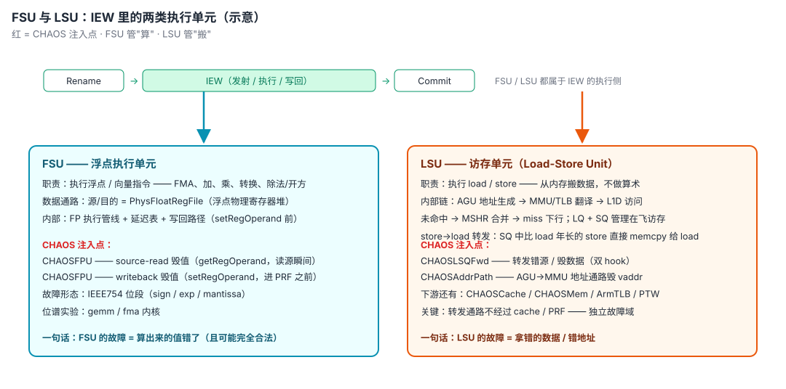

# 深入理解 gem5 及 CHAOS 架构设计与实现

## 关于本书

本书写给两类读者：想读懂 gem5 仿真器源码的人，以及想在 gem5 上做微架构故障注入研究的人。它的写法接近一份源码深读笔记：每一个结论都指向真实的文件与行号，每一处设计都回答"为什么非这样不可"。

阅读路径由浅入深分三层：

1. **入门层（第一章）**：gem5 是什么、一次仿真怎么跑起来、事件内核与对象树如何协作。读完能定位任何组件在框架中的位置。
2. **微架构层（第二、三章）**：O3 乱序核的六级流水线与内存系统的完整通路。读完能读懂 `src/cpu/o3/` 与 `src/mem/` 里的任何文件。
3. **研究层（第四~七章）**：CHAOS 故障注入框架的 19 个注入器、实验机器、以及架构理解如何决定实验有效性的方法论。读完能自己设计并辩护一个注入实验。

> 全书约定：源码引用一律 `文件:行号`（如 `simulate.cc:292`），基于 vendored 树 `CHAOS/gem5/src/`；ASCII 图覆盖所有空间结构、时序关系与多对象关系，遇到复杂机制先看图再读码。

---

## 第一章 总论：gem5 是一个离散事件仿真内核

gem5 里的一切行为，一条指令的执行、一次缓存缺失、一个注入器的触发，最终都回到同一个原点：离散事件仿真内核。本章先完整走一遍"一次仿真从脚本到退出"的全流程（§1.0），再自顶向下拆开内核的三块基石：事件循环怎么转（§1.1-1.3）、对象树怎么建（§1.4-1.5）、精度与模式怎么选（§1.6）。本章不需要任何微架构背景，但后面所有章节都要以它为坐标系。

gem5 CPU 模拟器的核心是"**离散事件仿真内核（DES, Discrete Event Simulation）+ 一棵 SimObject 对象树**"。CPU、Cache、总线、内存、故障注入器，全都只是挂在这棵树上的"事件生产者"。它相当于 Linux 内核里的调度器与中断子系统：一切上层行为最终都还原为它的基本操作。

全书全貌如下（图 1-2），从事件内核到 O3 流水线到内存系统，CHAOS 的 19 个注入器全部挂在这三层源码钩子上。后面每章都在放大这张图的一个局部，读到任何一处迷路时都可以回到这里重新定位。

```
┌──────────────────────── gem5 离散事件内核（第一章）────────────────────────┐
│  doSimLoop → EventQueue::serviceOne → event->process()   [tick 优先级排序]  ││         ▲                                    │                             │
│  Python instantiate(): createCCObject→init→regStats→probe→initState        │
│  （六遍扫描建对象图；startup 时注入器快照时间窗）                            │
└──────────────────────────────┬─────────────────────────────────────────────┘
                               │ CPU_Tick_Pri 自排事件
┌──────────────────── O3CPU::tick()（第二章）────────────────────────────────┐
│  BAC──►FTQ──►Fetch──►Decode──►Rename──►IEW──►Commit   ⟨TimeBuffer×5⟩       │
│   │BPU注入     │        │RAT/FreeList │  │IQ/LSQ/写回  │ROB头               │
│   │(负对照)    │        │  ↑↑  ↓↓     │  ↑↑           │                     │
│   │           │     ┌──┴──────────────┴──┴──┐         │                     │
│   │           │     │ PhysRegFile + FreeList │◄─旁路访问器                  │
│   │           │     │ （read-trace/stuck 内联hook）       │                     │
│   │           │     └────────────────────────┘         │                     │
│   │           │  spec_leak hook: rename.cc:963 跳过freelist归还             │
│   ▼           ▼                                        ▼                     │
│  LSQ::executeLoad                                                      │
│   ├─ sendFragmentToTranslation ──CHAOSAddrPath(翻译前毁vaddr)──► MMU     │
│   │        │                                                            │
│   │  mmu.cc:1212: !sctlr.m ──► translateMmuOff（FS 恒走此路，PTW/TLB死路）│
│   │        │ SE: translateSe 走 EmulationPageTable（软件页表）           │
│   │        │ FS: SCTLR.M=1                                              │
│   │        ├─► TLB::lookup ──CHAOSArmTLB(命中毁pfn)                     │
│   │        └─► TableWalker::doLongDescriptor ──CHAOSPTW(PTE读出后)       │
│   └─ LSQUnit 转发 memcpy（lsq_unit.cc:1502）                             │
│        ├─ pickSource(换源:错源/陈旧行/相位)   ← hook ①                   │
│        └─ corrupt(毁数:位级/byte_lane_skew)   ← hook ②                   │
└──────────────────────────────┬─────────────────────────────────────────────┘
                               │ RequestPort/ResponsePort（第三章）
┌──────────────────── 内存系统 ──────────────────────────────────────────────┐
│ L1D/L1I ──► BaseCache ──► BaseTags::findBlock ◄─CHAOSCache(假命中改道)      │
│    │          └writebackBlk ◄─CHAOSCache(victim毁写回payload)              │
│    ▼  XBar ──► L2 ──► MemCtrl ──► AbstractMemory ◄─CHAOSMem(functional RMW)│
│  isa.cc: MRS读──CHAOSArmSysReg   STXR判定──CHAOSExMon(chaos_exmon_g)       │
└────────────────────────────────────────────────────────────────────────────┘
        ▲ 全部注入器 = SimObject 插件（.py/.hh/.cc/SConscript 四文件自发现）
        ▲ 门控公约：prob→0短路 ‖ 时间窗(tick域) ‖ maxFaults ‖ Bernoulli
        ▲ 实验机器：campaign→manifest→runner→classify(六类)→escape(A-F)→fingerprint
```

### 1.0 从一次 `m5.simulate()` 说起

在拆开内核之前，先把一次仿真从头到尾走一遍。假设你在命令行敲下：

```bash
./build/ARM/gem5.opt configs/se/arm_chaos.py --injector=physreg
```

从敲下回车到看到退出统计，完整生命周期是五步：

```
┌──────────────────────────────────────────────────────────────────────┐
│ 图 1-1：一次 gem5 仿真的完整生命周期                                  │
├──────────────────────────────────────────────────────────────────────┤
│                                                                      │
│  ① Python 配置脚本（arm_chaos.py）                                   │
│     建 board / CPU / cache / 内存 / 注入器对象（全部还是 Python 对象）│
│                          │                                           │
│                          ▼                                           │
│  ② m5.instantiate()                                                  │
│     六遍扫描 Python 树 → 逐个调 C++ create() → 建出 SimObject 对象树  │
│     → 端口连接 → init → regStats → 注册探针 → initState              │
│                          │                                           │
│                          ▼                                           │
│  ③ m5.simulate()  ──►  C++ simulate()（simulate.cc:190）             │
│     装信号处理器 → 进入 doSimLoop 主循环（simulate.cc:292）           │
│                          │                                           │
│                          ▼                                           │
│  ④ 事件循环（全书的心脏）                                             │
│     while(1) { 取队头事件 → setCurTick(事件时刻) → process() }       │
│     CPU 周期、缓存写回、注入器 attackEvent……全是队列里的事件          │
│                          │                                           │
│                          ▼                                           │
│  ⑤ 退出事件（exit_event）→ 回到 Python → dump 统计 → 结束            │
│                                                                      │
└──────────────────────────────────────────────────────────────────────┘
```

本章余下部分就是在放大这张图的每一步：§1.1 放大第③④步（控制流与主循环），§1.2-1.3 放大第④步内部（时间与队列），§1.4-1.5 放大第②步（对象树怎么建起来），§1.6 回答"这棵树上能挂哪些 CPU、跑哪些世界"。

有两个先入为主的误区需要先纠正：

- **gem5 里没有"线程"在跑你的程序**。被仿真的 CPU 是事件队列上一个自我重排的周期事件，每触发一次，就仿真一个周期；它并不对应宿主机上一个循环执行指令的线程。所谓"跑完一个 workload"，是几百万次事件 process() 的累积。
- **Python 只管搭台，C++ 只管唱戏**。配置脚本建对象、连拓扑，然后就把舞台交给 C++ 的事件循环；仿真期间不会回头问 Python。这就是 §1.5 要讲的"双语言架构"。

### 1.1 一次仿真的顶层控制流

Python 侧的 `m5.simulate()` 直接进入 C++ 的 `simulate()`（`src/sim/simulate.cc:190`）。它做四件事：

1. 安装 SIGINT/SIGCONT 处理器（`simulate.cc:195-196`；`initSigCont` 是 CHAOS 相对上游 v25.1.0.1 的改动）；
2. 为多事件队列模式创建 `SimulatorThreads`（`simulate.cc:205-206`，类定义 `:68-168`）；
3. 若用户给了周期上限，调 `set_max_tick()` 挂一个 `GlobalSimLoopExitEvent`（`simulate.cc:213-224`，`set_max_tick` 定义 `:257-265`）；
4. 进入主循环 `doSimLoop(mainEventQueue[0])`（`simulate.cc:238`）。

`doSimLoop`（`simulate.cc:292-346`）是整个仿真器的心跳，一共五十行，建议逐行读一遍：

```cpp
// src/sim/simulate.cc:292-343（节选）
Event *
doSimLoop(EventQueue *eventq)
{
    curEventQueue(eventq);                    // 每线程的当前队列指针
    eventq->handleAsyncInsertions();          // 合并其它线程投递的异步事件

    bool mainQueue = eventq == getEventQueue(0);

    while (1) {
        assert(!eventq->empty());
        assert(curTick() <= eventq->nextTick() &&   // 事件不能被调度到过去
               "event scheduled in the past");

        if (mainQueue && async_event) { ... }  // stat dump / IO / 退出等异步服务
        Event *exit_event = eventq->serviceOne();   // 取队头事件并执行
        if (exit_event != NULL)
            return exit_event;                 // 唯一的出口：退出事件
    }
}
```

这个思路和 Linux 内核的 `while (1) schedule()` 主循环类似，**循环体只做一件事：取下一个事件，执行它**。CPU 时钟 tick 通过 `serviceOne()` 逐步前进：

```cpp
// src/sim/eventq.cc:224-247（节选）
Event *
EventQueue::serviceOne()
{
    std::lock_guard<EventQueue> lock(*this);
    Event *event = head;
    Event *next = head->nextInBin;
    event->flags.clear(Event::Scheduled);

    if (next) {
        next->nextBin = head->nextBin;   // 更新可能过期的 bin 指针
        head = next;                     // 弹出栈顶
    } else {
        head = head->nextBin;            // bin 内唯一元素 → 跳到下一 bin
    }

    if (!event->squashed()) {
        setCurTick(event->when());   // ← 时间直接跳到事件时刻
        event->process();            // ← 多态分发：全世界所有的"行为"都在这里发生
        ...
```

和 CPU 的 tick 一样，`curTick` 只增不减（除非 checkpoint 回退）。**gem5 里没有"线程"在跑程序，只有事件链在互相触发**，比如一条 O3 指令的执行、一次 DRAM 刷新、一个注入器的攻击，全是 `process()` 虚函数的一次调用。

CHAOS 对仿真内核本身也有极小的改动：`simulate.cc:189` 的全局 `global_exit_event`（跨多次 simulate() 调用清理上次退出事件）与 `async_hypercall` 分支（信号驱动的运行时注入入口，配套 `src/sim/async.cc:38` 与 `init_signals.cc:236-243`）。另一个要点：async 服务（statdump/io/exit/exception/hypercall）**只在主队列 queue 0 检查**，即 `bool mainQueue = eventq == getEventQueue(0)`；多队列并行模式下从队列不处理异步请求。

### 1.2 时间系统：Tick 与事件优先级

`Tick` 是 64 位最小时间单位（默认 1ps，`src/base/types.hh`）。但仅有时刻不足以确定同拍事件的执行顺序，所以 `EventBase`（`src/sim/eventq.hh:99`）定义了第二维：**优先级**（`typedef int8_t Priority`，`eventq.hh:126`；枚举值 `:138-244`）。**数值越小越先执行**。同拍事件谁先谁后，由这张表决定，地位类似内核的中断优先级表：

| 优先级常量 | 值 | 含义 |
|---|---|---|
| `Minimum_Pri` | -128 | 下界 |
| `Debug_Enable_Pri` | -101 | 开 trace，必须最先 |
| `Debug_Break_Pri` | -100 | 断点 |
| `CPU_Switch_Pri` | -31 | CPU 切换须先于任何 tick（防双跑） |
| `Delayed_Writeback_Pri` | -1 | 延迟写回（上游注释留有一句"For some reason … Steve?"） |
| `Default_Pri` | 0 | 缺省 |
| `DVFS_Update_Pri` | 31 | 电压频率更新（先于统计 dump） |
| `Serialize_Pri` | 32 | checkpoint 序列化 |
| `CPU_Tick_Pri` | 50 | **CPU 周期事件**，在写回等关联事件之后 |
| `CPU_Exit_Pri` | 64 | 线程退出 |
| `Stat_Event_Pri` | 90 | 统计 dump/reset |
| `Progress_Event_Pri` | 95 | 进度心跳 |
| `Sim_Exit_Pri` | 100 | 仿真退出，永远最后 |
| `Maximum_Pri` | 127 | 上界 |

一个直接后果：**O3 CPU 的周期事件用 `CPU_Tick_Pri`（50）注册**（`src/cpu/o3/cpu.cc:76`：`tickEvent([this]{tick();}, "O3CPU tick", false, Event::CPU_Tick_Pri)`），所以同一 tick 内，缓存写回（Delayed_Writeback_Pri=-1，更小更先）先于 CPU 下一拍执行。这保证了 CPU 在下一拍读到的是本拍已完成的状态。上游注释（`eventq.hh:202-207`）原文就写着"CPU ticks must come after other associated CPU events (such as writebacks)"。第七章会看到，注入器的"时间窗"若用错时间域（tick vs cycle），受害的正是这个双时间轴。

### 1.3 事件队列的数据结构

`EventQueue`（`eventq.hh:615`）采用是**链表的链表**：

```cpp
// src/sim/eventq.hh:259-269
// The event queue is now a linked list of linked lists.  The
// 'nextBin' pointer is to find the bin, where a bin is defined as
// when+priority.  All events in the same bin will be stored in a
// second linked list (a stack) maintained by the 'nextInBin'
// pointer.  The list will be accessed in LIFO order.  The end
// result is that the insert/removal in 'nextBin' is
// linear/constant, and the lookup/removal in 'nextInBin' is
// constant/constant.
Event *nextBin;
Event *nextInBin;
```

外层 `nextBin` 按 `(when, priority)` 排序的 bin 串，内层 `nextInBin` 是同 bin 事件的 LIFO 栈。`schedule()`（`eventq.hh:756-782`）插入时线性找 bin、常数入栈；`serviceOne()` 出队是常数操作。这个设计换来了**确定性**：同 seed 下事件执行顺序严格可复现，本仓库整套 384-seed 统计方法就建立在这个性质上（第七章 §7.4）。

```
┌─────────────────────────────────────────────────────────────────────┐
│ 图 1-3：事件队列的 bin-of-bins 结构（链表的链表）                     │
├─────────────────────────────────────────────────────────────────────┤
│                                                                     │
│   队列头 head                                                       │
│      │                                                              │
│      ▼                                                              │
│   ┌──────────┐  nextBin   ┌──────────┐  nextBin   ┌──────────┐      │
│   │ bin A    │──────────►│ bin B    │──────────►│ bin C    │──►nil │
│   │(t=100,p=50)│          │(t=101,p=-1)│          │(t=105,p=50)│     │
│   └────┬─────┘            └────┬─────┘            └────┬─────┘      │
│        │ nextInBin            │ nextInBin            │ nextInBin   │
│        ▼ (LIFO 栈)            ▼                      ▼              │
│   ┌──────────┐            ┌──────────┐            ┌──────────┐      │
│   │ CPU tick │            │ 写回事件 │            │ CPU tick │      │
│   └────┬─────┘            └──────────┘            └──────────┘      │
│        ▼                   (bin 内唯一,             (bin 内唯一,     │
│   ┌──────────┐             出队即跳 bin)            出队即跳 bin)    │
│   │ 进度心跳 │                                                   │
│   └──────────┘   bin = (when, priority) 完全相同的             nil   │
│                   事件组成的 LIFO 栈                              │
│                                                                     │
│   serviceOne(): head 弹出栈顶 → 栈空则 head=nextBin                 │
│   → setCurTick(事件时刻) → event->process()                         │
└─────────────────────────────────────────────────────────────────────┘
```

注意图中的一个细节：**bin 串按 (when, priority) 双键排序**，所以 t=101 的写回（优先级 -1）排在 t=105 的 CPU tick 之前。这就是 §1.2 优先级表在数据结构里的落点。

多队列并行模式（`numMainEventQueues > 1`）下，跨队列调度走 `async_queue`，在每个 `simQuantum` 边界由 `handleAsyncInsertions()` 合并（`eventq.hh:604-613` 注释、成员 `:624-628`，`simulate.cc:297` 调用），以量子同步换取确定性，类比内核的 tick 间中断合并。注释明确了约束："这类事件必须至少提前一个 simQuantum 调度，否则在合并时可能已被调度到过去"。本仓库全部实验为单队列，不展开；`SimulatorThreads` 的线程模型（主线程跑 queue 0、从线程跑 1..N-1、Barrier 同步，`simulate.cc:95-117, :152-162`）备查。

### 1.4 SimObject：一切组件的基类

`SimObject`（`src/sim/sim_object.hh:146`）多重继承了五个角色，每个角色对应一块框架设施：

```cpp
// src/sim/sim_object.hh:146-148
class SimObject : public EventManager,        // 拥有事件队列访问（schedule/deschedule）
                  public Serializable,        // checkpoint 序列化
                  public Drainable,           // drain 协议（切 CPU/存盘前排空）
                  public statistics::Group,   // 统计树
                  public Named                // 名称
```

生命周期由 `sim_object.hh:72-89` 的注释明确规定，而驱动它的是 Python 侧 `instantiate()`（`src/python/m5/simulate.py:220-241`）里的 `_create_cpp_objects()`（`simulate.py:147-198`）。注意它对整棵对象树做的**六遍扫描**（先序深度优先，父先于子；`sim_object.hh:91-95` 注释明确遍历序）：

```
第1遍  createCCObject()    C++ 构造（参数从 Params 结构体读入）
       connectPorts()      端口绑定（内存系统拓扑成型；与构造分开两遍，避免顺序依赖）
第2遍  init()              依赖全图的初始化
       regStats()          统计注册（只在 root 调一次，靠 C++ Group 层级级联）
第3遍  regProbePoints()    探针点注册
第4遍  regProbeListeners() 探针监听连接
第5遍  loadState()/initState()  checkpoint 恢复 / 冷启动
之后（首次 simulate() 时，simulate.py:254-258）：
       startup()           仿真即将开始——注入器在这里把 cycle 域快照成 tick 域
```

```
┌──────────────────────────────────────────────────────────────────────┐
│ 图 1-4：instantiate() 六遍扫描时间线与注入器的两个关键落点            │
├──────────────────────────────────────────────────────────────────────┤
│                                                                      │
│  m5.instantiate()                                                    │
│  ════════════════════════════════════════════════════════════════    │
│   遍1        遍2      遍3       遍4        遍5                       │
│  ┌─────┐   ┌─────┐  ┌─────┐  ┌─────┐   ┌─────┐                      │
│  │构造  │   │init │  │regPr│  │regPr│   │init │                      │
│  │+端口 │──►│+stat│─►│obePt│─►│obeLs│──►│State│                      │
│  └──┬──┘   └─────┘  └─────┘  └─────┘   └─────┘                      │
│     │                                                                │
│     ▼  ★注入器 self-attach 落点                                      │
│     │    （构造函数里把 this 写进宿主指针：                           │
│     │      cpu->lsqFwd = this 等，§4.2 模式 A）                      │
│     │    早于端口连接与 initState → hook 覆盖整个仿真生命周期          │
│  ═══╪═══════════════════════════════════════════════════════════    │
│     │                       m5.simulate()（首次）                     │
│     ▼                          │                                     │
│  ┌─────────┐                    ▼                                     │
│  │startup()│◄────────  ★注入器第二个关键落点                          │
│  └─────────┘            （TLB/SysReg 在这里把 firstClock/lastClock    │
│                          从 cycle 域快照成 tick 域，§4.3 D1/D4 修复） │
│                          │                                           │
│                          ▼                                           │
│                    事件循环开始（doSimLoop）                          │
└──────────────────────────────────────────────────────────────────────┘
```

这张图解释了两条直接影响 CHAOS 注入器的时序约束：self-attach 发生在第 1 遍（最早的时机），而触碰全局时间的操作必须推迟到 `startup()`（curTick 此时才就绪）。

一个对本项目重要的细节：**`startup()` 不在 instantiate 里调用**，它推迟到第一次 `m5.simulate()`，因为初始事件调度必须等 curTick 就绪（`sim_object.hh:273-280` startup 注释）。而 CHAOS 注入器的统一模式是在**构造函数里 self-attach**：attach 发生在第①遍，早于端口连接与 initState，所以 hook 生效期覆盖整个仿真生命周期。

对注入器来说，这张时刻表是硬约束：构造函数里只准读参数、挂指针；`startup()` 里才准触碰全局时间（第七章 §7.6 的 D1/D4 陷阱就是违反/遵守它的正反案例）。

### 1.5 双语言架构：Python 配置面，C++ 行为面

gem5 的一个特色设计：每个 SimObject 有一个 Python 参数类（`.py`）和一个 C++ 实现类，SCons 扫描 `.py` 生成纯 C++ 的 `params/<Name>.hh` 结构体。Python 版 SimObject 类实际代表它的 **Params 结构**；C++ 实例化经由 `Params::create()`（`sim_object.hh:97-101`），`PARAMS(type)` 宏（`:365-371`）用 `reinterpret_cast` 下转（目标类型可能是不完整类型，编译器不认识继承关系）。

```
┌──────────────────────────────────────────────────────────────────────┐
│ 图 1-5：双语言架构——Python 定义"有什么"，C++ 定义"怎么动"             │
├──────────────────────────────────────────────────────────────────────┤
│                                                                      │
│  ── 配置面（Python，用户可见）──────────────────────────────         │
│   CHAOSLSQFwd.py                  board.chaos_lsq = CHAOSLSQFwd(     │
│   ┌──────────────────────┐          cpu=cpu0, probability=0.01, ...) │
│   │ class CHAOSLSQFwd(   │             │  (Python 对象入树)          │
│   │   SimObject):        │             ▼                             │
│   │   type/cxx_class/    │        instantiate() 遍1                  │
│   │   cxx_header         │             │  createCCObject()           │
│   │   + Param 字段       │             ▼                             │
│   └──────────┬───────────┘        生成的 create() 调 C++ 构造         │
│              │                              │                        │
│   构建期：SCons os.walk 自动发现            │                        │
│   （src/SConscript:570）                    │                        │
│              │                              │                        │
│              ▼                              ▼                        │
│   ┌──────────────────────┐    ── 行为面（C++，仿真期执行）──         │
│   │ params/CHAOSLSQFwd.hh│    CHAOSLSQFwd.hh / .cc                   │
│   │ struct ...Params {   │    ┌──────────────────────┐               │
│   │   float probability; │    │ class CHAOSLSQFwd :  │               │
│   │   ...                │    │   public SimObject   │               │
│   │   create();          │    │   processFault() …   │               │
│   └──────────────────────┘    └──────────────────────┘               │
│                                                                      │
│   关键点：加新 SimObject = 放好 .py/.hh/.cc/SConscript 四个文件，     │
│   零框架代码改动——CHAOS 全部 19 个注入器都这么进来                   │
└──────────────────────────────────────────────────────────────────────┘
```

以本仓库的 CHAOSLSQFwd 为例（`src/cpu/o3/CHAOSLSQFwd/CHAOSLSQFwd.py`）：

```python
class CHAOSLSQFwd(SimObject):
    type = "CHAOSLSQFwd"
    cxx_class = "gem5::CHAOSLSQFwd"          # 映射到 C++ 类
    cxx_header = "cpu/o3/CHAOSLSQFwd/CHAOSLSQFwd.hh"

    cpu = Param.BaseCPU(NULL, "Target CPU (must be an O3CPU)")
    probability = Param.Float(0.0, "Per-forwarding-event probability ...")
    structuralFault = Param.String("none", "none | byte_lane_skew | all_zero")
    ...
```

运行时链路：配置脚本 `CHAOSLSQFwd(cpu=cpu0, probability=...)` → Python 对象入树 → `createCCObject()` 时生成的 `create()` 调 C++ 构造函数 `CHAOSLSQFwd(const CHAOSLSQFwdParams &p)`（`sim_object.hh:103-125` 注释详解了三种 create 约定）→ 构造函数把 `p.probability` 等读进成员。

构建侧的关键在 `src/SConscript:565-578`：

```python
# src/SConscript:565-578（节选）
for root, dirs, files in os.walk(base_dir, topdown=True):
    if root == here:
        continue    # 不递归回自身
    if 'SConscript' in files:
        SConscript(os.path.join(root, 'SConscript'), variant_dir=build_dir, ...)
```

`os.walk` 递归发现所有 `SConscript`。因此**给 gem5 加一个 SimObject 不需要碰任何框架代码**，放好 `.py`/`.hh`/`.cc`/`SConscript` 四个文件即可，SConscript 只需两行（`src/cpu/o3/CHAOSLSQFwd/SConscript`；`CHAOSPhysReg/SConscript:3` 的注释明说 "Discovered automatically by src/SConscript's os.walk"）：

```python
SimObject('CHAOSLSQFwd.py', sim_objects=['CHAOSLSQFwd'], enums=[])
Source('CHAOSLSQFwd.cc')
```

这就是 CHAOS README 说"实现为 SimObject，升级 gem5 版本也容易装"的机械原理：19 个注入器全是标准 SimObject 插件，对 gem5 的侵入只剩各流水级里几十行 hook 代码（第五章逐个清点）。

`CHAOS/Makefile` 的 `sync_chaos`（`Makefile:49-66`）从工程上守护同一件事：顶层 `CHAOS/CHAOSxxx/` 副本与 `CHAOS/gem5/src/...` 内嵌副本必须一致（vendored 为权威）。其注释引 report issue #5："a stale top-level copy, when `cp -rf`'d into the vendored tree, would silently revert the G3-G7 fixes"。同步方向因此**反转**：diff 相同则 no-op，不同则 **vendored→顶层**，把"同步"从破坏性复制变成自愈性核对。另一条重要注记（`Makefile:23-28`）：vendored gem5 树**不是干净的 upstream**，`cpu.hh`/`free_list.hh`/`regfile.hh` 带预打补丁（O3 访问器 + read-trace 钩子），从 upstream 刷新 gem5 时必须重放这些补丁。

### 1.6 精度谱系与 SE/FS 两种世界

同一内存系统上可挂四种 CPU 模型：AtomicSimpleCPU（功能级）、TimingSimpleCPU（时序近似）、MinorCPU（顺序流水线）、**O3CPU（周期级乱序流水线）**。物理寄存器堆、重命名、乱序调度这些微架构状态**只有 O3 建模**，这决定了 CHAOS 的 14 个 CPU 侧注入器全部 `dynamic_cast<o3::CPU *>` 且失败即抛异常（如 `CHAOSLSQFwd.cc:37-42`；CHAOSReg/CHAOSMem/CHAOSCache/ExMon 例外，它们不依赖 O3 专属结构）。

Workload 分 SE（syscall emulation：gem5 内置 syscall表拦截 read/write/futex，不跑内核）与 FS（full system：真实 bootloader→vmlinux→用户态）。这条边界直接决定某些注入器有没有研究对象（第四章 §4.5 与第七章 §7.7 展开）。先给结论预览：SE 模式下 ARM 翻译走 `MMU::translateSe`（`mmu.cc:323-365`，软件页表 `EmulationPageTable`），FS 的 `translateFs` 在 `mmu.cc:1212` 处按 `sctlr.m` 分流：MMU 关（SE 不开）直接恒等映射，MMU 开（FS）才走 TLB→PTW 硬件通路。

---

## 第二章 O3CPU：gem5 的乱序核

O3CPU（`src/cpu/o3/`，命名来自"Out of Order"）是本仓库全部 CPU 侧注入的研究对象。读本章最好的方式是跟着一条指令走完全程：先看它从取指到提交经过哪些阶段（图 2-1），再逐段拆解每个阶段的机制与源码。§2.1 讲流水线的骨架（六阶段组合与段间通信），§2.2-2.3 讲前端，§2.4-2.5 讲重命名与寄存器堆（乱序机的核心机制），§2.6-2.7 讲执行与访存，§2.8-2.9 讲提交与指令载体。每处都标注 CHAOS 的 hook 落点，第五章再从注入器视角回看同一批代码。

没有乱序处理器背景的读者可以先记住一个动机：**程序里的指令有依赖，但依赖不相邻的指令完全可以并行执行**。乱序机的全部复杂性，重命名、重排序缓冲、发射队列，都是为了"尽早发现能干的指令、干了又不破坏程序本来的顺序语义"。读源码时反复问"这在解决什么问题"，就不会迷路。

```
┌────────────────────────────────────────────────────────────────────────────┐
│ 图 2-1：一条指令的 O3 旅程（全书主图——19 个注入器靶点全标注 ◆）           │
├────────────────────────────────────────────────────────────────────────────┤
│                                                                            │
│  ◆CHAOSBPU   ◆CHAOSRenameMap ◆CHAOSIQ  ◆CHAOSExec ◆CHAOSROB              │
│              ◆CHAOSFreeList   ◆CHAOSFPU ◆CHAOSLSQFwd ◆CHAOSRAS           │
│              ◆CHAOSPhysReg    ◆CHAOSL1DForward   ◆CHAOSAddrPath          │
│                                                                            │
│  前端（§2.3）        乱序执行区（§2.4-2.7）              按序退休（§2.8）  │
│  ┌─────────┐        ┌──────────────────────────┐        ┌──────────┐      │
│  │ BAC/FTQ │──取指──►│ Rename: 分配 physReg      │──发射──►│ ROB 头   │      │
│  │ ◆BPU    │        │  ┌───────────────┐       │        │  按程序  │      │
│  └─────────┘        │  │ RAT(前端)     │◄─◆RenameMap     │  序提交  │      │
│  ┌─────────┐        │  │ arch→phys 映射 │       │        │         │      │
│  │ Fetch   │        │  └───────┬───────┘       │        │ ◆ROB:    │      │
│  │ (L1I ◄──┼────────┼──────────┘               │        │  entry/  │      │
│  │  ◆Cache │        │  ┌───────────────┐       │        │  exc/    │      │
│  │  L1I数据)│        │  │ FreeList 空闲池│◄─◆FreeList      │  spec_   │      │
│  └────┬────┘        │  └───────────────┘       │        │  leak    │      │
│       │译码         │         │ getReg 分配    │        │ ◆RAS     │      │
│  ┌────▼────┐        │         ▼                │        └────▲────┘      │
│  │ Decode  │        │  ┌───────────────┐       │             │ squash    │
│  └────┬────┘        │  │ PhysRegFile   │       │             │ 回滚RAT    │
│       │             │  │ phys cell 值  │◄─◆PhysReg(F3/G2)    │             │
│  TimeBuffer         │  └───────────────┘       │   ┌─────────┴──────┐    │
│  ⟨段间一拍延迟⟩      │                          │   │ Scoreboard     │    │
│  ◄──────►           │  ┌───────────────┐       │   │ 就绪位          │    │
│                     │  │ InstructionQueue│◄─◆IQ(wake)┌────────┐ │    │
│                     │  │ 依赖图+等待队列  │       │   │  │ 消费者 │ │    │
│                     │  └───────┬───────┘       │   │  └───┬────┘ │    │
│                     │          │ 唤醒          │   │      │读源  │    │
│                     │  ┌───────▼───────┐       │   │  ┌───▼────┐ │    │
│                     │  │ ALU / FSU     │       │   │  │寄存器读│ │    │
│                     │  │ ◆Exec ◆FPU   │       │   │  │◆FPU v3 │ │    │
│                     │  └───────┬───────┘       │   │  └────────┘ │    │
│                     │          │ 写回 setReg   │   └─────────────┘    │
│                     │  ┌───────▼───────┐       │        LSQ（§2.7）     │
│                     │  │ 结果队列+旁路  │       │  ┌────────────────┐   │
│                     │  │ ◆FPU v2      │       │  │ Load:  ◆L1DFwd │   │
│                     │  └───────────────┘       │  │ ◆AddrPath→MMU  │   │
│                     │                          │  │ Store→Load 转发 │   │
│                     └──────────────────────────┘  │ ◆LSQFwd 双hook  │   │
│                                                  └────────────────┘   │
│                                                                            │
│  站台间靠 TimeBuffer 通信（§2.1）；整机每拍 CPU::tick() 逐阶段轮转         │
│  （图 1-2 的 O3CPU 大框即此图的压缩版）                                    │
└────────────────────────────────────────────────────────────────────────────┘
```

读图提示：左列是前端（顺序取指），中间大框是乱序执行区（指令在这里"能干的先干"），右列是提交（恢复程序顺序）。◆ 标记 = CHAOS 注入器攻击点。"哪一级的什么状态"决定了各注入器的故障语义：比如 ◆PhysReg 打的是 cell 值，◆RenameMap 打的是 arch→phys 映射本身，同一个"寄存器错误"在两级上物理含义完全不同（§4.4 轴三）。

### 2.1 阶段组合模型与 TimeBuffer

`o3::CPU`（`src/cpu/o3/cpu.hh:114`）把六个阶段对象作为成员**组合**在一起（而非继承），每个阶段有自己的内部状态机（`cpu.hh:431-466`）：

```cpp
// src/cpu/o3/cpu.hh:431-466（protected 成员区，节选）
  protected:
    /** The branch and PC address calculation stage. */
    BAC bac;             // :433 分支地址计算（解耦前端）
    FTQ ftq;             // :436 取指目标队列
    Fetch fetch;         // :439 取指
    Decode decode;       // :442 译码
    Rename rename;       // :445 重命名
    IEW iew;             // :448 发射/执行/写回（含 LSQ）
    Commit commit;       // :451 按序提交
    PhysRegFile     regFile;          // :454 物理寄存器堆
    UnifiedFreeList freeList;         // :457 空闲物理寄存器表
    PerThreadUnifiedRenameMap renameMap, commitRenameMap;  // :460 前端/提交两张 RAT
    ROB     rob;         // :466 重排序缓冲
    Scoreboard scoreboard;   // 就绪位记分牌
```

阶段间不用回调而用**时间滑窗队列** `TimeBuffer<T>`（`src/cpu/timebuf.hh:39`）通信。CPU 持有五个（`cpu.hh:556-568`）：总线的 `timeBuffer<TimeStruct>` 加四级指令队列。`TimeStruct`（`src/cpu/o3/comm.hh:112-224`）是纯数据聚合：`FetchComm`（squash/nextPC）、`DecodeComm`（mispredict 信息）、`RenameComm`（空）、`IewComm`（freeIQEntries/freeLQEntries 等反压计数）、`CommitComm`（ROB 空位、squash 序号）。这个结构里有一段罕见的**成员级消费者标注注释**："each member is annotated with who consumes it e.g. `bool variable name; // *F, R`"，是读 O3 前端反馈通路的地图。每个阶段通过 `wire`（`timebuf.hh:58-136`）读写本拍/前几拍/后几拍的槽位。**这建模的是真实流水线的段间寄存器**：上游写进 wire 的信号，下游在延迟若干拍后看到。

`advance()`（`timebuf.hh:178-190`）是这套机制的核心，只有十二行：

```cpp
// src/cpu/timebuf.hh:178-190
void
advance()
{
    if (++base >= size)
        base = 0;

    int ptr = base + future;
    if (ptr >= (int)size)
        ptr -= size;
    (reinterpret_cast<T *>(index[ptr]))->~T();
    std::memset(index[ptr], 0, sizeof(T));
    new (index[ptr]) T;
}
```

**环形缓冲 + placement new**：`base` 前进一格，把"未来最远端"的槽位析构、清零、重新构造，变成新的"现在"。无拷贝、无加锁，纯粹指针轮转。`wire[0]` 是现在，`wire[-1]` 是上一拍，`wire[+2]` 是两拍后；`past/future` 深度由 `backComSize/forwardComSize`（默认 5/5，`BaseO3CPU.py:135-138`）决定。

```
┌───────────────────────────────────────────────────────────────────┐
│ 图 2-2：TimeBuffer 环形滑窗——段间寄存器的软件模型                   │
├───────────────────────────────────────────────────────────────────┤
│                                                                   │
│   环形槽位数组（size=5 为例），base 指针每拍 advance() 前进一格：  │
│                                                                   │
│        ┌──────┬──────┬──────┬──────┬──────┐                       │
│        │ -2   │ -1   │  0   │ +1   │ +2   │   ← wire 相对偏移      │
│        │过去2拍│过去1拍│ 现在 │未来1拍│未来2拍│                      │
│        └──────┴──────┴──┬───┴──────┴──────┘                       │
│                         │                                         │
│                    base ─┘ （advance: base=(base+1)%size）         │
│                                                                   │
│   advance() 做的事（timebuf.hh:178-190，仅 12 行）：               │
│     base 前进 → 最远未来槽（wire[+2] 原位置）                      │
│       → 析构 ~T() → memset 清零 → placement new T()                │
│       → 它成为新的 wire[0]（现在）                                 │
│                                                                   │
│   语义：本拍 Fetch 写进 wire[-2] 的信号，两拍后 Rename              │
│         从它的 wire[0] 读到 —— 建模真实流水线的                     │
│         "段间寄存器逐级传递"                                        │
│                                                                   │
│   上游写 ──► [槽] ──►(一拍)──► [槽] ──►(一拍)──► 下游读             │
└───────────────────────────────────────────────────────────────────┘
```


主循环在 `CPU::tick()`（`src/cpu/o3/cpu.cc:367-425`）：

```cpp
// src/cpu/o3/cpu.cc:367-425（节选）
void
CPU::tick()
{
    ++baseStats.numCycles;
    ...
    //Tick each of the stages
    bac.tick();
    fetch.tick();
    decode.tick();
    rename.tick();
    iew.tick();
    commit.tick();

    // Now advance the time buffers
    timeBuffer.advance();
    fetchQueue.advance(); decodeQueue.advance();
    renameQueue.advance(); iewQueue.advance();
    activityRec.advance();
    ...
    if (!tickEvent.scheduled()) {
        if (_status == SwitchedOut) { ... }
        else if (!activityRec.active() || _status == Idle) {
            cpuStats.timesIdled++;       // 无活动 → 不排下一拍
        } else {
            schedule(tickEvent, clockEdge(Cycles(1)));   // 自我重排下一拍
        }
    }
}
```

四个结构性事实：① 六阶段**同拍顺序执行**（不并行），乱序语义由各阶段内部状态机给出；② `advance()` 在六个 tick 之后统一推窗，阶段间的"一拍延迟"由此产生；③ 事件自我重排 + `ActivityRecorder` 空闲检测，无活动时 CPU 自动停拍节能，所以**注入器的时间窗参数必须落在活动区间内，否则"窗口外"注入会静默变零**（第七章 §7.6）；④ 阶段接线在构造函数 `cpu.cc:149-168`（`setTimeBuffer(&timeBuffer)`，六阶段共享同一个 `TimeBuffer<TimeStruct>`，另有 `fetch.setBACandFTQPtr(&bac, &ftq)`）。

### 2.2 关键参数：乱序窗口的形状

`BaseO3CPU.py`（`src/cpu/o3/BaseO3CPU.py`）的缺省值刻画了一个 8 发射宽机器：

| 参数 | 缺省 | 行号 | 注 |
|---|---|---|---|
| fetchWidth / decodeWidth / renameWidth / issueWidth / commitWidth | 8 | 86/101/108/120/127 | 全 8 宽 |
| numPhysIntRegs / numPhysFloatRegs / numPhysVecRegs | 256 | 174/177/180 | PRF 深度 |
| numROBEntries | 192 | 188 | ROB 深度 |
| LQEntries / SQEntries | 32 / 32 | 142/143 | LSQ 深度 |
| backComSize / forwardComSize | 5 / 5 | 135/138 | TimeBuffer 深度 |
| decoupledFrontEnd | False | 222 | 解耦前端开关（v25 新增） |
| branchPred | TournamentBP | ~199 | 缺省预测器 |

本仓库的 H2 实验沿 numROBEntries/numPhysIntRegs/LQ/SQ 扫参（`campaigns/h2-window-sweep.yaml`），FS 侧另有 TaiShan V110 代理参数（`configs/se/arm_chaos_fs.py`、`configs/se/arm_chaos.py:45-63`：`--kp920_proxy` 时 ROB=128、PhysInt=160、PhysFloat=192、LQ=48、SQ=42、全 4 宽、2.6GHz）。help 文本里明确声明 "NOT cycle-exact (no distributed scheduler / no partition L3 / no bufferless NoC)"，这种把模型边界写进 help 的做法贯穿全仓库。文件尾部（`:244-259`）还保留了 MICRO'23 Ignite 论文的 `add_citation`，解耦前端（BAC/FTQ）正来自这篇论文。

### 2.3 前端：BAC → FTQ → Fetch

v25 的 O3 前端有一层新结构：**BAC（Branch and Address Calculation，`src/cpu/o3/bac.hh:57`）+ FTQ（Fetch Target Queue）**构成的"解耦前端"，分支预测可以领先取指若干拍独立推进。但解耦模式（`decoupledFrontEnd`）缺省**关闭**（`BaseO3CPU.py:222`），耦合路径下 Fetch 直接查询 BPU，BAC 空转。

**CHAOSBPU 的 hook** 落在 `BAC::predict`（`src/cpu/o3/bac.cc:578-593`）：

```cpp
// src/cpu/o3/bac.cc:578-593（节选）
    assert(ft->bpuHistory == nullptr);
    bool taken = bpu->predict(inst, ft->ftNum(), pc, tid, ft->bpuHistory);

    // CHAOSBPU (S8-4): optionally substitute the predicted target (F5)
    // or flip the direction (F1). Wrong speculative stream should squash
    // (P(arch==golden after squash) ~= 1 — negative-control surface).
    // `pc` is a PCStateBase& — downcast to PCStateWithNext (has npc()
    // getter/setter) via the gem5 as<T>() idiom.
    if (chaosBpu) {
        taken = chaosBpu->maybeSubstituteTarget(
            pc.as<GenericISA::PCStateWithNext>(), taken);
    }
```

hook 挂在 `bpu->predict()` **之后**："预测器已经说话，注入器改写其裁决"。两处配置面事实必须记录在案（`configs/se/arm_chaos.py:589-596` 的 HONEST LIMITATION 段）：

1. **解耦前端在标准板上不能启动**：SimpleBoard 上开 `decoupledFrontEnd` 实测不 boot（空 stats），v25 实验性解耦前端与 SimpleBoard 不兼容，hook 保留待未来接线到 Fetch 耦合路径；
2. **当前代码里 CHAOSBPU 实际未自挂载**：宿主侧基础设施齐全（`bac.hh:344-348` 的 `chaosBpu` 成员与 `setChaosBPU()`、`cpu.hh:502-504` 的 `bacAccess()`、`fetch.hh:234-236` 的 `getBAC()`），但**全仓库无任何一处调用 `setChaosBPU()`**，`chaosBpu` 恒为 nullptr。叠加解耦前端限制，该注入器在标准配置下 `numTargetSub=0`。BPU 注入因此定位为"负对照面"（错误预测流应被 squash 恢复，P(架构态==golden)≈1），它验证的是"流水线自愈"这个保护机制。这是第五章 §5.1 详述的"文档与代码不一致时，以代码为准"案例。

### 2.4 Rename：两张 RAT 与历史缓冲

**为什么需要重命名？** 程序里只有 31 个通用架构寄存器（X0-X30），但乱序执行的指令成百条在飞。如果两条指令先后写同一个 X5，后面的指令必须读到"离它最近的那次写"；若直接在架构寄存器上写，后写会覆盖先写，先写的消费者就读到了错值（WAW/WAR 冒险）。解法：给**每次写**都分配一个全新的物理寄存器（PRF 有几百个），把"架构寄存器 → 物理寄存器"的当前映射记在 RAT（Rename Alias Table，重命名别名表）里。这样 X5 的两次写落在两个不同的物理寄存器上，各读各的，互不干扰；指令提交后，老映射的物理寄存器才归还空闲池。

理解了这个动机，下面的数据结构就好读了。Rename 阶段维护**两张映射表**（`cpu.hh:459-463`）：

- `renameMap`（前端 RAT）：架构寄存器 → 物理寄存器的**投机**映射，在飞指令读它；
- `commitRenameMap`（提交 RAT）：已提交指令确立的**提交**映射。

每次重命名压入一条 `RenameHistory`（`src/cpu/o3/rename.hh:311-330`）：`(instSeqNum, archReg, newPhysReg, prevPhysReg)`。squash 时 `Rename::doSquash`（`rename.cc:934-944`）沿历史缓冲逐条回滚：把 RAT 恢复到 prevPhysReg，把 newPhysReg 归还 FreeList（经 `freeingInProgress` 延迟队列避开 SMT 所有权冒险。上游注释 `rename.cc:972-975` 解释：被 squash 的指令可能仍在 IEW 执行并持有该寄存器，须等 commit 阶段真正 squash 后才回收，`:1378-1388` 完成回收）。

```
┌──────────────────────────────────────────────────────────────────────┐
│ 图 2-3：squash 回滚数据流与三个注入器的攻击位点                        │
├──────────────────────────────────────────────────────────────────────┤
│                                                                      │
│   分支误预测 → squash 序号 X 之后的指令全部作废                        │
│                                                                      │
│   RenameHistory（按序压栈）         doSquash 逐条回滚（rename.cc:935）│
│   ┌────────────────────────────┐    ┌─────────────────────────────┐  │
│   │ (seq=X+2, x5, P30, P17)    │──► │ RAT[x5] = P17   （恢复旧映射）│  │
│   │ (seq=X+1, x9, P42, P8)     │──► │ RAT[x9] = P8                │  │
│   │ (seq=X,   x5, P17, P3)     │    │ （<=X 的保留——正确路径）     │  │
│   └────────────────────────────┘    └──────────────┬──────────────┘  │
│                                                    │                 │
│                          newPhysReg 的归还路径 ◄────┘                 │
│                          ┌──────────────────────────────┐            │
│                          │ freeingInProgress 延迟队列    │            │
│                          │ （等 commit 真正 squash 再还）│            │
│                          │        ▲                     │            │
│                          │        │ ② spec_leak hook     │            │
│                          │        │   跳过归还 → 泄漏态  │            │
│                          └────────┼─────────────────────┘            │
│                                   │                                  │
│   三个注入器打在同一张图的不同部位：  │                                  │
│   ◆RenameMap：换 RAT 项（x5→别人的P）① 换映射                        │
│   ◆FreeList：把活的 P 塞回空闲池（下次 getReg 双占用）                │
│   ◆ROB spec_leak：② 跳过归还（错路径写保留）                         │
│                                                                      │
└──────────────────────────────────────────────────────────────────────┘
```

**CHAOSROB 的 spec_leak hook** 精确插在回滚的归还点上（`rename.cc:958-977`）：

```cpp
// src/cpu/o3/rename.cc:958-977（节选）
if (hb_it->newPhysReg != hb_it->prevPhysReg) {
    // Tell the rename map to set the architected register to the
    // previous physical register that it was renamed to.
    renameMap[tid]->setEntry(hb_it->archReg, hb_it->prevPhysReg);

    // CHAOSROB spec_leak (S6-4): optionally SKIP the freelist
    // return — the wrong-path dest physReg is neither referenced
    // by the RAT nor returned to the free list, leaking the
    // speculative write (method1's state-leak 4x signature).
    if (chaosRob && chaosRob->maybeDelayFree(hb_it->newPhysReg)) {
        DPRINTF(Rename, "[tid:%i] spec_leak: skipped freelist return ...");
    } else {
        freeingInProgress[tid].push_back(hb_it->newPhysReg);
    }
}
```

关键语义：跳过的是 `freeingInProgress` 归还，**RAT 回滚（setEntry）保留**，RAT 一致性不破坏。这个 hook 的位置选择忠实于微架构语义：**错路径写保留**这个故障模型，在物理上对应"物理寄存器既不被 RAT 引用、也不回到空闲池"的泄漏态。它破坏的是一个**协议不变量**而非数据位，位级注入器够不到这种故障形态（§4.4 轴三）。hook 指针声明在 `rename.hh:89-95`（ctor self-attach 模式）。

### 2.5 物理寄存器堆与 FreeList：CHAOSPhysReg 的靶点

`PhysRegFile`（`src/cpu/o3/regfile.hh`）按类别分 bank：intRegFile / floatRegFile / vectorRegFile / vecPredRegFile / matRegFile / ccRegFile 各是一维数组，配套 `PhysRegId` 表。`UnifiedFreeList`（`free_list.hh:143`）按类别包了 N 个 `SimpleFreeList`（`std::array<SimpleFreeList, CCRegClass+1>`，`:151`，按寄存器类分片的队列数组；类注释 `:130-141` 解释为何叫 Unified：`FreeList` 名字被 CPU Policy 的 typedef 占用）。CHAOS 需要的两类 API：

**判活探针**：`isFree(type, reg)`（`free_list.hh:212-218`）→ `SimpleFreeList::contains`（`free_list.hh:109-126`）：

```cpp
// src/cpu/o3/free_list.hh:109-126（节选）
/** True iff the given physical register is currently in the free list
 *  (= not allocated = dead/inactive). Used by CHAOSPhysReg's liveness
 *  probe: a phys reg NOT in the free list is allocated and may be read
 *  by in-flight instructions even if no rename map entry currently
 *  points to it (e.g. an in-flight inst still holds it as a source).
 *  O(N) scan of the queue; only called at inject time, not hot path. */
bool contains(const PhysRegIdPtr reg) const {
    // std::queue's underlying container is protected; derive a helper to
    // expose it so we can scan (queue doesn't support iteration).
    struct ExposedQueue : public std::queue<PhysRegIdPtr> {
        using std::queue<PhysRegIdPtr>::c;
    };
    const auto &c = static_cast<const ExposedQueue&>(freeRegs).c;
    for (const auto &r : c) { if (r == reg) return true; }
    return false;
}
```

`ExposedQueue` 继承技巧（`using std::queue::c` 暴露受保护底层容器）是绕开 `std::queue` 不可迭代的标准 hack。注释给出判据："**一个物理寄存器不在 free list 里 = 已分配 = 活跃**"，即使当前没有任何 RAT 项指向它（老映射被覆盖但在飞指令仍持有它当源）。这个判据是 CHAOSPhysReg 探活的基础，也修正过早期"沿 RAT 反查"的过窄判据（曾把活槽误标死，制造 dead-slot SDC 假象）。

**毁伤原语**：`addReg(reg)`（`free_list.hh:83`：`freeRegs.push(reg)`）直接把寄存器压回空闲队列。CHAOSFreeList 的 `mark_free` 故障用的就是对这个**原生公开 API** 的滥用（free_list 本身零改动）。

regfile.hh 本身被注入器"借道"加了三组热路径内联代码（`regfile.hh:167-231`）：

1. **旁路访问器**（`:167-183`）：`numIntPhysRegs()/intPhysRegId(idx)/…/vecRegBytes()` 把私有 bank 暴露给注入器，注释声明"Direct members are private; these are the only public route"，且 `vecRegBytes()` 的注释记录了 64B 栈缓冲对 SVE-2048b（256B）溢出 192B 的 report issue #3；
2. **read-trace**（`:185-209` 声明，`:248-263`/`:296-300` 计数，`:353-359`/`:372-374`/`:413-416` 置 overwritten）：读注入值计数、写即封存（第五章 §5.4 详述）；
3. **G2 stuck-at 写路径掩码**（`:211-231` 声明，`:358-366`/`:371-380` 施加）：永久故障在**每次写**该槽位时强制粘死位。

第五章会逐行读这三组代码；这里先记结构教训：**注入逻辑不塞进 regfile，regfile 只开最小通道**，侵入面控制在可审计的几十行。

### 2.6 IEW：发射队列与依赖图

IEW（Issue/Execute/Writeback）阶段管理乱序执行的核心问题：指令操作数没齐就不能发射。发射队列为此维护一张依赖图，每条指令挂在其源寄存器的等待队列上，生产者执行完后唤醒所有等它的消费者。

`IEW::tick`（`src/cpu/o3/iew.cc:1430` 起）一拍内的次序：`ldstQueue.tick()`（LSQ）→ `sortInsts` → 各线程 `checkSignalsAndUpdate` + `dispatch` → `executeInsts` → `writebackInsts` → `instQueue.scheduleReadyInsts`（为下一拍排发射）→ `issueToExecQueue.advance()`。

发射队列 `InstructionQueue` 的唤醒核心是 `wakeDependents`（`src/cpu/o3/inst_queue.cc:1077-1096`）：沿依赖图 `dependGraph` 弹出目的寄存器的等待者，`markSrcRegReady()` 后 `addIfReady()`。**CHAOSIQ 在每个依赖者被弹出后、置就绪位前插问**（`inst_queue.cc:1172-1191`）：

```cpp
// src/cpu/o3/inst_queue.cc:1172-1191（节选）
// S8-1b CHAOSIQ F6 hook: wake_omit (skip this wakeup) /
// wake_phase (defer to the next wakeDependents call).
// The skipped dependent is RE-QUEUED onto the dep graph
// (pop the NEXT entry first, then re-insert the skipped
// one — pop-then-push would return the same node forever).
if (cpu->chaosIQ) {
    CHAOSIQ::HookAction act =
        cpu->chaosIQ->hookWakeDependents(dep_inst, dest_reg);
    if (act != CHAOSIQ::HookAction::None) {
        DynInstPtr skipped = dep_inst;
        dep_inst = dependGraph.pop(dest_reg->flatIndex()); // 先弹下一个
        dependGraph.insert(dest_reg->flatIndex(), skipped); // 再塞回被跳过者
        if (act == CHAOSIQ::HookAction::Defer)
            cpu->chaosIQ->recordDeferred(skipped, dest_reg->flatIndex());
        requeued = true; ++dependents; continue;
    }
}
```

两处防御性细节写进了 hook 本身：

- **先弹后塞**（否则 pop-push 死循环返回同一节点）；
- 被延迟的唤醒在**下一次** `wakeDependents` 开头由 `takePendingWakeups()` 投递并**从依赖图移除**（`inst_queue.cc:1082-1096`）。注释原文"leaving it queued would trip the drain-time 'not empty' panic"，配套 `:1206-1213` 的 `if (!requeued) { assert(dependGraph.empty(...)); ... }` 断言豁免。

`HookAction` 三态枚举（`CHAOSIQ.hh:40`）：`{None, Omit, Defer}`，Omit=吞掉本次唤醒，Defer=推迟一拍（一拍延迟近似）。hook 的注释还自我声明建模局限：wake_phase 是"一拍延迟近似"，gem5 的同步 IQ 没有真正的相位流水可移位。**代理位置的错位要声明**，这是这个项目的方法论纪律。

### 2.7 LSQ 与 store→load 转发：CHAOSLSQFwd 的靶点

LSQ（Load/Store Queue）里有一条重要的快路径：load 发现队列里有地址重叠、尚未写回内存的 store 时，直接从 store buffer 把数据拷给自己，不必等 store 落到 cache 再去读。这就是 store→load 转发。它由一个 memcpy 完成，不经过 cache。

`lsq_unit.cc` 的转发判定在 `:1440-1473`：遍历 SQ 中比 load 年长的 store，按地址覆盖算出 `AddrRangeCoverage`（None/Partial/Full）。完整布尔代数由四个布尔（`store_has_lower/upper_limit`、`lower/upper_load_has_store_part`）加三个排除条件（atomic、LLSC、masked）构成；循环入口门槛（`:1423-1425`）：`store_size != 0 && !strictlyOrdered() && !isCacheMaintenance()`。`FullAddrRangeCoverage` 分支就是硅上 store buffer 前递网络的模型：

```cpp
// src/cpu/o3/lsq_unit.cc:1489-1516（节选，两处 CHAOS hook 原样保留）
uint8_t *fwd_src = (uint8_t*)(store_it->data() + shift_amt);
if (cpu->lsqFwd) {                       // hook ①：换源
    fwd_src = cpu->lsqFwd->pickSource(
        (uint8_t*)(store_it->data() + shift_amt),
        request->mainReq()->getSize(),
        request->mainReq()->getVaddr());
}
memcpy(load_inst->memData, fwd_src,
    request->mainReq()->getSize());       // ← 转发即这个 memcpy

if (cpu->lsqFwd) {                        // hook ②：毁数
    cpu->lsqFwd->corrupt(load_inst->memData,
                         request->mainReq()->getSize(),
                         request->mainReq()->getVaddr());
}
```

两个 hook 的分工对应两类故障语义：`pickSource` 在 **memcpy 之前**替换数据源（错源转发/陈旧行重放/相位错位，"拿错的数据"），`corrupt` 在 **memcpy 之后**改写目的缓冲（位级/结构化故障，"数据在通路上被毁"）。注意**转发数据不经过 cache、也不经过 PRF 读端口**（消费即生产时甚至不写 PRF cell）。这就是必须独立造 LSQFwd 注入器的全部根据：PRF/Cache 位翻转注入器对这条通路天然失明。第七章 §7.3 的"forwarding 掩蔽定律"是同一事实的反向利用。

```
┌──────────────────────────────────────────────────────────────────────┐
│ 图 2-4：store→load 转发判定决策树（lsq_unit.cc:1423-1516）            │
├──────────────────────────────────────────────────────────────────────┤
│                                                                      │
│  load 进来，遍历 SQ 中比它老的 store：                                │
│                                                                      │
│  [入口门槛 :1423] store_size!=0 && !strictlyOrdered                   │
│                      && !isCacheMaintenance ？                        │
│        ├──否──► 跳过该 store（LLSC/atomic/cache维护不转发）           │
│        └──是─┐                                                      │
│                ▼                                                     │
│  [覆盖计算 :1440-1473] AddrRangeCoverage = ?                         │
│        ├── NoAddrRangeCoverage ──► 看下一个 store                     │
│        ├── Partial ────────────► 不完整，走慢路径（访存）             │
│        └── FullAddrRangeCoverage ──► ★ 完整覆盖，前递网络：           │
│                                      ┌─────────────────────────┐     │
│                                      │ ① hook: pickSource      │     │
│                                      │    (换源: 错store/陈旧行 │     │
│                                      │     /相位错位)           │     │
│                                      │         │               │     │
│                                      │         ▼               │     │
│                                      │  memcpy(load.memData,   │     │
│                                      │         fwd_src, size)  │     │
│                                      │         │  ← 转发本体    │     │
│                                      │         ▼               │     │
│                                      │ ② hook: corrupt          │     │
│                                      │    (毁数: 位级/结构化)   │     │
│                                      └─────────────────────────┘     │
│                                                                      │
│  注意：全程不碰 cache、不碰 PRF 读端口——两个 hook 分别守在            │
│  memcpy 的"前"（数据从哪来）与"后"（数据变成了什么）                  │
└──────────────────────────────────────────────────────────────────────┘
```


### 2.8 Commit 与 ROB

`Commit::tick`（`src/cpu/o3/commit.cc:599-631`）是清晰的三段式：①先收尾 squash（`rob->doSquash` 每拍推进）→ ②`commit()` 按序退休 ROB 头指令 → ③`markCompletedInsts()` 通知 IEW 回收。ROB（`src/cpu/o3/rob.hh:68-83`）是 `std::list<DynInstPtr>` 加每线程状态机（Running/Idle/ROBSquashing）；上游一句话点题："**The ROB is largely what drives squashing**"。

CHAOSROB/CHAOSRAS/CHAOSExec 都从 `cpu->robAccess()`（`cpu.hh:497`，转发 `rob.hh:129` 的 `readHeadInst(tid)`）拿 ROB 头，对**即将提交**的指令做攻击。注意它们攻击的是 ROB 头而非任意槽位，因为只有头部的状态能进入架构态。

### 2.9 DynInst：指令的运行时载体

`DynInst`（`src/cpu/o3/dyn_inst.hh`）是在飞指令的全状态载体：PC、seqNum、重命名后的物理源/目的、`instResult` 结果队列、fault、memData……CHAOS 在它的寄存器读写接口与结果队列上开了三个 hook：

- `getRegOperand`（读源，`:1177-1193`）：CHAOSFPU 的 source-read hook，在**消费者读操作数的瞬间**毁值。注释原文："this is the ONLY reliable corruption point for back-to-back dependency chains — PRF cell injection is defeated by operand forwarding"；
- `setRegOperand`（写目的，`:1217-1232`）：CHAOSFPU 的 writeback hook，在**值进 PRF 之前**毁值（blob 重载 `:1234-1248` 对称地调 `maybeCorruptWritebackBlob`）；
- `corruptResultRegVal`（`:705-718`）：通用结果毁伤入口，CHAOSExec/CHAOSL1DForward/CHAOSFPU v1 用它攻击 ROB 头 load/ALU 结果。底层原语 `InstResult::corruptRegVal`（`src/cpu/inst_res.hh:110-117`）对 blob（向量）返回 false，明确拒绝不可 XOR 的结果。

CHAOSFPU.hh 的注释完整记录了一次 hook 迁移（`CHAOSFPU.hh:20-29` + `cpu.hh:529-538`）：v1 挂在 ROB 头攻击 `corruptResultRegVal`，在 gemm_double 上 **5089/5089 次命中"result already popped"**（到 ROB 头时结果早已弹出，0 次真实命中）。hook 点选错，注入器就成了永不击发的枪。v2 迁到 setRegOperand 写回路径后才有真实命中。第七章 §7.1 把这条经验上升为定律。另一个并列的教训：CHAOSFPU 曾用 `isFloating()` 过滤 FP 指令，但**ARM ISA 从不设置 IsFloating 静态标志**（只有 x86/riscv/sparc 设），gemm_kernel 上 14.4 万次采样 0 命中；修法是按**目的寄存器类**（FloatRegClass/VecRegClass）过滤（`CHAOSFPU.cc:258-263` 注释）。

### 2.10 FSU 与 LSU：IEW 执行侧的两类单元

第二章讲到这里，执行侧还差一张总图。O3 的执行单元分两类，CHAOS 对应的注入器也分成两族：FSU（浮点/向量执行单元）管"算"，攻击它的是 CHAOSFPU（§5.7）；LSU（访存单元）管"搬"，攻击它的是 CHAOSLSQFwd（§5.11）与 CHAOSAddrPath（§5.12），下游再接 Cache/Mem/TLB/PTW 一串（第五章 G4/G5 组）。两类单元的故障语义不同：FSU 的故障是算出来的值错（IEEE754 位段），LSU 的故障是拿错的数据或错地址。图 2-5 给出全景：



---

## 第三章 内存系统：从 Request 到 DRAM

CPU 流水线之外的一切"慢"东西，cache、总线、内存、地址翻译，都归内存系统管。本章沿一次访存的传播方向讲：先看它被包装成什么对象（§3.1 Request/Packet），再看它走什么通道（§3.2 Port 三模式），然后逐层下行（§3.3 Cache、§3.4 物理内存），最后单独深读 ARM 地址翻译栈（§3.5）。单独深读翻译栈的原因很直接：四个 FS-only 注入器全部挂在翻译栈上，而 §3.5 的那行 `if` 是全书画得最重的一条"模式边界"。

### 3.1 Request 与 Packet

一次访存的三个抽象层：`Request`（谁、哪个虚地址、什么语义，`src/mem/request.hh`）→ `Packet`（带上 MemCmd 与数据缓冲的传输单元，`src/mem/packet.hh`）→ Port 间协议交互。

```
┌────────────────────────────────────────────────────────────────────┐
│ 图 3-1：一次访存的三层抽象                                           │
├────────────────────────────────────────────────────────────────────┤
│                                                                    │
│  CPU 一条 load 执行：                                              │
│                                                                    │
│  ┌──────────────┐  "谁、哪个虚地址、什么语义"                        │
│  │ Request      │  requestorId / vaddr / size / flags / pc          │
│  │ (request.hh) │  ◆CHAOSAddrPath 的 setVaddr 落点（:858，          │
│  └──────┬───────┘    翻译前只改 vaddr，保全其余元数据）              │
│         │                                                          │
│         ▼  被包装进                                                 │
│  ┌──────────────┐  "带 MemCmd 与数据缓冲的传输单元"                  │
│  │ Packet       │  cmd(ReadReq/WriteReq/...) + data 指针            │
│  │ (packet.hh)  │  ◆CHAOSMem 构造 Read/Write 包直捅内存             │
│  └──────┬───────┘    （functional 模式，§3.2）                       │
│         │                                                          │
│         ▼  沿 Port 间协议流动                                       │
│  ┌──────────────┐  timing / atomic / functional 三模式              │
│  │ Port 交互     │  CPU.port ◄──► L1D ◄──► XBar ◄──► ... ◄──► DRAM  │
│  │ (port.hh)    │  （§3.2 展开）                                    │
│  └──────────────┘                                                  │
│                                                                    │
└────────────────────────────────────────────────────────────────────┘
```

request.hh 里有一处 CHAOS 修改（`request.hh:858-869`）：

```cpp
// src/mem/request.hh:858-869
/** CHAOSAddrPath (P-D2) injector: in-place vaddr mutation at the
 *  address->MMU boundary (sendFragmentToTranslation, BEFORE translate).
 *  Unlike setVirt(), this changes ONLY _vaddr — preserving size/flags/
 *  requestorId/pc/translation state, so the corrupted vaddr is what the
 *  PTW/MMU actually walks (reproducing core 179's D2: arch MSB d9 -> MMU
 *  saw 00). Only meaningful pre-translation; calling after translation
 *  has no effect on the already-resolved paddr. */
void
setVaddr(Addr vaddr)
{
    _vaddr = vaddr;
}
```

为什么不用现成的 `setVirt()`？注释说得明确：setVirt 会重置 size/flags/requestorId/翻译状态，而地址通路注入需要**只改 vaddr、保全其余全部元数据**。被腐蚀的 vaddr 必须原样进入 MMU 走查，才忠实复现"架构寄存器是对的、MMU 收到的是错的"这一现场签名。

### 3.2 Port 系统

`RequestPort`/`ResponsePort`（`src/mem/port.hh:134`/`:347`）以三套接口覆盖三种访问模式：timing（周期精确，带 retry 反压）、atomic（单拍功能模拟）、functional（debugger/注入器直捅，绕过时序）。实现的窍门是**三重协议继承**：每个 Port 类同时继承 Atomic/Timing/Functional 三套协议基类（`port.hh:124-136`）：

```cpp
// src/mem/port.hh:124-136
class RequestPort: public Port, public AtomicRequestProtocol,
    public TimingRequestProtocol, public FunctionalRequestProtocol
{
```

标准拓扑（图 3-2，标注全部 CHAOS 攻击位点）：

```
┌────────────────────────────────────────────────────────────────────────┐
│ 图 3-2：内存层级拓扑与 CHAOS 攻击位点                                   │
├────────────────────────────────────────────────────────────────────────┤
│                                                                        │
│   CPU（O3，第二章）                                                     │
│    │ icache_port                    │ dcache_port                      │
│    ▼                                ▼                                  │
│  ┌─────────┐   ┌──────────────────────────┐   ┌─────────┐              │
│  │ L1I     │   │ L1D (BaseCache)          │   │  Walker │(FS:页表走查)│
│  │ ◆Cache: │   │  ├ findBlock ◄─◆Cache     │   │  ◆PTW   │              │
│  │ L1I语义 │   │  │  (tag假命中改道)        │   └────┬────┘              │
│  │ 字段注入│   │  ├ writebackBlk ◄─◆Cache  │   ┌────▼────┐              │
│  └────┬────┘   │  │  (victim载荷毁伤)      │   │ D/I TLB │              │
│       │        │  └ 数据字节 ◄─◆Cache      │   │ ◆ArmTLB │(命中毁pfn)  │
│       │        └────────────┬─────────────┘   │ ◆ExMon   │(STXR判定)   │
│       │                     │                 └──────────┘              │
│       ▼                     ▼                                           │
│  ┌──────────────────────────────────────────┐                          │
│  │ XBar（RequestPort/ResponsePort 互联）     │                          │
│  └───────────────────┬──────────────────────┘                          │
│                      ▼                                                 │
│  ┌──────────────────────────────────────────┐                          │
│  │ L2 (BaseCache)  ◆Cache 亦可打            │                          │
│  └───────────────────┬──────────────────────┘                          │
│                      ▼                                                 │
│  ┌──────────────┐   ┌─────────────────────────────────────┐            │
│  │ MemCtrl      │──►│ AbstractMemory / DRAM               │            │
│  └──────────────┘   │ ◆Mem: functional RMW 直读直写        │            │
│                     │   (CHAOSMem.cc:237-244, 不占时序资源) │            │
│                     └─────────────────────────────────────┘            │
│                                                                        │
│  ◆SysReg 打在 isa.cc MRS 读路径（§3.5），不在本图拓扑上                  │
└────────────────────────────────────────────────────────────────────────┘
```

（脚注：`port.hh:332-336` 还保留了 `[[deprecated]] class MasterPort : public RequestPort`，Master/Slave → Request/Response 的命名演进史。）

三种访问模式的分工与 CHAOS 的使用者：

| 模式 | 用途 | CHAOS 谁在用 |
|---|---|---|
| timing | 周期精确模拟，带 retry 反压（真实流量） | 全部 CPU 侧注入器的研究通路 |
| atomic | 单拍功能模拟（快速 boot、非时序探索） | fs_checkpoint 的 Atomic-boot 阶段 |
| functional | 绕过时序直读直写（debugger/注入器） | CHAOSMem 的 RMW 攻击、TLB functional 查找 |

CHAOSMem 对 DRAM 的攻击走 **functional 通道**（`CHAOSMem.cc:237-244/331`：`memory->access(read_pkt)`），构造 ReadReq/WriteReq 包直读直写物理内存，不占用时序资源。这是"注入器是旁观者，不是访存者"原则的体现。

### 3.3 Cache 层级：BaseCache 与 tags

`BaseCache`（`src/mem/cache/base.hh:103`）实现命中/缺失/MSHR 合并/写回状态机；标签阵列抽象为 `BaseTags`（`src/mem/cache/tags/base.hh:81`），具体是 `BaseSetAssoc`/`FALRU`/`SectorTags` 等子类。CHAOSCache 在这层有**两个 hook**，分别建模两类故障：

**hook ①：查找期假命中**（`src/mem/cache/tags/base.cc:83-107`，`BaseTags::findBlock`）：

```cpp
// src/mem/cache/tags/base.cc:99-107
if (blk->match(key)) {
    // CHAOS §5.8B tag false-hit diversion: if this block is the
    // corrupted VICTIM way of a registered alias, serve the lookup
    // from the ALIAS way's block instead (wrong data, real tag
    // store untouched -> evictions stay protocol-consistent).
    if (chaosCache && blk->isValid()) {
        CacheBlk* div = chaosCache->chaosDivertFindBlock(blk, entries, key);
        if (div) return div;    // 查 A 却返回 B 的数据块
    }
    return blk;
}
```

CHAOSCache.hh 的长注释（`:29-48`）解释了为什么不在标签存储里改 tag。这是"第一轮验证失败后重构"的完整案例，注释交代了因果链：直接 `setTag()` 改写 tag 存储 → 该行以 snoop filter 从未追踪的地址逐出 → `snoop_filter.cc:144-145` 的 `panic_if((sf_item.holder & req_port).none(), ...)`（WritebackDirty/CleanEvict of an untracked line），那是 SimulatorError，不是合法 DUE 结局。于是故障模型改在**查找时改道**：tag 存储不动，逐出/写回仍按真实地址走协议，只有**数据供给**错了，而 SDC 关心的正是这一点。

**hook ②：牺牲者路径写回毁伤**（`src/mem/cache/base.cc:1795-1805`，`BaseCache::writebackBlk`）：

```cpp
// src/mem/cache/base.cc:1795-1805
pkt->allocate();
pkt->setDataFromBlock(blk->data, blkSize);

// CHAOS §5.8A victim-field injection: corrupt the writeback payload
// AFTER the data was copied from the (intact) block — models a fault
// in the writeback/eviction data path (the line in the cache is
// fine; what goes DOWN is wrong). Hot path: no injector -> identical
// to upstream.
if (chaosCacheVictim) {
    chaosCacheVictim->chaosCorruptWriteback(pkt, blk);
}
```

hook 位置在 `setDataFromBlock` **之后**：数据已从完好块拷出，注入器改的是**下行分组载荷**。cache 行本身完好，这是 tag 注入器与数据阵列注入器都看不见的盲区。

### 3.4 物理内存与 CHAOSMem

`AbstractMemory` 提供字节粒度的 backing store。CHAOSMem 的攻击循环（`CHAOSMem.cc:206-382` `attackMemory`）：几何分布抽地址 → （可选）`addr_map_sub` 异或重定向（`:221-235`，F5 合法域内错址）→ functional 读-改-写回单字节。注释里沉淀了三条修复史：

- **G4 off-by-one**（`:214-217`）："[target_start, target_end] BOTH inclusive — the old code used (target_end - 1), silently dropping the last byte of the range"。注入器自身的 off-by-one 会变成"最后字节永远不会被打中"的采样偏差；
- **G4 权重向量 bug**（`:113-122`）：旧权重向量是 `{bit_flip, bit_flip, stuck_at_one}`，重复的 bit_flip 加丢失的 stuck_at_zero，导致 `discrete_distribution` 的 index 1（映射到 StuckAtZero）实际选中了 bit_flip；
- **D3 持久性**（`:418-424`）：stuck 故障曾因 `update=false` 在第一次 checkPermanent 后失效，"a stuck-at fault vanished if a later write overwrote the target byte between checks"。

### 3.5 ARM 翻译栈与 SE/FS 边界：mmu.cc:1212 那行 if

ARM 翻译栈是 MMU（`src/arch/arm/mmu.cc`）→ TLB（`src/arch/arm/tlb.cc`）→ TableWalker（`src/arch/arm/table_walker.cc`）三级：MMU 先查 TLB，TLB 未命中由页表走查器（PTW）从内存里逐级读描述符。四个注入器挂在这条链上，全部 **FS-only**。分界的核心在 `MMU::translateFs` 里（`mmu.cc:1203-1221`）：

```cpp
// src/arch/arm/mmu.cc:1203-1221（节选）
bool vm = state.hcr.vm;
if (HaveExt(tc, ArmExtension::FEAT_VHE) &&
    state.hcr.e2h == 1 && state.hcr.tge == 1)
    vm = 0;
else if (state.hcr.dc == 1)
    vm = 1;

Fault fault = NoFault;
// If guest MMU is off or hcr.vm=0 go straight to stage2
if ((state.isStage2 && !vm) || (!state.isStage2 && !state.sctlr.m)) {
    fault = translateMmuOff(tc, req, mode, tran_type, vaddr, ...);  // :1005
} else {
    fault = translateMmuOn(tc, req, mode, translation, delay, ...);
}
```

`sctlr.m` 是 SCTLR_EL1 的 MMU 使能位。**SE 模式从不打开它**。需要精确的一个机制细节：SE 的实际路径是 `MMU::translateSe`（`mmu.cc:323-365`，走软件页表 `EmulationPageTable`），`translateMmuOff` 只被 `translateFs` 调用。但结论不变：**SE 不做 TLB→PTW 硬件式页表游走**，TLB 不查、页表不走查器。后果链：

- CHAOSArmTLB 的 hook（`tlb.cc:164-169`，命中后毁 entry 的 pfn）恒零调用；
- CHAOSPTW 的 hook（`table_walker.cc:1944-1964`，描述符取回后、判读前）恒零调用；
- CHAOSAddrPath 清零 byte7 后地址仍落有效映射范围，不产生硬件式 translation fault。

项目早期 H6/H7 的 SE null 结果险些被当成"注入器无效"的发现，实为**仿真模式伪迹**。这条约束写在 `configs/se/arm_chaos.py` AddrPath 段注释里："FS MODE REQUIRED for observable effect"。第七章 §7.7 展开其方法论含义。

把这条分界画成图，四个注入器为何 FS-only 一目了然：

```
┌────────────────────────────────────────────────────────────────────────┐
│ 图 3-3：ARM 地址翻译栈与 SE/FS 分流（mmu.cc:1212 那行 if）              │
├────────────────────────────────────────────────────────────────────────┤
│                                                                        │
│   load 的 vaddr（LSQ，§2.7）                                           │
│        │                                                               │
│        │  ◆CHAOSAddrPath hook（lsq.cc:1130，翻译前毁 vaddr）            │
│        ▼                                                               │
│   ┌─────────┐                                                          │
│   │  MMU    │  模式分岔（这是全书最重要的一条分界线）                    │
│   │(mmu.cc) │                                                          │
│   └────┬────┘                                                          │
│        │                                                               │
│   ┌────┴───────────────────────┬──────────────────────────────┐       │
│   │ SE 模式                    │ FS 模式                       │       │
│   │ translateSe (:323)         │ translateFs → :1212 if        │       │
│   │ ▼                          │                               │       │
│   │ 软件页表                   │  sctlr.m == 0?                │       │
│   │ EmulationPageTable         │   ├─是→ translateMmuOff       │       │
│   │ （gem5 内部直接查表，       │   │     （恒等映射，TLB/PTW     │       │
│   │  不查 TLB、不走 PTW）       │   │      同样死路）             │       │
│   │                            │   └─否→ translateMmuOn        │       │
│   │ ✗ TLB 不可达               │        ▼                      │       │
│   │ ✗ PTW 不可达               │   ┌─────────┐   miss   ┌────┐ │       │
│   │                            │   │ TLB     │─────────►│PTW │ │       │
│   │ ⇒ ArmTLB/PTW/SysReg 的     │   │ ◆ArmTLB │  walk    │◆PTW│ │       │
│   │   hook 恒零调用            │   │(tlb.cc  │          │(:1944)│      │
│   │   AddrPath 症状畸变        │   │ :164)   │◄─────────│    │ │       │
│   │                            │   └─────────┘  描述符   └────┘ │       │
│   │                            │                                │       │
│   │                            │  ◆SysReg 打在 isa.cc MRS 读     │       │
│   │                            │    （SCTLR/TTBR/TCR 白名单）    │       │
│   └────────────────────────────┴────────────────────────────────┘       │
│                                                                        │
│  SE 模式的四个 hook 全部空转 —— 零注入不是"注入器无效"，是模式边界      │
└────────────────────────────────────────────────────────────────────────┘
```


四个 MMU 链注入器的挂载方式各不相同，合起来正好覆盖了 §4.2 的几种挂载模式：

- **CHAOSArmTLB**：`tlb.cc` 文件级指针 `chaosTLB`（`tlb.hh:235-240`，构造置 `tlb->chaosTLB = this`），命中 hook 传 `TlbEntry*`；字段级目标（pfn/ap/xn/attridx/ng/asid）；`mapped_page` 模式把命中项的 pfn 换成**同 TLB 另一有效项**的 pfn，替换结果必是已映射页，永不触发 DUE 守卫，最危险的静默 SDC 通路。另注：hook 未检查 `lookup_data.functional`（functional 查找也会被腐蚀）；
- **CHAOSPTW**：构造时 `mmu->setPtwInj(this)`（`mmu.hh:88-95` 提供 setter/getter），walker 经 `mmu->getPtwInj()` 反查。walker 已持有 mmu 指针，这样避免新增反向依赖；
- **CHAOSArmSysReg**：`isa.cc:458-466`，挂在 `readMiscRegNoEffect`（MRS 读路径）raz/rao 强制**之后**、返回**之前**，按 miscRegName 白名单（sctlr_el1/ttbr0_el1/tcr_el1…）放行，`value_to_legal` 模式替换成另一合法值，即 F5 合法域内错误。注意 `idx` 是 **post-redirect（raw）**索引，白名单按它匹配；
- **CHAOSAddrPath**：见 §3.1 与 §2.7，hook 在 `lsq.cc:1130-1156` 的 `sendFragmentToTranslation`，翻译**前**毁 vaddr，且**仅 load**（`isLoad()` 过滤，D2 是 load 数据返回类签名）。

---

## 第四章 CHAOS 框架总览：19 个注入器的组织法

前三章讲了"机器怎么造"，从本章起讲"机器怎么被攻击"。CHAOS 的答案是把每个注入器做成一个标准 SimObject 插件（§1.5），挂到前两章讲过的微结构上。本章回答四个组织性问题：19 个注入器各在哪、怎么挂（§4.1-4.2）、什么条件下才真正击发（§4.3）、能表达哪些故障形态（§4.4）、怎么模拟保护机制（§4.5）。这些共性建立后，第五章的 19 节深读就只剩"每个注入器的个性"了。

### 4.1 模块清单与目录学

上游 CHAOS（巴西侧，README 署名 Vinciguerra 等）提供 4 个模块：CHAOSReg / CHAOSPhysReg / CHAOSCache / CHAOSMem，故障原语仅三种位级操作（bit_flip / stuck_at_zero / stuck_at_one）。本仓库在 fi-fuzz 分支扩展到 **19 个编译进 `build/ARM` 的模块**。先给一张总表，按微架构位置分组（与第五章的 G1-G6 分组对应）；每个注入器在第五章有单独一节：

| 组 | 模块 | 靶点 | 挂载方式 | 故障模式（超出位级的部分） |
|---|---|---|---|---|
| 前端 | CHAOSBPU | BAC::predict | 基础设施在（bac.hh:344），**实际未自挂载**（§2.3） | target_sub / direction_flip |
| 重命名 | CHAOSRenameMap | 前端 RAT | attackEvent 自驱动 | F5Substitute（映射张冠李戴）/ F4FieldStuck / map_bitflip |
| 重命名 | CHAOSFreeList | 物理寄存器空闲表 | attackEvent 自驱动 | mark_free（活寄存器入空闲池→双重占用）/ pop_wrong |
| 重命名 | CHAOSPhysReg | PRF cell | attackEvent + regfile 内联 hook | phys/arch_frontend/arch_commit 三抽象、F3 数据触发、G2 写路径粘死、read-trace、NEON 分 lane |
| 发射 | CHAOSIQ | 依赖图唤醒 | cpu->chaosIQ 自挂（wake 模式）+ attackEvent（v1） | src_ready_bitflip / tag_sub / wake_omit / wake_phase |
| 提交 | CHAOSROB | ROB 头指令 | cpu->robAccess + rename 回滚 hook | entry_bitflip / exc_suppress（DUE→SDC）/ spec_leak（错路径写保留） |
| 提交 | CHAOSRAS | RAS 错误记录 | attackEvent（轮询 ROB 头） | ERR* 记录抑制（可报告 DUE 变不报告 SDC） |
| 执行 | CHAOSExec | 整数 ALU 结果 | attackEvent + corruptResultRegVal | 位段分层（low/mid/high） |
| 执行 | CHAOSFPU | FSU 写回/源读 | cpu->chaosFPUHook 自挂（v2/v3）+ attackEvent（v1） | writeback 毁值 / source-read 毁值 / IEEE754 位段（sign/exp/mantissa） |
| 执行 | CHAOSL1DForward | load 结果（ECC 后） | attackEvent + corruptResultRegVal | post-check escape：校验过后通路毁值 |
| LSU | CHAOSLSQFwd | store→load 转发 | cpu->lsqFwd 自挂 + lsq_unit 双 hook | 结构化：byte_lane_skew / all_zero；错源：fwd_source_sub / stale_line_replay / phase_offset |
| LSU | CHAOSAddrPath | AGU→MMU 地址通路 | cpu->addrPath 自挂 + lsq hook | byte7 清零（D2 签名） |
| 内存 | CHAOSCache | cache 数据/标签/元数据/牺牲者路径 | attackEvent + findBlock/writebackBlk 双 hook | tag false-hit、victim 路径、repl/valid/dirty/coh 元数据、L1I 语义字段（rd/rn/rm/opcode）、SED/SECDED 保护模型、128B 配对扇区 |
| 内存 | CHAOSMem | DRAM 字节 | attackEvent + functional 包 | addr_map_sub（F5 错址）、secded/ecc_logic_fault 保护模型 |
| 内存 | CHAOSExMon | ARM 独占监视器 | 命名空间指针 chaos_exmon_g + isa.cc 双 hook | stale_reservation（SC 假成功→丢失更新）/ clear_reservation |
| 内存 | CHAOSArmTLB | D/ITLB 命中项 | tlb.cc 文件级指针 | pfn 位翻 / mapped_page（活页替换）/ ap/xn/attridx/ng/asid 字段 / parity 保护 |
| 内存 | CHAOSPTW | 页表走查器读出 | mmu->setPtwInj | 描述符位翻 / clearValidBit（绕 ECC）/ conditional_valid / ptwEcc 对照 |
| 系统 | CHAOSArmSysReg | MRS 系统寄存器读 | isa.cc 文件级指针 | value_to_legal（F5 白名单合法值） |
| 系统 | CHAOSReg（上游） | 架构寄存器（ThreadContext） | attackEvent | 上游原样；配置面声明其 O3 局限 |

四条注记，说的都是源码树的实情：① 旧版本文档提到过的 CHAOSDecode 与 CHAOSPosParity **在源码树中不存在**（`grep -r` 全树无此类）。前者从未实现（译码覆盖由 BPU/RAS/Exec/FPU 承担），后者是研究设计（`docs/cases/core179-microarch-rootcause-synthesis/POSITIONAL_PARITY_RESEARCH.md`），其 tag/verify 双侧校验 hook 并未进入当前 lsq_unit.cc；② CHAOSIQ 的 v1 attackEvent 与 v2 wake hook 并存，按模式分流；③ 同名顶层 `CHAOS/CHAOSxxx/` 目录是 vendored 副本的镜像，构建以 vendored 为权威（§1.5）；④ 六份深读报告比对确认顶层与 vendored 副本逐字节一致（仅 SConscript 行尾差异、CHAOSROB.hh 有 1 行 include 漂移）。

把总表投影到"微架构位置 × 挂载模式"的矩阵上（图 4-1），19 个注入器的组织法可以一图看清：横轴即 §4.2 要讲的四种模式，纵轴即图 2-1 的流水线旅程。

```
┌─────────────────────────────────────────────────────────────────────────┐
│ 图 4-1：19 注入器 × 微架构位置 × 挂载模式矩阵（◆=主要模式）            │
├─────────────────────────────────────────────────────────────────────────┤
│                                                                         │
│   微架构位置        模式A自挂载   模式B访问器   模式C attackEvent  模式D  │
│   （图2-1旅程）     （宿主指针）  （旁路通道）   （自驱动事件）  （hook）│
│   ─────────────────────────────────────────────────────────────────    │
│   前端 BAC          BPU(未接线)   BPU基础设施   —              BPU     │
│   重命名 RAT        ROB(spec_leak)RenameMap    ◆RenameMap     spec_leak│
│   FreeList          —            ◆FreeList    ◆FreeList      —       │
│   PRF cell          —            ◆PhysReg     ◆PhysReg       read-trace│
│   发射 IQ           ◆IQ(wake)    ◆IQ          IQ(v1)         ◆IQ(wake)│
│   执行 ALU/FSU      ◆FPU(v2/v3)  —            Exec/FPU v1/   ◆FPU     │
│                                  L1DForward     L1DFwd        v2/v3   │
│   提交 ROB头        ROB          ◆ROB/RAS     ◆ROB/RAS       —       │
│   LSU 转发          ◆LSQFwd      —            —              ◆LSQFwd │
│   AGU→MMU 通路      ◆AddrPath    —            —              ◆AddrPath│
│   Cache             ◆Cache(双)   ◆Cache       ◆Cache         ◆Cache  │
│   DRAM              —            —            ◆Mem           —       │
│   TLB               ◆ArmTLB      ◆ArmTLB      —              ◆ArmTLB │
│   PTW               ◆PTW         —            —              ◆PTW    │
│   ISA 系统寄存器    ◆SysReg      —            —              ◆SysReg │
│                     ExMon(全局指针,唯一特例)   —              ◆ExMon  │
│   ThreadContext     —            —            ◆Reg(上游)     —       │
│                                                                         │
│   规律：越是"事件形状"的故障（何时毁）越靠 C；越是"通路形状"的         │
│   故障（毁在哪个数据流上）越靠 A+D；B 是 A/C 共用的地基。              │
└─────────────────────────────────────────────────────────────────────────┘
```

### 4.2 四种挂载模式

注入器要把攻击送进微结构，但 gem5 的核心状态（RAT、FreeList、ROB、PRF……）大多是 CPU 的私有成员。CHAOS 用四种模式解决"够得着"的问题，图 4-2 先给全貌，再逐个展开：

```
┌────────────────────────────────────────────────────────────────────────┐
│ 图 4-2：四种挂载模式——注入器如何"够到"宿主私有状态                     │
├────────────────────────────────────────────────────────────────────────┤
│                                                                        │
│  A 自挂载(宿主指针)      B 旁路访问器        C attackEvent 自驱动      │
│  ┌───────────────┐      ┌───────────────┐   ┌────────────────────┐    │
│  │ 注入器构造:    │      │ gem5 CPU/RegFile│  │ 注入器自己的事件：  │    │
│  │ cpu->lsqFwd=  │      │ ┌───────────┐ │   │ attackEvent ─┐     │    │
│  │   this        │      │ │private 状态│ │  │   ▲          │自排  │    │
│  └───────┬───────┘      │ │(RAT/ROB/..)│ │  │   │几何间隔    │     │    │
│          │              │ └─────▲─────┘ │   │   ▼          │     │    │
│          ▼              │       │只读/定位│   │ processFault ┘     │    │
│  ┌───────────────┐      │       │       │   │ （经B模式通道访问   │    │
│  │ 宿主热路径:    │      │ ┌─────┴─────┐ │   │   目标，解耦最彻底） │    │
│  │ if(lsqFwd)    │      │ │公开访问器  │ │   └────────────────────┘    │
│  │  lsqFwd->…() │      │ │physRegFile │ │                             │
│  └───────────────┘      │ │()/robAccess│ │   D 热路径 hook            │
│   优点:零框架开销        │ └───────────┘ │   = A 的调用侧宿主代码：     │
│   判空短路即"没挂"       │ ┌───────────┐ │   if (cpu->xxx)            │
│                         │ │ 注入器经通道│ │     cpu->xxx->method()     │
│                         │ │ 施加注入   │ │   ——这是CHAOS对gem5的       │
│                         │ └───────────┘ │     全部侵入（每处几行）     │
│                         └───────────────┘                              │
│                                                                        │
│  特例：ExMon 用命名空间级全局指针 chaos_exmon_g（自由模板函数无 this） │
└────────────────────────────────────────────────────────────────────────┘
```

**模式 A：自挂载（self-attach）**：注入器构造函数把 `this` 写进宿主的裸指针，热路径判空短路。全家福：

```cpp
cpu->lsqFwd     = this;   // CHAOSLSQFwd.cc:60
cpu->addrPath   = this;   // CHAOSAddrPath.cc:50
cpu->setChaosFPUHook(this);   // CHAOSFPU.cc:47
cpu->setChaosIQ(this);        // CHAOSIQ.cc:55（仅 wake 模式）
cpu->renameAccess().setChaosRob(this);   // CHAOSROB.cc:53（所有模式都挂）
tlb->chaosTLB   = this;   // CHAOSArmTLB.cc:52（NULL 时 D6 告警）
isa->chaosSysReg = this;  // CHAOSArmSysReg.cc:45
mmu->setPtwInj(this);     // CHAOSPTW.cc:45
getTags()->setChaosCache(this);          // CHAOSCache.cc:94（tag 字段）
targetCache->setChaosCacheVictim(this);  // CHAOSCache.cc:101（victim 字段）
```

宿主指针在 `cpu.hh:483-538` 集中声明（前向声明区 `cpu.hh:86-102`），每条注释都写明设计依据（如 `cpu.hh:529-537` 对 chaosFPUHook 的注释同时记录了 v1 失败史："the old ROB-head corruptResultRegVal was too late: by the time an inst reaches the ROB head its result has been popped, observed 0/5089 hits on gemm_double"）。不挂时的代价是热路径一次判空，这是"零框架开销"与"可插拔"的折中点。配置面的关键认知（`configs/se/arm_chaos.py:403-410` 注释）：self-attach 挂钩方法无 Python binding，**把 SimObject 实例化为 board 子对象就是全部所需**（`board.chaos_reg = chaos` 同时防 Python 垃圾回收）。

**模式 B：旁路访问器**：对本应 private 的状态开最小公开通道，`cpu.hh:490-504` 的 `physRegFile()/frontRenameMap()/commitRenameMapAccess()/physFreeList()/robAccess()/renameAccess()/bacAccess()`，`regfile.hh:167-183` 的按索引取 cell，`free_list.hh:83/109-127/212-218` 的 addReg/contains/isFree。原则：**通道只暴露读/定位，注入逻辑仍留在注入器**，保证 gem5 树的 diff 可审计。

**模式 C：自驱动 attackEvent**。目标不是 SimObject（RAT/FreeList/ROB/PRF 都只是 CPU 的成员），注入器自己挂事件循环：`EventFunctionWrapper attackEvent`（如 `CHAOSPhysReg.cc:46`），构造或 startup 时 `scheduleAttackEvent(first_clock + geometric(p))`，每次触发调 `processFault` 后再自排。这种事件驱动注入器与宿主解耦最彻底，代价是要自己处理"攻击时刻目标不存在"的拒绝路径。四个注入器（RenameMap/FreeList/FPU v1/RAS）都写过同一条修复：拒绝时几何分布可能给出 0 拍间隔导致每拍空转死循环（`CHAOSFPU.cc:215-228` 注释记录了 gemm_kernel + probability=1.0 挂死、只有 numSkippedNonFp 在涨的事故），修法统一为"未命中则强制 +1 拍退避"。要说明的是，**FreeList/ROB/Exec 三者的 attackCheck 未获此修复**（`CHAOSFreeList.cc:101-106`、`CHAOSROB.cc:104-109`、`CHAOSExec.cc:72-77` 均无 `max(next,1)` 逻辑），暴露条件是"攻击事件触发但零注入落地 + geometric 参数使间隔为 0"。这是当前代码的客观状态。

**模式 D：热路径 hook**，即模式 A 的调用侧：宿主代码里 `if (cpu->xxx) cpu->xxx->method(...)` 的那几行，全部已在第二、三章逐个引用。这就是 CHAOS 对 gem5 的**全部侵入**：热路径 hook 集中在 `rename.cc:963-977`（spec_leak）、`bac.cc:581-589`（BPU）、`inst_queue.cc:1082-1096/1172-1191`（IQ）、`lsq_unit.cc:1489-1516`（LSQ 双 hook）、`lsq.cc:1135-1153`（AddrPath）、`dyn_inst.hh:1177-1248`（FPU 四 hook）、`regfile.hh:248-416`（read-trace/stuck）、`tags/base.cc:99-107` + `cache/base.cc:1795-1805`（Cache 双 hook）、`tlb.cc:164-169`、`table_walker.cc:1944-1964`、`isa.cc:459-465` 与 `:1930-1971`（SysReg/ExMon），每处都是判空调用加注释。

特例：**命名空间级全局指针**（仅 CHAOSExMon）。`lockedWriteHandler` 是无对象上下文的自由模板函数，没有 this 可挂，解法是 `CHAOSExMon.cc:12` 的 `CHAOSExMon *chaos_exmon_g = nullptr;`（构造置、析构清，单注入器约束）。这是 CHAOS hook 体系里唯一的全局指针模式，与成员指针模式对照。

### 4.3 注入门控模板：corrupt() 的五层门

以 `CHAOSLSQFwd::corrupt`（`CHAOSLSQFwd.cc:281-364`）为范本，门控次序是全部注入器的公约：

```cpp
if (probability <= 0.0f) return;                     // ① 未配置 → 零开销退出
Cycles cur = cpu->curCycle();
if (cur < first_clock) return;                       // ② 时间窗下界
if (last_clock != Cycles(0) && cur > last_clock) return;  // ③ 上界（0=不限）
if (max_faults != 0 && faults_injected_count >= max_faults) return;  // ④ 单故障纪律
std::uniform_real_distribution<float> dist(0.0f, 1.0f);
if (dist(rng) >= probability) return;                // ⑤ Bernoulli 抽样
// …门门过了才真正改数据
```

```
┌──────────────────────────────────────────────────────────────────┐
│ 图 4-3：五层门控漏斗——每个注入事件的必经之路                        │
├──────────────────────────────────────────────────────────────────┤
│                                                                  │
│   hook 被行使（numHooksCalled 在漏斗之外先计数，§7.5）             │
│        │                                                         │
│        ▼ ① probability<=0？──是──► return（未配置，零开销）        │
│        │否                                                       │
│        ▼ ② cur < first_clock？──是──► return（窗口未开）           │
│        │否            ⚠D1/D4：tick/cycle 域混用 → 窗口推到       │
│        │                      仿真外 → 384 次全 Inactive          │
│        ▼ ③ cur > last_clock？──是──► return（窗口已关）            │
│        │否            ⚠lastClock 小非零值 = 静默零注入            │
│        │                        （README 警告，窗口控制用maxFaults）│
│        ▼ ④ faults>=max_faults？──是──► return（单故障纪律 G5）     │
│        │否            ★ maxFaults=1 + 固定seed = 可复现实验单元    │
│        ▼ ⑤ dist(rng)>=p？──是──► return（Bernoulli 未命中）        │
│        │否            ⚠RNG 构造顺序 UB → seed 0 必崩（patch      │
│        │                      bc4feb4，lambda 局部构造修复）       │
│        ▼                                                         │
│   真正改数据（毁值/换源/改映射/清标志……）                           │
│                                                                  │
└──────────────────────────────────────────────────────────────────┘
```

每一条门都是踩坑换来的，项目注释就是证据链：

- **②③ 的时间域陷阱（D1/D4）**：LSQ/TLB/PTW 不是 ClockedObject，够不到 `curCycle()`，只能用 `curTick()`。CHAOSMem 曾因 `tickToClockRatio=1000`（1GHz 假设）在 2.6GHz 配置下把窗口推出仿真总长，384 次全 Inactive。修法（CHAOSArmTLB.hh:42-46 与 CHAOSArmSysReg.cc:59-67 的 D1/D4 fix 注释）：firstClock/lastClock 语义改为 **sim tick 域**，`startup()` 里快照一次，不猜换算比。例外也要记录在案：CHAOSCache/CHAOSMem 仍用显式 `tickToClockRatio` 换算（`CHAOSCache.cc:56-58`）、CHAOSExMon 用 `curTick() > last_clock * 1000` 的 advisory 换算（`CHAOSExMon.cc:69-87`，注释自认"honest limitation"）；而持有 O3 CPU 指针的 LSQFwd 用 `cpu->curCycle()` 域。**同一个"时间窗"参数在不同注入器里是不同的时间域**，这是使用者的必修课。
- **③ 的 lastClock=0 约定**：README 明文警告"不要拿小非零值当窗口用，会静默零注入"，计数控制一律用 maxFaults。CHAOSReg.cc:375-386 的大段注释还辨析了 README 说"-1 means unrestricted"只因 uint64 回绕碰巧成立。
- **④ 单故障纪律（G5）**：max_faults=1 + 固定 rngSeed = 可复现实验单元，384 个 seed 就是 384 次独立单故障实验，配 golden 对照算 Wilson CI。G6 配套钳位（CHAOSCache.cc:830-835）：几何分布可返回 0 → 事件同 tick 无限重入，`dist_cycles >= 1`。
- **⑤ 的 RNG 构造 UB（patch bc4feb4）**：早期 `rng(rng_seed != 0 ? rng_seed : rd())` 因成员声明顺序（rng 声明在 rd 之前）在构造期调用未构造的 `std::random_device` → SIGSEGV。修法是 lambda 局部构造（19 个注入器全部统一为此形态，如 `CHAOSAddrPath.cc:28-31`）：

```cpp
rng([this]() {
    std::random_device local_rd;
    return rng_seed != 0 ? std::mt19937(rng_seed) : std::mt19937(local_rd());
}()),
```

这解释了历史上"seed 42 能跑、默认 seed 0 必崩"的诡异现象。问题不在概率，在构造顺序 UB。同族修复还有 D5：Bernoulli 判定统一用 `>=`（原 `>` 会让 `dist()==probability` 漏网）。

- **numHooksCalled 先于一切门**（CHAOSExMon 的 Stats：numInWindowChecks/numOutOfWindow 分列）：区分"路径没被行使"和"行使了但概率没中"。没有这个计数器，FS boot 期"零注入"就无法归因：是 walk 密度太低，还是 hook 没接上？（第七章 §7.5 的 PTW walk 密度 0.069% 结论就靠它支撑。）

### 4.4 故障模型的三层表达力

上游 CHAOS 只有位级三原语（对一个 byte：`&=~mask` / `|=mask` / `^=mask`）。本仓库的扩展沿三个正交轴展开：

```
┌────────────────────────────────────────────────────────────────────┐
│ 图 4-4：故障模型的三条正交轴——从"翻个位"到"破坏决定机制"             │
├────────────────────────────────────────────────────────────────────┤
│                                                                    │
│   表达力 ──────────────────────────────────────────────► 更强      │
│                                                                    │
│   轴一：结构化故障            轴二：错源/时序         轴三：协议    │
│   （整字错误路由）            （拿错的数据）          （不变量破坏）│
│   ┌───────────────────┐      ┌──────────────────┐  ┌────────────┐  │
│   │ 位翻转表达不了的:  │      │ 数据没错,来源错: │  │ "决定数据  │  │
│   │ • byte_lane_skew  │      │ • fwd_source_sub │  │  从哪来"的  │  │
│   │  (字节流循环移位,  │      │  (错store转发)   │  │  机制错了: │  │
│   │  汉明距离可为0)    │      │ • stale_line_    │  │ • RAT 张冠 │  │
│   │ • all_zero        │      │  replay(陈旧行)  │  │  李戴      │  │
│   │ • L1I 语义字段    │      │ • phase_offset   │  │ • 活寄存器 │  │
│   │  (rd/rn/rm/opcode │      │  (相位竞态)      │  │  入空闲池  │  │
│   │  位段搬移)        │      │ • TLB mapped_page│  │ • 错路径写 │  │
│   │ 代表: LSQFwd/     │      │ • SysReg legal值 │  │  保留      │  │
│   │  Cache/AddrPath   │      │ 代表: LSQFwd/    │  │ • SC假成功 │  │
│   │                   │      │  TLB/SysReg/Mem/ │  │ • cache假命│  │
│   │ 当structural≠none │      │  RenameMap       │  │  中改道    │  │
│   │ 优先于位级轴      │      │                  │  │ • 异常静默 │  │
│   └───────────────────┘      └──────────────────┘  └────────────┘  │
│                                                    代表: RenameMap/│
│                                                    FreeList/ROB/  │
│                                                    ExMon/Cache    │
│   上游三原语（bit_flip/stuck_zero/stuck_one）是三条轴共享的底层    │
│   毁伤原语——轴是"路由到什么粒度/哪一层"的组织，不是替代             │
└────────────────────────────────────────────────────────────────────┘
```


**轴一：结构化故障（整字错路由）**，范本是 `CHAOSLSQFwd::applyStructuralFault`（`CHAOSLSQFwd.cc:202-244`）：

```cpp
case StructuralFault::ByteLaneSkew: {
    int k = skew_bytes;               // 0 = 随机 1..7
    ...
    // Right-rotate the byte array by k (byte lane n gets data[(n+k)%size]).
    std::vector<uint8_t> tmp(data, data + size);
    for (unsigned n = 0; n < size; n++)
        data[n] = tmp[(n + k) % size];
}
case StructuralFault::AllZero:
    std::memset(data, 0, size);
```

动因写在注释里：core 179 现场的撕裂值是**源数组的字节流循环移位**，与真值汉明距离可以为 0 的"旋转"，**任何位翻转都无法表达**（穷举 8 字节 × 256 掩码无命中）。byte_lane_skew 的物理解释是 fill-buffer 字节通道 mux 选错相位（15:58 崩溃匹配 rol1、0814 匹配 rol6，bit-exact）；all_zero 对应"空槽"形态（15:42 案 `__per_cpu_offset[176]` 交付 0）。当 structuralFault ≠ none 时**优先于位级轴**（`corrupt()` :299-302）。同属此轴的还有 CHAOSCache 的 L1I 语义字段（rd[4:0]/rn[9:5]/rm[20:16]/opcode[28:23] 位段搬移，`CHAOSCache.cc:716-742`）与 CHAOSAddrPath 的字节清零。

**轴二：错源/时序故障（拿错的数据）**：`pickSource`（`CHAOSLSQFwd.cc:138-200`）维护一个 HIST_CAP=8 环形历史缓冲，每次转发先记录当前 store 数据；命中概率门后不 memcpy 真源，而是返回**历史槽**：fwd_source_sub 取最近有效项（错 store 转发）、stale_line_replay 同（陈旧 fill-buffer）、phase_offset 取 `phaseOffset` 步之前的深槽（时序相位竞态，method3 的 100%→10-20% 签名）。历史太浅（无残影可提供）时返回真源、不计数，并在日志里说明。同属此轴：TLB mapped_page、SysReg value_to_legal、Mem addr_map_sub、RenameMap f5_substitute。

**轴三：协议/结构不变量破坏**：RAT 张冠李戴（RenameMap f5_substitute）、活寄存器入空闲池（FreeList mark_free）、错路径写保留（ROB spec_leak）、SC 假成功（ExMon stale_reservation）、TLB 活页替换（ArmTLB mapped_page）、cache 假命中改道（Cache divert）、异常静默（ROB exc_suppress、RAS escape）。这些故障破坏的是"**决定数据从哪来的机制**"而非数据本身，位级注入器对它们全体失明。

### 4.5 保护模型：注入器内置 ECC 模拟

CHAOSCache 的 `ProtectionModel`（none/sed/secded/secded_poison/parity_interleaved）、CHAOSMem 的 `protection_model`（none/secded/ecc_logic_fault）、CHAOSArmTLB 的 `parity_interleaved`、CHAOSPTW 的 `ptwEcc`，把"注入后 ECC 会怎样"建模进注入器本身。判定统一基于**掩码 popcount**（注入后判定），以 CHAOSCache 的 `applyProtectionModel`（`CHAOSCache.cc:202-247`）为例：

- 1-bit：所有 ECC 模型一律**回滚字节**（`*byte = orig`），计 `numEccCorrected`；
- 2-bit：SED/parity 同奇偶不可检 → 逃逸（Latent）；SECDED/secded_poison → 检出+遏制（毒化，`numDetectedContained`，数据留脏但被标记）；
- ≥3-bit：超出 SECDED → Latent 逃逸；
- `none`：裸逃逸（`numRawEscaped`）。

ArmTLB 的 parity_interleaved 是同一思想的 TLB 版：1-bit 检出 → **恢复 pfn 并失效表项**（下次访问 miss 重走，良性 refetch，"the fault never becomes an SDC"，`CHAOSArmTLB.cc:127-131`）；≥2-bit 保守按同奇偶逃逸。CHAOSMem 的 `ecc_logic_fault` 则建模 §6.5 的逃逸机理 E，即 **ECC 纠正器本身坏死**：1-bit 错误不被纠正而逃逸（`CHAOSMem.cc:291-302`），设计动机的注释原文："the protection mechanism failing is worse than no protection (false confidence)"。PA 标记（EccCorrected/Poisoned/Latent）写入日志供 `classify_run_pa` 九类分类读出。这使"加 ECC 后逃逸面还剩多少"成为可运行的对照实验，而非纸面推理（L1D raw 97.7% SDC → +SECDED 单 bit 全纠 → ECC 后通路仍 90.9% 逃逸，就是这套机制跑出来的结论）。

---
## 第五章 注入器深读：19 个注入器逐一剖析

第四章建立了共性（挂载、门控、故障轴、保护模型），本章逐个讲全部 19 个注入器的个性。组织方式沿用图 2-1 的指令旅程，按数据流分六组：G1 前端与重命名（§5.1-5.4）、G2 发射与执行（§5.5-5.8）、G3 提交与恢复（§5.9-5.10）、G4 LSU 与地址通路（§5.11-5.12）、G5 内存与缓存（§5.13-5.15）、G6 翻译栈与系统（§5.16-5.19）。每组开头有一段组导航说明本组攻击流水线的哪一段、组内共性是什么。每一节覆盖：定位与设计意图 → 参数面 → 攻击路径（带真实代码）→ 故障模式与硅上缺陷对应 → Stats 与踩坑史。四种子节（参数表/Stats/踩坑史）以紧凑形式呈现，因为跨注入器的共性已在第四章建立。

三条共性先交代在这里，后文不再重复：

1. **O3-only 纪律**：14 个 CPU 侧注入器构造函数里 `dynamic_cast<o3::CPU *>`，失败即 throw（如 `CHAOSLSQFwd.cc:37-42`）；
2. **RNG lambda 构造**：19 个注入器全部用 §4.3 的 lambda 局部 random_device 形态（修构造顺序 UB）；
3. **写日志**：每个注入器一个专属日志（`fpu_injections.log` 等 13 种），runner.py:370-376 逐一解析（第六章）。

```
┌────────────────────────────────────────────────────────────────────────┐
│ 图 5-0：第五章的六组导航——19 注入器沿指令旅程（图 2-1）的分布          │
├────────────────────────────────────────────────────────────────────────┤
│                                                                        │
│   取指 ──► 译码 ──► 重命名 ──► 发射 ──► 执行 ──► 提交                   │
│    │                │         │        │        │                      │
│  G1 前端与重命名   G2 发射与执行        G3 提交与恢复                    │
│  ├ 5.1 BPU        ├ 5.5 IQ            ├ 5.9 ROB                       │
│  ├ 5.2 RenameMap  ├ 5.6 Exec(负对照)  └ 5.10 RAS                       │
│  ├ 5.3 FreeList   ├ 5.7 FPU                                            │
│  └ 5.4 PhysReg    └ 5.8 L1DForward                                     │
│                                                                        │
│   （load/store 侧路）                    （下行到内存）                 │
│  G4 LSU 与地址通路                     G5 内存与缓存                   │
│  ├ 5.11 LSQFwd      │                 ├ 5.13 Cache                     │
│  └ 5.12 AddrPath ──┼──► MMU ──►       ├ 5.14 Mem                       │
│                    │    (图3-3)       └ 5.15 ExMon                     │
│                    │                                                  │
│                    └──► 翻译栈：G6 翻译栈与系统                        │
│                        ├ 5.16 ArmTLB   ├ 5.18 ArmSysReg                │
│                        ├ 5.17 PTW      └ 5.19 Reg(上游,ThreadContext)  │
│                                                                        │
│   阅读策略：可按组选读；每组第一段的组导航给该组的共性索引              │
└────────────────────────────────────────────────────────────────────────┘
```

---

### G1 前端与重命名（§5.1-5.4）

> **组导航**：这一组攻击指令进入乱序区的"入口三件套"：预测流（BPU）、映射决定层（RenameMap/FreeList）、数据容器（PhysReg）。它们的共同点：**故障落在"指令还没执行"或"映射还没定型"的阶段**，因此 squash 语义对这组注入器的可观测性影响最大（BPU 是负对照的直接原因）。三个重命名侧注入器分别对应同一现象的三个物理根因：RenameMap 换的是"映射"，FreeList 破坏的是"分配状态"，PhysReg 毁的是"数据本身"。method1 的"历史残留"签名（§4.4 轴三）在这三节里反复出现，互为佐证。

```
┌───────────────────────────────────────────────────────────────┐
│ 图 5-1：G1 组靶点——重命名三件套与三个注入器的攻击向量           │
├───────────────────────────────────────────────────────────────┤
│                                                               │
│   架构寄存器 x5          RenameMap ◆换映射(张冠李戴)           │
│        │  lookup                 ▲                            │
│        ▼                         │ setEntry(别的arch的phys)   │
│   ┌─────────┐   getReg 分配  ┌─────────┐                       │
│   │ RAT     │──────────────►│FreeList │◆把活的P塞回空闲池      │
│   │ arch→P  │               │ 空闲队列 │ (下次getReg双占用)     │
│   └────┬────┘               └─────────┘                       │
│        │ 映射到                ▲ addReg(原生API滥用)           │
│        ▼                      │                               │
│   ┌─────────┐  ◆PhysReg 毁 cell 值（位翻/stuck/分lane）        │
│   │ PRF     │  ◆PhysReg G2: 写路径粘死（每次写都强制）          │
│   │ phys值  │  ◆PhysReg read-trace: 数注入值被读几次            │
│   └─────────┘                                                 │
│                                                               │
│   同一现象(读错活变量的值)的三个根因：映射错/分配错/数据错      │
└───────────────────────────────────────────────────────────────┘
```

### 5.1 CHAOSBPU：负对照面

**定位**（`CHAOSBPU.py:1-7`）：挂在 `BAC::predict`，在 `bpu->predict()` 算出目标**之后**做替换/翻转。"错误的预测流应被 squash 恢复，P(架构态==golden)≈1"，它的价值在于验证"流水线自愈"这一保护机制，是**阴性对照面**（P3 假设）。

**参数面**（`CHAOSBPU.py:16-26`）：`probability`(1.0，per-prediction Bernoulli，注意与其他注入器的"几何间隔"语义不同) / `mode`("target_sub" | "direction_flip") / `firstClock`/`lastClock`/`maxFaults`/`rngSeed`/`writeLog`/`semanticRole`。

**攻击路径**（`CHAOSBPU.cc:48-90` `maybeSubstituteTarget`）：五层门内联后按模式分派。target_sub（F5 合法域替换）：

```cpp
if (fi_mode == Mode::TargetSub) {
    // F5 legal-domain substitute: predicted target -> fall-through.
    // Both are legal PCs; the wrong one forces mispredict -> squash.
    Addr fetch_pc = pc.pc();
    Addr old_target = pc.npc();
    pc.npc(fetch_pc + 4);  // AArch64 fall-through (fixed 4B inst)
```

direction_flip（F1）仅 `taken = !taken;`。

**故障模型**：target_sub = BTB 目标项损坏/预测器输出锁存器错值（输出仍是合法 PC，不触发非法取指异常）；direction_flip = 方向预测器输出位单 bit 翻转（经典 SEU）。

**Stats**（`CHAOSBPU.cc:92-100`）：numFaultsInjected / numTargetSub / numDirectionFlip。

**诚实边界**（两处，§2.3 已展开）：解耦前端与 SimpleBoard 不兼容（`arm_chaos.py:589-596`）；且当前代码无 `setChaosBPU()` 调用方，`chaosBpu` 恒 nullptr，标准配置下 numTargetSub=0。宿主基础设施（`bac.hh:344-348`、`fetch.hh:234-236` 的 `getBAC()`）就绪，接线是 future work。

### 5.2 CHAOSRenameMap：RAT 张冠李戴

**定位**（`CHAOSRenameMap.py:3-9`）：method1（Cholesky x[0]）的"映射张冠李戴/历史残留"假设：把 arch reg 的映射换成**另一个当前已分配**的 physReg，之后的读返回**另一个活变量**的值（历史残留签名，popcount 21-32 位多位混叠，非单 bit SEU）。这是 F5 故障模型在 RAT 上的实例，寄存器注入器（毁 cell）无法表达的**映射决定层**故障。

**参数面**（`CHAOSRenameMap.py:34-56`）：`mode`("map_bitflip" | "f5_substitute" | "f4_field_stuck") / `targetArchReg`(-1=扫描活跃映射) / `regTargetClass`(integer|floating_point|vector，AArch64 的 FP/SIMD d0 在 VecRegClass，须用 vector，`arm_chaos.py:186-190` 的坑修复) / `faultMask`/`bitsToChange`（注：bitsToChange 实际未生效，见下）/ 时间窗/maxFaults/rngSeed/writeLog/`semanticRole`。

**挂载**：模式 C（attackEvent 自驱动）。`.py:21-23` 明确理由："Self-attach is NOT used (RAT is not a SimObject)"。构造（`CHAOSRenameMap.cc:16-55`）布防三个事件（attackEvent/periodicCheck/readTraceEvent）。

**攻击路径**（`processFault`，`CHAOSRenameMap.cc:126-329`）四段：

(1) 目标选择的 method1-formal 修复（`:148-153` 注释原文）："random sampling on sparse classes (FP on numeric kernels) mostly hits unmapped regs (observed 2.3M rejects, 0 injections). SCAN the class for regs with an ACTIVE mapping ... and pick among those"。做法是扫描整类找有活映射的寄存器再均匀抽：

```cpp
std::vector<int> active;
for (int cand = 0; cand < n_arch; ++cand) {
    gem5::RegId cr(*reg_class, cand);
    const gem5::RegId cf = cr.flatten(*isa);
    if (cpu->frontRenameMap()[tid].lookup(cf)) active.push_back(cand);
}
if (active.empty()) { stats->numLegalityRejects++; return; }
arch_idx = active[std::uniform_int_distribution<int>(0, active.size()-1)(rng)];
```

(2) **map_bitflip**（`:182-223`）：physRegIdx XOR 一位，随后**合法域校验**，新索引须落在 `numIntPhysRegs()` 等界限内，越界拒（防 SimulatorError）并写 REJECT 日志。(3) **f5_substitute**（`:224-267`）：在同类其他 arch reg 里随机试 donor，要求 `lookup` 非 null 且 `index() != old_phys_idx`；命中后 `frontRenameMap()[tid].setEntry(flat, donor_phys)`，双占用即历史残留。(4) **f4_field_stuck**（`:268-300`）：初弹同 F5，但额外记 `stuck_mappings`，由 `checkPermanent`（`:373-414`）每 100k cycles 重钉（"the map entry may have been overwritten by a legitimate rename; re-pin it"）。

**read-trace 布防**（`:307-328`）：对被腐蚀映射的 physReg 装读计数。注释原文："The counter answers 'how many times was the wrong mapping consumed' — the cross-unit consistency evidence"（RAT 故障 reads==0 = 在映射层就被掩蔽；reads>0 = 传播进了数据通路）。首 poll 提前到 50 cycles 的理由（`:320-327`）："SE workloads are SHORT (dep_chain = ~13k cycles total) and a RAT fault may abort the sim within a few hundred cycles"。轮询节奏 5000 cycles（`:353-358`："a 100k cadence gives ONE poll then the sim ends"）。

**Stats**（`:436-448`）：numFaultsInjected / numMapBitFlips / numF5Substitutes / numF4FieldStuck / numLegalityRejects（S7-4 加的"可观察性"计数器，曾诊断出 230 万次 FP 类拒绝）。

**踩坑史**：S7-4 三连修（提交 9ae7666a），分别是 REJECT 无退避死循环（cholesky 全 Hang）、静默 return 无计数、AArch64 FP=VecRegClass。死参数事实：`bitsToChange` 只进初始化列表，map_bitflip 路径固定单 bit。

### 5.3 CHAOSFreeList：活寄存器入空闲池

**定位**（`CHAOSFreeList.py:3-9`）："a physReg still mapped in the RAT is wrongly added to the free list, so the next rename allocates it to ANOTHER arch reg (double-occupancy)"。与 RenameMap 的分工（头注释）："RenameMap swaps the MAPPING; CHAOSFreeList corrupts the ALLOCATION state"。同一"历史残留"现象的两个物理根因。

**参数面**（`CHAOSFreeList.py:32-50`）：`mode`("mark_free" | "pop_wrong") / `targetPhysReg`(-1=扫 RAT 找活寄存器) / `regTargetClass` / 五元组。

**攻击路径**（`processFault`，`CHAOSFreeList.cc:109-208`）：

(1) 目标选择：定向按类经 `intPhysRegId` 等取 id；随机时**扫前端 RAT**，"find an arch reg whose lookup physReg is LIVE (isFree==false). This is the method1 residue target"（`:143-160`）。(2) 合法域校验（`:167-178`）："Legality: target must be LIVE (not already free). Adding an already-free reg is a no-op (no residue). Reject if free."。(3) 毁伤（`:180-202`）：

```cpp
// mark_free: add the live physReg to the free list. The next rename
// getReg() will allocate it to a NEW arch reg -> double-occupancy ->
// the old owner's in-flight reads return the new owner's value.
cpu->physFreeList().addReg(target_phys);
stats->numMarkFree++;

if (fi_mode == Mode::PopWrong) {
    // Immediately consume the wrongly-added slot via getReg, forcing
    // the double-allocation at inject time.
    if (cpu->physFreeList().numFreeRegs(target_class) > 0) {
        PhysRegIdPtr popped = cpu->physFreeList().getReg(target_class);
```

**Stats**（`:229-239`）：numFaultsInjected / numMarkFree / numPopWrong / numLegalityRejects。

**验证记录**（提交 379e11c6）：mark_free -1 扫描模式 → 日志 "PhysReg: 170, donor_arch: 13, live physReg added to free list (method1 residue)"，与 RenameMap f5_substitute 打了同一物理寄存器，互为佐证。**未修的一项**：attackCheck 无 +1 拍退避修复（`:101-106`），几何(1.0)=0 间隔 + 扫描全拒绝时理论上可死循环，未修。

### 5.4 CHAOSPhysReg：物理 cell 抽象与 read-trace 闭环（重点）

**定位**：PRF cell 注入器，全项目"方法论宣言"所在地（`CHAOSPhysReg.py:1-17`）。三种注入抽象：

> "'arch_commit' : commitRenameMap.lookup(archReg) -> setReg (= original CHAOSReg behavior; **FAILS on O3** — kept for comparison only, to quantify the artifact)；
> 'arch_frontend': renameMap.lookup(archReg) -> setReg (corrected ARCH injection; targets the phys reg that in-flight instructions will read)；
> 'phys' : inject by PHYSICAL register index, regardless of which arch reg currently maps to it. **This is what ITC'23 / GeFIN do; the only abstraction benchmarkable against them. A real defective cell doesn't know arch regs.**"

关键差异注释（`CHAOSPhysReg.cc:158-163`）：CHAOSReg 写 commitRenameMap 解析的 physReg 是"a backdoor that doesn't propagate to in-flight instructions on O3"。

**参数面**（`CHAOSPhysReg.py`，选录关键项）：

| Param | 缺省 | 语义 |
|---|---|---|
| `injectionMode` | "phys" | phys / arch_frontend / arch_commit |
| `targetPhysRegIdx` | -1 | phys 模式物理号，-1=类内随机 |
| `targetArchRegIdx` | 0 | arch 模式架构号（X0-X30=0-30，31=XZR 排除） |
| `regTargetClass` | "integer" | integer / floating_point / vector / **both**（both 每次跨三类均匀抽，"a real cell doesn't know its class either"） |
| `vecLaneWidth` | 32 | lane 位宽 8/16/32/64（"Default 32 = the 4x32-bit ASIMD lane granularity (kunpeng 920 baseline = 128-bit ASIMD, NOT SVE)"） |
| `faultMask` | 0 | 64 位掩码；注释记录 UInt32 截断 bug："the old UInt32 silently truncated bit>=32, so the G1 bit-stratified X2/X3 bit32/bit63 cases were never injected" |
| `triggerValueMask/Pattern` | 0/0 | F3 数据触发 |
| `semanticRole` | "" | ABI 角色标签（arg_return X0-X7 / temp X9-X15 / callee_saved X19-X28 / fp_lr X29-X30） |
| `lastClock` | 0 | 注释强警告："DO NOT use as a window: small nonzero values cause silent zero-injection. Use maxFaults." |

**processFault**（`CHAOSPhysReg.cc:164-466`）四步：

1. **选类**（:166-181）；2. **解析物理寄存器**（:188-254）：phys 模式直取后做**探活**（§2.5 的 isFree 判据），活槽再尽力反查"当前被哪个 arch reg 映射"（仅为日志诊断，**不是**判活依据，:226-251）；3. **毁值**；4. **read-trace 装订**。

向量类走 void* 缓冲路径**按 lane** 毁值（:297-357）：缓冲按 `vecRegBytes()` 实宽分配。注释记录了固定 64B 栈缓冲在 SVE-2048b 下溢出 192B 的 report issue #3；lane 掩码截断 `lane_mask = (lw < 64) ? (mask & ((1ULL << lw) - 1)) : mask`，按 little-endian 整数读出-改-写回。

标量类支持 **F3 数据依赖触发**（:368-380）：

```cpp
if (trigger_value_mask != 0 &&
    ((uint64_t)reg_val & trigger_value_mask) != trigger_value_pattern) {
    ... log "trigger MISS — injection skipped" ...
    return;  // F3: not triggered, do not inject or count
}
```

建模 method2 的欠压 setup-time violation："defects only manifest on a specific bit pattern (method2's x10 garbage pointer appeared only under -30mV VDDAVS on specific per_cpu_offset values). No match -> skip this injection attempt entirely (no count, no log)"。不中不算注入、不进统计，分母干净。

**永久故障的正确模型（G2）**：stuck-at 不在注入时改一次了事，而是调 `physRegFile().setStuckTarget(class, idx, mask, polarity)`（:381-401）把粘死掩码装进 **setReg 写路径**（§2.5 已摘宿主侧代码）。注释埋葬了旧方案（`regfile.hh:211-217`）："The old CHAOSPhysReg::checkPermanent periodic re-apply did NOT propagate on O3 (it re-sticks at a polled instant, missing in-flight writes between polls; same root cause as the CHAOSReg commit-vs-frontend artifact)."。**在乱序机上，"定期快照式"的外部干预永远追不上流水线内部状态变迁**。`checkPermanent` 本体（`CHAOSPhysReg.cc:499-527`）的自我检讨更直白："periodic re-apply is the WRONG stuck mechanism … kept only as a fallback"。

**read-trace 闭环**（`regfile.hh:185-209` + `CHAOSPhysReg.cc:420-428`）：注入后 `setReadTraceTarget` 装订追踪目标，之后每次 `getReg` 命中该槽且未 overwritten 则 `++reads_before_overwrite`，首次 `setReg` 写该槽则 `trace_overwritten=true`。计数语义修正史（`regfile.hh:185-196` 注释）："This fixes the earlier bug where free-list slots showed high read counts (the slot gets re-allocated and read many times, but those reads are of the NEW value, not the injected one). reads_before_overwrite = # times the injected value was read." 数的是**注入值**被读的次数，不是槽位被读的次数。轮询器每 10 万周期自排（`CHAOSPhysReg.cc:529-572`）；`unscheduleAttackEvent`（:131-140）故意不 squash readTraceEvent，理由是"it must keep counting reads of the injected phys slot until the workload ends"。配合输出 diff，每个故障归入四分类：**Benign（reads=0 未消费）/ Masked（被读但被逻辑屏蔽）/ SDC（传播到输出）/ Crash**。这就是 AVF 分析的仿真级实现，分母从"注入次数"细化到"消费与否"。

**Stats**（`:74-86`）：numFaultsInjected / numBitFlips / numStuckAtZero / numStuckAtOne / numPermanentFaults。

### G2 发射与执行（§5.5-5.8）

> **组导航**：这一组攻击"数据被算出来"的通路：IQ 决定指令**何时**带着什么操作数发射，Exec/FPU 决定算术结果**对不对**，L1DForward 决定 load 数据**回来后**还可能被毁在哪。组内的对照结构先交代一下：Exec 是整数负对照（预期 0 SDC），FPU 是主战场（位段谱系），两者构成"整数通路完好 vs FSU 敏感"的双臂实验设计（method1 的核心假设）。另外，这组集中了三次 hook 迁移教训：FPU v1 的"result already popped"5089/5089、isFloating 标志 0 命中、forwarding 掩蔽，全都栽在"hook 点选错"上（§7.1 定律）。

```
┌───────────────────────────────────────────────────────────────────┐
│ 图 5-2：G2 组靶点——从就绪判定到写回的四个攻击面                     │
├───────────────────────────────────────────────────────────────────┤
│                                                                   │
│   IQ 依赖图            ALU/FSU 执行          写回/装载             │
│   ┌─────────────┐      ┌─────────────┐     ┌─────────────┐        │
│   │ 生产者完成   │      │ 整数 ALU    │     │ setRegOperand│       │
│   │   │ wake    │      │ ◆Exec(负对照 │     │  (值进PRF前) │       │
│   │   ▼         │      │  0/384 SDC) │     │  ◆FPU v2    │       │
│   │ ◆IQ: 吞掉/  │      ├─────────────┤     ├─────────────┤        │
│   │  推迟唤醒/  │      │ FSU (FP/SIMD)│     │ getRegOperand│       │
│   │  翻就绪位/  │      │ ◆FPU: IEEE754│     │  (消费瞬间)  │       │
│   │  换tag     │      │  sign/exp/   │     │  ◆FPU v3    │       │
│   └─────────────┘      │  mantissa   │     ├─────────────┤        │
│                        └─────────────┘     │ load 结果    │       │
│   method3 相位签名 ────► 错过唤醒=相位错    │ (ECC后)     │        │
│                                            │ ◆L1DFwd    │        │
│                                            └─────────────┘        │
│   对照设计：Exec 阴性臂 vs FPU 主战场——"整数通路完好"假设的        │
│   实验载体（t3-1/t3-2 campaign，§6.6）                             │
└───────────────────────────────────────────────────────────────────┘
```

### 5.5 CHAOSIQ：v1 轮询 + v2 唤醒钩子

**定位**（`CHAOSIQ.py:3-9`）：method3/core179 的 IQ 维度，"错源唤醒 + 相位竞态"。头文件坦白代理局限（`CHAOSIQ.hh:25-27`）："Reaches the ROB-head DynInst via cpu->robAccess() (**the public IQ list is not iterable**). Operates on src-ready bits / src tags as the observable IQ-state proxy."

**参数面**（`CHAOSIQ.py:25-40`）：`mode`("src_ready_bitflip" | "tag_sub" | "wake_phase" | "wake_omit") / `targetSrcIdx`(-1=numSrcs 内随机) / `faultMask` / 五元组。

**挂载：按模式分流**（`CHAOSIQ.cc:51-56`）：wake_omit/wake_phase 是事件驱动（`cpu->setChaosIQ(this)`，不排 attackEvent）；另两模式走 v1 attackEvent。

**v1 路径**（`processFault`，`CHAOSIQ.cc:115-172`）：

- **src_ready_bitflip**（:137-145）：`head->readySrcIdx(src_idx, !old_ready)`，false wake（就绪位误置 1 → 读到未就绪值）或 missed wake（误清 0 → 永远等不到唤醒）。宿主 API 是位打包访问器 `dyn_inst.hh:305-317`（`_readySrcIdx[idx/8]` 字节内 `bits()/replaceBits()`）。
- **tag_sub**（F5，:146-165）：同指令内两源互换，保守实现保证合法性（"a safe in-range substitute that doesn't need a physReg lookup"；nsrcs<2 拒绝并记日志）。

**v2 路径**（`hookWakeDependents`，`:177-218`）：设计约束（`CHAOSIQ.hh:36-39`）："The CALLER performs the actions (addIfReady is private to the IQ); this object only DECIDES."，即决策/执行分离。宿主执行点（先弹后塞 + deferred 投递）已完整引用于 §2.6。G5 注释坦承建模边界（`:197-199`）："a physically stuck wake path is persistent, but a SINGLE omitted/deferred wakeup is already architecturally observable. max_faults caps the injections like the other modes."

**Stats**（`:253-263`）：numFaultsInjected / numSrcReadyBitFlips / numTagSub / numLegalityRejects。

### 5.6 CHAOSExec：整数负对照

**定位**（`CHAOSExec.py:2-5`）："Negative control: P_SDC(Int) << P_SDC(FSU/forwarding) — confirms method1 'integer path intact' + Veritas (integer adders SDC << FSU)."

**参数面**（`CHAOSExec.py:14-26`）：`faultMask` / `bitsToChange`（**本注入器里真实生效**） / `bitSegment`("all" | "low[0:11]" | "mid[12:47]" | "high[48:63]") / 五元组。

**攻击路径**（`processFault`，`CHAOSExec.cc:95-116`）：经 ROB 头拿指令，`isInteger()` 过滤，`corruptResultRegVal(mask)` XOR 写回结果。位段分层的 `genMask`（`:80-93`）：

```cpp
switch (bit_seg) {
    case BitSeg::Low:  lo=0;  hi=11; break;
    case BitSeg::Mid:  lo=12; hi=47; break;
    case BitSeg::High: lo=48; hi=63; break;
```

回答"哪个位段翻转才传播"：low（低位/指针偏移敏感段）、mid、high（高位/越界必崩段）。formal 结果（第六章 §6.6）：madd 与 smulh 双臂均 0/384 SDC，全部为阴性，且与 FSU 臂 13.6%-69.5% 构成定量双臂对照。

**Stats**（`:130-138`）：numFaultsInjected / numIntResultCorrupted / numSkippedNonInt（四类拒绝共用一个计数器）。小瑕疵：`writeLog(tid, mask, 0, 63)` 硬编码位段界，日志不反映实际位段。

### 5.7 CHAOSFPU：三代钩子演化史

**定位**：FSU 数据通路注入器。它的头文件（`CHAOSFPU.hh:20-29`）完整记录了三代钩子设计，每一代都是上一次失败换来的：

- **v1（legacy）**：ROB 头 attackEvent 采样 `corruptResultRegVal`，"on gemm_double this hit 'result already popped' 5089/5089 times"（§2.9 已展开）；
- **v2（primary）**：`maybeCorruptWriteback`，挂 `DynInst::setRegOperand`，值进 PhysReg+result queue **之前**（真 FSU 结果腐蚀点）；
- **v3（source-read）**：`maybeCorruptRead/Blob`，挂 `getRegOperand`，理由（`CHAOSFPU.hh:48-54`）："back-to-back dependency chains (fmadd d0 -> fmadd d0): the value flows through the bypass network and the PRF cell is never re-read, so cell injection (CHAOSPhysReg) is defeated by forwarding — but the read hook sees EVERY consumption."

**参数面**（`CHAOSFPU.py:10-21`）：`probability` / `faultMask` / `bitsToChange` / `bitSegment`("all|sign|exp|mantissa"，注释明言 "method3 mantissa 85-93%") / 五元组。

**攻击路径**：v2 写回钩子（`CHAOSFPU.cc:65-90`）先按**目标寄存器类**过滤（FloatRegClass 标量 FP / VecRegClass SIMD FP，即 §2.9 的 isFloating 教训），五层门后 `val ^= genMask()`。blob 重载（`:95-119`）把掩码 XOR 进**前 8 字节**（"vector lanes are little-endian packed"），`__builtin_memcpy` 规避别名 UB。`genMask`（`:233-250`）按 IEEE754 双精度分段（sign=[63]、exp=[62:52]、mantissa=[51:0]）段内均匀抽位。

**门控细节**：`startup()`（`:51-59`）保留 v1 attackEvent 作兼容回退；`attackCheck`（`:209-231`）含 +1 拍退避修复（§4.2 模式 C 的范本案例）。

**Stats**（`:301-311`）：numFaultsInjected / numFpResultCorrupted（描述字符串 "Integer writeback results corrupted" 是复制残留笔误，记录在案）/ numSkippedNonFp / **numResultPopped**（FP 头到达但结果已弹出，v1 失效的直接计量）。

### 5.8 CHAOSL1DForward：post-check escape

**定位**（`CHAOSL1DForward.hh:18-23`）："flips bits of the load result AFTER ECC has passed (the data path between cache return and PhysReg writeback). **'Complete RAM protection pushes SDC to the post-check data path's inevitable exit.'**"

**参数面**（`CHAOSL1DForward.py:10-19`）：与 CHAOSFPU 同构的 10 参数（无 bitSegment，`genMask` 全 64 位均匀抽位）。

**攻击路径**（`processFault`，`CHAOSL1DForward.cc:80-103`）：ROB 头 + `isLoad()` 过滤 + `corruptResultRegVal`。与 FPU v1 的关键差异：**load 的 ROB 头时序恰好成立**（load 结果在 commit 前必然还在 instResult 里；FPU 的 5089/5089 失效是 FP 写回过早弹出所致），因此无需 v2 钩子。

**Stats**（`:117-125`）：numFaultsInjected / numLoadResultCorrupted / numSkippedNonLoad。

**硅上对应**：ECC/SECDED 检查点之后、寄存器写回之前的那段数据通路的瞬态故障。"即使存储器保护完备，SDC 仍会从检查后通路的必然出口逃逸"这一命题的实验载体。

### G3 提交与恢复（§5.9-5.10）

> **组导航**：这一组攻击流水线的"最后关卡"。ROB 头是唯一能把状态写进架构态的位置，所以本组注入器全部围绕"提交时刻的错误处置"做文章。ROB 的三模式覆盖了三类攻击面（结果位翻转/异常位静默/投机状态泄漏），RAS 则专门研究"错误报告本身被抑制"这一逃逸机理（保护逻辑失效是比无保护更糟的事）。组内共性：都从 `robAccess().readHeadInst()` 拿 ROB 头，都在"即将提交"的瞬间出手。

```
┌───────────────────────────────────────────────────────────────────┐
│ 图 5-3：G3 组靶点——ROB 头提交时刻的三类攻击                        │
├───────────────────────────────────────────────────────────────────┤
│                                                                   │
│        ROB（按序退休，只有头部能写架构态）                          │
│   ┌───┬───┬───┬───┬───┬───┐                                       │
│   │...│...│...│...│...│...│  ◆ROB/RAS 只打头部：                   │
│   └───┴───┴───┴─▲─┴───┴───┘     │                                │
│                 │ head          │                                 │
│   提交前检查：   │               ▼                                 │
│   ┌─────────────┴───┐   ┌─────────────────────────────┐           │
│   │ fault? squashed?│   │ ◆ROB entry_bitflip: 翻seqNum │           │
│   │ （架构态门槛）   │   │ ◆ROB exc_suppress: 清fault位 │           │
│   └─────────────────┘   │   (DUE→SDC)                  │           │
│                         │ ◆ROB spec_leak: 图2-3的      │           │
│   ◆RAS: faulting head   │   rename回滚点跳过归还        │           │
│    的 ERR* 记录被抑制   │ ◆RAS: 清fault但目的是研究     │           │
│    （报告义务消失）      │   "无记录的SDC"（逃逸机理E）  │           │
│                         └─────────────────────────────┘           │
└───────────────────────────────────────────────────────────────────┘
```

### 5.9 CHAOSROB：三模式双通道

**定位**（`CHAOSROB.py:3-9`）：method1 的 ROB 维度，投机流状态泄漏 + 异常位静默。

**参数面**（`CHAOSROB.py:24-43`）：`mode`("entry_bitflip" | "exc_suppress" | "spec_leak") / `distanceFromHead`（死参数）与 `bitsToChange`（死参数），"only进初始化列表，processFault 固定 ROB 头、固定单 bit" / `faultMask` / 五元组。

**挂载：双通道**。构造函数（`CHAOSROB.cc:16-55`）**无论何种模式都** `cpu->renameAccess().setChaosRob(this)`（其他模式靠 `maybeDelayFree` 入口的 `fi_mode != Mode::SpecLeak` 检查短路）；`startup()` 按模式分流（`:59-66`）：

```cpp
// S6-4: spec_leak is driven by the Rename::doSquash hook (event-driven),
// NOT by attackEvent polling — do not schedule the attack event in that
// mode (prob=1.0 would otherwise poll every cycle).
if (fi_mode == Mode::SpecLeak) return;
```

**攻击路径**：entry_bitflip（`:129-145`）翻 ROB 头 DynInst 的 seqNum（bit 0-15 单 bit），"A corrupted seqNum breaks re-ordering comparisons"；exc_suppress（`:146-168`）先资格检查（head 必须真有 fault，否则拒绝并记日志"has no fault (NoFault) — nothing to suppress"），然后：

```cpp
Fault &fref = head->getFault();
fref = NoFault;  // clear the fault -> commit proceeds -> SDC
```

spec_leak 的注入器侧是 `maybeDelayFree`（`:264-290`，五层门齐全），宿主侧已完整引用于 §2.4。

**read-trace**（`armReadTrace`，`:183-221`）：对被毁 head 的首个可重命名目的寄存器布防；头常是 store/branch 无 renameable dest，此时拒装并记日志（`:215-220`："declined (ROB head seq has no renameable int/float dest — nothing to count reads on)"）。首 poll 50 cycles 的实测依据（`:200-206`）："a corrupted seqNum often aborts the sim within a few hundred cycles of the injection (observed: inject @cycle 5000, abort @cycle ~5096)"。

**Stats**（`:314-326`）：numFaultsInjected / numEntryBitFlips / numExcSuppress / numSpecLeak / numLegalityRejects。

**验证记录**（提交 5502276e）：负对照 reg_chain（无 squash）golden 一致；branchy_leak + spec_leak → numSpecLeak=3，日志 3 次 `Site: rename_doSquash_freelist_skip, PhysReg: 104/105/106`。

### 5.10 CHAOSRAS：ERR* 记录抑制

**定位**（`CHAOSRAS.py:3-15`）：RAS-ESCAPE 机制模型："a faulting instruction's exception is SILENTLY COMMITTED (the ERR* record that should log the error to the RAS subsystem is suppressed) — the DUE that hardware should have reported becomes an unreported SDC"。与 exc_suppress 的分工：微架构落点相同（都清 ROB 头 fault），但研究角色不同，RAS 版本的观测协议是"SDC 事件后无 RAS 记录"，是逃逸分解的元分析臂（机理 E 邻近：保护/报告逻辑本身失效）。

**参数面**（`CHAOSRAS.py:25-34`）：六者中最简，probability(1.0，双重使用：既是几何间隔参数又是 per-eligible-head Bernoulli)/ 时间窗 / maxFaults / rngSeed / writeLog / semanticRole。配置面专用缺省（`arm_chaos.py:219-223`）：`--ras_probability=1.0 --ras_max_faults=1 --ras_rng_seed=20260825`。

**攻击路径**（`processFault`，`CHAOSRAS.cc:82-137`）的门控次序与其他注入器不同：**资格检查先于窗口/概率**。

1. 取 ROB 头，空则 numSkippedNoFault++；
2. **faulting 资格**（`:89-95`）："Only a FAULTING head is eligible: the RAS-escape mechanism suppresses the error REPORT of an actual error. A clean head has nothing to suppress (honest skip)."
3. **SVC 排除**（`:96-106`），踩坑史原文："SE syscalls present as 'Supervisor Call' faults at the commit head BEFORE any program-level fault; suppressing one breaks the syscall path itself (observed: every seed hit SVC first, the workload then core-dumped on the BROKEN syscall, not the target DABT). Real RAS ERR* records concern hardware error reports — not the syscall mechanism."
4. 时间窗 → Bernoulli → 抑制（清 fault + 记 numRasRecordMisses + 日志 `Site: commit_head_ras_record, Mode: ras_escape (ERR* record suppressed)`）。

**Stats**（`:139-147`）：numFaultsInjected / numRasRecordMisses / numSkippedNoFault（SVC 跳过也并入此计数器，轻微语义过载，记录在案）。

**实现注记**：注释说"hooks the COMMIT path (commitHead)"，实现上是**轮询 ROB 头**（等价于 commit 前一刻的观察点），未插 commit.cc 的 hook，与 CHAOSROB 共用 `robAccess().readHeadInst()`。attackCheck 带 +1 拍退避（`:70-79`）。

### G4 LSU 与地址通路（§5.11-5.12）

> **组导航**：这一组攻击"数据从内存到寄存器"的最后一条旁路。LSQFwd 打在 store→load 转发 memcpy 的前后（图 2-4 的双 hook），AddrPath 打在地址进入 MMU 之前的通路上（图 3-3 的入口）。组内共性：两者都是"通路形状"的故障（§4.4 轴一/轴二），位翻转模型天然表达不了；且转发/翻译数据**不经过 cache 也不经过 PRF**，这决定了它们的注入落在 PRF/Cache 注入器"天然失明"的盲区上（§7.3 定律）。时间域也有对照：LSQFwd 用 CPU cycle 域，AddrPath 用 sim tick 域（附录 B 速查卡的对照来源）。

```
┌───────────────────────────────────────────────────────────────────┐
│ 图 5-4：G4 组靶点——LSQ 旁路与地址通路（图 2-4 / 3-3 的组视图）     │
├───────────────────────────────────────────────────────────────────┤
│                                                                   │
│   store buffer          load                       │             │
│   ┌──────────┐          ┌──────────┐               │             │
│   │ SQ 条目  │──转发──► │ LQ 条目  │               ▼             │
│   │ (data)   │  memcpy  │ memData  │         MMU（图3-3）        │
│   └──────────┘          └──────────┘               │             │
│        │①pickSource        │②corrupt               │             │
│        │ (错store/陈旧行/  │ (位级/结构化)          ▼             │
│        │  相位偏移)        │                 ◆AddrPath:          │
│        ▼                  ▼                  翻译前毁vaddr        │
│   ◆LSQFwd: 历史环HIST_CAP=8 ◆LSQFwd         (byte7清零,D2)       │
│   全程不经过 cache / PRF 读端口——PRF与Cache注入器的天然盲区     │
└───────────────────────────────────────────────────────────────────┘
```

### 5.11 CHAOSLSQFwd：双 hook 与结构化故障

§2.7 已展示双 hook 宿主侧；注入器侧再补三件事：

**错源轴**（`pickSource`，`CHAOSLSQFwd.cc:138-200`）：HIST_CAP=8 环形历史缓冲，每次转发先记录当前 store 数据（无条件）；命中概率门后从历史找陈旧条目，phase_offset 从第 N 层历史取（"a deeper history slot = a bigger phase misalignment"）；历史太浅时**返回真源、不计数**。

**结构化轴**（`applyStructuralFault`，`:202-244`）：§4.4 轴一已完整引用（byte_lane_skew 右旋 + all_zero）。设计依据（`:103-112`）："These re-route the entire delivered word — cannot be expressed as a bit flip (verified bit-exact against crash values)."

**位级轴的多字节窗口**（`corrupt()` :304-356）：`byteOffset` 定窗口低字节，`maskWidth` 定宽度（1..8，截断到转发缓冲尾），64 位 faultMask 按 little-endian 窗口施加。D2 修复注释（`CHAOSLSQFwd.hh:37-41`）：原 UInt32 且 `&0xff` 截成单字节，"the old UInt32+0xff truncation could not reach 1<<32 and above (method2's high-byte spectrum)"。

**时间域**：本注入器用 `cpu->curCycle()`（Cycles 域，`:150-152/285-287`），与 TLB/PTW/AddrPath 的 curTick 域形成对照（它持有 O3 CPU 指针且宿主在 CPU 上下文调用）。

**Stats**（`:366-386`，9 个）：numFaultsInjected / numBitFlips / numStuckAtZero / numStuckAtOne / numStructuralByteLaneSkew / numStructuralAllZero / numFwdSourceSub / numStaleLineReplay / numPhaseOffset。

### 5.12 CHAOSAddrPath：D2 签名直译

**定位**（`CHAOSAddrPath.py:3-7`）：复现 core 179 D2："the MSB byte of the address presented to the MMU was forced to 0 (0814: d9->00; 0824: 55->00), while the architectural register held the true computed value. This is an address-PATH corruption distinct from the data-path D1."

**参数面**（`:32-46`）：`probability` / `byteOffset`(**7**=MSB bits[56:63]，-1=随机 0..7) / 时间窗（sim tick 域）/ maxFaults / rngSeed / writeLog。FS 要求写在 `.py:13-18`："SE uses translateMmuOff ... NEVER calls the table walker, so numFaultsInjected=0"（机理更正见 §3.5：SE 实际走 translateSe 软件页表，结论不变）。

**攻击路径**（`corruptAddr`，`CHAOSAddrPath.cc:86-120`）核心三行：

```cpp
Addr orig = *addr;
// Zero byte `off` (MSB-first ordering: byte 7 = bits 56..63).
// This reproduces core 179's D2 (arch MSB d9 -> MMU saw 00).
Addr mask = ~((Addr)0xFF << (off * 8));
*addr = *addr & mask;
```

就地清零 `*addr` 的第 `off` 字节，返回 true 让宿主 `r->setVaddr(va)` 写回 Request（§3.1 的 setVaddr）。忠实性声明（`.hh:28-31`）："the corruption lands at the vaddr->MMU boundary (the faithful pre-translation point)."

**Stats**（`:122-126`，仅 1 个）：numAddrFaults。

**FS 配置注意**（`arm_chaos_fs.py:299-303`）：FS boot 默认 Atomic，而本 hook 在 O3 LSQ，"On Atomic it instantiates but does not fire (harmless)"，须 checkpoint restore 后切 O3。

### G5 内存与缓存（§5.13-5.15）

> **组导航**：这一组攻击数据通路的"下半场"：cache 的数据/标签/元数据/写回牺牲者、DRAM 字节、以及 ISA 级的独占监视器。组内复杂度梯度极大：ExMon 是全局指针特例（149 行），Cache 是全书最复杂的注入器（883 行、一个 SimObject 打四个结构）。共性是**保护模型的载体**，ECC/SECDED/parity 的"注入后判定"（§4.5）主要实现在这组的 Cache/Mem 上；"post-check escape"命题（L1DForward 在 G2）与这组的 ECC 实验互为对照。

```
┌───────────────────────────────────────────────────────────────────┐
│ 图 5-5：G5 组靶点——cache 四结构 + DRAM + 独占监视器（图 3-2 放大） │
├───────────────────────────────────────────────────────────────────┤
│                                                                   │
│  ┌─────────────── Cache（一个注入器打四个结构）─────────────┐      │
│  │ 数据阵列字节   ◆含 L1I 指令编码字段(rd/rn/rm/opcode)     │      │
│  │ 标签阵列       ◆findBlock 假命中改道（tag存储不动）       │      │
│  │ 元数据位       ◆valid/dirty/repl/coh                    │      │
│  │ 写回victim     ◆writebackBlk 载荷毁伤（cache行完好）      │      │
│  └──────────────────────────────────────────────────────────┘      │
│  ┌───────────────┐  ┌──────────────────────────────────┐          │
│  │ DRAM 字节      │  │ ARM 独占监视器（ISA级）           │          │
│  │ ◆Mem: functional│ │ LDXR 建立reservation             │          │
│  │  RMW 直读直写  │  │   ◆ExMon clear: STXR恒败         │          │
│  │ ◆保护模型:     │  │   ◆ExMon stale: STXR假成功       │          │
│  │  secded/ecc_  │  │   (丢失更新,需多核才可达)          │          │
│  │  logic_fault  │  └──────────────────────────────────┘          │
│  └───────────────┘                                                 │
│  本组是 §4.5 保护模型的主要实现地：注入后判定+PA标记                 │
└───────────────────────────────────────────────────────────────────┘
```

### 5.13 CHAOSCache：字段级 × 保护模型的矩阵

gem5 中最复杂的注入器：一个 SimObject 打**四个结构**，数据阵列字节（含 L1I 指令编码字段）、标签阵列 false-hit、元数据位（valid/dirty/repl/coh）、写回 victim 通路。两个热路径 hook（§3.3）+ attackEvent 采样。

**参数面**（`CHAOSCache.py`，选录）：`target_cache` / `targetField`("data|rd|rn|rm|opcode|tag|tag_to_legal|valid|dirty|repl|coh|victim") / `protectionModel`("none|sed|secded|secded_poison|parity_interleaved") / `targetBlockAddr`/`targetByteOffset`（定向：钉住目标块，未驻留则诚实回退随机并告警） / `pairedSector`(§7.7 的 128B 故障域代理：同一字节偏移同时打 64B 配对扇区 `blockAddr ^ 64B`) / `tickToClockRatio`(显式换算) / `faultMask`（**二进制字符串**，`std::stoi(...,2)` 解析）。

**攻击路径**：

- `injectFault()`（`.cc:589-839`）：收集 VALID 块 → 定向查找 → 数据字节主循环。L1I 语义字段重映射（`:716-742`）把随机字节掩码的低位搬进 A64 指令编码字内目标字段（§4.4 轴一）；字节路径先存 origByte 供 ECC 回滚，按故障类型应用后调 `applyProtectionModel`。
- `injectMetadataFault()`（`:328-500`）六种：tag/tag_to_legal 走 `pickSameSetAliasWay` 注册 false-hit 别名（无候选则跳过并记日志）；valid 走 `blk->invalidate()`（受支持的完整失效路径）；**dirty**（`:415-434`）脏→清（写回变 clean，**store 静默丢失**）；净→置（伪造脏位）；repl 毒化替换元数据让 RP 把热块当牺牲者；coh 50/50 清 Writable/ReadableBit，**只清不置**（"Never SET bits — setting Writable on a shared line trips gem5 coherence asserts"，`:462-467`）。
- victim 字段不调度 attackEvent（`:70-72`），这是 t12 验证轮发现的事件空转 bug："The attackEvent path bumps faults_injected_count per attack without injecting, which would silently consume the G5 maxFaults budget and starve the writeback hook (found in the t12 verification round: cnt=3 with zero real injections)"。attackEvent 只维持时间窗（`:685`："attackEvent does NOT inject; it only reschedules"），即**采样器与触发器分离**。

**Stats**（`:107-142`，16 个）：numFaultsInjected / numBitFlips / numStuckAtZero/One / numPermanentFaults / numEccCorrected / numDetectedContained / numLatent / numRawEscaped / numTagFaults / numTagToLegalFaults / numValidFaults / numDirtyFaults / numReplFaults / numCohFaults / numVictimFaults。

**踩坑史**：v1→v2 的 snoop filter panic 重构（§3.3）；G3 安全访问器（`:570-575`："use the supported Cache::getTags() accessor instead of the unsafe static_cast<CacheAccessor*> downcast"）；Crash vs SimulatorError 边界声明（`:322-325`："the observed outcome is honestly whatever gem5 does (Crash is a valid DUE-class outcome, but SimulatorError-class panics are NOT)"）。

**注释与实现的两处缝隙**（深读时实证发现）：① `chaosDivertFindBlock` 注释（`:287-290`）声称 "Only divert while the victim still holds the tag it had at injection time"，但函数体**没有任何 tag 比对**，victim 被替换后新占位行仍会被分流；② `:825` 的 `faults_injected_count += corruption_size` 在 if/else 之外无条件执行，元数据路径在 `injectMetadataFault` 内已 `++`，之后又加一次（双计）；validBlocks 为空时也会加满。

### 5.14 CHAOSMem：functional RMW

§3.4 已展开攻击循环与三条修复史。补充设计定位：唯一**不挂钩宿主代码路径**的注入器，`memory->access()` 是 gem5 原生 functional 接口，`addr_map_sub` 的 F5 重定向插在"target_addr 赋值之后、Request 构造之前"（注释声明了插入点的验证："Insertion point verified: between target_addr assignment (line 211) and the Request construction"）。

**Stats**（`.cc:129-155`，11 个）：numFaultsInjected / numBitFlips / numStuckAtZero/One / numPermanentFaults / numPermanentReapplies/numPermanentChecks（D3）/ numEccCorrected / numDetectedContained / **numEccLogicMissed**（ecc_logic_fault 的专属计数）/ numLatent。

### 5.15 CHAOSExMon：hook 必须落在架构判定点

**定位**：ARM 本地独占监视器注入器。靶点勘误（`CHAOSExMon.hh:18-25`，.py 的 docstring 已过时）："The ARM local exclusive monitor in gem5 SE is implemented in ArmISA as two misc registers — **MISCREG_LOCKADDR + MISCREG_LOCKFLAG** (arch/arm/isa.cc: handleLockedRead on LDXR, lockedWriteHandler on STXR). CacheBlk::lockList / AbstractMemory::lockedAddrList are the no-ISA-monitor paths (x86-style) and are NOT used on ARM."

**参数面**（`CHAOSExMon.py:27-36`）：`mode`("clear_reservation" | "stale_reservation") / probability / 时间窗 / `maxFaults`（**缺省 1**，G5 default；其他注入器缺省 0） / `rngSeed`（**缺省 20260825**，G0 可复现；其他缺省 0）。无 cpu 参数，因为监视器是 ISA 级状态，不属任何 CPU。

**挂载**：命名空间级全局指针（§4.2 特例）。时间域用 `curTick() > last_clock * 1000` 的 advisory 换算（`:69-87`，注释自认 honest limitation，未采用 TLB 系的 startup 快照）。

**两种模式的关键设计**：clear_reservation 实际注入在 **STXR 判定点**而非 LDXR，注释（`CHAOSExMon.cc:109-115`）记录了为什么：

> "a one-shot clear at LDXR time is unobservable under O3 squash-replay: the replayed LDXR re-establishes the flag before the STXR checks it — verified empirically 2008/2008 lock_flag=1."

三个要点：① 在 LDXR 时清标志会被 O3 squash-replay 洗掉（实证 2008/2008 次 lock_flag=1，注入完全不可见），所以 **hook 必须落在架构判定点，而不是状态建立点**；② 持久故障语义 = 让每个 STXR 都失败，G5 上限只约束 numFaultsInjected（记第一次），numClearReservations 持续累计；③ 窗口/概率门照常。

stale_reservation（`:137-151`）走全套门控后授予假成功："Grant the STXR a false success: the caller returns true without a valid reservation — a lost-update race window opens silently"（两个写者都以为赢了）。宿主双 hook（isa.cc:1929-1937 失败分支内的假成功、:1960-1971 成功路径上的假失败）已核验于第三章；hook 编号从 2 开始，hook 1（LDXR 清标志）被实验否决后删除。

**Stats**（`:14-27`）：numFaultsInjected / numClearReservations / numStaleReservations / **numInWindowChecks / numOutOfWindow**（行使归因对，§4.3）。

**诚实边界**：单线程 SE 下 stale_reservation 的丢失更新竞态不可达（AGENT_TASKS.md 的 D-ExMon-多核 deferred，需多核场景）。

### G6 翻译栈与系统（§5.16-5.19）

> **组导航**：这一组攻击"决定数据从哪来"的最外层机制：虚拟地址怎么变物理地址（ArmTLB/PTW）、系统寄存器读出什么配置（ArmSysReg）、以及上游 CHAOS 的原版架构寄存器注入（Reg，ThreadContext 后门）。组内最重要的共同约束是图 3-3 那条 SE/FS 分界线：TLB/PTW/SysReg 全部 FS-only，SE 下 hook 恒零调用（§7.7 定律）；Reg 则是"上游设计在 O3 上失效"的活标本，它被保留的唯一目的就是量化 arch_commit 抽象的伪迹（§5.4 三抽象对照的对照组）。

```
┌───────────────────────────────────────────────────────────────────┐
│ 图 5-6：G6 组靶点——翻译栈三级 + 系统寄存器 + 上游后门（图 3-3）    │
├───────────────────────────────────────────────────────────────────┤
│                                                                   │
│   vaddr ──► MMU ──► ┌─────────┐ miss  ┌─────────┐                │
│                     │ TLB      │──────►│ PTW     │                │
│                     │ ◆ArmTLB: │ walk  │ ◆PTW:   │                │
│                     │ pfn位翻/ │◄──────│ 描述符  │                │
│                     │ mapped_ │       │ 位翻/清 │                │
│                     │ page/   │       │ valid位 │                │
│                     │ ap/xn/  │       └─────────┘                │
│                     │ asid字段│  全部 FS-only（SE 下死路）         │
│                     └─────────┘                                   │
│   MRS 读 ──► ┌─────────────────┐   ┌──────────────────────┐      │
│              │ ◆ArmSysReg:      │   │ ◆Reg(上游):          │      │
│              │ sctlr/ttbr/tcr  │   │ ThreadContext::setReg │      │
│              │ 白名单 → 合法形  │   │ 后门——写commitRAT    │      │
│              └─────────────────┘   │ (O3上失效,活标本)     │      │
│                                    └──────────────────────┘      │
└───────────────────────────────────────────────────────────────────┘
```

### 5.16 CHAOSArmTLB：字段级 + parity

§3.5 已展开挂载与 mapped_page。补充攻击路径的字段分发优先级（`maybeCorrupt`，`CHAOSArmTLB.cc:186-376`）：mapped_page+pfn > pfnOffset+pfn > ap（XOR 一位） > xn（布尔翻转） > attridx（innerAttrs XOR 一位） > ng（**替代实现**，"the nG/ignoreAsn matching bit lives in the TLB's KeyType, NOT a directly-writable TlbEntry member. Honest substitute: flip vmid"，`:303-306`） > asid（16 位 XOR 一位） > legacy pfn 位翻。

`pickMappedPagePfn`（`:159-184`）friend 访问 `tlb->table` 枚举其他 VALID 表项并**尺寸匹配**（"a size-matched donor avoids sign-extension / mask artifacts that are NOT the fault under study"）；无 donor 时拒绝（`:215-219`："do NOT fall through to a random bit-flip (that would silently mislabel the run's fault model)"）。

**保护模型**（`applyProtectionModel`，`:118-149`）：只有三条 pfn 路径调用；ap/xn/attridx/ng/asid 字段路径**不经过**保护模型，字段级故障的"无保护"是建模选择，使用时须知。

**Stats**（`:378-394`，6 个）：numFaultsInjected / numBitFlips / numStuckAtZero/One / numParityDetectedInvalidated / numParitySilentEscape。

### 5.17 CHAOSPTW：descriptor type 陷阱

§3.5 已展开挂载与 hook 位置。故障模式的三代演化，每一代都由现场形态驱动：

1. 初版对描述符 XOR bit0 想制造 invalid PTE，但 ARM PTE 低 2 位是 descriptor type（0b01=block，0b11=table），`0b01^1=0b00` 才 invalid，`0b11^1=0b10` 仍 valid，实测 629 次注入全 benign；
2. 修复一 `clearValidBit`（`:119-138`）：AND `~0x3` 强制 invalid，2 bit 不可纠正、绕过 ECC，稳定制造 spurious fault（core 179 的 73 例 D3 签名）；
3. 修复二 `conditional_valid`：只对 0b01 描述符 XOR bit0，单 bit 使 ECC-on 时被纠正（`ptwEcc` 开时 `numEccCorrected` 且不应用，`:152-163`）/ ECC-off 时 spurious，用于 H7 的忠实 ECC on/off 对照。

同一个注入器里两种模式分别服务"制造症状"与"对照实验"。参数文档必须把这一点写死，混用即污染对照。

**深读发现的语义缝隙**：`longDescInvalid` 只检查 `(v & 0x3) == 0`（`:93`），而宿主 `LongDescriptor::type()`（`table_walker.hh:516-555`）对 **default（含 0b10）也判 Invalid**。一个把 bits[1:0] 从 0b11 翻成 0b10 的翻转会让 `type()` 返回 Invalid（产生 translation fault），却被归类为 `numBenignFlips`。分类器是简化版。

**Stats**（`:181-191`，4 个）：numFaultsInjected / numSpuriousFaults / numBenignFlips / numEccCorrected。

### 5.18 CHAOSArmSysReg：白名单 + 合法形

§3.5 已展开挂载与 hook。补充：`parseWhitelist`（`.cc:95-127`）按逗号切分、trim、对 `ArmISA::miscRegName[i]`（`misc.hh:1359`）线性匹配；未知名写日志跳过。`maybeCorrupt` 的门控次序特殊：**maxFaults 在窗口之前**。

ValueToLegal 的实现（`:174-187`）：TTBR 类寄存器 AND `~0xFFF`，得到"合法形状但错误的页表基"（"a legal shape but WRONG base (silent wrong-page-table direction)"）；其他寄存器保留高 32 位；结果与原值相同则不算注入。

**Stats**（`:220-231`，4 个）：numFaultsInjected / numBitFlips / numStuckAtZero/One。

**注释与实现的缝隙**：faultType 的 enum 与实现支持 `value_to_legal`（`.hh:48`/`.cc:79`），但 Param help 字符串未列出（`.py:28-29` 注释自认）。

### 5.19 CHAOSReg：上游原版与 G 系列修正

**定位**：上游 CHAOS 原版架构寄存器注入器（独居 `src/CHAOSReg/`，非 cpu/o3 下），走 `ThreadContext::setReg` 后门。本仓库叠加 G0/G1/G5/G7 修正；在 CHAOSPhysReg 的三抽象对照实验里，被量化对照的那一面就是它的行为（arch_commit 模式）。

**参数面的坑即文档**（`CHAOSReg.py:9-26`）：`maxRegIdx` 的描述原文："0 = use full numRegs()-1 (original behavior, which on ARM/aarch64 includes **integer[31]=Zero and idx>=32 banked/non-arch slots — a systematic bias**). Set to 31 on aarch64 to restrict integer injection to X0-X30"。`rngSeed` 描述："0 = seed from std::random_device (**original, NON-reproducible behavior**)"。

**攻击路径**（`processFault`，`CHAOSReg.cc:191-336`）：类选择 → 索引采样（带 max_reg_idx 上界修正 + **XZR 守卫** `:268-284`："XZR: architecturally discarded write -> Inactive"）→ G1 宽度感知掩码（`:167-188` 的拒绝采样，替代有 signed-shift UB 的 32 位旧版）→ **写回路径**（`:313`）：

```cpp
thread_context->setReg(reg_id, reg_val);
```

宿主链路三级（这是全器最关键的架构分歧点）：

```cpp
// src/cpu/o3/thread_context.cc:169-173
ThreadContext::setReg(const RegId &reg, RegVal val)
{
    cpu->setArchReg(reg, val, thread->threadId());
    conditionalSquash();     // 外部写触发整条流水线 squash 重放
}

// src/cpu/o3/cpu.cc:1113-1118
CPU::setArchReg(const RegId &reg, RegVal val, ThreadID tid)
{
    const RegId flat = reg.flatten(*isa[tid]);
    PhysRegIdPtr phys_reg = commitRenameMap[tid].lookup(flat);   // ← 提交 RAT！
    regFile.setReg(phys_reg, val);
}
```

**只写 commitRenameMap 解析出的物理寄存器**，在飞指令（按前端 RAT 重命名、经 bypass 前递）永远看不到这次写；再加 conditionalSquash 的重放，写的效果被流水线自身冲掉。§5.4 的三抽象注释所说"a backdoor that doesn't propagate to in-flight instructions on O3"指的就是这条路，这也是 arch_commit 模式"FAILS on O3 — kept for comparison only, to quantify the artifact"的原因。

**checkPermanent 修复史**（`:425-433`）：上游原版只重粘一次（update 置 false 后永久失效，"so 'stuck_at_zero/one' were NOT actually permanent"）；本仓库改为每周期重粘。但 PhysReg 侧的 G2 注释进一步指出周期重粘在 O3 上仍不完备，演化路径是三级：一次性 → 周期重粘（CHAOSReg 现状）→ 写路径掩码（CHAOSPhysReg G2）。

**Stats**（`:86-99`）：numFaultsInjected / numBitFlips / numStuckAtZero/One / numPermanentFaults。

---
## 第六章 实验基础设施：从 manifest 到结论

前五章的注入器负责攻击，本章讲把它们组织起来的实验机器，它把"跑一次 gem5"变成"一个可复现、可统计、可辩护的实验单元"。三层分工：campaign.py 决定跑**哪些**实验（网格展开）、runner.py 决定**怎么**跑一次（manifest→命令行→分类）、classify/escape/fingerprint 决定**怎么读**结果（六类/九类/逃逸机理/位谱）。§6.1-6.4 顺数据流走一遍机器，§6.5 是分析层，§6.6 汇总 11 个 campaign 的关键结论，§6.7-6.8 讲 workload 与配置这两层。

仿真器之上是三层实验机器（全部在仓库根，非 gem5 树）：

```
┌────────────────────────────────────────────────────────────────────────┐
│ 图 6-1：三层实验机器总图                                                 │
├────────────────────────────────────────────────────────────────────────┤
│                                                                        │
│  ① 设计层                     ② 执行层                ③ 判读层          │
│  ┌──────────────┐            ┌──────────────┐       ┌─────────────┐    │
│  │campaigns/*.yaml│──campaign──►│manifests/*.yaml│──runner──►│gem5.opt 一次│   │
│  │ (实验网格)     │  .py      │ (单次运行单元)│  .py   │ 运行       │    │
│  └──────────────┘ 笛卡尔展开  └──────────────┘ 参数映射 └─────┬─────┘    │
│                    +seed律                        +断言      │stdout/   │
│                                                                │stderr/   │
│  artifacts/<camp>/                                              │stats+日志│
│  {cells.csv, summary.md} ◄─── classify.py 六类/九类 ◄──────────┘        │
│          ▲                          │                                 │
│          │                          ▼                                 │
│  ┌──────────────┐            ┌──────────────────────────┐             │
│  │ report.py    │            │ escape_decomp.py 逃逸机理 │             │
│  │ (Wilson CI)  │            │ sdc_fingerprint.py 位谱库 │             │
│  └──────────────┘            └──────────────────────────┘             │
│                                                                        │
└────────────────────────────────────────────────────────────────────────┘
```

工具链的核心信条写在 campaign.py 文件头（`tools/campaign.py:9-16`）："single-fault discipline: max_faults ∈ {0,1} (runner asserts G5); deterministic seeds: base 20260825 + cell_ordinal×1000 + rep; ≥5% replay self-check; Wilson CI with 0-SDC upper bound 3/n"。每个 summary.md 的固定尾部（`:404-408`）都强制写出三条边界："All P_SDC are gem5 O3 conditional probabilities, NOT product FIT" / "SE mode: no MMU-on translation" / "Results NOT second-machine-reproduced"。

### 6.1 manifest：实验的可复现单元

**schema**（`schemas/arm-chaos-fi/v1` 与 v2）：一个 manifest = 一次确定性单故障运行。字段：source 双 commit 锁（chaos_commit+gem5_commit）、workload 哈希、trigger（mode: cycle/tick，value）、target（layer/component/instance/index/field/width_bits）、fault（model/bit_indices/duration_events/protection_model）、rng（master_seed+selection_seed）、limits（**max_faults: maximum 1 写进 schema**）。v2 扩展：component 枚举从 7 个扩到 22 个、sub_field/semantic_role、F5/F6/F3 故障字段、protection_model 驱动九类分类、`dynamic_context`（只读的跑后仪器字段，"Post-run instrumentation, NOT set by user"）。

**已知缺口**：批量生成的 manifest 里 `chaos_commit: TBD`（实测 `artifacts/prf-formal/manifests/prf_x3_formal-c000-r0.yaml:5-6`），跨机复现的提交锚定尚不完整。

### 6.2 campaign.py：网格驱动器

**seed 律**（`tools/campaign.py:86-87`），G0 可重放的精确公式：

```python
base = camp["defaults"].get("rng_master_seed", 20260825)
seed = base + cell_ordinal * 1000 + rep  # deterministic, unique per (cell,rep)
```

每个 cell 保留 1000 个 seed 槽位（replay 自检用 rep=1000 起的槽位，实测 `prf_x3_formal-c000-r1000.yaml` 的 selection_seed=20261825 验证公式）。

**笛卡尔展开**（`:70-78`）：`itertools.product` 按 YAML axes 键序做纯笛卡尔积，例如 h2-window-sweep 的 4 轴 → 12 cells × 96 reps = 1152 runs。

**run_one 的进程组卫生**（`:166-242`），工具链里工程最考究的一段：

```python
env["CHAOS_HANG_TIMEOUT"] = str(max(60, timeout - 60))
proc = subprocess.Popen(cmd, ..., start_new_session=True)
...
except subprocess.TimeoutExpired:
    os.killpg(os.getpgid(proc.pid), _signal.SIGKILL)
```

双层超时设计：runner 拥有 gem5 进程组并先到期，campaign 外层超时只在 runner 自身楔死时兜底。注释记录了两次真实事故：2026-09-02（105 个 hung gem5 僵尸）与 2026-09-03（200+ 僵尸，"a plain subprocess.run(timeout) kill only reaps the runner, orphaning the gem5 grandchild"）。

**RT4 读踪四分类**（`:229-239`）从 oracle 分类**派生**：reads==0 → Benign；reads>0 且 SDC/Crash/Hang → 对应类；reads>0 且 Masked/Latent → Masked。分工注释："the oracle already decides SDC/Masked/Crash; read-trace splits the exposure by whether the corrupted value was ever read."

**统计诚实**：`n_valid` 把 Inactive（故障没落上）与 SimulatorError（工具坏）**都排除出分母**（`:355`）；`P_SDC_given_reads_gt0` 是跨单元 AVF 对比指标（`:378-380`）。

**Wilson CI**（`:55-67`，report.py/fisher_test.py 三处逐字相同）：k=0 走 **rule of three**，上界=3/n，下界与点估计都为 0，避免对零事件给出误导性对称区间。实测：饱和 cell 给 `[0.9615,1.0000]`；X2-bit63 Hang cell 的 P_SDC_hi=0.0312（=3/96）。

**replay 自检的现状**（重要）：docstring 声称 "≥5% replay self-check"，但当前实现（`:348-354`）是**占位 no-op**。replay manifest 文件确实生成了，循环体是 `pass`，重放从未执行；`replays_consistent` 恒 True 且未被消费。注释自陈："G0 self-check simplified: runner is deterministic by construction (mt19937 seed)"。**G0 自检当前依赖构造性论证而非运行时验证**，工具链自己标注的已知边界。

runner.py 是三层机器的中间枢纽，把 manifest 变成一次真实运行。先建立它的完整生命周期（图 6-2），再看 §6.3 的细节：

```
┌────────────────────────────────────────────────────────────────────────┐
│ 图 6-2：一次 run 的生命周期（runner.py 主流程）                         │
├────────────────────────────────────────────────────────────────────────┤
│                                                                        │
│  manifest.yaml ──► ① 三重前置校验                                      │
│                     ├ jsonschema 校验（缺 schema→打 skip，不假通过）    │
│                     ├ binary sha256 比对（workload 锁定）               │
│                     └ assert max_faults ∈ (0,1)（G5）                  │
│                          │ 任一失败 → sys.exit（绝不静默空 golden）     │
│                          ▼                                             │
│                   ② manifest → 命令行映射（:205-323）                  │
│                     按 component 路由到 19 个注入器的 flag 组合          │
│                     （FS 组件直接 sys.exit："SE runner 无法驱动"）      │
│                          ▼                                             │
│                   ③ gem5.opt 运行（campaign.run_one 进程组卫生）       │
│                     stdout/stderr/stats + 注入日志                      │
│                          ▼                                             │
│                   ④ faults 日志解析（:358-428）                        │
│                     扫 13 种日志，排除非注入行（REJECT/MISS/通告）       │
│                     G5 断言：faults∉(0,1) → VIOLATION 标记（不 exit）   │
│                          ▼                                             │
│                   ⑤ oracle 三路分派（:468-498）                        │
│                     fail_count / protection_model→九类 / 六类          │
│                          ▼                                             │
│                   ⑥ RESULT 行（:499）──► classify/campaign 的解析契约   │
│                                                                        │
└────────────────────────────────────────────────────────────────────────┘
```

### 6.3 runner.py：manifest 执行器

**golden 注册表**（`tools/runner.py:43-59`）**实测 14 个条目**（13 个 16-hex 校验和 + 1 个 fail_count 语义条目 movbe），注释声明合法性来源："the no-injection reference outputs (native == gem5, deterministic)"。解析优先级（`:92-102`）：显式参数 > golden_id 查表 > `sys.exit`，**绝不静默使用空 golden**。

**三重前置校验**：jsonschema 校验（缺失时打印 skip 而非假通过）/ binary sha256 比对 / `assert m["limits"]["max_faults"] in (0,1)`。另有 trigger 模式防静默误触发护栏（`:141-148`）：只允许 cycle/tick，pc/committedInst/event 直接拒绝。

**manifest → 命令行映射**（`:205-323`）：按 component 路由到 19 个注入器的 flag 组合。三个写进注释的真实踩坑：

(a) **RAT F5 的 -1 语义防坑**（`:232-238`）："m1-smoke2 bug: manifest f5_substitute_target=-1 masked the directed V0-V3 idx, injecting random arch regs"。随机 donor 不得覆盖定向 target；

(b) **FP 累加器在 AArch64 上必须走 VecRegClass**（`:243-246`）："there is no separate FloatRegClass on ARM — FloatRegClass yields numRegs()==0 and every attempt rejects"。这是跨 ISA 移植的典型暗礁；

(c) cache 注入整体切换到 `arm_chaos_cache.py` 配置（`:289-309`）；FS 组件（sysreg/ptw/l1_tlb/l2_tlb）直接 `sys.exit`（`:320-322`："the SE runner cannot drive it. Use the FS campaign path."），能力边界显式声明而非吞掉。

**faults 日志解析**（`:358-428`）：扫描 13 种注入日志，排除非注入行（ReadTracePoll/DIRECTED 通告/含 Inactive|Error|REJECT|MISS 的行/rat-freelist 的 DETAIL 行，理由是"counting both double-counts"/cache 的 PA 标记行）。G5 断言（`:429-432`）：`faults not in (0,1)` 打印 VIOLATION 标记 run 无效。是打印而非 exit，让 campaign 层统计可见。

**oracle 三路分派**（`:468-498`）：fail_count（`iters=N fails=M`）/ protection_model≠none → 九类 / 其余 → 六类。RESULT 行（`:499-503`）是 campaign 的解析契约，工具间接口是 stdout 上的结构化行，不是文件。

### 6.4 classify.py：六类/九类有序分类器

文件头（`tools/classify.py:4-13`）同时给出总纲与历史动机（report issue #4）："the old runner and the p0_* scripts NEVER checked the program exit code — a run that crashed (exit!=0) with empty stdout but 1 logged injection was silently labeled SDC."

六类判定次序（`classify_run`，`:84-142`），**次序即语义**（图 6-3）：

```
┌────────────────────────────────────────────────────────────────────────┐
│ 图 6-3：classify 六类判定漏斗——由外到内，先排除工具再读语义             │
├────────────────────────────────────────────────────────────────────────┤
│                                                                        │
│   一次 run 的 stdout/stderr/returncode/faults_injected                 │
│        │                                                               │
│        ▼ ① SimulatorError：stderr 含 panic/Assertion/SIGSEGV/abort/    │
│        │   fatal:/RuntimeError…（gem5 坏了→run 无效；不先排除会        │
│        │    污染后续所有判读）                                          │
│        ├──命中──► [无效，不进分母]                                      │
│        ▼ ② Hang：timed_out and not out_checksum（从未完成）            │
│        ├──命中──► [DUE 类]                                             │
│        ▼ ③ Crash：(returncode!=0 or 架构 trap) and not out_checksum    │
│        │   （workload 级 trap = 真实 DUE："gem5 did NOT panic;         │
│        │     the WORKLOAD trapped"）                                    │
│        ├──命中──► [DUE 类]                                             │
│        ▼ ④ Inactive：faults_injected == 0（故障没落上）                 │
│        ├──命中──► [不进概率分母]                                        │
│        ▼ ⑤ 歧义：not out_checksum 且非超时、exit 0、无 trap             │
│        ├──命中──► ["report honestly rather than guess"]                │
│        ▼ ⑥ Masked：out_checksum == golden（落了但未传播）               │
│        ├──命中──► [有效，未传播]                                        │
│        ▼ ⑦ SDC：校验和不等                                              │
│                [静默数据损坏——研究的主事件]                              │
│                                                                        │
└────────────────────────────────────────────────────────────────────────┘
```

**设计哲学**：这是一个"从工具故障 → 时间异常 → 架构异常 → 注入有效性 → 输出语义"的**由外到内漏斗**。互斥性由 early-return 的 if 链保证；校验和提取取**最后一个**独立 16-hex 行（`:54-59`）。

九类扩展（`classify_run_pa`，`:229-289`）：按注入器报告的 ECC 结局把 Masked/SDC 拆出 Corrected（ECC 纠正，outcome==golden）/ DetectedContained（2-bit 检出毒化，且 crashed-and-contained 排在 Crash **之前**）/ Latent（≥3-bit 未检出未消费，"A Latent that got consumed is now SDC"）。无 PA 标记时自动退化为六类，同一分类器服务 raw 与 ECC 两代实验。

### 6.5 分析层

**escape_decomp.py**：把每个 SDC/Latent 归因到六种逃逸机理（`:97-104` 的映射表原文）：A 无保护结构 raw escape（N1 TRM Table 9-1 proxy：PRF/RAT/ROB/IQ/LSQ-fwd/TLB…RAS 范围外结构）/ B SED-only ≥2-bit 静默 / C ≥3-bit 超 SECDED / D post-check escape / E ECC 逻辑自身故障 / F 毒化丢失。判定函数（`:37-51`）的关键语义：只有 SDC/Latent 才可能是逃逸，Crash/Hang 是 DUE（被检测到了）；SECDED 下 2-bit 被检测钳制，也非逃逸。零数据机制同样如实呈现："D/E/F 无 formal 数据（CHAOSL1DForward/CHAOSRAS 未跑 formal），如实标注 no data"。

**sdc_fingerprint.py**：从 golden⊕actual 掩码算 IEEE754 位谱（sign=bit63 / exp=[62:52] / mantissa=[51:0]，`:21-28`）建"单元→位谱"指纹库，每单元三元组 `{sign_exp_share, mantissa_share, popcount_median}`；`lookup` 按尾数占比的 L1 距离排序嫌疑单元（"spectrum -> suspect unit"，从现场位谱反推嫌疑单元，诊断闭环的起点）。**loo_validate.py** 留一法验证：训练库=其余所有事件，验收标准"Top-3 hit rate >= 60% ⇒ diagnostically valid"；两个护栏：单单元库是平凡 100%（"the only candidate always matches — callers flag this honestly"）、无原始掩码时打 WARNING 只做平凡验证。

**fisher_test.py**：method1 假设检验，纯 Python 单侧 Fisher 精确检验（`math.lgamma` 累加超几何尾部，无 scipy 依赖）。实测结果（`artifacts/m1-formal-verdict.txt`）：numeric-only SDC=114/148 vs compute-both SDC=0/266，P_residue 0.7703 vs 0.0000，**Fisher p=1.189e-71 PASS**，ratio=inf（超出 field [2,8] 被如实打印而非截断）。

### 6.6 campaign 全景与关键结论

11 个 campaign YAML 的设计与结论（注释/产物实证）：

| campaign | 注入器/workload | 设计 | formal 结论 |
|---|---|---|---|
| prf-formal | physreg / reg_chain | X3 × 8 分层位 | 全部 8 位 P_SDC=1.0000，X3 累加器无免疫位 |
| prf-readtrace-formal | physreg / reg_chain | 4 代表位 × 384 | RT_SDC=384，reads_median=1,975,000 |
| h2-window-sweep | physreg / reg_chain | 窗口轴扫描 | X3 饱和无梯度；X2-bit63 全 96/96 Hang → H2 不可判（注释预警过天花板效应） |
| method1-f5-accum-formal | rat / accum_kernel | numeric vs both 双臂 | 0.7703 vs 0.0000，Fisher p=1.189e-71（T5 诚实重定标：原 cholesky 设计"d0 是短命寄存器，40 smoke + 17 探针全 Masked"后改 asm-pinned x9） |
| t3-1-fsu-formal | fpu / 4 kernels | bit_segment×算子×精度 | fma 0.47-0.54 / gemm_float 0.62-0.66 / gemm_double 0.14-0.18（float≈4×double，FP32 尾数窄）/ svd 0.65-0.70 |
| t3-2-exec-negative | exec / madd+smulh | 阴性对照 | 双臂均 0/384，全部阴性 |
| t3-4-cache-field | l1d / l1d_reduce | 元数据×保护 | tag 位 SDC=70/70(none) 与 71/71(secded) 均 1.0000，**数据通路 SECDED 不保护 tag 元数据**；valid/dirty/repl/coh/victim 全 Masked |
| t3-9-phase | lsq_fwd / fp_fwd | phaseOffset {1,2,4,8} | 全部 384/384 SDC=1.0000 |
| lsq-matrix | lsq_fwd / fp_fwd | 五故障模式 | bitflip/structural/phase=1.000；**fwdsrc/stale=0.000 Masked**，阴性有机理解释："fp_fwd_kernel 同址反复转发，替换源后 ring buffer 内仍是同 vaddr 的等值数据" |

### 6.7 workload 层：探针 kernel 的设计学

`workloads/directed/` 30+ 个 libc-only 静态 AArch64 自检程序，两种自检约定：

- **约定 A（fail_count oracle）**：kernel 内部重算 golden 比对，`return fails ? 1 : 0`（fwd_7case/exmon/accum/movbe）；
- **约定 B（golden 校验和）**：打印 16-hex 校验和、exit 0，harness 与 golden 注册表比对（reg_chain/gemm/svd）。

代表性 kernel 与其暴露的微架构通路：

| kernel | 通路 | 设计要点 |
|---|---|---|
| fwd_7case 家族（7 变体） | LSQ 转发 CAM 几何 | same/partial/alias4k/twocand（**年轻 store 必须赢**）/replay/dmb/ldxr 七种几何；noop 相位判别器（"HONEST no-op: mask = ~0ULL — the AND instruction is still executed on the hot path with a guaranteed-identity mask"），method3 相位签名的探针 |
| ptr_chase | PRF/AGU 野指针 | 链表 chase + **双走重算**自检（数据未变两遍必相等） |
| gemm_double/float | FSU 位段谱 | 确定性整数操作数（"exact double representations, no host-vs-gem5 rounding ambiguity"）+ `-fno-tree-vectorize` 保累加链在标量 FSU |
| fma_reduction | 归约放大 | "整数 <2^20 操作数保证部分和 ~2^53 在 double 内精确，单比特错移位最终和正好是可测 2 的幂（amplification = observable, not absorbed by rounding）" |
| exmon_kernel | LL/SC 契约 | 按"架构契约：值提交 ⟺ SC 成功"记账；clear/stale 两方向的检出语义分离 |
| accum_kernel | RAT 靶 | **内联 asm 把累加器钉死 x9**（`register uint64_t acc __asm__("x9")`），注入活 x9 必产生 SDC |
| stuck_persist | G2 永久故障 | x19 + 纯 asm 写风暴（"no C optimizations can spill it"） |
| neon_lane | 向量 PRF 逐 lane | 4×32 ASIMD lane 各自独立累加，lane k 翻转只改 lane k 校验和 |
| fault_kernel | exc_suppress | **故意制造架构故障**（地址 0 load → DABT），exc_suppress 清 fault 位后 trap 变 SDC |
| branchy_leak / call_ret_heavy / indirect_jmp | 控制流族 | spec_leak（频繁 squash）/ BPU 负对照（深 call-return 链）/ 计算跳转链（"任何 diversion 可观测"） |

校验和三种计算模式：xorshift 累加器链（reg_chain 族）/ FNV-1a 变体折叠（gemm/svd/fma 族，`cs *= 0x100000001b3ULL`）/ 双走比对（ptr_chase/cholesky）。

### 6.8 配置层与 FS 流水线

**arm_chaos.py**（616 行，主 SE 配置）：走 gem5 v25 stdlib **受支持路径**（SimpleBoard + PrivateL1PrivateL2CacheHierarchy），15 个注入器实例化。三个接线模式（§4.2 的配置面映射）：直接构造+board 挂孩子 / self-attach（实例化即接线，`cpu0 = core0.core` 取裸指针是关键一步）/ `_pre_instantiate` monkey-patch（见下）。V110 代理参数与 H2 窗口扫描解耦（`--rob_entries` 等独立生效）；`--iq_entries` 是**文档性参数**（`:278-280` 注释：numIQEntries 非 Python 可设，gem5 统一 IQ 大小由 ROB 派生，"plan §4.1 numIQEntries=66 is a modeling target, not a knob here"）。

**arm_chaos_fs.py**（345 行，FS 配置）：ArmBoard + VExpress 平台，4 个 FS-only 注入器。核心接线技术是 `_pre_instantiate` 钩子（`:220-230`）：**stdlib ArmBoard 懒构建 CPU+MMU**，必须等 hierarchy 的 `_pre_instantiate`（在 setattr cache 之后、m5.instantiate 之前）执行时才能拿到 `cpu0.mmu.dtb`；做法是 monkey-patch + 闭包标志防重入。FS/SE 差异清单：ArmBoard/SimpleBoard、16KiB L1/64KiB L1、DDR4/DDR3、3GHz/2GHz、kernel_disk_workload/se_binary_workload、TLB×2+SysReg+PTW/15 个 CPU 侧注入器、KernelBootedExitHandler（boot 到用户空间成功=exit 0，CI 可行）。

**fs_checkpoint.py**（166 行）：两阶段流水线，`phase=boot`（Atomic-boot Linux 到 KernelBooted 事件，存 checkpoint，分钟级一次）+ `phase=inject`（每 seed 从 checkpoint restore，秒到分钟级）。把 FS campaign 从"每次全 boot"变成"一次 boot + N 次快速 restore"。**v1 边界**（`:17-21`）：restore 后仍是 Atomic CPU，TLB/SysReg/PTW 钩子与 CPU 模型无关故有效；CHAOSAddrPath（O3 LSQ 钩子）继续 deferred。实坑记录：checkpoint 参数必须传 `pathlib.Path`（传 str 会因 kernel_disk_workload.py:230 的类型检查抛异常）。

**x86_chaos.py**：跨 ISA 机制检查（ARM X3 累加器 ↔ x86 RAX 语义对）；`--max_reg_idx` 默认 4 避开 RSP/RBP（镜像 ARM maxRegIdx=31 避开 XZR 的守卫）。边界声明：无 x86 交叉编译器，只有 gem5 自带 hello，机制检查而非正式语义配对。

**gem5-fs/**：vmlinux 5.15.36（237MB）、ubuntu.img（2.36GB 分片 zstd）、本机 gcc 编译的 bootloader（与源码 100% 对应）、28 个 dtb。readme 记录了 H6/H7 SE null 根因的静态确证（§3.5）。

---
## 第七章 方法论：架构理解如何决定实验有效性

前六章讲的每一条架构事实，都曾直接决定过一次实验的生死。本章把它们收拢成八条定律。八条的依赖关系：§7.1（hook 点选择）是最底层的，它决定注入器"存不存在"；其余七条相对独立，各自从一个侧面约束实验有效性（§7.2 故障形态、§7.3 数据通路、§7.4 统计独立性、§7.5 事件密度、§7.6 时间域、§7.7 仿真模式边界、§7.8 诚实边界）。每条定律末尾的黑体问句/论断可作为速记；图示回指前六章（§7.3→图 2-4、§7.7→图 3-3、§7.6→图 7-1）。

### 7.1 hook 点选择 = 微架构定位

提要：hook 差一个流水级，注入器就是哑炮；hook 必须落在架构判定点而非状态建立点。

同一个"数据损坏"可注在 cache、PRF、转发路径、内存，它们对应**不同的物理缺陷位置**。L1D 数据 97.7% SDC vs L1I 0%（错误指令流被 squash 或非法崩溃，取指通路自掩蔽）的悬殊对比，直接回答"ECC 预算投给取数还是取指"。CHAOSFPU v1→v2 的迁移（§2.9：ROB 头攻击 5089/5089 次"result already popped"）从反面证明：hook 位置差一个流水级，注入器就是哑炮。CHAOSExMon 的 hook 1 删除（§5.15：LDXR 点清标志被 squash-replay 抵消，2008/2008 实证不可见）是同一定律的 ISA 级版本。**写 hook 前先问：硅上这个故障发生在哪一级？数据在这一级长什么样？O3 的 squash 语义会不会把它洗掉？**

### 7.2 合法域内错误是 SDC 的核心形态

提要：错值全程合法才静默传播（故障形态 > 故障位置）；域外错必崩或自愈。

跨单元成立的横断定律（project-understanding.md §3.2 的定量总账）：错值全程**合法**（错源整字 / 活页 pfn / PRF 低位偏移 / RAT 合法 tag）才静默传播；域外错（RAT 越界 / PRF 高位 / byte7 清零）必崩或自愈。LSQ 转发路径上同一结论的定量版本：错源整字 37.6% SDC vs 单 bit 4.7%（8 倍）。**故障形态 > 故障位置**。这是对"只翻位"类工具的系统性批评，也是 §4.4 三条故障轴（图 4-4）之所以要立的原因。注入器设计上的对应纪律：每个位级故障都带合法域校验（RenameMap 的索引界检查、Exec 的位段分层），域外错要显式拒绝并计数，否则 SimulatorError 会污染分类器。

### 7.3 forwarding 掩蔽定律

提要：旁路转发让 PRF cell 无读者，不是所有靶点对所有 workload 都暴露（参图 2-4 的转发旁路）。

紧循环 chase 里指针的生产者-消费者距离只有一条 ldp，O3 转发直接把生产者结果递给消费者，**物理 cell 无读者**（read-trace reads=0 佐证），PRF 位翻转架构不可见。这条从仿真架构本身推导出的定律解释了：为何 PRF 臂实验必须在 FS 内核态跑（内核指针使用模式的依赖距离更长），也修正了"physreg 保护"的优先级评估。CHAOSFPU v3 源读钩子的存在也全靠它（§5.7："cell injection is defeated by forwarding — but the read hook sees EVERY consumption"）。**架构知识反过来指导注入有效性：不是所有靶点对所有 workload 都暴露**。campaign 层的镜像教训（§6.6）：lsq-matrix 的 fwdsrc/stale 两臂 0.000 Masked，机理是 fp_fwd_kernel 同址反复转发、历史环里仍是等值数据。**kernel 的转发几何必须与故障模式匹配**，否则阴性无意义（好在有机理解释）。

### 7.4 确定性仿真的统计学陷阱

提要：确定性仿真里"384 个 seed"不自动等于"384 次独立实验"，独立性要靠机制保证。

gem5 同 seed 同结果。事件驱动注入器若"窗口开后第一个过概率门的事件"恒为同一条动态指令，384 个 seed 全部命中同一事件，**统计独立性是假的**。修复机制在代码里有三处体现：attackEvent 类用几何分布抽**间隔**（`CHAOSPhysReg.cc:67-70`）而非固定首拍；hook 类用 per-event Bernoulli（§4.3 门⑤）；CHAOSFPU.cc:56 注释里的 "events_to_skip semantics" 标记了旧 manifest 语义的兼容路径。同类陷阱还有：argparse exit=2 被分类器当 Crash、campaign 组件映射表静默改道、5% replay 是 no-op 占位（§6.2）。项目的答案是把**工具正确性审计制度化**：golden 注册表 + faults 来源日志核对 + Wilson CI + 分母排除（Inactive/SimulatorError 不进 P_SDC）。

### 7.5 事件密度定标

提要：概率参数必须按实测事件密度定标；零注入无法归因时，先问密度再问 hook。

`numHooksCalled`（先于一切门计数）回答"这条通路被行使了没有"。FS 内核态启动期 PTW walk 密度仅 0.069%、早期 boot 0.0066%。**概率参数必须按实测密度定标**，否则"期望注入次数"算不出来，"零注入"也无法归因（低密度 vs hook 断线）。这是把 instrumentation gap 写进注入器的直接理由（§4.3）。同族的教训：CHAOSRenameMap 的活跃映射扫描（§5.2：随机采样在稀疏类上 230 万次拒绝 0 注入）是同一问题在"空间维"的版本。**密度定标既是时间的也是空间的**。

### 7.6 双时间轴与窗口语义

提要：19 个注入器的时间窗参数不是同一个时间域，跨注入器对比时窗口参数不可直接复用。

`cpu->curCycle()`（CPU 域）与 `curTick()`（全局域）比值随配置变，§4.3 已展开 CHAOSMem 的 1GHz 假设事故与 D1/D4 修复（tick 域窗口 + startup 快照）。另一条：O3 的 ActivityRecorder 空闲停拍意味着"窗口"必须覆盖实际活动区间，且 lastClock 小非零值 = 静默零注入（README 警告原文）。更深一层：**19 个注入器的时间窗参数不是同一个时间域**（LSQFwd=CPU cycle 域、TLB/PTW/SysReg/AddrPath=sim tick 域、Cache/Mem=显式 ratio 换算、ExMon=advisory ×1000）。跨注入器对比实验时窗口参数不可直接复用，这是使用者必须知道的暗礁。四种时间域的全景对照（图 7-1，与附录 B 速查卡互为表里）：

```
┌────────────────────────────────────────────────────────────────────────┐
│ 图 7-1：19 注入器的四种时间域——同一个"时间窗"参数，四个不同的世界       │
├────────────────────────────────────────────────────────────────────────┤
│                                                                        │
│  ① CPU cycle 域（cpu->curCycle()）                                     │
│     使用者：LSQFwd/FPU/RenameMap/FreeList/PhysReg/IQ/ROB/RAS/Exec/     │
│             L1DForward/Reg/BPU（CPU 侧注入器）                          │
│     特点：随 CPU 时钟频率走，2.6GHz 配置下 1 cycle = 385 tick           │
│                                                                        │
│  ② sim tick 域（curTick()，D1/D4 修复后 startup 快照）                  │
│     使用者：ArmTLB/SysReg/AddrPath/PTW                                 │
│     特点：全局绝对时间，不随 CPU 配置漂移                               │
│                                                                        │
│  ③ 显式 ratio 换算（tickToClockRatio）                                 │
│     使用者：Cache/Mem                                                  │
│     特点：历史接口；换算比是使用者给的——CHAOSMem 的 1GHz 假设在        │
│           2.6GHz 配置下把窗口推出仿真总长（384 次全 Inactive 的事故）   │
│                                                                        │
│  ④ advisory 换算（×1000 硬编码）                                       │
│     使用者：ExMon（注释自认 "honest limitation"）                       │
│     特点：TLB 系 D1/D4 修复未覆盖的遗留路径                             │
│                                                                        │
│  ⚠ 跨域复用窗口参数 = 静默零注入或窗口错位——对比实验前先查附录 B        │
└────────────────────────────────────────────────────────────────────────┘
```

### 7.7 SE/FS 边界：mmu.cc:1212 的实验有效性含义

提要：仿真实验的 null 结果必须先排除环境几何伪迹；"SE 下零注入"不是发现，是模式边界（参图 3-3）。

§3.5 的那行 if 把四个注入器（ArmTLB/PTW/SysReg 有感，AddrPath 症状畸变）钉死在 FS 模式。配套工程方案：Atomic 快速 boot → `m5 checkpoint` → restore（§6.8），绕开 FS 启动的 wall-time 代价；FS 直驱产物的 ESR 分布直方图（live_page 臂 19/32 oops + 17 例 0x96xx 翻译故障家族）与 core179 的 0x96000004 家族对照。方法论结论已写进 mspc_paper：**仿真实验的 null 结果必须先排除环境几何伪迹**。"SE 下零注入"不是发现，是模式边界。

### 7.8 诚实边界（项目自我声明）

提要：文档与代码不一致处以代码为准并声明；阴性结果要有机理才算数。

1. gem5 O3 ≠ TSV110 RTL；无 HCCS/NoC 周期精确模型；跨 ISA 结论限可建模子集，TSO-vs-弱序不可建模（wake_phase 不捕获 method3 相位签名即为一例，§2.6 已注明）。
2. 本机即 CPU179 故障机：全部 formal 需第二台健康机复现才算最终确认。
3. **文档与代码不一致处，以代码为准并如实声明**。本次重写逐一核验出的清单：CHAOSBPU 基础设施在但无自挂载调用（§5.1）；SE 真实路径是 translateSe 而非 translateMmuOff（结论不变，§3.5）；golden 注册表 14 条而非 15（§6.3）；replay 自检是 no-op 占位（§6.2）；批量 manifest 的 commit 哈希是 TBD（§6.1）；FreeList/ROB/Exec 缺 +1 拍退避（§4.2）；CHAOSExMon.py 的 docstring 靶点描述过时（§5.15）；CHAOSCache 分流函数注释声称的 tag 比对未实现 + faults 计数双计（§5.13）；CHAOSPTW 的 longDescInvalid 不认 0b10（§5.17）；CHAOSArmSysReg 的 value_to_legal 未列入 help（§5.18）；若干死参数（bitsToChange/distanceFromHead）与计数器语义过载（numSkippedNoFault 含 SVC）。
4. 阴性结果同样要有机理解释才算数（lsq-matrix 的 fwdsrc/stale=0 是"同址等值数据"而非"故障无效"，§6.6）；工具自身有限制时要打在产物上（escape_decomp 的 "no data" 行、loo_validate 的平凡命中警示、fisher 的 insufficient-n 分支）。

---

## 附录 A：关键源码索引

| 主题 | 文件 | 关键位置 |
|---|---|---|
| 主仿真循环 | `src/sim/simulate.cc` | doSimLoop :292 / simulate :190 / async_hypercall :333 |
| 事件队列 | `src/sim/eventq.hh/.cc` | 优先级表 :138-244 / serviceOne(cc) :224 / bin-of-bins :259 / schedule :756 / async :604 |
| SimObject 生命周期 | `src/sim/sim_object.hh` | 类 :146 / 生命周期注释 :72-89 / create 约定 :103-125 |
| 实例化流程 | `src/python/m5/simulate.py` | _create_cpp_objects :147 / instantiate :220 / startup 推迟 :254-258 |
| 构建自动发现 | `src/SConscript` | os.walk :565-577 |
| O3 阶段组合 | `src/cpu/o3/cpu.hh/.cc` | 阶段成员 :431-466 / hook 指针区 :483-538 / tick :367 |
| 阶段间通信 | `src/cpu/timebuf.hh` / `src/cpu/o3/comm.hh` | advance :178 / TimeStruct :112 |
| PRF 内联 hook | `src/cpu/o3/regfile.hh` | 访问器 :167 / read-trace :185 / stuck :211 / 读计数 :248 / 写路径 :352 |
| 探活判据 | `src/cpu/o3/free_list.hh` | addReg :83 / contains :109 / isFree :212 |
| IQ 唤醒 hook | `src/cpu/o3/inst_queue.cc` | wakeDependents :1077 / deferred 投递 :1082 / hook :1172 |
| spec_leak hook | `src/cpu/o3/rename.cc` | doSquash :934 / hook :958-977 |
| 转发判定与 hook | `src/cpu/o3/lsq_unit.cc` | coverage :1440 / pickSource :1489 / memcpy :1504 / corrupt :1507 |
| 地址通路 hook | `src/cpu/o3/lsq.cc` | sendFragmentToTranslation :1130 / hook :1135 |
| DynInst hook | `src/cpu/o3/dyn_inst.hh` / `src/cpu/inst_res.hh` | corruptResultRegVal :705 / 读 :1177 / 写 :1217 / corruptRegVal :110 |
| BPU hook | `src/cpu/o3/bac.cc` | predict :565 / hook :578-593 |
| SE/FS 分界 | `src/arch/arm/mmu.cc` | translateSe :323 / gate :1212 / translateMmuOff :1004 |
| TLB hook | `src/arch/arm/tlb.cc` | :164-169 |
| PTW hook | `src/arch/arm/table_walker.cc` | :1944-1964 |
| SysReg/ExMon hook | `src/arch/arm/isa.cc` | SysReg :459 / ExMon :1930, :1960 |
| 假命中改道 | `src/mem/cache/tags/base.cc` | findBlock :83 / hook :99 |
| victim 毁伤 | `src/mem/cache/base.cc` | writebackBlk :1795 / hook :1798 |
| vaddr 原地改 | `src/mem/request.hh` | setVaddr :858 |
| Port 三模式 | `src/mem/port.hh` | RequestPort :134 / ResponsePort :347 |
| 注入门控范本 | `src/cpu/o3/CHAOSLSQFwd/CHAOSLSQFwd.cc` | corrupt :280 / pickSource :138 / structural :202 |
| 物理cell注入 | `src/cpu/o3/CHAOSPhysReg/CHAOSPhysReg.cc` | processFault :164 / F3 :368 / G2 :381 / read-trace :420 |
| 三抽象对照 | `src/cpu/o3/thread_context.cc` + `cpu.cc` | setReg :169 / setArchReg :1113（commitRenameMap 后门） |
| 分类器 | `tools/classify.py` | classify_run :84 / 九类 :229 |
| 逃逸分解 | `tools/escape_decomp.py` | 机理表 :97 / 判定 :37 |
| 位谱指纹 | `tools/sdc_fingerprint.py` / `tools/loo_validate.py` | 字段分解 :21 / 建库 :30 / lookup :48 |
| seed 律 | `tools/campaign.py` | :86-87 / Wilson :55 / replay(no-op) :348 |
| golden 注册表 | `tools/runner.py` | :43-59 / G5 断言 :429 |

## 附录 B：19 个注入器速查卡

| 注入器 | 时间域 | 挂载 | 专属日志 | 关键 Stats |
|---|---|---|---|---|
| CHAOSBPU | curCycle | （未自挂载） | bpu_injections.log | numTargetSub |
| CHAOSRenameMap | curCycle | attackEvent+readTrace | rat_injections.log | numF5Substitutes/numLegalityRejects |
| CHAOSFreeList | curCycle | attackEvent | freelist_injections.log | numMarkFree |
| CHAOSPhysReg | curCycle | attackEvent+内联hook | fault_injections.log | numPermanentFaults |
| CHAOSIQ | curCycle | 自挂(wake)/attackEvent | iq_injections.log | numSrcReadyBitFlips |
| CHAOSROB | curCycle | attackEvent+rename hook | rob_injections.log | numSpecLeak/numExcSuppress |
| CHAOSRAS | curCycle | attackEvent | ras_injections.log | numRasRecordMisses |
| CHAOSExec | curCycle | attackEvent | exec_injections.log | numIntResultCorrupted |
| CHAOSFPU | curCycle | 自挂(v2/v3)+attackEvent | fpu_injections.log | numFpResultCorrupted/numResultPopped |
| CHAOSL1DForward | curCycle | attackEvent | l1d_fwd_injections.log | numLoadResultCorrupted |
| CHAOSLSQFwd | **curCycle** | 自挂+双hook | lsq_fwd_injections.log | numStructuralByteLaneSkew 等 9 个 |
| CHAOSAddrPath | **curTick** | 自挂+lsq hook | addr_path_injections.log | numAddrFaults |
| CHAOSCache | tick(×ratio) | attackEvent+双hook | cache_injections.log | 16 个（含 ECC 四分类） |
| CHAOSMem | tick(×ratio) | attackEvent(functional包) | main_mem_injections.log | numEccLogicMissed |
| CHAOSExMon | tick(advisory×1000) | 全局指针 | exmon_injections.log | numInWindowChecks/OutOfWindow |
| CHAOSArmTLB | **curTick(D1快照)** | 自挂 | armtlb_injections.log | numParitySilentEscape |
| CHAOSPTW | **curTick** | mmu->setPtwInj | ptw_injections.log | numSpuriousFaults |
| CHAOSArmSysReg | **curTick(D4快照)** | 自挂 | arm_sysreg_injections.log | numFaultsInjected |
| CHAOSReg | curCycle | attackEvent | fault_injections.log | numPermanentFaults |
