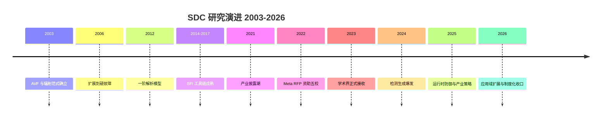

# SDC 学术综述:静默数据损坏的研究版图、分类学与产业-学术生态(2003–2026)

> **日期**: 2026-09-28
> **素材声明**: 本报告基于 53 篇论文的全文精读笔记撰写,编号 [01]–[53] 对应 `docs/paper/ref-paper-fullread-digest/` 逐篇笔记(笔记含 PDF 页码级证据);企业合作证据取自 `corporate-collab.md` 三级证据体系(1=作者单位/2=致谢/3=首页脚注,另有间接层)。所有关键数字均标注 [NN]+节/图表号;工业文档(白皮书)主张单独标注"厂商主张"。

---

## 0. 执行摘要

本章由 Task 14 填充。

## 1. 引言与研究版图

### 1.1 问题:计算在出错,而系统不知道

静默数据损坏(Silent Data Corruption,SDC)指硬件缺陷或扰动导致计算结果出错,而系统全程无任何异常信号——不崩溃、不报错、不留日志,错误数据沿软件栈持续传播 [01][47]。它与崩溃的区别不在严重性而在**可见性**:崩溃会被立即发现,SDC 则在被察觉之前已污染下游数据,检测点往往远离成因点 [39]。

其规模在 2021 年后由超大规模厂商系统性披露:Google 报告约 1,000 DPM 的芯片受 SDC 影响、且因系统级测试的局限该数字仅为下界 [09];Meta 报告 fleet 终身故障率 0.035%(约 1/2850 台机器至少失败一次)[02];Alibaba 实测总故障率 3.61/万,即 361 DPPM [01]。"约千分之一的 CPU 存在此类缺陷"由此成为产业界与学术界的共同经验数字 [18][47][53]。IEEE Computer 评述将其称为"计算的黑暗面":真正的难题不仅是错误本身,而是没人知道它多严重、多频繁,以及**谁来买单** [47]。

### 1.2 语料与研究版图

本报告基于 53 篇论文的全文精读笔记撰写(编号 [01]–[53],与 `ref-paper-fullread-digest/` 逐篇笔记一一对应,关键数字均带原文节/图表号)。语料时间跨度 2003–2026 年,按主题分为六大板块:

| 板块 | 篇数 | 编号 | 核心问题 |
|---|---|---|---|
| 产业 fleet 实证与披露 | 7 | 01,02,03,05,07,09,39 | 真实故障率多高?故障长什么样? |
| 脆弱性评估与预测方法论 | 19 | 04,08,10–24,36,37 | 芯片哪里最脆弱?如何提前知道? |
| 检测激励生成与产业测试策略 | 9 | 25–32,50 | 用什么测试把坏芯片找出来? |
| 运行时在线检测与容错 | 9 | 06,33,34,35,38,40–43 | 部署后如何持续防护? |
| 应用域扩展 | 5 | 44,45,46,51,52 | AI、加密、存储、GPU 中 SDC 何形态? |
| 观点、综述与白皮书 | 4 | 47,48,49,53 | 两界如何理解与回应此问题? |

六大板块勾勒出问题的完整生命周期:从"有多严重"(实证)到"为什么"(评估)到"怎么找"(检测)到"怎么防"(运行时)再到"边界在哪"(应用域),最后是"如何理解全局"(观点)。

### 1.3 证据强度分级

本报告对所有引用实行**双重分级**。其一为文档类型:同行评审会议论文 33 篇(含 1 篇 PhD Forum 短文)、期刊论文 8 篇,合计 41 篇,构成证据主体;预印本与技术报告 8 篇,结论按"未经同行评审"对待;白皮书 2 篇([09] Google、[53] proteanTecs)、产业访谈 1 篇([32])与研讨会报告 1 篇([39])为产业一手声音,引用时一律标注类型。其二为企业合作证据级:1 = 作者单位署名,2 = 致谢,3 = 首页脚注/版权页;引用与合作相关的判断时标明证据级,仅有引用、被测或数据借用关系的"间接层"不计为合作(见第 9 章与附录 A)。

### 1.4 方法论谱系

53 篇文献的方法论可归为五类,分别回答不同问题:**一手实测**(fleet 周期测试 [01][02][03]、运营数据回溯 [07][39]、质子束流照射 [24][52])给出真实频率;**建模与注入**(AVF 解析模型 [10–15]、统计故障注入工具 [16–24]、机器学习预测 [36][37])在设计期给出脆弱性地图;**激励式测试生成**(fuzzing 代理 [25]、硬件在环 [26][27]、物理机理+形式验证 [28]、强化学习优化 [30]、ATPG 鲁棒化 [31])主动暴露缺陷;**运行时防御**(选择性冗余 [06][33][41–43]、硬件计数器 [34][35]、数据系统校验 [38][39][46])在部署后持续拦截;**产业自述与评述**([47][48][49][53])提供框架与口径。五类方法在时间上依次兴起(见第 8 章),在栈层上互为补充(见第 5 章)。

### 1.5 报告结构

第 2–4 章为对象层:SDC 的定义与核心特征、根因机理分类、故障模式分类;第 5–6 章为对策层:检测技术与处理技术的分类学;第 7–9 章为两界层:学术界与产业界的规律对比、2003–2026 演进趋势、产业-学术合作生态;第 10 章给出全软硬件栈 × 全生命周期的系统性启示。附录 A 为 53 篇逐篇档案,附录 B 为身份勘误与引用注意。

## 2. SDC 核心特征

### 2.1 定义谱系:从位翻转到应用失效

SDC 的定义随研究重心迁移了四次。**2003 年原始定义**诞生于辐射软错误语境:"SDC 发生于一个未保护比特遭受单比特翻转、导致未检测的错误系统行为",与 DUE(检出不可恢复)构成二分 [10]——这是后续全部文献的概念基座 [11]。**2014–2015 年分类学细化**将 SDC 界定为"程序终输出损坏且无任何错误指示" [21],并区分 strictly correct(逐位相同)与 correct(容差内可接受),首次系统刻画应用固有容错:位级损坏在 PSNR、收敛性等指标下仍可能是"可接受的" [19]。**2021 年后的产业定义**转向应用与运营视角:SDC = 计算完成但输出偏离真值且无日志 [51];配套缺陷(defect)→故障(fault)→差错(error)→失效(failure)四级术语链与 FIT 度量 [48],以及比二分更精细的 SDC/DCE(可检测可纠正)/UOE(用户可观察)三分 [50]。**应用域再定义**正在进行:推荐系统的召回率下降、FHE 解密后全槽位大偏差、ML 任务的 Top-1/Top-5 准确率,正在成为各域的"输出损坏"判定标准 [44][45][51];IEEE Micro 专刊明确指出 SDC 定义在 AI 域面临再定义难题 [48]。

### 2.2 静默性的四重根源

静默性并非偶然,而是四重机制叠加的结构性结果。**其一,检测机制未覆盖**:存在大量无检查逻辑覆盖的内部电路 [03];算术与功能单元因关键路径、面积与功耗的经济学考量通常不设保护 [18][29],恰是 SDC 的主要源头。**其二,检测机制自身失效**:校验和、冗余计算等防线本身运行在同一脆弱硬件上,缺陷可使防线与数据一起出错——Alibaba 的实测论证了"依赖校验和/冗余作为 SDC 主防线"的失效路径 [01](§6.2)。**其三,认识论根源**:SDC 率"不可测量、只可估计" [47];测量面临低发生率、负载依赖、环境关联三重困难 [49],精确测量只有超大规模系统的拥有者才具备条件 [29]。**其四,算法性放大**:FHE 中密文呈伪随机、服务端无明文参照,损坏系统性不可判("双重静默")[45];主存故障既不崩溃也不扰动硬件计数器,构成 HPC 检测的结构性盲区 [20];而"错误偏移读取"使检测点远离成因点,是最险恶的运营形态 [05][39]。

### 2.3 错误分类学:SDC 在失效谱系中的位置

各文献的输出分类法可对齐为一张谱系表:

| 分类法 | 出处 | 类别 | 特点 |
|---|---|---|---|
| 二分 | [10] | SDC / DUE | 辐射时代基座 |
| 四分 | [08] | Benign / Masked / SDC / Crash | 微架构视角 |
| 五分 | [19] | Crash / 非传播 / strictly correct / correct / SDC | 应用容差细分 |
| 六分 | [21] | Masked / SDC / DUE / Timeout / Crash / Assert | 注入工具标准;Assert 系仿真器伪影,跨工具比较须归一化 |
| 三分(运营) | [50] | SDC / DCE / UOE | 检出与用户可见解耦 |
| 五分(存储) | [46] | stall / stop / detected / silent / correct | partial failure 谱系,与 CPU SDC 同构 |

三条边界值得特别注意。**SDC 与 Crash 的边界由受损结构决定**:同一故障打在 L1 数据通路多为 SDC、打在取指流多为 Crash(详见第 4 章)——静默与否不是随机,而是微架构部位的结构属性 [08]。**SDC 与 Masked 的边界随工作量漂移**:掩蔽率取决于输入、覆写频率与利用节奏 [22][29]。**SDC 与 DUE 之间存在转化**:检测机制可以把 SDC 转化为 DUE(检出但不可恢复)[10],也可能误报成 false DUE [12];应用固有容差则反向把位级 SDC 吸收为"可接受" [19]。此外,SDC 往往是失效的**前哨**:在电压域中,Unsafe 区(静默出错)先于 Crash 区出现,SDC 是更早、更灵敏的失效信号 [51]。

### 2.4 规模必然性与架构倾向

单台机器的 SDC 概率极低——大多数硬件终身不遇 [50];但数十万至百万台规模的部署使其成为**必然事件**,这是云厂商必须系统性应对的数学基础 [50]。问题已获得公共可见性,进入主流媒体报道 [49]。架构层面存在稳定倾向:**数据并行架构比控制流架构更易产生 SDC** [48];Meta fleet 中最常失败的正是 ML 常用的向量矩阵卷积与降维指令 [02],FMA 乘法器在指令级深测中占 SDC 案例超过 75% [05]。与此同时,受影响栈层持续扩张:从 CPU 核内功能单元,到 GPU 电压域 [51]、FPGA 配置存储器 [52]、文件系统元数据 [46]、推荐系统与全同态加密 [44][45]——SDC 是**全计算栈**的问题,而非 CPU 独有。

### 本章规律小结

- **共识**:静默性是定义性特征且源于结构性根因;"结构决定静默或崩溃"跨仿真、束流与 fleet 三级证据一致;规模必然性是产业动员的数学前提。
- **分歧**:位级定义与应用级定义并存,strictly correct(容差内)是否算 SDC 因域而异 [19][48];厂商白皮书将软错误与 SDC 混同,口径与学术谱系不同 [53]。
- **适用条件**:分类法的选择应服务于目的——设计期评估宜用六分类 [21],运营监控宜用 SDC/DCE/UOE [50],跨工具比较必须归一化仿真器伪影 [21]。

## 3. 根因机理分类学

### 3.1 权威框架:三分法与四条物理主线

IEEE Computer 评述给出与产业披露口径一致的权威三分法:**先天缺陷**(制造测试逃逸)、**后天退化**(老化磨损)、**个体差异**(工艺涨落),外加设计 bug 构成第一时段 [47]。本报告在三分法基础上,按物理机理将 53 篇文献的证据归纳为**四条物理主线 + 一条方法论立场**:

| 主线 | 物理机理 | 电路表现 | 代表文献 | 量化锚点 |
|---|---|---|---|---|
| 制造缺陷/测试逃逸 | 工艺缺陷漏出制造测试 | stuck-at、开路/短路 | [01][04][09][18][25][26][50] | 逃逸至少 10× 于工业目标;SDC 芯片约 1,000 DPM(下界)[09] |
| 边际缺陷→小延迟故障 | 缺陷仅在特定条件组合下激活 | 亚周期延迟增量 | [02][15][31][50] | P(工艺)×V(电压)×T(温度)×A(老化)变化使单测试集失效 [31] |
| 老化退化 | BTI/NBTI 反应-扩散 | 时序违规(setup/hold) | [28][50] | hold 违规必须修片、setup 可降频挽救 [28] |
| 辐射 | 中子/α 粒子击中 | SEU 单比特翻转 | [10][11][24][52] | 65nm→28nm raw FIT 差 9.1×;>95% 为单比特 [24] |
| 电压/功率裕量 | 裕量耗尽、电源噪声、上电瞬态 | 时序违例 | [30][32][51] | FMA 上电/下电瞬态功率激活潜伏缺陷 [30] |

第五条"主线"实为**方法论立场**:微架构仿真谱系显式采用根因无关的瞬态统一建模——单比特翻转作为辐射、制造缺陷、电路变异等广泛物理机制的共同抽象 [08],使脆弱性评估不必纠缠具体根因。

### 3.2 各主线证据与量化

**制造缺陷线**是 2021 年后产业披露的共同指向:Alibaba 将 fleet 内故障分为计算型(算术/向量/浮点单元)与一致性型(cache 一致性、事务内存)真实硅缺陷,温度与利用率压力只是触发条件 [01];Google 白皮书给出"逃逸至少 10× 于工业目标"的定量结论,并区分 t=0 缺陷与早期失效(ELF)[09];"1/1000 CPU 产生 SDC"已是超大规模厂商与文献的共识表述 [18]。Veritas 进一步指出制造质量(DPPM)作为外在因子独立于设计,同一设计在不同制造批次下 fleet 率可差数倍 [04]。

**边际缺陷线**解释了"今天正确不保证明天正确":缺陷在特定温度/频率/电压/程序/输入组合下才显现 [02],其电路学形态是小延迟故障——额外延迟小于时钟周期,制造测试与现场表现的边界随 P/V/T/A 漂移 [31]。DelayAVF 将其正式化为 AVF 方法论中的故障模型 [15];产业侧把它列为"现今制造与封装测试最难检测者" [27]。

**老化线**拥有语料中唯一的门级物理机理建模:BTI/NBTI 的反应-扩散动力学,叠加信号概率依赖、时钟门控致分布不均、pMOS 敏感于 nMOS 三条非均匀老化定律 [28];Arm 侧表述为"寿命退化使良性逃逸转恶性" [50]。

**辐射线**是 2003 年范式的物理基座:宇宙射线中子与封装材料 α 粒子 [10][11];Arm 芯片束流实测给出完整归因链——raw FIT/bit(工艺敏感性)× AVF(微架构与软件传播概率)→ FIT [24];FPGA 配置存储器的 essential bits 累积翻转是空间应用的主形态 [52]。

**电压线**近年独立成线:FMA 单元的上电/下电瞬态功率事件可激活潜伏缺陷(电磁耦合非直连 IP)[30];电源网格噪声构成边际缺陷的激活条件 [32];AMD GPU 的降压实验证明同一型号芯片 Vmin 存在 chip-to-chip 涨落,是"个体差异"主线的直接实证 [51]。

### 3.3 因果链:物理根因 → 电路表现 → 微架构部位

四条主线共享一条三段因果链。**物理根因**(上表)产生**电路表现**——stuck-at 永久电平 [04][14][18]、亚周期小延迟 [15][31]、单比特翻转 [10][24]、setup/hold 时序违规 [28]——再作用于**微架构部位**。部位谱呈现清晰的结构分野:阵列结构(cache/TLB/寄存器堆)虽有较高原始故障贡献(L1-D 数据场 53.4% 为 Armv8 仿真最高 [08]),但大阵列普遍有 ECC/奇偶保护;真正无保护的是算术与功能单元——整数 ALU 使用频率最高且无保护 [18],FMA 乘法器门数为加法器 30 倍、被 32 条指令共享而加速磨损 [05],其无保护状态源于关键路径/面积/功耗的经济学取舍 [29]。一个关键现象是**显现调制**:永久故障的架构表现依赖执行上下文(微架构+电气状态),同一缺陷可产生"同输入不同输出"的不一致错误 [06]。

### 3.4 产业证词与学术重构的张力

根因占比存在未决张力。AMD Lerner 的产业证词称**时序缺陷是最大贡献源、开路偏置明显、老化证据甚少** [32];而学术界在同期将老化(BTI 门级模型 [28])与小延迟故障(ATPG 鲁棒化 [31])重构为机理主线。两者并非矛盾——产业证词描述维修现场所见,学术重构面向可建模的物理机理——但占比口径缺乏交集证据,本报告如实并列不作裁决。另一处方法论分歧:仿真谱系主张瞬态统一建模覆盖一切根因 [08],fleet 谱系则强调"SDC 非瞬态故障所致已是共识"、聚焦永久/间歇故障 [18]。

### 本章规律小结

- **共识**:制造缺陷(含逃逸)是 2021 年后产业披露的主因;显现受温度/电压/输入多因素调制;无保护算术单元是主要受害部位。
- **分歧**:老化贡献度(产业证词"证据少" [32] vs 门级建模 [28][31]);瞬态与永久故障的建模口径(仿真谱系 [08] vs fleet 谱系 [18])。
- **适用条件**:fleet 证据反映真实分布但只能归因到单元级;束流实验是辐射线的受控基线;仿真注入方法论上根因无关——三者的外推边界不同,引用时须注明证据形态。

## 4. 故障模式分类学

### 4.1 位级分布:三大实测体系的分歧

SDC 打在数据的哪些位上,三大实测体系给出了**不一致的分布**。Alibaba 的 fleet 实测以**小数位(fraction)为主**,固定位置掩码、多比特、0→1 占 51.08% [01];SEVI 对向量指令的指令级深测发现**指数/符号位翻转造成高幅误差(最高 10240×)**,并归纳出低错误率-低幅值到高错误率-高幅值的三型位翻转模式 [05];微架构仿真谱系则报告**低位字节偏置**(寄存器堆 B2/B3 字节)[08]。分歧部分源于对象不同(CPU 整机 fleet vs 向量 FMA vs 微架构注入),部分源于检测粒度——如实并列、不作调和,是本报告的处理原则。

### 4.2 单比特与多比特:口径之差

多比特与单比特的主导权同样随证据形态漂移:PinDrop 观察到向量输出以**多比特翻转主导**,且 90% 场合为单一向量元素出错 [02];Arm 芯片束流实测则显示 **>95% 为单比特翻转** [24];SiliFuzz 的产业筛查也以单比特错误结果为最常见表现 [25]。两者并不矛盾:束流实验测量的是天然粒子事件(单粒子单比特为常态),fleet 深测捕捉的是缺陷单元的电气表现(可一次翻多位)。引用时必须注明口径。

### 4.3 值域形态与一致性

比位分布更有工程意义的是**值域形态**——错误值与真值的关系。存储元数据研究将其形式化:swap_similar(字段被换成语义合法但错误的值)远比 missing/random 难检,因为它通过一切语法校验 [46]。SEVI 的"错误偏移读取"属同类:内存访问类故障 76% 表现为读错地址而非读错值,错误数据本身完好 [05]。**一致性维度**是另一关键分野:Alibaba 的一类故障破坏 cache 一致性与事务内存保证,使多核看到不同数据 [01];ITHICA 则证明最难检测的缺陷产生"不一致错误"——同线程同指令同输入,两次执行输出不同,错误是否显现取决于执行上下文 [06];Meta fleet 中错误跨 44% 的服务器指令类型、速率差达 6 个数量级,FP/向量指令贡献 92.9% 的错误量 [06]。

### 4.4 频率谱与触发条件

故障的时间形态横跨八个数量级:高复现型可**每分钟出错数百次** [01],惯犯型以 820K–916K 错误/十亿芯片小时持续出错 [09];低频隐藏型错误率 **<10⁻⁵**,常规测试几乎不可能触达 [05];间歇型可随温度/电压组合"自愈"又复发 [02]。**触发条件**高度多因素:温度 [01][05]、任务态电压跌落(制造态测试不可复现)[50]、降压时序裕量 [51]、数据相关位模式(同一单元 3×5=15 但 3×4=10)[03]、输入依赖的罕见激活 [06][43],以及随时间退化("今天正确不保证明天正确")[03]。数据依赖性被 hyperscaler 视为难检测的共识主因 [32];高 SDC 易感输入作为一种运行时风险形态,是输入感知防护的立论基础 [43]。

### 4.5 结构×模式规律:三级证据链

**哪种结构出什么样的错**是本语料最稳定的规律,由五篇论文构成"仿真→仿真→束流实测"的三级证据链:L1 数据通路的故障以 SDC 为主(IISWC 仿真中为其他结构的 3–5× [21];束流实测确认 [24]),取指流(L1-I)损坏必然倾向 Crash/Assert [21][24],TLB 故障压倒性地表现为 DUE(Crash 50%、SDC <1%)[24],物理寄存器堆永久故障的 SDC 概率甚至为零 [23],功能单元故障掩蔽极低且 Crash 主导 [23]。寄存器堆缩小则 Crash 率上升(1.86%→6.48%)[16],微架构透视进一步给出阵列内部排序(L1-D 数据场 53.4% 最高、ROB/LQ/SQ 零 SDC)[08]。该规律已扩展到领域专用架构:索引型存储故障倾向 Crash、纯数据型倾向 SDC 或掩蔽,覆写频率决定掩蔽率 [29];GEMM 类负载在向量 FP 单元上 98.7% 表现为 SDC [29]。

| 受损结构 | 主导模式 | 证据链 |
|---|---|---|
| L1 数据通路 / 主存 | SDC(3–5×)[21] | 仿真 [21][22][23] + 束流 [24] + DSA 扩展 [29] |
| 取指流(L1-I) | Crash / Assert | 仿真 [21][22] + 束流 [24] |
| TLB | DUE 压倒 | 束流 [24] |
| 物理寄存器堆(永久) | 低 SDC 至零 SDC | 仿真 [23][08] |
| 功能单元(FU) | Crash 主导 / 掩蔽极低 | 仿真 [23];门级 [18];FMA 例外→SDC [05][29] |
| DSA 索引型存储 | Crash | [22][29] |

### 4.6 特殊模式:放大、覆写与控制面污染

三类模式超出"数据被改错"的直觉框架。**放大机制**:FHE 中单比特密文损坏解密后全槽位偏差可达 10³⁵–10¹²⁵ [45];错误指令经 OS 放大为可见异常 [49];推荐系统参数的 IEEE-754 指数字段翻转引发 inf/nan 爆炸,在高误码率下多重错误使 SEC-DED 与重执行类机制集体失效 [44]。**覆写掩蔽**:错误数据被后续写覆盖,状态比对失效——数据库快照审计因此漏检 [38][39];覆写频率本身决定 DSA 故障的掩蔽率 [29]。**控制面污染**:SDC 不只污染数据,也可侵蚀全局调度器(依赖计算位翻转、依赖图内存损坏)[38]。直接输出损坏(ESC)则绕过整个软件层:DMA 设备直读已损坏的缓存行,软件层一切掩蔽与检测机会归零 [17]。

### 本章规律小结

- **共识**:结构×模式规律横跨仿真、束流与 DSA 域;触发条件多因素且数据依赖;放大与覆写使"检出损坏"远难于"损坏发生"。
- **分歧**:位分布(尾数主导 [01] vs 指数/符号高幅 [05] vs 低位字节 [08])与单/多位占比(fleet 多比特 [02] vs 束流单比特 [24])——**口径差是主因:整机 fleet 深测、指令级深测、束流实验、微架构注入的证据形态不同**。
- **适用条件**:结构×模式规律可跨架构外推;位分布结论只适用于同证据形态;一致性现象(不一致错误 [06])意味着任何"重复执行即检测"的方案存在原理性盲区。

## 5. 检测技术分类学

### 5.1 三维定位法与三族总览

检测技术可用"**原理族 × 栈层 × 生命周期阶段**"三维定位。原理族分三支:**A 设计期评估族**不产出检测器,产出脆弱性地图;**B 激励式测试族**主动构造输入暴露缺陷;**C 运行时在线族**在部署后持续拦截。三族覆盖的生命周期依次后移,构成纵深。

| 族 | 路线 | 代表 | 关键数字 |
|---|---|---|---|
| A 解析建模 | ACE/AVF 及其泛化 | [10][11][12][13][14][15] | AVF 100% vs 10% 决定保护预算数量级 [11](Fig.1) |
| A 统计故障注入 | gem5 系工具链 | [16][17][19][20][21][22][23][24] | 注入加速 2–3 个数量级 [16];RTL 慢 3 个数量级 [24] |
| A 机器学习预测 | 开发期脆弱性预测 | [36][37] | top-20 脆弱指令复制使 SDC 率 −72.1% [37](§V-H) |
| B 激励生成 | fuzzing 代理 | [25] | ~50 万用例持续筛查 [28] |
| B 激励生成 | 硬件在环迭代 | [26][27] | 有效指令生成率为 SiliFuzz 30×;同时间检出 99.5% vs 86.6% [26] |
| B 激励生成 | 物理机理+形式验证 | [28] | 老化感知 STA 反向生成测试 |
| B 激励生成 | 库移植(OpenDCDiag 谱系) | [01][26][50] | 与厂商工具链交叉验证同结论 [01](§2.3) |
| B 激励生成 | RL 参数优化 | [30] | 不增测试时间提高检出率;与生成路线正交可组合 |
| B 激励生成 | DFT/ATPG 鲁棒化 | [31] | 统计学习+GPU 故障模拟对抗 P/V/T/A 变化 |
| B 制造测试 | 全栈扫描+SLT | [32][50] | 电压裕量>频率>温度(10mV 实证)[32];七级故障模型 [32] |
| C 软件层冗余 | 选择性指令复制 | [06][33][41][43] | strict safe mode 开销 <2% [33];毫秒级选组 [43] |
| C 硬件冗余 | 微架构级重放 | [42] | BIST 与冗余执行互补定位 [42] |
| C 运行时复制 | AMT 孪生任务 | [40] | 三选二表决修复、无需 checkpoint |
| C PMC+ML | 硬件计数器异常检测 | [34][35][20] | 零程序修改 [35] |
| C 数据系统层 | 校验和+语义不变式 | [38][39][46] | Spanner 每周数次检出 [39];CRC32C 极低开销 [46] |
| C 应用算法级 | ABFT 校验和 | [05][45][44] | NTT 线性不变量开销 13–16% [45];高 BER 不适用 [44] |
| C 遥测关联 | 应用级信号反向工程 | [07] | SEL 静默性过滤+核浓度多维信号 |
| C 传感预测 | 片上传感+预测性维护 | [50][53] | RTHM 实时健康监测(厂商主张)[53] |

### 5.2 A 族:设计期脆弱性评估

**解析建模线**从 2003 年的 ACE/AVF 位分析出发 [10][11],沿三个方向泛化:结构上扩展到地址类结构(lifetime 分析、tag 汉明距离分析)[12];效率上从周期精确仿真降为一阶解析模型——一次性 profiling 支撑多微架构探索 [13];故障模型上从软错误扩展到硬故障(H-AVF)[14] 与小延迟故障(DelayAVF,粒子翻转 AVF 因 toggle 依赖等三重差异而不适用)[15]。其价值主张是经济性:AVF 100% 与 10% 之差直接决定保护预算的数量级 [11]。**统计故障注入线**以 gem5 系工具为主体,MeRLiN 将注入加速 2–3 个数量级 [16];双工具差分揭示 Assert 类为仿真器伪影、跨工具比较须归一化 [21];异构 SoC 框架将覆盖面扩到 x86/Arm/RISC-V 加速器 [22];跨 ISA 研究给出"PRF 永久故障 SDC 概率为零"等结构规律 [23];束流实验最终校准了"流片前注入可给准确 SDC 率估计"的方法学地位 [24]。**机器学习线**把注入成本再降一档:transformer 从源码上下文回归每操作 SDC 概率 [36];知识图+图神经网络以半监督方式预测指令脆弱性,其 top-20 预测指令做复制即可使 SDC 率平均降 72.1% [37]。

### 5.3 B 族:激励式测试的七条生成路线与部署形态

激励式测试的核心问题是**用什么输入把坏芯片找出来**。七条生成路线并存:**fuzzing 代理**([25] SiliFuzz)对软件代理做覆盖引导模糊测试、再在大规模生产 CPU 上重放,CPU 视为黑盒;**硬件在环迭代**([26][27] Harpocrates)以 gem5 评分反馈的类遗传循环生成约束随机程序——产业在先(2021 [25])、学术精化(2024–2026 [26][27])的完整链路,后者有效指令生成率达前者 30×、同时间检出 99.5% 对 86.6%,整数加法器 99% 检测仅需 5 万周期而对标基准需 1,100 万以上 [26];**物理机理+形式验证**([28] Vega)自下而上,从老化感知静态时序分析反向生成测试,针对"73.5% 的 SDC 出现在已投用 CPU"的高频检测需求 [28];**库移植**(OpenDCDiag 谱系)以函数库级测试程序在产线复用——Alibaba 用其与厂商工具链交叉验证得到同结论 [01],并被 Harpocrates 正式评测(L1D 最佳单程序检出 >80%,但 IRF <5%,归入"实质性软件掩蔽"组)[26],Intel 以 DCDiag 自述同路线 [50];**RL 参数优化**([30])不生成新测试而优化既有测试的参数空间,与前四条正交、可组合;**DFT/ATPG 鲁棒化**([31])用统计学习对抗 P/V/T/A 变化下的故障掩蔽;**制造全栈扫描+SLT**([32][50])主张电压裕量优先于频率与温度的测试条件排序与七级故障模型阶梯 [32]。

**部署形态**同样构成谱系:预生产测试+周期性复测(Alibaba:预生产发现 3.262/万,为常规测试 0.348 的近十倍)[01];持续高频在产测试(Meta IRMS 预约系统,15 天平均重访、每日触达 1.75% 基础设施)[02];停产机会式、在产常开微测试与防测试自身缺陷的影子 A/B 测试 [03];以及应用级遥测关联(与测试互补的"第二条腿")[07]。Google 的结论性论纲是:**测试必须成为 CPU 全生命周期的一部分** [09][25]。

### 5.4 C 族:运行时在线检测

C 族在部署后运行,按侵入性从重到轻分为七支。**软件层选择性冗余**:ITHICA 对任意程序插入线程内指令检查,并以内存层级扰动(MemDiv)主动暴露不一致错误 [06];Orthrus 用"数据路径闭包异核重执行+控制路径 CRC"混合式,以资源自适应采样调节开销,strict safe mode 对外曝数据算子开销 <2% [33];ParallaFT 在二进制级实现异构并行复制,无需重编译与定制硬件,宣称 100% 用户态 SEU 覆盖 [41];HPC 场景以离线剖析+毫秒级运行时选组部署输入感知的选择性复制 [43]。**硬件微架构冗余**:ParaVerser 以归纳并行分段+多检查器重放实现硬件层检测,并给出 BIST(离线测试)与冗余执行(在线覆盖)的互补分类学 [42]。**运行时系统复制**:AMT 孪生任务在运行时系统边界交叉验证出界效应 [40]。**PMC+机器学习**:硬件性能计数器作非侵入哨兵,零程序修改 [34][35],其适用域边界(主存故障失效)由注入端研究标出 [20]。**数据系统层**:Sentry 以增量快照+事务依赖图双层检测、确定性执行消除并发假阳性 [38];Spanner 以五层校验和体系+语义不变式实现每周数次的 SDC 拦截 [39];文件系统元数据采用访问路径上的 CRC32C 验证,开销极低,而离线扫描式修复被评估为"盲目修复致害"、应 fail-fast 不修复 [46]。**应用算法级 ABFT**:生产负载自身作金丝雀 [05],FHE 的 NTT 线性不变量开销 13–16% [45],但推荐系统在高误码率下 ABFT 失效,须让位于应用层容忍 [44]。**传感与预测性维护**:片上路径延迟传感+ML 预测 [50];proteanTecs 将其产品化为两阶段检测(出厂 ML outlier+在役 RTHM 实时健康监测)——此为厂商主张 [53]。

### 5.5 横向规律

三条横向规律贯穿三族。**其一,覆盖不等于检测**:测试程序"执行到"某结构不等于"检出"其故障——OpenDCDiag 在 IRF 上 <5% 的检出率被归因于实质性软件掩蔽 [26],瞬态位阵列与永久功能单元存在检测难度不对称 [27]。**其二,互补优于替代**:BIST 离线测试与冗余执行在线覆盖各擅其场 [42];测试与遥测是两条腿 [07];物理机理驱动与统计优化正交可组合 [30]。**其三,侵入性谱系即成本谱系**:硬件改造 [42] > 源码/IR 级插桩 [06][43] > 二进制级 [41] > 零修改信号检测 [34][35][07],选择取决于保护对象的可用改造权限与开销预算。

### 本章规律小结

- **共识**:单一技术无银弹,纵深组合是共识方案;检测左移(设计期即可评估)与全生命周期连续化("测试成为 CPU 生命周期一部分" [09][25])并行推进。
- **分歧**:侵入性与覆盖的权衡尚无定论;ML 方法(计数器检测、脆弱性预测)的成熟度在注入验证与真实缺陷之间存在代差 [20][36]。
- **适用条件**:设计期选 A 族;制造与 fleet 阶段选 B 族;不能停机或不能改造代码的场景选 C 族零修改支;线性代数类负载优先考虑 ABFT [05][45],高误码率场景则须转向容忍 [44]。

## 6. 处理技术分类学

### 6.1 权威框架与处理入口

IEEE Computer 评述给出处理的权威框架:检出后的**更换是唯一负责任的动作**;**降级运行**(已知受控缺陷、缺陷单元不被使用)是工程折中;**硬软件冗余容错**有效但昂贵,大型基础设施难以整体负担;而**SDC 率定价**——把可靠性等级写进采购经济学——是处理的第四种形态 [47]。处理的技术入口由检测形态决定:fleet 测试检出走**隔离池**闭环(保留至根因确认、深入调查、测试精化、回归产线)[03][07][25];确定性系统检出走 **fail-fast**——文件系统元数据研究明确反对盲目修复(修复可致空文件与内容伪装,比不修更糟)[46];在线检测器失配则**中止应用**阻止污染外流 [33][41]。

### 6.2 六组处理技术

**退役与更换**存在粒度梯度:Alibaba 的 Farron 方案做到核级细粒度——不超过 2 个缺陷核时屏蔽该核继续用其余核,配套测试用例三级优先与自适应温度边界,常规测试压缩到 1.02 小时/轮(基线 10.55)且覆盖率反超,workload backoff 仅 0.864 秒/小时 [01](§7);Meta 的 IRMS 走"预约扣留→深度测试→部件更换→回归产线"流水线 [02];Google 的 Spanner 实践增加**惯犯流程**——常规维修流程放回的坏机由分诊工程师行使停机权显式弹出 [39];Google 白皮书则是检出即换件、退厂诊断 [09]。

**降级运行**在产业侧已工程化:Arm 表述为坏核移出编排、OS 禁用后带病运行(可逆降级)与电压裕量动态调整 [50];AMD GPU 研究将其翻转为能效视角——Vmin 三电压区(Safe/Unsafe/Crash)下运行在 Unsafe 区即受控降级,SDC 反而成为失效前哨信号 [51];FPGA 侧的 lockstep 降级附带恢复窗口定量:系统寿命约为首次预警时间的 2×,给出恢复操作的时序预算 [52];proteanTecs 主张实时调压调频补偿与预测性维护(厂商主张)[53]。

**在线修复**追求最小重做:SENTRY 的精准回滚只回滚受影响事务及其依赖者,而非整批 [38];AMT 孪生复制用三选二多数表决仅重执行受染任务,无需 checkpoint [40];FHE 以 DMR 失配即重算 [45]。**调度规避**是零硬件成本的软处理:核级调度屏蔽坏核 [39]、温度边界控制与 workload backoff [01]、预约扣留期间的产能规划 [02]。

**容忍而不检测**是与上述全部对立的第三条路:推荐系统研究量化了"坏了之后还能用多少"——激活裁剪(算法级)最优、位级防护 SBP 次之,而检测+重执行在高误码率下失效 [44];Meta 的产业主张是应用级容错与基础设施直接容忍部分 SDC [32]; Unsafe 区的 ML 容错性利用是同一思路的电压域应用 [51]。**结构性容错**面向辐射等高错误率环境:TMR+ECC+lockstep 三态机实现 99.09% 失败先有预警、无预警失败全为双位错 [52];配置存储器清洗频率按失败概率分布量化优化,可兑换约 50% 功耗 [52]。运行时复制谱系( [40][41][42][43])同时是检测与容错,已在第 5 章 C 族展开。

### 6.3 处理技术分类表

| 类 | 代表 | 量化锚点 | 适用条件 |
|---|---|---|---|
| 退役/更换 | [01][02][09][39] | 核级退役;backoff 0.864 s/h [01] | 有替换产能;检测可信 |
| 降级运行 | [50][51][52][53] | 寿命 ≈2× 首次预警 [52];清洗省 50% 功耗 [52] | 缺陷可定位、可绕开 |
| 在线修复 | [38][40][45] | 三选二表决、无需 checkpoint [40] | 确定性可重放的工作负载 |
| 调度规避 | [01][02][39] | 核级屏蔽 [39] | 多核冗余拓扑 |
| 容忍不检测 | [32][44][51] | 激活裁剪最优 [44] | 应用固有容差(ML 推理类) |
| 结构性容错 | [52] | 99.09% 预警率 [52] | 高错误率环境(空间/汽车) |
| 经济学处理 | [47][48] | SDC 率定价 [47] | 采购与供应链层面 |

### 本章规律小结

- **共识**:更换/隔离是主旋律,降级运行已被产业工程化;一切处理决策受"谁来买单"的经济学约束 [47]。
- **分歧**:容忍不检测(应用容差利用 [44][51]、Meta 基础设施容忍主张 [32])与检出即停(fail-fast [46]、中止应用 [33][41])构成哲学对立——前者接受污染换可用性,后者以可用性换确定性。
- **适用条件**:修复必须以"有真值参照或确定性重放"为前提 [38][46];容忍只适用于误差不敏感负载,且须先量化容忍边界 [44]。

## 7. 学术界 vs 产业界:各维度规律与观点对比

### 7.1 问题的定义权与时间线

SDC 作为研究议题的**定义权在产业界**。2021 年 Meta 与 Google 工程师的两份披露(arXiv 与 HotOS)首次给出 fleet 级真实频率 [32];学术界的系统性跟进始于 2023 年(SOSP23 机群实证 [01]),爆发于 2024–2026 年。IEEE Micro 专刊的观察是:产业界比学术界**早知道约两到三年** [48]。披露的媒介谱系同样由产业侧扩展:从 arXiv 预印本、顶会论文,到期刊专刊,直至 DeepSeek、Amazon、Tesla 以 X 帖(社交媒体)直接披露训练芯片的 SDC 事件 [48]——问题紧迫到不再等待同行评审。学术界接手后的贡献是**分类学与机理解释**:把"我们的机器在算错"翻译为根因三分法 [47]、术语链 [48]、结构×模式规律 [21]–[24] 与检测技术族谱 [25]–[31]。

### 7.2 证据形态与话语口径

两界的证据形态与话语体系差异显著。产业界的一手证据是 **fleet 运营数据**(7 篇纯产业一手论文 [01][02][03][05][07][09][39]),话语单位是 DPPM、DPM、TCO 与"每周数次"的运营事件 [09][39];其非正式出口是白皮书 [09][53] 与产业访谈 [32],后者聚合了 12 家机构 14 位署名声音。学术界的证据是**仿真注入、束流实验与形式化**,话语单位是 AVF、FIT 与六分类结果 [10][21][47]。口径差异需要专门纪律:proteanTecs 白皮书将软错误与 SDC 混同(Fig.1 "Soft errors such as SDC"),与学术谱系的根因分类并不一致 [53];而 IEEE Computer 评述坚持"认识论"口径——SDC 率不可测量、只可估计 [47]。

### 7.3 方法论分工与数据流

两界的分工已制度化。**产业提供数据与场景,学术提供工具与模型**:Veritas 与 SEVI 的"仿真×fleet 孪生实验"是标准形态(gem5 门级注入 × Meta 六年遥测/DPPM 校准)[04][05];"隐形破坏者"以学术综述引入 Meta 四年实践的第一人称叙事 [49];IOLTS 2024 论文则由 Intel/AMD/Arm 三厂商第一人称公开自家工具(OpenDCDiag、OFHC、传感框架),学术方(雅典大学)提供框架与组织 [50]。**资助流**的时间线清晰:Meta 2022-06 SDC RFP 资助 5 校 → AMD 2023-10 资助 2 校 → OCP 2024-06 SDC 研究奖资助 6 校 [48](Table 2);Athens-Gizopoulos 组的资助包从 Meta/AMD gifts(2023)[23] 扩展到 OCP+EU 多项目(2024–2025)[22][26][27][49]。IEEE Micro 2026 专刊是制度化的顶点:9 家企业写手、3 家资助 13 所大学、OCP 设专门 workstream [48]。

### 7.4 四组张力

两界并非同调,四组张力值得记录。**其一,产业证词与学术重构**:AMD Lerner 称时序缺陷贡献最大、老化证据甚少 [32];同期学术界却将 BTI 老化与小延迟故障重构为机理主线 [28][31]——维修现场所见与可建模机理之间的口径差(详见第 3 章)。**其二,厂商自述与独立测量**:AMD 在 [50] 自述小延迟故障与全寿命监控框架,而雅典组在 [51] 以市场自购 GPU 做无厂商参与的独立降压表征——两者恰好互补,自述给框架、独立测量给验证。**其三,容忍与检出**:Meta 的产业主张是应用级容错与基础设施直接容忍部分 SDC [32],这与 Alibaba/Meta 自家 fleet 检出即隔离的实践 [01][03] 及学术界 fail-fast 立场 [46] 形成哲学对立——容忍换可用性,检出换确定性。**其四,营销话语与同行评审**:白皮书借用 Google/Meta/Alibaba 的权威数字建构问题,却无方法学与可复现实验 [53]——本报告对其实行"厂商主张"标注纪律(附录 A/B)。

### 7.5 对比总表

| 维度 | 产业界 | 学术界 | 证据 |
|---|---|---|---|
| 问题定义权 | 一手定义(频率/形态/经济) | 分类学与机理解释 | [01][32][47][48] |
| 时间线 | 先知约 2–3 年 | 2023–2026 快速跟进 | [48] |
| 证据形态 | fleet 运营/白皮书/访谈/社交媒体 | 仿真注入/束流/形式化 | [09][32][39][48] vs [16]–[28] |
| 话语口径 | DPPM/DPM/TCO/运营事件 | AVF/FIT/分类学/认识论 | [09][39] vs [10][47] |
| 方法论分工 | 数据、场景、部署 | 工具、模型、算法 | [04][05][49][50] |
| 资助与数据流 | RFP/gifts/数据回流 | 受资助产出公开工具 | [22][23][48] |
| 内部张力 | 容忍主张 vs 检出实践 | 重构 vs 证词、独立测量 | [32][53] vs [28][46][51] |

两界的共同纲领同样清晰:IEEE Micro 专刊聚合的 9 家企业与 3 家资助方共享同一目标表述——把 SDC 测试逃逸从千级 DPPM 降到 10 DPPM [32][48];而"成本与付费方"是贯穿两界的同一个问题 [47]。

### 本章规律小结

- **共识**:两界不是供需两方而是同一议题的两个分工半场;制度化通道(OCP workstream、期刊专刊、联合署名)已在 2024–2026 年建成。
- **分歧**:话语口径(DPPM vs AVF)、容忍哲学(Meta 主张 vs 检出优先)、证据标准(白皮书 vs 同行评审)。
- **适用条件**:引用产业数字须区分一手披露 [01][02][09] 与二手转述 [53];厂商自述 [50] 与独立测量 [51] 应成对使用;容忍主张只代表提出方自身的负载特征 [32]。

## 8. 演进趋势(2003–2026)

### 8.1 二十三年时间线

时间线呈明显的**哑铃形**。第一波(2003–2012)由辐射软错误驱动:AVF/ACE 方法论确立 SDC/DUE 二分 [10][11],随后向地址结构 [12]、硬故障 [14] 与一阶解析模型 [13] 泛化——设计期脆弱性评估的完整工具箱在中期为集成电路工业服务。第二波(2014–2023)是工具与实证的积累期:gem5 系统计故障注入工具链成熟 [16][19][21][22][23],Arm 芯片束流实测完成仿真到物理的闭环 [24];同期产业界完成了从"内部知晓"到"公开披露"的转变——2021 年 Meta 与 Google 两份披露 [32]、SiliFuzz 技术报告 [25] 与 Ripple 预印本 [03] 相继问世。第三波(2023–2026)是全面爆发:2023 年 SOSP23 机群实证标志学术界正式接收 [01];2024 年检测生成路线集中亮相(ISCA Harpocrates [27]、ASPLOS Vega [28]、IOLTS 三厂自述 [50]);2025 年运行时防御与产业策略收口(Orthrus [33]、ParallaFT [41]、IEEE Computer 评述 [47]);2026 年扩展到 FHE、存储元数据 [45][46] 与专刊制度化 [48]。

### 8.2 三条演进轴

**方法论轴:解析 → 注入 → 在环 → 机器学习。** 2003 年的方法是解析建模(ACE 位分析)[10][11];2014–2023 年主力是统计故障注入 [16]–[24];2024 年出现硬件在环与物理机理驱动生成 [26][27][28];2025–2026 年机器学习全面进入检测环路——RL 优化测试参数 [30]、transformer 预测每操作 SDC 概率 [36]、知识图预测指令脆弱性 [37]、PMC 机器学习检测 [34][35]、片上传感预测性维护 [50][53]。

**规模轴:单核仿真到百万级 fleet。** 早期研究在单核仿真器上以千次注入计 [16][21];今天的研究以"百万级机器 × 六年遥测"计 [04],单次深测可达 78 万亿轮指令级测试 [05]。"测量的拥有权"随之转移:精确测量 SDC 率需要超大规模系统的拥有者才具备条件 [29]——这是产业-学术耦合的结构性动因(第 9 章)。

**栈层轴:从微架构上移到应用。** 2003–2023 年的研究对象是锁存器、阵列与功能单元 [10]–[24];2024 年后依次上移到二进制与运行时 [41][42][43]、数据库与文件系统 [38][39][46],直至推荐系统、全同态加密与 GPU 电压域 [44][45][51]——SDC 检测的"应用面"在两年内扩完了整个计算栈。

### 8.3 从神话到制度化

演进的终点形态是制度化。披露渠道从 arXiv 到顶会、到期刊专刊、再到 X 帖——问题紧迫到不再等待同行评审 [48];响应机制从单篇论文到 RFP 资助链(Meta → AMD → OCP)[48],到 OCP 专门 workstream,再到 9 企业 × 13 大学的专刊合流 [48]。IEEE Computer 评述把这条轨迹概括为"**从神话到 1/1000**":SDC 曾被当作不可能事件,现在被承认为千分之一量级的工程常态 [47]。下一阶段的分野也已显现:一边是检测逃逸率的工程目标(千级 → 10 DPPM)[32],另一边是容忍哲学与应用域再定义 [44][48]。

### 本章规律小结

- **共识**:研究重心沿"方法论成熟 → 规模扩张 → 栈层上移"的顺序推进;产业披露是每一波学术爆发的先导。
- **分歧**:下一阶段主路线未定——更深的检测(10 DPPM 工程)还是更广的容忍(应用容差利用)。
- **适用条件**:时间线反映的是本语料(53 篇)的采样,顶会出版周期可能滞后实际工作 1–2 年。

## 9. 产业-学术合作生态

### 9.1 版图总览:四类论文与耦合密度

按企业介入的证据强度,53 篇语料可分为四类:**纯产业一手论文 7 篇**(企业作者全署名:03/07/09/25/30/39 + 白皮书 53)、**学术×企业联合署名 19 篇**(01/02/04/05/06/10/11/12/14/15/18/26/27/28/29/32/44/49/50)、**仅资助级 6 篇**(无署名、致谢或脚注资助:08/13/22/23/46/47)、**零企业合作证据 21 篇**(纯公共资助)。即:六成论文有企业介入,四成完全没有——SDC 研究并非产业附庸,但**所有 fleet 级实证**(03/07/09/25/39)都出自产业之手,印证第 8 章的判断:测量权在系统拥有者手里 [29]。

### 9.2 企业×论文矩阵

| 企业 | 纯产业 | 联合署名 | 仅资助 | 合计(篇) |
|---|---|---|---|---|
| Meta | 03,07 | 02,04,05,18,29,44,49 | 08,22,23,47 | 13–14 |
| AMD | — | 15,26,27,50 | 13,22,23,29,47 | 9 |
| Intel | 30 | 10,11,12,14 | 08 | 6 |
| Google | 09,25,39 | 06,28 | — | 5 |
| 阿里云 | — | 01 | — | 1 |
| Arm | — | 50 | — | 1 |
| IBM | — | 14 | — | 1 |
| Sun | — | 12 | — | 1 |
| 三星 | — | — | 46 | 1 |
| proteanTecs | 53 | — | — | 1 |

> 合计按"该企业以任一证据形态出现的不同论文数"计;赠礼(gift)致谢跨多企业重复出现,与 corporate-collab.md 的"署名 9+资助 5"式分类计数存在口径差。OCP 以资助方身份贯穿 04/05/06/18/22/26/47,按机制论(9.4),不入企业表;Intel 另在 09/25 以匿名退片诊断协作间接出现。

### 9.3 两个枢纽:雅典组与 Meta

网络中有两个高频节点。**雅典大学 Gizopoulos 组**参与 17 篇(04/08/16/17/18/21/22/23/24/26/27/29/47/48/49/50/51),横跨脆弱性建模、故障注入、检测生成、实测与综述全部板块,其中 7 篇与 Meta/AMD/OCP 有直接署名或资助关系——它是学术侧事实上的"SDC 研究总部"。**Meta**是卷入最深的超大规模厂商(合计约 14 篇):3 篇纯产业披露(03/07 + Ripple 后续)+ 系列联合署名 + 资助链源头。两者在 2023 年后深度绑定:雅典组的多篇论文以 Meta fleet 数据为实证基础(04/05),Meta 则通过 RFP 持续输血。对比之下,Google 偏好"自产自销"(3 篇纯产业一手,仅 2 篇联合 [06][28]);Intel 的重心在早期(2003–2012 的 AVF 联合研究 10–12)与 EDA 生态(30);AMD 则通过 Gurumurthi(双挂 AMD/弗吉尼亚大学)与专项资助(13/22/23/29/47)广撒网 [26][27][50]。

### 9.4 资助机制的三级跳

产业输血的方式在三年内完成了三次升级 [48] Table 2:**2022-06 Meta SDC RFP**(首批 5 校)→ **2023-10 AMD 资助**(2 校)→ **2024-06 OCP SDC 研究奖**(6 校)。从"单一厂商定向资助"到"开放计算基金会设立专题奖项",资助从双边行为变成社区基础设施;配套的组织演化是 OCP 专门 workstream 与 IEEE Micro 2026 专刊的合流——专刊聚合了 9 家企业(AMD/Meta/Amazon/Nvidia/Microsoft/IBM/Intel/Google/Arm)、3 个资助方与 13 所大学 [48]。雅典组的资助包时间线是这条链的缩影:Meta+AMD 赠礼(2023,[23])→ 叠加 OCP 与 EU 三项目(2024–2025,[22][26][27][49])→ EU+HFRI 零企业(2025,[51])——多点多元的资助结构让单一厂商难以左右研究结论。

### 9.5 归因纪律:四个陷阱

梳理合作关系时需回避四个陷阱(附录 B 同步收录)。**人名陷阱**:文献 45 的资深作者 Huawei Li 是人名(李华伟,中科院计算所),与华为公司无关 [45]。**引语聚合陷阱**:文献 32 汇集 12 家机构 14 位署名声音,是行业舆论的聚合体,不构成任何一家的合作证据 [32]。**单向依赖陷阱**:文献 42 深度依赖 Arm 公开文档,但 Arm 既未署名也未资助——技术依赖不是合作 [42]。**枢纽间接性陷阱**:文献 48 作为专刊导言"聚合"了 9 家企业,但每家企业的直接合作证据在其各自的 8 篇论文里,导言本身是零企业署名的学术文本 [48]。这四条同样适用于解读本报告附录 A 的"合作企业(证据级)"列。

### 本章规律小结

- **共识**:产业-学术耦合由数据驱动(fleet 测量权)与资本驱动(RFP/OCP 奖)双轮维持;雅典组-Meta 轴心是 2023 年后的组织中心。
- **分歧**:Google 式"自产自销"与 Meta 式"开放输血"代表两种生态策略,孰优孰劣尚无定论。
- **适用条件**:合作证据以论文署名/致谢/脚注为准;引用、被测对象、白皮书话语均不构成合作,归因须逐级核验。

## 10. 系统性启示:全软硬件栈 × 全生命周期

### 10.1 问题的真实形状

综合前九章,SDC 的真实形状是一个二维问题空间。**栈轴**(自下而上):电路/微架构 → ISA 与功能单元 → 二进制与运行时 → 数据系统 → 应用(AI/FHE)。**周期轴**:专刊导言给出权威的五阶段框架——设计、制造、测试、部署、运营 [48];Arm 则给出产业侧最完整的全寿命表述——制造(burn-in/高电压应力)→ 部署(诊断模式)→ 服役(在线测试/传感监控)→ 老化(裕量调整)→ 退役(退厂分析)[50]。任何单一防线都只覆盖这个二维空间的一个格子;53 篇文献的全部多样性,本质上是在回答"**哪个格子、由谁、以什么代价布防**"。

### 10.2 防线布局矩阵

| 栈层 | 设计/制造/测试期 | 部署/运营期 | 代表文献 |
|---|---|---|---|
| 电路/微架构 | AVF 建模、统计故障注入、束流实测、传感设计 | PMC+机器学习检测、预测性维护 | [10]–[24],[34][35],[50] |
| ISA/功能单元 | 激励式测试生成(fuzzing/物理+形式/RL/ATPG) | fleet 周期扫描(SiliFuzz/OpenDCDiag 系) | [25]–[32],[01][02][03] |
| 二进制/运行时 | 故障注入剖析、选择性复制计划 | 线程内检查、软件冗余、任务复制 | [28][33],[06][40]–[43] |
| 数据系统 | —(依赖下层) | 数据库语义校验、元数据审计、一致性校验 | [38][39][46] |
| 应用 | 应用容差与脆弱性剖析 | ABFT、域自适应检测、训练旋钮 | [05][43],[44][45][51][52] |

矩阵暴露两个结构性空洞:**数据系统层没有设计期防线**(数据库/文件系统的 SDC 防御全部是运行时的事后校验 [38][39][46]);**应用层依赖域知识**,无法通用布防 [44][45]。这两个空洞正是 2025–2026 年论文扎堆的位置(第 8 章栈层轴)。

### 10.3 五条横贯规律

1. **检测左移,残余右移。** 设计期建模与制造期测试每前进一步,部署后的残余缺陷就更有逃逸资格——左移降低概率,右移兜住尾巴;2025 年运行时检测的兴起不是左移失败,而是它的必然补充 [33][40]–[43]。
2. **数据闭环是防御的血液循环。** 从 fleet 遥测到根因分析、再到制造测试改进的闭环(foundry-to-fleet)[48] 是唯一被三家超大规模厂商独立验证有效的机制 [01][09][39];没有闭环的检测只是告警。
3. **经济学是第一约束。** 测试时间直接计入 TCO [30];"谁来买单"没有答案,问题就无解 [47];成本的性能/价格/能耗三分归属是缓解方案能否落地的判据 [48]。
4. **定义随域演化,检测随定义重建。** CPU 域的黄金值字节比对 [01] 到数据库域变成语义校验 [38],到 AI 域连定义本身都要重新协商 [48]——跨域移植检测框架,先修定义再修代码。
5. **无银弹,只有组合。** ECC 之外补 ABED [48]、软件扫描之外补硬件传感 [50]、离线测试之外补在线校验 [33]——所有实证文献的最终建议都是多层组合;Arm 的 DCE/SDC/UOE 三分法与"四方共同投入"是这一规律的组织学表达 [50]。

### 10.4 SDCShield 的定位:矩阵中的一个格子

以本报告的框架自照:SDCShield(OpenDCDiag 的 ARM64 移植与扩展)落在矩阵的**第二行第二列**——ISA/功能单元层的激励式测试、部署后的 fleet 周期扫描。这条路线的谱系与外部评测数据都已在语料中:阿里云机群实证的工具链与 OpenDCDiag 同源 [01];ISCA'24 与其扩展版对 OpenDCDiag 做了正式评测,给出按微架构单元的缺陷检出画像(L1D >80%、LSQ 约 20%、IRF <5%),并将其归入"实质性软件掩蔽"组——即真实缺陷相当比例被软件层掩蔽,纯功能性激励的覆盖天花板是结构性的 [26][27];三厂论文则完整记录了其工程形态(测试隔离、NUMA 感知、分诊到 die/socket、带病运行至计划维护)[50]。这组数据对本项目的镜鉴是:**激励式扫描的价值在 fleet 级的周期化与分诊联动,而非单次检测的覆盖完备**;向矩阵其他格子(传感、运行时校验、数据系统审计)的组合延伸,才是与文献共识一致的方向。

### 本章规律小结

- **共识**:二维空间(栈×周期)框架下,没有任何单点技术自足;组合防御与数据闭环是全部实证文献的共同终点。
- **分歧**:重心该继续左移(制造测试投资)还是右移(运行时容忍),取决于各方的成本结构,无普适答案。
- **适用条件**:矩阵基于本语料 53 篇的覆盖,设计期数据系统防线、退役阶段回收等格子可能因语料盲区而显示为空洞。

## 附录 A. 53 篇逐篇档案表

> 列说明:类型 = 会议论文/期刊论文/预印本/技术报告/白皮书/产业文章;合作企业括号内为证据级(1=作者单位,2=致谢,3=首页脚注/版权页);"无"=一、二、三级证据均未发现企业合作。分类学归类压缩自逐篇笔记的四字段标注(根因/故障/检测/处理,不适用项略);核心结论一句话取自笔记核心结论首条,节/图表号照抄笔记。编号 [NN] 与 `ref-paper-fullread-digest/` 笔记一一对应。

| 编号 | 论文(venue,年份) | 类型 | 学术机构 | 合作企业(证据级) | 分类学归类 | 核心结论一句话 |
|---|---|---|---|---|---|---|
| 01 | SOSP23 机群实证 | 会议 | 清华、俄亥俄州立 | 阿里云(1,2) | 制造缺陷;fleet 周期测试;核级退役 | fleet 实测总故障率 3.61/万(361 DPPM),SDC 是普遍问题而非黑天鹅(§3.1) |
| 02 | PinDrop(HPCA 2026) | 会议 | MIT(双挂 Meta) | Meta(1,2) | 边际缺陷→SDF;持续在产测试;扣留→换件 | Meta fleet 终身 SDC 率 0.035%(≈1/2850),8 种架构全部存在故障(§V-A) |
| 03 | Fleetscanner/Ripple(arXiv 2022) | 预印本 | —(Meta 全署名) | Meta(1,2) | 内部电路缺陷;在产微测试+影子测试;隔离池 | 硅测试漏斗须新增第六级:SDC 无日志残留,须产线周期专项测试(§3.6) |
| 04 | Veritas(HPCA 2025) | 会议 | 雅典大学 | Meta(1,2) | 算术单元永久缺陷;设计期仿真+fleet 锤击 | 首次对 CPU 算术单元做门级注入 SDC 分析;gem5×fleet 孪生互校准(§III) |
| 05 | SEVI(ASPLOS 2026) | 会议 | CMU | Meta(1,2) | FMA 乘法器缺陷;两阶段筛查+ABFT;禁用故障物理核 | FMA 绝对主导(>75% SDC 案例);2500+ Suspects 深测(§3.1) |
| 06 | ITHICA(arXiv 2026) | 预印本 | 斯坦福 | Google(1,2) | 制造缺陷→不一致错误;线程内指令检查;检出即隔离 | 最棘手缺陷产生"不一致错误",首次在真实缺陷硬件上验证并利用(§1/§3) |
| 07 | Hardware Sentinel(ASPLOS 2025) | 会议 | —(Meta 全署名) | Meta(1,2) | 硅缺陷伪装软件故障;应用级遥测跨库关联 | 首个应用级(自顶向下)检测框架,6 年诊断数据反向工程(§1) |
| 08 | 微架构透视(IEEE TC 2023) | 期刊 | 雅典大学 | Meta、Intel(3) | 瞬态统一建模;分析型(HVF+AVF 框架) | 首个微架构级 SDC 解剖:L1-D 数据场 53.4% 最高,ROB/LQ/SQ 零 SDC(§IV-A) |
| 09 | 10× 测试逃逸(Google 白皮书) | 白皮书 | —(Google 全署名) | Google(1,2) | 制造测试逃逸;三路径框架;检出即换件 | 测试逃逸至少 10× 于工业目标;SDC 芯片约 1000 DPM 且为下界(§2) |
| 10 | Measuring AVF(IEEE Micro 2003) | 期刊 | 密歇根 | Intel(1) | 辐射 SEU;设计期 AVF 评估 | SDC/DUE 二分法与 AVF 定义的原始出处(p.71) |
| 11 | Systematic AVF(MICRO 2003) | 会议 | 密歇根 | Intel(1,2) | 辐射 SEU;ACE 三部件算法;选择性 ECC | AVF 对保护经济性的定量演示(100% vs 10% AVF 决定保护预算数量级,Fig.1) |
| 12 | 地址结构 AVF(ISCA 2005) | 会议 | 普林斯顿 | Intel、Sun(1,2) | 辐射 SEU;地址结构 lifetime 分析;flush+scrub | DTB 36% 最高;WB cache 写放大效应(AVF 25% vs WT 6%,§4) |
| 13 | 一阶 AVF 模型(HPCA 2012) | 会议 | UT Austin、Ghent | AMD(2,仅资助) | 辐射 SEU;一阶解析模型 | 一次性 profiling+即时计算支撑多微架构探索(§1/§3) |
| 14 | 硬故障 AVA(SIGMETRICS 2006) | 会议 | Duke | IBM(1,2);Intel/NASA 资助 | 硬故障(stuck-at);H-AVF;ECC/TMR 定量 | H-AVF 指标填补 AVF 只适用软错误的空白(§2) |
| 15 | DelayAVF(MICRO 2024) | 会议 | MIT、TU Berlin | AMD(1,2,3) | 边际缺陷→SDF;DelayAVF 两步法 | 粒子翻转 AVF 不适用于 SDF(toggle 依赖等三重差异,§III-A) |
| 16 | MeRLiN(ISCA 2017) | 会议 | 雅典、加泰罗尼亚理工 | 无 | 根因无关;SFI 加速器(工具) | 三阶段注入加速 2–3 个数量级且精度不受损(§3) |
| 17 | 脆弱性栈(ISCA 2021) | 会议 | 雅典大学 | 无 | 根因无关;ESC 直接输出损坏;软件加固反效果 | 软件层与跨层 AVF 给出相反结论,"层独立"假象证伪(§I) |
| 18 | Gates to SDCs(DATE 2025) | 会议 | 雅典大学 | Meta(1,2) | 门级 stuck-at(算术单元);混合注入 | "1/1000 CPU 产生 SDC"共识;算术单元无保护缺口(§I/§II) |
| 19 | GemFI(DSN 2014) | 会议 | 色萨利、西北 | 无 | 根因无关;五类结果+应用固有容差(工具) | gem5 周期精确全系统 FI 工具;行为级故障模型(§I) |
| 20 | CHAOS(arXiv 2026) | 预印本 | 卡塔尼亚 | 无 | 根因无关;主存"双重静默";HPC 代理(工具) | 唯一"开源+现代 gem5+模块化"FI 组合(§I) |
| 21 | Differential FI(IISWC 2015) | 会议 | 雅典大学 | 无 | 根因无关;六类结果+结构×模式规律(工具) | 双工具差分框架;Assert 仿真器伪影警示(§III.A) |
| 22 | gem5-MARVEL(HPCA 2024) | 会议 | 雅典大学 | AMD、Meta(2,仅资助) | 根因无关;DSA 结构×模式(工具) | 首个异构 SoC 一体化注入框架(x86/Arm/RISC-V+DSA,§I) |
| 23 | 跨 ISA 错误率(ITC 2023) | 会议 | 雅典大学 | Meta、AMD(2,仅资助) | 根因无关;跨 ISA 错误率(评估) | 三 ISA 系统比较:PRF 永久故障 SDC 概率为零(§III.A) |
| 24 | Arm 软错误实测(IEEE TC 2022) | 期刊 | UFRGS、雅典、都灵理工 | 无 | 辐射 SEU(束流实测);结构×模式规律 | 束流×注入双法合璧:流片前注入可给准确 SDC 率估计(摘要) |
| 25 | SiliFuzz(Google TR 2021) | 技术报告 | —(Google 全署名) | Google(1,2) | 电气缺陷+逻辑 bug;fuzzing 代理 | 软件代理模糊测试→大规模生产 CPU 重放交叉验证(§1) |
| 26 | Harpocrates++(IEEE Micro 2025) | 期刊 | 雅典大学 | AMD(1,2) | 五类根因全景;硬件在环测试生成 | DPPM 产业语境(逼近 1000 vs 安全关键 <10);自动功能测试生成(引言/概览) |
| 27 | Harpocrates(ISCA 2024) | 会议 | 雅典大学 | AMD(1,2,3) | 边际缺陷;硬件在环迭代生成 | 三厂商 DPPM 披露谱(Meta/Google ~1000,Alibaba 361);ISA/硬件感知生成(§I/§IV) |
| 28 | Vega 老化检测(ASPLOS 2024) | 会议 | 密歇根、Technion、华盛顿、希伯来 | Google(1,2,双聘) | BTI 老化(唯一门级物理机理);bottom-up 生成 | 73.5% SDC 出现在已投用 CPU;物理机理指导检测(§1) |
| 29 | ETS24 早期预测(ETS 2024) | 会议 | 雅典大学 | Meta(1,2) | 综述列举;DSA 结构×模式扩展 | 仿真×fleet 桥接综述;精确测量需 hyperscaler 条件(§III.A) |
| 30 | RL 测试优化(IRPS 2025) | 会议 | —(Intel 全署名) | Intel(1,2) | 上电瞬态激活;RL 参数优化(第五路线) | 检测效力=周期性×测试内容;不增测试时间提高检出率(§I) |
| 31 | SDF 测试模式(ETS 2025 PhD Forum) | 会议短文 | 斯图加特、帕德博恩 | 无 | SDF;DFT/ATPG 鲁棒化(第六路线) | P/V/T/A 变化使单一测试集无法覆盖所有芯片个体(§I) |
| 32 | 检测策略(SemiEngineering 2024) | 产业文章 | —(12 家机构访谈) | AMD/Intel/Meta/Google 等 12 家(1,引语) | 四情景根因+产业证词;全栈扫描七级模型 | 根因识别比修复更复杂;业界目标从千级降到 10 DPPM(p.1) |
| 33 | Orthrus(SOSP 2025) | 会议 | 国科大、清华、UCLA、UC Berkeley、北大 | 无 | 根因无关;软件层混合式选择性冗余 | 离线 fleet 测试检出 mercurial core 而非已污染数据;及时性是核心诉求(§1) |
| 34 | 稀疏矩阵 PMC(poster/预印本) | 预印本 | 麻省大学洛厄尔 | 无 | 数据层注入;PMC+决策树(非侵入) | SpMV 数据损坏位置依赖传播;PMC 异常检测(§1) |
| 35 | PMC 检测 SDC(CLUSTER 2025) | 会议 | 麻省大学洛厄尔 | 无 | 数据层注入;PMC+七分类器 | 零程序修改检测;CRS 结构级损坏三分类(§I) |
| 36 | SHOUT-Trainer(IOLTS 2026) | 会议 | KIT | 无 | 操作级注入;开发期 transformer 预测 | FI 交互化:源码上下文→每操作 SDC 概率回归(§I) |
| 37 | 知识图脆弱性预测(TDSC 2026) | 期刊 | 南航、北航 | 无 | IR 级注入;知识图+HGT 半监督预测 | 指令脆弱性位置敏感;top-20 复制使 SDC 率 −72.1%(§I) |
| 38 | SENTRY 数据库(SSRN 预印本) | 预印本 | 哈工大 | 无 | 调度层污染;事务依赖图验证;精准回滚 | 数据库事务层双层检测;确定性执行作为使能范式(§1) |
| 39 | 超大规模数据库(SELSE 2022) | 研讨会 | —(Google 单作者) | Google(1) | 运营画像(单核局限);校验和+语义不变式体系 | Spanner 每周数次检出/阻止 SDC;全栈运营视角(§I) |
| 40 | Futures 任务复制(arXiv 2026) | 预印本 | 卡塞尔大学 | 无 | AMT 孪生复制;选择性重算 | 动态任务副本追踪;三选二多数表决修复、无需 checkpoint(§1) |
| 41 | Parallaft(CGO 2025) | 会议 | 剑桥、爱丁堡、伦敦玛丽女王 | 无 | 二进制级异构并行复制;检出即停 | 无需重编译、无需定制硬件的可部署性路线(§1–2) |
| 42 | ParaVerser(DSN 2025) | 会议 | 剑桥、爱丁堡、QMUL、巴塞罗那超算、曼彻斯特 | 无 | 硬件微架构冗余执行;BIST 互补 | 软件诊断与全硬件锁步之间缺服务器可负担的中间档(§I) |
| 43 | HPC 选择性复制(SC 2025) | 会议 | 佛罗里达大学 | 无 | 编译器 IR 级选择性复制;输入感知 | 默认输入导出的复制计划在新输入下过保护/欠保护(§1) |
| 44 | 推荐系统鲁棒性(ISSRE 2025) | 会议 | 维拉诺瓦大学 | Meta(1,2,访问学者) | 多元根因画像;ABFT 否定性结论;应用层容忍 | DRS 占 Meta 79% AI 推理周期;高 BER 下激活裁剪最优(§I) |
| 45 | FHE 脆弱性(arXiv 2026) | 预印本 | 中科院计算所、国科大、北航 | 无 | FHE 双重放大;ABFT/DMR;DMR 重执行 | 10⁴× 减速放大故障概率+密文伪随机不可判的双重静默(§1) |
| 46 | 文件系统元数据(IPDPS 2025) | 会议 | UNC Charlotte、Iowa State、特拉华、PNNL | 三星(2,仅资助) | 元数据语义损坏;verify-on-access;fail-fast | 元数据损坏首次系统研究;swap_similar(合法错值)最难检(§I) |
| 47 | 计算的黑暗面(IEEE Computer 2025) | 期刊 | 雅典大学 | Meta、AMD、OCP(2,资助) | 三分法权威框架;两大阵地;更换/降级/冗余/定价 | SDC 从技术问题升格为产业经济学问题——谁来买单(专栏) |
| 48 | SDC 专刊导言(IEEE Micro 2026) | 期刊 | 雅典大学 | 无直接(专刊聚合 9 企业) | 术语链;五阶段生命周期;专刊四路线 | 缺陷→故障→差错→失效术语链;产业-学术合流制度化全景(开篇) |
| 49 | 隐形破坏者(IOLTS 2023) | 会议 | 雅典大学 | Meta(1,2) | 多根因列举;测量方法学光谱;冗余四局限 | 测量三难(低发生率/负载依赖/环境关联);学界×产业联合文本(摘要) |
| 50 | 理解与量化(三厂)(IOLTS 2024) | 会议 | 雅典大学 | Intel、AMD、Arm(1,2)+Meta/OCP 资助 | SDF+寿命退化;五路线检测;产业处理全景 | SDC/DCE/UOE 三分;数十万台规模必然遇到(§I) |
| 51 | NAVIgator GPU 降压(IOLTS 2025) | 会议 | 雅典大学 | 无(独立测量) | 电压裕量+工艺涨落;金标比对;三电压区受控降级 | AMD GPU 降压首个全面研究;SDC 先于崩溃出现(Unsafe 区前哨,摘要) |
| 52 | MicroBlaze-V TMR(MICPRO 2026) | 期刊 | 马德里卡洛斯三世大学 | 无(AMD 仅被评测对象) | 辐射 SEU(配置存储器);TMR+ECC+金签名;lockstep+清洗优化 | TMR 检出率约 99.84%;无预警失败截面低 47×/65×(摘要) |
| 53 | proteanTecs 白皮书(2024) | 白皮书 | —(企业本体) | proteanTecs(3,版权页) | 厂商口径(软错误混同);两阶段检测主张;分级拦截+调压调频主张 | 两阶段检测(ATE/SLT ML outlier+实时监测)操作化全生命周期(厂商主张) |

## 附录 B. 身份勘误与引用注意

> 本表汇总阶段 A 全文精读中发现的身份归属、单位、文本层问题及其终裁处置(全部已在逐篇笔记落定,此处为索引)。通则:53 份 PDF 的文本层提取普遍存在表格单元格交错与乱码,笔记中的关键数字均已经过散文可读部分、图内数值或坐标复核;本报告引用一律以笔记为准。

| 编号 | 勘误/注意事项 | 依据与处置 |
|---|---|---|
| [01][02][05][27][33][47][50][53] | **361 DPPM 单位与归属终裁**:Alibaba SOSP'23 披露 3.61/万 = 361 DPPM;原始文本层无单位符号,精读初判曾误推千分率并误归 Meta | 四源证据链:[27] Fig.1 原文 "3.61 CPUs per 10,000"(其引文 [3] = S. Wang et al. SOSP'23,即 [01])、[47] Table 1、[53] §1、[02] PinDrop 以 "0.0035%" 引 0.348;全文按 361 DPPM(Alibaba)引用 |
| [05] | SEVI fleet 级 SDC 率单位为 **0.072/万**(非千分率);Suspects 内部架构间率 4–24‰ 保持千分率 | SEVI 自述 "aligns with [47](0.348)" 同单位对齐 + 外推算术(2500 Suspects ≈ 0.1% fleet × 0.72% = 7.2×10⁻⁶);两率分母不同,分别引用 |
| [26][27] | **slug 与 PDF 文件名互换**(历史命名错误):[26] 实为 Harpocrates++(IEEE Micro 2025-12 主题扩展版,作者 5 人,较原文少 Papadimitriou);[27] 实为 ISCA 2024 原文(印刷页 516–531,作者 6 人) | slug 保持稳定以追溯;引用以笔记正文为准——[26] = Micro'25 扩展版、[27] = ISCA'24 原文 |
| [36][37][43] | 三篇的 gZDC/指令复制引文([36] 的 [18]、[37] 的 [7])均指向 Didehban et al., "Generic soft error data and control flow error detection by instruction duplication", TDSC vol.21 no.1, pp.78–92 | 语料外论文,非 digest [43](Rahman & Li);[43] 笔记已闭环标注;综述引用指令复制谱系时以此为准 |
| [44] | He et al. ISCA'23(DL 训练硬件故障)属 **Google TPU 线**,非 Meta | 经 [47] 引文语境核对,初记 Meta 有误已更正;引用时勿归入 Meta 系列 |
| [48] | Table 1 文本层提取在 DeepSeek/Amazon/Tesla 三行发生**值列漂移** | PyMuPDF 词坐标复核更正:Amazon 2025-02 arXiv = LLM training GPUs、Tesla 2025-06 X 帖 = ML training chips、Meta 2024-04 ASPLOS = DNN inference |
| [48] | Meta ASPLOS'24 行主题为 DNN inference,但两个 Dr. DNA 候选(ASPLOS'24 与 DSN'24 arXiv 2404.17235)均涉**训练** | 论文指向**未决**,如实标注;引用该行数据前须查原文 |
| [52] | 47×/65× 能量-倍数对应在摘要/结论与正文间**互换** | 以正文算术为准:64.7(15 MeV)、47.3(230 MeV);引用带此注 |
| [29] | 文本层损失:Fig.2–8 基准轴标签连排乱码、Table I 部分单元格交错;ETS 2024 出处由文件名**推定**(文本层无会议标识/DOI) | 关键数值以散文可读部分为准(与 [23] 跨论文自检一致);venue 标"推定" |
| [53] | 唯一纯厂商白皮书:问题定义二手(借 Google/Meta/Alibaba/Intel 等)、无方法学与可复现实验;且将软错误与 SDC **混同**(Fig.1 "Soft errors such as SDC") | 引用一律标"厂商主张",不与同行评审结论混排 |
| [45] | 资深作者 Huawei Li 系**人名**(李华伟,中科院计算所),非华为公司 | 合作统计不计企业证据;避免同名误判 |
| [32] | 产业访谈文章(14 位署名声音 × 12 家机构),非同行评审;Lerner(AMD)等证词为引语级 | 证据级记 1(署名引语);与学术论文分层引用 |
| [42] | 对 Arm 公开文档深度**单向**技术依赖,但无 Arm 资助/署名 | 不计合作;技术谱系引用时注明单向依赖 |
