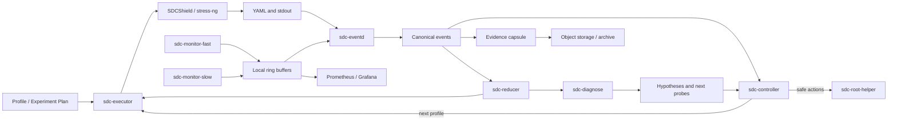
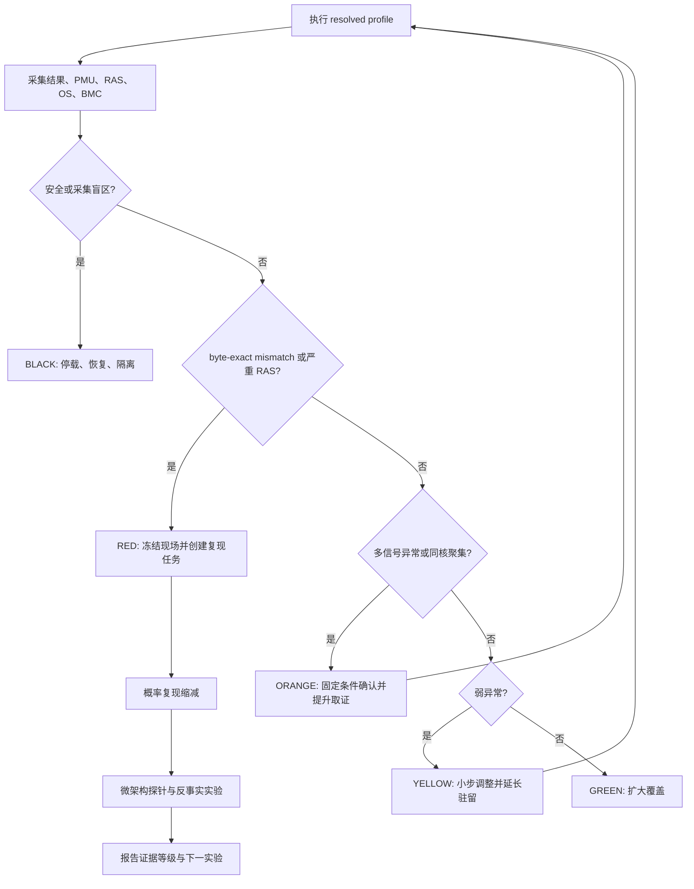

# SDCShield 主动激发、动态监控、动态调整检测用例选择和参数配置/频率骤变/电压骤变/功耗骤变/cpu核上下线等策略调整、最小复现与微架构诊断方案

>
> 适用范围：ARM64 裸金属服务器，优先适配 Kunpeng arm cpu，同时保留对其他 ARM PMU、BMC 和拓扑的能力探测接口
>
> 工程基线：`scripts/sdc-excite-reproduce/` 已有 7x24 战役、监控联锁、事件快照与复测能力；本文定义从现有基线演进到“主动激发 -> 实时反馈 -> 概率复现缩减和最小检测用例提取 -> 故障微架构级诊断”的完整闭环。

---

## 0. 执行摘要

静默数据损坏（Silent Data Corruption，SDC）是硬件没有给出可消费的错误报告，但软件结果已经错误的故障。CPU 核心级 SDC 通常同时具有低发生率、输入相关、执行上下文相关、核心局部、温度/供电/频率敏感和结果形态不稳定等特征，因此不能靠一次满载、单一测试或单一监控指标判断。

本方案把 SDCShield 建设成五段闭环：

1. **Stress & Excite**：用 SDCShield 的字节精确 golden 比对负载、全核耦合压力、工作集谱系、指令族谱系和安全的负载阶跃主动暴露缺陷。
2. **Monitor**：同步采集 SDCShield 结果、每核 PMU、Uncore PMU、RAS/内核异常、频率/温度/电压/功耗、OS 调度和 BMC 事件。
3. **Analyze**：把 mismatch、crash、spurious translation fault、RAS 事件和性能异常统一为有版本的数据事件，计算核心级风险和证据置信度。
4. **Adjust**：规则引擎先行，通过状态机调整测试族、工作集、并发拓扑、数据模式和采样强度；机器学习先以旁路打分运行，不直接控制电压或停机。
5. **Reproduce & Diagnose**：在不破坏诱发环境的前提下，执行概率化 delta debugging，提取最小复现胶囊，并用一变量一对照的探针矩阵将故障约束到 ALU/FPU/Vector、LSU、cache、TLB/PTW、一致性互联、内存或时序边际等候选域。

核心工程判断如下：

- **golden mismatch 是主判据，PMU/温度/RAS 是辅助证据**。PMU 异常不能单独证明 SDC，RAS 静默也不能证明硬件健康。
- **命中后不能立即把全核环境降成单核**。本仓库 CORE179 案例已经证明，单核隔离会消除依赖其他核心负载、供电和共享缓存环境的 SDC。复现缩减必须采用“victim 核 + aggressor 环境”模型。
- **固定 seed 与 seed 扫描承担不同任务**。seed 扫描扩大数据覆盖；固定单一模式的长驻留扩大特定激活窗口的时间覆盖，二者都必须保留。
- **真实硅片压力、架构态故障注入、模拟器结构注入是三种不同证据层**。三层比例不得直接拼接成同一个“覆盖率”。
- **`CNTVCT_EL0` 频率不得硬编码为 100 MHz**。每台机器必须读取 `CNTFRQ_EL0`，并把 counter、counter frequency 和墙钟映射一起保存。
- **调压/超频不属于默认自动化动作**。BMC/IPMI 通常是传感器读取通道，不应假设可以安全调节 CPU 电压。任何硬件 margining 必须由平台能力清单、厂商限值和独立授权共同开启。

第一阶段目标不是立刻上 PID 或强化学习，而是先完成统一数据契约、低开销观测、确定性安全状态机和可重放的复现胶囊。规则控制稳定后，再引入异常检测模型和实验选择算法。

---

## 1. 目标、非目标与验收口径

### 1.1 工程目标

1. 对每次战役、阶段、测试、迭代和事件建立可全链路关联的身份与时间轴。
2. 在不超过约定观测开销的条件下，持续获取核心、Uncore、RAS、OS、应用和 BMC 多层指标。
3. 发现 mismatch 后在 1 秒内冻结关键现场索引，在 60 秒内完成 root 侧快照，在不停止主战役的模式下创建独立复现任务。
4. 自动区分真实硬件候选、测试代码竞争、数值非确定性、环境/基础设施错误和阶段边界终止。
5. 对概率性 SDC 提取可重复的最小环境、最小负载、最小数据和最小指令序列，而不是只保存原始大日志。
6. 输出带证据等级的微架构候选排序和反事实实验结果，不越过软件证据能够支持的结论边界。
7. 对零事件实验给出覆盖时长、核心小时、配置矩阵和置信上界，不使用“未发现等于不存在”的结论。

### 1.2 非目标

- 不承诺仅凭 PMU 唯一定位到具体晶体管、物理端口或版图位置。
- 不把架构态寄存器位翻的检出率解释成真实硅片某微架构单元的自然故障率。
- 不在生产节点默认执行欠压、超频、关闭热保护、关闭 RAS 或破坏性 JTAG 操作。
- 不把自动 ML 模型作为首版安全联锁的唯一依据。
- 不用 Prometheus 代替事件原始证据库，也不把高基数 `event_id`/`seed` 直接做 Prometheus label。

### 1.3 端到端验收标准

| 能力 | 验收标准 |
|---|---|
| 身份与时间 | 任一 mismatch 可关联到 sdc-excite-reproduce/run/test/iteration/cpu/topology，并能把 realtime、monotonic、uptime、CNTVCT 和 BMC 时间误差量化到样本中 |
| 采集 | 关键采集器断链、丢样、复用比例和时间漂移可见；采集器自身 CPU 开销、I/O 和丢样率有基准 |
| 控制 | GREEN/YELLOW/ORANGE/RED/BLACK 状态转换可回放；任何提高压力的动作有前置条件、上限和冷却时间 |
| 取证 | 人工注入的 fail/crash/spurious/RAS 演练均生成完整 event capsule；原始日志与解析结果有哈希 |
| 复现 | 对仓库已有 CORE179 历史样本，流程能表达“单核不复现、全核环境需要保留”的约束，不误做确定性 ddmin |
| 诊断 | 每个结论按“事实/推断/假设”分级，并列出支持证据、反证和下一步实验 |
| 统计 | 所有比率有分母、暴露量和置信区间；`k=0` 时给出上界而不是 0% 风险 |
| 安全 | 温度、风扇、PSU、磁盘、内存、BMC 断链和 watchdog 演练通过；电压/频率写操作默认禁用 |

---

## 2. 仓库现状与目标增量

### 2.1 已有可复用能力

| 现有资产 | 当前能力 | 在本方案中的位置 |
|---|---|---|
| `scripts/sdc-excite-reproduce/sdc_sdc-excite-reproduce.sh` | L0-L5 状态机、谱系扫档、全用例轮转、热激发、NUMA/域隔离、深驻留、失败复测 | 保留为执行器，后续拆出控制 API 与事件 API |
| `scripts/sdc-excite-reproduce/sdc_monitor.sh` | 60 秒 OS/BMC 采样、温度/风扇/磁盘/内存联锁、SEL 增量、root 快照 | 保留为低频环境采集器，补充 1 秒带内采集和事件触发高频窗口 |
| `scripts/sdc-excite-reproduce/sdc_common.sh` | 路径、状态、暂停、内存预算等公共函数 | 演进为原子状态写入和严格 schema 校验 |
| `scripts/run/run_sdc_spectrum.sh` | GEMM/SLEEF/FFT/压缩/crypto 工作集与参数谱 | 作为广域激发 profile 的基础 |
| SDCShield YAML | test、seed、iteration、cpu-mask、time-to-fail、actual/expected/mask、test-runtime | 事件解析的权威输入之一 |
| `docs/cases/CORE179_SDC_REPORT_CN.md` | 真实 SDC 的 seed、并发、相位、位翻转和负载路径规律 | 最小复现算法与 LSU 诊断的回归样本 |
| `docs/cases/sdc1-01-02-core179/SYNTHESIS-12case-cross-analysis.md` | 12 次 vmcore、约 135 次 spurious fault、单核收敛和 load path 证据 | 内核 canary、crash 诊断和证据等级模板 |
| `docs/cpu/arm64/kungpeng/kunpeng920_pmu_events.md` | TSV110 core/uncore PMU 事件、权限与计数器限制 | 平台 PMU profile |
| `./docs/paper/SDC_FAULT_INJECTION_EXPERIMENT_PLAN_CN.md` | ptrace 架构态注入、统计边界 | 注入层设计直接引用，不重复混淆 |

### 2.2 当前缺口

1. 现有 `ledger.csv` 以字符串摘要为主，缺统一 schema、版本、拓扑快照和证据关联图。
2. `monitor.csv` 适合现场排障，但采样周期、字段和双 socket 假设仍偏单板定制，不适合作为跨平台权威接口。
3. 没有持续的每核 PMU 轮转采集，也没有事件前后自动切换到高频 PMU burst。
4. `spurious translation fault` 仍主要靠日志搜索，没有 per-CPU、可持续、带丢失计数的事件流。
5. 失败后只有固定三次定向复测，没有概率复现模型、环境保持策略和分层 ddmin。
6. 没有自动将失败特征映射到微架构假设并生成下一轮受控实验矩阵。
7. `cmd/` 文件代理可继续使用，但目标形态应是严格白名单、原子落盘、带 nonce 和审计记录的命令协议。

---

## 3. 总体架构

### 3.1 逻辑组件

| 组件 | 权限 | 主要职责 |
|---|---|---|
| `sdc-executor` | 普通测试用户 | 调用 SDCShield/stress-ng，执行 profile，记录命令与退出状态 |
| `sdc-monitor-fast` | root 或 `CAP_PERFMON` 等最小能力 | 1 秒带内指标、PMU 轮转、事件触发 100 ms burst、BPF/trace 事件 |
| `sdc-monitor-slow` | root | 5 秒 BMC、SEL、EDAC、kdump、磁盘和安全联锁；可由现有脚本演进 |
| `sdc-eventd` | 普通用户，读取 spool | 解析 YAML/内核/RAS/监控流，生成统一事件、去重、关联和证据快照 |
| `sdc-controller` | 普通用户；通过 root helper 请求有限动作 | 规则状态机、实验排程、压力档位、冷却、停止和复现任务创建 |
| `sdc-reducer` | 普通用户 | 概率 ddmin、victim/aggressor 拆分、数据/负载/拓扑/时长缩减 |
| `sdc-diagnose` | 普通用户 | 假设评分、对照实验生成、位模式和 vmcore 法证汇总 |
| `sdc-root-helper` | root | 只执行固定白名单动作：perf uncore、快照、CPU online/offline、governor、kdump 查询；拒绝任意 shell |
| 本地 spool | 文件系统 | 断网可用的追加写证据、环形缓存和事件胶囊 |
| 远端观测面 | 可选 | Prometheus/Grafana 看趋势；对象存储保存证据；分析库保存结构化实验结果 |

### 3.2 数据与控制流



### 3.3 进程隔离原则

- 执行器、监控器和事件解析器必须独立进程、独立 systemd unit；压测崩溃不能带走监控。
- 高频 PMU 数据先写预分配 ring buffer，再异步落盘；不要在被测线程热路径同步写日志。
- 事件触发时只记录“冻结索引”，由后台复制前后窗口，避免失败回调阻塞。
- root helper 使用固定 JSON schema 和 allowlist，不接受拼接 shell 命令。
- 本地证据以 append-only 为主；最终事件胶囊生成 `SHA256SUMS`，后续分析产物不能覆盖原始证据。

---

## 4. 身份、时间与拓扑契约

### 4.1 身份层级

| 字段 | 含义 | 生成规则 |
|---|---|---|
| `machine_id` | 被测机器稳定身份 | DMI serial + board serial 的哈希；原始序列号只存受控 manifest |
| `sdc-excite-reproduce_id` | 一次长期战役 | `YYYYMMDDTHHMMSSZ-machine-profile-git12` |
| `run_id` | 一条实际进程调用 | UUIDv7 或等价时间有序 ID |
| `test_id` | SDCShield 测试 ID | 直接使用框架 `test->id`，禁止用文件名猜测 |
| `iteration` | 框架迭代 | 取 YAML `state.iteration`；retry 用 `retry=true` 区分 |
| `attempt_id` | 控制器级尝试 | 同一配置重复运行的序号 |
| `event_id` | 统一事件 | UUIDv7；同一根事件的快照/复测通过 `parent_event_id` 关联 |
| `experiment_id` | 受控诊断实验 | 配置内容哈希，确保同配置可去重 |

每次运行至少记录：

```text
sdc-excite-reproduce_id, run_id, experiment_id, test_id, seed, iteration, retry,
logical_cpu, core_id, socket_id, die_id, cluster_or_ccl_id, numa_node,
t_start, t_end, command_argv, environment_hash, binary_hash, config_hash
```

耗时字段避免使用无单位的 `cycles`：PMU 周期写为 `cpu_cycles`，Generic Timer 差值写为 `cntvct_delta` 并同时保存 `cntfrq_hz`，墙钟耗时写为 `duration_ns`。

### 4.2 时间五元组

每个关键边界和事件都记录：

1. `realtime_ns`：`CLOCK_REALTIME`，用于跨系统/人类时间轴。
2. `monotonic_raw_ns`：`CLOCK_MONOTONIC_RAW`，用于计算持续时间，避免 NTP 步进影响。
3. `uptime_ns`：`/proc/uptime` 或 `CLOCK_BOOTTIME`，用于对齐 dmesg/vmcore。
4. `cntvct` + `cntfrq_hz`：读取 `CNTVCT_EL0` 与 `CNTFRQ_EL0`。换算为秒使用 `cntvct / cntfrq_hz`，不能假设固定 100 MHz。
5. `bmc_time`：BMC/SEL 可用时记录原始时间和解析后的 UTC/本地时区信息。

启动时和每 10 分钟执行一次时间锚定：在尽量短的临界区内连续读取 realtime -> monotonic_raw -> cntvct -> uptime，形成映射样本。实现上保留 `date +%s.%N`、`/proc/uptime` 原始值，并由小型 helper 同次读取 CNTVCT/CNTFRQ。事件关联时使用最近两个锚点线性插值，并保存残差 `clock_mapping_error_ns`。若 NTP 不可用，仍可用单机 monotonic 保证因果顺序，并用 BMC 时间作旁证。

### 4.3 拓扑快照

不要假设 `physical_package_id`、`cluster_id` 连续或从 0 开始。每次 sdc-excite-reproduce 启动保存：

- `/sys/devices/system/cpu/cpu*/topology/*`
- `/sys/devices/system/node/node*/cpulist`
- SDCShield `--dump-cpu-info`
- `lscpu -e=CPU,CORE,SOCKET,NODE,CACHE,ONLINE,MAXMHZ,MINMHZ`
- MPIDR/MIDR（可通过已有 CPU 信息路径或轻量 helper 获取）
- cpufreq policy 到 CPU 的映射
- Uncore PMU 实例到 die/SCCL/NUMA 的映射

控制器内部使用实际 CPU 列表，不用 `p0/p1` 等可能受固件 PPTT 伪影影响的假定编号。

---

## 5. 统一数据模型与存储

### 5.1 三类数据

1. **Metric sample**：规则周期采样，适合时序分析，如温度、频率、PMU delta、CPU util。
2. **Event**：稀疏离散事件，如 mismatch、crash、spurious fault、EDAC 增量、SEL Critical、联锁动作。
3. **Artifact**：大对象，如完整 YAML、vmcore、dmesg、反汇编、二进制、配置和最小复现源码。

### 5.2 本地目录布局

```text
sdc-excite-reproduces/<sdc-excite-reproduce_id>/
  manifest.json
  topology/
  configs/
  runs/<run_id>/
    run.json
    stdout.log.zst
    sdcshield.yaml.zst
    metrics-index.json
  spool/
    metrics-1s/<date>.jsonl.zst
    pmu/<date>/<cpu>.bin
    kernel-events/<date>.jsonl.zst
    bmc/<date>.jsonl.zst
  events/<event_id>/
    event.json
    signature.json
    timeline.jsonl.zst
    source.yaml.zst
    snapshots/
    retests/
    reducer/
    diagnosis/
    SHA256SUMS
  reports/
```

现有 `~/sdc-sdc-excite-reproduce` 可以继续作为数据根目录；迁移期由 `sdc-eventd` 兼容读取 `monitor.csv`、`ledger.csv` 和现有事件目录。

### 5.3 Canonical event schema

```yaml
schema_version: 1.0
event_id: 0199...
parent_event_id: null
event_type: sdc_mismatch
severity: red
confidence: observed
sdc-excite-reproduce_id: 20260924T...
run_id: 0199...
test:
  id: eigen_gemm_double_dynamic_square
  family: eigen
  workload_type: floating_point
  instruction_width_bits: 128
  seed: AES:...
  iteration: 17
  retry: false
  knobs: {mdim: 256}
result:
  verdict: FAIL
  t_start_realtime_ns: 0
  t_end_realtime_ns: 0
  duration_ns: 0
  cpu_cycles: 0
  cntvct_delta: 0
location:
  logical_cpu: 179
  core_id: 179
  socket_id: 1
  die_id: 7
  cluster_id: 23340
  numa_node: 7
time:
  realtime_ns: 0
  monotonic_raw_ns: 0
  uptime_ns: 0
  cntvct: 0
  cntfrq_hz: 0
  bmc_time_raw: null
  mapping_error_ns: 0
mismatch:
  type: float64
  byte_offset: 736
  suboffset: 0
  lane: 92
  actual_hex: 0x...
  expected_hex: 0x...
  xor_mask_hex: 0x...
  popcount: 21
environment:
  temperature_c: null
  frequency_khz: null
  voltage_v: null
  package_power_w: null
  pmu_window_id: ...
artifacts: []
classification:
  primary: candidate_hardware_sdc
  alternatives: [test_race, numeric_nondeterminism]
  status: open
```

### 5.4 存储分层

| 层 | 推荐 | 用途 |
|---|---|---|
| 节点本地热数据 | 预分配 ring buffer + JSONL/二进制分片 + zstd | 断网、事件前后窗口、低写放大 |
| 时序观测 | Prometheus remote write 或 VictoriaMetrics/InfluxDB | 仪表盘、告警、趋势；只放低基数字段 |
| 事件检索 | Loki/Elasticsearch 或结构化 SQLite/PostgreSQL | 事件、实验和假设查询 |
| 证据归档 | 版本化对象存储 | YAML、vmcore、二进制、最小复现包 |

Prometheus label 只使用 `machine_id`、`cpu`、`socket`、`metric_group`、`test_family`、`phase` 等有界维度；`seed`、`run_id`、`event_id`、错误值和地址放 exemplar、日志或事件库。

### 5.5 传输与中间件

| 路径 | 首选接口 | 适用范围 | 设计约束 |
|---|---|---|---|
| 被测进程到本地采集 | 预分配共享内存/ring 或 append-only spool | 高频结果、PMU、事件窗口 | 非阻塞；有 drop counter；压测崩溃不带走证据 |
| 本地时序到观测面 | Prometheus pull/remote write | 低基数指标、告警和仪表盘 | TLS/认证；断网本地缓存；不传大 artifact |
| BMC/机架环境 | IPMI/Redfish；SNMP 可作为机架级补充 | 温度、电压、风扇、PSU、SEL | BMC 限流；只读账号；保留原始 sensor identity |
| 节点控制 | 本地 Unix socket/spool；跨节点可选 mTLS gRPC | action、ack、heartbeat | versioned schema、nonce、期限、幂等和 allowlist |
| 事件流 | 小规模直接写事件库；大规模可选 Kafka | 多节点异步关联和消费 | 单机首版不引入；启用后以 event ID 去重并监控 lag |
| 大对象 | HTTPS/S3 兼容对象存储 | vmcore、二进制、capsule、Parquet | 分片校验、断点续传、服务端版本化和访问控制 |

单机/小规模实验不为“架构完整”强行部署 Kafka/RabbitMQ；本地 spool 是断网和崩溃情况下的事实来源。中心侧不可用时，安全联锁仍由节点本地执行。

---

## 6. 监控指标、采集频率与开销预算

### 6.1 指标优先级

指标按“能否决定安全、能否证明结果错误、能否缩小故障域”排序，而不是按可采集数量排序。

| 优先级 | 指标族 | 典型指标 | 异常模式与用途 |
|---|---|---|---|
| P0 | SDCShield 结果 | PASS/FAIL、test、seed、iter、CPU、耗时、offset、lane、O/T、XOR mask | golden mismatch 是 SDC 候选主事件；同 seed 延迟尾部变宽是早期线索，但不能单独定性 |
| P0 | 内核/RAS | SError、MCE/GHES、EDAC CE/UE、Oops/WARN/panic、RCU stall、soft lockup、hung task | 区分静默错误、可纠正错误、已报告错误和系统失效；检查事件是否在嫌疑核聚集 |
| P0 | spurious translation fault | 事件时间、CPU、进程/线程、地址、异常码 | 廉价 canary；必须按核计数并与 workload 窗口关联，不能仅统计全机 grep 数 |
| P0 | 安全联锁 | CPU/VRD/内存/进出风温度、风扇、PSU、Prochot、BMC 通信、磁盘/内存余量 | 越限立即降载或停止；传感器失联本身也进入 fail-safe |
| P1 | Core PMU | cycles、retired/spec instructions、stall、cache、TLB、branch、remote、memory error | 计算 IPC、stall ratio、MPKI 和重试/访存特征，形成事件前后窗口与对照核差分 |
| P1 | Uncore PMU | L3 retry/back-invalid、HHA snoop、DDRC 流量与切换 | 判断共享 cache、一致性、跨 socket 和内存控制器干扰是否为必要环境 |
| P1 | 频率/功耗/热 | policy 双读频率、time_in_state、governor、boost、功耗、温度、电压 | 识别降频、热毛刺、droop 代理和阶段变化；SoC max 温度不得伪装成 per-core 温度 |
| P1 | OS 调度 | 每核 user/sys/idle/irq、interrupt、ctxt、runqueue、NUMA 内存 | 证明测试实际落核，识别迁移、抢占、IRQ 和内存压力混杂因素 |
| P2 | 固件/BIOS | BIOS/BMC/微码版本、启动参数、SEL、平台配置 | 提供实验上下文和跨机器差异解释 |
| P2 | 运行时/库 | allocator、OpenMP/MPI、数学库版本与返回码 | 排除库非确定性、并发竞争和运行时失败 |
| P2 | 应用级 | 双跑、checksum、断言、业务 golden | 验证检测器之外的真实应用敏感性 |

按系统层次归纳如下：

| 层级 | 优先监控项 | 典型异常模式 |
|---|---|---|
| 硬件层 | Core/Uncore PMU、cache/TLB/branch、EDAC/GHES、内存/互联错误、温度/频率/电压/功耗 | IPC 或 stall 突变、某核/某共享域重试聚集、CE/UE 增量、热/功耗边沿与 mismatch 同窗；只作为定位证据，除 oracle mismatch 外不单独定性 SDC |
| 固件/BIOS 层 | BIOS/POST/启动日志、firmware/BMC/微码版本、SEL、传感器告警、平台配置 | 版本漂移、训练/校验告警、电源/温度/风扇告警、重启原因异常；用于解释平台差异和排除环境故障 |
| 内核/OS 层 | SError/MCE、spurious translation fault、Oops/WARN/panic、RCU/softlockup/hung task、调度/IRQ、页错误和 NUMA 状态 | 异常在特定 CPU 聚集、内核 fault 与 mismatch 相邻、线程迁移或 IRQ 毛刺造成假关联、崩溃或 hang 从静默转为 DUE |
| 运行时/库层 | allocator、GC（如适用）、OpenMP/MPI、数学库、自检、线程到 CPU 映射、用例耗时 | 分配失败、错误返回码、竞态、线程迁移、同 seed 长尾扩大；用于识别软件缺陷和执行上下文 |
| 应用层 | byte-exact golden、checksum、双重执行、范围/不变量断言、关键 checkpoint | 输出不一致但硬件/内核无报告是主 SDC 候选；稳定业务语义错误可作为第二独立 oracle |

### 6.2 TSV110 PMU 分组

TSV110 单核可用通用计数器数量有限，不能假设所有事件可以同时无复用地测量。首版按阶段轮换事件组，每次记录事件编码、PMU 类型、`time_enabled`、`time_running`、缩放值和原始值。

| 组 | 事件 | 目的 |
|---|---|---|
| `core_base` | `cpu_cycles(0x11)`、`inst_retired(0x08)`、`inst_spec(0x1b)`、`exe_stall_cycle(0x7001)`、`stall_frontend(0x23)`、`stall_backend(0x24)` | IPC、推测执行量和前后端压力基线 |
| `core_memory` | `mem_stall_anyload(0x7004)`、`mem_stall_l1miss(0x7006)`、`mem_stall_l2miss(0x7007)`、`l1d_cache_refill_rd(0x42)`、`l2d_cache_refill_rd(0x52)`、`ll_cache_miss_rd(0x37)` | LSU/cache 层级压力 |
| `core_path` | `dtlb_walk(0x34)`、`l1d_tlb_refill_rd(0x4c)`、`remote_access(0x31)`、`memory_error(0x1a)`、`br_mis_pred(0x10)` | PTW、跨域、硬件错误和分支路径 |
| `l3c` | `back_invalid(0x29)`、`retry_ring(0x41)`、`retry_cpu(0x40)`、`prefetch_drop(0x42)` | L3/一致性拥塞与重试 |
| `hha` | `rx_outer(0x01)`、`rx_sccl(0x02)`、`tx_snp_num(0x33)` | 跨簇/跨 socket snoop 活动 |
| `ddrc` | `flux_rd(0x01)`、`flux_wr(0x00)`、`rnk_chg(0x06)`、`rw_chg(0x07)` | 内存带宽与方向/Rank 切换 |

派生指标至少包括：

```text
IPC                = inst_retired / cpu_cycles
spec_per_cycle     = inst_spec / cpu_cycles
frontend_stall_pct = stall_frontend / cpu_cycles
backend_stall_pct  = stall_backend / cpu_cycles
load_stall_pct     = mem_stall_anyload / cpu_cycles
L1D_refill_MPKI    = l1d_cache_refill_rd * 1000 / inst_retired
L2D_refill_MPKI    = l2d_cache_refill_rd * 1000 / inst_retired
LLC_miss_MPKI      = ll_cache_miss_rd * 1000 / inst_retired
branch_miss_MPKI   = br_mis_pred * 1000 / inst_retired
```

当 `time_running/time_enabled` 低于配置阈值（建议初始为 0.8）时，该窗口标记为 `multiplex_degraded`，不得直接和非复用窗口比较。平台上线前用 `perf list`、`perf stat -v` 和 PMU sysfs 能力探测校验 raw 编码，事件不存在时降级而非伪造零值。

### 6.3 采样策略

| 数据 | 常态 | 事件升级窗口 | 说明 |
|---|---|---|---|
| SDCShield 结果 | 每次迭代/失败即时 | 失败即时 flush | 结果与 seed、CPU、耗时必须同记录提交 |
| Core PMU | 1 秒 delta，计数模式 | 嫌疑核、同簇核和对照核 100 ms，持续 30-60 秒 | 默认不使用高频中断 sampling；事件组按固定 schedule 轮换 |
| Uncore PMU | 1-5 秒 | 1 秒 | 按 PMU 实例保存 socket/die/cluster 归属 |
| `/proc`、频率、hwmon | 1 秒 | 100-250 ms 的有限 burst | 频率双源读取并记录缺失/不一致 |
| BMC SDR | 5 秒 | 仍为 5 秒 | 避免高频 IPMI 请求拖垮 BMC；实际最小周期由平台压测确定 |
| SEL | 30 秒增量或事件触发 | 立即再读 | 以 record ID 去重，保存 BMC 原始时间 |
| dmesg/journal/trace | 事件流 | 全量关联 | 保存 cursor/sequence，避免重复 grep 和丢窗口 |
| 全量系统快照 | 10 分钟 | 触发后 0、10、30、60 秒 | 由 root helper 执行，避免主执行器长时间阻塞 |

节点维护至少 120 秒滚动热窗口。事件发生时固化 `[-60s,+60s]` 数据；崩溃场景依赖串口、pstore/kdump 和远端 collector 保留崩溃前尾部。

### 6.4 带内状态与 BMC 传感器归一化

带内每秒读取并保存数据来源：

- 频率：`policy*/scaling_cur_freq` 与 `cpuinfo_cur_freq`/AMU 可用值双读，另存 governor、min/max、boost 和 `stats/time_in_state`；
- 温度：`thermal_zone*/{type,temp,trip_point*,policy}` 与 `hwmon*/temp*_label/input`；明确 `hisi_thermal` 等可能是 SoC 最大值或聚合值，不标成 per-core；
- 功耗：平台暴露的 `hwmon*/power*_input`、powercap/SCMI 或厂商接口；ARM 上不假设存在 Intel RAPL；
- OS：`/proc/stat` 每核 user/sys/idle/iowait/irq/softirq、`/proc/interrupts`、loadavg、ctxt、procs_running、`/proc/meminfo`、NUMA node meminfo、runqueue 和测试线程实际调度 CPU。

BMC 传感器名称因固件版本而变化，采集器同时保留 `raw_name`、entity/sensor number、unit、状态和规范化字段。目标映射至少覆盖：

| 规范化类 | 常见原始名称示例 |
|---|---|
| CPU 温度 | `CPUN Core Rem`、CPU/SoC Temperature |
| CPU 电压 | `CPUN VDDAVS`、`VDDFIX`、`HVCC` |
| 内存电压 | `DDRVDD`、`VPP_AB/CD`、`VDDQ_AB/CD`、`VTT_AB/CD`、`1.8V` |
| 供电/内存温度 | `CPUN VRD Temp`、`VDDQ Temp`、`MEM Temp` |
| 热节流 | `CPUN Prochot` |
| 整机/PSU 功耗 | `Power`、`PSN POut`、`VIN`、`IIn`、`IOut` |
| 风扇 | `FANN Speed`、Linux `cooling_device*/cur_state` |
| 环境 | `Inlet Temp`、`Outlet Temp`、`PSN Temp`、`Disks Temp` |

首次接入机器运行传感器 discovery，生成带单位、正常范围、告警状态和语义的 board mapping；找不到匹配时保留 raw 数据但不参与自动规则。`ipmitool sel elist -v` 或 Redfish Event 的记录按 ID 增量采集并去重。

### 6.5 spurious translation fault 采集

优先使用 BPF tracepoint、fentry 或 kprobe 记录事件的 CPU、PID/TID、comm、fault address 和异常码；挂载前必须通过 BTF/kallsyms 能力探测目标符号和函数原型，不把某一内核版本的 `do_translation_fault` 签名硬编码为通用接口。无法安全挂载时，降级到内核日志增量解析，并显式标记 `source=dmesg` 和定位精度损失。

该指标的告警基线按核建立：

- 首次出现即产生 YELLOW 事件并启动高频窗口；
- 同一 CPU 在短窗内重复出现，或与 mismatch 同窗，升级为 ORANGE/RED；
- 仅有全机累计值、不知道 CPU 或时间窗口时，只能作为弱证据；
- 计数重启、日志轮转和 collector 重启必须可识别，不能造成虚假增量。

### 6.6 开销与数据质量验收

不预设“监控固定消耗 X%”。每种机器、内核、计数器组和采样配置执行三组 A/B：无监控、常态监控、事件 burst，至少比较 SDCShield 吞吐、p50/p99/p99.9 延迟、cycles、系统 CPU、上下文切换和 I/O。

初始工程预算：

| 项目 | 预算 |
|---|---|
| 常态采集吞吐下降 | 中位数不超过 3% |
| 全周期含 burst 的吞吐下降 | 不超过 5% |
| 事件 burst 短窗下降 | 不超过 10%，且不得改变复现结论 |
| 关键事件丢失率 | 小于 0.1%，并有 drop counter |
| 时间映射 | 每批数据保存估计误差；超预算样本标记不可用于精细时序因果分析 |

采集器公开 `samples_total`、`samples_dropped_total`、`collection_duration`、`queue_depth`、`last_success_time`、`clock_mapping_error` 和自身 CPU/RSS/I/O。任何采集断链都进入控制器输入，避免在“监控盲区”继续自动加压。

---

## 7. 主动激发、压力谱与故障注入

### 7.1 三个证据层

| 层 | 方法 | 能回答的问题 | 不能直接推出的结论 |
|---|---|---|---|
| A：真实硅片主动激发 | SDCShield、并发/拓扑/工作集/指令/热与功耗瞬态压力 | 该实机在给定环境下是否出现真实 mismatch；触发条件有哪些 | 某微架构单元的绝对自然故障率 |
B: 电压/频率扰动注入，降低或波动CPU供电电压（UVLO模拟）或增加时钟频率（OVLO模拟）可引发瞬态错误。可用实验室电源对CPU供电进行欠压、或在BIOS/OS层改变DVFS策略（极限频率或频繁切换）来施加压力。这主要影响电源完整性和时序裕量，可能导致多比特故障或时序违例。  

C：微架构应力注入，通过特定指令序列或高负载模式刺激微架构结构，例如对齐冲突、缓存行冲突、分支深度、浮点密集计算等。示例：使用`stress-ng`工具或自定义激励程序发起大量缓存填充、流水线吞吐或浮点运算，以观察在极端负载下缺陷单元的行为。这种“压力测试”本身不直接翻转位，但可加速缺陷暴露频率。  


每层分别报告 `injections`、`activated`、`architecturally_visible`、`detected`、`SDC`、`DUE/crash` 和 `masked`。跨层只做因果链互证，不相加分子和分母。

### 7.2 真实硅片压力维度

首版在现有 L0-L5 之上把压力拆为可组合参数，控制器每次只改变少量维度：

| 维度 | 参数示例 | 主要目标域 | 预期现象 |
|---|---|---|---|
| 数据模式 | zero/ones、walking bit、交替位、低/高 Hamming weight、边界浮点、NaN/Inf/subnormal、固定 seed、seed 扫描 | ALU/FPU/SIMD、旁路网络、数据通路 | 特定 bit/lane/数值类别聚集 |
| 指令族 | integer、mul/div、FP、NEON/SVE、load/store、atomic、branch、crypto | 执行端口、寄存器文件、LSU、预测器 | 某指令族显著抬升失败率 |
| 指令宽度 | scalar、64/128/256 位或平台支持宽度 | SIMD lane、宽数据通路 | 固定 lane 或宽度相关错误 |
| 工作集 | L1、L2、LLC、DRAM、跨 NUMA | cache data/tag、TLB/PTW、内存控制器 | 容量边界、MPKI、远端访问相关 |
| 访问模式 | 顺序、stride、pointer chase、随机、同地址竞争、false sharing | prefetch、TLB、LSU、一致性 | retry/snoop/translation fault 抬升 |
| 并发拓扑 | victim 单核、同簇 aggressor、同 die、同 socket、跨 socket、全机 | 共享 cache、互联、供电域 | 复现需要特定邻域或全机负载 |
| 负载阶跃 | 平稳、周期 burst、相位同步、高低负载切换 | 时序/供电边际代理 | 事件在负载边沿聚集 |
| OS 条件 | governor、允许的频点、IRQ/NUMA 绑定、页大小 | DVFS、调度、TLB | 仅在特定调度/页表条件复现 |
| 热状态 | 冷机、稳态、接近但低于安全阈值 | 温度边际 | 失败概率随温度区间变化 |

`stress-ng` 只作为 aggressor 和环境塑形工具；是否发生 SDC 必须由有 golden 的 SDCShield 或应用校验负载判断。任何会修改 SDCShield 热路径、数据布局或线程时序的插桩都先在基线机器上验证不会改变触发概率。

### 7.3 标准压力 profile

```yaml
schema_version: 1
profile_id: victim179_lsu_fullnode_v1
victim:
  cpus: [179]
  tests: [memcpy, memory, eigen]
  seed_policy: fixed_then_sweep
  iterations_per_seed: 1000
aggressors:
  topology: all_except_victim
  families: [cache, stream, integer, neon]
  duty_cycle: 1.0
environment:
  governor: performance
  numa_policy: recorded_default
  hugepages: recorded_default
monitoring:
  pmu_groups: [core_base, core_memory, core_path, l3c, hha, ddrc]
  steady_period_ms: 1000
safety_policy: lab_default_v1
limits:
  duration_s: 3600
  max_failures: 3
```

profile 在启动前解析成不可变的 `resolved-profile.yaml`，保存 CPU 列表、实际频率策略、PMU 实例、sensor 名称、二进制哈希和所有默认值，避免同一 profile 名称在不同机器上代表不同实验。

### 7.4 架构态注入

架构态注入器用于验证 SDCShield 的检测灵敏度和日志完备性：

1. 选择注入目标：GPR、FP/SIMD 寄存器、堆/栈/输出 buffer 或可控中间值。
2. 选择时间：按迭代 checkpoint、指令计数窗口或同步屏障，而不是仅依赖不稳定的墙钟 sleep。
3. 记录原值、目标值、XOR mask、目标线程/CPU、注入成功确认和注入后结果。
4. 将结果分类为 masked、detected-corrected、SDC、异常退出、hang 或 injection-invalid。
5. 使用无注入对照和 sham injection 排除 ptrace/暂停本身改变时序的影响。

注入成功但故障未传播与注入本身失败必须分开计数。若不能证明目标值已经改变，则样本不进入检出率分母。

### 7.5 电压/频率与平台 margining

频率 governor、平台公开的频率上下限和 boost 开关可以作为普通实验参数，但每次修改前后必须读回验证并保留原值用于恢复。CPU 供电电压、超规格频率、VRM/JTAG/厂商 margining 接口属于高风险能力，默认 `disabled`，且必须满足：

- 专用实验节点，生产网络和业务隔离；
- 平台厂商提供可写接口、绝对限值、步进、驻留时间和恢复过程；
- 独立硬件保护、BMC watchdog、远程断电和串口；
- 双人授权或等价审计机制；
- 每一步读回、稳定等待、健康检查，越限自动回退；
- 不通过通用 `ipmitool sensor` 命令臆测电压可调。

因此首版自动系统用高 di/dt 工作负载阶跃、并发拓扑和合法 DVFS 状态作为时序边际代理；真正的 Vmin/overclock 实验作为单独插件和单独报告，不与默认 SDC 战役混用。

---

## 8. 动态控制器

### 8.1 控制对象与约束

控制器输入包括事件、短窗统计、数据质量和安全状态；输出只能是经过注册的动作：切换测试族、seed 策略、工作集、victim/aggressor CPU 集合、并发数、占空比、合法频率策略、PMU 组和取证强度。

每个动作定义：`precondition`、`expected_effect`、`max_step`、`cooldown`、`rollback`、`owner` 和 `risk_class`。控制器不得直接拼接任意 shell 命令；执行器只接受有 schema 的 action，并在执行前后回报 resolved state。

### 8.2 状态机

| 状态 | 进入条件 | 动作 | 退出条件 |
|---|---|---|---|
| `GREEN` | 指标在基线内，采集完整 | 按计划运行；渐进增加覆盖面 | 弱异常、事件或计划阶段结束 |
| `YELLOW` | 单一弱 canary、延迟尾部/PMU 稳健 z-score 越限、采集轻微退化 | 保持或小步调整压力；启动高频窗口；不立即宣告 SDC | 恢复并冷却，或多个信号一致 |
| `ORANGE` | 同核重复 canary、多个指标同窗异常、单次未确认 mismatch | 冻结 profile；重复当前 test/seed；创建复现任务；减少无关探索 | 事件被排除，或确认 mismatch/RAS |
| `RED` | byte-exact mismatch、UE、严重 RAS、连续异常或测试进程异常 | 固化证据；停止该 run 的自动加压；保留必要 aggressor；进入复现/诊断 | 人工或策略批准后转恢复/隔离 |
| `BLACK` | 温度/电源/风扇越限、BMC/关键采集失联、panic/hang、恢复失败 | 立即降载/终止、恢复配置、触发 watchdog/隔离 | 完成人工安全确认 |

状态转换、输入快照和输出动作全部写入 append-only ledger；同一事件重放时应产生相同的规则决策。

### 8.3 首版规则

```yaml
- id: exact_mismatch
  when: event.type == sdc_mismatch && event.golden == byte_exact
  transition: RED
  actions:
    - freeze_ring_buffers
    - snapshot_root_context
    - enqueue_reproduction
    - hold_resolved_profile

- id: per_cpu_spurious_cluster
  when: spurious_fault.count(cpu, 60s) >= 2
  transition: ORANGE
  actions:
    - pmu_burst: {scope: [cpu, cluster, control_cpu], duration_s: 60}
    - rerun_current_seed: {count: 20}

- id: latency_tail_only
  when: latency.robust_z_p999 > 5 && mismatch.count == 0
  transition: YELLOW
  actions:
    - keep_pressure
    - extend_residency: {factor: 2, max_s: 1800}

- id: safety_or_blindness
  when: safety.limit_exceeded || collector.critical_stale
  transition: BLACK
  actions: [stop_workloads, restore_platform, isolate_node]
```

初始阈值必须由每台机器的同 profile 健康基线校准。对 PMU、IPC 和延迟使用 median/MAD、分位数和对照核差分，不把固定“高 10%”当作跨平台通用阈值。短时越限需满足最小持续窗口或多信号一致性，安全联锁除外。

### 8.4 漏斗式自适应

1. **发现**：全机覆盖测试族、工作集、数据模式和负载相位。
2. **确认**：保持原 resolved profile，固定失败 test/seed，在原全机环境中重复。
3. **定位 victim**：不是先清空其他核，而是让检测任务轮流绑定每个候选核，同时保持 aggressor 场。
4. **定位环境**：固定 victim，按 cluster/die/socket/NUMA/负载族成组移除 aggressor，测量失败概率变化。
5. **定位算子**：在已确认环境中切换 integer/FP/vector/load-store/branch/atomic 等微测族。
6. **缩减数据**：对 seed、输入尺寸、lane、数据模式和迭代窗口做概率化缩减。
7. **反事实验证**：只改变一个候选因素，执行交错 A/B/A/B 或随机化区组实验。

每一步设置最大实验预算和最小复现概率；若缩减让复现概率跌破下限，回退到最近一个稳定节点，而不是把“这次没发生”解释成该因素无关。

### 8.5 反馈控制与机器学习的边界

- PID 适合控制温度、利用率或事件生成速率等连续可观测量，不适合直接控制极稀疏的 SDC 次数。首版可用 PI 调占空比，使温度/功耗保持在安全目标带内。
- 异常检测模型输入使用标准化 PMU delta、环境量、延迟分位数和拓扑上下文；输出是风险分，不是“已发生 SDC”的标签。
- Isolation Forest、one-class SVM 或变化点检测先以 shadow mode 运行，和规则决策并行记录至少一个完整战役周期。
- 模型版本、训练数据窗口、特征 schema、阈值和离线评估一并归档；训练/评估按机器或时间分组，避免同一事件窗口泄漏到两侧。
- 强化学习或贝叶斯优化只用于选择下一组安全实验参数，硬安全约束由独立规则层执行，任何模型均不可绕过。



---

## 9. 测试框架、实验设计与统计口径

### 9.1 测试负载与 oracle

| 类别 | 负载 | oracle 要求 |
|---|---|---|
| SDCShield 原生 | integer、Eigen/GEMM、FFT、memory/memcpy、branch/vector 等现有族 | 首选 byte-exact；浮点 tolerance 必须固定并另报 exact mismatch |
| 微内核 | 单指令族、固定寄存器依赖链、load-use、store-load forwarding、TLB walk、atomic、cache sharing | 小型独立 golden，重复计算和离线参考双校验 |
| 系统压力 | stress-ng、STREAM、cache thrash、pointer chase、跨 NUMA 流量 | 仅塑造环境，不单独作为 SDC oracle |
| 代表性应用 | 矩阵、FFT、压缩/解压、checksum、数据库/图算法的可验证子集 | 确定性输入、结果 hash、语义断言或冗余执行 |
| 对照 | 空闲、低负载、健康机器、同机非嫌疑核 | 和实验组使用相同软件、采集器和时间窗口 |

测试代码先通过 sanitizer、线程竞态检查、不同优化级别对照、健康机器长跑和输出解析单测。错误检测逻辑与被测逻辑尽量独立；不能把同一段可能有缺陷的计算同时用作结果和 golden。

### 9.2 实验矩阵

因子至少包括：机器、CPU/拓扑、测试族、seed/data pattern、工作集、并发拓扑、aggressor 类型、频率策略、热状态和采集 profile。避免直接穷举全部笛卡尔积：

1. 基线阶段用 pairwise/covering array 覆盖主要二阶交互。
2. 对出现异常的区域增加固定 seed 长驻留和局部网格。
3. 对候选因素做随机化区组或交错 A/B，以时间段、温度带和机器作为 block。
4. 自适应阶段由信息增益或失败概率选择下一实验，但保留固定比例的探索和健康对照。
5. 阶段切换前设冷却/稳定窗口，避免把上一阶段残留热状态错误归因给下一阶段。

建议压力等级：

| 等级 | 目标 | 典型配置 |
|---|---|---|
| L0 | 健康与工具校验 | 低负载、短时、全采集器、自检与 sham injection |
| L1 | 基线谱系 | 单测试族、默认频率、工作集扫档 |
| L2 | 并发覆盖 | 多核/全核、固定与轮换 seed、同簇到跨 socket |
| L3 | 边沿激发 | 合法 DVFS 变化、负载阶跃、热稳态带 |
| L4 | 事件确认 | 固定原 profile、重复失败 test/seed、提升采集 |
| L5 | 复现与诊断 | victim/aggressor 缩减、单变量探针 |
| L6 | 受控 margining | 仅专用实验域，需平台授权；与默认战役分离 |

### 9.3 结果分类

每次试验必须恰好落入一个主分类，并可带次级标签：

- `PASS`：oracle 一致且无试验级异常；
- `MASKED`：已确认注入成功，但结果无可见变化；
- `DETECTED_CORRECTED`：错误被硬件/软件报告并纠正；
- `SDC_CANDIDATE`：oracle mismatch，硬件未报告可消费错误；
- `SDC_CONFIRMED`：通过真实性门禁并在独立运行中复现，或有等价强证据；
- `DUE`：异常退出、SIGBUS/SIGSEGV、SError、panic 等可检测不可恢复错误；
- `HANG/TIMEOUT`：无进展并满足 watchdog 判定；
- `INVALID`：注入未成功、采集盲区、阶段边界 SIGTERM、配置错误或 oracle 不可信；
- `TEST_BUG`：测试竞争、越界、未初始化、错误容差或解析错误已经得到证据确认。

`INVALID` 和 `TEST_BUG` 不进入硬件 SDC 率分母，但必须单独报告，防止静默丢弃不利样本。

### 9.4 统计量

基础输出同时给出迭代口径和暴露口径：

```text
iteration SDC rate = confirmed_sdc / valid_iterations
core-hour rate     = confirmed_sdc / valid_core_hours
activation rate    = activated / successful_injections
detection rate     = detected / architecturally_visible
```

对于近似独立的 `k/n`，报告点估计和 95% Clopper-Pearson 区间；需要更稳定的图表时可同时给 Wilson 区间。`k=0` 时不写“发生率为 0”，而给出精确上界；粗略规划可用 rule of three：95% 上界约为 `3/n`。

若目标是以 95% 置信度在零事件情况下排除单次概率大于 `p0`，所需独立试验数为：

```text
n >= log(0.05) / log(1 - p0)  ~=  3 / p0
```

SDC 迭代通常受同一 seed、同一热状态和同一运行段影响，并非严格独立。主分析以 run/时间 block 为聚类单位，采用 block bootstrap、beta-binomial 或带随机效应的 logistic/Poisson 模型；不能把同一小时内百万次循环当成百万个完全独立样本来缩窄置信区间。

比较两个条件时：低计数使用 Fisher exact 或精确率区间；有暴露时间时比较 Poisson rate ratio；有 machine/run/core 层级时使用混合效应模型。除效应量和区间外，必须报告样本量、有效暴露、无效样本和停止规则。

### 9.5 延迟尾部分析

对相同 test/seed/profile 保存 `cycles` 和 `duration_ns` 的 p50/p90/p99/p99.9/max、MAD、极值发生 CPU 和当时环境。CNTVCT 周期须用同批记录的 `CNTFRQ_EL0` 转换。

尾部变宽是 small delay fault 或资源争用的候选信号，不是 SDC 结论。分析时至少控制：CPU 迁移、IRQ、context switch、频率变化、页错误、PMU multiplex、温度和 aggressor 相位，并与健康核及相同 profile 基线比较。

### 9.6 实验停止规则

每个 experiment manifest 预先定义：最大时长、最大有效迭代、目标失败数、无事件停止界、温度/电源限值和统计检验计划。自适应加样必须保留原因。安全停止、预算停止和统计停止分开编码，避免终止原因污染结果解释。

---

## 10. 最小复现用例提取

### 10.1 真实性门禁

任何 mismatch 在进入 reducer 前先完成以下门禁：

1. 保存原始 stdout/stderr/YAML、退出码、信号、二进制和配置 hash，不只保存解析后的摘要。
2. 验证失败发生在完整迭代内，不是 timeout、阶段切换、SIGTERM 或日志截断。
3. 依据数据类型重算 offset、lane、O/T、XOR mask 和 popcount；浮点同时保存原始 bit pattern。
4. 在健康机器/健康核上运行同一二进制、配置和 seed，排除确定性测试缺陷。
5. 对相关测试执行竞态、越界、未初始化、生命周期和容差审计；本仓库已有误报历史，应把 test bug 视为一等候选。
6. 确认测试线程的实际 CPU，而非只相信请求的 affinity；记录迁移、cpuset 和 cgroup 状态。
7. 至少执行原条件复测和 sham-control；不要求每次复现，但必须估计复现概率。

通过后生成 `event capsule`，状态由 `candidate` 变为 `qualified`；未通过则标记 `invalid` 或 `test_bug`，原始证据仍保留。

### 10.2 复现胶囊

```text
repro-<event_id>/
  manifest.yaml
  resolved-profile.yaml
  topology.json
  platform.json
  binaries/
    sdcshield
    SHA256SUMS
  inputs/
  golden/
  event.json
  original/
    stdout.log
    stderr.log
    result.yaml
  windows/
    metrics-before-after.parquet
    kernel.log
    sel.txt
  scripts/
    run.sh
    verify.sh
    restore.sh
  reduction/
    graph.jsonl
    trials.parquet
  diagnosis/
    hypotheses.yaml
    report.md
```

`run.sh` 只引用 capsule 内或有内容哈希的依赖，并在运行前验证内核、固件、CPU 型号、微码/firmware、页大小、governor、CPU online 集和拓扑是否满足 manifest。无法精确复原的 BMC/热状态以允许区间表示，而不是假装确定。

### 10.3 概率性判据

传统 ddmin 使用一次 PASS/FAIL 判定，不适合偶发 SDC。对每个候选配置 `C` 执行顺序试验，记录 `k_C/n_C` 和区间，并与父配置 `P` 比较：

- `ACCEPT`：复现率下界高于预设最小值，或与父配置相比未出现超过容忍度的下降；
- `REJECT`：有足够证据表明复现率低于阈值；
- `INCONCLUSIVE`：预算耗尽仍无法区分，保留该因素并标记不确定。

首版可配置 `min_trials=20`、`max_trials=200`、`target_repro_rate` 和 `noninferiority_margin`，但默认值须由历史事件频率校准。Reducer 必须保存完整搜索树、随机种子、试验顺序和回退点。

### 10.4 victim/aggressor 保真缩减

复现条件建模为：

```text
R = f(victim_cpu, victim_workload, aggressor_set, aggressor_workload,
      data_pattern, memory_placement, OS_state, thermal_power_band, time)
```

缩减顺序：

1. **冻结原环境**：先证明原 resolved profile 仍能以非零概率复现。
2. **确认 victim**：保持 aggressor 不变，让同一检测任务在嫌疑核和拓扑匹配对照核之间交错运行。
3. **按拓扑缩 aggressor**：优先成组移除跨 socket、远端 NUMA、其他 die、其他 cluster，随后在必要组内二分；每次保留供电/热状态对照。
4. **按负载族缩 aggressor**：cache、memory、integer、vector、branch 分组移除，定位必要的干扰类型。
5. **缩 victim 测试集**：从全谱系缩到 test family、具体 test 和参数组合。
6. **缩输入**：seed 集、矩阵尺寸、工作集、数据 pattern、lane/offset 和迭代窗口。
7. **缩指令序列**：仅在稳定微测中用编译器/汇编级 reducer；始终检查生成代码和寄存器分配没有改变关键条件。

若单核模式不复现，输出应是“最小 victim + 最小必要 aggressor 场”，而不是强迫生成脱离环境的单线程样例。

### 10.5 降低观察者效应

- reducer 与取证逻辑运行在保留控制核或远端节点，victim 热路径只写预分配 buffer；
- 不在候选指令序列中新增 printf、malloc、锁或系统调用；
- 比较 instrumented 与 uninstrumented 的复现率和代码布局；
- 保存 ELF、Build ID、反汇编、编译器版本和完整 flags；
- 固定 ASLR、页大小、NUMA policy 等只能作为实验变量显式设置，不能无记录地改变；
- 失败时先复制现场，再异步解析，避免解析延迟改变 aggressor 相位。

### 10.6 复现成熟度

| 等级 | 定义 |
|---|---|
| R0 | 单次合格事件，有完整原始证据 |
| R1 | 原 profile 下概率复现，失败率和区间已知 |
| R2 | victim 核和必要 aggressor 拓扑已约束 |
| R3 | test/seed/data pattern/工作集已约束，可打包重放 |
| R4 | 独立操作者或第二台同型机器可复现；若只在原机器复现则明确标注 machine-local |
| R5 | 最小微测和反事实探针支持一个微架构候选域，并有反证记录 |

---

## 11. 微架构级诊断

### 11.1 诊断原则

1. 先排除 oracle、测试竞争和软件非确定性，再解释硬件信号。
2. 将“同窗相关”与“改变因素后失败率随之改变”分开；后者才是更强的因果证据。
3. 诊断目标首先是候选域，不承诺仅凭软件 PMU 定位到具体晶体管或物理端口。
4. 每次实验只改变一个主要因素，并保留拓扑匹配对照核和健康机器对照。
5. 报告中严格分为事实、推断和待验证假设。

`MACHINE_CLEARS`、`UOPS_RETIRED` 和 RAPL/MSR 是常见 x86 名称/接口，不能直接当成 ARM 通用能力。ARM 平台按语义类别做 capability mapping：TSV110 使用已校验的 raw event；功耗优先读取平台 hwmon、powercap、SCMI 或厂商接口。缺失能力标记 `unsupported`，不能用 0 代替。

### 11.2 假设矩阵

| 候选域 | 支持信号 | 主要反事实探针 | 典型反证/替代解释 |
|---|---|---|---|
| 测试/oracle | 失败跨所有 CPU 一致；特定优化级别或线程数出现；sanitizer/TSAN 报告 | 健康机同二进制同 seed；独立 golden；单线程/锁修复；不同编译器 | 仅嫌疑核复现且替换测试实现仍发生 |
| Integer ALU | 纯整数依赖链失败；FP/load-store 微测正常；错误 bit 位置稳定 | add/sub/mul/div/shift/logic 分族，改变依赖链与寄存器分配 | 失败只随数据搬运或 cache 环境变化 |
| FP/SIMD/Vector | 仅 FP/NEON/SVE；固定 lane/宽度/数值类别 | scalar 对 vector、不同 lane、FMA 对分解运算、normal 对 subnormal | 整数和 memcpy 同样失败，或输出仅由存储路径破坏 |
| 寄存器文件/旁路 | 错误与特定寄存器分配、依赖距离、producer-consumer 组合相关 | 插入独立指令/NOP、改变寄存器分配、spill/reload、交换 operand | 与物理地址/cache set 更相关 |
| LSU/L1D | load/store/memcpy 聚集；load stall/L1 refill 异常；错误 offset/对齐相关 | load-only/store-only、对齐/非对齐、地址别名、store-forwarding、cache line 边界 | 纯寄存器微测可复现 |
| L2/LLC/一致性 | 需要同簇/跨核 aggressor；L3 retry/snoop/back-invalid 同窗变化 | 私有工作集对共享工作集；成组移除 aggressor；读共享/写共享/false sharing | victim 单核私有 L1 驻留仍稳定复现 |
| TLB/PTW | spurious translation fault 同核聚集；DTLB walk/refill、页大小或地址空间相关 | 4K/hugepage、预触页、工作集页数、ASID/进程切换、只读页表压力 | 固定虚拟/物理映射后仍与页表活动无关 |
| 内存控制器/DRAM | 跨核共享但非核局部；EDAC/DDRC、Rank/通道/NUMA 位置相关 | 本地/远端 NUMA、页迁移、通道/Rank 映射、内存工作集和带宽 | 同物理页在其他核无错而嫌疑核纯计算失败 |
| 分支/前端 | branch 微测、mispredict/frontend stall、代码布局相关 | 无分支等价实现、分支方向/BTB alias、代码对齐、I-cache 工作集 | 数据错误与控制流无关且反汇编路径一致 |
| 时序/供电边际 | 负载阶跃、温度/频率/功耗带相关；同供电域 aggressor 必需；延迟尾部先变化 | 合法频点、占空比、负载相位、同功耗不同指令 mix、冷/热交错 | 失败率对环境无响应，固定数据模式决定性更强 |

### 11.3 位形态与空间聚集

对 mismatch 建立以下视图：

- `byte_offset -> lane -> bit position` 的频率和条件概率；
- 单 bit、多 bit、连续 burst、固定 mask、随机 mask 的比例；
- actual 到 expected 的 Hamming distance；
- 符号位、指数、尾数或整数高/低位的聚集；
- 输入 operand bit 与输出错误 bit 的关联；
- CPU/core/cluster/die/socket 和物理/虚拟地址聚集；
- 同一 seed 下错误值是否稳定、偏移是否稳定、只在第一次/长驻留后出现。

固定 lane 但地址变化时仍复现更支持执行/寄存器通路；固定 cache set/地址而 lane 变化更支持存储层级。该结论仍需探针验证，不能只由热力图直接定性。

### 11.4 延迟与 PMU 证据

以事件时刻为 0 对齐 `[-60s,+60s]`，计算嫌疑核、同簇核、同 socket 对照核和健康机器的差分。重点观察：IPC、前后端 stall、load stall 分解、L1/L2/LLC MPKI、DTLB walk、remote access、branch miss、L3 retry/snoop、DDRC 流量、频率和温度。

判读规则：

- 事件前延迟尾部与 stall 同时上升：支持时序/资源压力，但也可能是调度或中断；
- mismatch 无 PMU 异常：不否定 SDC，故障可能短于采样窗或不影响计数事件；
- PMU 异常无 mismatch：只进入风险/canary，不计为 SDC；
- raw event 语义、计数器复用和 PMU 实例映射不可信时，该证据降级；
- 对照核同步异常更可能是共享环境，只有嫌疑核异常更支持 core-local 候选。

### 11.5 崩溃与内核证据

开启串口重定向、pstore 和 kdump；实验节点设置受控 panic timeout，并验证 vmcore 能实际落盘。崩溃包至少包含：vmcore/vmlinux/Build ID、完整 dmesg、per-CPU backtrace、异常寄存器、任务和 CPU、页表/地址、EDAC/GHES、SEL、最后 PMU/环境窗口和最后执行 test/seed。

对稀有异常按 CPU 聚集、异常类型和 exposure 归一化。历史上某异常在 SDC 机器高发只能作为先验线索；当前机器必须有自己的对照和置信区间。

### 11.6 证据等级与输出

| 等级 | 定义 | 示例 |
|---|---|---|
| E0 观察 | 原始事实已保存 | CPU179 出现 byte-exact mismatch |
| E1 关联 | 可重复的时间/空间关联 | 事件集中在 CPU179 且需要同 die 负载 |
| E2 干预 | 单变量反事实改变失败率 | 移除同簇 cache aggressor 后失败率显著下降 |
| E3 交叉验证 | 独立 oracle/工具/实现支持 | 两个独立微测和应用 checksum 指向 load path |
| E4 平台确认 | 厂商遥测、实验室 margining 或结构注入验证 | 特定结构故障注入产生同类 syndrome |

最终 `diagnosis/report.md` 输出候选域排名、各自支持/反证、证据等级、无法区分的替代解释和最有信息量的下一项实验。没有 E2 以上证据时，结论使用“相关/候选”，不写“根因已定位”。

---

## 12. 数据分析与可视化

### 12.1 必备视图

| 视图 | 横纵轴/编码 | 用途 |
|---|---|---|
| 事件对齐时序图 | 相对事件时间；PMU、频率、温度、电压、功耗、run phase | 检查异常先后、采集缺口和负载边沿 |
| CPU 拓扑热力图 | socket/die/cluster/core；颜色为 SDC 率或 canary rate | 发现 core-local、cluster-local 和共享域聚集 |
| test x CPU x seed 矩阵 | 颜色为 `k/n`，tooltip 显示区间和暴露 | 识别数据依赖和特定核心交互 |
| 错误 bit/lane 热力图 | lane、bit、offset | 判断固定数据通路或地址形态 |
| 延迟 ECDF/尾部图 | duration/cycles，按条件分组 | 比较 p99/p99.9 和长尾变化 |
| 失败率森林图 | profile 效应量与 95% CI | 避免只看柱高，不显示不确定性 |
| 散点/分箱图 | 温度/频率/PMU 对失败率或尾延迟 | 寻找非线性区间；颜色编码 profile，不混合条件 |
| 注入结果堆叠图 | masked/detected/SDC/DUE/invalid | 展示各证据层的传播与检出结果 |
| 控制器审计图 | 状态、触发规则、动作和 rollback | 验证自动系统没有越权或振荡 |

Grafana 用于在线态势和告警；离线报告用版本化 SQL/Parquet 数据和可重跑 notebook/script 生成。所有图表显示数据窗口、样本量、丢样、统计区间和 profile 版本。

### 12.2 仪表盘分层

1. **Fleet/Node**：机器状态、当前 phase、失败数、BLACK/RED 事件、采集新鲜度。
2. **Topology**：每核 SDC/canary、温度/频率、PMU 风险和 CPU online/isolated 状态。
3. **Event**：单事件前后窗口、mismatch 位形态、同 seed 复测、内核/BMC 时间线。
4. **Reproducer**：搜索树、候选配置 `k/n`、区间、预算和当前最小集合。
5. **Diagnosis**：候选域、证据等级、反事实实验和待办探针。

### 12.3 报告约束

- 图上同时给分子、分母或 exposure；不只给百分比。
- 不跨机器直接比较 raw counter；先归一化并确认事件语义相同。
- 缺失数据单独显示，不用零填充。
- 多重比较时预先定义主要终点，并对探索性结果明确标注。
- 时间相关散点不自动解释为因果；因果陈述必须指向干预实验。

---

## 13. 工程模块与接口

### 13.1 目标目录

```text
scripts/sdc-excite-reproduce/                 # 保留现有执行器和监控器
scripts/active/
  sdc-active                      # sdc-excite-reproduce 生命周期入口
  sdc-preflight                   # 能力、安全、时间、拓扑检查
  sdc-replay                      # capsule 重放入口
configs/active/
  profiles/
  policies/
  schemas/
tools/telemetry/
  sdc-eventd                      # 统一事件/时间/热窗口
  sdc-pmu                         # core/uncore 组轮换与质量字段
  sdc-kernel-watch                # RAS/spurious/dmesg 事件源
tools/control/
  sdc-controller                  # 纯规则/状态机
  sdc-root-helper                 # allowlist 特权操作
tools/reproduce/
  sdc-reducer                     # 概率 reducer 和搜索图
tools/analysis/
  sdc-classify
  sdc-diagnose
  sdc-report
tests/active/
  fixtures/                       # 合成 mismatch/RAS/时间漂移样本
  integration/
```

实现语言遵循最小依赖原则：现有 shell 保持执行编排；低频控制与离线分析可用 Python；高频计数、BPF/perf 和共享 ring buffer 使用小型 C/C++ helper。不要在第一阶段为统一语言重写已经稳定的 sdc-excite-reproduce。

### 13.2 进程与权限边界

- `sdc-controller` 无 root，读取规范化事件并输出 schema 化 action。
- `sdc-root-helper` 以 root 运行，只接受 allowlist 动作和参数范围：perf/trace 挂载、snapshot、允许的 governor/cpuset 操作、kdump 检查等。
- BMC collector 使用只读最小权限账号；margining 凭据与普通采集凭据分离。
- runner、collector、controller 各自有 watchdog 和 heartbeat；controller 故障时 runner 进入保持或降载策略，不能无限加压。
- 使用 `flock`/systemd unit 防止同一机器并发启动两个 sdc-excite-reproduce；所有退出路径执行幂等 restore。

### 13.3 接口契约

控制器和执行器之间采用 versioned JSON/YAML，不直接共享 shell 环境：

```yaml
schema_version: 1.0
action_id: ...
sdc-excite-reproduce_id: ...
precondition_state: YELLOW
action: set_aggressor_profile
parameters:
  profile_id: cache_same_cluster_v1
expires_at: ...
reason_event_ids: [...]
risk_class: normal
```

执行器返回 `accepted/rejected/completed/rolled_back`、实际 resolved state、开始/结束时间和错误。action 必须幂等；重放同一 `action_id` 不得重复修改平台状态。

### 13.4 与现有 sdc-excite-reproduce 的迁移

1. 保持 `sdc_sdc-excite-reproduce.sh` 的 L0-L5 行为和 `sdc_monitor.sh` 安全联锁不变，先增加规范化事件旁路输出。
2. 把 `resolve` 结果、测试开始/结束和 `handle_failure` 结果写入统一 schema；原 `ledger.csv` 继续生成以兼容旧工具。
3. 将固定三次复测改成策略参数，同时保留当前默认值；新增独立 reproduction queue，不阻塞主 sdc-excite-reproduce。
4. 将监控 60 秒 CSV 保留为长期摘要，新增 1 秒带内 agent 和事件 ring buffer。
5. 状态机稳定后，逐步把 phase 决策从脚本内条件迁到 controller；安全 interlock 始终保留在本地 monitor/root helper。

---

## 14. 实施路线图与工作量

### 14.1 分阶段交付

| 阶段 | 周期 | 人月 | 主要交付物 | 退出标准 |
|---|---:|---:|---|---|
| M0 契约与基线 | 2-3 周 | 2 | schema、profile、身份/时间/拓扑库、现有日志适配器、A/B 开销基线 | 历史 CORE179 和当前 sdc-excite-reproduce 数据可被统一解析；时间映射与拓扑单测通过 |
| M1 可观测性 | 4-6 周 | 4 | 1 秒 OS/频率、PMU 组轮换、RAS/kernel watcher、120 秒 ring、Prometheus/事件库 | 24 小时采集无关键丢样；PMU 质量字段和 collector 自监控可见；常态开销达标 |
| M2 规则闭环 | 4-5 周 | 3 | GREEN-BLACK 状态机、action API、root helper、事件 burst、恢复机制 | 合成 mismatch、RAS、BMC 失联、温度越限均触发正确动作且可回放 |
| M3 主动激发与复现 | 6-8 周 | 5 | profile 矩阵、victim/aggressor runner、repro capsule、概率 reducer | 人工/架构态注入事件能自动到 R3；单核不复现条件不会被错误删除 |
| M4 诊断与统计 | 5-7 周 | 4 | 假设矩阵、探针库、置信区间/聚类分析、离线报告和仪表盘 | 报告能区分事实/推断/假设，所有比率包含分母、暴露和区间 |
| M5 加固与推广 | 4-6 周 | 4 | systemd/部署、权限隔离、故障演练、跨机器配置、运维手册 | 72 小时战役、panic/kdump、断网/磁盘/BMC 故障演练和恢复验收通过 |

M0-M5 约 22 人月；可由 4 人核心团队在约 6-8 个月完成首个可用版本，另需平台/BMC、内核/RAS 和统计支持按需投入。若同时建设厂商级 Vmin/overclock margining、gem5/RTL 结构注入、FPGA/JTAG、机群调度和长期模型训练，总投入更接近 3-6 人年。

### 14.2 建议角色

| 角色 | 主要责任 |
|---|---|
| 系统/测试工程 | sdc-excite-reproduce、profile、复现 runner、部署与故障演练 |
| 内核/性能工程 | perf/PMU、BPF、RAS、kdump、拓扑和低开销采集 |
| 数据/统计工程 | schema、事件库、概率 reducer、统计与可视化 |
| 微架构/平台工程 | PMU 语义、探针设计、BMC/供电/热边界和厂商接口 |

### 14.3 工具清单

- 运行与绑定：SDCShield、`taskset`、cgroup v2/cpuset、`numactl`、`stress-ng`；
- PMU/RAS：`perf`、PMU sysfs、`bpftool`/受控 `bpftrace`、`rasdaemon`、`ras-mc-ctl`、EDAC/GHES；
- 崩溃：串口、pstore、kdump、`crash`/drgn；
- 环境：hwmon、thermal sysfs、cpufreq/AMU、`lm-sensors`、`ipmitool`、平台 SCMI/厂商工具；
- 数据：Parquet/SQLite 或 PostgreSQL、Prometheus/VictoriaMetrics、Loki、Grafana、对象存储；
- 分析：Python 的 pandas/pyarrow/scipy/statsmodels 或等价工具；报告脚本必须锁定依赖；
- 结构注入可选：QEMU、gem5、RTL/FPGA/JTAG 平台，和真实硅片压力结果分库分报。

---

## 15. 安全、可靠性与可复现性

### 15.1 风险分级

| 风险级 | 动作 | 默认策略 |
|---|---|---|
| R0 只读 | perf/日志/传感器读取、结果校验 | 自动允许 |
| R1 可逆 OS 配置 | affinity、cpuset、governor、合法 min/max 频点 | allowlist 自动执行，必须读回和恢复 |
| R2 高压力/可用性影响 | 全核压力、热稳态、重启、panic 演练 | 仅专用实验节点，需维护窗口和 watchdog |
| R3 硬件 margining | 欠压、超频、VRM/JTAG/厂商调试写操作 | 默认禁用；独立授权、限值和物理保护 |

自动系统永不关闭硬件热保护、过流保护、BMC watchdog 或 RAS 机制来提高事件数。

### 15.2 安全联锁

- 温度使用告警阈值、停止阈值和恢复阈值形成 hysteresis；阈值来自平台规格并按传感器语义配置。
- 风扇停转、PSU/VRD 报警、Prochot、关键温度缺失、BMC 连续超时、磁盘接近满、内存耗尽均可触发降载或 BLACK。
- controller/collector/runner 心跳由独立 watchdog 监视；失去 controller 时不继续提高压力。
- 所有可写设置启动时保存原值，退出、信号、重启后由独立 restore unit 幂等恢复。
- root helper 拒绝任意路径、任意 shell 和越界参数；记录调用者、action、旧值、新值和读回值。
- 压力网络、BMC 管理网络和生产网络隔离；BMC 凭据不进入普通事件包，日志按最小披露脱敏。

### 15.3 复现元数据

每个 sdc-excite-reproduce 和 capsule 至少保存：

- Git commit、dirty diff 或源码归档、构建系统和编译器版本、完整 flags、ELF Build ID/hash；
- 内核版本、config、cmdline、设备树/ACPI、模块、firmware/BIOS/BMC/微码版本；
- CPU MIDR/拓扑/online/isolated、NUMA、cache、页大小、内存配置、SMT 状态（如适用）；
- governor、min/max/boost、time_in_state、IRQ affinity、cpuset、cgroup、sysctl、环境变量；
- 测试配置、resolved profile、test/seed/iter、数据集和 golden hash；
- realtime/monotonic/uptime/CNTVCT+CNTFRQ/BMC 时间映射及误差；
- PMU event 编码、PMU type/instance、采样周期、复用质量、collector 版本和丢样；
- BMC SDR/SEL、温度/电压/功耗、机房进风条件和无法控制的环境变量；
- 所有控制动作、人工干预、停止原因、恢复结果和文件 `SHA256SUMS`。

### 15.4 数据完整性与保留

事件原始文件采用 append-only 写入、分片校验和、完成标记和对象存储版本控制。解析器输出带 source artifact hash，后续重解析不会覆盖原始结果。建议保留策略：常态 1 秒时序 30-90 天、聚合指标 1 年、RED/BLACK 事件和复现 capsule 长期保留；具体期限遵循组织数据政策。

---

## 16. 运行手册

### 16.1 Preflight

1. 确认节点在实验清单中，无生产业务，BMC/串口/远程断电可达。
2. 校验 SDCShield 与 collector hash，解析配置并生成 `resolved-profile.yaml`。
3. 快照拓扑、firmware、内核、governor、频率、IRQ/cpuset、RAS、SEL 和传感器语义。
4. 验证输出空间、远端上传、时间映射、CNTFRQ、PMU 事件、kdump 和 restore unit。
5. 运行 L0 自检：golden PASS、人工 mismatch、sham injection、BMC/collector 心跳和停止联锁。

Preflight 有关键项失败则拒绝启动，不允许用环境变量静默跳过；紧急豁免必须形成审计事件。

### 16.2 启动与正常运行

启动顺序为远端接收端 -> 本地事件/监控 -> 安全 watchdog -> controller -> runner。runner 先进入基线冷却窗，随后按 profile 执行。阶段边界、动作和配置读回均写 ledger。

### 16.3 发生 mismatch

1. 同步提交 mismatch 记录并冻结 ring index，不等待重型解析。
2. 固化事件前后窗口，读取 SEL/RAS，执行 root snapshot。
3. controller 转 RED，停止继续扩大压力，但按策略保留复现所需 aggressor。
4. 创建独立 reproduction job；主 sdc-excite-reproduce 根据 policy 进入 hold、跳过嫌疑核或安全结束。
5. 分类器执行真实性门禁，确认后进入概率 reducer 和诊断队列。

### 16.4 hang/panic/失联

远端 watchdog 记录最后 heartbeat 和 phase，通过串口/BMC 获取证据；达到 policy 时触发 SysRq/NMI 等平台允许的 dump 手段，随后重启或断电。节点恢复后先归档 pstore/vmcore/SEL 和本地未上传分片，再执行配置恢复与健康检查，禁止自动直接回到高压力阶段。

### 16.5 停止与恢复

停止顺序为 runner -> controller -> burst collector -> 常态 collector；restore unit 恢复 governor、频率、CPU online/cpuset、IRQ 和其他写设置，并读回验证。生成 sdc-excite-reproduce manifest、统计摘要、未完成任务和 `SHA256SUMS` 后才标记 `completed`。

---

## 17. 验证与验收清单

### 17.1 软件测试

- schema backward/forward compatibility、非法字段和高基数保护；
- SDCShield YAML/日志解析，包括 offset、lane、O/T、mask 和阶段边界信号；
- realtime/monotonic/CNTVCT/BMC 映射、counter wrap 和时钟跳变；
- CPU 拓扑非连续编号、offline CPU、缺失 die/cluster 字段；
- PMU unsupported、复用不足、counter reset、collector restart 和丢样；
- dmesg/SEL 去重、日志轮转、重复事件和乱序上传；
- Clopper-Pearson、Wilson、零事件上界、聚类 bootstrap 和停止规则；
- action 幂等、超时、过期、拒绝、rollback 和 controller 重放确定性；
- reducer 的 ACCEPT/REJECT/INCONCLUSIVE、预算和搜索图恢复。

### 17.2 故障演练

至少注入：合成 byte mismatch、测试 bug 样本、spurious fault 日志、CE/UE、panic、runner hang、BMC 超时、collector 崩溃、网络断开、磁盘满、时间跳变、温度越限和 restore 失败。每类演练验证告警、状态转换、证据包、恢复和审计记录。

### 17.3 发布门槛

1. 健康节点 24 小时基线和 72 小时压力 soak 无新增误报，关键丢样与开销达标。
2. 历史 CORE179 数据能重建 CPU/seed/test/offset/mask 时间线，并表达多核环境依赖。
3. 架构态注入的 injected/activated/visible/detected 分类正确，无注入失败混入分母。
4. 单次人工 mismatch 在 60 秒内形成完整 capsule，并能由另一操作者按 manifest 重放。
5. BLACK 演练不依赖 controller 即可停载，所有 OS 可写设置恢复到启动前值。
6. 报告中不存在无分母比率、无区间发生率或将 PMU 异常直接写成 SDC 的结论。

---

## 18. 首版落地优先级

按风险和收益排序，首个迭代只做以下闭环：

1. 统一 `sdc-excite-reproduce/run/test/iteration/event` 身份与五元时间，补齐 CNTFRQ 和真实 CPU 记录。
2. 将现有 `handle_failure`、monitor 和 snapshot 转为规范化事件，建立 120 秒本地 ring。
3. 增加 1 秒 OS/频率和分组 PMU，保留现有 60 秒 BMC 监控和联锁。
4. 实现 GREEN/YELLOW/ORANGE/RED/BLACK 确定性状态机及 action ledger。
5. 生成可重放 capsule，完成真实性门禁和固定原 profile 的概率复测。
6. 实现 victim/aggressor 拓扑缩减和 integer/FP/vector/load-store 四类诊断探针。
7. 上线事件时序、拓扑热力图、`k/n + CI` 和 reducer 搜索图。

完成上述七项后，再引入异常检测、贝叶斯实验选择、结构级注入和受控 margining。这样可以先把最关键的证据链和复现链做实，避免在数据契约与误报控制尚未稳定时放大自动化风险。

---

## 19. 仓库内依据与参考资料

### 19.1 仓库内依据


### 19.2 外部规范类别

实施时以目标内核和芯片版本对应的官方资料为准：Linux `perf_event_open(2)`/perf 与 PMU sysfs 文档、Linux EDAC/RAS/GHES/kdump/BPF 文档、Arm Architecture Reference Manual 的 Generic Timer/PMU 章节、目标 SoC PMU/firmware 手册、IPMI/Redfish 规范，以及 Prometheus 的 metric/label 最佳实践。外部资料只定义接口和语义，最终事件可用性必须在每台目标服务器上通过 capability discovery 和对照实验验证。

