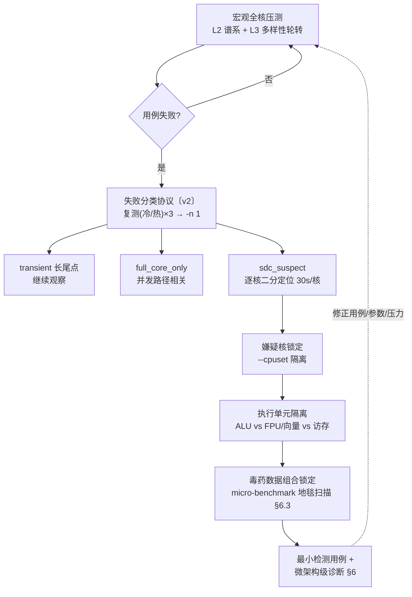
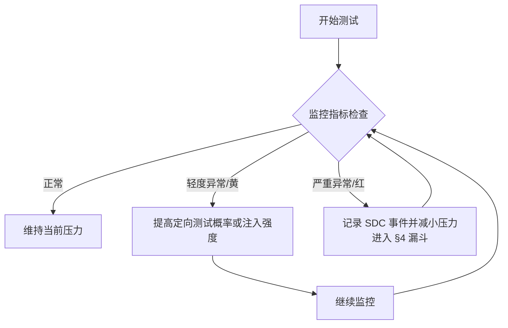

# SDC 激发-复现 7×24 方案（CPU 核心级静默数据损坏：分层监控 · 注入激发 · 动态控制 · 微架构诊断）· v4

> 版本：**v4 重构版**（2026-09-24）。按"激发-复现研究方案"框架重组：分层监控指标 / 采集架构与开销 / 注入策略 / 动态控制 / 统计评估 / 最小检测用例提取与微架构级诊断 / 可视化 / 实施路线 / 安全与可复现。
> 沿革：v3（同日）= ① 本机 TaiShan 2280 as-built v1 + ② 81 机 RCSIT TG225 B1 24h+ 设计 + ③ 通用 7×24 压测规范 三源合并（5W 结构）；v4 按研究方案要求重构框架并新增研究要素（PMU 事件菜单 / spurious canary / 统计置信 / 毒药数据猎捕 / 时序先兆 / 可视化与路线图）。
> 性质分标：无标注 = 两机实战已验证（as-built）；〔v2〕= 统一设计新增、尚未实施；〔通用〕= 机器无关方法学规范；〔研究〕= 研究路线，当前两机硬件/环境不具备落地条件（如位翻转注入、DVFS 直控、ML 控制器），如实标注不作虚称。
> 平台基线：aarch64 Kunpeng 920（本机 TaiShan 2280 = 128 核 / 81 机 TG225 B1 = 96 核），openEuler 24.03 LTS-SP4，sdcshield（OpenDCDiag 的 ARM64 移植）。x86-64 术语（RAPL/MCA/MACHINE_CLEARS 等）仅作跨架构参考，本平台等价物见对应小节。
> 用户决策（2026-09-24）：分层采集器架构 ｜ PMU 深度档（核+全 uncore @20s）｜ 两机同步落地 ｜ 本机磁盘先清理再部署。
> 配套：plan `docs/superpowers/plans/2026-09-23-2102312YVY10M6000038-sdc-7x24-stress-plan.md`（本机）｜ 81 机 `docs/superpowers/plans/2026-09-23-sdc-campaign.md` ｜ 画像 `docs/superpowers/inventory/<SN>-<日期>/` ｜ 结果 `docs/superpowers/output/…` ｜ 文献综合 `docs/paper/SDC_RESEARCH_SYNTHESIS_CN.md`

---

## 执行摘要

静默数据损坏（Silent Data Corruption, SDC）指硬件未报告错误、但输出结果已被篡改的情况，在大规模系统中已被证明对服务可靠性构成真实威胁：阿里百万级 CPU 32 个月患病率 3.61‱，Meta 数百万服务器 4 年内 0.035% 的机器终生发生 ≥1 次，且 **73.5% 的坏机器是已在服役的 CPU、有机器近 4 年后才首发**——一次 pass 不证明健康，只有持续测试能抓长尾。离线压测不可替代：ECC 对小时延故障（SDF）有系统性盲区（读错行仍是合法码字），在线 PMC 检测精度仅 ~90% 且特征不稳定。

本方案针对 **CPU 核心级 SDC**，围绕反馈控制环路组织，主要内容包括：

1. **分层监控指标**：按硬件（核心 PMU / uncore / 带内传感器 / 带外 BMC）、RAS 内核征兆、固件/BIOS、OS/内核、运行时/库、应用层分组，落到 TSV110 具体事件号与异常模式（§1）；
2. **采集架构**：采集代理、缓冲与存储、中间件（本地 CSV 直落为基线，Prometheus/SNMP 等为远端扩展）、分指标采样率与开销估计（目标 <5%）（§2）；
3. **注入/激发策略**：微架构应力、热激发、di/dt 阶跃、V/F 扰动（边界内替代）、位翻转与定时故障（研究路线），逐一关联目标 CPU 组件与失败模式（§3）；
4. **动态控制**：规则化阈值（黄/红警报）、反馈控制、机器学习方法三级演进，示例阈值与适应流程；粗到细漏斗——宏观压测→嫌疑核→执行单元→毒药数据（§4）；
5. **测试框架与统计方法**：代表性用例与工作负载、压力级别矩阵、时长与重复设计，用二项分布 + Clopper–Pearson 置信区间评估 SDC 发生率并反推样本量（§5）；
6. **最小检测用例提取与故障微架构级诊断**：完整记录 schema（seed/核位/位翻转掩码/环境快照）、毒药数据组合锁定、耗时分布尾部时序先兆、单元归因（§6）；
7. **数据分析与可视化**：时序图/柱状图/散点热力图/箱线图/控制图 + Mermaid 流程图（§7）；
8. **实施路线与可复现性**：里程碑、工具、工作量估计；故障注入环境隔离、配置与种子记录、golden 基准保证实验可重复（§8、§9）。

## 核心思路（反馈控制环路）

```
 激发与压测 (Stress & Excite)        数据采集 (Monitor)
   L0-L5 负载谱系                     带内 1Hz 级（perf/sysfs/proc）
   微架构应力（用例+knob）    ───▶    带外 BMC（温度/电压/功耗/SEL）
   边界内 V/di/dt 扰动                PMU（核+uncore）· RAS 全量
        ▲                                  │
        │                                  ▼
        │                            分析研判 (Analyze)
        │                              阈值/偏移引擎 · 统计置信
        │                              （Clopper-Pearson）
        │                              竞态假阳性鉴别
        │                                  │
        │                                  ▼
        └──── 修正用例/参数/压力 ────  动态控制 (Adjust)
                                          规则→反馈→漏斗降维
                                              │
                                              ▼
                              最小检测用例提取 & 故障微架构级诊断（§6）
                              核内 / 执行单元级 / 内存路径 / 一致性互联
```


漏斗降维（详细机制 §4）：

```
宏观全核压测（L2 谱系扫档 + L3 多样性轮转）
   └─ 失败分类协议：复测（冷/热两态）×3 → -n 1 → transient / full_core_only / sdc_suspect
        └─ 嫌疑核二分定位（--cpuset 逐核，30s/核封顶）
             └─ 执行单元隔离（ALU vs FPU/向量 vs 访存 vs 一致性）
                  └─ 毒药数据组合锁定（micro-benchmark 地毯扫描，§6.3）
                       └─ 最小检测用例 + 微架构级诊断结论（§6.5）
```

---

## 0. 基本信息（时间源、标识、被测对象）

**时间源四通道**（NTP 实测不可用——UDP/123 阻断，故双源时间戳：系统 + BMC）：

| 通道 | 用途 |
|---|---|
| `date +%s.%N` | 墙钟时间，台账/文件名主时间戳 |
| `/proc/uptime` | 单调时钟，跨休眠/调度延迟分析 |
| `cntvct_el0`（arch timer，100MHz） | 用例内联读取，指令级耗时关联（cycles 口径） |
| BMC 时间（`ipmitool sel time` 等） | 带外互证，防系统时钟漂移 |

**每次迭代必记录**：`test_id, seed, iter, cpu（逻辑核号）, socket/die/CCL（拓扑定位）, t_start, t_end`——完整 schema 扩展见 §6.2。

**被测对象两机画像**（部署参数化依据，完整画像在 `docs/superpowers/inventory/<SN>-<日期>/`）：

| 维度 | 本机 TaiShan 2280（SN 2102312…0038） | 81 机 RCSIT TG225 B1 |
|---|---|---|
| 核/拓扑 | 2×Kunpeng 920 = **128 核**，socket0=cpu0-63，4 NUMA | 2×Kunpeng 920 5250 = **96 核**，socket0=cpu0-47，2 NUMA |
| 内存 | 2×16GB DIMM（node1/3），NUMA0/2 无本地内存 | 1×32GB Hynix DDR4-2933（全在 node0），node1 跨 HCCS 访存 |
| 频率 | cppc_cpufreq + performance governor，**实测恒 2.6GHz**；`cpuinfo_cur_freq`（实测值）root 可读；无 `stats/time_in_state` | **平台固定 2.6GHz**（无 cpufreq、cpuinfo 无 MHz）——逐核频率不可观测 |
| PMU uncore | 16 DDRC + **32 L3C** + 8 HHA（`/sys/bus/event_source/devices/hisi_sccl*`） | 16 DDRC + **24 L3C** + 8 HHA |
| BMC | iBMC 6.70（151 传感器；in-band 唯一通道，管理网隔离实测；无 OEM 调压命令） | Hi1711 fw 3.11（132 传感器） |
| 独有模拟传感器 | Disks/HDD MAX/RAID/NIC1/PS2 温度、N_VDDAVS、HVCC、VDDQ Temp、VRD Temp | **CPU Power、MEM Power**、1711 Core Temp、SSD2 Temp、NIC OM Temp |
| 已知故障 | — | **FAN3 0rpm**、**SEL #0x84 每 ~8.5min 周期断言**（Slot/Connector）、Inlet na |
| rasdaemon | active（战役前已运行） | **inactive——部署时必须启用** |
| 内核/OS | openEuler 24.03 LTS-SP4（6.6.0-159.4.3.154，实测 `/etc/os-release`） | 同左（两机同版本，perf 6.6 同源） |
| ACPI RAS 面 | BERT/EINJ/ERST/HEST/SDEI/MPAM/PCCT | BERT/EINJ/ERST/HEST/SDEI/MPAM |
| 战役状态 | 7×24 运行中（2026-09-24 00:20 起，systemd） | 24h+ 战役已结束；watchers 仍为裸进程（无 systemd——统一改造对象） |

---

## 1. 监控指标（按层级分组）

优先级原则：**硬件性能计数器与硬件错误日志最关键**（SDC 往往起源于底层硬件故障）；SDC 具备**输入数据依赖性、偶发性、特定核心复现性**——持续监测"特定负载 × 特定核心"的性能指标变化比全局均值更重要。落地（源/节奏/文件/告警/取证）见 §2.2 的 12 维矩阵。

### 1.1 硬件层 · 核心级 PMU（TSV110 raw 事件；其他平台用 `perf stat -v` 反查事件号）

| 组 | 事件（TSV110 raw 码） | 指向的异常模式 |
|---|---|---|
| 吞吐/IPC | `cpu_cycles`(0x11)、`inst_retired`(0x08)、`inst_spec`(0x1b) | IPC 骤降/异常波动 = 时序边际收窄或流水线内部故障的第一代理 |
| 时序边际代理 | `exe_stall_cycle`(0x7001)、`stall_frontend`(0x23)、`stall_backend`(0x24) | 停顿计数骤增 = 流水线资源不足或内部故障（x86 的 MACHINE_CLEARS/UOPS_RETIRED 角色由停顿分解承担） |
| 访存停顿分解 | `mem_stall_anyload`(0x7004)、`mem_stall_l1miss`(0x7006)、`mem_stall_l2miss`(0x7007) | 访存路径停顿异常升高 |
| 缓存挤压 | `l1d_cache_refill_rd`(0x42)、`l2d_cache_refill_rd`(0x52)、`ll_cache_miss_rd`(0x37) | 某级缓存缺失率突升 = 缓存一致性/微架构缺陷风险信号 |
| TLB | `dtlb_walk`(0x34)、`l1d_tlb_refill_rd`(0x4c) | 地址转换异常（与 §1.5 spurious fault canary 互证） |
| 跨 socket | `remote_access`(0x31) | 跨 NUMA/互联流量异常 |
| 硬件内存错误 | `memory_error`(0x1a) | CPU 侧访存错误直接指示（最接近"内部错误计数器"的事件） |
| 分支 | `br_mis_pred`(0x10) | 分支单元故障 → 未命中率飙升或异常路径切换 |

约束与实现：每核 PMU 计数器 ≤6（armv8_pmuv3），上表 16 事件**分组轮换**（每组 ≤6 零多路复用）〔v2〕；as-built 首批 5 事件组 = cpu_cycles/inst_retired/br_mis_pred/l1d_cache_refill/l2d_cache_refill（本机 `/bin/true` 实测 304,655/129,627/1,319），本表为其扩容菜单。PMU 是**证据不是判据**（PinDrop：PMC 特征不稳定）——用于事件回溯归因，不用于在线判定 SDC。

### 1.2 硬件层 · Uncore（核间一致性干扰仪器，root，`perf -a` 设备限定）

| 设备（数量） | 事件（raw 码） | 指向 |
|---|---|---|
| L3C（本机 32 / 81 机 24） | `back_invalid`(0x29)、`retry_ring`(0x41)、`retry_cpu`(0x40)、`prefetch_drop`(0x42)；〔v2〕命中率组：rd/wr_cpipe·spipe + hit 变体 | 一致性回退/环网重试/CPU 侧重试/预取丢弃——**一致性缺陷的 uncore 侧证据链** |
| HHA（8） | `rx_outer`(0x01)、`rx_sccl`(0x02)、`tx_snp_num`(0x33)；〔v2〕rd/wr_ddr_64b/128b + sdir-hit/edir-hit | snoop 目录行为（外部/跨 SCCL 流量、snoop 数）、DDR 流量 |
| DDRC（16） | `flux_rd`(0x01)、`flux_wr`(0x00)、`rnk_chg`(0x06)、`rw_chg`(0x07)；〔v2〕act_cmd/pre_cmd/flux_rcmd/flux_wcmd | 读/写带宽 + rank/读写切换率（bank 冲突代理 = DRAM 侧压力指标） |

实测锚点：81 机 flux_rd 单周期 2,004,947,310 @100% 覆盖；每设备事件数 ≤ 计数器预算，超预算分组 10min 轮换，coverage 列保留可见（多路复用诚实呈现）〔v2〕。

### 1.3 硬件层 · 带内传感器（目标 1Hz；as-built 60s/热区 20s）

- **频率（双读）**：`policy*/scaling_cur_freq`（请求值，v1 之弊）+ `cpuinfo_cur_freq`（**实测值**，root）/ AMU 计数器；governor/min/max/boost → sysfs/cpupower。
- **频点驻留分布**：通用路径 `policy*/stats/time_in_state`——**本机 cppc 无此文件** → 自建 100MHz 桶采样直方图〔v2〕；81 机平台固定频率，该通道 declared-absent（列空 + capabilities 标注）。
- **温度**：`thermal_zone*/{temp,type,trip_point,policy}`、`hwmon*/temp*_label+input`——**注意 hisi_thermal 报 SoC max 聚合，非 per-core**；逐核温度为两机硬件边界（BMC 亦仅 per-socket Core Rem），不伪造。
- **功耗**：`hwmon*/power1_input`（若暴露）+ 带外 BMC 功耗组（§1.4）。本平台无 x86 RAPL，Package Power 由 BMC Power/CPU Power（81 机）承担。

### 1.4 硬件层 · 带外 BMC（iBMC，ipmitool；spec 目标 5s，as-built 60s/热区 20s）

传感器清单（发现式，启动解析全量 SDR → 列头自适应）：

| 组 | 传感器 |
|---|---|
| CPU 温度 | CPUN Core Rem（**per-socket 聚合**，非逐核） |
| 核电压 | CPUN VDDAVS、N_VDDAVS、VDDFIX、HVCC（逐核电压无传感器——硬件边界） |
| 内存电压 | VDDQ_AB/CD、VTT_AB/CD、VPP_AB/CD、1.8V、DDRVDD |
| 供电/内存温度 | CPUN VRD Temp、VDDQ Temp、MEM Temp |
| 热节流 | CPUN Prochot（离散态，进全量离散 diff） |
| 功耗 | Power（整机）、PSN POut/VIN/IIn/IOut；81 机独有 **CPU Power、MEM Power** |
| 风扇 | FANN Speed/Status/Presence + `cooling_device*/cur_state` |
| 环境 | Inlet/Outlet Temp、PSN Temp、Disks/HDD MAX/RAID/NIC Temp |
| 事件日志 | `ipmitool sel elist -v`（5min 增量 + 类型统计 + Critical 粘性 PAUSE） |

**采样节奏裁定**：spec 目标 5s；as-built 60s（热区 20s）+ SEL 5min。实测依据（BMC 限速教训）：密集探测（<3s 间隔）会把 root 监控的 ipmitool 采样打超时，2.5s 也不够。5s 节奏需先单独做限速试验验证不碰撞，默认执行 60/20s；BMC 单轮询共享（monitor 一次 `sdr list` 全量缓存 → 3 消费者：CSV 列/离散态 diff/偏移引擎）〔v2〕。全量离散态 diff（本机 106 个：PwrCap/PwrOk Drop/Host Loss/Watchdog2/CPU Status/DIMM×32/DISK×16/PCIE/PS Redundancy…）→ 转移即事件、断言（→非 0x00）即时告警（known_faults 白名单除外）〔v2〕。

### 1.5 RAS / 内核征兆（最关键、最廉价的旁路证据链）

- **spurious translation fault（per-cpu）**：bpftrace 挂 `do_translation_fault` 或 `dmesg -T | grep -c spurious` 增量 → **最廉价 SDC canary**，按核统计 + 设阈值〔v2 收编进 collector@ras；bpftrace 不可用时 dmesg 轮询兜底〕
- **EDAC CE/UE**：`/sys/devices/system/edac/mc/mc*/{ce,ue}_count`（含 per-csrow/dimm）、rasdaemon、`ras-mc-ctl --summary`；CE 频发与 SDC 概率上升关联（压力/环境指标）；注意 ECC 对小时延故障有系统性盲区——这是离线压测不可替代的核心论据
- **Oops/WARN/panic/MCE/SError/SDEI**：串口 + `dmesg -T` + kdump vmcore（`panic=30`、串口重定向、保留 vmcore）。aarch64 无 x86 MCA 寄存器——对应面为 APEI/GHES/BERT/HEST/EINJ/SDEI（存在性入 capabilities.env）；ARM64 RAS 事件经 rasdaemon（APEI/PCIe）+ EDAC 记录
- **稀有异常核聚集**：文献实证稀有异常（doublefault 等）在 SDC 机器上高 59× → 按核统计稀有异常计数（journal RAS 流已有，增加按核聚类统计）〔v2〕
- **RCU stall / softlockup / hungtask**：dmesg、`hung_task_*` 参数（与 hns3/rcu-stall 已知噪声源区分）

### 1.6 固件/BIOS 层

BIOS 自检 POST 日志错误、主板诊断日志、固件/微码版本记录、IPMI/SMBus 传感器告警（电压/电流/温度报警）。**该层无直接 SDC 指示**，但为综合诊断提供上下文：BMC/BIOS/FRU 版本入画像基线；固件/微码/BIOS 变更入事件台账（处置后回归的对照锚点，§6.6）。

### 1.7 OS / 内核层

每核 user/sys/idle/iowait/irq/softirq → `/proc/stat`（tick 增量归一）；每核中断数 → `/proc/interrupts`；系统负载/上下文切换/procs_running → `/proc/loadavg`、`ctxt`；内存 + 每 NUMA node → `/proc/meminfo`、`/sys/devices/system/node/*/meminfo`；进程/线程数、runqueue 抽样；oom_kill/pgmajfault 累计 → `/proc/vmstat`。SDC 发生时内核日志常记录页面错误/总线错误（crash 与 SDC 同源混发，§3.6）。

### 1.8 运行时 / 库层

- **sdcshield 检测用例结果**（golden 字节精确 memcmp，主判据 §5.1）；
- **用例执行延迟毛刺**：每用例在特定核心上的执行耗时、微秒级长尾延迟——§6.4 时序先兆的数据源；
- **线程↔核心绑定映射**：记录异常进程/线程当时被调度在哪个物理核/逻辑核（归因必需）；
- 运行时库自检日志、算法中间校验点（校验和）、MPI/OpenMP 等并行库错误返回码——分配频繁失败/自检不一致/并行崩溃提示 SDC 风险。

### 1.9 应用层

双算对比（同计算跑两次比对输出）、golden 基准比对（本方案主判据：全位宽整块 memcmp——SEVI 证明 exponent/符号位也会翻，DelayAVF ~50% 为多 bit，单位抽检会漏；框架 SNaN 统一静默保证跨架构位一致）、数值范围断言、未处理异常扫描。

### 1.10 异常模式汇总与指标优先级

**先兆观察清单**（任一出现即进入 §4 动态控制的定向流程）：

| 先兆 | 判读 |
|---|---|
| 某核停顿计数（§1.1 时序边际组）尖峰 | 流水线资源不足或内部故障，时序裕量收窄 |
| 某核缓存缺失率突升 | 缓存一致性/微架构缺陷风险 |
| `memory_error`(0x1a) 计数出现 | CPU 侧访存错误直接证据 |
| 同 seed 负载耗时分布尾部变宽（p99/p99.9/max） | small delay fault 先表现为时序裕量变窄，**尾部变宽往往早于算错**（§6.4） |
| spurious translation fault 按核聚集 | 最廉价 SDC canary |
| EDAC CE 增量 / 稀有异常核聚集 | 环境压力上升 / 文献 59× 关联 |
| 电压轨偏移 ≥0.01V / 频率低于额定 | 供电/节流显形 |

优先级（可获得性 × 关联性）：**硬件计数器与硬件错误日志 > RAS 内核征兆 > 带外传感器 > OS 聚合 > 应用一致性检查**。全部 12 维的源/节奏/落点/告警/取证映射见 §2.2。

---

## 2. 数据采集架构

### 2.1 分层设计（通用原理）

```
采集代理 Agents（内核/用户态守护）
  perf_event（PMU）· EDAC 驱动 · IPMI/lm-sensors · /proc、/sys 读取器 · sdcshield YAML 解析
        │
        ▼
缓冲与存储（本地优先，减小对被测系统影响）
  环形缓冲/内存队列 → 异步批量落盘；本地保留最近 N 秒/分钟
  本机实现：直落 CSV（隔离裸机、无远端依赖）+ 小时级 gzip
        │
        ▼
中间件与集中存储（可选远端扩展〔研究〕）
  时序数据库（Prometheus Pull / InfluxDB）· 日志聚合（ELK）· 传输（gRPC/消息队列，TLS 加密认证）
  IPMI/SMBus 数据经 BMC 直采；SNMP 可作为 BMC 数据的第二出口
```

**为什么全量遥测**（设计依据，as-built + v2 论点）：归因四向需要在场证据（§6.5），每一向都需要对应维度**在故障时刻前后有数据**；热联锁的眼睛（本板满核 3 分钟可推 CPU 至 105°C，三次 KILL 实录——监控失明=战役失明=硬件风险）；SOSP23 他核忙碌效应归因需对照"当时谁在跑什么"；PMU 是证据不是判据；81 机实战已证明 journal RAS 流/连续 EDAC/SEL 类型统计的价值。

### 2.2 as-built 实现：三进程族 + 双旁路〔v2 统一架构〕

```
 sdc-campaign.service (sdc)          sdc-monitor.service (root)            sdc-collector@.service (root 模板)〔v2〕
 ┌────────────────────────┐          ┌───────────────────────────┐        ┌─ @percore: percore.csv(逐核占用+实测频率)
 │ L0冒烟→L2谱系→L3多样性→  │  PAUSE/  │ 安全联锁(热95/90滞回+100   │        │            + 频点驻留直方图(100MHz桶)
 │ L5专项→L4深驻留(24h循环) │◀───────│  绝对线KILL/风扇/内存/磁盘/  │        ├─ @pmu:     pmu_core.csv(逐核事件组)
 │ stress-ng --verify 补充 │  标志   │  SEL Critical粘性)          │        │            pmu_uncore.csv(DDRC/L3C/HHA)
 │ 失败分类协议+假通过扣除  │          │ +唯一BMC轮询→3消费者共享    │        │            (perf -a 持久进程 @20s)
 │ +逐核二分定位〔v2〕      │          │ +SDR离散态diff→事件流〔v2〕  │        ├─ @ras:     ras_edac.csv + journal RAS流
 │ 事件取证→台账→subagent   │          │ +10min偏移引擎+SEL增量      │        │            + rasdaemon监护 + BERT启动dump
 └───────────┬────────────┘          │ +cmd/协议(governor/快照)    │        │            + spurious canary〔v2 收编〕
             │ state.json             │ +collector看门狗〔v2〕      │        └─ 各自 Restart=always；监控侧看门狗监护
             ▼                        └───────────┬───────────────┘
      systemd Restart=always                      ▼
                                   事件时: ±5min 全通道切片(环境/逐核/PMU/EDAC/离散态)
                                           + 失败核 120s 定向 PMU 深采(复测期并行)
 旁路: rasdaemon(全程) + kdump + EDAC + BMC SEL ── 事件互证
 人的节奏: 4h 巡检(自动) → fail 事件 → 分类协议 → subagent RCA → 主agent验证提交 → 用户决策点
```

| 组件 | 身份 | 职责 |
|---|---|---|
| `sdc-campaign.service` | sdc 用户，Restart=always | L0-L5 状态机、stress-ng 补充层、**失败分类协议〔v2〕**、事件取证、台账、断点 |
| `sdc-monitor.service` | root，独立重启 | **唯一 BMC 轮询**（3 消费者共享）、安全联锁、10min 快照+偏移、SEL 增量、governor 强制、root 取证代理、**collector 看门狗〔v2〕** |
| `sdc-collector@.service`〔v2〕 | root systemd 模板实例 | `@percore`（逐核占用+实测频率+驻留直方图）、`@pmu`（核+uncore PMU @20s）、`@ras`（EDAC/journal/rasdaemon/BERT/spurious canary） |
| `rasdaemon`（既有） | root 服务 | EDAC/APEI/PCIe 错误记录（旁路证据链；**81 机部署时启用**） |
| kdump（既有） | 预留 | 崩溃转储兜底（panic=30 + 串口 + vmcore 保留） |

systemd 工程化统一约定〔通用 + 实战细化〕：`Restart=always` + `RestartSec=10` + `StartLimitIntervalSec=0`（防反复崩溃后 systemd 不再拉起）；采集器为模板实例各自独立重启；适用时启用 watchdog（`WatchdogSec=` + 进程定期 notify）；输出按天命名日志或 journal（带 ident）；logrotate 按天+大小上限+压缩+保留窗口参数化，**事件证据目录单独保留、不被轮转删除**；所有脚本 smoke（约 10 分钟）/full（7×24）两档；断点恢复（`state.json` 记录阶段/周期进度，重启后从断点续跑，冷机首轮恢复时自动补做）。

**12 维遥测落地矩阵**（§1 全部指标的源/节奏/文件/告警/取证映射，两机已实证）：

| # | 维度 | 源 | 粒度/节奏 | 落点 | 告警/联锁 | 事件取证 |
|---|---|---|---|---|---|---|
| 1 | 逐核占用率 | /proc/stat per-cpu tick 增量 | 每核 @60s（热区 20s） | percore.csv | —（固有波动不比） | ±5min 切片+失败核画像 |
| 2 | 内存占用率 | /proc/meminfo + node\*/meminfo + /proc/vmstat（oom_kill/pgmajfault） | 系统+NUMA @60s | monitor.csv v3 | oom_kill 增量即时告警；水位既有 | 切片 |
| 3 | PMU 核 | armv8_pmuv3（§1.1 事件菜单，perf `-a --per-core`，root）分组轮换 | 每核 @20s | pmu_core.csv（宽表） | — | 失败核 120s 定向深采+切片 |
| 4 | PMU uncore | hisi DDRC/L3C/HHA（§1.2 事件菜单，perf `-a`，root）分组轮换 | 每设备 @20s | pmu_uncore.csv（宽表） | — | 内存路径归因证据链 |
| 5 | 逐核温度 | **硬件边界：无逐核传感器** → per-socket Core Rem + 全部温度传感器 | 每 sensor @60/20s | monitor.csv v3 | 热联锁（§4.6） | 既有+离散态 |
| 6 | 逐核电压 | **硬件边界：无逐核传感器** → 全轨（§1.4 电压组，轨集按板发现式） | 每轨 @60/20s | monitor.csv v3 | 偏移 ±0.01V | 既有 |
| 7 | 逐核频率 | cpuinfo_cur_freq（实测值，root）；81 机平台固定（列空+标注） | 每核 @60/20s | percore.csv | min<2.6GHz 节流显形 | 切片 |
| 8 | 频点驻留分布 | 自建采样直方图（cppc 无 time_in_state）：100MHz 桶累计 | 10min 快照+日累计 | freq_residency.log | 分布突变标记 | 驻留 delta |
| 9 | RAS 全量 | EDAC sysfs（含 per-DIMM）@60s + rasdaemon + journal RAS 关键字流 @60s（error/fail/ras/edac/mce/hwpoison/throttle/thermal/panic/oops/segfault/page fault/guard page/hardware，排除 hns3/rcu-stall 噪声）+ spurious canary〔v2〕+ BERT 启动 dump + HEST/EINJ/ERST/SDEI 存在性入 capabilities | 连续 | ras_edac.csv + journal_watch.log | **UE>0 即时告警+开事件目录+台账行**；CE 增量告警；rasdaemon 掉线告警 | 主动旁路互证 |
| 10 | SEL | 增量捕获（基线持久化跨重启/风暴≥20 条/5min 告警/Critical 粘性 PAUSE）+ 类型统计 | 5min | sel_events/ + 台账 | 既有 | 既有 |
| 11 | 功耗/风扇/电流 | SDR 全部模拟量（§1.4 功耗/风扇组）+ DCMI | 每 sensor @60/20s | monitor.csv v3 | 风扇 0rpm×3 采样 PAUSE（known_faults 白名单除外） | 既有 |
| 12 | PROCHOT+全部离散态 | 全量 SDR 离散传感器状态 diff（本机 106 个实测） | 每周期 diff | discrete_events.log | 断言（→非 0x00）即时告警（known_faults 除外） | 转移事件即证据 |

采集器机制〔v2〕：BMC 单轮询共享（60/20s 一次 `sdr list` 全量缓存 → monitor.csv 列 / 离散态 diff / 偏移引擎三消费者，访问频率与 v1 一致——限速教训）；monitor.csv v3 列集**发现式生成**（已知传感器缺失列保留输出空——诚实呈现"传感器在但无读数"）；percore = /proc/stat 增量 + cpuinfo_cur_freq + 100MHz 桶累计；PMU = 两个持久 `perf stat -x, -a` 进程（--per-core 核表 / 设备限定 uncore 表）@20s，输出轻量 pivot 成宽表，事件预算内分组轮换，进程死亡 systemd 自愈；RAS = EDAC 计数 + journal 流 + rasdaemon 活性监护（10min is-active）+ BERT dump + spurious canary。

### 2.3 数据模型与磁盘预算〔v2〕

```
monitor/monitor.csv        v3：全部模拟传感器（发现式 ~60 列）+ OS 聚合 + EDAC + vmstat    ~0.5MB/天
monitor/percore.csv        ts + 128×util% + 128×freq_kHz（257 列）                        ~4-10MB/天
monitor/pmu_core.csv       每 interval 一行 × 641 列（ts + 128核×5事件）@20s              ~22MB/天
monitor/pmu_uncore.csv     每 interval 一行 × 449 列（ts + 448 设备×事件值，81 机 385）@20s    ~17MB/天
monitor/ras_edac.csv       ts + mc ce/ue/ce_noinfo + per-DIMM（发现式）@60s               <0.5MB/天
monitor/journal_watch.log  RAS 关键字流 + spurious canary 计数                              小
monitor/discrete_events.log 全量离散态转移事件                                              小
monitor/freq_residency.log 10min 每核驻留直方图（100MHz 桶）+ 日累计                        小
monitor/sel_events/        SEL 增量 + 类型统计
monitor/condition_10m.log  全量工况快照（含偏移段）
logs/YYYYMMDD/*.yaml|.out  sdcshield 输出（每日 gzip）
events/<时间戳>-<label>-rc<N>/  事件目录（提取式取证 + classification.txt + bisect/ + 切片 + PMU 深采）
events/ledger.csv / stressng/  台账 / 补充层
合计 raw ~50MB/天 → 小时级 gzip 后 ~6-8MB/天；保留窗口参数化（默认 14 天 gz）
```

磁盘联锁：85% 告警 / 95% 停新日志；本机当前 88% → **部署深度档前先清理至 <85%**（用户决策）；81 机磁盘充裕无此问题。

### 2.4 采样频率（分指标裁定）

| 指标类 | 频率 | 依据 |
|---|---|---|
| 硬件性能计数器 | **计数模式持续累积，20s 读出**（PMU collector） | perf 计数模式开销可忽略（§2.5）；不使用采样模式 |
| 温度/电压/功耗/风扇 | 常态 60s、热区（≥88°C）20s | spec 建议 1–10s；BMC 处理能力受限（限速教训，§1.4） |
| SEL | 5min 增量 | BMC 限速 |
| OS 聚合 / EDAC / journal 流 / spurious | 60s | 廉价，/proc 与 sysfs 直读 |
| 逐核占用/频率 | 60s（热区 20s） | percore.csv |
| 频点驻留 | 每采样入桶 + 10min 快照 | cppc 无 time_in_state 的替代 |
| 应用一致性（用例结果） | 每用例结束 + 事件触发 | sdcshield YAML |
| 全量工况快照 + 偏移引擎 | 10min | 含驻留/PMU/逐核极值比较 |

### 2.5 开销估计

- **perf 计数模式 vs 采样模式**：文献与实测一致——计数模式对系统性能影响微乎其微；采样模式随事件数与频率显著增长（研究实测：48 并发进程监听 16 事件，采样模式平均开销达几十百分点）。**本方案裁定全部走计数模式**：持久 `perf stat -x, -a` 进程 @20s 读出，核事件组 ≤6 计数器零多路复用，uncore 每设备超预算分组 10min 轮换（coverage 列可见）。
- **总开销目标 <5%**：PMU/采集器上线前实测校验（验收项：collector 手跑 3 周期输出实查 + perf coverage 100% 实查 + 对比空载基线的 IPC 偏移）。
- **时间同步**：NTP 不可用（UDP/123 阻断实测）→ 双源时间戳（系统 + BMC，§0）；所有采集行带同源 ts。

---

## 3. SDC 注入 / 激发策略

### 3.1 理论依据（文献 → 手段映射，31 篇文献综合见 `docs/paper/SDC_RESEARCH_SYNTHESIS_CN.md`）

| 文献结论 | 战役落点 |
|---|---|
| 向量 FP 乘加单元是第一大源（>92% 事故为 FMA；vector ≫ scalar） | GEMM×4 家族 + SLEEF + fma* + acl_gemm 为 L4 驻留主力 |
| 缺陷两分类：一致性型（cache 一致性/原子/内存序）**只能多线程检出** | mesh/cachebounce/lock*/atomic*/memcpy 与计算型**混编同跑全核** |
| SDC 频率随温度 log-线性增长、存在最低触发温度 | 满核热浪（本板实测可至 105°C 带）+ 冷机窗口对照 + 85-90°C 带定向热激发 |
| 边际缺陷对 V/F/输入组合敏感 | 满载电压跌落实测 -0.02V 被监控捕获；di/dt 负载阶跃；seed 逐片轮换。**V/F 直接扫描两机均不可用**（本机 cppc 恒 performance、81 机平台固定 2.6GHz）→ 以并发档（不同电流拉载/droop）+ 全核自升温补偿（81 机六杠杆之"电气代理"） |
| execution-context 敏感（一条 no-op 改变触发率） | **全部 PROD 用例轮转**而非精选套件；每日随机序破顺序依赖 |
| 工作集谱系区分缺陷部位（核/缓存/互联/内存） | mdim 64→2048、nelems 3 档、ipsec datasize 3 档、memcpy 三策略 |
| 检测三多样性〔通用〕：时间多样性（同操作重复比对）× 拓扑多样性（同一计算在不同核执行交叉比对）× 实现多样性（不同实现交叉验证），外加可逆变换往返 | TEST_LOOP 重复比对=时间维（框架内建）；逐核/逐簇/逐域隔离台账（L5-⑤）=拓扑维；stress-ng --verify + 多库同操作（OpenBLAS/ACL GEMM）=实现维；openssl_sha/ipsec*/isal_igzip/zstd* 为天然往返用例 |
| seed 双档（fracturing 轮换 vs 固定轨迹） | 广域扫 fracturing 自动轮换 + 驻留档 `--max-test-loop-count=0` 固定 seed |
| SDC 与崩溃可同源混发（同一缺陷时而 SDC、时而 crash/abort） | 失败信号双通道把 crash 与 fail 同一取证管线（§3.6 + §6.6） |

### 3.2 激发杠杆总览（可用性诚实表）

| 杠杆 | 目标组件 | 失败模式 | 本机可用性 |
|---|---|---|---|
| 微架构应力（负载侧） | 全部执行单元 / 缓存 / 互联 / 内存 | 数据破坏 / 重试 / 一致性失效 | ✅ **主路径**（L0-L5，§3.3） |
| 热激发（自升温） | 时序边际 | 时序违例 / 多比特 | ✅ 满核热浪 105°C 带实测；85-90°C 定向带 |
| di/dt 阶跃（负载侧） | 电源完整性 | 电压跌落 → 瞬态错误 | ✅ 空载 30s+满载突发×6；-0.02V droop 已被捕获 |
| 并发档（电流拉载谱） | 电源完整性 | droop 梯度 | ✅ `-n` 档位 × 工作集组合 |
| V/F 直控（欠压/超频/Vmin 猎捕/DVFS 调制） | 时序边际 | 时序违例 | ❌ **两机不可用**：本机 cppc 恒 performance、无 OEM 调压命令（in-band OEM 命令空间已全量探测，最像调压的 0x30 0x91-0x98 簇被固件 0xD6 封印）；81 机平台固定 2.6GHz。另有安全红线：降压/超频默认不做（无书面授权）。**替代 = 上行三杠杆组合** |
| 位翻转注入（JTAG/CPU 调试单元） | 任意指定位 | 指定位翻转 | ❌ 本机无调试接口访问 → 研究路线（§3.5） |
| 定时故障注入（FPGA/仿真平台） | 时序 | 挂起 / 重试 | ❌ 研究路线（§3.5，gem5 SE 已有脚本基础） |

### 3.3 微架构应力注入（as-built 主路径 = L0-L5，全部由画像参数推导，零硬编码）

| 层 | 内容 | 激发维度 |
|---|---|---|
| L0 冒烟 | list-tests 核对 + zstd19 + 每域代表；每次变更后必跑〔通用〕（修复热替换/配置变更/新板入役） | 工具链健康 |
| L1 冷机首轮 | 45 用例代表集 30min；新板入役首轮扩展为逐检测域单组件基线（每域 60–120s 全核，约 2–4h）〔通用〕，此后退化为每日冷机锚定 | 冷态对照基线 |
| L2 谱系扫档 | GEMM mdim 64/256/512/1024(+2048@n64) ×4 变体、transab 0-3+β、SLEEF nelems 3 档、FFT n 4 值、igzip level 0-3、crypto/LU、ipsec datasize 1K/64K/16M、memcpy 三策略 | **工作集谱系 L1→L2→LLC→DRAM→跨 NUMA**（归因维度） |
| L3 多样性轮转 | 全部 PROD 用例 `-T 6h -t 60s --strict-runtime` 固定序 + 2h 随机序 + eigen `-n 1` | **负载多样性**（context 敏感性）+ 全核耦合热 |
| L5 专项轮换 | ① di/dt：空载 30s+满载突发×6（纯负载阶跃，governor 恒 performance）② 热激发：预热至 85-90°C 带再跑目标 ③ 跨 NUMA+大 mdim ④ 逐 NUMA 域隔离（sysfs cpulist 逗号集）⑤ **逐簇/逐核健康台账**〔通用〕：`--cpuset` 逐簇（CCX/域内逐核）各 30–60min 高检出套件（示例：`openblas_{d,s,z}gemm,sleef_neon,pocketfft_fft,isal_igzip,zstd19,openssl_sha,fma*,cachebounce,lock*,atomic_simd_*,memcpy_rewr`，按本机 `--list-tests` 裁剪）；128 核全逐核需 64h+，常规取簇粒度，逐核粒度留给事件定位（§4.4） | **温度角落 / 供电瞬态 / 拓扑隔离 / 逐核健康基线** |
| L4 深驻留 | 事件测试优先，否则五默认对象 ×2h，`--max-test-loop-count=0` | **单模式统计深度**（长尾） |
| 补充层 | stress-ng --verify 小时轮转（matrix/fma/vecfp/qsort/radixsort…）于保留核 | 交叉实现检测 |

具体应力手段与运行期参数：对齐/缓存行冲突、分支深度、浮点密集（sdcshield 用例 + `-O` knob 矩阵尺寸/转置形态/β/FFT 点数/压缩级别/密码载荷——完整速查见附录 B）；`memcpy_rewr` 三策略（`SANDSTONE_STRATEGY_INDEX=0..2`：跨 NUMA / 同 die L3 对打 / 少生产者多消费者目录失效风暴）。压力测试本身不直接翻转位，但等价于饱和执行单元的数据流序列，**加速缺陷暴露频率**。

### 3.4 V/F 扰动注入（边界与替代）

研究路线原文（实验室电源欠压 UVLO 模拟 / BIOS/OS 层 DVFS 极限频率或频繁切换 / ipmitool 降压测 Vmin / 拉高频率 Overclock）主要影响电源完整性与时序裕量，可能导致多比特故障或时序违例——**本机均不可执行**（§3.2 表），且属安全红线（无书面授权不做降压超频；禁止拆除温度保护或关闭节流）。边界内替代已全部落入 L5：热边缘定向（预热至 85-90°C 带，距 Tjmax 留 10–15°C 裕度）、负载侧 di/dt 阶跃、并发档电流拉载、高密度 NEON 指令波（SVE 两机无硬件）。**覆盖弱于可调频板，如实声明**（§9.4-5）。

### 3.5 位翻转与定时故障注入〔研究〕

目的：**标定检测用例敏感性**（注入已知故障 → 检出率度量），而非在本机复现真实 SDC。路径：QEMU 故障注入 / gem5 SE 模式（仓库已有 `scripts/eigen-sve-double/gem5/` 基础）/ FPGA 注入卡（可选）。可复现注入（CPU 调试单元）为文献黄金标准，本机无调试接口访问，作为方法学参照记录。产出预期：每检测用例的故障检出率矩阵 → 反哺 §5.4 有效覆盖核算。

### 3.6 注入结果分类（四分类）

| 分类 | 定义 | 处置 |
|---|---|---|
| 正常 | 无错误，结果与 golden 一致 | 统计样本（n+1） |
| 无害失败 | 崩溃/异常退出但错误被检测机制捕获 | 按事件取证（检测机制工作正常的证据） |
| **SDC** | 输出错而未报（golden memcmp 失败） | 进入 §4 漏斗 + §6 诊断 |
| 崩溃/挂起 | crash/abort/timeout | **与 SDC 同源混发**，同等取证（§6.6） |

记录维度：哪些注入导致 SDC、哪些导致崩溃、故障被检测与否（异常退出/硬件告警）。失败信号双通道：YAML `result: fail|crash` **或** 进程 rc≠0（124/137/143 且无失败行 = 阶段边界 artifact，非事件——实测 TERM 对 sdcshield 60s+ 无响应，需此判别）。

---

## 4. 动态控制（基于监控数据实时调整检测用例）

### 4.1 控制总览：漏斗降维

sdcshield 检测用例由控制引擎按监控反馈动态调度，像漏斗一样层层逼近：



### 4.2 策略 A：基于数据依赖性的用例动态变异

- **触发条件**：监控到某个核心 sdcshield 用例失败且分类定案 `sdc_suspect`。
- **动态调整**：业界研究表明 SDC 高度依赖特定操作数输入（只在计算特定的极大值/极小值或特定比特位翻转时才算错）。控制引擎**停止宏观压测**，生成针对性 micro-benchmark。
- **改变 Data Pattern**：向该核心注入随机+结构化（边界规格值/位模式）指令数据流，地毯式扫描直到锁定触发 SDC 的"**毒药数据组合**"（方法论 §6.3）。全程固定 seed 记录，保证可重放。

### 4.3 策略 B：温度与电压（DVFS）边缘激发

- **触发条件**：监控发现某核 PMU 异常波动（停顿/缺失率尖峰）、电压/频率异常、或轻微长尾延迟（§6.4），但 sdcshield 用例**尚未报错**。
- **动态调整（理想路径）**：DVFS 调制（降压测 Vmin / 拉高频率）、高密度 NEON 指令波制造 di/dt 攻击与局部电压突降，把老化/边际缺陷的隐性时序问题转化为显性 SDC。
- **本机边界内实现**：热边缘定向（满核预热至 85-90°C 带后对目标核跑定向用例）+ 负载侧 di/dt 阶跃（空载↔满载快速切换）+ 并发档电流拉载梯度（§3.4）。DVFS 直控不可用，如实标注。

### 4.4 粗到细隔离（Node → Core → 执行单元）

1. **Node 到 Core**：任务降级，`--cpuset`（taskset/cgroup 语义）把隔离用例逐核绑定运行，找出嫌疑核（Suspect Core）。**实测注意**：`pN` 拓扑语法在本板因 PPTT 伪影失效 → 用 sysfs cpulist 逗号集。
2. **Core 到 ALU/FPU**：锁定核心后动态调整指令集组合——交替运行纯整数运算（ALU 测试）与浮点/向量运算（FPU/NEON 测试）。
3. **判定**：整数全对、浮点报错 → SDC 局限在 FPU/向量单元 → 缺陷类型与最小检测用例明确（§6.5）。

as-built 对齐：失败分类协议〔v2〕= 本漏斗 Node→Core 级的工程实现（复测×3 冷/热两态 → `-n 1` → sdc_suspect 逐核二分 30s/核封顶，总时长封顶=核数×30s）；§6.3–6.5 补齐 Core→Unit→Data 级〔研究/v2 扩展〕。

### 4.5 控制算法（三级演进）

- **规则型控制（as-built 已用）**：预设阈值联锁（§4.6）+ 偏移引擎（10min 快照比较：电压 ≥0.01V、频率任何变化、温度 ≥3°C、风扇 ≥300rpm、功耗 ≥40W、内存/swap ≥1GB、磁盘 ≥1pct、Prochot 断言、SEL 任何新增；〔v2〕新增：逐核频率极值偏离、驻留分布突变（新桶出现/占比漂移 >10pct）、PMU 异形标记（IPC 低于全核 P5 一半的核数变化）、EDAC CE 增量、oom_kill 增量、离散态非基线条目数、per-NUMA 内存突变）。**黄/红警报分级**：黄 = 部分指标超标（如停顿计数较该核正常值高 10%）→ 提高该核定向测试概率/注入强度；红 = 严重异常（ECC 频发、应用连续出错）→ 立即停当前测试、切换低压状态记录。
- **反馈控制〔研究〕**：借鉴控制理论，对注入强度闭环调节——SDC 发现率为反馈信号 vs 目标故障率，PID/模糊控制调整注入参数（注入速率/温度带/di/dt 频度），以平均停顿数/温度为观测量，避免过度破坏系统。
- **机器学习驱动〔研究〕**：收集正常/故障条件下硬件事件分布，训练异常检测模型（one-class SVM/孤立森林）实时识别高风险模式 → 触发紧急测试或提高冗余级别；强化学习可在试探性注入中学习最易触发 SDC 的条件。**约束**：文献指出 PMC 用于故障检测有潜力但特征不稳定（PinDrop）——ML 输出只作为"定向触发器"，不作为 SDC 判定。



### 4.6 安全联锁（动态控制不可越过的红线，root 监控执行）

| 触发 | 动作 | 恢复 |
|---|---|---|
| CPU ≥95°C（滞回） | PAUSE + 热计数 | ≤90°C 自愈 |
| 连续 2 热采样 或 ≥100°C | KILL 全部 sdcshield+stress-ng | 驱动下一调用自然等待 |
| FAN 异常 ×3 采样 | PAUSE | 读数恢复自愈 |
| MemAvailable <2GB | PAUSE（防 OOM） | >4GB 自愈 |
| **EDAC UE >0〔v2〕** | 即时告警 + ras 事件目录 + 台账行（**不自动 PAUSE——用户决策点**） | 人工 |
| SEL Critical 断言 | 粘性 PAUSE（需人工 rm） | 人工 |
| 磁盘 ≥95% | PAUSE 停新日志 | 人工 |
| governor 非 performance 请求 | 拒绝 + 告警 | — |
| collector 进程死亡〔v2〕 | systemd 自愈 + 监控看门狗告警（连续 3 周期缺失） | 自愈 |

被 KILL 的调用：rc∈{124,137,143} 且无 fail/crash 行 → 阶段边界 artifact，不产生伪事件。〔通用〕温度联锁一般式 = "任一核温 ≥ Tjmax−10°C（或用户指定值）自动退载，回落安全区恢复"——上表即其按本板 ACPI trip 的参数化实例。**禁止为了"压出问题"而拆除温度保护或关闭节流。**

---

## 5. 测试框架与实验计划

### 5.1 测试用例选择与工作负载混合

- **主力 = sdcshield 全部 PROD 用例（aarch64 约 280+）轮转**，覆盖：计算密集（GEMM×4 / FFT / SLEEF / LU / acl_gemm）、内存密集（memcpy 三策略 / 大 mdim / cachebounce / mesh）、IO 路径（igzip / zstd* / CRC）、密码（openssl_sha / ipsec*）、一致性（lock* / atomic_simd_*）。运行期参数 knob 矩阵见附录 B。
- **每类用例准备不同输入数据集**（seed 谱系 + 操作数模式）以发现数据依赖 SDC（§4.2/§6.3）。
- **交叉实现补充层**：stress-ng `--verifiable` 系（matrix/fma/vecfp/qsort/radixsort 等）小时轮转于保留核。
- **基线对照**：空闲/低负载状态 + 每日冷机首轮（L1 锚定）。
- **混合负载**：计算密集与一致性用例**混编同跑全核**（并发交互效应是一致性缺陷的唯一暴露窗口）；数据库事务/文件操作类不在 sdcshield 用例集，以压缩/CRC 类 IO 路径用例近似，可后续扩展。
- ULP 敏感用例（eigen_svd_double/eigen_sparse）全核多线程有已知良性抖动 → 白名单 + `-n 1` 单独补跑。

### 5.2 压力级别矩阵与排班

因素矩阵（从正常运行渐进到极端，识别触发阈值）：激发强度（稀疏/常规/密集）、核心数（`-n` 档：1/8/32/64/全核）、工作集谱系（mdim/nelems/datasize 档）、温度带（冷机/85-90°C/满核热浪）、时序（固定序/随机序/深驻留）、di/dt 模式（稳态/阶跃）。超线程因素本平台不适用（Kunpeng 920 无 SMT）；DVFS 档位以并发档替代（§3.4）。24h 大周期排班（周期循环、周期之间不断电不重置）：

| 周期 | 动作 |
|---|---|
| 20s（热区 ≥88°C） | 环境快采样；连续 2 热采样 ≥95°C 或任一 ≥100°C → KILL 全部负载。PMU 固定 20s 与热区无关（证据通道不随联锁变速） |
| 60s（常态） | CSV 采样一行（环境+EDAC+journal 流）；percore 同步 |
| 5min | SEL 增量检查（风暴告警/Critical 粘性暂停） |
| 10min | 全量工况快照 + 偏移标记 + 驻留直方图快照〔v2〕 + PMU/离散态/逐核极值进快照〔v2〕 |
| 每小时 | 磁盘水位告警（≥85%）+ PMU/percore 原始文件 gzip 轮转〔v2〕 |
| 每 4h | 自动巡检（状态/台账/告警/温度，fail→分类协议→subagent RCA） |
| 每日 | 07:30 周期边界：日汇总（含有效覆盖核算〔v2〕）+ 昨日 YAML gzip；08:00 冷机首轮锚定 |
| 24h 周期 | 冷机(30m)→L2(~4.5h)→L3(6h+2h+5m)→L5(90m)→L4(动态填充至次日 07:30) |
| 事件即时 | 取证 → 分类协议（复测→n1→逐核二分）→ ±5min 全通道切片 + 120s 定向 PMU 深采 → 台账 → subagent RCA |
| ≥168h | 中期结论（未检出≠无缺陷 + 覆盖维度清单 + §5.4 置信度）+ 周期复测五层建议：L0 常开日志监视 / L1 每日快扫 / L2 每周加权 soak / L3 每月全量扫 / L4 每季度完整战役 |

### 5.3 测试时长与重复

每个测试组合重复多次以获取统计样本；战役总时长**至少连续 7×24h（168h）起步**，可延长；深驻留（`--max-test-loop-count=0` 固定 seed）×2h/对象 做单模式统计深度；文献长尾 42h+ → 持续运行（一次 pass 不证明健康，坏机器 73.5% 已在服役）。样本量是否足够的判据由 §5.4 统计框架给出，而非固定时长。

### 5.4 统计方法（SDC 发生率估计与样本量设计）

SDC 视为随机事件，用**二项分布**（或低发生率下泊松近似）建模：

- 点估计：n 次等效试验观测 k 次 SDC → `p̂ = k/n`；置信区间用 **Clopper–Pearson** 精确法（`scipy.stats.beta.ppf`）。
- 零事件上界（rule of three）：k=0 时 95% 置信 `p < 3/n`。**样本量反推**：要证明 p < 10⁻⁴（@95% 置信）需 n ≥ 3×10⁴ 次等效试验；要证明 p < 10⁻⁵ 需 n ≥ 3×10⁵。等效试验定义 = 每用例 × 每 seed × 每迭代（框架 YAML 记录迭代数，日汇总累计）→ 直接换算"累计无 SDC 运行小时数"的置信声明。
- 报告纪律：**"未检出"必须附运行时长 + 等效试验数 n + 置信上界**，不得夸大为"无 SDC"；分组（按用例/核心/档位）报告时每组单独给区间。
- 有效覆盖核算〔v2〕：n 的分母必须扣除无检出意义的装饰性用例（81 机审计 22 例：fma 容差过宽 / vmx×9 恒真 / crc 同源 golden ×13——vmx x86-only 不迁移，fma/crc 需 ARM64 重审计）。
- 竞态假阳性鉴别（防 k 虚高，as-built 事件 #1 实战验证）：部分和指纹（expected_sum == 部分重填块之和）+ ttf 窗口（线程孵化偏斜区间）+ 结构参数标度（-n 2 免疫 / 高并发失败率 20-45×）→ subagent RCA 标准检查单。

### 5.5 记录指标

测试过程记录 §1 全部指标 + 每次注入/激发的事件参数（注入时刻、注入类型、目标位置/核位、压力档）+ 测试结果四分类（§3.6）。完整 schema 见 §6.2；台账落 `events/ledger.csv`。

---

## 6. 最小检测用例提取与故障微架构级诊断

### 6.1 触发条件

- 任一确认 SDC 事件：失败分类协议定案 `sdc_suspect` 且复测可复现（冷/热两态）；
- 或策略 B 先兆持续：某核长尾延迟变宽 / PMU 异形 / spurious canary 聚集，但用例尚未报错（此时提取"先兆最小复现负载"用于边缘激发）。

### 6.2 记录 schema（事件 / 迭代台账）

每次迭代（尤其失败迭代）记录：

```
test_id · 负载类型 · 指令宽度 · cpu/socket/die/CCL · seed · iter ·
t_start/t_end · 耗时 cycles · PASS/FAIL ·
失败字节偏移 · lane 索引 · 坏值 O vs 真值 T · 位翻转掩码 ·
当时温度/频率/电压快照（±5min 全通道切片）
```

as-built 对齐：事件目录 `events/<时间戳>-<label>-rc<N>/` 已含 yaml_extract（提取式取证，不复制 GB 级原件）、stdout_summary、context、classification.txt、bisect/；〔v2〕扩展全通道 ±5min 切片 + 失败核 120s 定向 PMU 深采。位翻转掩码 = O XOR T 逐字节（位图进台账，用于 §6.5 单元归因与跨事件聚类）。

### 6.3 毒药数据组合锁定（最小检测用例提取）

嫌疑核 + 执行单元锁定后：

1. 构造 micro-benchmark（保持目标指令序列，仅变异操作数）；
2. 数据模式谱系扫描：IEEE 边界值（±Inf/NaN/次正规/最大最小规格数）、位翻转模式（单 bit 游走/字节镜像）、随机（固定 seed 可重放）；
3. 每模式重复执行 → 命中率按数据模式聚类；
4. **删除法最小化**：从命中模式逐步删减输入维度，收敛到最小触发输入集 = **最小检测用例**（后续回归验证与处置验证的标准触发器，§6.6）。

### 6.4 时序先兆：耗时分布尾部

同 seed 同负载重复执行的耗时分布尾部（**p99/p99.9/max、cycles 抖动**）——small delay fault 先表现为时序裕量变窄，**尾部变宽往往早于算错**。实现：用例耗时统计进日汇总〔v2〕；percore 驻留直方图 + 偏移引擎"逐核频率极值偏离"已有；本项扩展 = 按 (test_id, seed) 维护耗时基线分布，尾部越界即触发策略 B 边缘激发（§4.3）。

### 6.5 单元归因（微架构级诊断结论）

| 证据 | 归因 |
|---|---|
| 缓存驻留档（mdim=64/256、nelems 小足迹）重放仍错 | **核内缺陷** |
| 整数用例全对、浮点/向量用例错 | **FPU/向量单元** |
| 仅大足迹/DRAM 档错 + PMU uncore 异常（DDRC 命令率/L3C retry） | **内存路径**（结合内存基线 stress-ng --vm --verify 与 EDAC 事件） |
| 仅多核对打时错（-n 1 免疫） | **缓存一致性/互联** |
| 证据不足 | **待判定**（不得下结论） |

位翻转掩码聚类辅助单元定位（如仅 mantissa 位翻转 → 乘加尾数路径；exponent/符号位 → SEVI 证明也会翻，全位宽比对必要）。产出：微架构级诊断报告（缺陷单元 + 触发条件 + 最小检测用例 + 归因证据链）。

### 6.6 事件取证流水线（as-built 对齐，普查模式不中断战役）

1. 驱动即时取证：`events/<时间戳>-<label>-rc<N>/`：`yaml_extract`（头部+50 处失败上下文切片）、`stdout_summary`、`context`
2. **分类协议〔v2〕**（§4.4）：复测×3（冷/热两态）→ n1 → sdc_suspect 逐核二分（30s/核封顶），产物 `classification.txt` + `bisect/`
3. **全通道切片〔v2〕**：±5min 窗口覆盖 monitor.csv/percore/pmu_core/pmu_uncore/ras_edac/journal/discrete_events
4. `snapshot.request` → root 代理 60s 内补 BMC/SEL/dmesg/DCMI 快照〔v2 增：失败核 120s 定向 `perf stat -C` 深采，与复测并行〕
5. 台账一行 → subagent 根因研究（源码级，含竞态三探针检查单）→ 稳定复现（≤8 线程/冷 socket/≤5min/禁全核）或实验矩阵
6. 处置（用户决策）：隔离 / subagent 修复 → 修前基线+修后矩阵验证 → 主 agent 独立复验 → commit → ninja 热替换；BIOS/微码/更换部件处置用**原触发用例与种子**（最小检测用例）做回归，结果归档〔通用〕
7. 归因四向结论（§6.5）进台账与 output 文档

---

## 7. 数据分析与可视化

### 7.1 推荐图表

| 图表 | 用途 | 数据源 |
|---|---|---|
| **时序图** | 关键指标随时间变化（温度/功耗/PMU 事件率），关联注入事件与指标突变（§1.10 先兆清单的时间轴呈现） | monitor.csv / pmu_*.csv / percore.csv（天然时序行存） |
| **柱状图/饼图** | 不同测试条件（核心/负载组合/档位）的 SDC 计数或发生率分组对比 | events/ledger.csv |
| **散点图/热力图** | 两两指标关系（功耗×SDC 率、温度带×失败率）、多指标相关性热力图 | 台账 + 监控切片 |
| **箱线图/直方图** | SDC 发生间隔分布、性能指标分布尾部（§6.4 p99/p99.9/max） | 用例耗时统计 / 同 seed 重复 |
| **控制图** | 关键性能计数器均值控制图，监测长跑漂移/突变（3σ 越界即 §1.10 先兆） | pmu_core.csv 按核滚动窗口 |

所有图表**与置信区间一起报告**（§5.4 Clopper–Pearson），量化 SDC 检测结论的可靠性。

### 7.2 流程与时间线（Mermaid）


动态调整决策流程见 §4.5 Mermaid 图。

### 7.3 汇报呈现规格（as-built）

| 场面 | 形态 |
|---|---|
| **status.sh**（任意用户随时） | 服务状态（含 collectors）→ 战役进度 → 电压/频率/占用 → 逐核极值摘要+驻留摘要〔v2〕 → SEL/EDAC/离散态异常统计 → 最新 10min 快照（含偏移段）→ 磁盘 → 最近告警 |
| **4h 巡检报告**（2-5 行） | 运行时长/cycle/phase ｜ 事件净值（含分类分布）｜ 温度峰值与联锁动作 ｜ 磁盘 ｜ 异常与干预 |
| **进展汇报**（用户召唤） | 战役本体表 → 事件与质量（有效覆盖核算 + 置信区间）→ 热与硬件 → 监控能力 → 交付 → 里程碑 |
| **事件记录** | 台账一行（时间/label/rc/测试/种子/分类/复测/定性）+ 事件目录全证据 + output 文档详节 |
| 红线 | 只记实测（每条结论附命令输出或日志依据）；"未检出"必附运行时长与等效试验数；绝不编造 |

---

## 8. 实施路线图

### 8.1 里程碑（研究方案 7 步 × as-built 补丁单元映射）

| 阶段 | 里程碑 | 状态 / 对应补丁单元（附录 A） |
|---|---|---|
| 1 需求分析与指标选型 | 目标/假设/规模确定；优先指标与工具选定（§1，两机画像已有） | ✅ 本文档 |
| 2 采集系统搭建 | 监控代理（perf/IPMI/syslog/proc）+ 数据管道 + 采样频率与开销验证（§2） | 单元 2-6〔v2〕；PMU 事件菜单扩容（§1.1-1.2 分组轮换）+ spurious canary 为新增研究项 |
| 3 注入工具开发 | 负载侧注入已有（L0-L5 + knobs）；位翻转/定时注入走 QEMU/gem5 离线〔研究〕 | 单元 2；gem5 基础已有（`scripts/eigen-sve-double/gem5/`） |
| 4 测试用例设计与验证 | 全 PROD 轮转 + 数据集谱系 + 统计样本设计（§5） | 单元 7、10 |
| 5 大规模压测与调整 | 7×24 运行中；动态控制阈值/采集配置调整（§4） | 单元 8、9（本机磁盘清理为前置） |
| 6 数据分析与优化 | 统计评估 + 可视化 + 有效覆盖核算（§5.4/§7） | 单元 10、12 |
| 7 文档与发布 | 可复现打包 + 技术报告（§9） | 单元 11、12、13 |

### 8.2 工具清单

- **采集**：Linux perf/PMU（含 raw 事件 `r<code>`）、ipmitool（BMC 带外）、lm-sensors/hwmon、bpftrace（spurious canary，dmesg 轮询兜底）、rasdaemon / ras-mc-ctl、kdump（崩溃兜底）。
- **激发/注入**：sdcshield（+ `-O` knob）、stress-ng（`--verify` 系列）、自定义 micro-benchmark（§6.3 毒药数据扫描）。
- **分析**：Python（pandas/scipy——Clopper–Pearson `beta.ppf`）、matplotlib/Mermaid（可视化）。
- 〔研究〕：QEMU/gem5（故障注入仿真）、Prometheus/Grafana（远端聚合，可选）、python-control（反馈控制）、scikit-learn/TensorFlow/PyTorch（ML 控制）。
- 本平台不适用（如实注明）：Intel RAPL/MSR 功耗接口（x86-only，功耗走 BMC）、JTAG/CPU 调试注入接口、MCA 寄存器（aarch64 走 APEI/EDAC）。

### 8.3 角色分工

| 角色 | 职责 | 约束 |
|---|---|---|
| **驱动**（sdc_campaign.sh，sdc 用户） | 阶段调度、失败分类协议、取证、台账、断点 | 无 root；经 cmd/ 文件协议请求 root 动作 |
| **监控**（sdc_monitor.sh，root） | BMC 轮询、联锁、快照、SEL、governor 强制、KILL、collector 看门狗 | 密码零落盘 |
| **采集器**〔v2〕（collector@{percore,pmu,ras}，root） | 各通道持续采集，独立重启 | 只读系统接口，不做联锁动作 |
| **subagent**（fail 事件时派发） | 源码级 RCA（竞态三探针）+ 稳定复现（≤8 线程/冷 socket/≤5min/禁全核）；可承担修复 | 串行 ≤1 |
| **主 agent** | 4h 巡检、事件分诊、验证、提交、汇报 | 每补丁独立验证后 commit+push；绝不编造 |
| **用户** | 决策点：事件处置、root 通道、方案批准、81 机入役 | 已决策见文档头 |

### 8.4 工作量估计

研究方案全范围（含位翻转注入平台、DVFS 直控、ML 控制器训练）文献口径约 **3–6 人·年**。**本仓当前落地范围**为其子集：驱动/监控/采集器/统计工具链开发约 6–8 人月；持续运行与事件分诊（4h 巡检自动 + 人工事件处理，随事件率而变）；数据分析与报告 2–3 人月。位翻转/定时注入（§3.5）与 ML 控制（§4.5）不计入当前战役，如实分列。

---

## 9. 安全性、可靠性与可复现性

### 9.1 安全性

- 故障注入操作本质等同攻击行为 → **只在隔离的专用裸机测试环境执行**（无生产负载互扰，Phase 0 第 7 项确认）；控制通道（BMC/root/sudo）访问控制 + 凭据约定：root 密码不写进提示词/产物/git/日志，启动前 `read -s SDC_ROOT_PW && export SDC_ROOT_PW` 提供，用后不落盘；产物目录确认凭据/IPMI 密码被 `.gitignore` 排除。
- 采集数据含硬件特性等敏感信息 → 本地保存、不擅自外发（告警仅本地醒目标记；webhook/邮件由用户提供后接入）。

### 9.2 可靠性（硬件与系统保护）

- 注入过程对系统影响可控：**不拆温度保护、不关节流**；电压/频率注入监测保护限值（本机不可用即不执行，§3.4）；避免半导体疲劳（深驻留档位有时长上限）。
- 所有测试脚本与配置提前验证，不执行破坏性命令；安全联锁（§4.6）为动态控制不可逾越的红线；被 KILL 调用的 rc 判别防伪事件。
- 告警分级（§4.5 黄/红）保证异常时自动退压。

### 9.3 可复现性

- **固定随机种子 + 时间戳同步**：每次迭代记录 seed/iter（§6.2）；双源时间戳（系统+BMC，§0）；命中后用日志里的 rng-state 重放（`-s`）。
- **版本控制**：测试代码、配置、基准输入全部 git 管理（一补丁一单元纪律）；环境快照 = 画像 inventory + capabilities.env〔v2〕。
- **golden 参考运行**：golden 基准数据保存，注入/修复前后输出比对；修复验证 = 修前基线 + 修后矩阵（§6.6-6）。
- **事件全证据链**：台账 + 事件目录（yaml_extract/切片/PMU 深采/classification/bisect）+ 处置回归记录。
- 〔研究〕使用 CPU 调试单元注入可使故障发生可复现——本机无此通道，以固定 seed 负载复现 + 最小检测用例（§6.3）替代。

### 9.4 方案边界（诚实声明）

1. **一次全 pass 只证明"当前覆盖 × 时长内未见 SDC"**——低频长尾需 42h+，持续复测才是答案；"未检出"必附运行时长、等效试验数与置信上界（§5.4）。
2. **逐核温度/逐核电压：两机硬件均不提供**（BMC 仅 per-socket Core Rem + VR 轨）——以全轨+全部温度传感器覆盖并如实标注，不伪造逐核数据。
3. **81 机逐核频率不可观测**（平台固定 2.6GHz，无 cpufreq/cpuinfo MHz）——percore 频率列输出空 + capabilities 标注；驻留分布通道该板 declared-absent。
4. **本机频率实测恒 2.6GHz**（cppc performance）——驻留直方图当前退化为单桶，价值在节流事件发生时显形（min<2.6GHz）。
5. **V/F 角落扫描不可用**（本机无 vary 框架支持、无 OEM 调压命令——in-band OEM 空间已全量探测，0x30 0x91-0x98 调压簇被固件 0xD6 封印；81 平台固定）——marginal defect 主杠杆缺失，以多样性×并发档+自升温补偿，覆盖弱于可调频板。
6. **PMU 是证据不是判据**（PinDrop：PMC 特征不稳定）；事件数受设备计数器预算约束（超预算轮换，coverage 列可见）。
7. **假通过清单（22 项）需 ARM64 重推导**——vmx×9 x86-only 不迁移，fma/crc 需重审计后方可计入有效覆盖核算。
8. **SVE 类零覆盖**（两机均无 SVE 硬件，SVE 用例 clean-skip）。
9. **BMC in-band 是唯一通道**（本机管理网隔离实测）——BMC 采样频率受限速约束（密集探测曾打超时监控采样）；uncore/核 PMU 须 root（paranoid=2 + uncore 仅支持 system-wide，均实证）。
10. **81 机 SEL #0x84/FAN3 为独立环境故障**，known_faults 白名单处理，不作 SDC 证据。
11. **本机磁盘 88% 为部署前置风险**——先清理至 <85% 再上深度档（用户决策）。
12. **位翻转/定时注入与 ML 控制为研究路线**，不计入当前战役工作量与覆盖声明。

---

## 附录 A：实施分解指引（→ superpowers:writing-plans 的补丁单元草案）

一补丁一单元（CLAUDE.md 纪律），建议序：

1. 本机磁盘清理至 <85%（前置，非代码补丁，操作记录进 output）
2. collect_inventory v2：capabilities.env + known_faults + PMU 拓扑/计数器预算探测 + 提权探测（吸收 81 机 sdc_machine_scan.sh）
3. monitor v3：BMC 单轮询重构 + 发现式列集 + monitor.csv v3 + 离散态 diff → discrete_events.log + EDAC/vmstat/NUMA 内存列 + UE 告警
4. collector@percore：percore.csv（util+cpuinfo_cur_freq）+ 驻留直方图 + freq_residency.log
5. collector@pmu：pmu_core/pmu_uncore（perf -a 持久进程 @20s + pivot 宽表 + 预算轮换）+ sdc-collector@.service 模板 + monitor 看门狗
6. collector@ras：ras_edac.csv + journal 流收编 + spurious canary + rasdaemon 监护 + BERT dump + 81 机 rasdaemon 启用
7. 驱动失败分类协议：复测（冷/热两态）→n1→逐核二分 + classification.txt + 台账分类列
8. 偏移引擎扩展：驻留/PMU/逐核极值/EDAC/离散态比较项 + 耗时分布尾部基线（§6.4）
9. 事件取证扩展：全通道 ±5min 切片 + 失败核 120s 定向 PMU 深采（snapshot.request 扩展）
10. 假通过清单 ARM64 重推导（审计补丁，产出有效覆盖核算表；统计工具链 §5.4 随此交付）
11. 81 机部署包：统一分支拉取 + inventory v2 扫描 + systemd 安装 + legacy watchers 收编停编 + 冷机 L0 入役
12. 文档同步：README/NEW_BOARD_ONBOARDING.md（以附录 D 为规格）/status.sh 呈现扩展
13. L5 逐簇健康台账〔通用〕：驱动 L5 阶段扩展逐簇 cpuset 轮换 + 健康台账落盘——是否入列由用户决定（128 核簇粒度约需数天轮换一轮）
14. 〔研究，可选〕毒药数据 micro-benchmark 扫描器（§6.3）+ 执行单元隔离用例族（§4.4 Core→Unit 级）

每补丁自验证标准（真实命令输出引用）：本机 `ninja` 零新告警（涉及代码时）、collector 手跑 3 个周期输出实查、perf coverage 100% 实查、联锁行为实测、回归 `zstd19` pass、x86 零改动。

## 附录 B：sdcshield 参数与 Test knob 速查〔通用〕（已对照源码核实；使用前以 `--help` 复核本机版本）

| 参数 | 语义与用法 |
| --- | --- |
| `--list-tests` / `-l` / `--list-groups` / `--dump-cpu-info` | 列用例 / 含描述列表 / 列测试组 / 打印 CPU 拓扑与特性后退出 |
| `-e <pat>` / `--disable <pat>` | 启用/禁用用例；支持通配符（`fma*`）、逗号分隔列表、`@组名`；可重复 |
| `-t <time>` | 每个用例的执行时长（ms 默认；支持 `60s`/`15m`/`2h`） |
| `-T <time>` / `--total-time` | 战役总时长基准；`-T forever` 无限循环；`--strict-runtime` 到时硬停。**as-built：主驱动弃 `forever`+外部 kill**（TERM 无响应实测，附录 E），统一 `-T 预算 -t 上限 --strict-runtime` 自终止 |
| `-n <N>` / `--threads` | 并发线程数；0/缺省 = 全部逻辑 CPU。大矩阵/ULP 敏感用例需按文档限并发 |
| `--cpuset=<set>` / `--deviceset` | 限定执行 CPU：拓扑语法（`p0`=package0、`c3`=core3、`t1`=thread、裸数字=逻辑号，逗号组合）；逐核/逐簇定位用（PPTT 伪影板上用 sysfs 逗号集，附录 E） |
| `-Y` / `--yaml` | 结构化 YAML 日志（取证与可复现核心，正式战役全程开启）；`-o <file>` 指定日志文件 |
| `-F` / `--fatal-errors` | 首次失败即停（**仅单板调试模式用**；7×24 普查模式禁用，改为复测+继续=失败分类协议 §4.4） |
| `--retest-on-failure=N` / `--total-retest-on-failure=N` | 失败后自动复测次数（判可复现性）；总战役级复测 |
| `--ignore-timeout` / `--ignore-os-errors` | 超时/OS 错误后继续（7×24 长跑需要，但事件必须记录，不得吞） |
| `--max-test-loop-count=N` | 固定主循环迭代数；**`=0` 关闭 fracturing（时间分片换种子）**，深驻留阶段使用 |
| `--quality=2/0/-1` | 用例质量门：2=PROD（默认）、0=含 BETA、-1=含 SKIP；普查可加 `--quality=0` |
| `--on-crash=context` / `--on-hang=kill` | 崩溃时抓上下文；卡死时 kill（无人值守默认 kill 后由 systemd 拉起）。以 `--help` 复核可选值 |
| `--temperature-threshold=<千分之一摄氏度>` | 温度监测阈值，如 `85000`=85°C，或 `disable`；**as-built：本板 acpitz 无效 no-op**（附录 E），热联锁由 root 监控承担（§4.6） |
| `-s <state>` / `--rng-state` | 复现用 RNG 状态（`-s help` 看引擎：Constant/LCG/AES，默认 AES）；命中后用日志里的种子重放 |
| `--test-list-randomize` / `--test-delay=<t>` | 随机化用例顺序（破"顺序依赖"）/ 用例间延迟 |
| `--vary-frequency` / `--vary-uncore-frequency` | 频率扰动（仅编译了频率管理器时存在；先在 `--help` 确认存在再用；as-built：本机构建不含 → 负载侧 di/dt 替代） |

**Test knob（`-O`，运行期参数，无需重编译；语法必须带"用例 ID.参数名"前缀，裸参数名会被静默忽略）：**

| Knob | 取值与作用 |
| --- | --- |
| `-O openblas_{d,s,z,c}gemm.mdim=N` | 矩阵尺寸 16..4096：64→L1 / 256→L2(默认) / 512、1024→LLC / 2048+→DRAM、NUMA；注意大尺寸每线程 scratch≈3×N²×字宽，全核内存预算须先算（如 128 核 mdim=4096 的 dgemm ≈49 GB），内存不足用 `-n` 限并发 |
| `-O openblas_{d,s,z,c}gemm.transab=0..3` | NN/NT/TN/TT，压 OpenBLAS 不同 packing 路径 |
| `-O openblas_{d,s,z,c}gemm.beta_permille=P` | β=P/1000（0..10⁶），β≠0 压 C 矩阵读-改-写路径 |
| `-O openblas_lu.n=N` | LU 分解尺寸 16..2048 |
| `-O sleef_neon.nelems=N` | 每函数族元素数 128..262144（4 的倍数，默认 1024），足迹 L1→6MB |
| `-O pocketfft_fft.n=N` | FFT 点数：pow2 / 4099 等质数（Bluestein）/ 6144、10000 混合 radix |
| `-O isal_igzip.level=0..3` | deflate 级别，压不同 match-finder 数据结构 |
| `-O zstd*.level=1..22` / `.maxbuffersize=N` | 压缩级别与缓冲上限 |
| `-O ipsec_*.datasize=N` | 密码载荷 1024..64MB（16 倍数）：AES/SHA 数据路径 L1→DRAM 全扫 |

- `memcpy_rewr` 策略走环境变量：`SANDSTONE_STRATEGY_INDEX=0..2`（0=跨 NUMA、1=同 die L3 对打、2=少生产者多消费者目录失效风暴），三轮都要跑。
- 仓库现成战役脚本可复用：`scripts/run/run_sdc_spectrum.sh`（阶段 1 谱系扫档 + 阶段 2 深驻留；冒烟：`SWEEP_TIME=30s DWELL_TIME=1m`）。使用前先通读脚本确认参数与本机版本匹配；systemd 化驱动为其继任者。

## 附录 C：质量红线自检清单〔通用〕（交付前 / 新单板入役前逐项核对）

- [ ] 裸金属、权限、BMC、磁盘、时间同步、散热基线已确认；缺口已明示（附录 D-1）
- [ ] 软硬件画像完整：CPU 特性/全核主频/电压/温度/风扇/功耗/内存 ECC/软件栈，且 IPMI 与 OS 侧数据互证（附录 D-2）
- [ ] 架构分支正确（aarch64→sdcshield，x86-64→上游 OpenDCDiag 优先）；工具冒烟通过（附录 D-3）
- [ ] 战役同时覆盖计算型与一致性型（多线程）缺陷；含热激发、冷机窗口、di/dt 阶跃、工作谱系、逐核/逐簇隔离、多样性轮转、深驻留（§3.3）
- [ ] 7×24 工程化齐备：systemd 自动拉起（`StartLimitIntervalSec=0`）、看门狗/卡死 kill、断点恢复、日志轮转、温度与硬件安全联锁（§2.2/§4.6）
- [ ] 命中后取证（YAML/种子/核位/频温压）→ 复测可复现性 → 逐核定位 → CPU/内存归因 → 台账，闭环可追溯（§6.6）
- [ ] 所有数字与结论有命令输出或来源支撑；"未检出"附运行时长、等效试验数与置信区间，不夸大为"无 SDC"（§5.4）
- [ ] 密码与凭据未出现在任何产物、日志、git 中（§9.1）

## 附录 D：新单板入役流程〔通用——参数化复用主线，`NEW_BOARD_ONBOARDING.md` 的设计规格〕

### D.1 Phase 0 —— 就绪检查（任一"否"必须明确告知影响，不得静默跳过）

| # | 检查项 | 方法与判据 |
|---|---|---|
| 1 | 裸金属确认 | `systemd-detect-virt` 输出 `none`（VM 内压测宿主 CPU SDC 无意义） |
| 2 | 权限 | 当前用户可获得 root（sudo/IPMI）；提权自动探测（root > sudo > 降级只采 sysfs 可读部分，如实记录） |
| 3 | BMC/IPMI 可达 | `ipmitool mc info` 可通（本地 `/dev/ipmi0` 优先；不可达降级 OS 侧采集并标注缺口） |
| 4 | 磁盘空间 | 遥测/取证预留 ≥50GB，`df -h` 记录；85% 告警/95% 停新日志联锁 |
| 5 | 时间同步 | `timedatectl` 已 NTP 同步；不可用则双源时间戳（系统+BMC） |
| 6 | 散热与供电基线 | 风扇策略正常、无现存 SEL Critical：`ipmitool sel list \| tail -50`、`ipmitool sdr type Fan` |
| 7 | 无生产负载 | 确认测试专用机 |
| 8 | 网络与包管理 | 记录是否可联网（决定预构建下载 vs 离线/容器构建路径） |

### D.2 Phase 1 —— 全量软硬件画像（collect_inventory v2 的采集规格）

画像目录 `docs/superpowers/inventory/<主机SN>-<日期>/`，命令输出原样保存（脚本幂等）：

- **CPU 与拓扑**：`lscpu`、`/proc/cpuinfo`、`cpupower frequency-info`、`numactl -H`、`lstopo-no-graphics --of txt`；缓存层级、型号/stepping/微码、特性标志（NEON/ASIMD/SVE/SVE2/CRC32/Crypto；x86: AVX/AVX2/AVX512/VAES）；`sdcshield --dump-cpu-info`（含 PPIN）；每核 `scaling_*`/`cpuinfo_{max,min}_freq`/boost；空载 30s 频率采样。
- **电压/温度/风扇/功耗（IPMI+OS 双通道互证）**：`ipmitool sdr type {Temperature,Voltage,Fan,Current}`、`ipmitool dcmi power reading`；`sensors`、thermal_zone、hwmon；传感器↔核对应关系、Tjmax（查规格标注来源）；`ipmitool fru`、`mc info`、`dmidecode -t baseboard,bios,system,processor,memory`；现存 RAS/SEL：`sel list|elist`、`dmesg -T | grep -iE 'mce|edac|ghes|apei|thermal|throttl'`、`journalctl -k -b 0 | grep -iE 'error|fault'`（只采集不下过滤性结论）。
- **内存（区分 CPU SDC vs 内存 SDC）**：`dmidecode -t memory`、`free -h`、`numactl -H`；EDAC sysfs（mc*/ce/ue/per-csrow/dimm）；确认 rasdaemon/edac-utils；**压测前/后各跑一次内存专项基线**（`stress-ng --vm N --vm-bytes 70% --verify` 或离线 memtest）用于归因排除。
- **软件栈**：`/etc/os-release`、`uname -a`、`/proc/cmdline`；gcc/g++/cmake/meson/ninja/ldd 版本；压测/RAS 工具盘点；`lspci -nn`、`lsblk`、`ip a`；GPU/加速卡（改变风道与供电）。
- **v2 增量**：capabilities.env（核数/socket 边界、cpufreq 与频率源、PMU 拓扑+计数器预算、EDAC 拓扑、rasdaemon 状态、轨集/列集、EINJ/BERT/HEST 存在性）+ known_faults 注册表 + 提权探测。
- **画像结论（必须输出）**：机器档案表（架构/socket/核数/NUMA/缓存/内存与 ECC/主频区间/传感器清单及基线读数/Tjmax/现存告警）+ "想采但采不到"清单（不得留空假设）。

### D.3 Phase 2 —— 工具获取与构建

**架构分支（先判 `uname -m`）**：aarch64 → sdcshield（Kunpeng 920/openEuler 基准平台，ARMv8.1+ 通用）；x86-64 → 上游 OpenDCDiag 官方构建优先，sdcshield x86 路径仅参考移植可作交叉验证；任何架构配 stress-ng `--verify` + rasdaemon 补充层。

- **路径 A 预构建（推荐）**：仓库 `third-party/rpms/` 按 openEuler 20.03/22.03/24.03 各 LTS/SP 提供；**SP 必须精确匹配**（错配→glibc 降级死结，安装脚本拦截，不要强装）；或 Actions MultiOS Verify 自包含 tarball（`built-<series>-<sp>`）解包即用；入口 `./run-sdcshield.sh --list-tests`。
- **路径 B 源码构建**：openEuler 24.03 基准 `dnf install -y meson ninja-build gcc g++ cmake boost-devel zlib-devel libzstd-devel libisa-l-devel gtest-devel`；vendored 依赖依次 `third-party/{openssl,openblas,sleef,isa-l,acl}/build.sh`（幂等；pocketfft 免构建）；`PKG_CONFIG_PATH=./third-party/eigen5 meson setup builddir --buildtype=release && ninja -C builddir`；基准 `--list-tests` 约 280+ PROD 用例。离线/旧版本走 `scripts/offline-build/container-build.sh <series> <sp>` 容器构建。
- **冒烟门槛（通过后才准进入正式战役）**：`run-sdcshield.sh -e zstd19 -n 1 -t 2000` pass。

### D.4 启动确认门与启动语模板

正式启动前向用户展示 plan 摘要与安全边界（含预计排班与安全阈值）并取得确认，再执行。新单板会话启动语模板：

```
目标机就是本机，现在开始：先做 Phase 0 就绪检查与 Phase 1 全量画像（root 密码我已通过 SDC_ROOT_PW 环境变量提供），
完成后把画像摘要和初步战役设计（含预计排班与安全阈值）发给我确认，再进入构建与 7×24 压测。
战役总时长目标 168 小时起步，全程全核；任何 SDC/崩溃/RAS 事件按取证分诊流程处理，不得中断整体战役。
```

## 附录 E：实测演化（as-built 依据，两机实战合计）

**本机 7×24（13.8h+，17 项）**：SELinux 拒 exec（→ /bin/bash 包装）；`-t` 每用例语义（→ run_bounded）；TERM 60s 无响应（→ 自终止+KILL 判别）；kill 误判事件；复测无界；2.76GB 取证复制（→ 提取式）；失败测试/种子错位提取（→ .out 摘要解析）；ipmitool 双格式解析；`--vary-frequency` 不在构建（→ 负载侧 di/dt）；`--temperature-threshold` acpitz 板 no-op（→ 监控唯一热联锁）；热联锁 5min 窗口致 105-106°C 持续 5min（→ 20s 采样+100 绝对线）；**事件 #1 mesh 伪 SDC**（→ subagent RCA 定案测试竞态 + 屏障修复移植自 81 机 15895cd4/c4b19bd4 → 本仓 71b0a9cc）；`-n 0` 静默钳位；SEL 增量 awk 无 print 自始失效（→ 修复+基线持久化）；pN cpuset 因 PPTT 伪影失效（→ sysfs 逗号集）；governor 冲突（→ 双侧强制）；BMC 短暂降级自愈实录（19:17 两个采样周期 bmc_ok=0→1，降级机制按设计工作）。

**81 机 24h+ 战役（并入统一设计的实战证据）**：`.done` 阶段标记断点续跑两次会话级击杀后成功；看门狗 cron 为 session-only 存在监控间隙（→ 统一 systemd 化依据）；监测数据分段保存防重启截断；外层 timeout 按测试数计算；**mesh 竞态假阳性定案方法学**（58/58 签名+5 例算术恒等式+三探针全中）；SEL #0x84 独立环境故障的隔离定性（不作 SDC 证据）；eigen ULP 白名单；温度实测 56→91°C、功耗 234→402W、VDDAVS 0.92→0.88V droop 捕获。

## 附录 F：交付物与关键路径速查

- 启停/状态：`scripts/campaign/{start,stop,status}.sh`（root 启停，状态只读）
- 新单板：`scripts/campaign/NEW_BOARD_ONBOARDING.md`（规格=附录 D）
- 巡检：4h 定时任务（fail→分类协议→subagent RCA 标准流程内置于 prompt）
- 台账：`/home/sdc/sdc-campaign/events/ledger.csv`；快照：`monitor/condition_10m.log`；逐核/PMU：`monitor/{percore,pmu_*}.csv`
- 81 机方法学资产：`~/sdc_campaign_2026-09-23/research/`（5 份研究 + mesh 根因对）——实施时迁入 `docs/superpowers/`
- 数据布局：`/home/sdc/sdc-campaign/`（运行数据，不入 git：state.json/PAUSE/cmd/、monitor/、logs/YYYYMMDD/、events/）；统一交付在仓库 `scripts/campaign/`
- **方案/结果命名**〔通用〕：plan `docs/superpowers/plans/YYYY-MM-DD-<主机SN>-sdc-7x24-stress-plan.md`；结果同名加 `-output` 后缀
- **复用性验收**〔通用〕：禁止硬编码核数、路径、用例名假设；所有随机器变化的参数来自画像；新单板仅靠"跑画像 + 冒烟"即可得到可执行 plan
- 时间约定：NTP 不可用（UDP/123 阻断实测）→ 双源时间戳（系统 + BMC）
