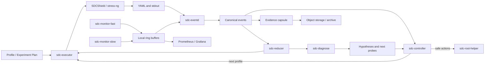
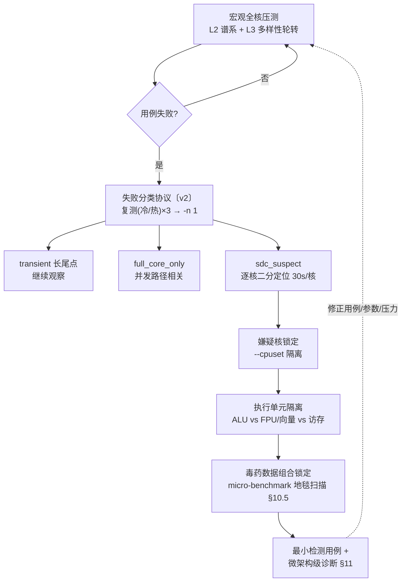
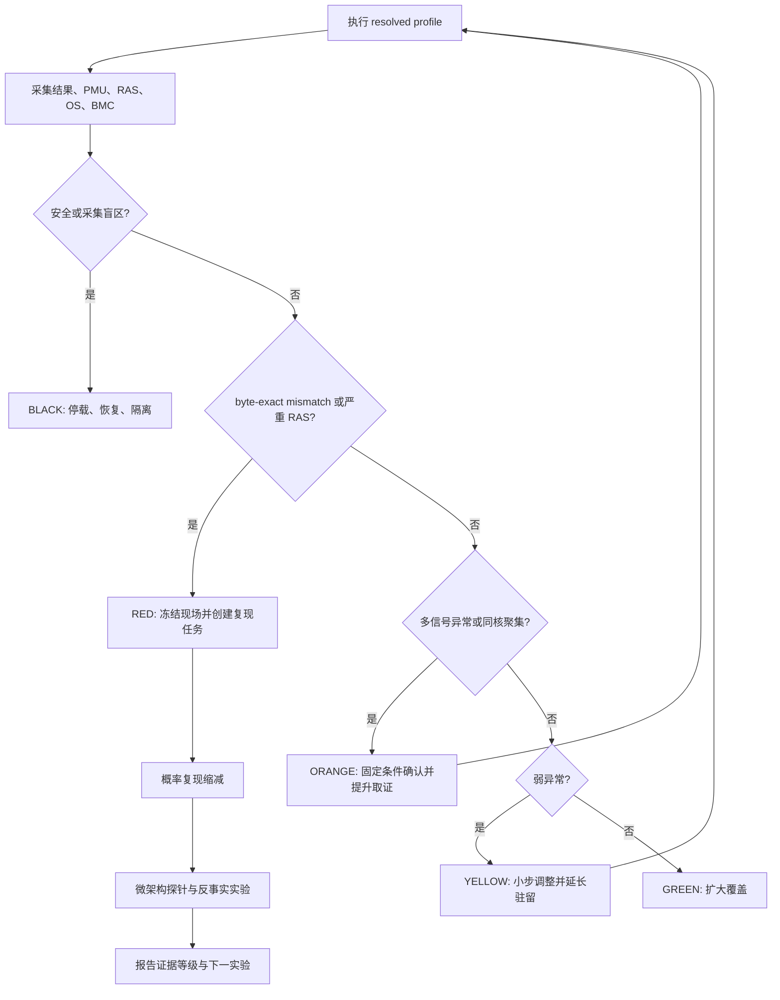
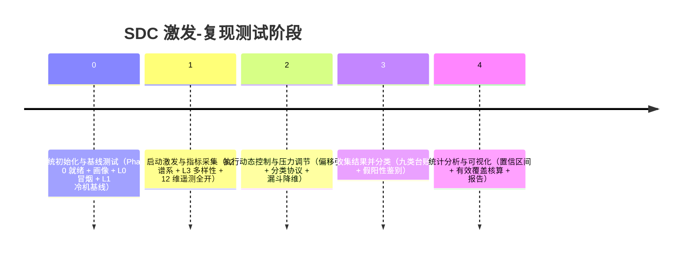

# sdc-excite-reproduce：SDCShield 主动激发 · 动态监控 · 动态策略调控（用例/参数/频率/电压/功耗/核上下线）· 最小复现与微架构诊断 7×24 方案 · v5

> 版本：**v5 融合版**（2026-09-25）。
> 沿革：v3（2026-09-24，三源合并 5W 结构）→ v4（同日，按研究方案框架重构）→ **v5 = v4（两机 as-built 实战）+ 通用工程架构方案（原 `sdc-reproduce.md` 草案）融合**：以工程架构（逻辑组件 / 身份-时间-拓扑契约 / 统一数据模型 / 状态机控制器 / 概率复现 / 证据分级诊断）为骨架，v4 全部 as-built 内容按章节归位；新增**四大策略轴专节**（频率骤变 / 电压骤变 / 功耗骤变 / CPU 核上下线）与**监控信息零丢失对照表**（附录 E）。
> 性质分标：无标注 = 两机实战已验证（as-built）；〔v2〕= 统一设计 / 组件架构，已批准待实施（含本次融合引入的工程架构内容）；〔通用〕= 机器无关方法学；〔研究〕= 当前两机硬件/环境不具备落地条件（如位翻转注入、DVFS 直控、ML 控制器），如实标注不作虚称。
> 适用范围：ARM64 裸金属服务器，优先适配 Kunpeng 920（TSV110）；保留对其他 ARM PMU、BMC 和拓扑的能力探测接口。
> 工程基线：`scripts/sdc-excite-reproduce/` 已有 7×24 驱动、监控联锁、事件快照与复测能力；本文定义从现有基线演进到"主动激发 → 实时反馈 → 概率复现缩减与最小检测用例提取 → 故障微架构级诊断"的完整闭环。
> 平台基线：aarch64 Kunpeng 920（本机 TaiShan 2280 = 128 核 / 81 机 RCSIT TG225 B1 = 96 核），openEuler 24.03 LTS-SP4，sdcshield（OpenDCDiag 的 ARM64 移植）。x86-64 术语（RAPL/MCA/MACHINE_CLEARS 等）仅作跨架构参考，本平台等价物见对应小节。
> **术语裁定（2026-09-25）**：campaign 一词在所有场景统一为 **sdc-excite-reproduce**（裁定细则与迁移项见附录 D）；现存 campaign 命名资产为 as-built 事实，文档引用真名并标注"实施期改名"。
> 用户决策：（2026-09-24）分层采集器架构 ｜ PMU 深度档（核 + 全 uncore @20s）｜ 两机同步落地 ｜ 本机磁盘先清理再部署；（2026-09-25）工程架构为骨架 ｜ 通用方案 + 两机参数化实例 ｜ 术语统一 sdc-excite-reproduce。
> 配套：plan `docs/superpowers/plans/2026-09-23-2102312YVY10M6000038-sdc-7x24-stress-plan.md`（本机）｜ 81 机 `docs/superpowers/plans/2026-09-23-sdc-campaign.md` ｜ 画像 `docs/superpowers/inventory/<SN>-<日期>/` ｜ 结果 `docs/superpowers/output/…` ｜ 文献综合 `docs/paper/SDC_RESEARCH_SYNTHESIS_CN.md` ｜ 注入实验计划 `docs/paper/SDC_FAULT_INJECTION_EXPERIMENT_PLAN_CN.md`

---

## 0. 执行摘要

静默数据损坏（Silent Data Corruption，SDC）指硬件未给出可消费的错误报告、但软件结果已经错误的故障，在大规模系统中已被证明对服务可靠性构成真实威胁：阿里百万级 CPU 32 个月患病率 3.61‱，Meta 数百万服务器 4 年内 0.035% 的机器终生发生 ≥1 次，且 **73.5% 的坏机器是已在服役的 CPU、有机器近 4 年后才首发**——一次 pass 不证明健康，只有持续测试能抓长尾。离线压测不可替代：ECC 对小时延故障（SDF）有系统性盲区（读错行仍是合法码字），在线 PMC 检测精度仅 ~90% 且特征不稳定。

CPU 核心级 SDC 通常同时具有低发生率、输入相关、执行上下文相关、核心局部、温度/供电/频率敏感和结果形态不稳定等特征，因此不能靠一次满载、单一测试或单一监控指标判断。本方案把 SDCShield 建设成**五段闭环**：

1. **Stress & Excite（主动激发）**〔v2 扩展 as-built〕：用 SDCShield 的字节精确 golden 比对负载、全核耦合压力、工作集谱系、指令族谱系和安全的负载阶跃主动暴露缺陷；四大策略轴（频率骤变/电压骤变/功耗骤变/CPU 核上下线）按能力探测结果逐轴启用（§7.4）。
2. **Monitor（动态监控）**：同步采集 SDCShield 用例结果、每核 PMU、Uncore PMU、RAS/内核异常、频率/温度/电压/功耗、OS 调度和 BMC 事件——12 维遥测全部落盘（§6）。
3. **Analyze（分析研判）**：把 mismatch、crash、spurious translation fault、RAS 事件和性能异常统一为有版本的数据事件，计算核心级风险和证据置信度（§5、§11）。
4. **Adjust（动态调控）**：规则引擎先行，通过状态机调整测试族、工作集、并发拓扑、数据模式、采样强度和四大策略轴；机器学习先以旁路打分运行，不直接控制电压或停机（§8）。
5. **Reproduce & Diagnose（最小复现与微架构诊断）**：在不破坏诱发环境的前提下，执行概率化 delta debugging，提取最小复现胶囊，并用一变量一对照的探针矩阵将故障约束到 ALU/FPU/Vector、LSU、cache、TLB/PTW、一致性互联、内存或时序边际等候选域（§10、§11）。

**核心工程判断**：

- **golden mismatch 是主判据，PMU/温度/RAS 是辅助证据**。PMU 异常不能单独证明 SDC，RAS 静默也不能证明硬件健康。
- **命中后不能立即把全核环境降成单核**。本仓库 CORE179 案例已经证明，单核隔离会消除依赖其他核心负载、供电和共享缓存环境的 SDC。复现缩减必须采用"victim 核 + aggressor 环境"模型。
- **固定 seed 与 seed 扫描承担不同任务**。seed 扫描扩大数据覆盖；固定单一模式的长驻留扩大特定激活窗口的时间覆盖，二者都必须保留。
- **真实硅片压力、架构态故障注入、模拟器结构注入是三种不同证据层**。三层比例不得直接拼接成同一个"覆盖率"（§7.2）。
- **`CNTVCT_EL0` 频率不得硬编码为 100 MHz**。每台机器必须读取 `CNTFRQ_EL0`，并把 counter、counter frequency 和墙钟映射一起保存（§4.2）。
- **调压/超频不属于默认自动化动作**。BMC/IPMI 通常是传感器读取通道，不应假设可以安全调节 CPU 电压（本机已全量实证不可用，附录 B）。任何硬件 margining 必须由平台能力清单、厂商限值和独立授权共同开启（§7.8）。
- **第一阶段目标不是立刻上 PID 或强化学习**，而是先完成统一数据契约、低开销观测、确定性安全状态机和可重放的复现胶囊。规则控制稳定后，再引入异常检测模型和实验选择算法（§8.7、§14）。

## 核心思路（反馈控制环路）

```
 激发与压测 (Stress & Excite)        数据采集 (Monitor)
   L0-L5 负载谱系                     带内 1Hz 级（perf/sysfs/proc）〔v2〕
   微架构应力（用例+knob）    ───▶    带外 BMC（温度/电压/功耗/SEL）
   四大策略轴（§7.4）                  PMU（核+uncore）· RAS 全量
        ▲                                  │
        │                                  ▼
        │                            分析研判 (Analyze)
        │                              阈值/偏移引擎 · 统计置信
        │                              （Clopper-Pearson）
        │                              竞态假阳性鉴别
        │                                  │
        │                                  ▼
        └──── 修正用例/参数/压力 ────  动态控制 (Adjust)
                                          规则 → 反馈 → 漏斗降维
                                              │
                                              ▼
                              最小检测用例提取 & 故障微架构级诊断（§10、§11）
                              核内 / 执行单元级 / 内存路径 / 一致性互联
```


漏斗降维（详细机制 §8.5）：

```
宏观全核压测（L2 谱系扫档 + L3 多样性轮转）
   └─ 失败分类协议：复测（冷/热两态）×3 → -n 1 → transient / full_core_only / sdc_suspect
        └─ 嫌疑核二分定位（--cpuset 逐核，30s/核封顶）
             └─ 执行单元隔离（ALU vs FPU/向量 vs 访存 vs 一致性）
                  └─ 毒药数据组合锁定（micro-benchmark 地毯扫描，§10.5）
                       └─ 最小检测用例 + 微架构级诊断结论（§11）
```

---

## 1. 目标、非目标与验收口径

### 1.1 工程目标

1. 对每次 sdc-excite-reproduce、阶段、测试、迭代和事件建立可全链路关联的身份与时间轴（§4）。
2. 在不超过约定观测开销的条件下，持续获取核心、Uncore、RAS、OS、应用和 BMC 多层指标（§6）。
3. 发现 mismatch 后在 1 秒内冻结关键现场索引，在 60 秒内完成 root 侧快照，在不停止主 sdc-excite-reproduce 的模式下创建独立复现任务（§8、§16.3）。
4. 自动区分真实硬件候选、测试代码竞争、数值非确定性、环境/基础设施错误和阶段边界终止（§9.5）。
5. 对概率性 SDC 提取可重复的最小环境、最小负载、最小数据和最小指令序列，而不是只保存原始大日志（§10）。
6. 输出带证据等级的微架构候选排序和反事实实验结果，不越过软件证据能够支持的结论边界（§11.9）。
7. 对零事件实验给出覆盖时长、核心小时、配置矩阵和置信上界，不使用"未发现等于不存在"的结论（§9.6）。

时长纪律〔通用〕：sdc-excite-reproduce 总时长**至少连续 7×24h（168h）起步**，可延长；深驻留（`--max-test-loop-count=0` 固定 seed）×2h/对象做单模式统计深度；文献长尾 42h+ → 持续运行（一次 pass 不证明健康，坏机器 73.5% 已在服役）。样本量是否足够的判据由 §9.6 统计框架给出，而非固定时长。

### 1.2 非目标

- 不承诺仅凭 PMU 唯一定位到具体晶体管、物理端口或版图位置。
- 不把架构态寄存器位翻的检出率解释成真实硅片某微架构单元的自然故障率。
- 不在生产节点默认执行欠压、超频、关闭热保护、关闭 RAS 或破坏性 JTAG 操作。
- 不把自动 ML 模型作为首版安全联锁的唯一依据。
- 不用 Prometheus 代替事件原始证据库，也不把高基数 `event_id`/`seed` 直接做 Prometheus label。

### 1.3 端到端验收标准

| 能力 | 验收标准 |
|---|---|
| 身份与时间 | 任一 mismatch 可关联到 sdc-excite-reproduce/run/test/iteration/cpu/topology，并能把 realtime、monotonic、uptime、CNTVCT 和 BMC 时间误差量化到样本中 |
| 采集 | 关键采集器断链、丢样、复用比例和时间漂移可见；采集器自身 CPU 开销、I/O 和丢样率有基准 |
| 控制 | GREEN/YELLOW/ORANGE/RED/BLACK 状态转换可回放；任何提高压力的动作有前置条件、上限和冷却时间 |
| 取证 | 人工注入的 fail/crash/spurious/RAS 演练均生成完整 event capsule；原始日志与解析结果有哈希 |
| 复现 | 对仓库已有 CORE179 历史样本，流程能表达"单核不复现、全核环境需要保留"的约束，不误做确定性 ddmin |
| 诊断 | 每个结论按"事实/推断/假设"分级，并列出支持证据、反证和下一步实验 |
| 统计 | 所有比率有分母、暴露量和置信区间；`k=0` 时给出上界而不是 0% 风险 |
| 安全 | 温度、风扇、PSU、磁盘、内存、BMC 断链和 watchdog 演练通过；电压/频率写操作默认禁用 |
| 报告〔通用〕 | 只记实测（每条结论附命令输出或日志依据）；"未检出"必附运行时长与等效试验数；绝不编造 |

---

## 2. 仓库现状与目标增量

### 2.1 已有可复用能力

| 现有资产 | 当前能力 | 在本方案中的位置 |
|---|---|---|
| `scripts/sdc-excite-reproduce/sdc_campaign.sh`【现名，实施期改名 `sdc-excite-reproduce.sh`，§2.3】 | L0-L5 状态机、谱系扫档、全用例轮转、热激发、NUMA/域隔离、深驻留、失败复测、stress-ng `--verify` 补充层、governor 请求代理、di/dt 负载阶跃 | 保留为执行器（→ `sdc-executor`），后续拆出控制 API 与事件 API（§13.4） |
| `scripts/sdc-excite-reproduce/sdc_monitor.sh`（root） | 60s OS/BMC 采样（monitor.csv v2 全列集）、温度/风扇/磁盘/内存联锁、SEL 增量、governor 强制、root 取证快照（dmesg+ipmitool sdr/sel/dcmi）、10min 全量工况快照 | 保留为低频环境采集器（→ `sdc-monitor-slow`），补充 1s 带内采集和事件触发高频窗口（§6.3） |
| `scripts/sdc-excite-reproduce/sdc_common.sh` | 路径、状态（state.json 断点）、暂停、内存预算等公共函数 | 演进为原子状态写入和严格 schema 校验 |
| systemd 单元 + `install/start/stop/status.sh` + logrotate + `collect_inventory.sh` + `NEW_BOARD_ONBOARDING.md` | 7×24 运维与单板盘点 | systemd 单元存在 `@REPO@/scripts/campaign/` 路径 bug（实际目录 `scripts/sdc-excite-reproduce/`），随命名统一迁移修复（§2.3） |
| `scripts/run/run_sdc_spectrum.sh` 等脚本族 | GEMM/SLEEF/FFT/压缩/crypto 工作集与参数谱、逐核轮换、18 循环 | 广域激发 profile 的基础（§7.6） |
| **SDCShield 框架能力（源码核实）** | YAML 字段全集（test/quality/description/state{seed,iteration,retry}/result/fail{cpu-mask,time-to-fail,seed}/每线程 detecting-cpu、previous-cpu、loop-count、freq_mhz、messages/resource-usage{utime,stime,cpuavg,maxrss,majflt,minflt,voluntary-cs,involuntary-cs}）；`--dump-cpu-info` 拓扑（package/core/cluster/die/NUMA/cache/MIDR/微码/PPIN）；`mce_check` EDAC 差值 + **CPU 数变化检测**；`kunpeng920_ecc` 三后端（hisi_ras 设备 → APEI err_info → EDAC sysfs）；每线程有效频率（aarch64 走 perf cycles）；`-O` knob 矩阵；`--cpuset/--deviceset`、`--quality`、`--max-test-loop-count`、`-s/--rng-state`、`--test-list-file/--test-list-randomize`、`--inject-idle`、`--retest-on-failure`、`--on-crash/--on-hang`；源码 442 个测试声明（quality_level 声明行：PROD 500 / BETA 11 / SKIP 7，含跨架构；本机实测 `--list-tests` 默认 PROD 422 / 含 BETA 428） | 事件解析的权威输入 + 平台探测 + 激发负载（附录 A 全量速查） |
| `docs/cases/CORE179_SDC_REPORT_CN.md` + `SYNTHESIS-12case-cross-analysis.md` | 真实 SDC 的 seed、并发、相位、位翻转和负载路径规律；12 次 vmcore、约 135 次 spurious fault | 最小复现算法与 LSU 诊断的回归样本（§10、§11） |
| `docs/cpu/arm64/kungpeng/kunpeng920_pmu_events.md` | TSV110 core/uncore PMU 事件、权限与计数器限制 | 平台 PMU profile（§6.2） |
| 两机 as-built 运行数据 + 81 机方法学资产（`~/sdc_campaign_2026-09-23/research/`，待收编） | 12 维遥测现状档、失败分类协议、竞态三探针、假通过清单 22 例、mesh 根因对 | §6/§9/附录 C 的 as-built 依据 |

### 2.2 当前缺口

1. 现有 `ledger.csv` 以字符串摘要为主，缺统一 schema、版本、拓扑快照和证据关联图。
2. `monitor.csv` 适合现场排障，但采样周期、字段和双 socket 假设仍偏单板定制，不适合作为跨平台权威接口。
3. 没有持续的每核 PMU 轮转采集，也没有事件前后自动切换到高频 PMU burst。
4. `spurious translation fault` 仍主要靠日志搜索，没有 per-CPU、可持续、带丢失计数的事件流。
5. 失败后只有固定三次定向复测，没有概率复现模型、环境保持策略和分层 ddmin。
6. 没有自动将失败特征映射到微架构假设并生成下一轮受控实验矩阵。
7. `cmd/` 文件代理可继续使用，但目标形态应是严格白名单、原子落盘、带 nonce 和审计记录的命令协议。
8. **命名不统一**：campaign 与 sdc-excite-reproduce 混用；systemd 单元 `@REPO@/scripts/campaign/` 路径与实际目录不符。
9. 本机磁盘 88%（部署深度档前置清理，用户决策）。
10. **四大策略轴（频率骤变/电压骤变/功耗骤变/CPU 核上下线）无统一能力探测与执行协议**——本 v5 新增（§7.4）。

### 2.3 命名统一迁移〔v2〕

术语裁定（2026-09-25）：**所有场景统一使用 sdc-excite-reproduce**。现存 campaign 命名是正在运行的 as-built 事实，按一补丁一单元纪律统一改名（列入 §14 补丁序列）：

| 现状真名 | 目标名 | 备注 |
|---|---|---|
| `scripts/sdc-excite-reproduce/sdc_campaign.sh` | `sdc-excite-reproduce.sh` | 单前缀规范名（弃机械替换的双前缀 `sdc_sdc-excite-reproduce.sh` 形式） |
| `sdc-campaign.service` | `sdc-excite-reproduce.service` | 同步修复单元内 `@REPO@/scripts/campaign/` 路径 bug |
| `~/sdc-campaign/`（state.json/monitor/events/logs/stressng） | `~/sdc-excite-reproduce/` | 数据迁移含断点续跑兼容（state.json 路径重定向；改名前文档引用真名） |
| `sdc-monitor.service`、collector 模板 | 不变 | 本就无 campaign 字样 |
| `scripts/run/run_sdc_campaign.sh` 等历史脚本 | 保留原名 | 历史参照，标注即可，不强制改 |

**（2026-09-25 M0-T2 已落地：脚本/服务模板/logrotate/数据根已按本表改名并迁移；root 侧单元重装已完成——新单元 `sdc-excite-reproduce.service`/`sdc-monitor.service` enabled×2、inactive×2，旧单元与旧 logrotate 已删除）**

---

## 3. 总体架构

### 3.1 逻辑组件〔v2〕

| 组件 | 权限 | 主要职责 |
|---|---|---|
| `sdc-executor` | 普通测试用户 | 调用 SDCShield/stress-ng，执行 profile，记录命令与退出状态 |
| `sdc-monitor-fast` | root 或 `CAP_PERFMON` 等最小能力 | 1 秒带内指标、PMU 轮转、事件触发 100 ms burst、BPF/trace 事件 |
| `sdc-monitor-slow` | root | 5 秒 BMC、SEL、EDAC、kdump、磁盘和安全联锁；由现有 `sdc_monitor.sh` 演进 |
| `sdc-eventd` | 普通用户，读取 spool | 解析 YAML/内核/RAS/监控流，生成统一事件、去重、关联和证据快照 |
| `sdc-controller` | 普通用户；通过 root helper 请求有限动作 | 规则状态机、实验排程、压力档位、四大策略轴、冷却、停止和复现任务创建 |
| `sdc-reducer` | 普通用户 | 概率 ddmin、victim/aggressor 拆分、数据/负载/拓扑/时长缩减 |
| `sdc-diagnose` | 普通用户 | 假设评分、对照实验生成、位模式和 vmcore 法证汇总 |
| `sdc-root-helper` | root | 只执行固定白名单动作：perf uncore、快照、CPU online/offline、governor、kdump 查询；拒绝任意 shell |
| 本地 spool | 文件系统 | 断网可用的追加写证据、环形缓存和事件胶囊 |
| 远端观测面 | 可选〔研究〕 | Prometheus/Grafana 看趋势；对象存储保存证据；分析库保存结构化实验结果 |

### 3.2 数据与控制流



### 3.3 进程隔离原则

- 执行器、监控器和事件解析器必须独立进程、独立 systemd unit；压测崩溃不能带走监控。
- 高频 PMU 数据先写预分配 ring buffer，再异步落盘；不要在被测线程热路径同步写日志。
- 事件触发时只记录"冻结索引"，由后台复制前后窗口，避免失败回调阻塞。
- root helper 使用固定 JSON schema 和 allowlist，不接受拼接 shell 命令。
- 本地证据以 append-only 为主；最终事件胶囊生成 `SHA256SUMS`，后续分析产物不能覆盖原始证据。

### 3.4 as-built 现状实例化与演化映射

当前两机已运行的进程族（as-built，`~/sdc-campaign/` 数据根）：

```
 sdc-campaign.service (sdc)          sdc-monitor.service (root)            sdc-collector@.service (root 模板)〔v2〕
 ┌────────────────────────┐          ┌───────────────────────────┐        ┌─ @percore: percore.csv(逐核占用+实测频率)
 │ L0冒烟→L2谱系→L3多样性→  │  PAUSE/  │ 安全联锁(热95/90滞回+100   │        │            + 频点驻留直方图(100MHz桶)
 │ L5专项→L4深驻留(24h循环) │◀───────│  绝对线KILL/风扇/内存/磁盘/  │        ├─ @pmu:     pmu_core.csv(逐核事件组)
 │ stress-ng --verify 补充 │  标志   │  SEL Critical粘性)          │        │            pmu_uncore.csv(DDRC/L3C/HHA)
 │ 失败分类协议+假通过扣除  │          │ +唯一BMC轮询→3消费者共享    │        │            (perf -a 持久进程 @20s)
 │ +逐核二分定位〔v2〕      │          │ +SDR离散态diff→事件流〔v2〕  │        ├─ @ras:     ras_edac.csv + journal RAS流
 └───────────┬────────────┘          │ +10min偏移引擎+SEL增量      │        │            + rasdaemon监护 + BERT启动dump
             │ state.json             │ +cmd/协议(governor/快照)    │        │            + spurious canary〔v2 收编〕
             ▼                        │ +collector看门狗〔v2〕      │        └─ 各自 Restart=always；监控侧看门狗监护
      systemd Restart=always                      ▼
                                   事件时: ±5min 全通道切片(环境/逐核/PMU/EDAC/离散态)
                                           + 失败核 120s 定向 PMU 深采(复测期并行)
 旁路: rasdaemon(全程) + kdump + EDAC + BMC SEL ── 事件互证
 人的节奏: 4h 巡检(自动) → fail 事件 → 分类协议 → subagent RCA → 主agent验证提交 → 用户决策点
```

| as-built 组件 | 目标组件（§3.1） | 演进要点 |
|---|---|---|
| `sdc-campaign.service` + `sdc_campaign.sh` | `sdc-executor` | L0-L5 行为保留；拆出 action API（§13.3）；失败分类协议参数化 |
| `sdc-monitor.service` + `sdc_monitor.sh` | `sdc-monitor-slow` | 60s CSV 保留为长期摘要；联锁不动 |
| （新增） | `sdc-monitor-fast` | 1s 带内 + PMU 轮转 + 事件 burst（§6.3） |
| `sdc-collector@{percore,pmu,ras}` | 并入 monitor-fast/slow 或保留模板 | 各通道持续采集，独立重启 |
| `cmd/` 文件代理 | `sdc-root-helper` | 严格白名单、原子落盘、nonce、审计 |
| 台账 `ledger.csv` + 事件目录 | `sdc-eventd` + canonical events（§5.3） | 兼容读取旧格式 |
| （新增） | `sdc-controller` / `sdc-reducer` / `sdc-diagnose` | §8/§10/§11 的落地单元 |

systemd 工程化统一约定〔通用〕：`Restart=always` + `RestartSec=10` + `StartLimitIntervalSec=0`（防反复崩溃后 systemd 不再拉起）；采集器为模板实例各自独立重启；适用时启用 watchdog（`WatchdogSec=` + 进程定期 notify）；输出按天命名日志或 journal（带 ident）；logrotate 按天+大小上限+压缩+保留窗口参数化，**事件证据目录单独保留、不被轮转删除**；所有脚本 smoke（约 10 分钟）/full（7×24）两档；断点恢复（`state.json` 记录阶段/周期进度，重启后从断点续跑，冷机首轮恢复时自动补做）。

**为什么全量遥测**（设计依据，as-built + v2 论点）：归因四向需要在场证据（§11.3），每一向都需要对应维度**在故障时刻前后有数据**；热联锁的眼睛（本板满核 3 分钟可推 CPU 至 105°C，三次 KILL 实录——监控失明=sdc-excite-reproduce 失明=硬件风险）；SOSP23 他核忙碌效应归因需对照"当时谁在跑什么"；PMU 是证据不是判据；81 机实战已证明 journal RAS 流/连续 EDAC/SEL 类型统计的价值。

---

## 4. 身份、时间与拓扑契约

### 4.1 身份层级

| 字段 | 含义 | 生成规则 |
|---|---|---|
| `machine_id` | 被测机器稳定身份 | DMI serial + board serial 的哈希；原始序列号只存受控 manifest |
| `sdc-excite-reproduce_id` | 一次长期 sdc-excite-reproduce | `YYYYMMDDTHHMMSSZ-machine-profile-git12` |
| `run_id` | 一条实际进程调用 | UUIDv7 或等价时间有序 ID |
| `test_id` | SDCShield 测试 ID | 直接使用框架 `test->id`，禁止用文件名猜测 |
| `iteration` | 框架迭代 | 取 YAML `state.iteration`；retry 用 `retry=true` 区分 |
| `attempt_id` | 控制器级尝试 | 同一配置重复运行的序号 |
| `event_id` | 统一事件 | UUIDv7；同一根事件的快照/复测通过 `parent_event_id` 关联 |
| `experiment_id` | 受控诊断实验 | 配置内容哈希，确保同配置可去重 |

每次运行至少记录：

```text
sdc-excite-reproduce_id, run_id, experiment_id, test_id, seed, iteration, retry,
logical_cpu, core_id, socket_id, die_id, cluster_or_ccl_id, numa_node,
t_start, t_end, command_argv, environment_hash, binary_hash, config_hash
```

as-built 每次迭代必记录（v4 已执行，归入上表实例）：`test_id, seed, iter, cpu（逻辑核号）, socket/die/CCL（拓扑定位）, t_start, t_end`。

耗时字段避免使用无单位的 `cycles`：PMU 周期写为 `cpu_cycles`，Generic Timer 差值写为 `cntvct_delta` 并同时保存 `cntfrq_hz`，墙钟耗时写为 `duration_ns`。

### 4.2 时间五元组（as-built 双源时间戳的目标态）

每个关键边界和事件都记录：

1. `realtime_ns`：`CLOCK_REALTIME`，用于跨系统/人类时间轴（as-built 对应 `date +%s.%N`，台账/文件名主时间戳）。
2. `monotonic_raw_ns`：`CLOCK_MONOTONIC_RAW`，用于计算持续时间，避免 NTP 步进影响。
3. `uptime_ns`：`/proc/uptime` 或 `CLOCK_BOOTTIME`，用于对齐 dmesg/vmcore（as-built 已用）。
4. `cntvct` + `cntfrq_hz`：读取 `CNTVCT_EL0` 与 `CNTFRQ_EL0`。换算为秒使用 `cntvct / cntfrq_hz`，**不能假设固定 100 MHz**（as-built 用例内联读取做指令级耗时关联，本 v5 修正其 100MHz 硬编码）。
5. `bmc_time`：BMC/SEL 可用时记录原始时间和解析后的 UTC/本地时区信息（as-built `ipmitool sel time` 带外互证，防系统时钟漂移）。

背景：NTP 不可用（本机 UDP/123 阻断实测）→ as-built 已双源时间戳（系统 + BMC）；本节为其目标态全量契约。

启动时和每 10 分钟执行一次时间锚定：在尽量短的临界区内连续读取 realtime → monotonic_raw → cntvct → uptime，形成映射样本。实现上保留 `date +%s.%N`、`/proc/uptime` 原始值，并由小型 helper 同次读取 CNTVCT/CNTFRQ。事件关联时使用最近两个锚点线性插值，并保存残差 `clock_mapping_error_ns`。若 NTP 不可用，仍可用单机 monotonic 保证因果顺序，并用 BMC 时间作旁证。

### 4.3 拓扑快照

**不要假设 `physical_package_id`、`cluster_id` 连续或从 0 开始**（本板实测：cluster_id 单调递增 138→654→1170…、physical_package_id 偏大，固件/ACPI-PPTT 伪影，读原值即可）。每次 sdc-excite-reproduce 启动保存：

- `/sys/devices/system/cpu/cpu*/topology/*`
- `/sys/devices/system/node/node*/cpulist`
- SDCShield `--dump-cpu-info`（含 package/core/cluster/die/NUMA/cache/MIDR/微码/PPIN）
- `lscpu -e=CPU,CORE,SOCKET,NODE,CACHE,ONLINE,MAXMHZ,MINMHZ`
- MPIDR/MIDR（可通过已有 CPU 信息路径或轻量 helper 获取）
- cpufreq policy 到 CPU 的映射
- Uncore PMU 实例到 die/SCCL/NUMA 的映射
- **CPU online/isolated 集**（四大策略轴之核上下线的前后差异基线，§7.4）

控制器内部使用实际 CPU 列表，不用 `p0/p1` 等可能受固件 PPTT 伪影影响的假定编号（as-built 实测 `pN` 拓扑语法在本板失效 → 统一 sysfs cpulist 逗号集）。

---

## 5. 统一数据模型与存储

### 5.1 三类数据

1. **Metric sample**：规则周期采样，适合时序分析，如温度、频率、PMU delta、CPU util。
2. **Event**：稀疏离散事件，如 mismatch、crash、spurious fault、EDAC 增量、SEL Critical、联锁动作。
3. **Artifact**：大对象，如完整 YAML、vmcore、dmesg、反汇编、二进制、配置和最小复现源码。

### 5.2 本地目录布局〔v2〕

```text
~/sdc-excite-reproduce/<sdc-excite-reproduce_id>/   （as-built 现状根 ~/sdc-campaign/，§2.3 迁移）
  manifest.json
  topology/
  configs/
  runs/<run_id>/
    run.json
    stdout.log.zst
    sdcshield.yaml.zst
    metrics-index.json
  spool/
    metrics-1s/<date>.jsonl.zst
    pmu/<date>/<cpu>.bin
    kernel-events/<date>.jsonl.zst
    bmc/<date>.jsonl.zst
  events/<event_id>/
    event.json
    signature.json
    timeline.jsonl.zst
    source.yaml.zst
    snapshots/
    retests/
    reducer/
    diagnosis/
    SHA256SUMS
  reports/
```

现有 `~/sdc-campaign/`（state.json、monitor/、events/、logs/、stressng/）在迁移期由 `sdc-eventd` 兼容读取 `monitor.csv`、`ledger.csv` 和现有事件目录。

### 5.3 Canonical event schema

```yaml
schema_version: 1.0
event_id: 0199...
parent_event_id: null
event_type: sdc_mismatch
severity: red
confidence: observed
sdc-excite-reproduce_id: 20260924T...
run_id: 0199...
test:
  id: eigen_gemm_double_dynamic_square
  family: eigen
  workload_type: floating_point
  instruction_width_bits: 128
  seed: AES:...
  iteration: 17
  retry: false
  knobs: {mdim: 256}
result:
  verdict: FAIL
  t_start_realtime_ns: 0
  t_end_realtime_ns: 0
  duration_ns: 0
  cpu_cycles: 0
  cntvct_delta: 0
location:
  logical_cpu: 179
  core_id: 179
  socket_id: 1
  die_id: 7
  cluster_id: 23340
  numa_node: 7
time:
  realtime_ns: 0
  monotonic_raw_ns: 0
  uptime_ns: 0
  cntvct: 0
  cntfrq_hz: 0
  bmc_time_raw: null
  mapping_error_ns: 0
mismatch:
  type: float64
  byte_offset: 736
  suboffset: 0
  lane: 92
  actual_hex: 0x...
  expected_hex: 0x...
  xor_mask_hex: 0x...
  popcount: 21
environment:
  temperature_c: null
  frequency_khz: null
  voltage_v: null
  package_power_w: null
  pmu_window_id: ...
artifacts: []
classification:
  primary: candidate_hardware_sdc
  alternatives: [test_race, numeric_nondeterminism]
  status: open
```

as-built 对齐：事件目录 `events/<时间戳>-<label>-rc<N>/` 已含 yaml_extract（提取式取证，不复制 GB 级原件）、stdout_summary、context、classification.txt、bisect/；〔v2〕扩展为上表 schema + 全通道 ±5min 切片 + 失败核 120s 定向 PMU 深采。位翻转掩码 = O XOR T 逐字节（位图进台账，用于 §11.3 单元归因与跨事件聚类）。

### 5.4 存储分层

| 层 | 推荐 | 用途 |
|---|---|---|
| 节点本地热数据 | 预分配 ring buffer + JSONL/二进制分片 + zstd | 断网、事件前后窗口、低写放大 |
| 时序观测 | Prometheus remote write 或 VictoriaMetrics/InfluxDB〔研究〕 | 仪表盘、告警、趋势；只放低基数字段 |
| 事件检索 | Loki/Elasticsearch 或结构化 SQLite/PostgreSQL〔研究〕 | 事件、实验和假设查询 |
| 证据归档 | 版本化对象存储 | YAML、vmcore、二进制、最小复现包 |

Prometheus label 只使用 `machine_id`、`cpu`、`socket`、`metric_group`、`test_family`、`phase` 等有界维度；`seed`、`run_id`、`event_id`、错误值和地址放 exemplar、日志或事件库。

### 5.5 传输与中间件

| 路径 | 首选接口 | 适用范围 | 设计约束 |
|---|---|---|---|
| 被测进程到本地采集 | 预分配共享内存/ring 或 append-only spool | 高频结果、PMU、事件窗口 | 非阻塞；有 drop counter；压测崩溃不带走证据 |
| 本地时序到观测面 | Prometheus pull/remote write | 低基数指标、告警和仪表盘 | TLS/认证；断网本地缓存；不传大 artifact |
| BMC/机架环境 | IPMI/Redfish；SNMP 可作为机架级补充 | 温度、电压、风扇、PSU、SEL | BMC 限流（§6.3 限速教训）；只读账号；保留原始 sensor identity |
| 节点控制 | 本地 Unix socket/spool；跨节点可选 mTLS gRPC | action、ack、heartbeat | versioned schema、nonce、期限、幂等和 allowlist |
| 事件流 | 小规模直接写事件库；大规模可选 Kafka〔研究〕 | 多节点异步关联和消费 | 单机首版不引入；启用后以 event ID 去重并监控 lag |
| 大对象 | HTTPS/S3 兼容对象存储 | vmcore、二进制、capsule、Parquet | 分片校验、断点续传、服务端版本化和访问控制 |

单机/小规模实验不为"架构完整"强行部署 Kafka/RabbitMQ；本地 spool 是断网和崩溃情况下的事实来源。中心侧不可用时，安全联锁仍由节点本地执行。

### 5.6 as-built 数据模型与磁盘预算

```
monitor/monitor.csv        v3：全部模拟传感器（发现式 ~60 列）+ OS 聚合 + EDAC + vmstat    ~0.5MB/天
monitor/percore.csv        ts + 128×util% + 128×freq_kHz（257 列）                        ~4-10MB/天
monitor/pmu_core.csv       每 interval 一行 × 641 列（ts + 128核×5事件）@20s              ~22MB/天
monitor/pmu_uncore.csv     每 interval 一行 × 449 列（ts + 448 设备×事件值，81 机 385）@20s    ~17MB/天
monitor/ras_edac.csv       ts + mc ce/ue/ce_noinfo + per-DIMM（发现式）@60s               <0.5MB/天
monitor/journal_watch.log  RAS 关键字流 + spurious canary 计数                              小
monitor/discrete_events.log 全量离散态转移事件                                              小
monitor/freq_residency.log 10min 每核驻留直方图（100MHz 桶）+ 日累计                        小
monitor/sel_events/        SEL 增量 + 类型统计
monitor/condition_10m.log  全量工况快照（含偏移段）
logs/YYYYMMDD/*.yaml|.out  sdcshield 输出（每日 gzip）
events/<时间戳>-<label>-rc<N>/  事件目录（提取式取证 + classification.txt + bisect/ + 切片 + PMU 深采）
events/ledger.csv / stressng/  台账 / 补充层
合计 raw ~50MB/天 → 小时级 gzip 后 ~6-8MB/天；保留窗口参数化（默认 14 天 gz）
```

磁盘联锁：85% 告警 / 95% 停新日志；本机当前 88% → **部署深度档前先清理至 <85%**（用户决策）；81 机磁盘充裕无此问题。〔v2〕事件原始文件 append-only + 分片校验和 + 完成标记；解析器输出带 source artifact hash，后续重解析不覆盖原始结果；保留策略建议：常态 1 秒时序 30-90 天、聚合指标 1 年、RED/BLACK 事件和复现胶囊长期保留。

---

## 6. 监控指标、采集频率与开销预算（监控契约中枢）

### 6.1 指标优先级

指标按"能否决定安全、能否证明结果错误、能否缩小故障域"排序（可获得性 × 关联性：**硬件计数器与硬件错误日志 > RAS 内核征兆 > 带外传感器 > OS 聚合 > 应用一致性检查**），而不是按可采集数量排序。

| 优先级 | 指标族 | 典型指标 | 异常模式与用途 |
|---|---|---|---|
| P0 | SDCShield 结果 | PASS/FAIL、test、seed、iter、CPU、耗时、offset、lane、O/T、XOR mask | golden mismatch 是 SDC 候选主事件；同 seed 延迟尾部变宽是早期线索，但不能单独定性 |
| P0 | 内核/RAS | SError、MCE/GHES、EDAC CE/UE、Oops/WARN/panic、RCU stall、soft lockup、hung task | 区分静默错误、可纠正错误、已报告错误和系统失效；检查事件是否在嫌疑核聚集 |
| P0 | spurious translation fault | 事件时间、CPU、进程/线程、地址、异常码 | 廉价 canary；必须按核计数并与 workload 窗口关联，不能仅统计全机 grep 数 |
| P0 | 安全联锁 | CPU/VRD/内存/进出风温度、风扇、PSU、Prochot、BMC 通信、磁盘/内存余量 | 越限立即降载或停止；传感器失联本身也进入 fail-safe |
| P1 | Core PMU | cycles、retired/spec instructions、stall、cache、TLB、branch、remote、memory error | 计算 IPC、stall ratio、MPKI 和重试/访存特征，形成事件前后窗口与对照核差分 |
| P1 | Uncore PMU | L3 retry/back-invalid、HHA snoop、DDRC 流量与切换 | 判断共享 cache、一致性、跨 socket 和内存控制器干扰是否为必要环境 |
| P1 | 频率/功耗/热 | policy 双读频率、time_in_state、governor、boost、功耗、温度、电压 | 识别降频、热毛刺、droop 代理和阶段变化；SoC max 温度不得伪装成 per-core 温度 |
| P1 | OS 调度 | 每核 user/sys/idle/irq、interrupt、ctxt、runqueue、NUMA 内存 | 证明测试实际落核，识别迁移、抢占、IRQ 和内存压力混杂因素 |
| P2 | 固件/BIOS | BIOS/BMC/微码版本、启动参数、SEL、平台配置 | 提供实验上下文和跨机器差异解释 |
| P2 | 运行时/库 | allocator、OpenMP/MPI、数学库版本与返回码 | 排除库非确定性、并发竞争和运行时失败 |
| P2 | 应用级 | 双跑、checksum、断言、业务 golden | 验证检测器之外的真实应用敏感性 |

按系统层次归纳：

| 层级 | 优先监控项 | 典型异常模式 |
|---|---|---|
| 硬件层 | Core/Uncore PMU、cache/TLB/branch、EDAC/GHES、内存/互联错误、温度/频率/电压/功耗 | IPC 或 stall 突变、某核/某共享域重试聚集、CE/UE 增量、热/功耗边沿与 mismatch 同窗；只作为定位证据，除 oracle mismatch 外不单独定性 SDC |
| 固件/BIOS 层 | BIOS/POST/启动日志、firmware/BMC/微码版本、SEL、传感器告警、平台配置 | 版本漂移、训练/校验告警、电源/温度/风扇告警、重启原因异常；用于解释平台差异和排除环境故障；版本入画像基线，固件/微码/BIOS 变更入事件台账（处置后回归的对照锚点，§11.8） |
| 内核/OS 层 | SError/MCE、spurious translation fault、Oops/WARN/panic、RCU/softlockup/hung task、调度/IRQ、页错误和 NUMA 状态 | 异常在特定 CPU 聚集、内核 fault 与 mismatch 相邻、线程迁移或 IRQ 毛刺造成假关联、崩溃或 hang 从静默转为 DUE |
| 运行时/库层 | allocator、GC（如适用）、OpenMP/MPI、数学库、自检、线程到 CPU 映射、用例耗时 | 分配失败、错误返回码、竞态、线程迁移、同 seed 长尾扩大；用于识别软件缺陷和执行上下文 |
| 应用层 | byte-exact golden、checksum、双重执行、范围/不变量断言、关键 checkpoint | 输出不一致但硬件/内核无报告是主 SDC 候选；稳定业务语义错误可作为第二独立 oracle |

**先兆观察清单**〔通用〕（任一出现即进入 §8 动态控制的定向流程）：

| 先兆 | 判读 |
|---|---|
| 某核停顿计数（§6.2 时序边际组）尖峰 | 流水线资源不足或内部故障，时序裕量收窄 |
| 某核缓存缺失率突升 | 缓存一致性/微架构缺陷风险 |
| `memory_error`(0x1a) 计数出现 | CPU 侧访存错误直接证据 |
| 同 seed 负载耗时分布尾部变宽（p99/p99.9/max） | small delay fault 先表现为时序裕量变窄，**尾部变宽往往早于算错**（§9.7） |
| spurious translation fault 按核聚集 | 最廉价 SDC canary |
| EDAC CE 增量 / 稀有异常核聚集 | 环境压力上升 / 文献 59× 关联 |
| 电压轨偏移 ≥0.01V / 频率低于额定 | 供电/节流显形 |

### 6.2 TSV110 PMU 分组〔v2〕

TSV110 单核可用通用计数器数量有限（armv8_pmuv3 每核 ≤6），不能假设所有事件可以同时无复用地测量。按阶段轮换事件组，每次记录事件编码、PMU 类型、`time_enabled`、`time_running`、缩放值和原始值。当 `time_running/time_enabled` 低于配置阈值（建议初始 0.8）时，该窗口标记为 `multiplex_degraded`，不得直接和非复用窗口比较。平台上线前用 `perf list`、`perf stat -v` 和 PMU sysfs 能力探测校验 raw 编码，事件不存在时降级而非伪造零值。**PMU 是证据不是判据**（PinDrop：PMC 特征不稳定）。

| 组 | 事件（TSV110 raw 码） | 目的 / 指向 |
|---|---|---|
| `core_base`（吞吐/IPC + 时序边际） | `cpu_cycles`(0x11)、`inst_retired`(0x08)、`inst_spec`(0x1b)、`exe_stall_cycle`(0x7001)、`stall_frontend`(0x23)、`stall_backend`(0x24) | IPC、推测执行量和前后端压力基线；停顿骤增 = 流水线资源不足或内部故障（x86 的 MACHINE_CLEARS/UOPS_RETIRED 角色由停顿分解承担） |
| `core_memory`（访存停顿 + 缓存挤压） | `mem_stall_anyload`(0x7004)、`mem_stall_l1miss`(0x7006)、`mem_stall_l2miss`(0x7007)、`l1d_cache_refill_rd`(0x42)、`l2d_cache_refill_rd`(0x52)、`ll_cache_miss_rd`(0x37) | LSU/cache 层级压力；某级缓存缺失率突升 = 一致性/微架构缺陷风险信号 |
| `core_path`（TLB + 跨域 + 硬件错误 + 分支） | `dtlb_walk`(0x34)、`l1d_tlb_refill_rd`(0x4c)、`remote_access`(0x31)、`memory_error`(0x1a)、`br_mis_pred`(0x10) | PTW、跨域流量、**CPU 侧访存错误直接指示**（最接近"内部错误计数器"的事件）、分支单元故障 |
| `l3c` | `back_invalid`(0x29)、`retry_ring`(0x41)、`retry_cpu`(0x40)、`prefetch_drop`(0x42) | L3/一致性拥塞与重试——一致性回退/环网重试/CPU 侧重试/预取丢弃，**一致性缺陷的 uncore 侧证据链** |
| `hha` | `rx_outer`(0x01)、`rx_sccl`(0x02)、`tx_snp_num`(0x33) | 跨簇/跨 socket snoop 活动（外部/跨 SCCL 流量、snoop 数） |
| `ddrc` | `flux_rd`(0x01)、`flux_wr`(0x00)、`rnk_chg`(0x06)、`rw_chg`(0x07) | 内存带宽与方向/Rank 切换（bank 冲突代理 = DRAM 侧压力指标） |

事件菜单扩容〔v2〕（超出上表基础组时轮换启用）：L3C 命中率组（rd/wr_cpipe·spipe + hit 变体）、HHA 流量组（rd/wr_ddr_64b/128b + sdir-hit/edir-hit）、DDRC 命令组（act_cmd/pre_cmd/flux_rcmd/flux_wcmd）。

Uncore 约束：root、`perf -a` 设备限定（本机 32 L3C / 81 机 24；HHA 8；DDRC 16，`/sys/bus/event_source/devices/hisi_sccl*`）；每设备事件数 ≤ 计数器预算，超预算分组 10min 轮换，coverage 列保留可见（多路复用诚实呈现）。实测锚点：81 机 flux_rd 单周期 2,004,947,310 @100% 覆盖。

as-built 首批 5 事件组 = cpu_cycles/inst_retired/br_mis_pred/l1d_cache_refill/l2d_cache_refill（本机 `/bin/true` 实测 304,655/129,627/1,319），上表为其扩容菜单。其他平台用 `perf stat -v` 反查事件号。

派生指标至少包括：

```text
IPC                = inst_retired / cpu_cycles
spec_per_cycle     = inst_spec / cpu_cycles
frontend_stall_pct = stall_frontend / cpu_cycles
backend_stall_pct  = stall_backend / cpu_cycles
load_stall_pct     = mem_stall_anyload / cpu_cycles
L1D_refill_MPKI    = l1d_cache_refill_rd * 1000 / inst_retired
L2D_refill_MPKI    = l2d_cache_refill_rd * 1000 / inst_retired
LLC_miss_MPKI      = ll_cache_miss_rd * 1000 / inst_retired
branch_miss_MPKI   = br_mis_pred * 1000 / inst_retired
```

### 6.3 采样策略（双档：常态 + 事件升级窗口）

| 数据 | 常态〔v2 目标〕 | 事件升级窗口 | 说明 |
|---|---|---|---|
| SDCShield 结果 | 每次迭代/失败即时 | 失败即时 flush | 结果与 seed、CPU、耗时必须同记录提交 |
| Core PMU | 1 秒 delta，计数模式 | 嫌疑核、同簇核和对照核 100 ms，持续 30-60 秒 | 默认不使用高频中断 sampling；事件组按固定 schedule 轮换 |
| Uncore PMU | 1-5 秒 | 1 秒 | 按 PMU 实例保存 socket/die/cluster 归属 |
| `/proc`、频率、hwmon | 1 秒 | 100-250 ms 的有限 burst | 频率双源读取并记录缺失/不一致 |
| BMC SDR | 5 秒 | 仍为 5 秒 | 避免高频 IPMI 请求拖垮 BMC；实际最小周期由平台压测确定 |
| SEL | 30 秒增量或事件触发 | 立即再读 | 以 record ID 去重，保存 BMC 原始时间 |
| dmesg/journal/trace | 事件流 | 全量关联 | 保存 cursor/sequence，避免重复 grep 和丢窗口 |
| 全量系统快照 | 10 分钟 | 触发后 0、10、30、60 秒 | 由 root helper 执行，避免主执行器长时间阻塞 |

节点维护至少 120 秒滚动热窗口。事件发生时固化 `[-60s,+60s]` 数据；崩溃场景依赖串口、pstore/kdump 和远端 collector 保留崩溃前尾部。

**as-built 采样节奏与演进台阶**（受 BMC 处理能力与磁盘约束的实测档）：

| 指标类 | as-built 频率 | 依据 |
|---|---|---|
| 硬件性能计数器 | **计数模式持续累积，20s 读出**（PMU collector） | perf 计数模式开销可忽略（§6.8）；不使用采样模式 |
| 温度/电压/功耗/风扇 | 常态 60s、热区（≥88°C）20s | spec 建议 1-10s；BMC 处理能力受限（**限速教训：密集探测（<3s 间隔）会把 root 监控的 ipmitool 采样打超时，2.5s 也不够**；5s 节奏需先单独做限速试验验证不碰撞，默认执行 60/20s） |
| SEL | 5min 增量 | BMC 限速 |
| OS 聚合 / EDAC / journal 流 / spurious | 60s | 廉价，/proc 与 sysfs 直读 |
| 逐核占用/频率 | 60s（热区 20s） | percore.csv |
| 频点驻留 | 每采样入桶 + 10min 快照 | cppc 无 time_in_state 的替代 |
| 应用一致性（用例结果） | 每用例结束 + 事件触发 | sdcshield YAML |
| 全量工况快照 + 偏移引擎 | 10min | 含驻留/PMU/逐核极值比较 |

BMC 单轮询共享〔v2〕：monitor 一次 `sdr list` 全量缓存 → 3 消费者（CSV 列 / 离散态 diff / 偏移引擎），访问频率与 v1 一致——限速教训约束下的目标态设计。

### 6.4 带内状态与 BMC 传感器归一化

带内每秒读取并保存数据来源：

- **频率（双读）**：`policy*/scaling_cur_freq`（请求值）+ `cpuinfo_cur_freq`（**实测值**，root）/ AMU 计数器；另存 governor、min/max、boost 和 `stats/time_in_state`；每线程有效频率由框架 `freq_mhz`（perf cycles 口径，`-vv` 起 YAML 输出）提供。
- **频点驻留分布**：通用路径 `policy*/stats/time_in_state`——**本机 cppc 无此文件** → 自建 100MHz 桶采样直方图〔v2〕；81 机平台固定频率，该通道 declared-absent（列空 + capabilities 标注）。本机实测恒 2.6GHz 时直方图退化为单桶，价值在节流事件发生时显形（min<2.6GHz）。
- **温度**：`thermal_zone*/{type,temp,trip_point*,policy}`、`hwmon*/temp*_label+input`——**注意 hisi_thermal 报 SoC max 聚合，非 per-core**；逐核温度为两机硬件边界（BMC 亦仅 per-socket Core Rem），不伪造。
- **功耗**：平台暴露的 `hwmon*/power*_input`、powercap/SCMI 或厂商接口；ARM 上不假设存在 Intel RAPL（本平台 Package Power 由 BMC Power / 81 机 CPU Power 承担）。
- **OS**：`/proc/stat` 每核 user/sys/idle/iowait/irq/softirq（tick 增量归一）、`/proc/interrupts`、loadavg、ctxt、procs_running、`/proc/meminfo`、每 NUMA node `/sys/devices/system/node/*/meminfo`、`/proc/vmstat`（oom_kill/pgmajfault 累计）、runqueue 和测试线程实际调度 CPU。

BMC 传感器名称因固件版本而变化，采集器同时保留 `raw_name`、entity/sensor number、unit、状态和规范化字段。目标映射至少覆盖：

| 规范化类 | 常见原始名称示例 |
|---|---|
| CPU 温度 | `CPUN Core Rem`（**per-socket 聚合**）、CPU/SoC Temperature |
| CPU 电压 | `CPUN VDDAVS`、`N_VDDAVS`、`VDDFIX`、`HVCC`（逐核电压无传感器——硬件边界） |
| 内存电压 | `DDRVDD`、`VPP_AB/CD`、`VDDQ_AB/CD`、`VTT_AB/CD`、`1.8V` |
| 供电/内存温度 | `CPUN VRD Temp`、`VDDQ Temp`、`MEM Temp` |
| 热节流 | `CPUN Prochot`（离散态，进全量离散 diff） |
| 整机/PSU 功耗 | `Power`（整机）、`PSN POut/VIN/IIn/IOut`；81 机独有 **CPU Power、MEM Power** |
| 风扇 | `FANN Speed/Status/Presence`、Linux `cooling_device*/cur_state` |
| 环境 | `Inlet/Outlet Temp`、`PSN Temp`、`Disks/HDD MAX/RAID/NIC1/NIC Temp`（本机独有）、`SSD2 Temp`、`NIC OM Temp`（81 机） |

首次接入机器运行传感器 discovery（发现式，启动解析全量 SDR → 列头自适应），生成带单位、正常范围、告警状态和语义的 board mapping；找不到匹配时保留 raw 数据但不参与自动规则；已知传感器缺失列保留输出空——诚实呈现"传感器在但无读数"。`ipmitool sel elist -v` 或 Redfish Event 的记录按 ID 增量采集并去重。

**全量离散态 diff**〔v2〕：本机 106 个离散传感器（PwrCap/PwrOk Drop/Host Loss/Watchdog2/CPU Status/DIMM×32/DISK×16/PCIE/PS Redundancy…）→ 转移即事件、断言（→非 0x00）即时告警（known_faults 白名单除外）。

### 6.5 spurious translation fault 采集〔v2〕

优先使用 BPF tracepoint、fentry 或 kprobe 记录事件的 CPU、PID/TID、comm、fault address 和异常码；挂载前必须通过 BTF/kallsyms 能力探测目标符号和函数原型，不把某一内核版本的 `do_translation_fault` 签名硬编码为通用接口。无法安全挂载时，降级到内核日志增量解析（bpftrace 不可用时 dmesg 轮询兜底），并显式标记 `source=dmesg` 和定位精度损失。收编进 collector@ras，与 journal RAS 流同管道。

该指标的告警基线按核建立：

- 首次出现即产生 YELLOW 事件并启动高频窗口；
- 同一 CPU 在短窗内重复出现，或与 mismatch 同窗，升级为 ORANGE/RED；
- 仅有全机累计值、不知道 CPU 或时间窗口时，只能作为弱证据；
- 计数重启、日志轮转和 collector 重启必须可识别，不能造成虚假增量。

依据：CORE179 12 次 vmcore 伴约 135 次 spurious fault 的实战关联；文献实证稀有异常（doublefault 等）在 SDC 机器上高 59×。

### 6.6 RAS / 内核征兆（最关键、最廉价的旁路证据链）

- **EDAC CE/UE**：`/sys/devices/system/edac/mc/mc*/{ce,ue}_count`（含 per-csrow/dimm）、rasdaemon、`ras-mc-ctl --summary`；CE 频发与 SDC 概率上升关联（压力/环境指标）；注意 ECC 对小时延故障有系统性盲区——这是离线压测不可替代的核心论据。**UE>0 即时告警 + ras 事件目录 + 台账行（不自动 PAUSE——用户决策点）**；81 机 rasdaemon inactive——部署时必须启用。
- **Oops/WARN/panic/MCE/SError/SDEI**：串口 + `dmesg -T` + kdump vmcore（`panic=30`、串口重定向、保留 vmcore）。aarch64 无 x86 MCA 寄存器——对应面为 APEI/GHES/BERT/HEST/EINJ/SDEI（存在性入 capabilities.env）；ARM64 RAS 事件经 rasdaemon（APEI/PCIe）+ EDAC 记录。BERT 启动 dump 入 collector@ras。
- **稀有异常核聚集**：按核统计稀有异常计数（journal RAS 流已有，增加按核聚类统计）〔v2〕。
- **RCU stall / softlockup / hungtask**：dmesg、`hung_task_*` 参数（与 hns3/rcu-stall 已知噪声源区分）。

框架侧现成接口（源码核实）：`mce_check` = aarch64 EDAC `mc*/{ce,ue}_count` 差值 + **CPU 数变化检测**（核上下线策略的兜底哨兵，§7.4）；`kunpeng920_ecc` 三后端（vendor `/dev/hisi_ras` → APEI `err_info` → EDAC），刻意不写 `reset_counters`。

### 6.7 12 维遥测落地矩阵（as-built，§6.1-6.6 全部指标的源/节奏/文件/告警/取证映射）

| # | 维度 | 源 | 粒度/节奏 | 落点 | 告警/联锁 | 事件取证 |
|---|---|---|---|---|---|---|
| 1 | 逐核占用率 | /proc/stat per-cpu tick 增量 | 每核 @60s（热区 20s） | percore.csv | —（固有波动不比） | ±5min 切片+失败核画像 |
| 2 | 内存占用率 | /proc/meminfo + node\*/meminfo + /proc/vmstat（oom_kill/pgmajfault） | 系统+NUMA @60s | monitor.csv v3 | oom_kill 增量即时告警；水位既有 | 切片 |
| 3 | PMU 核 | armv8_pmuv3（§6.2 事件菜单，perf `-a --per-core`，root）分组轮换 | 每核 @20s | pmu_core.csv（宽表） | — | 失败核 120s 定向深采+切片 |
| 4 | PMU uncore | hisi DDRC/L3C/HHA（§6.2 事件菜单，perf `-a`，root）分组轮换 | 每设备 @20s | pmu_uncore.csv（宽表） | — | 内存路径归因证据链 |
| 5 | 逐核温度 | **硬件边界：无逐核传感器** → per-socket Core Rem + 全部温度传感器 | 每 sensor @60/20s | monitor.csv v3 | 热联锁（§8.6） | 既有+离散态 |
| 6 | 逐核电压 | **硬件边界：无逐核传感器** → 全轨（§6.4 电压组，轨集按板发现式） | 每轨 @60/20s | monitor.csv v3 | 偏移 ±0.01V | 既有 |
| 7 | 逐核频率 | cpuinfo_cur_freq（实测值，root）；81 机平台固定（列空+标注） | 每核 @60/20s | percore.csv | min<2.6GHz 节流显形 | 切片 |
| 8 | 频点驻留分布 | 自建采样直方图（cppc 无 time_in_state）：100MHz 桶累计 | 10min 快照+日累计 | freq_residency.log | 分布突变标记 | 驻留 delta |
| 9 | RAS 全量 | EDAC sysfs（含 per-DIMM）@60s + rasdaemon + journal RAS 关键字流 @60s（error/fail/ras/edac/mce/hwpoison/throttle/thermal/panic/oops/segfault/page fault/guard page/hardware，排除 hns3/rcu-stall 噪声）+ spurious canary〔v2〕+ BERT 启动 dump + HEST/EINJ/ERST/SDEI 存在性入 capabilities | 连续 | ras_edac.csv + journal_watch.log | **UE>0 即时告警+开事件目录+台账行**；CE 增量告警；rasdaemon 掉线告警 | 主动旁路互证 |
| 10 | SEL | 增量捕获（基线持久化跨重启/风暴≥20 条/5min 告警/Critical 粘性 PAUSE）+ 类型统计 | 5min | sel_events/ + 台账 | 既有 | 既有 |
| 11 | 功耗/风扇/电流 | SDR 全部模拟量（§6.4 功耗/风扇组）+ DCMI | 每 sensor @60/20s | monitor.csv v3 | 风扇 0rpm×3 采样 PAUSE（known_faults 白名单除外） | 既有 |
| 12 | PROCHOT+全部离散态 | 全量 SDR 离散传感器状态 diff（本机 106 个实测） | 每周期 diff | discrete_events.log | 断言（→非 0x00）即时告警（known_faults 除外） | 转移事件即证据 |

### 6.8 开销与数据质量验收

不预设"监控固定消耗 X%"。每种机器、内核、计数器组和采样配置执行三组 A/B：无监控、常态监控、事件 burst，至少比较 SDCShield 吞吐、p50/p99/p99.9 延迟、cycles、系统 CPU、上下文切换和 I/O。

**计数模式 vs 采样模式**（as-built 裁定，〔通用〕）：文献与实测一致——计数模式对系统性能影响微乎其微；采样模式随事件数与频率显著增长（研究实测：48 并发进程监听 16 事件，采样模式平均开销达几十百分点）。**本方案全部走计数模式**：持久 `perf stat -x, -a` 进程 @20s 读出，核事件组 ≤6 计数器零多路复用，uncore 每设备超预算分组 10min 轮换（coverage 列可见）。

初始工程预算：

| 项目 | 预算 |
|---|---|
| 常态采集吞吐下降 | 中位数不超过 3% |
| 全周期含 burst 的吞吐下降 | 不超过 5% |
| 事件 burst 短窗下降 | 不超过 10%，且不得改变复现结论 |
| 关键事件丢失率 | 小于 0.1%，并有 drop counter |
| 时间映射 | 每批数据保存估计误差；超预算样本标记不可用于精细时序因果分析 |

采集器公开 `samples_total`、`samples_dropped_total`、`collection_duration`、`queue_depth`、`last_success_time`、`clock_mapping_error` 和自身 CPU/RSS/I/O。任何采集断链都进入控制器输入，避免在"监控盲区"继续自动加压。

---

## 7. 主动激发、压力谱与故障注入

### 7.1 理论依据（文献 → 手段映射，31 篇文献综合见 `docs/paper/SDC_RESEARCH_SYNTHESIS_CN.md`）

| 文献结论 | sdc-excite-reproduce 落点 |
|---|---|
| 向量 FP 乘加单元是第一大源（>92% 事故为 FMA；vector ≫ scalar） | GEMM×4 家族 + SLEEF + fma* + acl_gemm 为 L4 驻留主力 |
| 缺陷两分类：一致性型（cache 一致性/原子/内存序）**只能多线程检出** | mesh/cachebounce/lock*/atomic*/memcpy 与计算型**混编同跑全核** |
| SDC 频率随温度 log-线性增长、存在最低触发温度 | 满核热浪（本板实测可至 105°C 带）+ 冷机窗口对照 + 85-90°C 带定向热激发 |
| 边际缺陷对 V/F/输入组合敏感 | 满载电压跌落实测 -0.02V 被监控捕获；di/dt 负载阶跃；seed 逐片轮换。**V/F 直接扫描两机均不可用**（§7.4）→ 以并发档（不同电流拉载/droop）+ 全核自升温补偿（81 机六杠杆之"电气代理"） |
| execution-context 敏感（一条 no-op 改变触发率） | **全部 PROD 用例轮转**而非精选套件；每日随机序破顺序依赖 |
| 工作集谱系区分缺陷部位（核/缓存/互联/内存） | mdim 64→2048、nelems 3 档、ipsec datasize 3 档、memcpy 三策略 |
| 检测三多样性〔通用〕：时间多样性（同操作重复比对）× 拓扑多样性（同一计算在不同核执行交叉比对）× 实现多样性（不同实现交叉验证），外加可逆变换往返 | TEST_LOOP 重复比对=时间维（框架内建）；逐核/逐簇/逐域隔离台账（L5-⑤）=拓扑维；stress-ng --verify + 多库同操作（OpenBLAS/ACL GEMM）=实现维；openssl_sha/ipsec*/isal_igzip/zstd* 为天然往返用例 |
| seed 双档（fracturing 轮换 vs 固定轨迹） | 广域扫 fracturing 自动轮换 + 驻留档 `--max-test-loop-count=0` 固定 seed |
| SDC 与崩溃可同源混发（同一缺陷时而 SDC、时而 crash/abort） | 失败信号双通道把 crash 与 fail 同一取证管线（§7.9 + §11.8） |

### 7.2 三个证据层

| 层 | 方法 | 能回答的问题 | 不能直接推出的结论 |
|---|---|---|---|
| A：真实硅片主动激发 | SDCShield、并发/拓扑/工作集/指令/热与功耗瞬态压力 | 该实机在给定环境下是否出现真实 mismatch；触发条件有哪些 | 某微架构单元的绝对自然故障率 |
| B：电压/频率扰动注入 | 降低或波动 CPU 供电电压（UVLO 模拟）或增加时钟频率（OVLO 模拟）：实验室电源欠压、BIOS/OS 层 DVFS 极限频率或频繁切换 | 电源完整性与时序裕量被压缩时的故障形态（多比特故障或时序违例） | 常压常态下的自然故障率 |
| C：微架构应力注入 | 特定指令序列或高负载模式刺激微架构结构：对齐冲突、缓存行冲突、分支深度、浮点密集计算（stress-ng 或自定义激励程序发起大量缓存填充、流水线吞吐或浮点运算） | 加速缺陷暴露频率（压力本身不直接翻转位，但等价于饱和执行单元的数据流序列） | 压力与故障的因果（需 §11 反事实实验确认） |

每层分别报告 `injections`、`activated`、`architecturally_visible`、`detected`、`SDC`、`DUE/crash` 和 `masked`。跨层只做因果链互证，**不相加分子和分母**。

### 7.3 真实硅片压力维度

首版在现有 L0-L5 之上把压力拆为可组合参数，控制器每次只改变少量维度：

| 维度 | 参数示例 | 主要目标域 | 预期现象 |
|---|---|---|---|
| 数据模式 | zero/ones、walking bit、交替位、低/高 Hamming weight、边界浮点、NaN/Inf/subnormal、固定 seed、seed 扫描 | ALU/FPU/SIMD、旁路网络、数据通路 | 特定 bit/lane/数值类别聚集 |
| 指令族 | integer、mul/div、FP、NEON/SVE、load/store、atomic、branch、crypto | 执行端口、寄存器文件、LSU、预测器 | 某指令族显著抬升失败率 |
| 指令宽度 | scalar、64/128/256 位或平台支持宽度 | SIMD lane、宽数据通路 | 固定 lane 或宽度相关错误 |
| 工作集 | L1、L2、LLC、DRAM、跨 NUMA | cache data/tag、TLB/PTW、内存控制器 | 容量边界、MPKI、远端访问相关 |
| 访问模式 | 顺序、stride、pointer chase、随机、同地址竞争、false sharing | prefetch、TLB、LSU、一致性 | retry/snoop/translation fault 抬升 |
| 并发拓扑 | victim 单核、同簇 aggressor、同 die、同 socket、跨 socket、全机 | 共享 cache、互联、供电域 | 复现需要特定邻域或全机负载 |
| 负载阶跃 | 平稳、周期 burst、相位同步、高低负载切换 | 时序/供电边际代理 | 事件在负载边沿聚集 |
| OS 条件 | governor、允许的频点、IRQ/NUMA 绑定、页大小 | DVFS、调度、TLB | 仅在特定调度/页表条件复现 |
| 热状态 | 冷机、稳态、接近但低于安全阈值 | 温度边际 | 失败概率随温度区间变化 |

`stress-ng` 只作为 aggressor 和环境塑形工具；是否发生 SDC 必须由有 golden 的 SDCShield 或应用校验负载判断。任何会修改 SDCShield 热路径、数据布局或线程时序的插桩都先在基线机器上验证不会改变触发概率。

### 7.4 四大策略轴（动态调控的激发杠杆，〔v2〕本 v5 提为一等维度）

控制器可调用的四条硬件级策略轴。每轴统一五段式：**能力探测 → 两机可用性（诚实表）→ 执行协议（风险分级/前置/恢复）→ 代理路径 → 监控反馈信号**。风险分级沿用 §15.1（R0 只读 / R1 可逆 OS 配置 / R2 高压力 / R3 硬件 margining）。

| 轴 | 两机可用性（实测） | 风险级 |
|---|---|---|
| 频率骤变 | 本机：cppc_cpufreq + governor 可写（root），**实际变频效果未证**（实测恒 2.6GHz）；81 机：不可用（平台固定 2.6GHz，无 cpufreq/cpuinfo MHz） | R1 |
| 电压骤变 | 两机均**不可用**：本机 in-band OEM 命令空间已全量探测（~5.5h，附录 B）——最像调压的 0x30 0x91-0x98 簇被固件 0xD6 封印、无 in-band 解锁路径、特权升级被拒、DCMI 功率管理被拒；81 机同代 BMC 默认不可用（标注待探测） | R3（默认禁用） |
| 功耗骤变 | 两机均**无控制接口**（本 BMC 只支持 DCMI 读数） | R1（负载整形） |
| CPU 核上下线 | 两机**真实可用**（root sysfs）——全新杠杆 | R1 |

#### 7.4.1 频率骤变

- **能力探测**：cpufreq sysfs 存在性（`policy*/scaling_available_governors`、`cpuinfo_{min,max}_freq`、`scaling_setspeed` 可写性）；cppc_cpufreq 存在性；**governor 切换后实际频率响应实验**（切 performance↔powersave/schedutil 后 `scaling_cur_freq` + `cpuinfo_cur_freq` 双读 + AMU/perf cycles 验证是否真变频）——探测结果入 capabilities.env。
- **执行协议**：①有 cpufreq 且 setspeed 可写的平台 → 直接用框架原生 `--vary-frequency`（`framework/device/cpu/frequency_manager.hpp`：userspace governor + 逐核 `scaling_setspeed`，每 fracture 变频一次，退出还原；需 root）；②本机 → R1 实验档：特定阶段（L5 扩展）由 root-helper 切 governor 制造频率瞬变，**sdc-excite-reproduce 默认态仍恒 performance**（不变式，偏移引擎守护：governor 非 performance 即告警）；81 机 → 不可用。
- **代理路径**（不可直控时）：负载侧 di/dt 阶跃（空载 30s + 满载突发×6）+ 并发档电流拉载（`-n` 档位 × 工作集组合）+ 满核自升温。
- **监控反馈**：双读频率、频点驻留直方图突变（新桶出现/占比漂移 >10pct）、每线程 `freq_mhz`（YAML）、min<额定即节流显形。
- 边界：`--vary-frequency` 本机构建不含（as-built 附录 E）→ as-built 用负载侧替代；覆盖弱于可调频板，如实声明（§15）。

#### 7.4.2 电压骤变

- **能力探测**：BMC OEM 调压命令空间探测（本机已完成，结论封存附录 B：enabled 面上不存在可执行调压命令）、VRM/powercap/SCMI/厂商 margining 接口存在性。
- **执行协议**：R3——默认 `disabled`，不与默认 sdc-excite-reproduce 混用。启用必须满足 §7.8 五条件（专用节点、厂商接口与限值、独立硬件保护、双人授权、逐步读回）。root-helper 仅保留 margining 插件接口位。
- **代理路径**：di/dt 负载阶跃 + 并发档电流拉载梯度 + 85-90°C 带定向热激发；满载电压跌落（droop，实测 -0.02V 已被监控捕获）作为等效供电扰动源。
- **监控反馈**：电压轨偏移 ±0.01V（VDDAVS/N_VDDAVS/VDDFIX/HVCC）、VRD Temp、Prochot 断言、`power_virus_dit` 类负载下的轨值瞬态（BMC 采样窗口内）。

#### 7.4.3 功耗骤变

- **能力探测**：DCMI power management（本机被拒 0xC9 实证——只支持读数）、powercap/SCMI/厂商接口。
- **执行协议**：无直控接口 → 功耗瞬变作为**负载整形的结果**产生：burst/占空比/相位同步阶跃；`power_virus_dit`（仓库现成 di/dt 功率病毒：依赖型 NEON FMA 链 burst 与 yield stall 交替）为专用载荷；`-O` knob 组合（mdim/nelems/datasize/level）控制功耗包络。
- **新增概念〔v2〕：功耗包络目标带**——PI 控制占空比使功耗/温度保持在安全目标带内（§8.7），既是安全机制也是"功耗骤变"的可控实现。
- **监控反馈**：Power（整机）/PSN POut（本机）、CPU Power/MEM Power（81 机独有）、DCMI power reading、功耗偏移 ≥40W 标记。

#### 7.4.4 CPU 核上下线（hotplug）

- **能力探测**：`/sys/devices/system/cpu/cpu*/online` 可写性（root）、CPU0 不可下线约束、isolated cpuset、IRQ 亲和迁移行为、offline 后 NUMA 内存本地性变化（**本机内存仅在 node1/3**：若 offline 掉有本地内存域的全部核，其内存只能被剩余核远程访问——上下线方案必须先过本地性检查）。
- **硬约束（源码核实）**：框架启动时 `sched_getaffinity` 枚举拓扑后**假设拓扑不变**（`framework/device/cpu/logging_cpu.cpp:368` 注释）；`mce_check` 检测 CPU 数变化即 fail（"Number of CPUs changed during execution"）→ **只可在 run 边界（两次 sdcshield 调用之间）执行，禁止单次运行中热插**。
- **执行协议（R1）**：root-helper allowlist 动作 `cpu_online`/`cpu_offline`（参数=CPU 列表）；前置 = 无运行中 sdcshield/stress-ng + NUMA 本地性检查 + IRQ 亲和迁移预案；保存原 online 集（拓扑快照已有，§4.3）；恢复 = 写回原集 + 读回验证 + mce_check 兜底；每次上下线写入 action ledger（§13.3）。
- **激发用途**：①供电域/热场重塑（下线一半核改变电流分布与热场，再全核上线冲击）②**冷核上线冲击**（长期 offline 的核上线即满载——冷启动边际，模拟真实服务扩容场景）③一致性邻居裁剪（下线同簇核改变共享 cache/互联压力）④上下线瞬间本身就是 di/dt/功耗瞬态事件（与 §7.4.2/7.4.3 代理路径耦合）。
- **诊断用途**：offline 嫌疑核 → 错误是否迁移到其他核（core-local 证据强化）；offline aggressor 组 → 复现率变化（victim/aggressor 缩减的物理实现，§10.4）。
- **与 `--cpuset` 的关系**：cpuset = 调度隔离（快、软、不改硬件状态，漏斗首选）；offline = 硬件级（真断时钟/断电、改变拓扑枚举与中断分布）——**漏斗中先 cpuset 后 offline**，offline 仅在 cpuset 无法回答问题时使用（如需要改变供电域实际负载）。
- **监控反馈**：online 集每 run 前 diff（拓扑快照）、`/sys/devices/system/cpu/online` 全局行、mce_check、逐核占用矩阵的缺席列。

### 7.5 标准压力 profile〔v2〕

```yaml
schema_version: 1
profile_id: victim179_lsu_fullnode_v1
victim:
  cpus: [179]
  tests: [memcpy, memory, eigen]
  seed_policy: fixed_then_sweep
  iterations_per_seed: 1000
aggressors:
  topology: all_except_victim
  families: [cache, stream, integer, neon]
  duty_cycle: 1.0
environment:
  governor: performance
  numa_policy: recorded_default
  hugepages: recorded_default
monitoring:
  pmu_groups: [core_base, core_memory, core_path, l3c, hha, ddrc]
  steady_period_ms: 1000
safety_policy: lab_default_v1
limits:
  duration_s: 3600
  max_failures: 3
```

profile 在启动前解析成不可变的 `resolved-profile.yaml`，保存 CPU 列表、实际频率策略、PMU 实例、sensor 名称、二进制哈希和所有默认值，避免同一 profile 名称在不同机器上代表不同实验。

### 7.6 微架构应力谱系（as-built 主路径 = L0-L5，全部由画像参数推导，零硬编码）

| 层 | 内容 | 激发维度 |
|---|---|---|
| L0 冒烟 | list-tests 核对 + zstd19 + 每域代表；每次变更后必跑〔通用〕（修复热替换/配置变更/新板入役） | 工具链健康 |
| L1 冷机首轮 | 45 用例代表集 30min；新板入役首轮扩展为逐检测域单组件基线（每域 60–120s 全核，约 2–4h）〔通用〕，此后退化为每日冷机锚定 | 冷态对照基线 |
| L2 谱系扫档 | GEMM mdim 64/256/512/1024(+2048@n64) ×4 变体、transab 0-3+β、SLEEF nelems 3 档、FFT n 4 值、igzip level 0-3、crypto/LU、ipsec datasize 1K/64K/16M、memcpy 三策略 | **工作集谱系 L1→L2→LLC→DRAM→跨 NUMA**（归因维度） |
| L3 多样性轮转 | 全部 PROD 用例 `-T 6h -t 60s --strict-runtime` 固定序 + 2h 随机序 + eigen `-n 1` | **负载多样性**（context 敏感性）+ 全核耦合热 |
| L5 专项轮换 | ① di/dt：空载 30s+满载突发×6（纯负载阶跃，governor 恒 performance）② 热激发：预热至 85-90°C 带再跑目标 ③ 跨 NUMA+大 mdim ④ 逐 NUMA 域隔离（sysfs cpulist 逗号集）⑤ **逐簇/逐核健康台账**〔通用〕：`--cpuset` 逐簇（CCX/域内逐核）各 30–60min 高检出套件（示例：`openblas_{d,s,z}gemm,sleef_neon,pocketfft_fft,isal_igzip,zstd19,openssl_sha,fma*,cachebounce,lock*,atomic_simd_*,memcpy_rewr`，按本机 `--list-tests` 裁剪）；128 核全逐核需 64h+，常规取簇粒度，逐核粒度留给事件定位（§8.5）⑥〔v2〕**核上下线专项**：冷核上线冲击 + 半核重塑（§7.4.4） | **温度角落 / 供电瞬态 / 拓扑隔离 / 逐核健康基线 / 上下线边际** |
| L4 深驻留 | 事件测试优先，否则五默认对象 ×2h，`--max-test-loop-count=0` | **单模式统计深度**（长尾） |
| 补充层 | stress-ng --verify 小时轮转（matrix/fma/vecfp/qsort/radixsort…）于保留核 | 交叉实现检测 |

具体应力手段与运行期参数：对齐/缓存行冲突、分支深度、浮点密集（sdcshield 用例 + `-O` knob 矩阵——完整速查见附录 A）；`memcpy_rewr` 三策略（`SANDSTONE_STRATEGY_INDEX=0..2`：跨 NUMA / 同 die L3 对打 / 少生产者多消费者目录失效风暴），三轮都要跑。

### 7.7 架构态注入〔研究，方法学引用 `docs/paper/SDC_FAULT_INJECTION_EXPERIMENT_PLAN_CN.md`〕

架构态注入器用于验证 SDCShield 的检测灵敏度和日志完备性（ptrace 架构态注入，标定检出率，而非在本机复现真实 SDC）：

1. 选择注入目标：GPR、FP/SIMD 寄存器、堆/栈/输出 buffer 或可控中间值。
2. 选择时间：按迭代 checkpoint、指令计数窗口或同步屏障，而不是仅依赖不稳定的墙钟 sleep。
3. 记录原值、目标值、XOR mask、目标线程/CPU、注入成功确认和注入后结果。
4. 将结果分类为 masked、detected-corrected、SDC、异常退出、hang 或 injection-invalid。
5. 使用无注入对照和 sham injection 排除 ptrace/暂停本身改变时序的影响。

注入成功但故障未传播与注入本身失败必须分开计数。若不能证明目标值已经改变，则样本不进入检出率分母。

位翻转与定时故障注入〔研究〕：路径 QEMU 故障注入 / gem5 SE 模式（仓库已有 `scripts/eigen-sve-double/gem5/` 基础）/ FPGA 注入卡（可选）。可复现注入（CPU 调试单元）为文献黄金标准，本机无调试接口访问，作为方法学参照记录。产出预期：每检测用例的故障检出率矩阵 → 反哺 §9.6 有效覆盖核算。

### 7.8 电压/频率与平台 margining 边界

频率 governor、平台公开的频率上下限和 boost 开关可以作为普通实验参数（R1），但每次修改前后必须读回验证并保留原值用于恢复。CPU 供电电压、超规格频率、VRM/JTAG/厂商 margining 接口属于高风险能力（R3），默认 `disabled`，且必须满足：

- 专用实验节点，生产网络和业务隔离；
- 平台厂商提供可写接口、绝对限值、步进、驻留时间和恢复过程；
- 独立硬件保护、BMC watchdog、远程断电和串口；
- 双人授权或等价审计机制；
- 每一步读回、稳定等待、健康检查，越限自动回退；
- 不通过通用 `ipmitool sensor` 命令臆测电压可调。

因此首版自动系统用高 di/dt 工作负载阶跃、并发拓扑和合法 DVFS 状态作为时序边际代理；真正的 Vmin/overclock 实验作为单独插件和单独报告，不与默认 sdc-excite-reproduce 混用。**安全红线：无书面授权不做降压超频；禁止拆除温度保护或关闭节流**；深驻留档位有时长上限（防半导体疲劳）。

### 7.9 注入结果分类（四分类 as-built → 九类目标态）

as-built 四分类：

| 分类 | 定义 | 处置 |
|---|---|---|
| 正常 | 无错误，结果与 golden 一致 | 统计样本（n+1） |
| 无害失败 | 崩溃/异常退出但错误被检测机制捕获 | 按事件取证（检测机制工作正常的证据） |
| **SDC** | 输出错而未报（golden memcmp 失败） | 进入 §8.5 漏斗 + §10/§11 诊断 |
| 崩溃/挂起 | crash/abort/timeout | **与 SDC 同源混发**，同等取证 |

记录维度：哪些注入导致 SDC、哪些导致崩溃、故障被检测与否。失败信号双通道：YAML `result: fail|crash` **或** 进程 rc≠0（124/137/143 且无失败行 = 阶段边界 artifact，非事件——实测 TERM 对 sdcshield 60s+ 无响应，需此判别）。〔v2〕目标态升级为 §9.5 九类主分类，四分类为其子集映射。

---

## 8. 动态控制器

### 8.1 控制对象与约束〔v2〕

控制器输入包括事件、短窗统计、数据质量和安全状态；输出只能是经过注册的动作：切换测试族、seed 策略、工作集、victim/aggressor CPU 集合、并发数、占空比、合法频率策略、**四大策略轴动作（governor 切换 / 负载阶跃 / 占空比 / CPU online-offline）**、PMU 组和取证强度。

每个动作定义：`precondition`、`expected_effect`、`max_step`、`cooldown`、`rollback`、`owner` 和 `risk_class`。控制器不得直接拼接任意 shell 命令；执行器只接受有 schema 的 action（§13.3），并在执行前后回报 resolved state。

### 8.2 状态机（GREEN/YELLOW/ORANGE/RED/BLACK）

as-built 黄/红两级警报为目标态五态的子集映射（黄≈YELLOW+ORANGE、红≈RED）。

| 状态 | 进入条件 | 动作 | 退出条件 |
|---|---|---|---|
| `GREEN` | 指标在基线内，采集完整 | 按计划运行；渐进增加覆盖面 | 弱异常、事件或计划阶段结束 |
| `YELLOW` | 单一弱 canary、延迟尾部/PMU 稳健 z-score 越限、采集轻微退化 | 保持或小步调整压力；启动高频窗口；不立即宣告 SDC | 恢复并冷却，或多个信号一致 |
| `ORANGE` | 同核重复 canary、多个指标同窗异常、单次未确认 mismatch | 冻结 profile；重复当前 test/seed；创建复现任务；减少无关探索 | 事件被排除，或确认 mismatch/RAS |
| `RED` | byte-exact mismatch、UE、严重 RAS、连续异常或测试进程异常 | 固化证据；停止该 run 的自动加压；保留必要 aggressor；进入复现/诊断 | 人工或策略批准后转恢复/隔离 |
| `BLACK` | 温度/电源/风扇越限、BMC/关键采集失联、panic/hang、恢复失败 | 立即降载/终止、恢复配置、触发 watchdog/隔离 | 完成人工安全确认 |

状态转换、输入快照和输出动作全部写入 append-only ledger；同一事件重放时应产生相同的规则决策。

### 8.3 首版规则

```yaml
- id: exact_mismatch
  when: event.type == sdc_mismatch && event.golden == byte_exact
  transition: RED
  actions:
    - freeze_ring_buffers
    - snapshot_root_context
    - enqueue_reproduction
    - hold_resolved_profile

- id: per_cpu_spurious_cluster
  when: spurious_fault.count(cpu, 60s) >= 2
  transition: ORANGE
  actions:
    - pmu_burst: {scope: [cpu, cluster, control_cpu], duration_s: 60}
    - rerun_current_seed: {count: 20}

- id: latency_tail_only
  when: latency.robust_z_p999 > 5 && mismatch.count == 0
  transition: YELLOW
  actions:
    - keep_pressure
    - extend_residency: {factor: 2, max_s: 1800}

- id: safety_or_blindness
  when: safety.limit_exceeded || collector.critical_stale
  transition: BLACK
  actions: [stop_workloads, restore_platform, isolate_node]
```

初始阈值必须由每台机器的同 profile 健康基线校准。对 PMU、IPC 和延迟使用 median/MAD、分位数和对照核差分，不把固定"高 10%"当作跨平台通用阈值。短时越限需满足最小持续窗口或多信号一致性，安全联锁除外。

### 8.4 偏移引擎与先兆触发（as-built 规则型控制）

10min 全量工况快照比较（偏移引擎），比较项全集〔v2 扩展后〕：电压 ≥0.01V、频率任何变化、温度 ≥3°C、风扇 ≥300rpm、功耗 ≥40W、内存/swap ≥1GB、磁盘 ≥1pct、Prochot 断言、SEL 任何新增；〔v2〕新增：逐核频率极值偏离、驻留分布突变（新桶出现/占比漂移 >10pct）、PMU 异形标记（IPC 低于全核 P5 一半的核数变化）、EDAC CE 增量、oom_kill 增量、离散态非基线条目数、per-NUMA 内存突变。

黄/红分级（as-built 语义，映射入 §8.2 五态）：黄 = 部分指标超标（如停顿计数较该核正常值高 10%）→ 提高该核定向测试概率/注入强度（YELLOW）；红 = 严重异常（ECC 频发、应用连续出错）→ 立即停当前测试、切换低压状态记录（RED）。

### 8.5 漏斗式自适应（粗到细降维）



七步漏斗〔v2 目标态〕：

1. **发现**：全机覆盖测试族、工作集、数据模式和负载相位。
2. **确认**：保持原 resolved profile，固定失败 test/seed，在原全机环境中重复。
3. **定位 victim**：不是先清空其他核，而是让检测任务轮流绑定每个候选核，同时保持 aggressor 场。
4. **定位环境**：固定 victim，按 cluster/die/socket/NUMA/负载族成组移除 aggressor（cpuset → 必要时 offline，§7.4.4），测量失败概率变化。
5. **定位算子**：在已确认环境中切换 integer/FP/vector/load-store/branch/atomic 等微测族。
6. **缩减数据**：对 seed、输入尺寸、lane、数据模式和迭代窗口做概率化缩减（§10.3）。
7. **反事实验证**：只改变一个候选因素，执行交错 A/B/A/B 或随机化区组实验。

每一步设置最大实验预算和最小复现概率；若缩减让复现概率跌破下限，回退到最近一个稳定节点，而不是把"这次没发生"解释成该因素无关。

as-built 对齐：失败分类协议〔v2〕= 本漏斗 Node→Core 级的工程实现（复测×3 冷/热两态 → `-n 1` → sdc_suspect 逐核二分 30s/核封顶，总时长封顶=核数×30s）；§10.5 与 §11 补齐 Core→Unit→Data 级。

**策略 A：基于数据依赖性的用例动态变异**——触发：某核心用例失败且分类定案 `sdc_suspect`。SDC 高度依赖特定操作数输入（只在计算特定的极大值/极小值或特定比特位翻转时才算错）。控制引擎**停止宏观压测**，生成针对性 micro-benchmark：向该核心注入随机+结构化（边界规格值/位模式）指令数据流，地毯式扫描直到锁定触发 SDC 的"**毒药数据组合**"（§10.5）。全程固定 seed 记录，保证可重放。

**策略 B：温度与电压（DVFS）边缘激发**——触发：某核 PMU 异常波动（停顿/缺失率尖峰）、电压/频率异常、或轻微长尾延迟（§9.7），但用例**尚未报错**。理想路径（DVFS 调制/NEON 指令波 di/dt 攻击）在本机受 §7.4 约束 → **边界内实现**：热边缘定向（满核预热至 85-90°C 带后对目标核跑定向用例，距 Tjmax 留 10-15°C 裕度）+ 负载侧 di/dt 阶跃 + 并发档电流拉载梯度 + 核上下线冲击（§7.4.4）。

**粗到细隔离（Node → Core → Unit）**：①`--cpuset` 逐核绑定找出嫌疑核（**实测注意**：`pN` 拓扑语法在本板因 PPTT 伪影失效 → 用 sysfs cpulist 逗号集）；②锁定核心后交替运行纯整数（ALU）与浮点/向量（FPU/NEON）测试；③整数全对、浮点报错 → SDC 局限在 FPU/向量单元 → 缺陷类型与最小检测用例明确（§11.3）。

### 8.6 安全联锁（动态控制不可越过的红线，root 监控执行；as-built 实测阈值）

| 触发 | 动作 | 恢复 |
|---|---|---|
| CPU ≥95°C（滞回） | PAUSE + 热计数 | ≤90°C 自愈 |
| 连续 2 热采样 或 ≥100°C | KILL 全部 sdcshield+stress-ng | 驱动下一调用自然等待 |
| FAN 异常 ×3 采样 | PAUSE | 读数恢复自愈 |
| MemAvailable <2GB | PAUSE（防 OOM） | >4GB 自愈 |
| **EDAC UE >0〔v2〕** | 即时告警 + ras 事件目录 + 台账行（**不自动 PAUSE——用户决策点**） | 人工 |
| SEL Critical 断言 | 粘性 PAUSE（需人工 rm） | 人工 |
| 磁盘 ≥95% | PAUSE 停新日志 | 人工 |
| governor 非 performance 请求 | 拒绝 + 告警（§7.4.1 频率骤变实验档除外，实验档有独立台账） | — |
| collector 进程死亡〔v2〕 | systemd 自愈 + 监控看门狗告警（连续 3 周期缺失） | 自愈 |
| 关键采集断链/失联〔v2〕 | BLACK（fail-safe：降载而非盲跑） | §16.4 |

被 KILL 的调用：rc∈{124,137,143} 且无 fail/crash 行 → 阶段边界 artifact，不产生伪事件。〔通用〕温度联锁一般式 = "任一核温 ≥ Tjmax−10°C（或用户指定值）自动退载，回落安全区恢复"——上表即其按本板 ACPI trip 的参数化实例。**禁止为了"压出问题"而拆除温度保护或关闭节流**；自动系统永不关闭硬件热保护、过流保护、BMC watchdog 或 RAS 机制来提高事件数。

### 8.7 反馈控制与机器学习的边界（三级演进）

- **规则型控制（as-built 已用）**：§8.3-8.4 预设阈值联锁 + 偏移引擎。
- **反馈控制〔研究〕**：PID 适合控制温度、利用率或事件生成速率等连续可观测量，不适合直接控制极稀疏的 SDC 次数。首版可用 **PI 调占空比，使温度/功耗保持在安全目标带内**（= §7.4.3 功耗包络目标带）；避免过度破坏系统。
- **机器学习驱动〔研究〕**：异常检测模型输入使用标准化 PMU delta、环境量、延迟分位数和拓扑上下文；输出是风险分，不是"已发生 SDC"的标签。Isolation Forest、one-class SVM 或变化点检测先以 shadow mode 运行，和规则决策并行记录至少一个完整 sdc-excite-reproduce 周期。模型版本、训练数据窗口、特征 schema、阈值和离线评估一并归档；训练/评估按机器或时间分组，避免同一事件窗口泄漏到两侧。强化学习或贝叶斯优化只用于选择下一组安全实验参数，硬安全约束由独立规则层执行，任何模型均不可绕过。**约束**：文献指出 PMC 用于故障检测有潜力但特征不稳定（PinDrop）——ML 输出只作为"定向触发器"，不作为 SDC 判定。



---

## 9. 测试框架、实验设计与统计口径

### 9.1 测试负载与 oracle

| 类别 | 负载 | oracle 要求 |
|---|---|---|
| SDCShield 原生 | integer、Eigen/GEMM、FFT、memory/memcpy、branch/vector 等现有族（442 声明 / 默认 PROD 约 422，附录 A） | 首选 byte-exact；浮点 tolerance 必须固定并另报 exact mismatch |
| 微内核 | 单指令族、固定寄存器依赖链、load-use、store-load forwarding、TLB walk、atomic、cache sharing | 小型独立 golden，重复计算和离线参考双校验 |
| 系统压力 | stress-ng、STREAM、cache thrash、pointer chase、跨 NUMA 流量 | 仅塑造环境，不单独作为 SDC oracle |
| 代表性应用 | 矩阵、FFT、压缩/解压、checksum、数据库/图算法的可验证子集 | 确定性输入、结果 hash、语义断言或冗余执行 |
| 对照 | 空闲、低负载、健康机器、同机非嫌疑核 | 和实验组使用相同软件、采集器和时间窗口 |

测试代码先通过 sanitizer、线程竞态检查、不同优化级别对照、健康机器长跑和输出解析单测。错误检测逻辑与被测逻辑尽量独立；不能把同一段可能有缺陷的计算同时用作结果和 golden。

### 9.2 测试用例选择与工作负载混合（as-built）

- **主力 = sdcshield 全部 PROD 用例轮转**（本机实测 `--list-tests` 默认 PROD **422** 个、`--quality=0` 含 BETA **428** 个——数量随构建配置 SSL/可选库而变，以本机为准），覆盖：计算密集（GEMM×4 / FFT / SLEEF / LU / acl_gemm）、内存密集（memcpy 三策略 / 大 mdim / cachebounce / mesh）、IO 路径（igzip / zstd* / CRC）、密码（openssl_sha / ipsec*）、一致性（lock* / atomic_simd_*）。运行期参数 knob 矩阵见附录 A。
- **每类用例准备不同输入数据集**（seed 谱系 + 操作数模式）以发现数据依赖 SDC（§8.5 策略 A / §10.5）。
- **交叉实现补充层**：stress-ng `--verifiable` 系（matrix/fma/vecfp/qsort/radixsort 等）小时轮转于保留核。
- **基线对照**：空闲/低负载状态 + 每日冷机首轮（L1 锚定）。
- **混合负载**：计算密集与一致性用例**混编同跑全核**（并发交互效应是一致性缺陷的唯一暴露窗口）；数据库事务/文件操作类不在 sdcshield 用例集，以压缩/CRC 类 IO 路径用例近似，可后续扩展。
- ULP 敏感用例（eigen_svd_double/eigen_sparse）全核多线程有已知良性抖动 → 白名单 + `-n 1` 单独补跑。
- 默认 `quality=PROD` 会排除 BETA 级 ARM64 原生用例（`arm_crypto`、`arm64_sdc`、`arm64_sdc_sve`、`neon_add(_sve)` 等）——纳入需显式 `--beta` / `--quality=0`（源码核实，附录 A）。

### 9.3 压力级别矩阵与排班

因素矩阵（从正常运行渐进到极端，识别触发阈值）：激发强度（稀疏/常规/密集）、核心数（`-n` 档：1/8/32/64/全核）、工作集谱系（mdim/nelems/datasize 档）、温度带（冷机/85-90°C/满核热浪）、时序（固定序/随机序/深驻留）、di/dt 模式（稳态/阶跃）、**核上下线模式（无/半核重塑/冷核冲击）〔v2〕**。超线程因素本平台不适用（Kunpeng 920 无 SMT）；DVFS 档位以并发档替代（§7.4）。

实验压力等级（跨阶段复用的设计维度，区别于 §7.6 的 L0-L5 排班阶段）：

| 等级 | 目标 | 典型配置 |
|---|---|---|
| E0 | 健康与工具校验 | 低负载、短时、全采集器、自检与 sham injection |
| E1 | 基线谱系 | 单测试族、默认频率、工作集扫档 |
| E2 | 并发覆盖 | 多核/全核、固定与轮换 seed、同簇到跨 socket |
| E3 | 边沿激发 | 合法 DVFS 变化、负载阶跃、热稳态带、核上下线冲击 |
| E4 | 事件确认 | 固定原 profile、重复失败 test/seed、提升采集 |
| E5 | 复现与诊断 | victim/aggressor 缩减、单变量探针 |
| E6 | 受控 margining〔研究〕 | 仅专用实验域，需平台授权；与默认 sdc-excite-reproduce 分离 |

24h 大周期排班（as-built，周期循环、周期之间不断电不重置）：

| 周期 | 动作 |
|---|---|
| 20s（热区 ≥88°C） | 环境快采样；连续 2 热采样 ≥95°C 或任一 ≥100°C → KILL 全部负载。PMU 固定 20s 与热区无关（证据通道不随联锁变速） |
| 60s（常态） | CSV 采样一行（环境+EDAC+journal 流）；percore 同步 |
| 5min | SEL 增量检查（风暴告警/Critical 粘性暂停） |
| 10min | 全量工况快照 + 偏移标记 + 驻留直方图快照〔v2〕 + PMU/离散态/逐核极值进快照〔v2〕 |
| 每小时 | 磁盘水位告警（≥85%）+ PMU/percore 原始文件 gzip 轮转〔v2〕 |
| 每 4h | 自动巡检（状态/台账/告警/温度，fail→分类协议→subagent RCA） |
| 每日 | 07:30 周期边界：日汇总（含有效覆盖核算〔v2〕）+ 昨日 YAML gzip；08:00 冷机首轮锚定 |
| 24h 周期 | 冷机(30m)→L2(~4.5h)→L3(6h+2h+5m)→L5(90m)→L4(动态填充至次日 07:30) |
| 事件即时 | 取证 → 分类协议（复测→n1→逐核二分）→ ±5min 全通道切片 + 120s 定向 PMU 深采 → 台账 → subagent RCA |
| ≥168h | 中期结论（未检出≠无缺陷 + 覆盖维度清单 + §9.6 置信度）+ 周期复测五层建议：L0 常开日志监视 / L1 每日快扫 / L2 每周加权 soak / L3 每月全量扫 / L4 每季度完整 sdc-excite-reproduce |

### 9.4 实验矩阵〔v2〕

因子至少包括：机器、CPU/拓扑、测试族、seed/data pattern、工作集、并发拓扑、aggressor 类型、频率策略、热状态和采集 profile。避免直接穷举全部笛卡尔积：

1. 基线阶段用 pairwise/covering array 覆盖主要二阶交互。
2. 对出现异常的区域增加固定 seed 长驻留和局部网格。
3. 对候选因素做随机化区组或交错 A/B，以时间段、温度带和机器作为 block。
4. 自适应阶段由信息增益或失败概率选择下一实验，但保留固定比例的探索和健康对照。
5. 阶段切换前设冷却/稳定窗口，避免把上一阶段残留热状态错误归因给下一阶段。

### 9.5 结果分类（九类目标态 + as-built 四分类映射）

每次试验必须恰好落入一个主分类，并可带次级标签：

- `PASS`：oracle 一致且无试验级异常；
- `MASKED`：已确认注入成功，但结果无可见变化；
- `DETECTED_CORRECTED`：错误被硬件/软件报告并纠正；
- `SDC_CANDIDATE`：oracle mismatch，硬件未报告可消费错误；
- `SDC_CONFIRMED`：通过真实性门禁（§10.1）并在独立运行中复现，或有等价强证据；
- `DUE`：异常退出、SIGBUS/SIGSEGV、SError、panic 等可检测不可恢复错误；
- `HANG/TIMEOUT`：无进展并满足 watchdog 判定；
- `INVALID`：注入未成功、采集盲区、阶段边界 SIGTERM（**含 as-built 的 rc 124/137/143 无失败行 artifact**）、配置错误或 oracle 不可信；
- `TEST_BUG`：测试竞争、越界、未初始化、错误容差或解析错误已经得到证据确认。

`INVALID` 和 `TEST_BUG` 不进入硬件 SDC 率分母，但必须单独报告，防止静默丢弃不利样本。as-built 四分类（§7.9）映射：正常→PASS；无害失败→DETECTED_CORRECTED/DUE；SDC→SDC_CANDIDATE→SDC_CONFIRMED；崩溃/挂起→DUE/HANG。

### 9.6 统计量（SDC 发生率估计与样本量设计）

基础输出同时给出迭代口径和暴露口径：

```text
iteration SDC rate = confirmed_sdc / valid_iterations
core-hour rate     = confirmed_sdc / valid_core_hours
activation rate    = activated / successful_injections
detection rate     = detected / architecturally_visible
```

对于近似独立的 `k/n`，报告点估计和 95% **Clopper-Pearson** 区间（`scipy.stats.beta.ppf`）；需要更稳定的图表时可同时给 Wilson 区间。`k=0` 时不写"发生率为 0"，而给出精确上界；粗略规划可用 rule of three：95% 上界约为 `3/n`。

若目标是以 95% 置信度在零事件情况下排除单次概率大于 `p0`，所需独立试验数为：

```text
n >= log(0.05) / log(1 - p0)  ~=  3 / p0
```

**样本量反推**：要证明 p < 10⁻⁴（@95% 置信）需 n ≥ 3×10⁴ 次等效试验；要证明 p < 10⁻⁵ 需 n ≥ 3×10⁵。**等效试验定义** = 每用例 × 每 seed × 每迭代（框架 YAML 记录每线程 `loop-count`，日汇总累计）→ 直接换算"累计无 SDC 运行小时数"的置信声明。

SDC 迭代通常受同一 seed、同一热状态和同一运行段影响，并非严格独立。主分析以 run/时间 block 为聚类单位，采用 block bootstrap、beta-binomial 或带随机效应的 logistic/Poisson 模型；不能把同一小时内百万次循环当成百万个完全独立样本来缩窄置信区间。比较两个条件时：低计数使用 Fisher exact 或精确率区间；有暴露时间时比较 Poisson rate ratio；有 machine/run/core 层级时使用混合效应模型。除效应量和区间外，必须报告样本量、有效暴露、无效样本和停止规则。

报告纪律〔通用〕：**"未检出"必须附运行时长 + 等效试验数 n + 置信上界**，不得夸大为"无 SDC"；分组（按用例/核心/档位）报告时每组单独给区间。

**有效覆盖核算〔v2〕**：n 的分母必须扣除无检出意义的装饰性用例（81 机审计 22 例：fma 容差过宽 / vmx×9 恒真 / crc 同源 golden ×13——vmx x86-only 不迁移，fma/crc 需 ARM64 重审计）。

**竞态假阳性鉴别**（防 k 虚高，as-built 事件 #1 实战验证）：部分和指纹（expected_sum == 部分重填块之和）+ ttf 窗口（线程孵化偏斜区间）+ 结构参数标度（-n 2 免疫 / 高并发失败率 20-45×）→ subagent RCA 标准检查单。

### 9.7 延迟尾部分析（时序先兆）

对相同 test/seed/profile 保存 `cycles` 和 `duration_ns` 的 p50/p90/p99/p99.9/max、MAD、极值发生 CPU 和当时环境。CNTVCT 周期须用同批记录的 `CNTFRQ_EL0` 转换。

同 seed 同负载重复执行的耗时分布尾部变宽（**p99/p99.9/max、cycles 抖动**）——small delay fault 先表现为时序裕量变窄，**尾部变宽往往早于算错**。as-built 实现：用例耗时统计进日汇总〔v2〕；percore 驻留直方图 + 偏移引擎"逐核频率极值偏离"已有；本项扩展 = 按 (test_id, seed) 维护耗时基线分布，尾部越界即触发策略 B 边缘激发（§8.5）。

尾部变宽是 small delay fault 或资源争用的候选信号，不是 SDC 结论。分析时至少控制：CPU 迁移、IRQ、context switch、频率变化、页错误、PMU multiplex、温度和 aggressor 相位，并与健康核及相同 profile 基线比较。

### 9.8 实验停止规则〔v2〕

每个 experiment manifest 预先定义：最大时长、最大有效迭代、目标失败数、无事件停止界、温度/电源限值和统计检验计划。自适应加样必须保留原因。安全停止、预算停止和统计停止分开编码，避免终止原因污染结果解释。

---

## 10. 最小复现用例提取

### 10.0 触发条件

- 任一确认 SDC 事件：失败分类协议定案 `sdc_suspect` 且复测可复现（冷/热两态）；
- 或策略 B 先兆持续：某核长尾延迟变宽 / PMU 异形 / spurious canary 聚集，但用例尚未报错（此时提取"先兆最小复现负载"用于边缘激发）。

### 10.1 真实性门禁

任何 mismatch 在进入 reducer 前先完成以下门禁：

1. 保存原始 stdout/stderr/YAML、退出码、信号、二进制和配置 hash，不只保存解析后的摘要。
2. 验证失败发生在完整迭代内，不是 timeout、阶段切换、SIGTERM 或日志截断。
3. 依据数据类型重算 offset、lane、O/T、XOR mask 和 popcount；浮点同时保存原始 bit pattern。
4. 在健康机器/健康核上运行同一二进制、配置和 seed，排除确定性测试缺陷。
5. 对相关测试执行竞态、越界、未初始化、生命周期和容差审计；本仓库已有误报历史（mesh 事件 #1），应把 test bug 视为一等候选。
6. 确认测试线程的实际 CPU，而非只相信请求的 affinity；记录迁移、cpuset 和 cgroup 状态。
7. 至少执行原条件复测和 sham-control；不要求每次复现，但必须估计复现概率。

通过后生成 `event capsule`，状态由 `candidate` 变为 `qualified`；未通过则标记 `invalid` 或 `test_bug`，原始证据仍保留。

### 10.2 复现胶囊

```text
repro-<event_id>/
  manifest.yaml
  resolved-profile.yaml
  topology.json
  platform.json
  binaries/
    sdcshield
    SHA256SUMS
  inputs/
  golden/
  event.json
  original/
    stdout.log
    stderr.log
    result.yaml
  windows/
    metrics-before-after.parquet
    kernel.log
    sel.txt
  scripts/
    run.sh
    verify.sh
    restore.sh
  reduction/
    graph.jsonl
    trials.parquet
  diagnosis/
    hypotheses.yaml
    report.md
```

`run.sh` 只引用 capsule 内或有内容哈希的依赖，并在运行前验证内核、固件、CPU 型号、微码/firmware、页大小、governor、CPU online 集和拓扑是否满足 manifest。无法精确复原的 BMC/热状态以允许区间表示，而不是假装确定。

### 10.3 概率性判据

传统 ddmin 使用一次 PASS/FAIL 判定，不适合偶发 SDC（**CORE179 硬规则：单核隔离会消除 SDC——禁确定性 ddmin**）。对每个候选配置 `C` 执行顺序试验，记录 `k_C/n_C` 和区间，并与父配置 `P` 比较：

- `ACCEPT`：复现率下界高于预设最小值，或与父配置相比未出现超过容忍度的下降；
- `REJECT`：有足够证据表明复现率低于阈值；
- `INCONCLUSIVE`：预算耗尽仍无法区分，保留该因素并标记不确定。

首版可配置 `min_trials=20`、`max_trials=200`、`target_repro_rate` 和 `noninferiority_margin`，但默认值须由历史事件频率校准。Reducer 必须保存完整搜索树、随机种子、试验顺序和回退点。

as-built 对齐：当前失败分类协议为固定三次定向复测（冷/热两态）——保留为默认起点（成本低、语义清晰），概率 ddmin 为〔v2〕演进核心。

### 10.4 victim/aggressor 保真缩减

复现条件建模为：

```text
R = f(victim_cpu, victim_workload, aggressor_set, aggressor_workload,
      data_pattern, memory_placement, OS_state, thermal_power_band, time)
```

缩减顺序：

1. **冻结原环境**：先证明原 resolved profile 仍能以非零概率复现。
2. **确认 victim**：保持 aggressor 不变，让同一检测任务在嫌疑核和拓扑匹配对照核之间交错运行。
3. **按拓扑缩 aggressor**：优先成组移除跨 socket、远端 NUMA、其他 die、其他 cluster，随后在必要组内二分；每次保留供电/热状态对照。**移除手段按强度递进：--cpuset 调度屏蔽 → CPU offline（§7.4.4）**。
4. **按负载族缩 aggressor**：cache、memory、integer、vector、branch 分组移除，定位必要的干扰类型。
5. **缩 victim 测试集**：从全谱系缩到 test family、具体 test 和参数组合。
6. **缩输入**：seed 集、矩阵尺寸、工作集、数据 pattern、lane/offset 和迭代窗口。
7. **缩指令序列**：仅在稳定微测中用编译器/汇编级 reducer；始终检查生成代码和寄存器分配没有改变关键条件。

若单核模式不复现，输出应是"最小 victim + 最小必要 aggressor 场"，而不是强迫生成脱离环境的单线程样例。

### 10.5 毒药数据组合锁定（最小检测用例提取）

嫌疑核 + 执行单元锁定后：

1. 构造 micro-benchmark（保持目标指令序列，仅变异操作数）；
2. 数据模式谱系扫描：IEEE 边界值（±Inf/NaN/次正规/最大最小规格数）、位翻转模式（单 bit 游走/字节镜像）、随机（固定 seed 可重放）；
3. 每模式重复执行 → 命中率按数据模式聚类；
4. **删除法最小化**：从命中模式逐步删减输入维度，收敛到最小触发输入集 = **最小检测用例**（后续回归验证与处置验证的标准触发器，§11.8）。

### 10.6 降低观察者效应

- reducer 与取证逻辑运行在保留控制核或远端节点，victim 热路径只写预分配 buffer；
- 不在候选指令序列中新增 printf、malloc、锁或系统调用；
- 比较 instrumented 与 uninstrumented 的复现率和代码布局；
- 保存 ELF、Build ID、反汇编、编译器版本和完整 flags；
- 固定 ASLR、页大小、NUMA policy 等只能作为实验变量显式设置，不能无记录地改变；
- 失败时先复制现场，再异步解析，避免解析延迟改变 aggressor 相位。

### 10.7 复现成熟度

| 等级 | 定义 |
|---|---|
| R0 | 单次合格事件，有完整原始证据 |
| R1 | 原 profile 下概率复现，失败率和区间已知 |
| R2 | victim 核和必要 aggressor 拓扑已约束 |
| R3 | test/seed/data pattern/工作集已约束，可打包重放 |
| R4 | 独立操作者或第二台同型机器可复现；若只在原机器复现则明确标注 machine-local |
| R5 | 最小微测和反事实探针支持一个微架构候选域，并有反证记录 |

---

## 11. 微架构级诊断

### 11.1 诊断原则

1. 先排除 oracle、测试竞争和软件非确定性，再解释硬件信号。
2. 将"同窗相关"与"改变因素后失败率随之改变"分开；后者才是更强的因果证据。
3. 诊断目标首先是候选域，不承诺仅凭软件 PMU 定位到具体晶体管或物理端口。
4. 每次实验只改变一个主要因素，并保留拓扑匹配对照核和健康机器对照。
5. 报告中严格分为事实、推断和待验证假设。

`MACHINE_CLEARS`、`UOPS_RETIRED` 和 RAPL/MSR 是常见 x86 名称/接口，不能直接当成 ARM 通用能力。ARM 平台按语义类别做 capability mapping：TSV110 使用已校验的 raw event（§6.2）；功耗优先读取平台 hwmon、powercap、SCMI 或厂商接口（本平台 = BMC）。缺失能力标记 `unsupported`，不能用 0 代替。

### 11.2 假设矩阵

| 候选域 | 支持信号 | 主要反事实探针 | 典型反证/替代解释 |
|---|---|---|---|
| 测试/oracle | 失败跨所有 CPU 一致；特定优化级别或线程数出现；sanitizer/TSAN 报告 | 健康机同二进制同 seed；独立 golden；单线程/锁修复；不同编译器 | 仅嫌疑核复现且替换测试实现仍发生 |
| Integer ALU | 纯整数依赖链失败；FP/load-store 微测正常；错误 bit 位置稳定 | add/sub/mul/div/shift/logic 分族，改变依赖链与寄存器分配 | 失败只随数据搬运或 cache 环境变化 |
| FP/SIMD/Vector | 仅 FP/NEON/SVE；固定 lane/宽度/数值类别 | scalar 对 vector、不同 lane、FMA 对分解运算、normal 对 subnormal | 整数和 memcpy 同样失败，或输出仅由存储路径破坏 |
| 寄存器文件/旁路 | 错误与特定寄存器分配、依赖距离、producer-consumer 组合相关 | 插入独立指令/NOP、改变寄存器分配、spill/reload、交换 operand | 与物理地址/cache set 更相关 |
| LSU/L1D | load/store/memcpy 聚集；load stall/L1 refill 异常；错误 offset/对齐相关 | load-only/store-only、对齐/非对齐、地址别名、store-forwarding、cache line 边界 | 纯寄存器微测可复现 |
| L2/LLC/一致性 | 需要同簇/跨核 aggressor；L3 retry/snoop/back-invalid 同窗变化 | 私有工作集对共享工作集；成组移除 aggressor（cpuset→offline）；读共享/写共享/false sharing | victim 单核私有 L1 驻留仍稳定复现 |
| TLB/PTW | spurious translation fault 同核聚集；DTLB walk/refill、页大小或地址空间相关 | 4K/hugepage、预触页、工作集页数、ASID/进程切换、只读页表压力 | 固定虚拟/物理映射后仍与页表活动无关 |
| 内存控制器/DRAM | 跨核共享但非核局部；EDAC/DDRC、Rank/通道/NUMA 位置相关 | 本地/远端 NUMA、页迁移、通道/Rank 映射、内存工作集和带宽 | 同物理页在其他核无错而嫌疑核纯计算失败 |
| 分支/前端 | branch 微测、mispredict/frontend stall、代码布局相关 | 无分支等价实现、分支方向/BTB alias、代码对齐、I-cache 工作集 | 数据错误与控制流无关且反汇编路径一致 |
| 时序/供电边际 | 负载阶跃、温度/频率/功耗带相关；同供电域 aggressor 必需；延迟尾部先变化 | 合法频点、占空比、负载相位、同功耗不同指令 mix、冷/热交错、核上下线冲击（§7.4.4） | 失败率对环境无响应，固定数据模式决定性更强 |

### 11.3 单元归因（as-built 快速查表）

| 证据 | 归因 |
|---|---|
| 缓存驻留档（mdim=64/256、nelems 小足迹）重放仍错 | **核内缺陷** |
| 整数用例全对、浮点/向量用例错 | **FPU/向量单元** |
| 仅大足迹/DRAM 档错 + PMU uncore 异常（DDRC 命令率/L3C retry） | **内存路径**（结合内存基线 stress-ng --vm --verify 与 EDAC 事件） |
| 仅多核对打时错（-n 1 免疫） | **缓存一致性/互联** |
| 证据不足 | **待判定**（不得下结论） |

位翻转掩码聚类辅助单元定位：如仅 mantissa 位翻转 → 乘加尾数路径；exponent/符号位也会翻（SEVI 证明）→ 全位宽比对必要。CORE179 案例存在两条竞争根因谱系（OoO 寄存器 liveness vs LSU load-return），引用时必须注明所引谱系（`docs/cases/`）。

### 11.4 位形态与空间聚集

对 mismatch 建立以下视图：

- `byte_offset -> lane -> bit position` 的频率和条件概率；
- 单 bit、多 bit、连续 burst、固定 mask、随机 mask 的比例；
- actual 到 expected 的 Hamming distance；
- 符号位、指数、尾数或整数高/低位的聚集；
- 输入 operand bit 与输出错误 bit 的关联；
- CPU/core/cluster/die/socket 和物理/虚拟地址聚集；
- 同一 seed 下错误值是否稳定、偏移是否稳定、只在第一次/长驻留后出现。

固定 lane 但地址变化时仍复现更支持执行/寄存器通路；固定 cache set/地址而 lane 变化更支持存储层级。该结论仍需探针验证，不能只由热力图直接定性。

### 11.5 延迟与 PMU 证据

以事件时刻为 0 对齐 `[-60s,+60s]`，计算嫌疑核、同簇核、同 socket 对照核和健康机器的差分。重点观察：IPC、前后端 stall、load stall 分解、L1/L2/LLC MPKI、DTLB walk、remote access、branch miss、L3 retry/snoop、DDRC 流量、频率和温度。

判读规则：

- 事件前延迟尾部与 stall 同时上升：支持时序/资源压力，但也可能是调度或中断；
- mismatch 无 PMU 异常：不否定 SDC，故障可能短于采样窗或不影响计数事件；
- PMU 异常无 mismatch：只进入风险/canary，不计为 SDC；
- raw event 语义、计数器复用和 PMU 实例映射不可信时，该证据降级（`multiplex_degraded`，§6.2）；
- 对照核同步异常更可能是共享环境，只有嫌疑核异常更支持 core-local 候选。

### 11.6 崩溃与内核证据

开启串口重定向、pstore 和 kdump；实验节点设置受控 panic timeout（`panic=30`），并验证 vmcore 能实际落盘。崩溃包至少包含：vmcore/vmlinux/Build ID、完整 dmesg、per-CPU backtrace、异常寄存器、任务和 CPU、页表/地址、EDAC/GHES、SEL、最后 PMU/环境窗口和最后执行 test/seed。

对稀有异常按 CPU 聚集、异常类型和 exposure 归一化。历史上某异常在 SDC 机器高发（59×）只能作为先验线索；当前机器必须有自己的对照和置信区间。

### 11.7 事件取证流水线（as-built 对齐，普查模式不中断 sdc-excite-reproduce）

1. 驱动即时取证：`events/<时间戳>-<label>-rc<N>/`：`yaml_extract`（头部+50 处失败上下文切片）、`stdout_summary`、`context`
2. **分类协议〔v2〕**（§8.5）：复测×3（冷/热两态）→ n1 → sdc_suspect 逐核二分（30s/核封顶），产物 `classification.txt` + `bisect/`
3. **全通道切片〔v2〕**：±5min 窗口覆盖 monitor.csv/percore/pmu_core/pmu_uncore/ras_edac/journal/discrete_events
4. `snapshot.request` → root 代理 60s 内补 BMC/SEL/dmesg/DCMI 快照〔v2 增：失败核 120s 定向 `perf stat -C` 深采，与复测并行〕
5. 台账一行 → subagent 根因研究（源码级，含竞态三探针检查单）→ 稳定复现（≤8 线程/冷 socket/≤5min/禁全核）或实验矩阵
6. 处置（用户决策）：隔离 / subagent 修复 → 修前基线+修后矩阵验证 → 主 agent 独立复验 → commit → ninja 热替换；BIOS/微码/更换部件处置用**原触发用例与种子**（最小检测用例）做回归，结果归档〔通用〕
7. 归因四向结论（§11.3）进台账与 output 文档

### 11.8 证据等级与输出

| 等级 | 定义 | 示例 |
|---|---|---|
| E0 观察 | 原始事实已保存 | CPU179 出现 byte-exact mismatch |
| E1 关联 | 可重复的时间/空间关联 | 事件集中在 CPU179 且需要同 die 负载 |
| E2 干预 | 单变量反事实改变失败率 | 移除同簇 cache aggressor 后失败率显著下降 |
| E3 交叉验证 | 独立 oracle/工具/实现支持 | 两个独立微测和应用 checksum 指向 load path |
| E4 平台确认 | 厂商遥测、实验室 margining 或结构注入验证 | 特定结构故障注入产生同类 syndrome |

最终 `diagnosis/report.md` 输出候选域排名、各自支持/反证、证据等级、无法区分的替代解释和最有信息量的下一项实验。**没有 E2 以上证据时，结论使用"相关/候选"，不写"根因已定位"**。

---

## 12. 数据分析与可视化

### 12.1 必备视图

| 视图 | 横纵轴/编码 | 用途 |
|---|---|---|
| 事件对齐时序图 | 相对事件时间；PMU、频率、温度、电压、功耗、run phase | 检查异常先后、采集缺口和负载边沿（§6.1 先兆清单的时间轴呈现） |
| CPU 拓扑热力图 | socket/die/cluster/core；颜色为 SDC 率或 canary rate | 发现 core-local、cluster-local 和共享域聚集 |
| test × CPU × seed 矩阵 | 颜色为 `k/n`，tooltip 显示区间和暴露 | 识别数据依赖和特定核心交互 |
| 错误 bit/lane 热力图 | lane、bit、offset | 判断固定数据通路或地址形态（§11.4） |
| 延迟 ECDF/尾部图（箱线/直方） | duration/cycles，按条件分组 | 比较 p99/p99.9 和长尾变化（§9.7） |
| 失败率森林图（柱状/饼图分组） | profile 效应量与 95% CI | 避免只看柱高，不显示不确定性；不同测试条件/核心/负载组合/档位的 SDC 计数分组对比 |
| 散点/分箱图 | 温度/频率/PMU 对失败率或尾延迟 | 寻找非线性区间；颜色编码 profile，不混合条件（功耗×SDC 率、温度带×失败率、多指标相关性热力图） |
| 控制图 | 关键性能计数器均值控制图，按核滚动窗口 | 监测长跑漂移/突变（3σ 越界即 §6.1 先兆） |
| 注入结果堆叠图 | masked/detected/SDC/DUE/invalid | 展示各证据层的传播与检出结果（§7.2） |
| 控制器审计图 | 状态、触发规则、动作和 rollback | 验证自动系统没有越权或振荡 |

Grafana 用于在线态势和告警〔研究〕；离线报告用版本化 SQL/Parquet 数据和可重跑 notebook/script 生成（Python：pandas/scipy——Clopper–Pearson `beta.ppf`；matplotlib/Mermaid）。所有图表显示数据窗口、样本量、丢样、统计区间和 profile 版本。

### 12.2 仪表盘分层〔v2〕

1. **Fleet/Node**：机器状态、当前 phase、失败数、BLACK/RED 事件、采集新鲜度。
2. **Topology**：每核 SDC/canary、温度/频率、PMU 风险和 CPU online/isolated 状态。
3. **Event**：单事件前后窗口、mismatch 位形态、同 seed 复测、内核/BMC 时间线。



### 12.3 汇报呈现规格（as-built）

| 场面 | 形态 |
|---|---|
| **status.sh**（任意用户随时） | 服务状态（含 collectors）→ sdc-excite-reproduce 进度 → 电压/频率/占用 → 逐核极值摘要+驻留摘要〔v2〕 → SEL/EDAC/离散态异常统计 → 最新 10min 快照（含偏移段）→ 磁盘 → 最近告警 |
| **4h 巡检报告**（2-5 行） | 运行时长/cycle/phase ｜ 事件净值（含分类分布）｜ 温度峰值与联锁动作 ｜ 磁盘 ｜ 异常与干预 |
| **进展汇报**（用户召唤） | sdc-excite-reproduce 本体表 → 事件与质量（有效覆盖核算 + 置信区间）→ 热与硬件 → 监控能力 → 交付 → 里程碑 |
| **事件记录** | 台账一行（时间/label/rc/测试/种子/分类/复测/定性）+ 事件目录全证据 + output 文档详节 |

### 12.4 报告约束

- 图上同时给分子、分母或 exposure；不只给百分比。
- 不跨机器直接比较 raw counter；先归一化并确认事件语义相同。
- 缺失数据单独显示，不用零填充。
- 多重比较时预先定义主要终点，并对探索性结果明确标注。
- 时间相关散点不自动解释为因果；因果陈述必须指向干预实验。
- 所有图表**与置信区间一起报告**（§9.6 Clopper–Pearson），量化 SDC 检测结论的可靠性。

---

## 13. 工程模块与接口

### 13.1 目标目录〔v2〕

```text
scripts/sdc-excite-reproduce/              # 保留现有执行器和监控器（含改名迁移 §2.3）
  sdc-excite-reproduce.sh                  # sdc-excite-reproduce 生命周期入口（现名 sdc_campaign.sh）
  sdc-preflight                            # 能力、安全、时间、拓扑检查
  sdc-replay                               # capsule 重放入口
configs/sdc-excite-reproduce/
  profiles/  policies/  schemas/
tools/telemetry/
  sdc-eventd                               # 统一事件/时间/热窗口
  sdc-pmu                                  # core/uncore 组轮换与质量字段
  sdc-kernel-watch                         # RAS/spurious/dmesg 事件源
tools/control/
  sdc-controller                           # 纯规则/状态机
  sdc-root-helper                          # allowlist 特权操作（含 governor/cpu hotplug）
tools/reproduce/
  sdc-reducer                              # 概率 reducer 和搜索图
tools/analysis/
  sdc-classify  sdc-diagnose  sdc-report
tests/sdc-excite-reproduce/
  fixtures/                                # 合成 mismatch/RAS/时间漂移样本
  integration/
```

实现语言遵循最小依赖原则：现有 shell 保持执行编排；低频控制与离线分析可用 Python；高频计数、BPF/perf 和共享 ring buffer 使用小型 C/C++ helper。不要在第一阶段为统一语言重写已经稳定的执行器/监控器。

### 13.2 进程与权限边界

- `sdc-controller` 无 root，读取规范化事件并输出 schema 化 action。
- `sdc-root-helper` 以 root 运行，只接受 allowlist 动作和参数范围：perf/trace 挂载、snapshot、允许的 governor/cpuset 操作、**CPU online/offline（§7.4.4）**、kdump 检查等。
- BMC collector 使用只读最小权限账号；margining 凭据与普通采集凭据分离（R3 路径）。
- runner、collector、controller 各自有 watchdog 和 heartbeat；controller 故障时 runner 进入保持或降载策略，不能无限加压。
- 使用 `flock`/systemd unit 防止同一机器并发启动两个 sdc-excite-reproduce；所有退出路径执行幂等 restore。

### 13.3 接口契约

控制器和执行器之间采用 versioned JSON/YAML，不直接共享 shell 环境：

```yaml
schema_version: 1.0
action_id: ...
sdc-excite-reproduce_id: ...
precondition_state: YELLOW
action: set_aggressor_profile
parameters:
  profile_id: cache_same_cluster_v1
expires_at: ...
reason_event_ids: [...]
risk_class: normal
```

执行器返回 `accepted/rejected/completed/rolled_back`、实际 resolved state、开始/结束时间和错误。action 必须幂等；重放同一 `action_id` 不得重复修改平台状态。

### 13.4 与现有 sdc-excite-reproduce 的迁移

1. 保持 `sdc_campaign.sh`（→`sdc-excite-reproduce.sh`）的 L0-L5 行为和 `sdc_monitor.sh` 安全联锁不变，先增加规范化事件旁路输出。
2. 把 `resolve` 结果、测试开始/结束和 `handle_failure` 结果写入统一 schema；原 `ledger.csv` 继续生成以兼容旧工具。
3. 将固定三次复测改成策略参数，同时保留当前默认值；新增独立 reproduction queue，不阻塞主 sdc-excite-reproduce。
4. 将监控 60 秒 CSV 保留为长期摘要，新增 1 秒带内 agent 和事件 ring buffer。
5. 状态机稳定后，逐步把 phase 决策从脚本内条件迁到 controller；安全 interlock 始终保留在本地 monitor/root helper。

---

## 14. 实施路线图与工作量

### 14.1 分阶段交付〔v2〕

| 阶段 | 周期 | 人月 | 主要交付物 | 退出标准 |
|---|---:|---:|---|---|
| M0 契约与基线 | 2-3 周 | 2 | schema、profile、身份/时间/拓扑库、现有日志适配器、A/B 开销基线、**命名统一迁移（§2.3）** | 历史 CORE179 和当前 sdc-excite-reproduce 数据可被统一解析；时间映射与拓扑单测通过 |
| M1 可观测性 | 4-6 周 | 4 | 1 秒 OS/频率、PMU 组轮换、RAS/kernel watcher、120 秒 ring、（远端观测面〔研究〕） | 24 小时采集无关键丢样；PMU 质量字段和 collector 自监控可见；常态开销达标 |
| M2 规则闭环 | 4-5 周 | 3 | GREEN-BLACK 状态机、action API、root helper（含 cpu hotplug 动作）、事件 burst、恢复机制 | 合成 mismatch、RAS、BMC 失联、温度越限均触发正确动作且可回放 |
| M3 主动激发与复现 | 6-8 周 | 5 | profile 矩阵、victim/aggressor runner、repro capsule、概率 reducer、**四轴策略执行器（governor 实验/负载整形/上下线）** | 人工/架构态注入事件能自动到 R3；单核不复现条件不会被错误删除 |
| M4 诊断与统计 | 5-7 周 | 4 | 假设矩阵、探针库、置信区间/聚类分析、离线报告 | 报告能区分事实/推断/假设，所有比率包含分母、暴露和区间 |
| M5 加固与推广 | 4-6 周 | 4 | systemd/部署、权限隔离、故障演练、跨机器配置、运维手册 | 72 小时运行、panic/kdump、断网/磁盘/BMC 故障演练和恢复验收通过 |

M0-M5 约 22 人月（源草案口径，命名迁移与四轴执行器并入各阶段不另计）；可由 4 人核心团队在约 6-8 个月完成首个可用版本，另需平台/BMC、内核/RAS 和统计支持按需投入。若同时建设厂商级 Vmin/overclock margining、gem5/RTL 结构注入、FPGA/JTAG、机群调度和长期模型训练，总投入更接近 3-6 人年〔研究〕。

**本仓当前落地范围**（as-built 延续，约 6-8 人月）：M0-M2 为主 + M3 的四轴策略执行器 + M4 的统计工具链；深度的 M3 概率 reducer 与 M4 假设矩阵探针库按事件率驱动逐步投入。

### 14.2 补丁单元序列（一补丁一单元，映射进 M0-M5）

| # | 补丁单元 | 阶段 |
|---|---|---|
| 1 | 本机磁盘清理至 <85%（前置，非代码补丁，操作记录进 output） | M0 |
| 2 | **命名统一迁移**：sdc_campaign.sh→sdc-excite-reproduce.sh、服务名、数据根、systemd 路径 bug 修复（§2.3） | M0 |
| 3 | collect_inventory v2：capabilities.env + known_faults + PMU 拓扑/计数器预算探测 + 提权探测 + **四轴能力探测（§7.4：cpufreq 响应实验、OEM 探测结论固化、hotplug 可写性）**（吸收 81 机 sdc_machine_scan.sh） | M0 |
| 4 | monitor v3：BMC 单轮询重构 + 发现式列集 + monitor.csv v3 + 离散态 diff → discrete_events.log + EDAC/vmstat/NUMA 内存列 + UE 告警 | M1 |
| 5 | collector@percore：percore.csv（util+cpuinfo_cur_freq）+ 驻留直方图 + freq_residency.log | M1 |
| 6 | collector@pmu：pmu_core/pmu_uncore（perf -a 持久进程 @20s + pivot 宽表 + 预算轮换）+ sdc-collector@.service 模板 + monitor 看门狗 | M1 |
| 7 | collector@ras：ras_edac.csv + journal 流收编 + spurious canary + rasdaemon 监护 + BERT dump + 81 机 rasdaemon 启用 | M1 |
| 8 | 驱动失败分类协议：复测（冷/热两态）→n1→逐核二分 + classification.txt + 台账分类列 | M2 |
| 9 | 偏移引擎扩展：驻留/PMU/逐核极值/EDAC/离散态比较项 + 耗时分布尾部基线（§9.7） | M2 |
| 10 | 事件取证扩展：全通道 ±5min 切片 + 失败核 120s 定向 PMU 深采（snapshot.request 扩展） | M2 |
| 11 | root-helper v1：allowlist（governor/snapshot/perf/kdump）+ **cpu_online/cpu_offline 动作 + NUMA 本地性检查 + online 集恢复**（§7.4.4） | M2 |
| 12 | 假通过清单 ARM64 重推导（审计补丁，产出有效覆盖核算表；统计工具链 §9.6 随此交付） | M4 |
| 13 | 81 机部署包：统一分支拉取 + inventory v2 扫描 + systemd 安装 + legacy watchers 收编停编 + 冷机 L0 入役 | M5 |
| 14 | 文档同步：README/NEW_BOARD_ONBOARDING.md（以 §16 为规格）/status.sh 呈现扩展 | M5 |
| 15 | L5 逐簇健康台账〔通用〕：L5 阶段扩展逐簇 cpuset 轮换 + 健康台账落盘——是否入列由用户决定（128 核簇粒度约需数天轮换一轮） | M3 |
| 16 | 〔研究，可选〕毒药数据 micro-benchmark 扫描器（§10.5）+ 执行单元隔离用例族（§8.5 Core→Unit 级）+ L5-⑥ 核上下线专项 | M3/M4 |

每补丁自验证标准（真实命令输出引用）：本机 `ninja` 零新告警（涉及代码时）、collector 手跑 3 个周期输出实查、perf coverage 100% 实查、联锁行为实测、回归 `zstd19` pass、x86 零改动。

### 14.3 首版落地优先级（按风险和收益排序，首个迭代只做以下闭环）

1. 统一 `sdc-excite-reproduce/run/test/iteration/event` 身份与五元时间，补齐 CNTFRQ 和真实 CPU 记录。
2. 将现有 `handle_failure`、monitor 和 snapshot 转为规范化事件，建立 120 秒本地 ring。
3. 增加 1 秒 OS/频率和分组 PMU，保留现有 60 秒 BMC 监控和联锁。
4. 实现 GREEN/YELLOW/ORANGE/RED/BLACK 确定性状态机及 action ledger。
5. 生成可重放 capsule，完成真实性门禁和固定原 profile 的概率复测。
6. 实现 victim/aggressor 拓扑缩减和 integer/FP/vector/load-store 四类诊断探针。
7. 上线事件时序、拓扑热力图、`k/n + CI` 和 reducer 搜索图。

完成上述七项后，再引入异常检测、贝叶斯实验选择、结构级注入和受控 margining。这样可以先把最关键的证据链和复现链做实，避免在数据契约与误报控制尚未稳定时放大自动化风险。

### 14.4 工具清单

- **运行与绑定**：SDCShield、`taskset`、cgroup v2/cpuset、`numactl`、`stress-ng`；
- **采集**：Linux perf/PMU（含 raw 事件 `r<code>`）、ipmitool（BMC 带外）、lm-sensors/hwmon、bpftrace（spurious canary，dmesg 轮询兜底）、rasdaemon / ras-mc-ctl、kdump（崩溃兜底）；
- **激发/注入**：sdcshield（+ `-O` knob，附录 A）、stress-ng（`--verify` 系列）、自定义 micro-benchmark（§10.5 毒药数据扫描）、`power_virus_dit`（di/dt 载荷）；
- **分析**：Python（pandas/scipy——Clopper–Pearson `beta.ppf`；statsmodels）、matplotlib/Mermaid（可视化）；
- **崩溃法证**：串口、pstore、kdump、`crash`/drgn；
- **数据**：Parquet/SQLite、（Prometheus/VictoriaMetrics、Loki、Grafana、对象存储〔研究〕）；
- 〔研究〕：QEMU/gem5（故障注入仿真）、python-control（反馈控制）、scikit-learn/TensorFlow/PyTorch（ML 控制）；
- 本平台不适用（如实注明）：Intel RAPL/MSR 功耗接口（x86-only，功耗走 BMC）、JTAG/CPU 调试注入接口、MCA 寄存器（aarch64 走 APEI/EDAC）。

### 14.5 角色（双轨：机器上的运行角色 + 团队工程角色）

| 机器角色（as-built） | 职责 | 约束 |
|---|---|---|
| **驱动**（sdc-excite-reproduce.service，sdc 用户） | 阶段调度、失败分类协议、取证、台账、断点 | 无 root；经 cmd/ 文件协议请求 root 动作 |
| **监控**（sdc-monitor.service，root） | BMC 轮询、联锁、快照、SEL、governor 强制、KILL、collector 看门狗 | 密码零落盘 |
| **采集器**〔v2〕（collector@{percore,pmu,ras}，root） | 各通道持续采集，独立重启 | 只读系统接口，不做联锁动作 |
| **subagent**（fail 事件时派发） | 源码级 RCA（竞态三探针）+ 稳定复现（≤8 线程/冷 socket/≤5min/禁全核）；可承担修复 | 串行 ≤1 |
| **主 agent** | 4h 巡检、事件分诊、验证、提交、汇报 | 每补丁独立验证后 commit+push；绝不编造 |
| **用户** | 决策点：事件处置、root 通道、方案批准、81 机入役 | 已决策见文档头 |

| 团队角色〔v2〕 | 主要责任 |
|---|---|
| 系统/测试工程 | sdc-excite-reproduce、profile、复现 runner、部署与故障演练 |
| 内核/性能工程 | perf/PMU、BPF、RAS、kdump、拓扑和低开销采集 |
| 数据/统计工程 | schema、事件库、概率 reducer、统计与可视化 |
| 微架构/平台工程 | PMU 语义、探针设计、BMC/供电/热边界和厂商接口 |

---

## 15. 安全、可靠性与可复现性

### 15.1 风险分级

| 风险级 | 动作 | 默认策略 |
|---|---|---|
| R0 只读 | perf/日志/传感器读取、结果校验 | 自动允许 |
| R1 可逆 OS 配置 | affinity、cpuset、governor、合法 min/max 频点、**CPU online/offline（§7.4.4）** | allowlist 自动执行，必须读回和恢复 |
| R2 高压力/可用性影响 | 全核压力、热稳态、重启、panic 演练 | 仅专用实验节点，需维护窗口和 watchdog |
| R3 硬件 margining | 欠压、超频、VRM/JTAG/厂商调试写操作 | 默认禁用；独立授权、限值和物理保护（§7.8） |

自动系统永不关闭硬件热保护、过流保护、BMC watchdog 或 RAS 机制来提高事件数。

### 15.2 安全联锁（工程细则）

- 温度使用告警阈值、停止阈值和恢复阈值形成 hysteresis（as-built 实测阈值见 §8.6）；阈值来自平台规格并按传感器语义配置。
- 风扇停转、PSU/VRD 报警、Prochot、关键温度缺失、BMC 连续超时、磁盘接近满、内存耗尽均可触发降载或 BLACK。
- controller/collector/runner 心跳由独立 watchdog 监视；失去 controller 时不继续提高压力。
- 所有可写设置（governor、频率、**CPU online 集**、IRQ affinity）启动时保存原值，退出、信号、重启后由独立 restore unit 幂等恢复。
- root helper 拒绝任意路径、任意 shell 和越界参数；记录调用者、action、旧值、新值和读回值。
- 压力网络、BMC 管理网络和生产网络隔离；BMC 凭据不进入普通事件包，日志按最小披露脱敏。

### 15.3 安全性（凭据与数据）

- 故障注入操作本质等同攻击行为 → **只在隔离的专用裸机测试环境执行**（无生产负载互扰，Phase 0 第 7 项确认）；控制通道（BMC/root/sudo）访问控制 + 凭据约定：root 密码不写进提示词/产物/git/日志，启动前 `read -s SDC_ROOT_PW && export SDC_ROOT_PW` 提供，用后不落盘；产物目录确认凭据/IPMI 密码被 `.gitignore` 排除。
- 采集数据含硬件特性等敏感信息 → 本地保存、不擅自外发（告警仅本地醒目标记；webhook/邮件由用户提供后接入）。

### 15.4 可靠性（硬件与系统保护）

- 注入过程对系统影响可控：**不拆温度保护、不关节流**；电压/频率注入监测保护限值（两机不可用即不执行，§7.4）；避免半导体疲劳（深驻留档位有时长上限）。
- 所有测试脚本与配置提前验证，不执行破坏性命令；安全联锁（§8.6）为动态控制不可逾越的红线；被 KILL 调用的 rc 判别防伪事件。

### 15.5 复现元数据

每个 sdc-excite-reproduce 和 capsule 至少保存：

- Git commit、dirty diff 或源码归档、构建系统和编译器版本、完整 flags、ELF Build ID/hash；
- 内核版本、config、cmdline、设备树/ACPI、模块、firmware/BIOS/BMC/微码版本；
- CPU MIDR/拓扑/**online/isolated**、NUMA、cache、页大小、内存配置、SMT 状态（如适用）；
- governor、min/max/boost、time_in_state、IRQ affinity、cpuset、cgroup、sysctl、环境变量；
- 测试配置、resolved profile、test/seed/iter、数据集和 golden hash；
- realtime/monotonic/uptime/CNTVCT+CNTFRQ/BMC 时间映射及误差；
- PMU event 编码、PMU type/instance、采样周期、复用质量、collector 版本和丢样；
- BMC SDR/SEL、温度/电压/功耗、机房进风条件和无法控制的环境变量；
- 所有控制动作、人工干预、停止原因、恢复结果和文件 `SHA256SUMS`。

### 15.6 可复现性

- **固定随机种子 + 时间戳同步**：每次迭代记录 seed/iter（§5.3）；五元时间（§4.2）；命中后用日志里的 rng-state 重放（`-s`）。
- **版本控制**：测试代码、配置、基准输入全部 git 管理（一补丁一单元纪律）；环境快照 = 画像 inventory + capabilities.env〔v2〕。
- **golden 参考运行**：golden 基准数据保存，注入/修复前后输出比对；修复验证 = 修前基线 + 修后矩阵（§11.7-6）。
- **事件全证据链**：台账 + 事件目录（yaml_extract/切片/PMU 深采/classification/bisect）+ 处置回归记录。
- 〔研究〕使用 CPU 调试单元注入可使故障发生可复现——本机无此通道，以固定 seed 负载复现 + 最小检测用例（§10.5）替代。

### 15.7 方案边界（诚实声明）

1. **一次全 pass 只证明"当前覆盖 × 时长内未见 SDC"**——低频长尾需 42h+，持续复测才是答案；"未检出"必附运行时长、等效试验数与置信上界（§9.6）。
2. **逐核温度/逐核电压：两机硬件均不提供**（BMC 仅 per-socket Core Rem + VR 轨）——以全轨+全部温度传感器覆盖并如实标注，不伪造逐核数据。
3. **81 机逐核频率不可观测**（平台固定 2.6GHz，无 cpufreq/cpuinfo MHz）——percore 频率列输出空 + capabilities 标注；驻留分布通道该板 declared-absent。
4. **本机频率实测恒 2.6GHz**（cppc performance）——驻留直方图当前退化为单桶，价值在节流事件发生时显形（min<2.6GHz）；governor 切换能否真实变频待 §7.4.1 探测实验定案。
5. **V/F 角落扫描不可用**（本机无 vary 框架支持、无 OEM 调压命令——in-band OEM 空间已全量探测，0x30 0x91-0x98 调压簇被固件 0xD6 封印；81 平台固定）——marginal defect 主杠杆缺失，以多样性×并发档+自升温+核上下线补偿，覆盖弱于可调频板。
6. **PMU 是证据不是判据**（PinDrop：PMC 特征不稳定）；事件数受设备计数器预算约束（超预算轮换，coverage 列可见）。
7. **假通过清单（22 项）需 ARM64 重推导**——vmx×9 x86-only 不迁移，fma/crc 需重审计后方可计入有效覆盖核算。
8. **SVE 类零覆盖**（两机均无 SVE 硬件，SVE 用例 clean-skip）。
9. **BMC in-band 是唯一通道**（本机管理网隔离实测）——BMC 采样频率受限速约束（密集探测曾打超时监控采样）；uncore/核 PMU 须 root（paranoid=2 + uncore 仅支持 system-wide，均实证）。
10. **81 机 SEL #0x84/FAN3 为独立环境故障**，known_faults 白名单处理，不作 SDC 证据。
11. **本机磁盘 88% 为部署前置风险**——先清理至 <85% 再上深度档（用户决策）。
12. **位翻转/定时注入与 ML 控制为研究路线**，不计入当前 sdc-excite-reproduce 工作量与覆盖声明。
13. **核上下线不得在单次 sdcshield 运行中执行**（框架拓扑不变式 + mce_check 兜底，§7.4.4）；CPU0 不可下线。

---

## 16. 运行手册

### 16.1 Preflight / Phase 0 就绪检查（任一"否"必须明确告知影响，不得静默跳过）

| # | 检查项 | 方法与判据 |
|---|---|---|
| 1 | 裸金属确认 | `systemd-detect-virt` 输出 `none`（VM 内压测宿主 CPU SDC 无意义） |
| 2 | 权限 | 当前用户可获得 root（sudo/IPMI）；提权自动探测（root > sudo > 降级只采 sysfs 可读部分，如实记录） |
| 3 | BMC/IPMI 可达 | `ipmitool mc info` 可通（本地 `/dev/ipmi0` 优先；不可达降级 OS 侧采集并标注缺口） |
| 4 | 磁盘空间 | 遥测/取证预留 ≥50GB，`df -h` 记录；85% 告警/95% 停新日志联锁 |
| 5 | 时间同步 | `timedatectl` 已 NTP 同步；不可用则双源时间戳（系统+BMC，§4.2 五元组） |
| 6 | 散热与供电基线 | 风扇策略正常、无现存 SEL Critical：`ipmitool sel list \| tail -50`、`ipmitool sdr type Fan` |
| 7 | 无生产负载 | 确认测试专用机 |
| 8 | 网络与包管理 | 记录是否可联网（决定预构建下载 vs 离线/容器构建路径） |
| 9 | SDCShield 与 collector hash | 校验二进制哈希，解析配置并生成 `resolved-profile.yaml` |
| 10 | 时间映射/CNTFRQ/PMU 事件/kdump/restore unit | 逐一验证；**L0 自检**：golden PASS、人工 mismatch、sham injection、BMC/collector 心跳和停止联锁 |

Preflight 有关键项失败则拒绝启动，不允许用环境变量静默跳过；紧急豁免必须形成审计事件。

### 16.2 Phase 1 全量软硬件画像（collect_inventory v2 采集规格）

画像目录 `docs/superpowers/inventory/<主机SN>-<日期>/`，命令输出原样保存（脚本幂等）：

- **CPU 与拓扑**：`lscpu`、`/proc/cpuinfo`、`cpupower frequency-info`、`numactl -H`、`lstopo-no-graphics --of txt`；缓存层级、型号/stepping/微码、特性标志（NEON/ASIMD/SVE/SVE2/CRC32/Crypto）；`sdcshield --dump-cpu-info`（含 PPIN）；每核 `scaling_*`/`cpuinfo_{max,min}_freq`/boost；空载 30s 频率采样。
- **电压/温度/风扇/功耗（IPMI+OS 双通道互证）**：`ipmitool sdr type {Temperature,Voltage,Fan,Current}`、`ipmitool dcmi power reading`；`sensors`、thermal_zone、hwmon；传感器↔核对应关系、Tjmax（查规格标注来源）；`ipmitool fru`、`mc info`、`dmidecode -t baseboard,bios,system,processor,memory`；现存 RAS/SEL：`sel list|elist`、`dmesg -T | grep -iE 'mce|edac|ghes|apei|thermal|throttl'`、`journalctl -k -b 0 | grep -iE 'error|fault'`（只采集不下过滤性结论）。
- **内存（区分 CPU SDC vs 内存 SDC）**：`dmidecode -t memory`、`free -h`、`numactl -H`；EDAC sysfs（mc*/ce/ue/per-csrow/dimm）；确认 rasdaemon/edac-utils；**压测前/后各跑一次内存专项基线**（`stress-ng --vm N --vm-bytes 70% --verify` 或离线 memtest）用于归因排除。
- **软件栈**：`/etc/os-release`、`uname -a`、`/proc/cmdline`；gcc/g++/cmake/meson/ninja/ldd 版本；压测/RAS 工具盘点；`lspci -nn`、`lsblk`、`ip a`；GPU/加速卡（改变风道与供电）。
- **v2 增量**：capabilities.env（核数/socket 边界、cpufreq 与频率源、**governor 切换变频响应实验结论**、PMU 拓扑+计数器预算、EDAC 拓扑、rasdaemon 状态、轨集/列集、EINJ/BERT/HEST 存在性、**OEM 调压探测结论**、**cpu online 可写性**）+ known_faults 注册表 + 提权探测。
- **画像结论（必须输出）**：机器档案表（架构/socket/核数/NUMA/缓存/内存与 ECC/主频区间/传感器清单及基线读数/Tjmax/现存告警）+ "想采但采不到"清单（不得留空假设）。

### 16.3 Phase 2 工具获取与构建

**架构分支（先判 `uname -m`）**：aarch64 → sdcshield（Kunpeng 920/openEuler 基准平台，ARMv8.1+ 通用）；x86-64 → 上游 OpenDCDiag 官方构建优先，sdcshield x86 路径仅参考移植可作交叉验证；任何架构配 stress-ng `--verify` + rasdaemon 补充层。

- **路径 A 预构建（推荐）**：仓库 `third-party/rpms/` 按 openEuler 20.03/22.03/24.03 各 LTS/SP 提供；**SP 必须精确匹配**（错配→glibc 降级死结，安装脚本拦截，不要强装）；或 Actions MultiOS Verify 自包含 tarball（`built-<series>-<sp>`）解包即用；入口 `./run-sdcshield.sh --list-tests`。
- **路径 B 源码构建**：openEuler 24.03 基准 `dnf install -y meson ninja-build gcc g++ cmake boost-devel zlib-devel libzstd-devel libisa-l-devel gtest-devel`；vendored 依赖依次 `third-party/{openssl,openblas,sleef,isa-l,acl}/build.sh`（幂等；pocketfft 免构建）；`PKG_CONFIG_PATH=./third-party/eigen5 meson setup builddir --buildtype=release && ninja -C builddir`；基准 `--list-tests` 约 280+ PROD 用例。离线/旧版本走 `scripts/offline-build/container-build.sh <series> <sp>` 容器构建。
- **冒烟门槛（通过后才准进入正式 sdc-excite-reproduce）**：`run-sdcshield.sh -e zstd19 -n 1 -t 2000` pass。

### 16.4 启动与正常运行

启动顺序为远端接收端 → 本地事件/监控 → 安全 watchdog → controller → runner。runner 先进入基线冷却窗，随后按 profile 执行。阶段边界、动作和配置读回均写 ledger。

### 16.5 发生 mismatch

1. 同步提交 mismatch 记录并冻结 ring index，不等待重型解析。
2. 固化事件前后窗口，读取 SEL/RAS，执行 root snapshot。
3. controller 转 RED，停止继续扩大压力，但按策略保留复现所需 aggressor。
4. 创建独立 reproduction job；主 sdc-excite-reproduce 根据 policy 进入 hold、跳过嫌疑核或安全结束。
5. 分类器执行真实性门禁（§10.1），确认后进入概率 reducer 和诊断队列。

### 16.6 hang/panic/失联

远端 watchdog 记录最后 heartbeat 和 phase，通过串口/BMC 获取证据；达到 policy 时触发 SysRq/NMI 等平台允许的 dump 手段，随后重启或断电。节点恢复后先归档 pstore/vmcore/SEL 和本地未上传分片，再执行配置恢复与健康检查，**禁止自动直接回到高压力阶段**。

### 16.7 停止与恢复

停止顺序为 runner → controller → burst collector → 常态 collector；restore unit 恢复 governor、频率、**CPU online/cpuset**、IRQ 和其他写设置，并读回验证。生成 sdc-excite-reproduce manifest、统计摘要、未完成任务和 `SHA256SUMS` 后才标记 `completed`。

### 16.8 启动确认门与启动语模板

正式启动前向用户展示 plan 摘要与安全边界（含预计排班与安全阈值）并取得确认，再执行。新单板会话启动语模板：

```
目标机就是本机，现在开始：先做 Phase 0 就绪检查与 Phase 1 全量画像（root 密码我已通过 SDC_ROOT_PW 环境变量提供），
完成后把画像摘要和初步 sdc-excite-reproduce 设计（含预计排班与安全阈值）发给我确认，再进入构建与 7×24 压测。
总时长目标 168 小时起步，全程全核；任何 SDC/崩溃/RAS 事件按取证分诊流程处理，不得中断整体运行。
```

---

## 17. 验证与验收清单

### 17.1 软件测试

- schema backward/forward compatibility、非法字段和高基数保护；
- SDCShield YAML/日志解析，包括 offset、lane、O/T、mask 和阶段边界信号；
- realtime/monotonic/CNTVCT/BMC 映射、counter wrap 和时钟跳变；
- CPU 拓扑非连续编号、offline CPU、缺失 die/cluster 字段；
- PMU unsupported、复用不足、counter reset、collector restart 和丢样；
- dmesg/SEL 去重、日志轮转、重复事件和乱序上传；
- Clopper-Pearson、Wilson、零事件上界、聚类 bootstrap 和停止规则；
- action 幂等、超时、过期、拒绝、rollback 和 controller 重放确定性；
- **cpu_online/cpu_offline 恢复幂等**（run 边界约束、CPU0 保护、NUMA 本地性检查）；
- reducer 的 ACCEPT/REJECT/INCONCLUSIVE、预算和搜索图恢复。

### 17.2 故障演练

至少注入：合成 byte mismatch、测试 bug 样本、spurious fault 日志、CE/UE、panic、runner hang、BMC 超时、collector 崩溃、网络断开、磁盘满、时间跳变、温度越限和 restore 失败。每类演练验证告警、状态转换、证据包、恢复和审计记录。

### 17.3 发布门槛

1. 健康节点 24 小时基线和 72 小时压力 soak 无新增误报，关键丢样与开销达标。
2. 历史 CORE179 数据能重建 CPU/seed/test/offset/mask 时间线，并表达多核环境依赖。
3. 架构态注入的 injected/activated/visible/detected 分类正确，无注入失败混入分母。
4. 单次人工 mismatch 在 60 秒内形成完整 capsule，并能由另一操作者按 manifest 重放。
5. BLACK 演练不依赖 controller 即可停载，所有 OS 可写设置（含 CPU online 集）恢复到启动前值。
6. 报告中不存在无分母比率、无区间发生率或将 PMU 异常直接写成 SDC 的结论。

### 17.4 质量红线自检清单〔通用〕（交付前 / 新单板入役前逐项核对）

- [ ] 裸金属、权限、BMC、磁盘、时间同步、散热基线已确认；缺口已明示（§16.1）
- [ ] 软硬件画像完整：CPU 特性/全核主频/电压/温度/风扇/功耗/内存 ECC/软件栈，且 IPMI 与 OS 侧数据互证（§16.2）
- [ ] 架构分支正确（aarch64→sdcshield，x86-64→上游 OpenDCDiag 优先）；工具冒烟通过（§16.3）
- [ ] sdc-excite-reproduce 同时覆盖计算型与一致性型（多线程）缺陷；含热激发、冷机窗口、di/dt 阶跃、工作谱系、逐核/逐簇隔离、多样性轮转、深驻留、核上下线冲击（§7）
- [ ] 7×24 工程化齐备：systemd 自动拉起（`StartLimitIntervalSec=0`）、看门狗/卡死 kill、断点恢复、日志轮转、温度与硬件安全联锁（§3.4/§8.6）
- [ ] 命中后取证（YAML/种子/核位/频温压）→ 复测可复现性 → 逐核定位 → CPU/内存归因 → 台账，闭环可追溯（§11.7）
- [ ] 所有数字与结论有命令输出或来源支撑；"未检出"附运行时长、等效试验数与置信区间，不夸大为"无 SDC"（§9.6）
- [ ] 密码与凭据未出现在任何产物、日志、git 中（§15.3）

---

## 18. 仓库内依据与外部规范

### 18.1 仓库内依据（补齐原草案空节）

- **源码（本方案能力面的事实来源，均已核实）**：`tests/`（442 个测试声明、knob、quality 分布）、`framework/`（YAML 字段全集、`--cpuset`/`--quality`/fracture/RNG、`mce_check` EDAC+CPU 数检测、`kunpeng920_ecc` 三后端、`effective_cpu_freq`、`frequency_manager`、拓扑枚举不变式）——速查见附录 A。
- **脚本 as-built**：`scripts/sdc-excite-reproduce/`（驱动/监控/公共/运维/盘点）、`scripts/run/`（谱系与轮换脚本族）。
- **案例**：`docs/cases/`（CORE179 双根因谱系 + 12 案例交叉综合——victim/aggressor 约束与 spurious 关联的实证来源）、`docs/cases/cn23154/`、`hpc/`（反例方法学）。
- **平台**：`docs/cpu/arm64/kungpeng/kunpeng920_pmu_events.md`（TSV110 事件表）。
- **文献**：`docs/paper/SDC_RESEARCH_SYNTHESIS_CN.md`（31 篇综合，§7.1 依据）、`docs/paper/SDC_FAULT_INJECTION_EXPERIMENT_PLAN_CN.md`（架构态注入，§7.7）。
- **过程产物**：`docs/superpowers/plans/`、`inventory/`、`output/`（两机 plan/画像/结果，见文档头配套）。

### 18.2 外部规范类别

实施时以目标内核和芯片版本对应的官方资料为准：Linux `perf_event_open(2)`/perf 与 PMU sysfs 文档、Linux EDAC/RAS/GHES/kdump/BPF 文档、Arm Architecture Reference Manual 的 Generic Timer/PMU 章节、目标 SoC PMU/firmware 手册、IPMI/Redfish 规范，以及 Prometheus 的 metric/label 最佳实践。外部资料只定义接口和语义，最终事件可用性必须在每台目标服务器上通过 capability discovery 和对照实验验证。

---

## 附录 A：sdcshield 参数与 Test knob 速查〔通用〕（已对照源码核实；使用前以 `--help` 复核本机版本）

| 参数 | 语义与用法 |
| --- | --- |
| `--list-tests` / `-l` / `--list-groups` / `--dump-cpu-info` | 列用例 / 含描述列表 / 列测试组 / 打印 CPU 拓扑与特性后退出 |
| `-e <pat>` / `--disable <pat>` | 启用/禁用用例；支持通配符（`fma*`，按测试 ID fnmatch）、逗号分隔列表、`@组名`（compression/math/fuzzing/ipsec/special/kvm）；可重复。**注意无 `-x` 短选项**（那是内部 exec 模式标记），排除只能用 `--disable` |
| `-t <time>` | 每个用例的执行时长（ms 默认；支持 `60s`/`15m`/`2h`） |
| `-T <time>` / `--total-time` | 总时长基准；`-T forever` 无限循环；`--strict-runtime` 到时硬停。**as-built：主驱动弃 `forever`+外部 kill**（TERM 无响应实测，附录 E），统一 `-T 预算 -t 上限 --strict-runtime` 自终止 |
| `-n <N>` / `--threads` | 并发线程数；0/缺省 = 全部逻辑 CPU。大矩阵/ULP 敏感用例需按文档限并发 |
| `--cpuset=<set>` / `--deviceset` | 限定执行 CPU：拓扑语法（`p0`=package0、`c3`=core3、`t1`=thread、裸数字=逻辑号，逗号组合）；逐核/逐簇定位用（PPTT 伪影板上用 sysfs 逗号集，附录 E） |
| `-Y` / `--yaml` | 结构化 YAML 日志（取证与可复现核心，正式运行全程开启）；`-o <file>` 指定日志文件（目录则自动命名；`-o /dev/null` 抑制） |
| `-F` / `--fatal-errors` | 首次失败即停（**仅单板调试模式用**；7×24 普查模式禁用，改为复测+继续=失败分类协议 §8.5）。默认失败后继续 |
| `--retest-on-failure=N` / `--total-retest-on-failure=N` | 失败后自动复测次数（判可复现性）；总战役级复测（默认 10/100） |
| `--ignore-timeout` / `--ignore-os-errors` | 超时/OS 错误后继续（7×24 长跑需要，但事件必须记录，不得吞） |
| `--max-test-loop-count=N` | 固定主循环迭代数；**`=0` 关闭 fracturing（时间分片换种子）**，深驻留阶段使用 |
| `--quality=2/0/-1` | 用例质量门：2=PROD（默认）、0=含 BETA（`--beta`）、-1=含 SKIP（`--alpha`）。**BETA 级含 ARM64 原生 `arm_crypto`/`arm64_sdc`/`arm64_sdc_sve`/`neon_add(_sve)`；SKIP 级含 eigen_svd_jacobi 家族** |
| `--on-crash=context` / `--on-hang=kill` | 崩溃时抓上下文（kill/coredump/backtrace/attach-gdb）；卡死时 kill（无人值守默认 kill 后由 systemd 拉起） |
| `--temperature-threshold=<千分之一摄氏度>` | 温度监测阈值，如 `85000`=85°C，或 `disable`；**as-built：本板 acpitz 不在热区白名单 → no-op**（附录 E），热联锁由 root 监控承担（§8.6） |
| `-s <state>` / `--rng-state` | 复现用 RNG 状态（`-s help` 看引擎：Constant/LCG/AES；默认 LCG，有 AES 能力时按熵选 AES；aarch64 AES 引擎走 NEON `vaeseq/vaesmcq`）；命中后用日志 `state.seed` 重放 |
| `--test-list-file=<file>` / `--test-list-randomize` / `--test-delay=<t>` | 测试清单（每行 `<test> [duration]`，禁通配/组）/ 随机化用例顺序（破"顺序依赖"）/ 用例间延迟 |
| `--inject-idle=<pct>` | 注入空闲百分比（占空比整形，§7.4.3 功耗包络的负载侧手段） |
| `--vary-frequency` / `--vary-uncore-frequency` | 频率扰动（userspace governor + 逐核 scaling_setspeed，需 root + cpufreq sysfs；无 cpufreq 板打印提示后跳过；as-built：本机构建不含 → 负载侧 di/dt 替代，§7.4.1） |
| `--service` | 后台扫描模式（loadavg 空闲阈值起扫，批次间隔 24h） |

**YAML 每测试记录字段（事件解析权威输入）**：`- test: <id>`、`details{quality,description}`、`state{seed,iteration,retry}`、`time-at-start`、`result: pass|fail|skip|crash|timed out|interrupted|operating system error`、`skip-category/skip-reason`、`result-details{crashed,core-dump,code,reason}`、`fail{cpu-mask,time-to-fail,seed}`、`time-at-end`、`test-runtime`、`avg-freq-mhz`（-v 起）、每线程 `detecting-cpu/previous-cpu/loop-count/freq_mhz/messages`、main 线程 `resource-usage{utime,stime,cpuavg,maxrss,majflt,minflt,voluntary-cs,involuntary-cs}`；文件头含 `command-line/version/os/cpu-info/cache-info/test-plans`。

**Test knob（`-O`，运行期参数，无需重编译；语法必须带"用例 ID.参数名"前缀，裸参数名会被静默忽略）：**

| Knob | 取值与作用 |
| --- | --- |
| `-O openblas_{d,s,z,c}gemm.mdim=N` | 矩阵尺寸 16..4096：64→L1 / 256→L2(默认) / 512、1024→LLC / 2048+→DRAM、NUMA；注意大尺寸每线程 scratch≈3×N²×字宽，全核内存预算须先算（如 128 核 mdim=4096 的 dgemm ≈49 GB），内存不足用 `-n` 限并发 |
| `-O openblas_{d,s,z,c}gemm.transab=0..3` | NN/NT/TN/TT，压 OpenBLAS 不同 packing 路径 |
| `-O openblas_{d,s,z,c}gemm.beta_permille=P` | β=P/1000（0..10⁶），β≠0 压 C 矩阵读-改-写路径 |
| `-O openblas_lu.n=N` | LU 分解尺寸 16..2048 |
| `-O sleef_neon.nelems=N` | 每函数族元素数 128..262144（4 的倍数，默认 1024），足迹 L1→6MB |
| `-O pocketfft_fft.n=N` | FFT 点数：pow2 / 4099 等质数（Bluestein）/ 6144、10000 混合 radix |
| `-O isal_igzip.level=0..3` | deflate 级别，压不同 match-finder 数据结构 |
| `-O zstd*.level=1..22` / `.maxbuffersize=N` | 压缩级别与缓冲上限 |
| `-O ipsec_*.datasize=N` | 密码载荷 1024..64MB（16 倍数）：AES/SHA 数据路径 L1→DRAM 全扫（46 个 ipsec 用例均支持） |
| `-O random_access_sweep.size_mb/mode/valmode` | 内存 8..512MiB / SEQ 模式 / PATTERN|SPECIALS 数值模式 |
| `-O eigen_svd_cdouble_sve.mdim` | SVE 版 SVD 尺寸（0=按可用内存） |

- `memcpy_rewr` 策略走环境变量：`SANDSTONE_STRATEGY_INDEX=0..2`（0=跨 NUMA、1=同 die L3 对打、2=少生产者多消费者目录失效风暴），三轮都要跑。
- 微架构阈值扫描环境变量：`movbe_dump_probe_{h,xn}` 的 `PROBE_H_LINES`/`PROBE_XN_NOPS`；`eigen_gemm_*_dump` 的 `GEMM_K_DIM`。
- 仓库现成脚本可复用：`scripts/run/run_sdc_spectrum.sh`（阶段 1 谱系扫档 + 阶段 2 深驻留；冒烟：`SWEEP_TIME=30s DWELL_TIME=1m`）。使用前先通读脚本确认参数与本机版本匹配；systemd 化驱动为其继任者。

## 附录 B：两机画像与能力差异（部署参数化依据，完整画像在 `docs/superpowers/inventory/<SN>-<日期>/`）

| 维度 | 本机 TaiShan 2280（SN 2102312…0038） | 81 机 RCSIT TG225 B1 |
|---|---|---|
| 核/拓扑 | 2×Kunpeng 920 = **128 核**，socket0=cpu0-63，4 NUMA | 2×Kunpeng 920 5250 = **96 核**，socket0=cpu0-47，2 NUMA |
| 内存 | 2×16GB DIMM（node1/3），NUMA0/2 无本地内存 | 1×32GB Hynix DDR4-2933（全在 node0），node1 跨 HCCS 访存 |
| 频率 | cppc_cpufreq + performance governor，**实测恒 2.6GHz**；`cpuinfo_cur_freq`（实测值）root 可读；无 `stats/time_in_state` | **平台固定 2.6GHz**（无 cpufreq、cpuinfo 无 MHz）——逐核频率不可观测 |
| PMU uncore | 16 DDRC + **32 L3C** + 8 HHA（`/sys/bus/event_source/devices/hisi_sccl*`） | 16 DDRC + **24 L3C** + 8 HHA |
| BMC | iBMC 6.70（151 传感器；in-band 唯一通道，管理网隔离实测；**无 OEM 调压命令**） | Hi1711 fw 3.11（132 传感器） |
| 独有模拟传感器 | Disks/HDD MAX/RAID/NIC1/PS2 温度、N_VDDAVS、HVCC、VDDQ Temp、VRD Temp | **CPU Power、MEM Power**、1711 Core Temp、SSD2 Temp、NIC OM Temp |
| 已知故障 | — | **FAN3 0rpm**、**SEL #0x84 每 ~8.5min 周期断言**（Slot/Connector）、Inlet na |
| rasdaemon | active（运行前已运行） | **inactive——部署时必须启用** |
| 内核/OS | openEuler 24.03 LTS-SP4（6.6.0-159.4.3.154，实测 `/etc/os-release`） | 同左（两机同版本，perf 6.6 同源） |
| ACPI RAS 面 | BERT/EINJ/ERST/HEST/SDEI/MPAM/PCCT | BERT/EINJ/ERST/HEST/SDEI/MPAM |
| 运行状态 | 7×24 运行中（2026-09-24 00:20 起，systemd） | 24h+ 已结束；watchers 仍为裸进程（无 systemd——统一改造对象） |
| 核上下线 | **可用**（root sysfs，§7.4.4；本机内存仅在 node1/3，本地性检查必做） | **可用**（同左；内存全在 node0） |

**BMC OEM 调压探测结论（本机 iBMC 6.70，2026-09-24 全量 in-band 探测 ~5.5h）**：enabled 面上**不存在可执行调压命令**；最像调压的 NetFn 0x30 Cmd 0x91-0x98 簇被固件 0xD6 封印且无 in-band 解锁路径；特权升级（OEM Proprietary 5 级）被拒 0xC9；DCMI 功率管理激活被拒 0xC9（本 BMC 只支持 DCMI 读数）；V/F 表编码假说（mV/MHz/kHz/LE/BE/32 位）全部被拒。BMC 管理网（9.3.1.8）与业务网完全隔离，in-band `/dev/ipmi0` 是唯一通道。**探测限速教训**：密集 raw 探测（<3s 间隔）会把 root 监控的 ipmitool 采样打超时；正确姿势 = 轮询 monitor.csv 新行落地 +15s 后开始，每采样窗口最多 3 条、间隔 10s。若未来拿到华为 OEM 命令参考/解锁流程：优先打 0x30 0x91-0x98，其次 0x90 子操作 0x46/0x20/0x27/0x44 二级分发。

## 附录 C：实测演化史（as-built 依据，两机实战合计）

**本机 7×24（13.8h+，17 项）**：SELinux 拒 exec（→ /bin/bash 包装）；`-t` 每用例语义（→ run_bounded）；TERM 60s 无响应（→ 自终止+KILL 判别）；kill 误判事件；复测无界；2.76GB 取证复制（→ 提取式）；失败测试/种子错位提取（→ .out 摘要解析）；ipmitool 双格式解析；`--vary-frequency` 不在构建（→ 负载侧 di/dt）；`--temperature-threshold` acpitz 板 no-op（→ 监控唯一热联锁）；热联锁 5min 窗口致 105-106°C 持续 5min（→ 20s 采样+100 绝对线）；**事件 #1 mesh 伪 SDC**（→ subagent RCA 定案测试竞态 + 屏障修复移植自 81 机 15895cd4/c4b19bd4 → 本仓 71b0a9cc）；`-n 0` 静默钳位；SEL 增量 awk 无 print 自始失效（→ 修复+基线持久化）；pN cpuset 因 PPTT 伪影失效（→ sysfs 逗号集）；governor 冲突（→ 双侧强制）；BMC 短暂降级自愈实录（19:17 两个采样周期 bmc_ok=0→1，降级机制按设计工作）。

**81 机 24h+ 运行（并入统一设计的实战证据）**：`.done` 阶段标记断点续跑两次会话级击杀后成功；看门狗 cron 为 session-only 存在监控间隙（→ 统一 systemd 化依据）；监测数据分段保存防重启截断；外层 timeout 按测试数计算；**mesh 竞态假阳性定案方法学**（58/58 签名+5 例算术恒等式+三探针全中）；SEL #0x84 独立环境故障的隔离定性（不作 SDC 证据）；eigen ULP 白名单；温度实测 56→91°C、功耗 234→402W、VDDAVS 0.92→0.88V droop 捕获。

## 附录 D：术语统一裁定与交付物速查

### D.1 术语裁定（2026-09-25）

**所有场景统一使用 sdc-excite-reproduce**，campaign 一词不再出现于目标态语言：概念 ID `sdc-excite-reproduce_id`；数据根 `~/sdc-excite-reproduce/`；主服务 `sdc-excite-reproduce.service`；驱动脚本 `sdc-excite-reproduce.sh`（单前缀规范名，弃机械替换的双前缀形式）。现存 campaign 命名资产为 as-built 事实，按 §2.3 迁移表统一改名（一补丁一单元），改名落地前文档引用真名。中文行文首次定义"sdc-excite-reproduce（激发-复现运行）"，其后一律用 sdc-excite-reproduce。

### D.2 交付物与关键路径速查（改名后目标态；括注现状真名）

- 启停/状态：`scripts/sdc-excite-reproduce/{install,start,stop,status}.sh`（root 启停，状态只读；v4 曾误写 `scripts/campaign/`，已修正为真实路径）
- 新单板：`scripts/sdc-excite-reproduce/NEW_BOARD_ONBOARDING.md`（规格=§16）
- 巡检：4h 定时任务（fail→分类协议→subagent RCA 标准流程内置于 prompt）
- 台账：`~/sdc-excite-reproduce/events/ledger.csv`（现状 `~/sdc-campaign/events/ledger.csv`）；快照 `monitor/condition_10m.log`；逐核/PMU `monitor/{percore,pmu_*}.csv`
- 81 机方法学资产：`~/sdc_campaign_2026-09-23/research/`（5 份研究 + mesh 根因对）——实施时迁入 `docs/superpowers/`
- 数据布局：`~/sdc-excite-reproduce/`（运行数据，不入 git：state.json/PAUSE/cmd/、monitor/、logs/YYYYMMDD/、events/、stressng/）；统一交付在仓库 `scripts/sdc-excite-reproduce/`
- 方案/结果命名〔通用〕：plan `docs/superpowers/plans/YYYY-MM-DD-<主机SN>-sdc-7x24-stress-plan.md`；结果同名加 `-output` 后缀
- 复用性验收〔通用〕：禁止硬编码核数、路径、用例名假设；所有随机器变化的参数来自画像；新单板仅靠"跑画像 + 冒烟"即可得到可执行 plan
- 时间约定：NTP 不可用（UDP/123 阻断实测）→ 五元时间（§4.2），as-built 双源时间戳（系统 + BMC）

## 附录 E：监控信息零丢失对照表（两文全部监控项 → 本文档章节）

合并两份源文档（v4 与原 `sdc-reproduce.md` 草案）时逐项核对的验收工件。左列任何一项在右列章节必须存在且非"仅提及"。

| 监控项 | 源 | 本文档章节 |
|---|---|---|
| 时间源四通道（墙钟/uptime/CNTVCT/BMC） | v4 §0 | §4.2（五元组，修正 100MHz 硬编码） |
| 时间五元组 + 10min 锚定 + 插值残差 | rep §4.2 | §4.2 |
| 每次迭代必记录字段（test/seed/iter/cpu/拓扑/时刻） | v4 §0 + rep §4.1 | §4.1 |
| 身份层级 8 字段（machine_id…experiment_id） | rep §4.1 | §4.1 |
| 耗时字段规范（cpu_cycles/cntvct_delta+cntfrq_hz/duration_ns） | rep §4.1 | §4.1 |
| 拓扑快照清单（sysfs/dump-cpu-info/lscpu/MPIDR/cpufreq/uncore 映射/online 集） | rep §4.3 + v4 §0 | §4.3 |
| 两机画像表（12 维 + 独有传感器 + known_faults） | v4 §0/§1.4 | 附录 B |
| 核心级 PMU 16 事件（吞吐/时序边际/访存停顿/缓存挤压/TLB/跨 socket/memory_error/分支） | v4 §1.1 | §6.2（core_base/core_memory/core_path） |
| TSV110 六事件组 + 派生指标公式 + multiplex_degraded | rep §6.2 | §6.2 |
| Uncore PMU 菜单（L3C/HHA/DDRC 基础+扩容事件、预算轮换、coverage） | v4 §1.2 | §6.2 |
| as-built 首批 5 事件组 + `/bin/true` 锚点 | v4 §1.1 | §6.2 |
| 带内传感器：频率双读/驻留直方图/温度（hisi_thermal 聚合注意）/功耗 | v4 §1.3 + rep §6.4 | §6.4 |
| BMC 传感器清单 + 归一化映射（raw_name/规范化类） + discovery | v4 §1.4 + rep §6.4 | §6.4 |
| BMC 采样节奏裁定 + 限速教训 + 单轮询共享 3 消费者 | v4 §1.4 | §6.3 |
| 全量离散态 diff（106 个） | v4 §1.4 | §6.4 |
| spurious translation fault（BPF/dmesg/per-CPU 基线/升级规则/重启识别） | rep §6.5 + v4 §1.5 | §6.5 |
| RAS/内核征兆（EDAC per-DIMM/rasdaemon/Oops/SError/SDEI/kdump/稀有异常 59×/RCU stall） | v4 §1.5 | §6.6 |
| 框架 RAS 接口（mce_check EDAC+CPU 数检测、kunpeng920_ecc 三后端） | 源码 | §6.6、§2.1 |
| 固件/BIOS 层（版本入画像、变更入台账） | v4 §1.6 + rep §6.1 | §6.1（层级表） |
| OS/内核层（/proc 全套/interrupts/loadavg/meminfo/NUMA/vmstat） | v4 §1.7 + rep §6.4 | §6.4 |
| 运行时/库层（用例结果/延迟毛刺/线程↔核绑定/库自检） | v4 §1.8 | §6.1（P0/P2）、§9.7 |
| 应用层（双算/golden 位精确/断言/异常扫描） | v4 §1.9 + rep §6.1 | §6.1（层级表） |
| 先兆观察清单（7 项）+ 优先级原则 | v4 §1.10 | §6.1 |
| P0-P2 优先级表 + 层级归纳表 | rep §6.1 | §6.1 |
| 采样策略双档表（常态/事件升级，含 BMC 5s/SEL 30s/burst 100ms）+ 120s 窗口 | rep §6.3 | §6.3 |
| as-built 采样频率表（8 类） | v4 §2.4 | §6.3 |
| 12 维遥测落地矩阵（源/节奏/文件/告警/取证） | v4 §2.2 | §6.7 |
| 采集器机制（BMC 共享/discovery 列集/percore/PMU pivot/RAS 管道） | v4 §2.2 | §6.4、§6.7 |
| 数据模型文件清单 + 磁盘预算 + 联锁 | v4 §2.3 | §5.6 |
| 三类数据/目录布局/canonical event schema/存储分层/传输中间件 | rep §5 | §5 |
| 开销：计数 vs 采样裁定、<3%/5%/10% 预算、A/B 三组、采集器自监控 7 字段 | v4 §2.5 + rep §6.6 | §6.8 |
| 偏移引擎比较项全清单（14+ 项）+ 黄红分级 | v4 §4.5 | §8.4 |
| 安全联锁实测阈值表（9+ 行） | v4 §4.6 | §8.6 |
| 记录 schema（失败字节偏移/lane/O vs T/位翻转掩码/环境快照） | v4 §6.2 + rep §5.3 | §5.3 |
| 复现元数据全清单（git/内核/CPU/governor/时间/PMU/BMC/动作/哈希） | rep §15.3 | §15.5 |
| 时序先兆（p99/p99.9/max 基线分布） | v4 §6.4 + rep §9.5 | §9.7 |
| YAML 字段全集（fail.cpu-mask/loop-count/freq_mhz/resource-usage…） | 源码 + rep §2.1 | 附录 A |
| 四大策略轴监控反馈（每轴反馈信号） | v5 新增 | §7.4 |

核对结论：两文监控项全部落位，无缺项、无降级为"仅提及"的条目。


